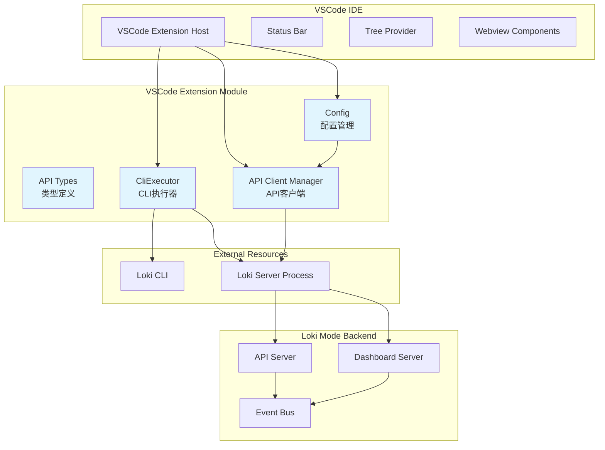
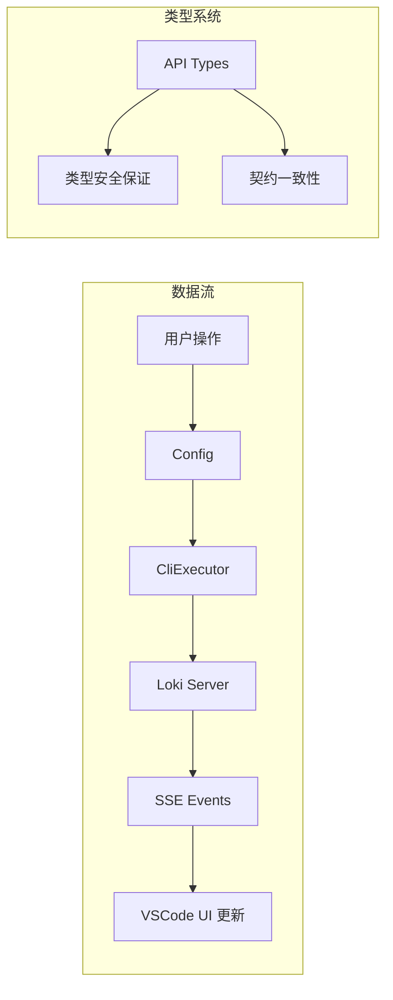
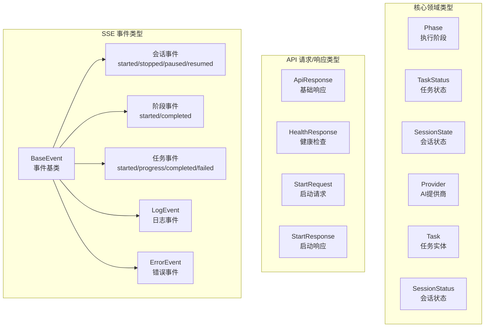
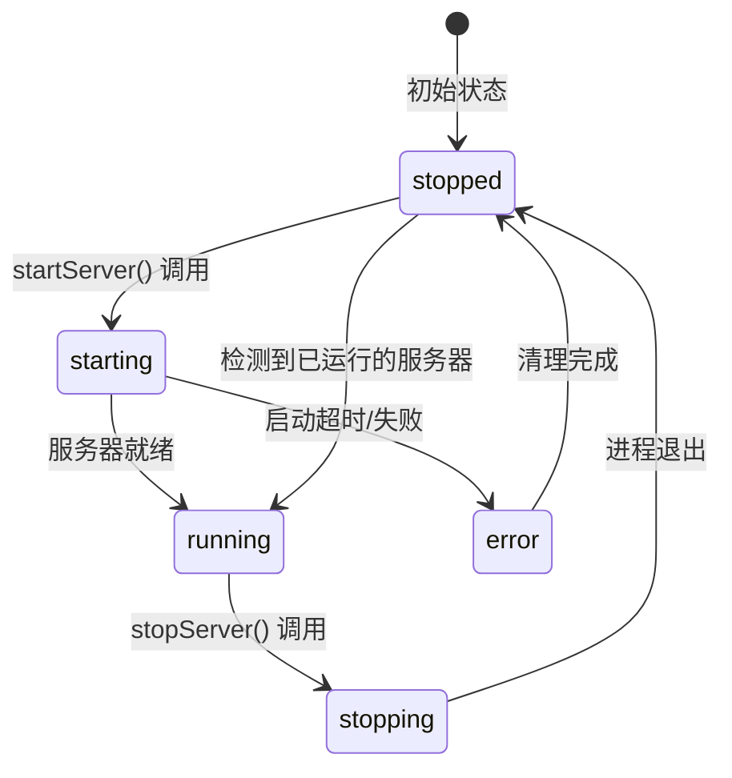
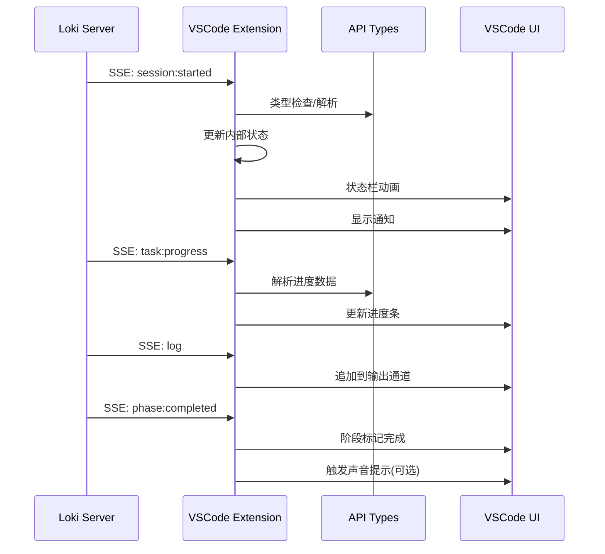

# VSCode Extension 模块

## 概述

VSCode Extension 模块是 Loki Mode 系统的 Visual Studio Code 扩展客户端，它为开发者提供了一个集成的开发环境接口，用于与 Loki Mode 自主开发系统进行交互。该扩展桥接了 VSCode IDE 与 Loki Mode 的后端服务，使开发者能够在熟悉的编辑器环境中管理 AI 辅助开发会话、监控任务执行进度、接收实时日志流，并控制整个开发工作流。

### 设计目标与核心价值

VSCode Extension 的设计源于以下关键需求：

1. **无缝 IDE 集成**：开发者无需离开 VSCode 即可启动、监控和管理 Loki Mode 会话，消除在终端、浏览器和编辑器之间频繁切换的上下文切换成本。

2. **实时状态可视化**：通过状态栏、侧边栏面板和通知系统，提供会话状态的持续可见性，包括当前执行阶段、活跃任务、待处理任务数量等关键指标。

3. **双向交互能力**：不仅接收来自 Loki Mode 后端的事件流（日志、进度更新、状态变更），还支持向会话发送输入指令，实现真正的人机协作开发模式。

4. **零配置启动**：通过自动检测 Loki CLI 安装位置、智能服务器启动和连接管理，最小化用户的配置负担。

5. **多提供商支持**：支持 Claude、Codex、Gemini 等多种 AI 提供商，允许开发者根据任务特性灵活切换模型。

### 在系统中的位置

VSCode Extension 位于 Loki Mode 架构的最前端，作为用户与系统交互的主要入口之一。它与以下模块紧密协作：

- **[API Server & Services](API Server & Services.md)**：通过 HTTP REST API 进行控制操作（启动、停止、暂停会话），通过 Server-Sent Events (SSE) 接收实时更新
- **[Dashboard Backend](Dashboard Backend.md)**：共享相同的数据模型和 API 契约，确保状态一致性
- **[Dashboard Frontend](Dashboard Frontend.md)**：作为替代性用户界面，VSCode Extension 提供轻量级的 IDE 内体验，而 Dashboard 提供更全面的 Web 界面
- **[Python SDK](Python SDK.md)** / **[TypeScript SDK](TypeScript SDK.md)**：可选的编程接口，VSCode Extension 内部实现了类似的 API 客户端功能

## 架构设计

### 整体架构图



### 组件职责划分



### 核心组件详解

#### 1. Config（配置管理）

`Config` 类是 VSCode Extension 的配置中心，提供对 VSCode 设置系统的类型安全访问。它封装了 `vscode.workspace.getConfiguration` API，为 Loki Mode 相关的所有配置项提供结构化访问。

**核心职责：**
- 提供默认配置值（API 端口、主机地址、轮询间隔等）
- 支持工作区和全局级别的配置作用域
- 监听配置变更事件，实现动态响应
- 提供便捷的配置更新方法

**关键设计决策：**
- 使用 TypeScript 的 `keyof` 约束确保配置键的类型安全
- 静态方法设计便于全局访问，无需实例化
- 配置节（Section）统一使用 `'loki'` 前缀，避免命名冲突

**使用示例：**
```typescript
// 读取配置
const provider = Config.provider; // 'claude' | 'codex' | 'gemini'
const apiUrl = Config.apiBaseUrl; // http://localhost:8080

// 更新配置
await Config.update('provider', 'gemini', vscode.ConfigurationTarget.Workspace);

// 监听变更
Config.onDidChange((e) => {
    if (Config.didChange(e, 'apiPort')) {
        // 重新初始化 API 客户端
    }
});
```

#### 2. API Types（类型定义）

`types.ts` 文件定义了整个扩展与 Loki Mode 后端交互所需的全部 TypeScript 接口。这些类型不仅服务于 VSCode Extension 内部使用，更重要的是确保与 [Dashboard Backend](Dashboard Backend.md) 的 API 契约保持一致。

**类型系统架构：**



**关键类型说明：**

**Phase（执行阶段）**
定义了 Loki Mode 工作流的标准阶段：idle → initializing → planning → implementing → testing → reviewing → deploying → completed/failed。每个会话在任一时刻只能处于一个阶段，阶段转换会触发 `phase:started` 和 `phase:completed` 事件。

**SessionStatus（会话状态）**
这是与 Dashboard Server 最关键的共享类型。它包含了服务器返回的完整状态信息：进程 ID、状态文本、当前阶段、当前任务、待处理任务数、使用的 AI 提供商等。扩展通过轮询或 SSE 持续接收此类型的数据来更新 UI。

**LokiEvent（事件联合类型）**
使用 TypeScript 的联合类型和 discriminated union 模式，确保事件处理的类型安全。每个事件都有明确的 `type` 字段作为判别式，配合 `EventCallbacks` 接口实现类型安全的事件订阅。

**版本兼容性注意事项：**
- 注释中明确标注了与 Dashboard Server 端点的对应关系（如 `matches dashboard/server.py /health endpoint`）
- 某些端点标注为 `PLANNED` 或 `deprecated`，提示实现状态

#### 3. CliExecutor（CLI 执行器）

`CliExecutor` 是 VSCode Extension 中最复杂的组件，负责管理 Loki CLI 进程的完整生命周期。它继承自 Node.js 的 `EventEmitter`，采用事件驱动架构通知调用方状态变更。

**状态机设计：**



**核心能力：**

**1. CLI 自动检测**
`ensureCliPath()` 方法实现了智能的 CLI 路径解析：
- 优先使用用户显式配置的路径
- 缓存检测结果避免重复文件系统操作
- 提供清晰的安装指导（npm、Homebrew 等）

**2. 服务器生命周期管理**
- **启动流程**：检查现有进程 → 生成子进程 → 监听输出流 → 等待健康检查 → 状态通知
- **停止流程**：发送 SIGTERM → 等待优雅退出 → 超时后 SIGKILL
- **状态缓冲**：收集 stdout/stderr 用于故障诊断

**3. 双重执行模式**
- `executeCommand()`：Promise-based，适合短时间命令
- `executeCommandStreaming()`：流式输出，适合长时间运行的任务

**事件系统：**

```typescript
export interface CliExecutorEvents {
    'server:starting': () => void;      // 开始启动
    'server:started': (port: number) => void;  // 启动成功
    'server:stopping': () => void;      // 开始停止
    'server:stopped': (code: number | null) => void;  // 已停止
    'server:error': (error: Error) => void;  // 错误发生
    'server:output': (data: string) => void; // stdout 输出
    'server:stderr': (data: string) => void; // stderr 输出
}
```

**错误处理策略：**
- 启动超时：可配置（默认 30 秒），超时后自动终止进程
- 进程崩溃：`exit` 事件处理，区分正常退出和异常终止
- 端口冲突：启动前主动检测，避免重复启动

**资源管理：**
`dispose()` 方法确保扩展停用时的资源清理，这是 VSCode Extension API 的最佳实践要求。

## 数据流与交互模式

### 会话启动流程

```mermaid
sequenceDiagram
    participant User as 用户
    participant Ext as VSCode Extension
    participant CFG as Config
    participant CLI as CliExecutor
    proc as Loki CLI
    participant Server as Loki Server
    participant API as Dashboard API
    
    User->>Ext: 点击"启动会话"
    Ext->>CFG: 读取配置 (provider, prdPath)
    CFG-->>Ext: 配置值
    Ext->>CLI: startServer()
    CLI->>CLI: ensureCliPath()
    CLI->>proc: spawn('loki', ['serve', '--port', port])
    proc->>Server: 启动进程
    
    loop 健康检查轮询
        CLI->>Server: HTTP GET /health
        Server-->>CLI: 200 OK
    end
    
    CLI-->>Ext: emit 'server:started'
    Ext->>API: POST /api/control/start
    API-->>Ext: StartResponse
    Ext->>Ext: 建立 SSE 连接
    Ext-->>User: 更新状态栏/UI
```

### 实时事件处理流程



## 配置参考

### 可用配置项

| 配置键 | 类型 | 默认值 | 描述 |
|--------|------|--------|------|
| `loki.provider` | `string` | `'claude'` | AI 提供商选择，可选值：claude、codex、gemini |
| `loki.apiPort` | `number` | `8080` | Loki API 服务器端口 |
| `loki.apiHost` | `string` | `'localhost'` | Loki API 服务器主机 |
| `loki.autoConnect` | `boolean` | `true` | 扩展激活时自动连接服务器 |
| `loki.showStatusBar` | `boolean` | `true` | 在状态栏显示 Loki 状态 |
| `loki.logLevel` | `string` | `'info'` | 日志级别：debug、info、warn、error |
| `loki.pollingInterval` | `number` | `5000` | 状态轮询间隔（毫秒）|
| `loki.prdPath` | `string` | `''` | 默认 PRD 文件路径 |

### 配置示例（settings.json）

```json
{
    "loki.provider": "claude",
    "loki.apiPort": 8080,
    "loki.autoConnect": true,
    "loki.showStatusBar": true,
    "loki.logLevel": "debug",
    "loki.pollingInterval": 3000,
    "loki.prdPath": "${workspaceFolder}/docs/prd.md"
}
```

## API 客户端使用模式

虽然提供的代码片段中未包含完整的 API 客户端实现，但基于 `types.ts` 中的定义，可以推断出标准的使用模式：

```typescript
// 伪代码示例，展示预期使用方式
class LokiApiClient {
    private baseUrl: string;
    private eventSource?: EventSource;
    private callbacks: Partial<EventCallbacks> = {};

    constructor(config: ApiClientConfig) {
        this.baseUrl = config.baseUrl;
    }

    // 启动会话
    async startSession(prd: string, provider?: Provider): Promise<StartResponse> {
        const request: StartRequest = { prd, provider };
        const response = await fetch(`${this.baseUrl}/api/control/start`, {
            method: 'POST',
            headers: { 'Content-Type': 'application/json' },
            body: JSON.stringify(request)
        });
        return response.json();
    }

    // 获取状态
    async getStatus(): Promise<SessionStatus> {
        const response = await fetch(`${this.baseUrl}/api/status`);
        return response.json();
    }

    // 订阅 SSE 事件
    connectEventStream(): void {
        this.eventSource = new EventSource(`${this.baseUrl}/api/events`);
        
        this.eventSource.onmessage = (event) => {
            const data: LokiEvent = JSON.parse(event.data);
            this.handleEvent(data);
        };
    }

    // 类型安全的事件处理
    private handleEvent(event: LokiEvent): void {
        switch (event.type) {
            case 'task:progress':
                this.callbacks['task:progress']?.(event);
                break;
            case 'log':
                this.callbacks['log']?.(event);
                break;
            // ... 其他事件类型
        }
    }

    // 类型安全的事件订阅
    on<K extends keyof EventCallbacks>(
        event: K, 
        callback: EventCallbacks[K]
    ): void {
        this.callbacks[event] = callback;
    }
}
```

## 错误处理与边界情况

### 常见错误场景

**1. CLI 未安装**
```
Error: Loki CLI not found. Please install it via npm (npm install -g loki-mode), 
Homebrew (brew install loki-mode), or specify the path in settings.
```
**处理建议**：检查 CLI 安装状态，或在 VSCode 设置中指定 `loki.cliPath`。

**2. 服务器启动超时**
可能原因：
- 端口被占用（Config 中配置的端口已被其他进程使用）
- CLI 版本不兼容
- 系统资源不足

**3. SSE 连接中断**
网络波动或服务器重启会导致 SSE 连接断开。健壮的实现应包含：
- 自动重连机制（指数退避）
- 连接状态指示
- 降级到轮询模式

**4. 类型不匹配**
当 Dashboard Backend 更新而 VSCode Extension 未同步更新时，可能出现运行时类型错误。建议：
- 使用 zod 或 io-ts 进行运行时类型验证
- 在开发模式下启用严格类型检查

### 调试技巧

1. **查看服务器输出**：通过 `CliExecutor.serverOutput` 和 `serverStderr` 获取原始输出
2. **启用调试日志**：设置 `loki.logLevel` 为 `'debug'`
3. **手动健康检查**：在浏览器访问 `http://localhost:8080/health`
4. **验证 CLI 路径**：在 VSCode 终端运行 `which loki` 或 `loki --version`

## 扩展开发指南

### 开发环境设置

```bash
# 克隆仓库
git clone <repository-url>
cd loki-mode/vscode-extension

# 安装依赖
npm install

# 编译
npm run compile

# 调试模式（在 VSCode 中按 F5）
# 这将打开一个新的 Extension Development Host 窗口
```

### 添加新的命令

1. 在 `package.json` 中声明命令：
```json
{
    "contributes": {
        "commands": [
            {
                "command": "loki.myNewCommand",
                "title": "Loki: My New Command"
            }
        ]
    }
}
```

2. 在 `src/extension.ts` 中注册处理函数：
```typescript
export function activate(context: vscode.ExtensionContext) {
    const disposable = vscode.commands.registerCommand('loki.myNewCommand', async () => {
        // 实现命令逻辑
        const config = Config.getAll();
        // ...
    });
    context.subscriptions.push(disposable);
}
```

### 添加新的事件类型

1. 在 `types.ts` 中定义事件接口：
```typescript
export interface MyCustomEvent extends BaseEvent {
    type: 'custom:event';
    data: {
        field1: string;
        field2: number;
    };
}
```

2. 更新联合类型：
```typescript
export type LokiEvent = 
    | // ... 现有类型
    | MyCustomEvent;
```

3. 更新回调接口：
```typescript
export interface EventCallbacks {
    // ... 现有回调
    'custom:event'?: (event: MyCustomEvent) => void;
}
```

## 与其他模块的关系

### 与 Dashboard Backend 的契约

VSCode Extension 与 [Dashboard Backend](Dashboard Backend.md) 保持严格的 API 契约一致性。任何 Dashboard Backend 的 API 变更都需要同步更新 `types.ts`：

- **状态模型**：`SessionStatus`、`Task` 等类型必须与 Dashboard Backend 的 Pydantic 模型保持字段一致
- **端点路径**：注释中标注了每个类型对应的 Dashboard Server 端点
- **响应格式**：区分直接返回和包装在 `ApiResponse` 中的响应

### 与 SDK 的关系

VSCode Extension 内部实现了轻量级的 API 客户端，功能上类似于 [TypeScript SDK](TypeScript SDK.md) 的子集。两者的区别：

| 特性 | VSCode Extension | TypeScript SDK |
|------|------------------|----------------|
| 目标环境 | VSCode Extension Host | 通用 Node.js/浏览器 |
| 依赖 | VSCode API | 无特殊依赖 |
| 功能范围 | 会话管理 + UI 集成 | 完整 API 覆盖 |
| 打包方式 | VSCode 插件包 | npm 包 |

在需要更复杂功能时，VSCode Extension 可以考虑依赖 TypeScript SDK 而非重复实现。

### 与 CLI 的集成

VSCode Extension 通过 `CliExecutor` 与 Loki CLI 紧密集成。这种设计允许：
- 从源代码构建的 CLI 开发版本进行测试
- 自动启动/停止服务器进程
- 捕获和分析 CLI 输出用于故障诊断

## 性能考虑

### 内存管理

- `CliExecutor` 的 `outputBuffer` 和 `stderrBuffer` 会持续增长，长时间运行的会话应考虑定期清理或限制缓冲区大小
- EventSource 连接在不使用时应关闭，避免内存泄漏

### 网络优化

- 轮询间隔（`pollingInterval`）默认为 5 秒，可根据网络条件调整
- SSE 连接相比轮询更高效，应优先使用

### UI 响应性

- 长时间运行的 CLI 命令应使用 `executeCommandStreaming` 避免阻塞 Extension Host
- 大量日志事件到达时应考虑节流（throttling）或批量处理

## 已知限制与未来改进

### 当前限制

1. **输入注入端点未实现**：`InputResponse` 标注为 `PLANNED`，目前无法通过 API 向运行中的会话发送输入
2. **单会话限制**：当前设计假设一次只能管理一个活跃会话
3. **本地服务器假设**：配置和实现都假设 Loki Server 在本地运行

### 建议改进方向

1. **远程服务器支持**：允许配置远程 Loki Server 地址
2. **多会话管理**：支持同时监控多个项目/会话
3. **历史记录持久化**：本地缓存会话历史，支持离线查看
4. **增强的 diff 视图**：集成 VSCode 的 diff 编辑器显示代码变更
5. **任务内联操作**：在编辑器内直接对 AI 生成的代码进行接受/拒绝操作

## 版本兼容性

| VSCode Extension 版本 | 兼容的 Loki CLI 版本 | 兼容的 Dashboard 版本 |
|----------------------|---------------------|----------------------|
| 0.1.x | 0.1.x | 0.1.x |

建议保持 CLI、Dashboard 和 VSCode Extension 的版本同步，以确保 API 契约的一致性。

## 参考资料

- [VSCode Extension API 文档](https://code.visualstudio.com/api)
- [Loki Mode Dashboard Backend](Dashboard Backend.md)
- [Loki Mode TypeScript SDK](TypeScript SDK.md)
- [Server-Sent Events 规范](https://html.spec.whatwg.org/multipage/server-sent-events.html)
