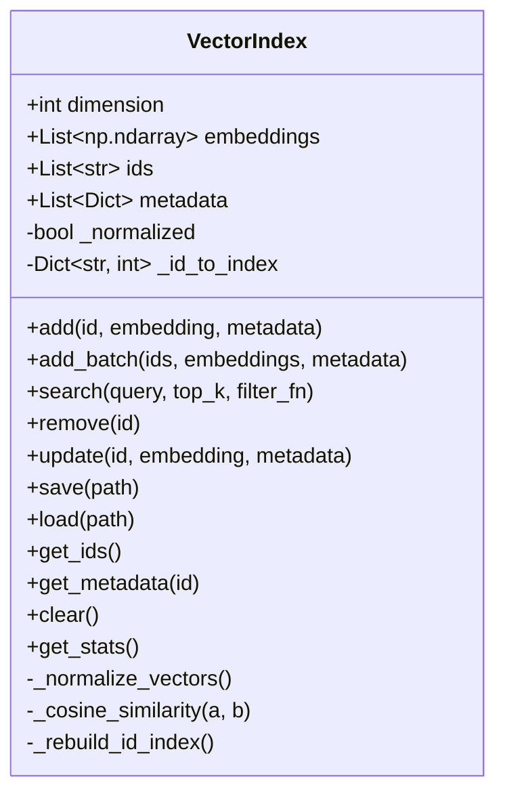

# Vector Index 模块文档

## 1. 模块概述

Vector Index 模块是一个基于纯 NumPy 的轻量级向量索引系统，专为内存系统的基于嵌入的搜索功能设计。该模块无需 FAISS 等外部依赖，提供高效的向量存储和检索能力，支持添加、搜索、更新和删除向量及其关联元数据。

### 1.1 设计目标
- **简洁性**：使用纯 NumPy 实现，避免复杂的外部依赖
- **高效性**：通过余弦相似度进行快速相似性搜索
- **灵活性**：支持单向量和批量操作，提供元数据关联能力
- **持久化**：支持索引的保存和加载，便于跨会话使用

### 1.2 核心特性
- 基于余弦相似度的相似性搜索
- 向量的增删改查操作
- 批量处理能力
- 元数据关联和过滤
- 索引持久化支持
- 内存使用统计

## 2. 核心组件详解

### 2.1 VectorIndex 类

`VectorIndex` 是模块的核心类，提供向量索引的完整功能实现。

#### 2.1.1 初始化

```python
def __init__(self, dimension: int = 384):
```

**功能**：创建一个新的向量索引实例。

**参数**：
- `dimension` (int, 默认=384)：向量的维度，默认值匹配 MiniLM 嵌入模型的输出维度。

**属性**：
- `dimension`：索引中向量的维度
- `embeddings`：存储的嵌入向量列表
- `ids`：每个向量的唯一标识符列表
- `metadata`：每个向量的元数据字典列表
- `_normalized`：标记向量是否已归一化的内部标志
- `_id_to_index`：ID 到索引位置的映射字典

#### 2.1.2 添加向量

##### 单向量添加

```python
def add(
    self,
    id: str,
    embedding: np.ndarray,
    metadata: Optional[Dict] = None
) -> None:
```

**功能**：向索引中添加单个向量。如果 ID 已存在，则更新现有条目。

**参数**：
- `id` (str)：向量的唯一标识符
- `embedding` (np.ndarray)：要添加的向量，必须与索引维度匹配
- `metadata` (Optional[Dict])：可选的元数据字典

**异常**：
- `ValueError`：当嵌入维度与索引维度不匹配时抛出

**工作流程**：
1. 验证嵌入维度是否正确
2. 检查 ID 是否已存在，如存在则调用更新操作
3. 将向量转换为 float32 类型并添加到列表
4. 更新 ID 到索引的映射
5. 标记归一化状态为 False

##### 批量添加

```python
def add_batch(
    self,
    ids: List[str],
    embeddings: np.ndarray,
    metadata: Optional[List[Dict]] = None
) -> None:
```

**功能**：高效地向索引中添加多个向量。

**参数**：
- `ids` (List[str])：唯一标识符列表
- `embeddings` (np.ndarray)：形状为 (n_vectors, dimension) 的 2D NumPy 数组
- `metadata` (Optional[List[Dict]])：可选的元数据字典列表

**异常**：
- `ValueError`：当 embeddings 不是 2D 数组时抛出
- `ValueError`：当嵌入维度与索引维度不匹配时抛出
- `ValueError`：当 IDs 数量与嵌入数量不匹配时抛出
- `ValueError`：当元数据数量与 IDs 数量不匹配时抛出

**工作流程**：
1. 验证输入参数的形状和数量匹配
2. 遍历每个向量，调用单向量添加方法

#### 2.1.3 搜索功能

```python
def search(
    self,
    query: np.ndarray,
    top_k: int = 5,
    filter_fn: Optional[Callable[[Dict], bool]] = None
) -> List[Tuple[str, float, Dict]]:
```

**功能**：查找与查询向量最相似的 top-k 个向量，使用余弦相似度进行排序。

**参数**：
- `query` (np.ndarray)：要搜索的查询向量
- `top_k` (int, 默认=5)：返回结果的最大数量
- `filter_fn` (Optional[Callable[[Dict], bool]])：可选的元数据过滤函数，返回 True 的条目会被包含在结果中

**返回值**：
- `List[Tuple[str, float, Dict]]`：按分数降序排列的 (id, score, metadata) 元组列表

**异常**：
- `ValueError`：当查询维度与索引维度不匹配时抛出

**工作流程**：
1. 处理空索引情况
2. 验证查询维度
3. 确保向量已归一化（如未归一化则自动执行）
4. 归一化查询向量
5. 将归一化的嵌入向量堆叠成矩阵以进行高效计算
6. 计算余弦相似度
7. 应用可选的元数据过滤
8. 按分数降序排序并返回 top-k 结果

**算法细节**：
- 余弦相似度计算：通过矩阵点积实现，避免了逐对计算的低效
- 归一化处理：在首次搜索时批量归一化所有向量，提升后续搜索性能
- 内存优化：使用 float32 类型存储向量，减少内存占用

#### 2.1.4 删除向量

```python
def remove(self, id: str) -> bool:
```

**功能**：通过 ID 从索引中删除向量。

**参数**：
- `id` (str)：要删除的向量的 ID

**返回值**：
- `bool`：如果找到并删除了向量则返回 True，否则返回 False

**工作流程**：
1. 检查 ID 是否存在
2. 从各列表中删除对应位置的元素
3. 重建 ID 到索引的映射
4. 标记归一化状态为 False

#### 2.1.5 更新向量

```python
def update(
    self,
    id: str,
    embedding: Optional[np.ndarray] = None,
    metadata: Optional[Dict] = None
) -> bool:
```

**功能**：更新索引中现有条目的嵌入向量或元数据。

**参数**：
- `id` (str)：要更新的向量的 ID
- `embedding` (Optional[np.ndarray])：可选的新嵌入向量
- `metadata` (Optional[Dict])：可选的新元数据（替换现有元数据）

**返回值**：
- `bool`：如果找到并更新了条目则返回 True，否则返回 False

**异常**：
- `ValueError`：当嵌入维度与索引维度不匹配时抛出

**工作流程**：
1. 检查 ID 是否存在
2. 如果提供了新嵌入，验证维度并更新
3. 如果提供了新元数据，替换现有元数据
4. 如更新了嵌入，标记归一化状态为 False

#### 2.1.6 持久化功能

##### 保存索引

```python
def save(self, path: str) -> None:
```

**功能**：将索引保存到磁盘，创建一个 .npz 文件存储嵌入向量，以及一个 .json 侧车文件存储元数据。

**参数**：
- `path` (str)：保存文件的基础路径（不包含扩展名）

**工作流程**：
1. 确保目标目录存在
2. 将嵌入向量堆叠成矩阵
3. 使用 np.savez 保存嵌入向量和维度信息
4. 将 IDs、元数据和维度信息保存为 JSON 侧车文件

**文件结构**：
- `{path}.npz`：包含 embeddings 和 dimension 数组
- `{path}.json`：包含 ids、metadata 和 dimension 字段

##### 加载索引

```python
def load(self, path: str) -> None:
```

**功能**：从磁盘加载索引。

**参数**：
- `path` (str)：保存文件的基础路径（不包含扩展名）

**异常**：
- `FileNotFoundError`：当索引文件不存在时抛出

**工作流程**：
1. 检查 .npz 和 .json 文件是否存在
2. 加载嵌入向量和维度信息
3. 加载 IDs 和元数据
4. 将嵌入矩阵转换为列表格式
5. 重建 ID 到索引的映射

##### 工厂方法

```python
@classmethod
def from_file(cls, path: str) -> "VectorIndex":
```

**功能**：创建并从文件加载索引的工厂方法。

**参数**：
- `path` (str)：保存文件的基础路径（不包含扩展名）

**返回值**：
- `VectorIndex`：从指定文件加载的 VectorIndex 实例

#### 2.1.7 辅助方法

##### 向量归一化

```python
def _normalize_vectors(self) -> None:
```

**功能**：归一化所有向量的副本以用于余弦相似度搜索，在搜索操作前自动调用。

**实现细节**：
- 创建向量的显式副本以避免损坏原始存储的嵌入
- 对每个向量进行 L2 归一化
- 存储归一化后的向量副本

##### 余弦相似度计算

```python
def _cosine_similarity(self, a: np.ndarray, b: np.ndarray) -> float:
```

**功能**：计算两个向量之间的余弦相似度。

**参数**：
- `a` (np.ndarray)：第一个向量
- `b` (np.ndarray)：第二个向量

**返回值**：
- `float`：-1 到 1 之间的余弦相似度分数

**特殊情况处理**：
- 当任一向量的范数为 0 时，返回 0.0 以避免除以零错误

##### ID 索引重建

```python
def _rebuild_id_index(self) -> None:
```

**功能**：在修改后重建 ID 到索引位置的映射。

##### 魔术方法

```python
def __len__(self) -> int:
```
返回索引中向量的数量。

```python
def __contains__(self, id: str) -> bool:
```
检查 ID 是否存在于索引中。

##### 查询方法

```python
def get_ids(self) -> List[str]:
```
返回索引中所有 ID 的列表。

```python
def get_metadata(self, id: str) -> Optional[Dict]:
```
获取特定 ID 的元数据，如果 ID 不存在则返回 None。

```python
def clear(self) -> None:
```
移除索引中的所有向量。

```python
def get_stats(self) -> Dict:
```
获取索引的统计信息，包括：
- `count`：向量数量
- `dimension`：向量维度
- `memory_bytes`：估计的内存使用量（字节）

## 3. 架构与依赖

### 3.1 内部架构

Vector Index 模块采用简单但有效的数据结构设计：



### 3.2 依赖关系

Vector Index 模块的依赖非常精简：

**外部依赖**：
- `numpy`：用于向量计算和存储
- `json`：用于元数据的序列化
- `os`：用于文件系统操作

**与其他模块的关系**：
- Vector Index 是 Memory System 的基础组件，为 [Memory Engine](Memory System.md) 提供向量检索能力
- 与 [Embeddings](Memory System.md) 模块协作，处理嵌入向量的存储和检索
- 为 [Unified Memory Access](Memory System.md) 提供底层索引支持

## 4. 使用指南

### 4.1 基本使用

#### 创建索引

```python
from memory.vector_index import VectorIndex
import numpy as np

# 创建默认维度（384）的索引
index = VectorIndex()

# 创建指定维度的索引
index = VectorIndex(dimension=512)
```

#### 添加向量

```python
# 添加单个向量
vector = np.random.rand(384)  # 随机生成384维向量
index.add(
    id="vector_1",
    embedding=vector,
    metadata={"type": "example", "category": "test"}
)

# 批量添加向量
ids = ["vector_2", "vector_3", "vector_4"]
embeddings = np.random.rand(3, 384)  # 3个384维向量
metadata_list = [
    {"type": "batch", "index": 0},
    {"type": "batch", "index": 1},
    {"type": "batch", "index": 2}
]
index.add_batch(ids, embeddings, metadata_list)
```

#### 搜索向量

```python
# 基本搜索
query = np.random.rand(384)
results = index.search(query, top_k=3)
for id, score, metadata in results:
    print(f"ID: {id}, Score: {score:.4f}, Metadata: {metadata}")

# 带过滤的搜索
def filter_function(metadata):
    return metadata.get("type") == "batch"

filtered_results = index.search(query, top_k=5, filter_fn=filter_function)
```

#### 更新和删除

```python
# 更新向量
new_vector = np.random.rand(384)
index.update(
    id="vector_1",
    embedding=new_vector,
    metadata={"type": "updated", "category": "test"}
)

# 只更新元数据
index.update(id="vector_1", metadata={"type": "metadata_only_update"})

# 删除向量
index.remove("vector_2")
```

#### 持久化

```python
# 保存索引
index.save("./my_vector_index")

# 加载索引
loaded_index = VectorIndex.from_file("./my_vector_index")

# 或创建空索引后加载
index = VectorIndex()
index.load("./my_vector_index")
```

### 4.2 高级功能

#### 索引统计

```python
stats = index.get_stats()
print(f"向量数量: {stats['count']}")
print(f"向量维度: {stats['dimension']}")
print(f"内存使用: {stats['memory_bytes'] / 1024 / 1024:.2f} MB")
```

#### 批量操作

```python
# 检查ID是否存在
if "vector_1" in index:
    print("向量存在")

# 获取所有ID
all_ids = index.get_ids()

# 获取特定ID的元数据
metadata = index.get_metadata("vector_1")

# 获取索引大小
size = len(index)

# 清空索引
index.clear()
```

## 5. 性能考量

### 5.1 时间复杂度

| 操作 | 时间复杂度 | 说明 |
|------|-----------|------|
| add | O(1) | 单向量添加 |
| add_batch | O(n) | n为添加的向量数量 |
| search | O(m * d + m log m) | m为索引中向量数量，d为维度 |
| remove | O(m) | 需要重建索引映射 |
| update | O(1) | 仅更新操作 |

### 5.2 空间复杂度

- 存储 m 个 d 维向量需要 O(m * d) 的空间
- 额外的元数据存储取决于元数据内容
- 归一化向量副本需要额外 O(m * d) 的空间（仅在搜索时创建）

### 5.3 优化建议

1. **批量操作**：使用 `add_batch` 而不是多次调用 `add`，可以提高效率
2. **维度选择**：根据实际需求选择合适的维度，更高的维度会增加计算和存储成本
3. **索引大小**：对于非常大的数据集（>100万向量），考虑使用更专业的向量索引库如 FAISS
4. **持久化频率**：根据更新频率合理选择保存时机，避免频繁的磁盘I/O操作

## 6. 注意事项与限制

### 6.1 边缘情况

1. **空索引搜索**：当索引为空时，搜索返回空列表，不会抛出异常
2. **零向量处理**：零向量的余弦相似度计算会返回 0.0，避免除以零错误
3. **重复ID**：添加重复ID会自动触发更新操作，而不是创建新条目
4. **元数据过滤**：过滤函数返回 False 的条目会被完全排除在结果之外

### 6.2 限制

1. **可扩展性**：对于超大规模数据集（>100万向量），性能可能不如专业的向量索引库
2. **索引更新**：删除操作需要重建索引映射，对于频繁删除的场景可能不够高效
3. **并发安全**：当前实现不提供线程安全保证，多线程环境下需要外部同步机制
4. **近似搜索**：不支持近似最近邻搜索，始终执行精确搜索

### 6.3 错误处理

模块使用标准的 Python 异常机制：

- `ValueError`：用于输入验证失败的情况
- `FileNotFoundError`：用于加载时文件不存在的情况

建议在使用时适当捕获这些异常并进行处理。

## 7. 相关模块

Vector Index 模块是 Memory System 的重要组成部分，与以下模块密切相关：

- [Memory System](Memory System.md)：了解 Vector Index 在整个内存系统中的位置和作用
- [Embeddings](Memory System.md)：了解如何生成适合 Vector Index 使用的嵌入向量
- [Memory Retrieval](Memory System.md)：了解 Vector Index 如何被用于高级检索策略

## 8. 总结

Vector Index 模块提供了一个轻量级但功能完整的向量索引解决方案，特别适合中小规模数据集的相似性搜索需求。其简洁的设计、无需外部依赖（除 NumPy 外）的特点使其易于集成和部署。虽然在超大规模数据集上可能不如专业库高效，但对于大多数应用场景，它提供了良好的性能和功能平衡。

通过本模块，开发者可以轻松实现向量存储、检索和持久化功能，为各种基于语义相似度的应用提供基础支持。
