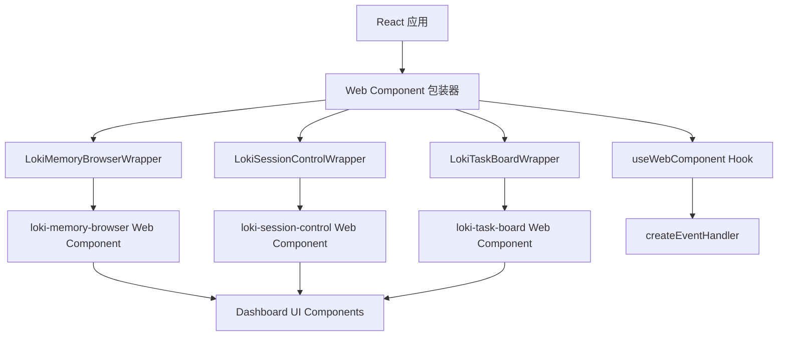
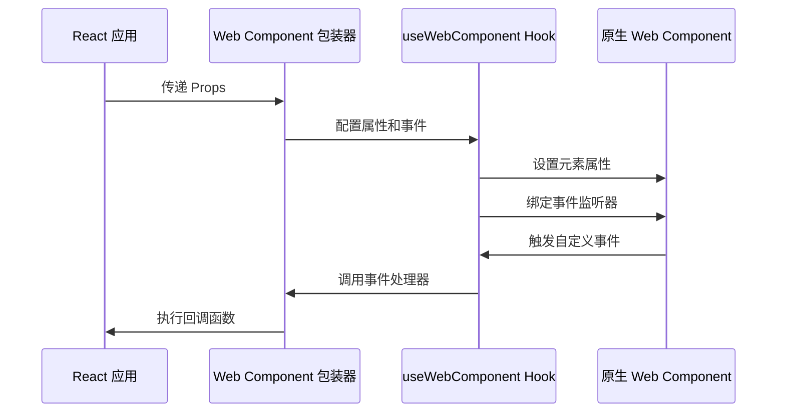

# Web Component 包装器模块文档

## 目录
1. [模块概述](#模块概述)
2. [核心组件](#核心组件)
3. [架构设计](#架构设计)
4. [使用指南](#使用指南)
5. [类型定义](#类型定义)
6. [高级用法](#高级用法)
7. [注意事项与最佳实践](#注意事项与最佳实践)

---

## 模块概述

### 什么是 Web Component 包装器模块？

Web Component 包装器模块是 Dashboard Frontend 系统中的关键组件，它为 Dashboard UI Components 模块中提供的原生 Web Components 提供了类型安全的 React 接口。该模块解决了在 React 应用中直接使用 Web Components 时可能遇到的类型检查、事件处理和属性绑定问题。

### 设计理念

本模块的设计遵循以下原则：

1. **类型安全**：提供完整的 TypeScript 类型定义，确保在编译时捕获错误
2. **无缝集成**：保持 React 的声明式编程风格，同时暴露 Web Component 的全部功能
3. **性能优化**：只在必要时更新属性和事件处理器
4. **可维护性**：代码结构清晰，易于扩展和维护

### 在系统中的位置

Web Component 包装器模块位于 Dashboard Frontend 架构的中间层：
- **底层**：Dashboard UI Components 提供的原生 Web Components
- **中间层**：本模块，提供 React 包装
- **顶层**：Dashboard Frontend 中的其他 React 组件和应用

---

## 核心组件

### 1. LokiMemoryBrowserWrapper

**文件位置**：`dashboard/frontend/src/components/wrappers/LokiMemoryBrowserWrapper.tsx`

#### 功能描述

LokiMemoryBrowserWrapper 是 `loki-memory-browser` Web Component 的 React 包装器，提供对记忆系统的浏览界面，包括摘要、片段、模式和技能四个标签页。

#### 组件 Props

| 属性名 | 类型 | 默认值 | 描述 |
|--------|------|--------|------|
| `apiUrl` | `string` | `'http://localhost:57374'` | API 基础 URL |
| `theme` | `ThemeName` | `'light'` | 主题名称 |
| `tab` | `MemoryBrowserTab` | `'summary'` | 初始激活标签页 |
| `onEpisodeSelect` | `(episode: Episode) => void` | - | 片段选择回调 |
| `onPatternSelect` | `(pattern: Pattern) => void` | - | 模式选择回调 |
| `onSkillSelect` | `(skill: Skill) => void` | - | 技能选择回调 |
| `className` | `string` | - | 额外的 CSS 类名 |
| `style` | `React.CSSProperties` | - | 内联样式 |

#### 使用示例

```tsx
<LokiMemoryBrowserWrapper
  apiUrl="http://localhost:57374"
  theme="dark"
  tab="episodes"
  onEpisodeSelect={(episode) => {
    console.log('Selected episode:', episode.id);
  }}
  onPatternSelect={(pattern) => {
    console.log('Selected pattern:', pattern.pattern);
  }}
  onSkillSelect={(skill) => {
    console.log('Selected skill:', skill.name);
  }}
/>
```

---

### 2. LokiSessionControlWrapper

**文件位置**：`dashboard/frontend/src/components/wrappers/LokiSessionControlWrapper.tsx`

#### 功能描述

LokiSessionControlWrapper 是 `loki-session-control` Web Component 的 React 包装器，提供会话控制面板，支持开始、暂停、恢复和停止会话功能。

#### 组件 Props

| 属性名 | 类型 | 默认值 | 描述 |
|--------|------|--------|------|
| `apiUrl` | `string` | `'http://localhost:57374'` | API 基础 URL |
| `theme` | `ThemeName` | `'light'` | 主题名称 |
| `compact` | `boolean` | `false` | 是否显示紧凑版控制面板 |
| `onSessionStart` | `(detail: SessionEventDetail) => void` | - | 会话开始回调 |
| `onSessionPause` | `(detail: SessionEventDetail) => void` | - | 会话暂停回调 |
| `onSessionResume` | `(detail: SessionEventDetail) => void` | - | 会话恢复回调 |
| `onSessionStop` | `(detail: SessionEventDetail) => void` | - | 会话停止回调 |
| `className` | `string` | - | 额外的 CSS 类名 |
| `style` | `React.CSSProperties` | - | 内联样式 |

#### 使用示例

```tsx
<LokiSessionControlWrapper
  apiUrl="http://localhost:57374"
  theme="dark"
  compact={false}
  onSessionStart={(status) => {
    console.log('Session started:', status.mode);
  }}
  onSessionStop={(status) => {
    console.log('Session stopped');
  }}
/>
```

---

### 3. LokiTaskBoardWrapper

**文件位置**：`dashboard/frontend/src/components/wrappers/LokiTaskBoardWrapper.tsx`

#### 功能描述

LokiTaskBoardWrapper 是 `loki-task-board` Web Component 的 React 包装器，提供看板风格的任务管理界面。

#### 组件 Props

| 属性名 | 类型 | 默认值 | 描述 |
|--------|------|--------|------|
| `apiUrl` | `string` | `'http://localhost:57374'` | API 基础 URL |
| `projectId` | `string` | - | 按项目 ID 过滤任务 |
| `theme` | `ThemeName` | `'light'` | 主题名称 |
| `readonly` | `boolean` | `false` | 是否禁用拖放和编辑 |
| `onTaskMoved` | `(detail: TaskMovedEventDetail) => void` | - | 任务移动回调 |
| `onAddTask` | `(detail: AddTaskEventDetail) => void` | - | 添加任务回调 |
| `onTaskClick` | `(detail: TaskClickEventDetail) => void` | - | 任务点击回调 |
| `className` | `string` | - | 额外的 CSS 类名 |
| `style` | `React.CSSProperties` | - | 内联样式 |

#### 使用示例

```tsx
<LokiTaskBoardWrapper
  apiUrl="http://localhost:57374"
  projectId="1"
  theme="dark"
  onTaskMoved={({ taskId, oldStatus, newStatus }) => {
    console.log(`Task ${taskId} moved from ${oldStatus} to ${newStatus}`);
  }}
  onTaskClick={({ task }) => {
    openTaskModal(task);
  }}
/>
```

---

## 架构设计

### 整体架构图



### 组件工作流程



### 关键技术点

1. **useWebComponent Hook**：负责管理 Web Component 的生命周期、属性更新和事件绑定
2. **createEventHandler**：处理 Web Component 自定义事件到 React 回调函数的转换
3. **类型扩展**：通过扩展 JSX.IntrinsicElements 使 TypeScript 识别自定义元素
4. **条件事件绑定**：只在提供回调函数时才绑定对应的事件监听器

---

## 使用指南

### 基本使用步骤

1. **导入所需的包装器组件**
```typescript
import { LokiMemoryBrowserWrapper } from './components/wrappers/LokiMemoryBrowserWrapper';
import { LokiSessionControlWrapper } from './components/wrappers/LokiSessionControlWrapper';
import { LokiTaskBoardWrapper } from './components/wrappers/LokiTaskBoardWrapper';
```

2. **在 JSX 中使用包装器**
```tsx
function MyDashboard() {
  return (
    <div>
      <LokiSessionControlWrapper />
      <LokiTaskBoardWrapper />
      <LokiMemoryBrowserWrapper />
    </div>
  );
}
```

3. **配置属性和事件处理器**
```tsx
function MyDashboard() {
  const handleTaskMoved = (detail) => {
    console.log('Task moved:', detail);
  };

  return (
    <LokiTaskBoardWrapper
      theme="dark"
      onTaskMoved={handleTaskMoved}
    />
  );
}
```

### 常见用例

#### 1. 集成到现有 React 应用

```tsx
import React from 'react';
import { LokiTaskBoardWrapper } from './components/wrappers/LokiTaskBoardWrapper';

const App: React.FC = () => {
  return (
    <div className="app-container">
      <header>My Application</header>
      <main>
        <LokiTaskBoardWrapper
          apiUrl={process.env.REACT_APP_API_URL}
          theme="dark"
        />
      </main>
    </div>
  );
};

export default App;
```

#### 2. 响应式布局

```tsx
import React from 'react';
import { LokiMemoryBrowserWrapper } from './components/wrappers/LokiMemoryBrowserWrapper';
import { LokiSessionControlWrapper } from './components/wrappers/LokiSessionControlWrapper';

const ResponsiveDashboard: React.FC = () => {
  return (
    <div className="responsive-grid">
      <div className="control-panel">
        <LokiSessionControlWrapper compact={true} />
      </div>
      <div className="main-content">
        <LokiMemoryBrowserWrapper />
      </div>
    </div>
  );
};
```

---

## 类型定义

### 共享类型

#### ThemeName

```typescript
export type ThemeName =
  | 'light'
  | 'dark'
  | 'high-contrast'
  | 'vscode-light'
  | 'vscode-dark';
```

### LokiMemoryBrowserWrapper 特定类型

#### Episode

```typescript
export interface Episode {
  id: string;
  taskId?: string;
  agent?: string;
  phase?: string;
  outcome?: 'success' | 'failure' | 'partial';
  timestamp: string;
  durationSeconds?: number;
  tokensUsed?: number;
  goal?: string;
  actionLog?: Array<{
    t: number;
    action: string;
    target: string;
  }>;
}
```

#### Pattern

```typescript
export interface Pattern {
  id: string;
  pattern: string;
  category?: string;
  confidence: number;
  usageCount?: number;
  conditions?: string[];
  correctApproach?: string;
  incorrectApproach?: string;
}
```

#### Skill

```typescript
export interface Skill {
  id: string;
  name: string;
  description?: string;
  prerequisites?: string[];
  steps?: string[];
  exitCriteria?: string[];
}
```

#### MemoryBrowserTab

```typescript
export type MemoryBrowserTab = 'summary' | 'episodes' | 'patterns' | 'skills';
```

### LokiSessionControlWrapper 特定类型

#### SessionEventDetail

```typescript
export interface SessionEventDetail {
  mode: string;
  phase: string | null;
  iteration: number | null;
  complexity: string | null;
  connected: boolean;
  version: string | null;
  uptime: number;
  activeAgents: number;
  pendingTasks: number;
}
```

### LokiTaskBoardWrapper 特定类型

#### Task

```typescript
export interface Task {
  id: number | string;
  title: string;
  description?: string;
  status: 'pending' | 'in_progress' | 'review' | 'done';
  priority?: 'critical' | 'high' | 'medium' | 'low';
  type?: string;
  project_id?: number;
  assigned_agent_id?: number;
  isLocal?: boolean;
  createdAt?: string;
  updatedAt?: string;
}
```

#### TaskMovedEventDetail

```typescript
export interface TaskMovedEventDetail {
  taskId: number | string;
  oldStatus: string;
  newStatus: string;
}
```

#### AddTaskEventDetail

```typescript
export interface AddTaskEventDetail {
  status: string;
}
```

#### TaskClickEventDetail

```typescript
export interface TaskClickEventDetail {
  task: Task;
}
```

---

## 高级用法

### 自定义主题

```tsx
import React from 'react';
import { LokiTaskBoardWrapper, ThemeName } from './components/wrappers/LokiTaskBoardWrapper';

const ThemedComponent: React.FC = () => {
  const [theme, setTheme] = React.useState<ThemeName>('light');

  const toggleTheme = () => {
    setTheme(prev => prev === 'light' ? 'dark' : 'light');
  };

  return (
    <div>
      <button onClick={toggleTheme}>Toggle Theme</button>
      <LokiTaskBoardWrapper theme={theme} />
    </div>
  );
};
```

### 与状态管理集成

```tsx
import React from 'react';
import { useSelector, useDispatch } from 'react-redux';
import { LokiMemoryBrowserWrapper } from './components/wrappers/LokiMemoryBrowserWrapper';
import { selectEpisode } from './store/actions';

const ReduxIntegratedComponent: React.FC = () => {
  const dispatch = useDispatch();
  const apiUrl = useSelector(state => state.config.apiUrl);

  const handleEpisodeSelect = (episode) => {
    dispatch(selectEpisode(episode));
  };

  return (
    <LokiMemoryBrowserWrapper
      apiUrl={apiUrl}
      onEpisodeSelect={handleEpisodeSelect}
    />
  );
};
```

### 错误处理和加载状态

```tsx
import React, { useState, useEffect } from 'react';
import { LokiSessionControlWrapper } from './components/wrappers/LokiSessionControlWrapper';

const ErrorHandlingComponent: React.FC = () => {
  const [isLoading, setIsLoading] = useState(true);
  const [hasError, setHasError] = useState(false);

  useEffect(() => {
    // 模拟 API 检查
    const checkApi = async () => {
      try {
        await fetch('http://localhost:57374/health');
        setIsLoading(false);
      } catch (error) {
        setHasError(true);
        setIsLoading(false);
      }
    };

    checkApi();
  }, []);

  if (isLoading) {
    return <div>Loading...</div>;
  }

  if (hasError) {
    return <div>API connection failed. Please check your settings.</div>;
  }

  return <LokiSessionControlWrapper />;
};
```

---

## 注意事项与最佳实践

### 性能优化

1. **避免不必要的重渲染**：使用 React.memo 包装使用这些组件的父组件
2. **事件处理器优化**：使用 useCallback 包装事件处理器，避免不必要的事件重新绑定
3. **条件渲染**：只在需要时渲染组件

```tsx
import React, { useCallback, memo } from 'react';
import { LokiTaskBoardWrapper } from './components/wrappers/LokiTaskBoardWrapper';

const OptimizedComponent = memo(() => {
  const handleTaskMoved = useCallback((detail) => {
    console.log('Task moved:', detail);
  }, []);

  return (
    <LokiTaskBoardWrapper onTaskMoved={handleTaskMoved} />
  );
});
```

### 错误处理

1. **API 连接检查**：在使用组件前检查 API 连接状态
2. **错误边界**：使用 React 错误边界捕获可能的错误
3. **降级体验**：提供组件不可用时的降级体验

```tsx
import React, { Component, ReactNode } from 'react';

class ErrorBoundary extends Component<
  { children: ReactNode },
  { hasError: boolean }
> {
  constructor(props: { children: ReactNode }) {
    super(props);
    this.state = { hasError: false };
  }

  static getDerivedStateFromError() {
    return { hasError: true };
  }

  componentDidCatch(error: Error, errorInfo: React.ErrorInfo) {
    console.error('Web Component error:', error, errorInfo);
  }

  render() {
    if (this.state.hasError) {
      return <div>Something went wrong. Please refresh the page.</div>;
    }
    return this.props.children;
  }
}

// 使用方式
<ErrorBoundary>
  <LokiMemoryBrowserWrapper />
</ErrorBoundary>
```

### 兼容性考虑

1. **浏览器支持**：确保目标浏览器支持 Web Components 或提供 polyfill
2. **主题一致性**：保持应用其他部分的主题与这些组件的主题一致
3. **无障碍访问**：确保组件在无障碍环境下正常工作

### 调试技巧

1. **检查 Web Component 加载**：在浏览器开发者工具中确认 Web Component 已正确注册
2. **事件监听**：使用 Chrome DevTools 的 Event Listeners 面板检查事件是否正确绑定
3. **属性检查**：使用 Elements 面板检查元素属性是否正确设置

---

## 相关模块

- [Dashboard UI Components](Dashboard UI Components.md) - 提供底层 Web Component 实现
- [Dashboard Frontend](Dashboard Frontend.md) - 包含这些包装器组件的父模块
- [类型定义](类型定义.md) - 了解更多类型定义信息

## 更新日志

| 版本 | 日期 | 变更内容 |
|------|------|----------|
| 1.0.0 | 2024-01-01 | 初始版本，包含三个核心包装器组件 |
