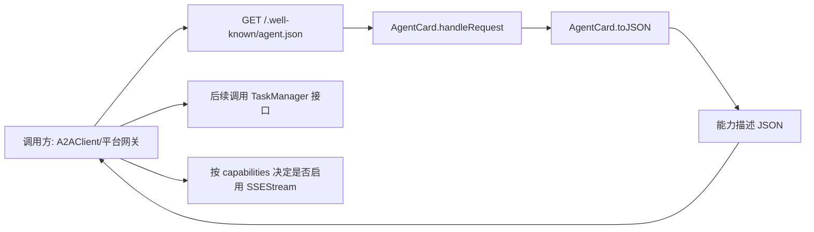
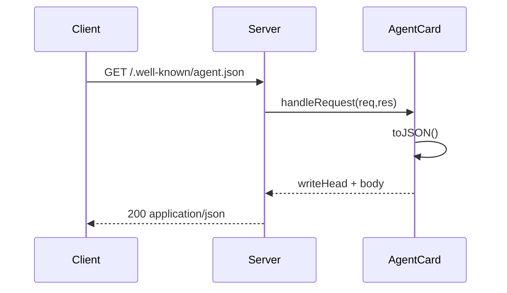
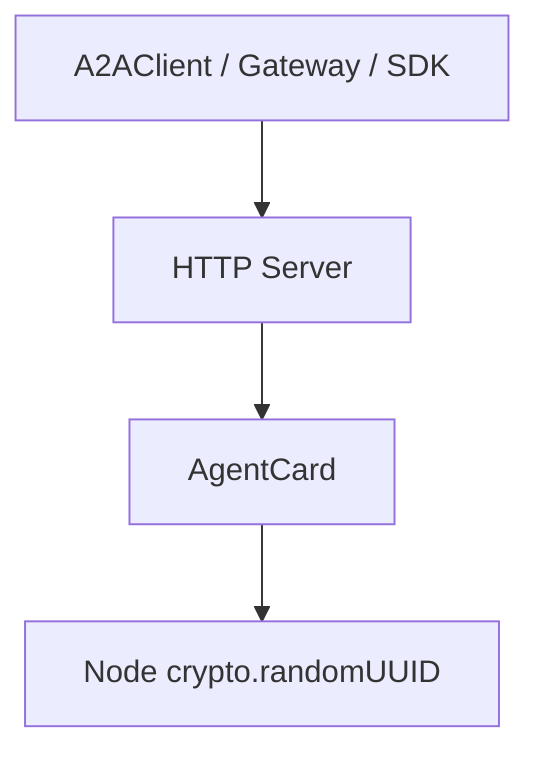
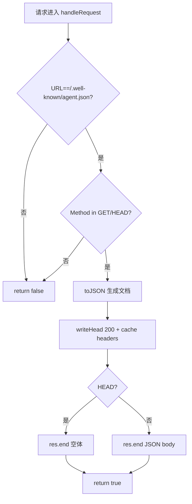

# agent_discovery_card 模块文档

## 模块概述

`agent_discovery_card` 是 A2A（Agent-to-Agent）协议中的“能力发现入口”模块，对应实现为 `src/protocols/a2a/agent-card.js` 里的 `AgentCard` 类。它的核心职责是将当前 Agent 的身份、能力、认证方式与输入输出模式，以标准 JSON 文档形式暴露在 `/.well-known/agent.json` 路径下，供其他 Agent、控制平面、SDK 客户端或网关做自动发现（discovery）与协商（capability negotiation）。

这个模块存在的意义在于把“Agent 会什么、怎么调用、支持哪些协议特性”从隐式约定变成显式契约。如果没有 Agent Card，调用方通常只能依赖硬编码或人工文档来判断目标 Agent 的能力，导致集成脆弱、版本升级成本高、跨团队协作困难。`AgentCard` 通过统一的发现端点使得系统可以在运行时识别能力边界，尤其适用于多 Agent 编排和跨系统接入场景。

在当前代码中，`AgentCard` 采用“轻量、零依赖（除 Node.js 内置 `crypto`）”设计：一方面提供默认技能集与默认认证方案，使本地开发或最小部署即刻可用；另一方面允许调用方通过构造参数覆盖名称、URL、版本、技能与认证策略，以适配生产环境的差异化发布。

---

## 在整体系统中的位置

在模块树中，本模块位于：`A2A Protocol -> agent_discovery_card`，并与以下子模块协同工作：

- 远程调用端：`remote_agent_client`（`src.protocols.a2a.client.A2AClient`）
- 流式事件层：`sse_event_streaming`（`src.protocols.a2a.streaming.SSEStream`）
- 任务生命周期：`task_lifecycle_management`（`src.protocols.a2a.task-manager.TaskManager`）

`AgentCard` 本身不负责执行任务、维护会话或传输流式结果。它只负责“告诉外部：我是谁、我支持什么”。因此它是 A2A 交互链路中的第 0 步（Discovery Step）。



上图体现了该模块的边界：它不承担任务处理逻辑，但直接影响后续调用路径选择，例如调用方会基于 `capabilities.streaming` 决定是否建立流式订阅。

如需深入了解后续调用行为，请参考：

- [A2A Protocol - A2AClient.md](A2A Protocol - A2AClient.md)
- [A2A Protocol - SSEStream.md](A2A Protocol - SSEStream.md)
- [A2A Protocol - TaskManager.md](A2A Protocol - TaskManager.md)

---

## 核心组件：`AgentCard`

### 设计职责

`AgentCard` 将内部状态（名称、版本、技能、鉴权方案、流式能力等）组织为可序列化 JSON，并提供一个便捷的 HTTP 请求处理入口 `handleRequest(req, res)`。这使得它可以非常容易地被嵌入 Node.js 原生 `http` 服务或任何支持兼容请求对象的框架中。

### 构造函数

```javascript
new AgentCard(opts)
```

构造参数（`opts`）支持：

- `name?: string`：Agent 展示名，默认 `"Loki Mode"`
- `description?: string`：Agent 描述，默认 `"Multi-agent autonomous system by Autonomi"`
- `url?: string`：Agent 基地址，默认 `"http://localhost:8080"`
- `version?: string`：版本号，默认 `"1.0.0"`
- `skills?: object[]`：技能列表，默认使用 `DEFAULT_SKILLS`
- `authSchemes?: string[]`：认证方案列表，默认 `DEFAULT_AUTH_SCHEMES`
- `streaming?: boolean`：是否支持流式；只有显式传 `false` 才会禁用
- `id?: string`：Agent 标识；未传则使用 `crypto.randomUUID()` 自动生成

内部字段初始化规则值得注意：

1. 当 `skills` 未传时，使用 `DEFAULT_SKILLS.slice()`，这是数组浅拷贝。
2. 当 `skills` 已传时，直接引用调用方传入数组，不做深拷贝。
3. `streaming` 的判断是 `opts.streaming !== false`，因此 `undefined`、`null`、`0` 都会被视为“开启”。
4. `id` 默认随机生成，意味着重启后默认会变化，除非显式固定。

---

## 默认常量

### `DEFAULT_SKILLS`

该常量内置四个技能：

- `prd-to-product`
- `code-review`
- `testing`
- `deployment`

每个技能包含 `id`、`name`、`description`，作为开箱即用能力声明。它们更像“示例/默认能力模板”，并不自动绑定真实后端执行器；实际可执行性仍取决于 TaskManager 与业务实现。

### `DEFAULT_AUTH_SCHEMES`

默认认证方案：

- `bearer`
- `api-key`

这些值是能力声明，不等同于服务端已经完成对应鉴权中间件配置。也就是说，声明与真实安全策略可能发生偏差，部署时应保证一致性。

---

## 关键方法详解

### `toJSON()`

`toJSON()` 将对象状态转换为标准 JSON 结构，返回值大致如下：

```json
{
  "id": "...",
  "name": "Loki Mode",
  "description": "...",
  "url": "http://localhost:8080",
  "version": "1.0.0",
  "capabilities": {
    "streaming": true,
    "pushNotifications": false,
    "stateTransitionHistory": true
  },
  "skills": [
    { "id": "prd-to-product", "name": "PRD to Product", "description": "..." }
  ],
  "authentication": {
    "schemes": ["bearer", "api-key"]
  },
  "defaultInputModes": ["text/plain", "application/json"],
  "defaultOutputModes": ["text/plain", "application/json"]
}
```

该方法的实现特点：

- `skills` 使用 `map` 重新构建对象，避免直接泄露内部对象引用。
- `authentication.schemes` 使用 `slice()` 复制数组，降低外部修改内部状态的风险。
- `capabilities.pushNotifications` 当前硬编码为 `false`，`stateTransitionHistory` 硬编码为 `true`。

副作用方面，`toJSON()` 本身是纯读取，不修改内部状态。

### `handleRequest(req, res)`

该方法用于拦截并响应 Agent Card 请求。

**触发条件**：

- `req.url === '/.well-known/agent.json'`
- 且 `req.method` 为 `GET` 或 `HEAD`

满足条件后：

1. 调用 `toJSON()` 构造响应体。
2. 设置 `200` 状态码与响应头：
   - `Content-Type: application/json`
   - `Content-Length: ...`
   - `Cache-Control: public, max-age=3600`
3. 对 `GET` 返回完整 JSON；对 `HEAD` 仅返回 headers。
4. 返回 `true` 表示已处理。

若不满足条件，返回 `false`，调用方可继续走其他路由。



这个方法的价值是“可组合路由风格”：主服务可先调用 `card.handleRequest(req, res)`，若返回 `false` 再交给业务路由处理。

### `addSkill(skill)`

`addSkill` 支持运行时扩展技能。其校验逻辑非常直接：`skill`、`skill.id`、`skill.name` 任一缺失会抛出 `Error('Skill requires id and name')`。通过校验后会向内部 `_skills` 追加对象，`description` 缺失时补空字符串。

该方法是有副作用的，会改变后续 `toJSON()` 输出。

### 只读访问器

- `getSkills()`：返回 `this._skills.slice()` 的浅拷贝数组。
- `getName()`：返回 `_name`。
- `getUrl()`：返回 `_url`。
- `getId()`：返回 `_id`。

注意 `getSkills()` 仅复制数组容器，不深拷贝技能对象本身；若调用方修改返回数组中的对象字段，可能影响内部状态一致性（取决于对象引用来源）。

---

## 组件关系与依赖

从代码级别看，本模块仅依赖 Node 内置 `crypto`。从协议级别看，它是 A2A 子系统中的发现元数据提供者。



这种依赖结构有两个好处：

第一，部署简单，不引入第三方库，适配性强。第二，可在多种运行环境中复用（原生 `http`、轻量网关、测试桩服务）。

---

## 使用方式

### 最小集成示例（Node.js http）

```javascript
const http = require('http');
const { AgentCard } = require('./src/protocols/a2a/agent-card');

const card = new AgentCard({
  name: 'My Agent',
  url: 'https://agent.example.com',
  version: '2.3.1',
});

http.createServer((req, res) => {
  if (card.handleRequest(req, res)) return;

  // 其他业务路由
  if (req.url === '/health') {
    res.writeHead(200, { 'Content-Type': 'text/plain' });
    return res.end('ok');
  }

  res.writeHead(404);
  res.end('not found');
}).listen(8080);
```

### 自定义技能与认证方案

```javascript
const card = new AgentCard({
  name: 'Delivery Agent',
  authSchemes: ['bearer'],
  skills: [
    { id: 'deploy', name: 'Deployment', description: 'Blue/green deploy with verification' }
  ],
  streaming: true,
  id: 'agent-delivery-prod-001'
});

card.addSkill({ id: 'rollback', name: 'Rollback', description: 'One-click rollback' });
```

### 配置建议

生产环境中建议将以下字段做显式配置而非依赖默认值：

- `id`：保持稳定，避免重启后身份漂移。
- `url`：填写公网可访问地址或服务发现地址。
- `authSchemes`：与真实鉴权机制一致。
- `skills`：只声明真实可执行能力，避免“过度承诺”。

---

## 行为约束、边界条件与常见坑

`handleRequest` 使用严格的 URL 全等判断，因此带查询串的 `/.well-known/agent.json?x=1` 不会命中，末尾斜杠变体也不会命中。若前置代理会改写路径，需在网关层做兼容处理或在外层路由先归一化路径。

方法匹配仅接受大写 `GET`、`HEAD`。虽然 Node.js 通常会提供大写方法，但在某些测试桩或非标准适配层中如果方法名大小写不一致，将无法命中。

`skills` 输入缺乏去重机制。重复 `id` 会被允许写入，这可能让调用方在能力协商时出现歧义。若你的系统依赖技能 ID 唯一性，建议在上层封装去重校验。

当通过构造参数传入 `skills` 时，类内部会直接引用外部数组对象；外部后续修改该数组，可能影响 AgentCard 行为。若需要强隔离，建议在调用前自行深拷贝，或者扩展该类在构造阶段执行防御性复制。

`authSchemes` 与 `capabilities` 都是声明层信息，不自动驱动真实服务策略。例如声明 `bearer` 并不会自动启用 token 验证；声明 `streaming: true` 也不代表流式链路（`SSEStream`）已正确部署。部署检查应由启动自检或集成测试补充。

---

## 可扩展性建议

如果你要在此模块之上做扩展，推荐优先保持 `toJSON()` 输出结构向后兼容，因为外部生态（客户端、网关、目录服务）通常会对字段名建立依赖。可选策略包括：

- 通过新增字段扩展，而不是重命名/删除既有字段。
- 在 `capabilities` 中加入可选能力标志（例如实验性能力）。
- 对 `skills` 增加 schema 校验（如唯一 ID、描述长度、分类标签）。
- 在 `handleRequest` 增加 `ETag`/`Last-Modified` 支持以优化缓存一致性。

如果需要更完整的协议交互链路说明，建议联动阅读 A2A 其他模块文档，而不是在本文件重复描述执行态细节：

- [A2A Protocol.md](A2A Protocol.md)
- [A2A Protocol - A2AClient.md](A2A Protocol - A2AClient.md)
- [A2A Protocol - SSEStream.md](A2A Protocol - SSEStream.md)
- [A2A Protocol - TaskManager.md](A2A Protocol - TaskManager.md)

---

## 导出接口一览

本模块导出：

- `AgentCard`
- `DEFAULT_SKILLS`
- `DEFAULT_AUTH_SCHEMES`

其中 `AgentCard` 是核心运行时组件；两个 `DEFAULT_*` 常量主要用于默认配置与上层复用。

---

## 方法签名与行为速查

为了便于维护者快速定位接口语义，下面给出 `AgentCard` 对外方法的输入、输出与副作用总结。这里是“实现语义”的压缩视图，详细背景请结合上文阅读。

- `constructor(opts?: object)`：输入可选配置对象，输出 `AgentCard` 实例。副作用是初始化内部状态；若未提供 `id`，会调用 `crypto.randomUUID()` 生成随机标识。
- `toJSON(): object`：无参数，输出 A2A discovery 文档对象。该方法无内部状态写入，但每次调用都会重新构造返回对象。
- `handleRequest(req: object, res: object): boolean`：输入 HTTP 请求与响应对象；当命中 `GET/HEAD /.well-known/agent.json` 时写入响应并返回 `true`，否则不修改响应并返回 `false`。这是最主要的 I/O 副作用入口。
- `addSkill(skill: object): void`：输入技能对象，若缺失 `id` 或 `name` 抛错；成功时向内部 `_skills` 追加技能，影响后续 `toJSON()` 输出。
- `getSkills(): object[]`：输出技能数组浅拷贝（数组拷贝，不是对象深拷贝）。
- `getName(): string`、`getUrl(): string`、`getId(): string`：只读访问器，无副作用。



上图可用于排查“为何 discovery 端点没生效”的问题：只要 URL 或 Method 有任何不匹配，函数就会直接返回 `false`，不会抛错，也不会写日志，因此建议在外层路由加监控与追踪。

---

## 结论

`agent_discovery_card` 模块是 A2A 协议体系中的基础设施组件，代码体量小但系统价值高。它把 Agent 能力声明标准化，并通过固定发现路径显式暴露，为跨 Agent 互操作提供了必要前提。在实践中，建议把它视为“协议契约层”而非“业务执行层”：前者强调准确声明与稳定格式，后者由 TaskManager、流式传输与具体执行引擎负责。只要保持声明与实际行为一致，这个模块就能显著降低多 Agent 集成成本与认知摩擦。
