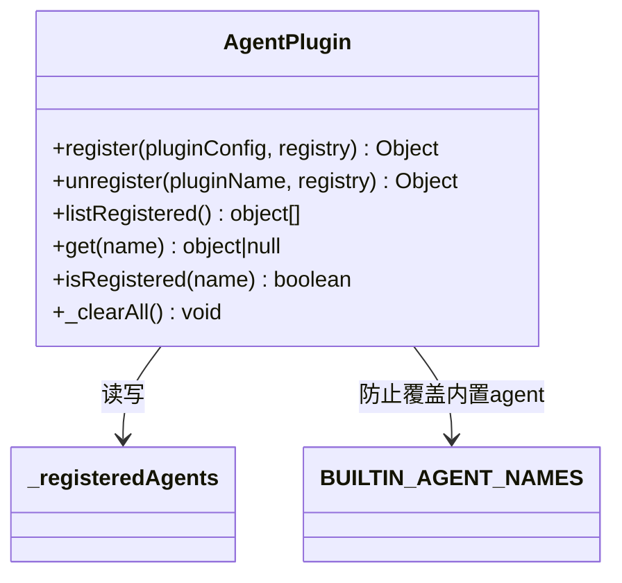
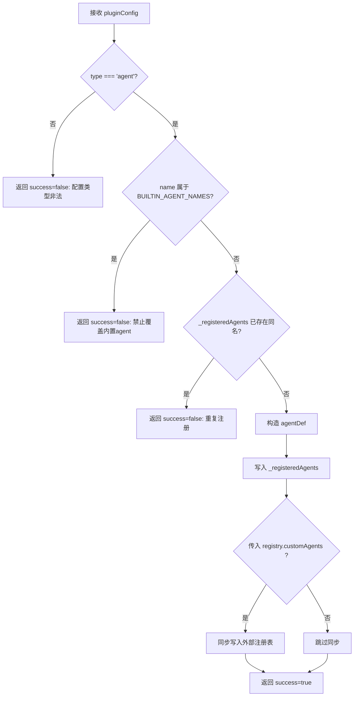
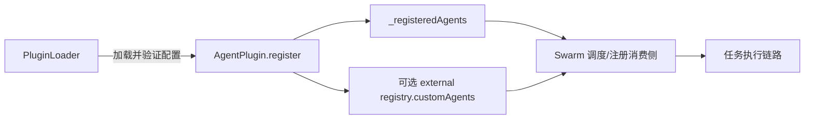

# agent_extension 模块文档

## 模块定位与设计动机

`agent_extension` 是 Plugin System 中“智能体扩展”这一子模块，对应核心实现 `src.plugins.agent-plugin.AgentPlugin`。它的职责不是运行智能体本身，而是提供一个安全、可控、可查询的**自定义智能体注册层**，让系统在不修改内置智能体代码的前提下扩展新的 agent 类型。

从架构上看，这个模块解决了两个现实问题。第一，团队往往需要按项目、业务域快速增加专用智能体（例如“代码审查代理”“数据标注代理”），如果每次都改核心代码，会导致发布链路重、风险高。第二，系统必须保护内置能力不被插件覆盖，否则调度层和策略层会因为语义漂移产生不可预测行为。`AgentPlugin` 通过“只增不改”的注册策略，在扩展性与稳定性之间做了明确取舍。

需要特别注意的是：该模块当前是**内存态注册表**，不负责持久化，也不负责插件文件发现/解析。这些职责分别在 `PluginLoader` 和更上层编排逻辑中完成（参考 [Plugin System.md](Plugin System.md)、[PluginLoader.md](PluginLoader.md)）。

---

## 核心组件：`AgentPlugin`

### 组件概览

`AgentPlugin` 是一个纯静态类，内部使用模块级 `Map`（`_registeredAgents`）维护所有已注册的自定义智能体定义。它提供注册、注销、枚举、按名查询、存在性判断，以及用于测试的清空能力。



上图展示了这个模块的最小依赖面：核心状态是 `_registeredAgents`，核心约束来自 `BUILTIN_AGENT_NAMES`（由 `./validator` 提供）。这意味着该模块本身轻量、低耦合，但也因此把“配置合法性”的大部分责任留给调用方或上游 validator。

---

## 内部数据模型与兼容性语义

`register()` 会将输入配置转换为统一的 `agentDef` 结构，并声明为 `type: 'custom'`。这个转换步骤非常关键，因为它把外部插件配置映射到“可被下游消费的稳定格式”（代码注释称其兼容 swarm registry format）。

```javascript
{
  name: string,
  type: 'custom',
  category: string,          // 默认 'custom'
  description: string,
  prompt_template: string,
  trigger: any | null,       // 默认 null
  quality_gate: boolean,     // 默认 false
  capabilities: string[],    // 默认 []
  registered_at: string      // ISO 时间戳
}
```

该结构的设计意图是把“插件声明”和“运行期可路由元数据”合并。例如 `category`、`capabilities` 常用于调度筛选；`quality_gate` 会影响与质量门策略的衔接；`registered_at` 则有助于审计、调试和变更追踪。

---

## 方法级深度说明

## `register(pluginConfig, registry)`

`register` 是入口方法。它先做最小校验（`pluginConfig.type` 必须是 `agent`），再执行两道保护：

1. 不能与 `BUILTIN_AGENT_NAMES` 重名（禁止覆盖系统内置智能体）；
2. 不能与已注册自定义智能体重名（禁止重复注册）。

通过校验后，它会构造 `agentDef` 并写入 `_registeredAgents`。如果调用方传入外部 `registry` 且包含 `customAgents` 对象，还会把同一份定义同步写入 `registry.customAgents[name]`。

返回值采用统一结果对象：

- 成功：`{ success: true }`
- 失败：`{ success: false, error: string }`

**副作用与行为要点：**

- 会修改模块级内存状态（进程内共享）。
- 会写入当前时间（`registered_at`），同名重试时不会更新而是直接失败。
- 外部注册表同步是“尽力而为”的浅耦合，不做深验证、也不回滚。

### `unregister(pluginName, registry)`

`unregister` 先判断目标是否存在，不存在直接返回失败。存在时从 `_registeredAgents` 删除，并在可用时同步删除 `registry.customAgents[pluginName]`。

返回结构与 `register` 一致。

这个方法的语义偏“幂等失败显式化”：对不存在项不会静默成功，而是返回错误，便于运维脚本或控制面发现状态偏差。

### `listRegistered()`

返回当前所有已注册自定义智能体定义数组（`Array.from(_registeredAgents.values())`）。

因为返回的是对象引用数组（非深拷贝），调用方如果直接修改对象字段，会影响内部状态可见性；生产代码建议把它视为只读数据，必要时自行深拷贝。

### `get(name)`

按名称读取单个定义，不存在返回 `null`。适合在调度前做快速能力发现或参数拼装。

与 `listRegistered()` 一样，返回对象不是防变更副本。

### `isRegistered(name)`

只做存在性判断，返回布尔值。适用于“注册前探测”或健康检查路径。

### `_clearAll()`

清空全部自定义智能体，主要用于测试隔离。由于它是公开静态方法（仅靠命名约定标注“内部使用”），生产代码应避免误调用。

---

## 关键流程

### 注册流程



这个流程体现了模块的“保守写入原则”：只有在约束都通过时才发生状态变更，失败路径都以结构化错误返回，不抛异常。

### 与系统其他模块的交互



`agent_extension` 不处理文件系统与热加载，而是作为注册原语被上游调用；下游（例如 Swarm 多智能体调度）消费注册后的 agent 定义。这样分层后，每层边界更清晰：加载、注册、调度分别独立演进。

---

## 使用方式与实践示例

### 最小注册示例

```javascript
const { AgentPlugin } = require('./src/plugins/agent-plugin');

const config = {
  type: 'agent',
  name: 'security-reviewer',
  description: 'Security focused review agent',
  prompt_template: 'Review code for vulnerabilities: {{code}}'
};

const result = AgentPlugin.register(config);
if (!result.success) {
  console.error(result.error);
}
```

### 与外部注册表协同

```javascript
const registry = { customAgents: {} };

AgentPlugin.register({
  type: 'agent',
  name: 'perf-analyzer',
  category: 'analysis',
  description: 'Performance analysis agent',
  prompt_template: 'Analyze performance bottlenecks: {{input}}',
  capabilities: ['profiling', 'optimization']
}, registry);

console.log(registry.customAgents['perf-analyzer']);
```

### 查询与注销

```javascript
if (AgentPlugin.isRegistered('perf-analyzer')) {
  const def = AgentPlugin.get('perf-analyzer');
  console.log(def?.capabilities);

  AgentPlugin.unregister('perf-analyzer');
}
```

---

## 配置契约与字段建议

虽然该模块仅强制校验 `type === 'agent'`，但在工程实践中建议把以下字段视为“事实必填”，避免下游运行时失败：

- `name`：唯一标识，且不得与内置 agent 重名。
- `description`：用于 UI/审计可读性。
- `prompt_template`：多数 agent 执行路径依赖该字段。

建议字段：

- `category`：便于调度分组与可视化筛选。
- `capabilities`：便于能力路由。
- `trigger`：用于事件/规则触发场景。
- `quality_gate`：与质量控制策略联动时开启。

---

## 边界条件、错误场景与限制

`agent_extension` 的错误是“返回式”而非“异常式”。调用方必须检查 `success`，不能假设失败会抛错。常见失败原因包括配置类型非法、覆盖内置名、重复注册、注销不存在项。

另一个高频陷阱是**状态持久性预期**。`_registeredAgents` 完全驻留内存，进程重启后状态清空。如果你需要跨重启保留插件，必须在启动时重新加载并注册（通常通过 `PluginLoader`）。

还要注意**并发一致性**：当前实现没有显式锁机制。Node.js 单进程事件循环下通常足够，但在多进程/多实例部署中，不同实例的注册表彼此独立，必须借助集中式配置源或控制面同步。

最后是**可变引用暴露**问题：`get` / `listRegistered` 返回内部对象引用，外部可直接改写字段。若系统要求强不可变语义，可在调用层做深拷贝，或在未来版本为该模块增加 defensive copy。

---

## 可扩展点与演进建议

当前 `AgentPlugin` 足够简洁，但如果你的场景进入大规模多租户或高审计要求，可以考虑以下演进方向：

- 将内存注册表替换为可持久化后端（数据库/配置中心），并保留本地缓存。
- 增加 schema 级字段校验（例如 `name` 格式、`prompt_template` 非空、`capabilities` 类型约束）。
- 为 `register/unregister` 增加审计事件发射，接入 Audit 与 Observability。
- 提供只读快照 API，避免引用被外部意外修改。

---

## 测试与运维建议

单元测试中应在 `beforeEach/afterEach` 调用 `AgentPlugin._clearAll()`，确保测试隔离，避免用例间状态污染。

运维脚本建议使用如下顺序：先 `isRegistered` 探测，再决定 `register/unregister`，并将 `error` 字段写入日志，避免把业务错误误判为系统异常。

---

## 与其他文档的关系（避免重复阅读）

- 若你想了解插件系统全貌与统一生命周期，请先读 [Plugin System.md](Plugin System.md)。
- 若你关注插件文件发现、解析、热加载，请读 [PluginLoader.md](PluginLoader.md)。
- 若你关注自定义 agent 在多智能体调度中的消费方式，请读 [Swarm Multi-Agent.md](Swarm Multi-Agent.md)。
- 若你关注质量门策略如何与 agent 扩展联动，请读 [Policy Engine.md](Policy Engine.md) 与 [GatePlugin.md](GatePlugin.md)。
