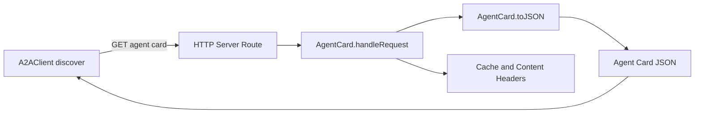

# agent_identity_and_discovery

`agent_identity_and_discovery` 模块的核心是 `src.protocols.a2a.agent-card.AgentCard`。如果把 A2A 系统想成一个“多代理互联网”，那 `AgentCard` 就是这个代理对外公开的“服务名片 + 能力声明”。没有这张名片，其他代理只能盲猜你是谁、会什么、怎么认证、是否支持流式事件。这个模块存在的意义，就是把这些“握手前必须知道的信息”标准化为 `/.well-known/agent.json`，从而让发现（discovery）和互操作（interoperability）变成一个稳定、低成本的流程。

## 这个模块解决了什么问题（先讲问题，再讲实现）

在 A2A 场景里，一个代理在调用另一个代理之前，至少要回答四个问题：

1. 目标是谁（稳定 ID、名称、版本、URL）？
2. 它能做什么（skills）？
3. 我该怎么认证（authentication schemes）？
4. 任务生命周期怎么观测（是否支持 streaming、状态历史等能力）？

朴素做法通常是“把这些信息写在文档里”或者“靠调用方硬编码配置”。这在单体系统里还能勉强运转，但到了多代理、跨团队、跨环境部署时会迅速失效：文档过期、配置漂移、能力变更无法自动感知。

`AgentCard` 的设计洞察是：**把代理身份与能力声明做成机器可读、可缓存、可被标准 URL 自动发现的协议对象**。这样调用方（例如客户端 SDK 或远程编排器）可以先 discovery 再 invocation，而不是直接盲调业务接口。

## 心智模型：把它当作“机场塔台公开的进场说明”

可以把 `AgentCard` 想成机场塔台对外发布的 ATIS/进场说明：

- 飞机（调用方）在降落前，不会直接冲向跑道（业务接口）；
- 它先拉取当前机场能力与规则（agent card）；
- 再决定用什么通道、什么程序、能否走实时链路。

对应到代码：

- `AgentCard` 是**能力声明源**（source of truth for advertised capabilities）。
- `toJSON()` 是**协议序列化器**。
- `handleRequest(req, res)` 是**发现端点适配器**（把内部状态暴露为标准 HTTP 发现端点）。

它在架构角色上不是任务执行器，也不是编排器；更像是 A2A 协议层的“身份与能力网关”。

## 架构与数据流



关键路径其实很短，但语义很重：

1. 调用侧（例如 `A2AClient.discover(agentUrl)`）会拼出 `/.well-known/agent.json` 并发 GET。
2. 服务侧 HTTP 层把请求交给 `AgentCard.handleRequest(req, res)`。
3. `handleRequest` 仅在 URL 精确等于 `/.well-known/agent.json` 且方法是 `GET`/`HEAD` 时接管。
4. 接管后调用 `toJSON()` 生成标准对象，再 `JSON.stringify(..., null, 2)` 输出。
5. 响应头包含：`Content-Type: application/json`、`Content-Length`、`Cache-Control: public, max-age=3600`。
6. `HEAD` 只回头不回体；`GET` 回完整卡片。若不匹配条件，返回 `false` 交给上层路由继续处理。

这条链路背后的契约是：**发现必须廉价、稳定、幂等**。因此实现里没有副作用型业务逻辑，几乎全是声明式输出。

## 组件深潜

### `AgentCard`（class）

`AgentCard` 维护一组私有字段（`_name/_description/_url/_version/_skills/_authSchemes/_streaming/_id`），并对外提供序列化、HTTP 处理和最小的技能管理。

构造函数接受 `opts`，全部可选：`name/description/url/version/skills/authSchemes/streaming/id`。默认值设计有两个明显目标：

- **开箱即用**：不给参数也能马上跑起来（默认名称、默认技能、默认认证）。
- **快速对接 A2A 客户端**：默认 `streaming` 开启（`opts.streaming !== false`），符合“有实时能力优先声明”的策略。

其中 `_id` 默认使用 `crypto.randomUUID()`。这是一种“无需中心协调的唯一标识”策略，降低部署复杂度。

### `toJSON()`

这是模块最核心的方法，负责输出代理卡片结构。它做了几件关键的小事：

- 对 `skills` 做映射，仅暴露 `id/name/description`，避免把内部对象的多余字段泄漏出去。
- 对 `authentication.schemes` 用 `slice()` 返回副本，避免外部拿到引用后反向修改内部状态。
- 固定输出 `defaultInputModes/defaultOutputModes` 为 `['text/plain', 'application/json']`，保障基础互操作。
- 固定 `capabilities.pushNotifications = false`、`stateTransitionHistory = true`，让调用方得到确定性语义。

返回值是普通对象（非字符串）；字符串化与传输留给上层（`handleRequest`）完成，职责分离清晰。

### `handleRequest(req, res)`

这个方法把 `AgentCard` 从“数据对象”变成“协议端点”：

- 输入：HTTP `req/res`。
- 输出：`boolean`，表示是否已处理。
- 副作用：写入响应头/体。

返回 `boolean` 是一个很实用的路由组合模式：上层 server 可以按“谁能处理谁处理”的链式方式组织，而无需复杂路由框架。

同时它支持 `HEAD`，这对探活、缓存预热、元信息检查都很友好。

### `addSkill(skill)` / `getSkills()` / `getName()` / `getUrl()` / `getId()`

`addSkill` 只做最小校验（`id`、`name` 必填），然后追加到 `_skills`。这体现了模块定位：它是协议声明层，不是完整的能力注册中心。

`getSkills` 返回副本，防止外部直接篡改内部数组；其余 getter 只读暴露身份字段，供上层组装日志、监控标签或调试信息。

### `DEFAULT_SKILLS` 与 `DEFAULT_AUTH_SCHEMES`

两个默认常量保证“零配置可发现”。尤其在本地开发、PoC、CI 环境里，能减少大量初始化样板代码。

## 依赖与契约分析

从代码看，`AgentCard` 本身依赖非常轻：

- Node 内置 `crypto`（用于 `randomUUID`）。
- HTTP 语义依赖 `req/res` 具备 Node 风格接口（`url`、`method`、`writeHead`、`end`）。

它几乎不主动调用其他业务模块，因此耦合很低。真正的“连接性”体现在协议层契约：

- 调用方（例如 `A2AClient.discover`）**期望** `/.well-known/agent.json` 返回 JSON 能力卡。
- 任务与流式模块（见 [A2A Protocol - TaskManager](A2A Protocol - TaskManager.md)、[A2A Protocol - SSEStream](A2A Protocol - SSEStream.md)）在语义上依赖这些能力声明，但在当前代码中没有看到它们直接 import `AgentCard` 的强耦合调用。

换句话说，这里是**通过协议字段解耦**，而不是通过代码引用耦合。

相关参考：

- [A2A Protocol - A2AClient](A2A Protocol - A2AClient.md)
- [A2A Protocol - TaskManager](A2A Protocol - TaskManager.md)
- [A2A Protocol - SSEStream](A2A Protocol - SSEStream.md)
- [A2A Protocol](A2A Protocol.md)

## 关键设计取舍（tradeoffs）

这个模块明显偏向“简单且稳定”的策略，而不是“可配置到极致”。

第一，**简单性 > 高度灵活性**。能力字段是半固定的，输入输出模式也是固定数组。好处是互操作稳定；代价是新能力类型要改代码，不是纯配置即可。

第二，**低耦合 > 强一致编排**。`AgentCard` 不验证 skills 与真实执行能力是否一致，也不检查 auth scheme 是否真的实现。这样模块边界干净，但系统正确性需要靠集成测试和发布流程兜底。

第三，**运行时便利 > 身份稳定性默认保障**。默认 UUID 在未显式传 `id` 时每次实例化可能变化。对短生命周期服务无伤，但若外部把 `id` 当长期主键，会造成“重启即新身份”的问题。

第四，**缓存性能 > 实时准确**。`max-age=3600` 明确偏向缓存友好。如果你运行时会频繁变更 `skills` 或 `authSchemes`，调用方可能在 1 小时内读到旧卡片。

## 新贡献者最该注意的坑

最常见的坑是把 `AgentCard` 当“真相校验器”。它不是。它只是“声明发布器”。你声明了 `streaming: true`，并不代表流接口一定可用；声明了 `api-key`，也不代表后端真的启用了 API key 验证。

另一个隐蔽点是 `handleRequest` 的路径匹配是严格 `req.url === '/.well-known/agent.json'`。如果上游网关把查询串保留在 `req.url`（如 `/.well-known/agent.json?v=1`），它会返回 `false`，导致 404。接入反向代理时要特别检查。

`addSkill` 不去重。重复 `id` 会被直接加入数组，最终卡片可能出现语义冲突。若你在运行时动态注册技能，建议在调用层先做唯一性约束。

最后，`_skills` 默认是 `DEFAULT_SKILLS.slice()`，这避免了默认数组被实例间共享污染；但如果你通过 `opts.skills` 传入的是可变数组对象，后续外部仍可能持有并修改它。需要严格隔离时，在构造前自行深拷贝。

## 使用示例

```javascript
const http = require('http');
const { AgentCard } = require('./src/protocols/a2a/agent-card');

const card = new AgentCard({
  name: 'Autonomi Agent',
  url: 'https://agent.example.com',
  authSchemes: ['bearer'],
  streaming: true,
  id: 'agent-prod-01' // 生产建议显式提供稳定 id
});

card.addSkill({
  id: 'triage',
  name: 'Issue Triage',
  description: 'Classify and route incoming issues'
});

const server = http.createServer((req, res) => {
  if (card.handleRequest(req, res)) return;

  res.writeHead(404, { 'Content-Type': 'text/plain' });
  res.end('Not Found');
});

server.listen(8080);
```

如果你只需要对象（而非 HTTP 处理），可以直接调用 `toJSON()` 并交给自己的 Web 框架响应层。
