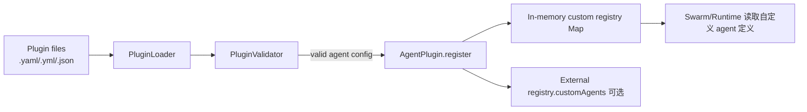
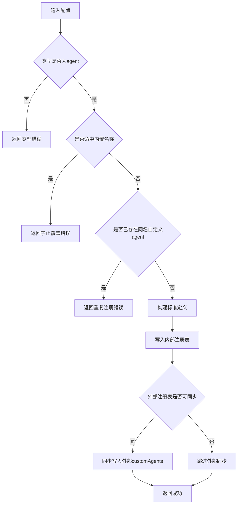
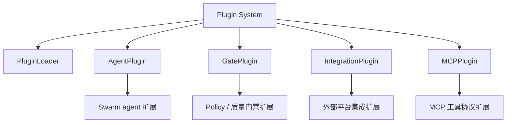

# agent_plugin 模块文档

## 模块定位与设计动机

`agent_plugin`（核心实现为 `src/plugins/agent-plugin.AgentPlugin`）是 Plugin System 中专门负责“自定义 Agent 类型注册”的轻量运行时组件。它存在的主要原因是：系统内置了一组稳定的 Agent 类型（用于保证 Swarm 协作和基础能力），但实际业务经常需要按团队场景扩展新的角色、提示词模板和能力集合。`AgentPlugin` 通过“仅增量扩展、不允许覆盖内置类型”的策略，在可扩展性与系统安全性之间做了平衡。

从架构职责上看，这个模块不处理插件文件扫描，也不负责 schema 校验；这两部分由 `PluginLoader` 及其验证器链路承担。`AgentPlugin` 的职责被刻意收敛为：接收已经过校验的配置、执行冲突检查、转换为统一 agent 定义、写入内存注册表、并可选同步到外部 registry。这种分层设计让它本身足够简单、可测、低耦合。

---

## 在系统中的位置



上图描述了典型链路：插件文件的发现和解析来自 `PluginLoader`，验证通过后才进入 `AgentPlugin`。因此你可以把 `AgentPlugin` 理解为“运行时注册层”，而不是“配置加载层”。若你需要了解目录扫描、YAML/JSON 解析、watch 机制，请参考 [PluginLoader.md](PluginLoader.md) 与 [plugin_discovery_and_loading.md](plugin_discovery_and_loading.md)。

---

## 核心数据结构与状态模型

`AgentPlugin` 内部只有一个模块级状态：

```javascript
const _registeredAgents = new Map();
```

这个 `Map` 的 key 是插件名（`name`），value 是标准化后的 agent 定义对象。该状态有三个重要语义：

1. 它是**进程内内存态**，不会自动持久化。
2. 它是**跨调用共享的单例状态**（因为是模块级变量 + 静态类方法）。
3. 它只存“custom agent”，不存内置 agent。

标准化后写入 `Map` 的对象结构如下：

```javascript
{
  name: string,
  type: 'custom',
  category: string,         // 默认 custom
  description: string,
  prompt_template: string,
  trigger: any | null,      // 默认 null
  quality_gate: boolean,    // 默认 false
  capabilities: string[],   // 默认 []
  registered_at: string     // ISO 时间戳
}
```

其中 `type` 会被固定为 `custom`，这体现了模块的设计意图：该机制用于扩展，而不是重新定义系统 built-in 类型。

---

## `AgentPlugin` 类详解

`AgentPlugin` 是纯静态类，不需要实例化。下面按方法说明其行为、输入、输出和副作用。

## `register(pluginConfig, registry)`

这是模块最关键的方法。它接收一个已经通过上游校验的配置对象，并尝试注册为新的自定义 agent。

### 参数

- `pluginConfig: object`：插件配置。至少应包含 `type: "agent"` 与 `name`。
- `registry?: object`：可选外部注册表对象；若存在且带 `customAgents` 字段，会同步写入。

### 返回值

- 成功：`{ success: true }`
- 失败：`{ success: false, error: string }`

### 内部处理流程



### 副作用

该方法会修改模块级 `Map`。如果传入外部 `registry` 且结构满足要求，也会修改 `registry.customAgents`。因此它不是纯函数。

### 关键约束

- 不允许覆盖 `BUILTIN_AGENT_NAMES` 中的名字。
- 不允许重复注册同名 custom agent。
- `registry` 只做“尽力同步”，不会做深层结构初始化（例如不会自动创建 `registry.customAgents = {}`）。

---

## `unregister(pluginName, registry)`

用于删除已注册的自定义 agent。

### 参数

- `pluginName: string`：待删除插件名。
- `registry?: object`：可选外部注册表，用于镜像删除。

### 返回值

- 成功：`{ success: true }`
- 失败：`{ success: false, error: string }`（当 name 不存在）

### 行为说明

该方法先检查 `_registeredAgents` 中是否存在对应项。不存在直接报错；存在则删除内部记录，并在 `registry.customAgents` 存在时执行 `delete registry.customAgents[pluginName]`。

这保证了“内部注册表是事实来源（source of truth）”，外部 registry 是可选镜像。

---

## `listRegistered()`

返回当前所有已注册自定义 agent 定义，类型为数组：

```javascript
Array.from(_registeredAgents.values())
```

注意这不是深拷贝，返回对象仍是同一引用。如果调用方修改数组元素字段，会影响内部存储对象（因为 value 对象本身未 clone）。在编写调用代码时应按只读视角使用，或自行深拷贝。

---

## `get(name)`

按名称查询单个 agent 定义。存在返回对象，不存在返回 `null`（而不是 `undefined`）。这个 API 细节对上层很友好，可减少调用方判空歧义。

---

## `isRegistered(name)`

返回布尔值，表示某个名字是否已注册。语义上只针对 custom agent，不代表系统内置 agent 是否存在。

---

## `_clearAll()`

清空内部 `Map`，主要用于测试隔离。生产代码应谨慎使用，因为它会一次性移除全部 custom agent。

---

## 与其他模块的关系（避免重复阅读）

`agent_plugin` 模块是 Plugin System 的一个子模块，与 `GatePlugin`、`IntegrationPlugin`、`MCPPlugin` 属于并行关系。它们共同由插件加载体系驱动，但服务不同扩展目标。



如果你要理解插件加载与校验流程，请看 [PluginLoader.md](PluginLoader.md)。如果你要理解 Agent 定义如何被多 Agent 编排系统消费，可继续阅读 [swarm_topology_and_composition.md](swarm_topology_and_composition.md) 与 [swarm_registry_and_types.md](swarm_registry_and_types.md)。

---

## 使用与扩展示例

### 1）最小注册示例

```javascript
const { AgentPlugin } = require('./src/plugins/agent-plugin');

const config = {
  type: 'agent',
  name: 'eng-security-audit',
  description: 'Performs security-focused code and dependency review',
  prompt_template: 'You are a security auditor agent. Analyze: {{input}}'
};

const result = AgentPlugin.register(config);
if (!result.success) {
  console.error(result.error);
}
```

### 2）带外部 registry 的注册

```javascript
const externalRegistry = { customAgents: {} };

AgentPlugin.register(
  {
    type: 'agent',
    name: 'eng-graphql-specialist',
    category: 'engineering',
    description: 'GraphQL schema and resolver specialist',
    prompt_template: 'Focus on GraphQL best practices: {{task}}',
    capabilities: ['graphql', 'api-design'],
    quality_gate: true
  },
  externalRegistry
);

console.log(externalRegistry.customAgents['eng-graphql-specialist']);
```

### 3）配合 PluginLoader 批量导入

```javascript
const { PluginLoader } = require('./src/plugins/loader');
const { AgentPlugin } = require('./src/plugins/agent-plugin');

const loader = new PluginLoader('.loki/plugins');
const { loaded, failed } = loader.loadAll();

for (const item of loaded) {
  if (item.config.type === 'agent') {
    const r = AgentPlugin.register(item.config);
    if (!r.success) {
      console.warn(`[skip] ${item.path}: ${r.error}`);
    }
  }
}

if (failed.length) {
  console.error('Invalid plugin files:', failed);
}
```

---

## 配置与行为约定

虽然 `AgentPlugin` 只硬性检查 `type` 与名称冲突，但从可维护性角度，建议将配置视为以下契约：

```yaml
type: agent
name: eng-data-quality
category: data
description: Data quality checker and anomaly reporter
prompt_template: |
  You are a data quality agent.
  Validate dataset and report anomalies.
trigger:
  event: data.updated
quality_gate: true
capabilities:
  - profiling
  - anomaly-detection
```

在工程实践中，`description`、`prompt_template` 和 `capabilities` 的质量直接影响 agent 的可发现性与编排效果。即使当前模块不强校验，也应在插件生成流程中保证这些字段完整。

---

## 边界条件、错误场景与限制

`AgentPlugin` 的错误模型是“非异常式返回”，也就是通过 `{ success, error }` 反馈失败，而非 `throw`。这使它很容易被批处理链路消费，但也要求调用方必须检查 `success`，否则失败会被静默忽略。

典型失败场景包括：

- `pluginConfig` 缺失或 `type !== "agent"`。
- 插件名与内置 agent 重名（由 `BUILTIN_AGENT_NAMES` 拦截）。
- 同名 custom agent 重复注册。
- 注销未注册的名称。

同时有几个容易踩坑的限制：

1. **无持久化**：进程重启后全部注册信息丢失。
2. **无并发保护**：模块未做锁控制；在极端并发写入下应由上层串行化。
3. **外部 registry 非强一致**：内部 `Map` 与外部对象只在 register/unregister 时同步，不监听双向变更。
4. **返回引用可变**：`get` / `listRegistered` 返回对象可被外部修改，可能破坏注册表内容。

---

## 可维护性建议

若你计划扩展该模块，建议优先考虑以下方向：

- 在 `register` 中增加更严格字段校验（如 `name` pattern、`prompt_template` 长度、`capabilities` 类型约束）。
- 给 `listRegistered` / `get` 增加 defensive copy，避免外部误改内部状态。
- 增加持久化适配层（例如启动时恢复、变更时落盘）。
- 将错误码结构化（`code + message`），方便 API 层映射。

这些增强不会改变当前 API 的核心语义，但能显著提升生产可用性。

---

## 参考文档

- 插件系统总览：[`Plugin System.md`](Plugin%20System.md)
- 插件发现与加载：[`PluginLoader.md`](PluginLoader.md)、[`plugin_discovery_and_loading.md`](plugin_discovery_and_loading.md)
- 其他插件模块：[`GatePlugin.md`](GatePlugin.md)、[`IntegrationPlugin.md`](IntegrationPlugin.md)、[`MCPPlugin.md`](MCPPlugin.md)
- Swarm 侧消费背景：[`swarm_topology_and_composition.md`](swarm_topology_and_composition.md)、[`swarm_registry_and_types.md`](swarm_registry_and_types.md)
