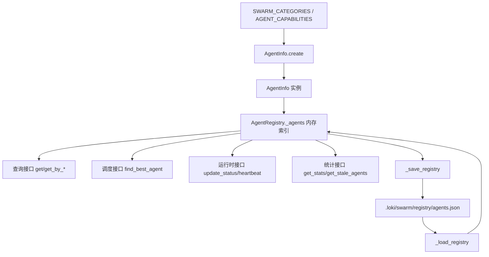
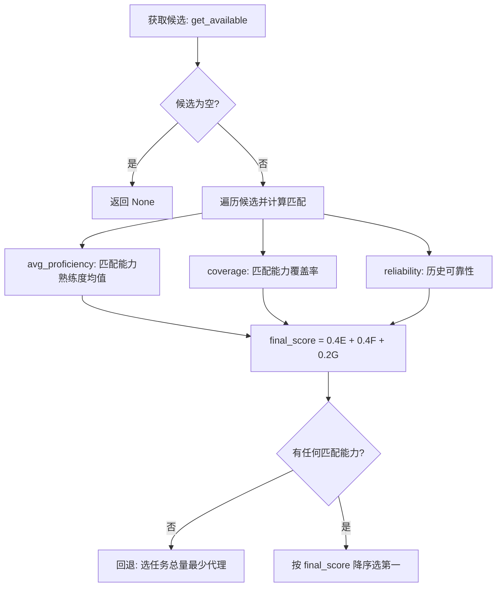
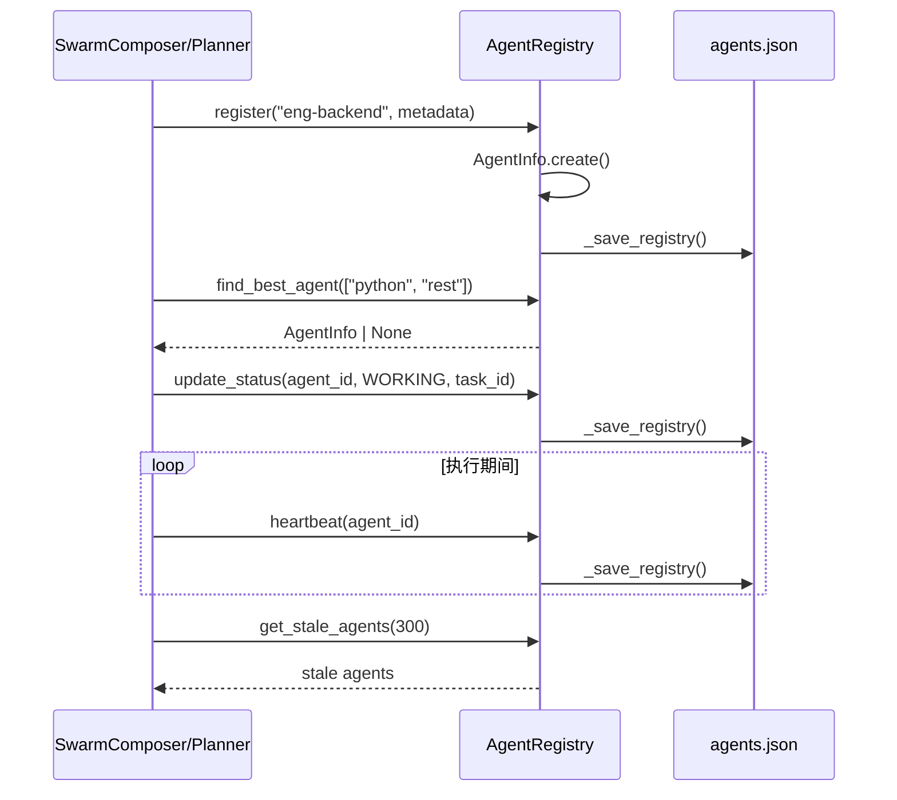

# agent_registry_and_capabilities 模块文档

## 模块概述

`agent_registry_and_capabilities` 对应实现文件 `swarm/registry.py`，是 Swarm Multi-Agent 运行时里负责“代理身份登记、能力建模、可用性判断与候选选择”的基础模块。这个模块存在的根本原因是：在多代理系统中，调度器必须回答三个连续问题——现在有哪些代理在线、它们能做什么、同一时刻应该把任务给谁。没有这一层，`swarm.composer.SwarmComposer` 一类上层编排组件就只能基于静态角色做粗粒度分配，无法利用运行时状态（心跳、失败率、忙闲程度）做精细决策。

从设计取向上看，该模块采用“静态能力词典 + 动态注册表”的双层模型。静态部分通过 `SWARM_CATEGORIES`、`AGENT_TYPES`、`AGENT_CAPABILITIES` 描述平台认可的代理类型和默认能力集合；动态部分通过 `AgentInfo` 与 `AgentRegistry` 记录每个代理实例的当前状态、任务统计、心跳时间和元数据。这样做的好处是类型体系可审计、行为状态可追踪，且便于在不改上层协议的情况下扩展新的 agent type。

在系统边界上，这个模块位于 Swarm 体系的底座层：它不负责“任务拆分”（见 [swarm_topology_and_composition.md](swarm_topology_and_composition.md)），也不负责“代理间消息协议”（见 [communication_protocol.md](communication_protocol.md)），更不负责“共识与容错流程”（见 [consensus_and_fault_tolerance.md](consensus_and_fault_tolerance.md)）。它专注于提供可查询、可持久化、可评分的代理目录服务，为上述模块提供确定性的输入。

---

## 设计目标与非目标

该模块的核心目标是让代理注册和选择逻辑保持轻量、可本地运行、可恢复。`AgentRegistry` 使用 `.loki/swarm/registry/agents.json` 做持久化，意味着单机场景可直接开箱使用，不依赖外部数据库。对于研发阶段和 CLI 场景，这种设计降低了运维成本，也便于调试。

它的非目标同样明确：不是分布式强一致注册中心，不保证多进程并发写入一致性，也不提供复杂租户隔离与授权控制。这些能力通常应由 Dashboard Backend、Policy Engine 或专门的存储后端承接。因此，在生产多实例环境中，该模块更适合被包装为“接口契约 + 可替换后端”，而非直接作为最终基础设施。

---

## 架构与组件关系



这张图展示了模块的主闭环。静态词典仅在代理创建时参与一次，随后所有运行期行为都落在 `AgentInfo` 与 `AgentRegistry` 上。`AgentRegistry` 同时维护内存索引和文件持久化：内存用于实时查询与评分，文件用于进程重启后恢复。恢复过程容忍文件损坏（异常吞掉并继续启动），体现“可用性优先”的策略。

---

## 数据模型详解

### `SWARM_CATEGORIES`、`AGENT_TYPES`、`AGENT_CAPABILITIES`

`SWARM_CATEGORIES` 将代理类型按业务域分组（engineering、operations、business、data、product、growth、review、orchestration）。`AGENT_TYPES` 由前者扁平化生成，避免重复维护。`AGENT_CAPABILITIES` 则把每个 `agent_type` 映射到默认 capability 名称列表。

这三者的组合定义了“代理类型字典”。`AgentInfo.create` 会先根据 `agent_type` 反查所属 `swarm`，再灌入默认能力列表。若 `agent_type` 不存在于 `SWARM_CATEGORIES`，代理仍可创建，但 `swarm` 会落为 `unknown`，且能力列表可能为空。这种宽松行为方便快速试验，但在正式环境中应配合校验，防止拼写错误悄悄进入系统。

### `AgentStatus`

`AgentStatus` 是字符串枚举，取值包括 `idle`、`working`、`waiting`、`failed`、`terminated`。注册表的“可用代理”定义依赖该枚举，其中 `IDLE` 与 `WAITING` 被视为可调度状态。

这里有一个语义细节：把 `WAITING` 算作可用体现了模块对等待态的乐观解释（例如等待短暂依赖）。如果你的任务模型把等待态视为“占用中”，需要在上层封装 `get_available` 或调整状态机策略。

### `AgentCapability`

`AgentCapability` 表示单个能力项，字段含义如下：

- `name`：能力标识，如 `python`、`graphql`
- `proficiency`：熟练度，默认 `0.8`
- `last_used`：最近使用时间
- `usage_count`：累计使用次数

它提供 `to_dict()` / `from_dict()`，用于 JSON 序列化。时间字段以 ISO 格式存储，并对末尾 `Z` 做兼容处理。该实现足够实用，但没有做严格时区归一，外部输入若混入 naive datetime，在计算时间差时可能触发 aware/naive 比较问题。

### `AgentInfo`（本模块核心组件）

`AgentInfo` 是代理实例在注册表里的标准记录，既是调度输入，也是运行状态快照。重要字段包含 `id`、`agent_type`、`swarm`、`status`、`capabilities`、任务成功/失败计数、当前任务标识、创建时间、最近心跳和业务元数据。

`AgentInfo.create(agent_type)` 是推荐构造入口，它封装了类别推导、默认能力注入和 ID 生成（`agent-{agent_type}-{8位随机hex}`）。这使调用方不必重复拼接逻辑，也保证新代理对象结构一致。需要注意 ID 采用截断 UUID，冲突概率低但并非数学上零冲突。

`record_task_completion(success)` 是运行时关键行为：它会更新成功/失败计数，并把代理状态重置为 `IDLE`，同时清空 `current_task`。这意味着只要调用该方法，代理就会重新进入候选池。

---

## `AgentRegistry` 内部机制

### 初始化与持久化目录

`AgentRegistry(loki_dir: Optional[Path] = None)` 默认把数据写入 `./.loki/swarm/registry/agents.json`。构造时会确保目录存在，然后加载历史文件。

```python
from pathlib import Path
from swarm.registry import AgentRegistry

registry = AgentRegistry(loki_dir=Path(".loki"))
```

该路径约定与系统其他运行态文件保持一致，有利于统一备份和清理策略。若在容器环境运行，建议把 `.loki` 挂载到持久卷，否则重启会丢失注册信息。

### 加载与保存策略

`_load_registry()` 读取 `agents.json`，逐条调用 `AgentInfo.from_dict`。`_save_registry()` 会写入版本号、更新时间和完整代理数组。两个方法都对 IO/JSON 异常做静默处理（`pass`），不会抛错。

这种策略保证核心流程不中断，但故障可观测性较弱。生产环境通常建议在外围加日志或指标埋点（可对接 [Observability.md](Observability.md) 中的指标体系），否则权限错误或磁盘异常很难被及时发现。

### 注册、注销与查询

`register(agent_type, metadata=None)` 会创建并写入新代理，返回 `AgentInfo`。`deregister(agent_id)` 会先把状态置为 `TERMINATED`，然后立即从 `_agents` 删除并保存。

因为是硬删除，终止状态不会长期保留在文件中；如果你需要审计“谁在何时被终止”，应引入审计日志模块（参考 [audit_and_compliance.md](audit_and_compliance.md)）或改为软删除字段。

查询接口包括 `get`、`get_by_type`、`get_by_swarm`、`get_by_capability`、`list_all`。它们都在内存中线性扫描，复杂度是 O(n)。在数百级代理规模通常足够，但上万代理时建议引入二级索引结构。

### 状态推进与心跳

`update_status(agent_id, status, task_id=None)` 会同时更新状态、当前任务、心跳，并持久化。`heartbeat(agent_id)` 仅刷新心跳并持久化。`get_stale_agents(max_age_seconds=300)` 根据心跳年龄筛选疑似失活代理，但不会自动修改状态。

这表明“失活如何处置”不在本模块职责内，通常应由上层健康巡检流程决定（例如标记 `FAILED`、触发告警、移出调度池）。这与 [swarm_adaptation_and_feedback.md](swarm_adaptation_and_feedback.md) 中的反馈闭环可以形成互补。

---

## 能力匹配与调度评分

`find_best_agent(required_capabilities, preferred_type=None)` 是本模块最重要的算法入口。它先取可用候选，再按匹配质量评分，最终返回最高分代理。



评分模型的设计意图是平衡三类信号。能力熟练度体现“做得好不好”，覆盖率体现“会不会做全”，可靠性体现“历史稳定性”。权重 0.4/0.4/0.2 明确偏向能力匹配，弱化历史统计，适合能力驱动任务。

当没有代理命中任何所需能力时，算法会退化为“最少任务量”策略，确保任务可继续推进而不是直接失败。这是典型的吞吐优先取向，可能牺牲首次质量。

---

## 关键流程（时序）



这个时序强调了一个现实特征：每次状态/心跳更新都会触发文件写入。实现简单可靠，但在高频心跳（例如每秒一次）下可能产生明显 I/O 压力。若系统规模增大，建议增加批量刷新或节流机制。

---

## API 级使用示例

### 1）注册并按能力选人

```python
from swarm.registry import AgentRegistry

registry = AgentRegistry()
registry.register("eng-backend", metadata={"region": "ap-southeast-1"})
registry.register("eng-backend", metadata={"region": "us-east-1"})

best = registry.find_best_agent(["python", "graphql"], preferred_type="eng-backend")
if best:
    print(best.id, best.agent_type, best.swarm)
```

### 2）推进任务状态并回写结果

```python
from swarm.registry import AgentStatus

if best:
    registry.update_status(best.id, AgentStatus.WORKING, task_id="task-2026-001")

    # ...执行任务...

    agent = registry.get(best.id)
    if agent:
        agent.record_task_completion(success=True)
        # 当前实现没有公开“提交 AgentInfo 变更”方法，需显式保存
        registry._save_registry()
```

### 3）检测失活代理

```python
stale_agents = registry.get_stale_agents(max_age_seconds=120)
for a in stale_agents:
    print("stale:", a.id, a.last_heartbeat.isoformat())
```

---

## 配置与扩展建议

### 扩展新的 agent type

扩展步骤是先在 `SWARM_CATEGORIES` 增加类型归属，再在 `AGENT_CAPABILITIES` 增加能力画像。若只改其中之一，系统会出现“有类型无能力”或“有能力映射但类型不归类”的不一致状态。

```python
from swarm.registry import SWARM_CATEGORIES, AGENT_CAPABILITIES, AgentInfo

SWARM_CATEGORIES["engineering"].append("eng-rust")
AGENT_CAPABILITIES["eng-rust"] = ["rust", "tokio", "actix", "performance"]

agent = AgentInfo.create("eng-rust")
print(agent.swarm)         # engineering
print([c.name for c in agent.capabilities])
```

这类修改只影响“新增实例”，不会自动迁移已存在代理记录。若需要全量生效，应写一次性迁移脚本遍历并补全旧数据。

### 自定义匹配策略

如果当前权重不符合业务目标，建议不要直接修改调用方，而是在 `AgentRegistry` 里增加可配置权重或策略函数注入。这样既能保持 API 稳定，也便于 A/B 对比不同策略对成功率和吞吐的影响。

---

## 边界条件、错误处理与已知限制

该模块最值得注意的风险是静默失败。文件读取失败、JSON 解析失败、文件写入失败都不会抛异常，调用方也拿不到错误对象。短期看系统“不断电”，长期看会掩盖数据丢失与持久化失效。建议在封装层增加告警日志与健康检查。

并发方面，当前实现没有文件锁与版本冲突检测，多个进程共享同一 `agents.json` 时可能互相覆盖。若你的部署是多 worker / 多副本，应该把这个实现视为开发后端，生产切换到集中式存储。

算法方面，`find_best_agent` 对 `required_capabilities` 默认假设“非空”。当传入空列表时，`coverage = matched_caps / len(required_capabilities)` 会触发除零错误。这是调用前必须防御的输入约束。

时区方面，`from_dict()` 解析时间戳时允许多种格式，若历史数据混入 naive 时间对象，`get_stale_agents` 在做时间差计算时可能报错。建议统一写入 UTC aware 时间字符串。

生命周期语义方面，`deregister` 采用硬删除，不保留终态历史；`record_task_completion` 会无条件置回 `IDLE`，即使外层期望进入 `WAITING`。这两点在复杂工作流中都可能需要二次封装。

---

## 与其他模块的协作关系

从依赖方向看，`agent_registry_and_capabilities` 主要被 Swarm 编排层消费，而不是反向依赖编排层。你可以把它理解为“代理目录服务”。在规划任务时，`swarm.classifier.PRDClassifier` / `swarm.composer.SwarmComposer` 决定需要哪类代理；在执行任务时，消息与协议层通过代理 ID 派发任务（参见 [communication_protocol.md](communication_protocol.md)）；在容错与治理阶段，健康与失败统计可被共识/治理逻辑引用（参见 [consensus_and_fault_tolerance.md](consensus_and_fault_tolerance.md)）。

这种分层让模块职责清晰：本模块负责“谁可用、谁更合适”，其他模块负责“任务怎么拆、消息怎么传、失败怎么裁决”。在维护时应尽量保持这个边界，避免把业务编排逻辑塞进注册表。

---

## 维护者检查清单

- 当你新增 agent type 时，确认 `SWARM_CATEGORIES` 与 `AGENT_CAPABILITIES` 同步更新。
- 当你修改 `AgentInfo` 字段时，确保 `to_dict/from_dict` 双向兼容，并考虑历史 `agents.json` 迁移。
- 当你调整匹配算法时，优先保留回退路径，避免“无匹配即失败”导致系统停摆。
- 当你准备生产化部署时，优先评估并发写入和持久化可观测性，而不是只看功能可用。

以上四点基本覆盖该模块最常见的演进风险。
