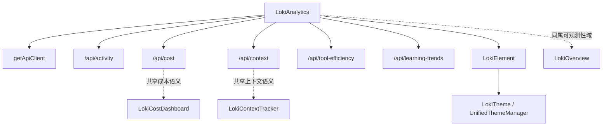
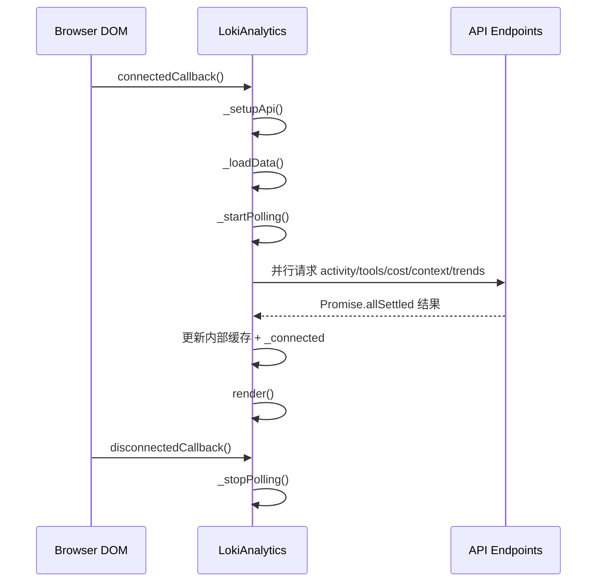
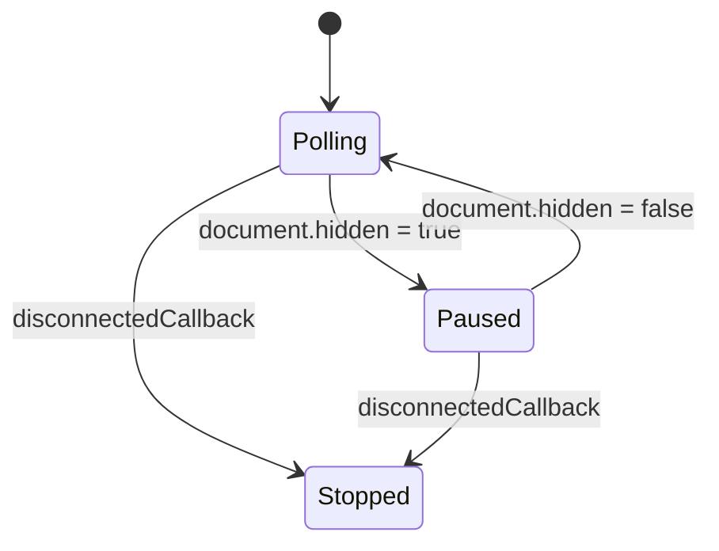
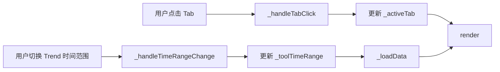

# analytics_and_cross_provider_insights

## 模块简介

`analytics_and_cross_provider_insights` 模块是 Dashboard UI 里“监控与可观测性”域中的分析视图实现，核心组件为 `dashboard-ui.components.loki-analytics.LokiAnalytics`。它的目标不是替代后端统计系统，而是**在前端聚合多个现有 API**，以低依赖（无第三方图表库）的方式快速给出跨 Provider 的运行洞察，包括活动热力图（Activity Heatmap）、工具使用分布（Tool Usage）、迭代速度（Velocity）以及模型供应商对比（Providers）。

这个模块存在的核心原因是：系统中已有分散的观测数据端点（`/api/activity`、`/api/cost`、`/api/context`、`/api/learning/trends` 等），但开发者和运维人员需要一个统一入口，快速回答“系统最近活跃吗”“哪些工具最常调用”“迭代节奏如何”“不同模型供应商成本效率怎样”等问题。`LokiAnalytics` 用客户端聚合策略将这些问题压缩到一个组件内完成，降低后端新增专用分析 API 的压力。

从系统分层上看，它位于 Dashboard UI Components 层，依赖 `LokiElement` 提供统一主题、Shadow DOM 与基础可访问性能力，依赖 `getApiClient` 复用现有 API client 能力。若你已经阅读过 [LokiCostDashboard.md](./LokiCostDashboard.md)、[LokiContextTracker.md](./LokiContextTracker.md) 与 [Monitoring and Observability Components.md](./Monitoring%20and%20Observability%20Components.md)，可以把本模块理解为“跨数据源的综合分析面板”，而不是单一指标看板。

---

## 在系统中的定位与关系



上图强调了两个事实。第一，`LokiAnalytics` 自身并不维护独立后端状态，它通过并行请求多个 API 端点做“横向拼接”。第二，它和 `LokiCostDashboard`/`LokiContextTracker` 在数据语义上存在交集（例如 cost、iteration），但呈现目标不同：前两者偏“单域纵深”，`LokiAnalytics` 偏“跨域横向比较”。

---

## 核心组件详解

### 1. `MODEL_TO_PROVIDER` 与 `classifyProvider(modelName)`

`MODEL_TO_PROVIDER` 是一个轻量的模型名片段映射表，用于把模型字符串归类到 provider：

- `opus/sonnet/haiku/claude` → `claude`
- `gpt/codex` → `codex`
- `gemini` → `gemini`
- 未命中 → `unknown`

`classifyProvider(modelName)` 的实现是大小写归一化后做 `includes` 匹配，优点是鲁棒（即使模型全名含版本后缀也可匹配），但限制是：

1. 容易受到命名冲突影响（片段匹配不是严格 schema）。
2. 新模型命名若未覆盖，会被归为 `unknown`。
3. 当前映射是前端硬编码，不是后端配置下发。

如果要扩展新 provider，最小变更是在此映射中新增 key；如果希望更可控，建议把映射迁移到后端配置端点，再由前端动态拉取。

---

### 2. `LokiAnalytics` 生命周期与状态模型

`LokiAnalytics` 继承 `LokiElement`，因此自动获得主题系统接入、Shadow DOM 渲染隔离与基础 render 生命周期。

组件内部状态主要包括：

- 连接与请求状态：`_api`、`_connected`、`_loading`、`_pollInterval`
- UI 状态：`_activeTab`（默认 `heatmap`）、`_toolTimeRange`（默认 `7d`）
- 数据缓存：`_activity`、`_tools`、`_cost`、`_context`、`_trends`

其生命周期流程如下：



这里的一个关键设计是 `Promise.allSettled`：允许部分 API 失败而非整页失败。也就是说，只要有任一数据源成功，组件就会进入“可用”状态并展示可展示部分，这对弱网络或后端逐步上线阶段很重要。

---

### 3. 数据加载机制：`_setupApi()`、`_fetchActivity()`、`_loadData()`

#### `_setupApi()`

该方法根据 `api-url` 属性（缺省为 `window.location.origin`）创建 API client：

```js
this._api = getApiClient({ baseUrl: apiUrl });
```

这使组件可以嵌入不同部署环境，而不需要重新打包。

#### `_fetchActivity()`

`activity` 数据通过原生 `fetch` 请求 `GET /api/activity?limit=1000`，并额外加入 10 秒超时控制（`AbortController`）。这是本组件中唯一显式超时控制点。

#### `_loadData()`

`_loadData()` 做了三件事：

1. 并发拉取 5 路数据（activity/tools/cost/context/trends）。
2. 按请求结果逐路更新缓存；即便某路失败，也不阻断其他路。`trends` 兼容数组结构与 `{dataPoints: [...]}` 结构。
3. 更新 `_connected = 至少一项 fulfilled`，然后 `render()`。

需要注意：该方法使用 `_loading` 防重入，避免轮询重叠请求导致渲染风暴。

---

### 4. 轮询与可见性优化：`_startPolling()` / `_stopPolling()`

组件默认每 30 秒拉取一次。为减少后台标签页浪费，它监听 `document.visibilitychange`：

- 页面隐藏时清除 interval。
- 页面恢复时立即补拉一次并重建 interval。



这个策略和 `LokiContextTracker` / `LokiCostDashboard` 一致，体现了可观测组件在浏览器端的统一节流实践。差别在于本模块轮询周期更长（30s），更偏“趋势观察”而非“实时监控”。

---

## 四个分析视图的内部逻辑

### A. Activity Heatmap

`_computeHeatmap()` 先把 activity 条目按本地日期聚合计数，再构造“截至今天”的 52 周网格。时间戳字段兼容 `timestamp | ts | created_at`，无效日期会跳过。

返回结果：

- `cells`: `{ date, count, day }[]`
- `maxCount`: 最大日活动数（用于色阶归一）

`_getHeatmapLevel(count, maxCount)` 将活动强度离散到 0~4 五档，`_renderHeatmap()` 再渲染月标签、周列网格、图例。

**设计含义**：这是 GitHub contribution 风格的活跃分布图，适合看“持续性”和“波峰波谷”，不适合精确统计。

---

### B. Tool Usage

`_computeToolUsage()` 对工具调用数据做字段兼容与聚合：

- 工具名字段优先级：`tool` → `name` → `tool_name` → `data.tool_name` → `unknown`
- 次数字段优先级：`count` → `calls` → `frequency` → `data.count` → `1`

聚合后按调用量降序，截取前 15。`_renderToolUsage()` 用横向 bar 展示相对强度（以最大值归一到 100%）。

**注意点**：这是“相对占比图”，不是绝对时序图；工具调用量大的条会压缩尾部小值可见性。

---

### C. Velocity

`_computeVelocity()` 从 context 与 trends 估算迭代速度：

1. 先计算 `totalIterations`（优先 `per_iteration.length`，否则回退 totals 字段）。
2. 若有足够迭代时间戳，计算 `iterPerHour = (n-1)/spanHours`。
3. 构建 `hourlyBuckets`：优先使用 trends 最近 24 桶；若无 trends，则从 iteration 时间戳自行按小时分桶。

`_renderVelocity()` 输出两张指标卡（Iterations/Hour、Total Iterations）和 sparkline，并提供 time range 下拉（`1h/24h/7d/30d`），变更时触发 `_handleTimeRangeChange()` 重新拉取趋势数据。

**方法限制**：`iterPerHour` 是粗粒度估算，对短样本与非均匀 burst 工作负载不敏感；更精确速度指标应由后端直接输出。

---

### D. Providers Comparison

`_computeProviders()` 读取 `this._cost.by_model` 并按 `classifyProvider()` 聚合：

- 累加 `cost`
- 累加 `tokens = input + output`
- 收集 `models`

随后用一个近似策略估算 provider 迭代数：

- 从 context 获取总迭代数 `totalIter`
- 从 cost 获取总成本 `totalCost`
- 对每个 provider 以成本占比近似分摊迭代数

`_renderProviders()` 最终展示：Total Cost、Cost/Iteration、Tokens/Iteration、Total Tokens、模型列表。

**关键提醒**：这里的 `iterations` 是推算值，不是 provider 维度真实计数。跨 provider 对比时，应把它视为“启发式洞察”，而非审计级口径。

---

## 组件交互与渲染机制



每次 `render()` 都会重建 `shadowRoot.innerHTML` 并重新绑定事件监听。这个实现简单直接，维护成本低，但也意味着：

1. 不做细粒度 diff，复杂视图下会有额外重绘成本。
2. 事件监听通过重建 DOM 自动回收旧节点，但依然需要避免过高频 render。

当前通过 `_loading` 与 30 秒轮询节奏，通常不会成为瓶颈。

---

## API 合同与输入输出语义

`LokiAnalytics` 依赖的数据契约是“弱约束 + 字段兼容”。组件通过多字段回退适配不同返回形态，因此在后端迭代中有较强容错性。

常见期望结构示例：

```json
{
  "cost": {
    "estimated_cost_usd": 12.34,
    "by_model": {
      "claude-3-5-sonnet": {
        "input_tokens": 120000,
        "output_tokens": 45000,
        "cost_usd": 3.21
      }
    }
  },
  "context": {
    "totals": { "iterations_tracked": 42 },
    "per_iteration": [
      { "timestamp": "2026-01-01T12:00:00Z" }
    ]
  },
  "learningTrends": {
    "dataPoints": [
      { "count": 5 },
      { "count": 9 }
    ]
  }
}
```

如果你需要准确的后端字段定义，请参考 API 层契约文档 [api_type_contracts.md](./api_type_contracts.md) 及相关服务实现文档，而不是把这个组件里的回退逻辑当作正式 schema。

---

## 使用方式与配置

### 基本用法

```html
<loki-analytics api-url="http://localhost:57374"></loki-analytics>
```

### 可用属性

- `api-url`：后端基地址。变更后组件会更新 `this._api.baseUrl` 并自动重载数据。
- `theme`：主题名（由 `LokiElement`/`LokiTheme` 体系处理）。

在 JS 中动态更新：

```js
const analytics = document.querySelector('loki-analytics');
analytics.setAttribute('api-url', 'https://your-server.example.com');
analytics.setAttribute('theme', 'dark');
```

---

## 可扩展性建议

如果你要扩展此模块，建议按以下方向进行：

1. **新增分析 Tab**：沿用 `_computeX + _renderX` 双方法结构，并在 `tabs` 数组登记元数据。
2. **Provider 分类升级**：将 `MODEL_TO_PROVIDER` 改为可配置源（后端下发或全局配置文件），减少前端硬编码。
3. **指标精度提升**：把 `iterations` 分摊等估算逻辑迁移到后端，前端只做展示，避免统计口径漂移。
4. **性能优化**：若后续 Tab 复杂度显著上升，可考虑引入模板分片或最小更新策略，而非每次全量 innerHTML 覆盖。

---

## 边界条件、错误处理与已知限制

### 容错行为

- 任一数据源成功即视为 connected，页面可部分展示。
- 单路 API 失败不会抛出全局错误（`Promise.allSettled`）。
- activity 请求有 10s 超时保护；其他 API client 方法是否有超时依赖其内部实现。

### 常见边界情况

- 无 activity 数据：Heatmap 仅显示空强度网格。
- 无 tool 数据：显示 `No tool usage data available`。
- 无 trends 且 iteration 时间戳不足：Velocity 显示 `No trend data`，`iterPerHour` 可能为 0。
- 无 cost.by_model：Providers 面板显示空状态。
- 模型名无法识别：归到 `Other/unknown`。

### 已知限制

- Provider 迭代数为“按成本占比估算”，不适合作计费审计。
- 时间处理混合本地日期（heatmap）与 UTC 小时桶（velocity fallback 中 `toISOString().slice(0,13)`），跨时区解释要谨慎。
- `render()` 每次重建 Shadow DOM，在极高频刷新场景下不如虚拟 DOM / diff 方案高效。

---

## 关键方法行为说明（面向二次开发）

为了便于维护者在不通读全部源码的情况下快速定位修改点，下面对 `LokiAnalytics` 的关键方法给出“输入—处理—输出—副作用”视角的说明。这里的“参数”主要指方法读取的内部状态、DOM 事件对象或 API 返回结构。

`connectedCallback()` 在组件挂载后执行，先调用 `_setupApi()` 初始化客户端，再调用 `_loadData()` 进行首轮加载，最后调用 `_startPolling()` 建立轮询与页面可见性监听。它没有显式返回值，但有明显副作用：会发起网络请求并注册全局 `document` 事件。

`disconnectedCallback()` 在组件卸载时执行，核心职责是调用 `_stopPolling()` 清理 interval 和 `visibilitychange` 监听器，避免内存泄漏与离屏请求。该方法本身不抛业务异常，通常可视为“幂等清理”。

`attributeChangedCallback(name, oldValue, newValue)` 目前只对 `api-url` 做有意义处理：当地址变更且 `_api` 已初始化时，更新 `this._api.baseUrl` 并触发 `_loadData()`。这意味着运行中可热切换后端，但也意味着频繁改写属性会触发频繁重载。

`_fetchActivity()` 负责拉取活动流，固定请求 `GET /api/activity?limit=1000`，并通过 `AbortController` 设置 10 秒超时。成功返回 JSON（预期为数组）；失败时抛出异常供 `Promise.allSettled` 接管。其副作用是一次独立网络调用，与 `getApiClient` 方法并行执行。

`_loadData()` 是聚合调度核心。它读取 `_loading` 与 `isConnected` 控制重入，随后并发请求 activity、tool efficiency、cost、context、learning trends。返回值为 `void`，但会更新 `_activity`、`_tools`、`_cost`、`_context`、`_trends`、`_connected` 并触发 `render()`。如果某一路失败，不会中断其他路，这也是该组件“部分可用”策略的基础。

`_computeHeatmap()` 输入是 `_activity`，输出 `{ cells, maxCount }`。`cells` 的每项含 `date/count/day`，用于 CSS 网格渲染；`maxCount` 用于后续归一化。副作用为无（纯计算），因此是安全的重构切入点。

`_computeToolUsage()` 输入是 `_tools`，输出排序后的 `[toolName, count][]`（最多 15 项）。它包含字段回退逻辑，可兼容不同后端响应。副作用为无。

`_computeVelocity()` 输入为 `_context` 与 `_trends`，输出 `{ iterPerHour, totalIterations, hourlyBuckets }`。它会优先使用趋势数据构造火花线，缺失时退化到基于 iteration 时间戳的小时分桶。副作用为无，但结果对输入字段质量高度敏感。

`_computeProviders()` 输入为 `_cost.by_model` 与 `_context` 总迭代信息，输出 provider 聚合对象。它的 `iterations` 是按成本占比估算出的近似值，不是事件级真实计数。副作用为无。

`_handleTabClick(e)` 与 `_handleTimeRangeChange(e)` 是两类交互入口：前者只改 `_activeTab` 并重绘；后者改 `_toolTimeRange` 后触发 `_loadData()`。两者都不返回数据，但会驱动 UI 状态迁移。

`render()` 是最终渲染入口。它基于当前 tab 选择 `_renderHeatmap/_renderToolUsage/_renderVelocity/_renderProviders` 之一，重建 `shadowRoot.innerHTML` 后重新绑定事件监听器。该方法副作用较强：DOM 全量替换、事件重绑、样式重注入，因此若未来要优化性能，通常从这里做局部更新改造。

---

## 扩展示例：新增一个“Errors”分析标签

如果你希望新增错误率或失败分布视图，推荐沿用当前模块的组织方式：新增计算函数、新增渲染函数、在 `tabs` 中注册，并在 `_loadData()` 增加对应数据源。

```js
// 1) 在 constructor 中新增状态
this._errors = [];

// 2) 在 _loadData() 的 Promise.allSettled 中新增请求
this._api.getErrors({ timeRange: this._toolTimeRange })

// 3) 新增计算函数
_computeErrors() {
  const arr = Array.isArray(this._errors) ? this._errors : [];
  const total = arr.reduce((s, e) => s + (e.count || 0), 0);
  return { total, top: arr.slice().sort((a, b) => (b.count || 0) - (a.count || 0)).slice(0, 10) };
}

// 4) 新增渲染函数
_renderErrors() {
  const { total, top } = this._computeErrors();
  if (!top.length) return '<div class="empty-state">No error data</div>';
  return `<div>Total Errors: ${total}</div>`;
}
```

这个扩展方式可以最大程度复用已有结构，不会破坏现有 Tab 行为、轮询机制和主题系统。若该指标将被多个组件复用，建议把聚合逻辑下沉到 API 层或共享 util，而不是在多个组件内复制字段回退规则。

---

## 与其他模块的协作阅读路径

为了避免重复理解，建议按以下顺序阅读：

1. [LokiAnalytics.md](./LokiAnalytics.md)：组件级说明（若存在你们团队维护补充）。
2. [LokiCostDashboard.md](./LokiCostDashboard.md)：成本数据结构和预算语义来源。
3. [LokiContextTracker.md](./LokiContextTracker.md)：迭代/上下文数据来源与可视化口径。
4. [LokiOverview.md](./LokiOverview.md)：监控域中状态类指标如何与分析类指标互补。
5. [Monitoring and Observability Components.md](./Monitoring%20and%20Observability%20Components.md)：该域组件全景。

---

## 维护者速记（结论）

`analytics_and_cross_provider_insights` 的本质是一个**低耦合前端聚合器**：通过统一轮询与容错，把分散 API 变成可行动洞察。它的价值在于“快速比较与趋势判断”，而不是“强一致统计”。维护时请优先关注三件事：

1. 数据口径是否与后端演进同步（字段兼容与回退规则）。
2. Provider 分类映射是否覆盖新模型。
3. 估算指标（尤其 iterations）是否被误当作精确指标使用。
