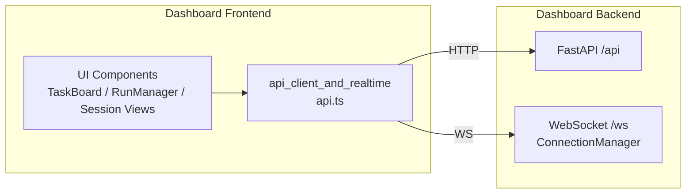
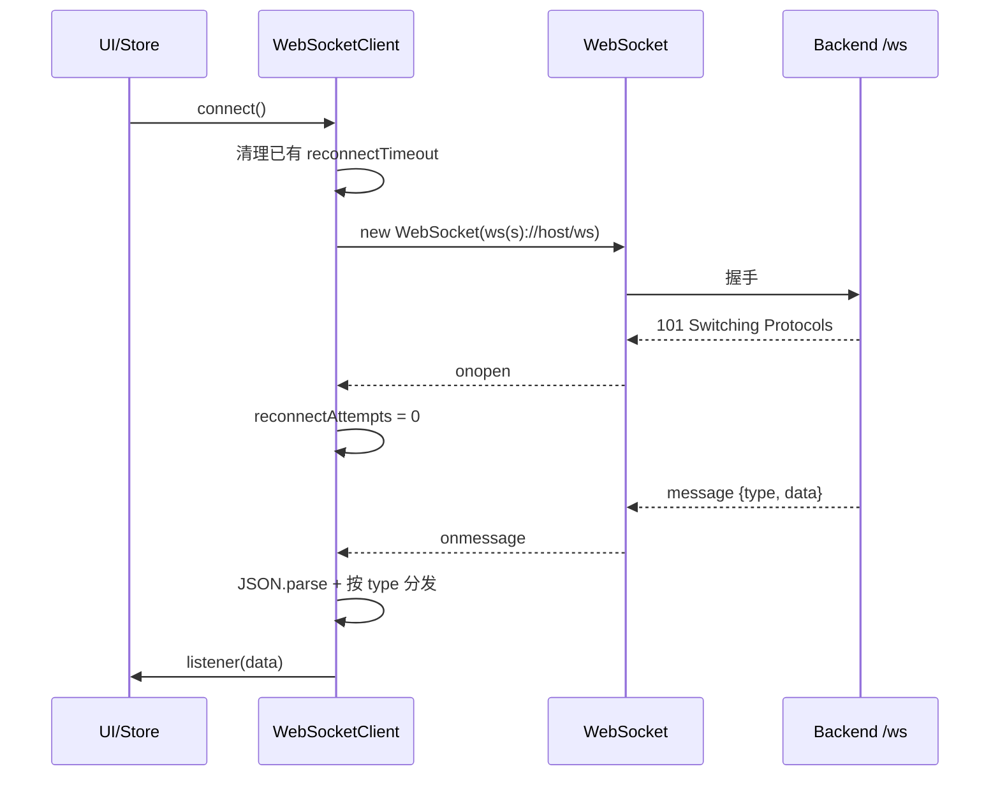
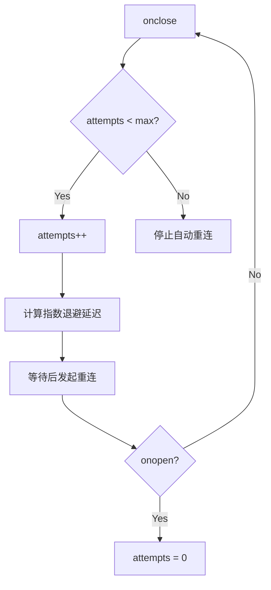
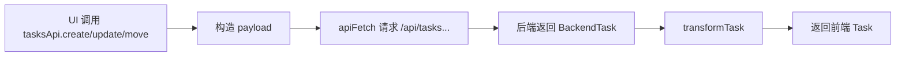

# api_client_and_realtime 模块文档

## 模块简介

`api_client_and_realtime` 是 Dashboard Frontend 的通信基础模块，负责把前端界面与后端服务连接起来。它同时覆盖两条关键链路：一条是基于 HTTP 的资源读写（项目、任务等），另一条是基于 WebSocket 的实时事件推送。模块当前核心组件是 `dashboard.frontend.src.api.BackendProject` 与 `dashboard.frontend.src.api.WebSocketClient`，但在实现上也包含若干关键支撑能力（如 `apiFetch`、`tasksApi`、`projectsApi`、数据转换函数和 `ApiError`）。

这个模块存在的根本原因是“隔离变化”：后端采用 Python/FastAPI 风格的 snake_case 数据契约，前端采用 TypeScript/React 常见的 camelCase 任务模型；后端接口可能扩展，UI 组件也会不断增加。如果每个组件都直接写 `fetch` 和 `new WebSocket`，很快会出现重复逻辑、错误处理不一致、字段转换分散、实时订阅泄漏等问题。`api_client_and_realtime` 把这些通用问题统一到一处，形成可维护、可扩展、可观测的边界层。

---

## 系统定位与关系



在整体模块树中，本模块是 `Dashboard Frontend` 的网络层实现，向上服务于 UI 组件，向下对接 `Dashboard Backend`。与类型系统的关系主要体现在 `Task / TaskStatus / TaskPriority`（来自 `kanban_type_system` 相关定义）。关于后端连接管理与接口实现细节，建议阅读 [Dashboard Backend.md](Dashboard%20Backend.md)；关于任务类型体系，建议阅读 [kanban_type_system.md](kanban_type_system.md)。

---

## 架构设计与核心思路

### 1) 统一请求入口

所有 HTTP 请求都经过 `apiFetch<T>()`，统一处理：

- URL 拼接（`/api` 前缀）
- JSON 请求头注入
- 非 2xx 响应转为 `ApiError`
- `204 No Content` 的空响应归一化

这样做让调用层（`projectsApi`、`tasksApi`）只关注业务路径，不关心样板错误处理。

### 2) 数据契约分层

模块明确区分“后端契约类型”与“前端视图类型”：

- 后端：`BackendTask`、`BackendProject`（snake_case）
- 前端：`Task`（camelCase，UI 友好）

通过 `transformTask()` 与 `transformTaskForBackend()` 将两边映射，避免 UI 代码到处写字段转换。

### 3) 实时事件发布订阅

`WebSocketClient` 封装了连接生命周期、消息解析、事件分发和自动重连。组件通过 `on(eventType, listener)` 订阅事件，不需要感知 WebSocket 底层细节。

### 4) 单例连接策略

通过 `wsClient` 单例导出，避免多个组件重复建连造成连接数膨胀与重复事件处理。

---

## 组件详解

## `BackendProject`（核心组件）

`BackendProject` 是后端项目对象的接口定义，表示 `/projects` 相关接口的返回结构：

```typescript
interface BackendProject {
  id: number;
  name: string;
  description: string | null;
  prd_path: string | null;
  status: string;
  created_at: string;
  updated_at: string;
  task_count: number;
  completed_task_count: number;
}
```

它的设计意义是“显式表达后端契约”，而不是直接混用前端实体模型。这样在后端字段变更时，影响可以被控制在 API 层，而不是扩散到 UI 层。

字段要点：

- `description`、`prd_path` 是可空字段，调用方必须处理 `null`。
- 时间字段是字符串时间戳（通常 ISO 格式），展示时应自行本地化。
- `task_count` 与 `completed_task_count` 可用于计算进度，不建议前端重复统计。

---

## `WebSocketClient`（核心组件）

`WebSocketClient` 负责实时连接管理，是本模块最关键的运行时组件。

### 内部状态

- `ws: WebSocket | null`：当前连接对象
- `reconnectAttempts: number`：当前重连次数
- `maxReconnectAttempts = 5`：最大重连次数
- `reconnectDelay = 1000`：初始重连延迟（ms）
- `reconnectTimeout`：挂起的重连定时器
- `listeners: Map<string, Set<listener>>`：事件监听器表

### 生命周期方法

- `connect()`：建立连接并注册事件处理器
- `on(eventType, listener)`：注册监听器，返回取消订阅函数
- `disconnect()`：主动断开并清理定时器
- `attemptReconnect()`（私有）：连接断开后指数退避重连

### 连接流程



### 事件分发模型

消息格式默认假设：

```json
{ "type": "task.updated", "data": { "id": 1 } }
```

分发策略：

1. 先通知指定类型监听器（`listeners.get(type)`）
2. 再通知通配监听器（`listeners.get('*')`），其接收完整消息对象

这样既支持“精准订阅”，也支持“全局观测/调试”。

### 重连策略

`onclose` 后触发指数退避：1s、2s、4s、8s、16s，最多 5 次。该策略兼顾恢复速度与服务器压力控制。



### 行为边界

- `disconnect()` 会关闭连接并清除重连定时器，避免“主动断开后又自动重连”。
- 监听器不在 `disconnect()` 时自动清空，调用方应在组件卸载时执行 `unsubscribe`。
- 解析失败仅 `console.error`，不会抛给上层；如需严格容错，应在上层增加监控或包装。

---

## 支撑能力详解（非核心组件但关键）

## `apiFetch<T>()`

统一 fetch 包装器。输入：`endpoint` 与可选 `RequestInit`；输出：`Promise<T>`。

关键行为：

- 自动拼接 `API_BASE`（`/api`）
- 默认 `Content-Type: application/json`
- 非 `ok` 响应读取文本并抛出 `ApiError`
- 204 返回 `undefined as T`

副作用：发起网络请求；失败时抛异常。

## `ApiError`

扩展 `Error`，附加 `status`（HTTP 状态码）。

典型处理模式：

```typescript
try {
  await tasksApi.update(1, { status: 'done' as any });
} catch (e) {
  if (e instanceof ApiError) {
    if (e.status === 401) {
      // 引导登录
    }
  }
}
```

## `transformTask()` / `transformTaskForBackend()`

这两个函数是前后端任务模型的“翻译层”。

`transformTask(backendTask)` 的关键转换：

- `id: number -> string`
- `description: null -> ''`
- `estimated_duration(分钟) -> estimatedHours(小时)`
- `assigned_agent_id -> assignee: Agent-<id>`
- 缺失类型时默认 `type = 'feature'`

`transformTaskForBackend(task, projectId)` 的关键转换：

- 仅提交显式存在字段（`undefined` 不提交）
- `estimatedHours -> estimated_duration * 60`

---

## API 表面（开发者使用入口）

## `projectsApi`

- `list(): Promise<BackendProject[]>`
- `get(id: number): Promise<BackendProject>`
- `create(data: { name: string; prd_path?: string; description?: string }): Promise<BackendProject>`
- `delete(id: number): Promise<void>`

适用于项目管理页面或项目选择器。

## `tasksApi`

- `list(projectId?: number): Promise<Task[]>`
- `get(id: number): Promise<Task>`
- `create(task: Partial<Task>, projectId: number): Promise<Task>`
- `update(id: number, task: Partial<Task>): Promise<Task>`
- `delete(id: number): Promise<void>`
- `move(id: number, status: TaskStatus, position: number): Promise<Task>`

适用于看板加载、拖拽迁移、任务状态变化。

### 请求-转换-返回链路



---

## 实际使用模式

### 场景一：页面初始化加载任务

```typescript
import { tasksApi } from './api';

async function init(projectId: number) {
  const tasks = await tasksApi.list(projectId);
  // setState(tasks)
}
```

### 场景二：拖拽任务后同步位置

```typescript
await tasksApi.move(taskId, nextStatus, nextPosition);
```

### 场景三：订阅实时更新并在卸载时清理

```typescript
import { wsClient } from './api';

wsClient.connect();

const offTask = wsClient.on('task.updated', (data) => {
  // merge into store
});

const offAll = wsClient.on('*', (msg) => {
  console.debug('ws event', msg);
});

// unmount
offTask();
offAll();
wsClient.disconnect();
```

---

## 扩展与二次开发建议

如果你要扩展本模块，建议遵循当前风格，保持“接口层简单、转换层集中、生命周期清晰”。

新增实体 API（例如 `agentsApi`）时，应先定义后端契约接口，再决定是否需要前端模型转换；不要让组件直接消费 snake_case。

新增 WebSocket 事件时，建议明确事件命名规范（如 `domain.action`），并在一个中心位置维护事件类型常量，避免字符串散落。若系统实时事件复杂度继续提升，可考虑：

- 在 `WebSocketClient` 外包一层 typed event bus
- 增加心跳与连接健康状态上报
- 增加断线补偿策略（重连后主动拉取增量）

---

## 风险点、边界条件与限制

首先，`TaskStatus`/`TaskPriority` 的类型断言是编译期保护，不是运行时校验；后端若返回未知状态值，仍可能在 UI 出错。建议加入运行时 schema 校验（如 zod/io-ts）。

其次，`tasksApi.update()` 当前只更新部分字段（title/description/status/priority），并未覆盖全部 `Task` 字段。如果 UI 增加工时编辑或 assignee 编辑，需同步扩展 payload 逻辑。

第三，`apiFetch` 默认请求头总是 JSON。未来若引入文件上传（`multipart/form-data`）需要特判，不应继续强制该请求头。

第四，WebSocket 自动重连最多 5 次，超过后会停止。生产系统应给用户可见反馈（例如“实时连接已断开，点击重试”），而不只依赖 console。

第五，当前 URL 推导依赖 `window.location.host`，适合同域部署。若前后端分域或走网关路径重写，需要让 WS 地址可配置。

第六，消息解析失败仅记录错误日志，不会触发监听器。对强一致实时场景，应配合 HTTP 刷新策略兜底。

---

## 与其他模块文档的引用

为避免重复，本文件不展开后端实现细节和 UI 组件消费细节，请按需阅读：

- 后端 API/WS 服务实现： [Dashboard Backend.md](Dashboard%20Backend.md)
- 前端任务与看板类型系统： [kanban_type_system.md](kanban_type_system.md)
- 任务看板消费方式： [LokiTaskBoard.md](LokiTaskBoard.md)
- 运行与日志相关实时展示： [LokiRunManager.md](LokiRunManager.md), [LokiLogStream.md](LokiLogStream.md)

---

## 维护总结

`api_client_and_realtime` 的复杂度不高，但它处在系统“变化交汇点”，因此维护优先级很高。任何前后端字段调整、错误语义变化、实时事件协议变化，都应优先在这里收敛和兼容。实践中只要守住三件事——统一转换、统一错误、统一连接生命周期——该模块就能持续支撑前端功能扩展而不失控。
