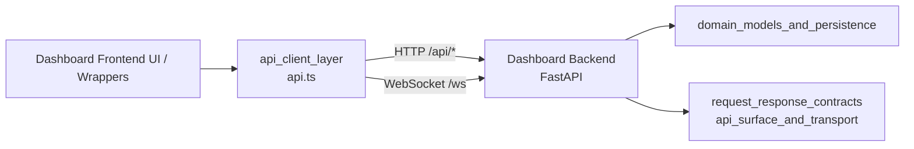
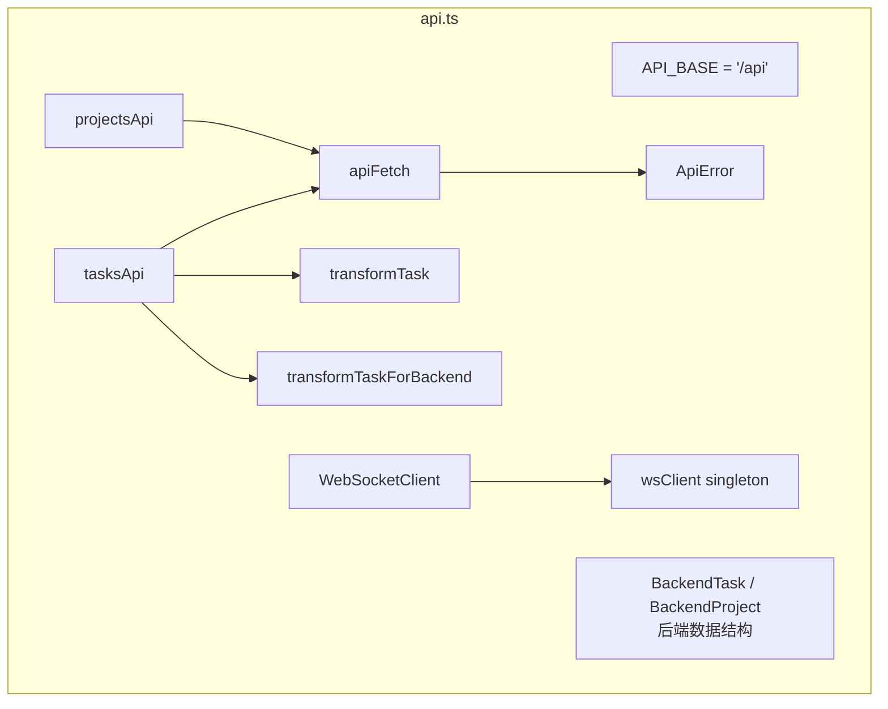
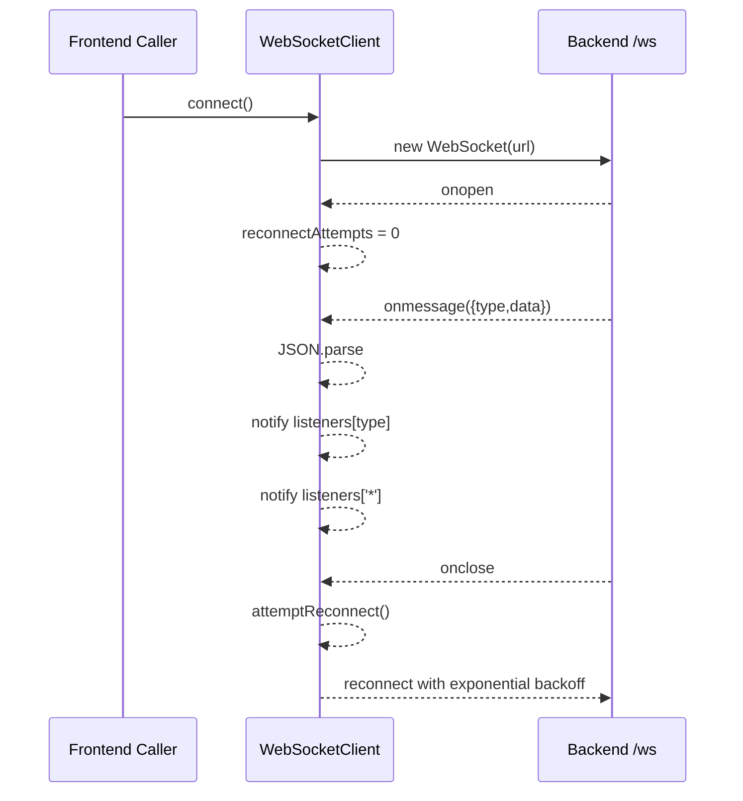
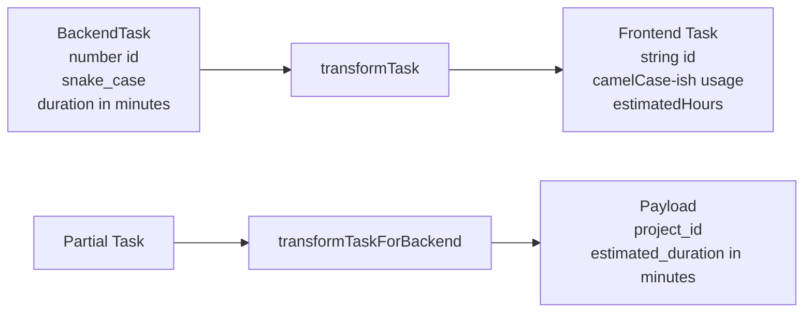

# api_client_layer 模块文档

## 模块简介

`api_client_layer` 是 Dashboard Frontend 中最靠近网络边界的一层，位于 `dashboard/frontend/src/api.ts`。它的核心职责不是渲染 UI，而是把前端页面中的业务动作（例如“列出项目”“移动任务”“订阅实时事件”）转换为对 Dashboard Backend 的可控调用，并把后端返回的数据转换成前端组件可直接消费的结构。

这个模块存在的意义在于隔离“协议细节”和“业务交互”。如果没有这一层，UI 组件将直接处理 `snake_case` 字段、HTTP 错误状态、WebSocket 重连、消息路由等杂务，导致组件逻辑和通信逻辑耦合在一起。通过该模块，系统实现了三件关键事情：第一，REST 与 WebSocket 两条通信通道被统一封装；第二，前后端数据模型差异（字段命名、单位、缺失字段）被标准化；第三，错误处理和重连策略有统一行为，便于调试与维护。

从系统视角看，它是 Dashboard Frontend 与 Dashboard Backend 的“协议适配层”。与更高层的 React 包装器、页面状态管理相比，这一层更加稳定，通常应保持“薄而可靠”的设计：逻辑集中、分支明确、默认值保守。

---

## 在整体架构中的位置



`api_client_layer` 直接面向前端调用方，向下连接 Dashboard Backend 的 REST 与 WebSocket 接口。它不直接依赖数据库或任务引擎，而是通过后端暴露的契约访问这些能力。关于后端路由与契约定义，请参考 [Dashboard Backend.md](Dashboard Backend.md) 与 [api_surface_and_transport.md](api_surface_and_transport.md)。

---

## 模块结构与职责分解



该文件由三类能力构成。第一类是数据契约与转换函数（`BackendTask`、`BackendProject`、`transformTask`、`transformTaskForBackend`），用于弥合前后端模型差异。第二类是 HTTP 通道封装（`apiFetch`、`projectsApi`、`tasksApi`），用于稳定发起请求并规范错误处理。第三类是实时通信封装（`WebSocketClient` 与 `wsClient`），用于管理连接生命周期、重连与事件分发。

---

## 核心组件详解

## 1) `BackendProject`（核心组件）

`BackendProject` 描述了后端返回的项目对象格式：使用 `snake_case` 命名，字段与后端 API 响应保持一致。该接口在当前文件中主要用于 `projectsApi` 的类型约束，帮助调用者在编译期获得结构提示。

需要注意的是，它是“后端形态”的类型，不是前端领域模型。也就是说，调用方如果要将项目数据直接绑定到 UI，通常还应在上层做一次 ViewModel 映射（例如日期格式化、状态本地化显示）。当前模块没有提供 `Project` 的转换函数，这体现了它的边界：只做协议层适配，不做展示层语义加工。

### 字段语义

- `id`, `name`: 项目主键与名称。
- `description`, `prd_path`: 可空字段，前端使用前需处理 `null`。
- `status`: 后端状态字符串，未在本模块中收敛成枚举。
- `task_count`, `completed_task_count`: 适用于看板摘要统计。
- `created_at`, `updated_at`: ISO 时间字符串，未自动转换为 `Date`。

---

## 2) `WebSocketClient`（核心组件）

`WebSocketClient` 是实时通信管理器，封装了连接建立、断线重连、事件分发、取消订阅以及资源清理。它的实现重点是“弱约束消息分发”：模块不预定义强类型事件，而是按 `message.type` 将 `message.data` 投递给对应监听器，从而允许后端事件类型演化而无需频繁修改前端底层代码。

### 内部状态

- `ws: WebSocket | null`：当前连接实例。
- `reconnectAttempts`：当前重连次数。
- `maxReconnectAttempts = 5`：最大重连上限。
- `reconnectDelay = 1000`：基础延时（毫秒）。
- `reconnectTimeout`：重连计时器句柄。
- `listeners: Map<string, Set<listener>>`：按事件类型维护监听器集合。

### 关键方法

#### `connect(): void`

建立连接并绑定 `onopen/onmessage/onclose/onerror`。连接地址通过当前页面协议与主机自动推导：

- 页面是 `https:` 时使用 `wss:`
- 页面是 `http:` 时使用 `ws:`
- 路径固定为 `/ws`

副作用包括：清理旧重连定时器、覆盖 `this.ws`、在连接成功时清零重连计数。

#### `on(eventType, listener): () => void`

注册事件监听器，并返回取消订阅函数。支持两种订阅模式：

- 精确类型订阅（例如 `task_updated`）
- 通配符订阅（`*`，收到完整 message）

此设计适合做调试面板、事件审计、或“先监听后细分”的增量开发。

#### `disconnect(): void`

显式断开连接，并清理重连计时器。该方法非常关键：若组件卸载时不调用，可能出现后台持续重连导致资源泄漏与重复消息分发。

#### `attemptReconnect(): void`（私有）

采用指数退避策略：`1s -> 2s -> 4s -> 8s -> 16s`，最多 5 次。超过上限后停止自动重连，不会无限循环。

### 事件处理流程



该流程体现了一个重要行为：消息解析失败不会中断连接，只会记录日志。这让系统在面对偶发脏消息时更具韧性，但也意味着调用方应准备好处理潜在的事件缺失。

---

## 支撑函数与 API 门面

虽然不是“核心组件”列表中的条目，但以下函数直接决定模块行为，维护时不可忽视。

## `apiFetch<T>(endpoint, options)`

这是所有 REST 调用的统一入口。它完成 URL 拼接、默认请求头设置、`response.ok` 检查和 `204 No Content` 分支处理。

- 输入：相对端点（如 `/tasks`）与可选 `RequestInit`。
- 输出：`Promise<T>`，由调用方指定预期类型。
- 错误：当响应非 2xx 时抛出 `ApiError`，其中包含 HTTP `status` 和文本消息。

### 注意事项

默认强制设置 `Content-Type: application/json`。这对 JSON API 很方便，但如果未来要上传文件（`multipart/form-data`）必须扩展该函数，否则会破坏边界条件。

## `ApiError`

扩展自 `Error`，增加 `status` 字段，便于上层按状态码分流处理（例如 401 跳登录、409 提示冲突、500 展示重试）。

## `projectsApi`

提供项目的基础 CRUD 子集：`list/get/create/delete`。每个方法都透传后端项目结构（`BackendProject`），不做二次映射。

## `tasksApi`

提供任务生命周期操作：`list/get/create/update/delete/move`。它是本模块中转换逻辑最密集的部分：

- `list/get/create/update/move` 均会把 `BackendTask` 转为前端 `Task`。
- `create` 会将 `estimatedHours`（小时）转换为后端 `estimated_duration`（分钟）。
- `update` 只提交 `title/description/status/priority`，不会提交 `estimated_duration`，这可能是产品约束，也可能是当前实现遗漏，扩展时需确认。

---

## 数据转换策略（前后端模型差异）



`transformTask` 的设计非常“防御式”：

- `id: number -> string`，兼容前端拖拽组件常见字符串 ID。
- `description: null -> ''`，减少 UI 侧空值判断。
- `completed_at: null -> undefined`，符合 TypeScript 可选字段语义。
- `estimated_duration -> estimatedHours`（分钟转小时）。
- 后端无 `type` 字段，前端默认填充 `'feature'`。
- 后端 `assigned_agent_id` 被格式化为 `assignee = Agent-{id}`。

这套策略提升了前端开发体验，但也有语义损失：例如 `assignee` 只是展示字符串，不可逆映射回真实用户实体。

---

## 使用方式与示例

### REST 调用示例

```typescript
import { projectsApi, tasksApi, ApiError } from './api';

async function loadBoard(projectId: number) {
  try {
    const project = await projectsApi.get(projectId);
    const tasks = await tasksApi.list(projectId);
    return { project, tasks };
  } catch (e) {
    if (e instanceof ApiError) {
      console.error('API failed', e.status, e.message);
    }
    throw e;
  }
}
```

### WebSocket 订阅示例

```typescript
import { wsClient } from './api';

wsClient.connect();

const offTask = wsClient.on('task_updated', (data) => {
  console.log('task_updated', data);
});

const offAll = wsClient.on('*', (message) => {
  console.log('any event', message);
});

// 在组件卸载时
offTask();
offAll();
wsClient.disconnect();
```

---

## 可配置行为与扩展建议

当前模块没有暴露显式配置对象，但可通过代码扩展以下点：

- 将 `API_BASE` 从常量改为环境变量注入，支持反向代理以外的部署拓扑。
- 为 `WebSocketClient` 暴露构造参数（最大重连次数、基础延迟、URL 工厂）。
- 把 `BackendProject` 与 `BackendTask` 从内部接口提升为共享契约类型，统一给 SDK 或测试桩复用。
- 给 WebSocket 消息引入类型守卫（runtime validation），减少 `unknown` 带来的运行时风险。

如果你要做前后端契约统一，建议结合 [request_response_contracts.md](request_response_contracts.md) 与 [TypeScript SDK.md](TypeScript SDK.md) 设计共享 schema。

---

## 边界条件、错误场景与已知限制

`api_client_layer` 在工程上是实用且稳健的，但存在一些需要提前认知的行为边界。

- WebSocket 重连仅在 `onclose` 触发时执行，`onerror` 仅日志输出。部分浏览器/网络环境下，错误未必导致 close，可能表现为“无消息但不重连”。
- 达到最大重连次数后，客户端静默停止重连；上层若希望“用户可见恢复按钮”，需要额外状态管理。
- `transformTaskForBackend` 会把 `estimatedHours` 转分钟，但 `tasksApi.update` 不支持更新时间估算字段，可能导致“创建可设、更新不可设”的体验不一致。
- `apiFetch` 总是附加 JSON Content-Type，不适合文件上传。
- 任务状态和优先级通过类型断言 `as TaskStatus/TaskPriority` 转换，没有运行时校验；若后端返回非法枚举值，问题会在 UI 渲染阶段才暴露。
- `wsClient` 是单例，适合全局应用，但在多租户多标签页复杂场景中可能需要按上下文实例化。

---

## 与其他模块文档的关系

为避免重复，以下主题建议直接阅读对应文档：

- Dashboard Frontend 总体分层与组件协作：见 [Dashboard Frontend.md](Dashboard Frontend.md)
- 后端 API 面与传输能力：见 [api_surface_and_transport.md](api_surface_and_transport.md)
- 后端请求/响应契约（任务、项目等）：见 [request_response_contracts.md](request_response_contracts.md)
- UI 侧任务类型系统：见 [类型定义.md](类型定义.md)

本文件聚焦 `api_client_layer` 的实现细节、行为语义和扩展注意点，不重复解释上游业务规则。
