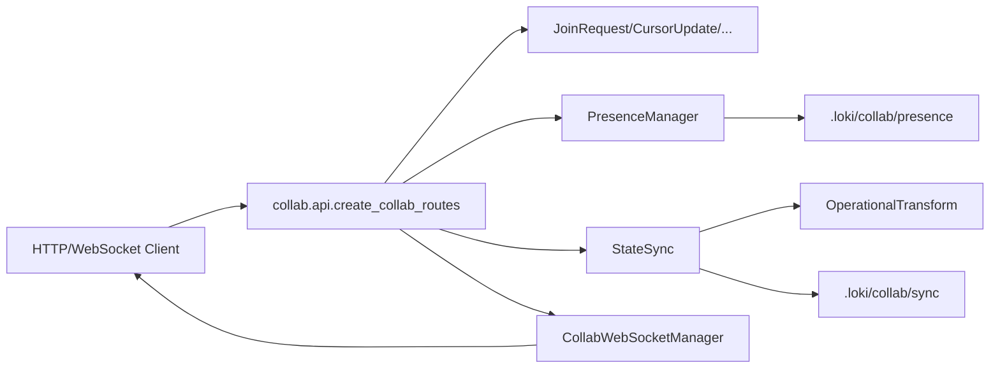

# api_contracts 深度解析（collab.api）

`api_contracts` 模块在协作系统里扮演的角色，可以类比为“机场的边检柜台”：它不负责飞机怎么飞（那是同步算法和实时通道的职责），但它决定什么证件是合法的、请求如何被翻译成内部动作、错误如何被明确反馈给客户端。这个模块存在的核心价值，是把“外部世界不稳定、格式多样的请求”转换成“内部组件可预测、可验证的调用”，从而把协作能力暴露成一套稳定 API，而不是让调用方直接碰 `PresenceManager`、`StateSync`、`CollabWebSocketManager` 这些内部实现。

---

## 先讲问题：为什么需要这个模块

如果没有 `collab.api`，最朴素的做法是让不同客户端直接调用 Presence / Sync / WebSocket 管理器。短期看开发很快，长期会出现三个问题：

第一，**协议漂移**。不同入口（HTTP、WebSocket、CLI、Dashboard）会各自实现一套请求字段和错误语义，最后“同一个操作，四种写法”。

第二，**输入不可信**。协作请求天然来自外部进程/用户，字段类型、枚举值、路径表达都可能不合法。如果直接穿透到状态层，错误会在更深处爆发，定位和防御都变差。

第三，**系统边界模糊**。内部对象（如 `UserStatus`、`OperationType`）与外部 JSON 的对应关系无法集中治理，导致升级时影响面不可控。

`collab.api` 的设计洞察是：**把协作系统拆成“边界层 + 领域层 + 通道层”**。边界层负责契约与翻译（本模块），领域层负责状态语义（`PresenceManager` / `StateSync`），通道层负责实时分发（`CollabWebSocketManager`）。这样每层都可以独立演进。

---

## 心智模型：把它当成“协议适配 + 领域编排”的薄控制层

理解这个模块最有效的方式是把它看成两个并行面：

一条是 **REST 面**，用于显式命令和查询（join、heartbeat、apply operation、history 等）；另一条是 **WebSocket 面**，用于实时会话和推送（connected、presence、sync_event、ping/pong）。

二者共用同一组后端单例：

- `get_presence_manager()` → `PresenceManager`
- `get_state_sync()` → `StateSync`
- `get_collab_ws_manager()` → `CollabWebSocketManager`

这意味着 API 层不是“业务状态拥有者”，而是“统一入口与调度者”。真正的状态在 `PresenceManager` 和 `StateSync` 里。



图里最关键的是：`create_collab_routes` 把“输入契约（Pydantic）—内部领域对象—广播反馈”串成了完整闭环。

---

## 架构与数据流：关键操作端到端追踪

### 1) 用户加入：`POST /api/collab/join`

请求先进入 `JoinRequest`（`name`, `client_type`, `metadata`）。`client_type` 会尝试转换成 `ClientType`，转换失败会回退到 `ClientType.API`，这是一个“容错优先”的边界策略。随后调用 `presence.join(...)`，由 Presence 层分配用户 ID、颜色、心跳初值并持久化。API 层最后返回 `JoinResponse`，只暴露外部需要的字段。

这里的设计重点是：**外部字符串枚举并不直接信任，而是尝试正规化再降级**，避免客户端因为一个拼写问题被硬拒绝。

### 2) 状态变更：`POST /api/collab/operation`

`OperationRequest` 进入后，先把 `operation.type` 映射到 `OperationType`，非法值直接 `400`。然后构造 `Operation` 并注入 `user_id`（来自 query 参数），调用 `sync.apply_operation(op)`。

`StateSync.apply_operation` 内部会做版本号推进（Lamport 风格的单调版本）、路径应用、历史记录与持久化。如果成功，API 层会调用 `ws_manager.broadcast(...)`，向其他实时连接分发 `type: "operation"` 消息，并 `exclude_user=user_id` 避免回声。

这条链路体现了模块的架构角色：**HTTP 命令面触发状态变更，WebSocket 负责传播副作用**。

### 3) 全量同步：`POST /api/collab/sync`

`SyncRequest` 带入 `state` + `version`，调用 `sync.sync_state(...)`。当远端版本更新时，`StateSync` 会接受远端快照并清空 pending 操作；否则保留本地。API 返回合并后状态、当前版本、哈希。

这条路径用于“冷启动 / 失步恢复”，与 operation 的增量路径形成互补：**平时走增量，异常时走快照兜底**。

### 4) WebSocket 会话：`/ws/collab`

连接建立后，API 先通过 `ws_manager.connect(...)` 创建 `CollabConnection`，然后立即下发 `connected` 初始包（用户列表 + 当前 state + version）。

进入循环后，服务端每 30 秒 `wait_for(receive_text())`；超时则主动发送 `{"type": "ping"}`。收到消息后由 `ws_manager.handle_message(...)` 分发到 join/heartbeat/cursor/operation/sync_request 等处理器，必要时回包。

这段逻辑说明 WebSocket endpoint 主要做三件事：

- 连接生命周期（connect/disconnect）
- 协议解包与错误兜底（JSON decode error）
- keepalive（timeout → ping）

具体业务动作仍下沉在 `CollabWebSocketManager` / `PresenceManager` / `StateSync`。

---

## 组件深潜：核心契约与设计意图

### `create_collab_routes(app)`

这是模块的装配入口。它在函数体内定义所有 Pydantic 请求/响应模型，然后把路由注册到 `app`。这种“局部定义 schema”的做法不常见，但有现实考虑：这些模型只在该路由集合内部使用，避免把 `collab.api` 文件外泄为全局类型包。

它的副作用是：调用后会绑定一整套 `/api/collab/*` 与 `/ws/collab` 路由，并捕获单例 manager（presence/sync/ws）。因此，调用时机应在 FastAPI app 初始化阶段。

### `JoinRequest`

包含 `name`（长度限制 1~100）、`client_type`（默认 `"api"`）、`metadata`。这里的限制把“输入质量”前置到边界层，减少后续分支复杂度。

### `OperationRequest`

它描述一条路径型状态操作：`type`, `path`, `value`, `index`, `dest_index`。注意 `path` 是 `List[Any]`，意味着 API 层允许字典键与列表索引混合寻址（如 `['tasks', 0, 'status']`）。这种模型通用性很高，但也把一部分正确性验证留给 `StateSync` 的内部路径检查。

### `SyncRequest`

`state + version` 的快照契约。它对应 `StateSync.sync_state` 的语义：比对版本，决定是否接受远端。这个契约是系统恢复能力的关键。

### `CursorUpdate`

`file_path`, `line`, `column`，以及可选 `selection_start/end`。API 层会把 list 转为 tuple 再构造 `CursorPosition`。这一步在语义上把“网络可序列化结构”映射成“领域对象结构”。

### `StatusUpdate`

单字段 `status`，再映射到 `UserStatus` 枚举。非法值立即 `400`，这与 join 的 client_type“降级容错”形成对比：**status 是行为语义，错了就拒绝；client_type 更偏标签，错了可降级**。

### `Config`

当前暴露的 `collab.api.Config` 仅包含 `from_attributes = True`，并且它实际上是 `UserResponse` 的内部 `Config`。也就是说，这里并非一个独立可配置类，而是 Pydantic 序列化行为设置。新贡献者容易误读这一点。

---

## 依赖分析：它调用谁、谁依赖它

从代码关系看，`collab.api` 是一个典型的**北向 API 层**。

它直接调用的内部依赖主要有三类：

- Presence 侧：`PresenceManager`（经 `get_presence_manager` 获取）
- Sync 侧：`StateSync`, `Operation`, `OperationType`（经 `get_state_sync` 获取）
- 实时通道：`CollabWebSocketManager`（经 `get_collab_ws_manager` 获取）

在更深一层，`StateSync` 会依赖 `OperationalTransform.transform_pair` 处理远端操作与本地 pending 操作冲突；Presence 和 Sync 都会写入 `.loki` 下的持久化文件。

谁会调用本模块？本质上是 FastAPI 启动装配过程：应用在初始化时调用 `create_collab_routes(app)`，之后所有外部客户端（Dashboard、扩展、CLI、其他 API 使用者）通过 HTTP/WebSocket 命中这些 endpoint，而不是直接操作领域类。

与其它文档的关系建议直接参考：

- [Collaboration](Collaboration.md)
- [Collaboration-Sync](Collaboration-Sync.md)
- [Collaboration-API](Collaboration-API.md)

---

## 设计取舍：非显而易见选择背后的理由

这个模块整体选择了“薄路由 + 厚领域管理器”。好处是路由代码可读、稳定，业务复杂度集中在 `PresenceManager`/`StateSync`；代价是 API 层对底层对象形状有较强认知（例如知道 `UserStatus`、`ClientType`、`OperationType` 的转换规则），存在一定耦合。

在一致性策略上，它采用“增量操作 + 版本推进 + 快照兜底”，没有在 API 层引入更重的事务语义。这在多人协作场景是合理平衡：常态路径轻量，冲突与失步依靠下层 OT 和 sync_state 恢复。

在容错策略上，API 层不是一刀切：`client_type` 错误时降级、`status`/`operation.type` 错误时拒绝。这个差异反映了设计者对“标签性字段”和“行为性字段”的风险分级。

---

## 使用方式与示例

典型接入方式是在应用启动时注册：

```python
from fastapi import FastAPI
from collab.api import create_collab_routes

app = FastAPI()
create_collab_routes(app)
```

发送状态操作示例：

```bash
curl -X POST "http://localhost:8000/api/collab/operation?user_id=u123" \
  -H "Content-Type: application/json" \
  -d '{
    "type": "set",
    "path": ["tasks", 0, "status"],
    "value": "done"
  }'
```

WebSocket 客户端消息示例（operation）：

```json
{
  "type": "operation",
  "op": {
    "type": "append",
    "path": ["logs"],
    "value": "new-line"
  }
}
```

---

## 新贡献者最该注意的边界条件与坑

最常见的坑是把 `api_contracts` 当作“纯类型定义层”。实际上 `collab.api` 不只是 schema，它还包含完整路由行为、错误策略和广播副作用。修改请求模型时，必须同步检查：REST handler、`Operation.from_dict/to_dict`、WebSocket 消息协议是否保持兼容。

第二个坑是对路径语义掉以轻心。`get_state_value` 会把 `path` 的每段尝试转 int；`OperationRequest.path` 又允许任意类型。这让 API 很灵活，但意味着歧义路径（如字符串数字键）需要调用方非常清楚约定。

第三个坑是会话与用户生命周期并不完全由 WebSocket 控制。HTTP 也能 join/leave/heartbeat；WebSocket disconnect 会触发 `presence.leave`。如果你在新功能里引入额外身份层，必须统一这两条入口的语义。

第四个坑是单例 manager 的进程级行为。`get_presence_manager` / `get_state_sync` / `get_collab_ws_manager` 默认返回全局实例，适合单进程部署和简单共享；在多 worker 或多实例部署时，需要明确你的状态一致性策略（尤其是文件持久化与实时广播的一致性预期）。

---

## 结语

`api_contracts` 模块的本质不是“定义了几个 Pydantic 类”，而是协作系统的边界治理器：它把不可靠输入转换为可靠内部动作，把领域事件包装成外部可理解协议，并在 REST 与 WebSocket 之间建立一致语义。理解它，等于理解整个协作子系统如何对外“说话”。
