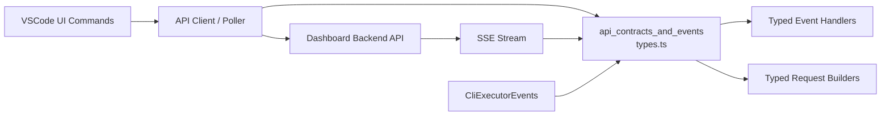
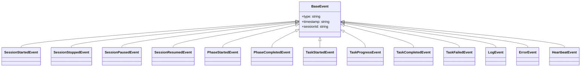
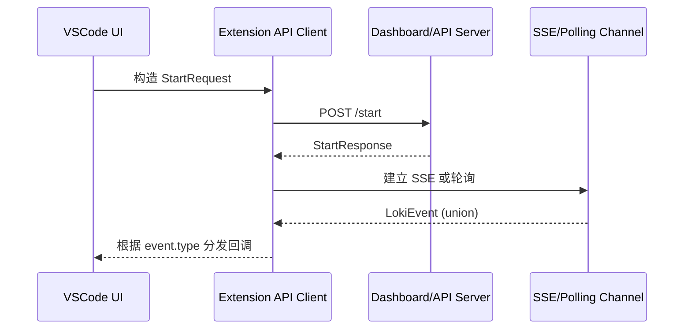
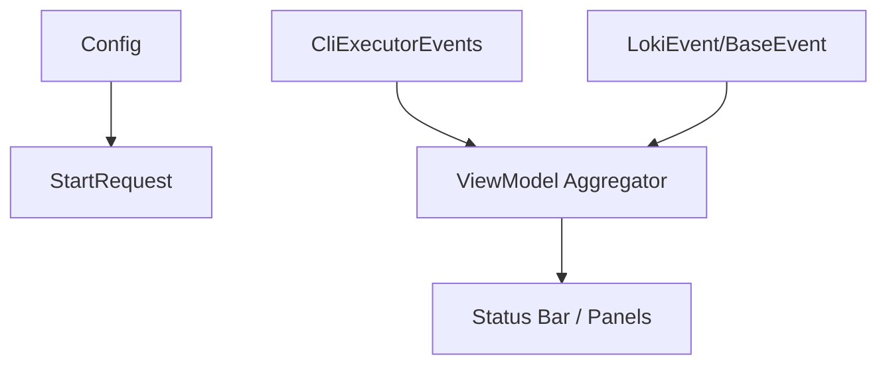

# api_contracts_and_events 模块文档

## 模块简介

`api_contracts_and_events` 是 VSCode Extension 与 Loki 后端之间的“协议边界层”。它并不直接发起网络请求，也不管理进程生命周期，而是通过一组 TypeScript 类型（request/response contracts + event contracts）把“客户端认为会收到什么”和“服务端应该返回什么”明确下来。这个模块存在的核心价值，是把原本隐式、分散在代码中的接口假设，收敛成可编译校验的契约定义，从而降低联调成本、减少版本漂移导致的运行时错误。

从系统设计角度看，这一层在 VSCode 扩展里扮演了与 [Dashboard Backend](Dashboard Backend.md) API 同步的角色，同时为 `cli_process_lifecycle_events`（`CliExecutorEvents`）提供可组合的数据模型。前者描述 HTTP/SSE 的远端语义，后者描述本地 CLI 进程语义，两者在扩展内部共同构成“状态感知”能力。

## 在整体系统中的位置



这张图强调了一个关键事实：`types.ts` 不是“被动声明文件”，而是客户端状态机和后端事件流的连接点。扩展内的请求构造、响应解析、事件分发都依赖这里的类型来约束。

> 关联阅读：
> - VSCode 扩展总体架构见 [VSCode Extension](VSCode Extension.md)
> - API 服务端的事件与路由见 [API Server & Services](API Server & Services.md)
> - 控制平面与健康检查端点语义见 [Dashboard Backend](Dashboard Backend.md)

## 设计原则与契约边界

该模块采用了三条非常清晰的约束原则。第一，所有可观察状态都应该有字面量联合类型（例如 `Phase`、`TaskStatus`、`Provider`），避免“任意字符串”传播到业务层。第二，事件统一采用 `type` 作为判别字段，形成 discriminated union，使 `switch(event.type)` 的分支具备完整类型收窄。第三，请求与响应尽量贴近服务端真实返回，而不是在客户端二次封装成统一壳结构，这一点在 `StatusResponse = SessionStatus` 上体现得很明显。

## 核心数据模型

### 1) `ApiResponse`

`ApiResponse` 是基础响应壳：

```ts
interface ApiResponse {
  success: boolean;
  message?: string;
  error?: string;
}
```

它用于“控制型 endpoint”（例如 stop/pause/resume 一类）的常规成功/失败表达。内部语义是：`success` 决定控制流，`message` 面向用户提示，`error` 面向错误详情。由于不是所有 endpoint 都返回这个结构，因此使用时不能假设“所有返回都有 success 字段”。

### 2) `StartRequest`

`StartRequest` 定义启动会话的输入契约：

```ts
interface StartRequest {
  prd: string;
  provider?: 'claude' | 'codex' | 'gemini';
  options?: StartOptions;
}
```

`prd` 是必填项，代表会话的需求输入；`provider` 允许覆盖默认模型；`options` 用于执行策略调优（`dryRun`、`skipTests`、`parallel`、`maxAgents` 等）。这里要注意它与 VSCode 配置模块（`Config.provider`）的关系：配置提供默认值，而 `StartRequest.provider` 提供单次请求覆盖值，二者优先级应在调用层明确。

### 3) `InputResponse`

`InputResponse` 目前被标注为 `PLANNED` / `@deprecated`（因为 `/input` endpoint 尚未在服务端实现）：

```ts
interface InputResponse {
  received: boolean;
  queuePosition?: number;
  error?: string;
}
```

这意味着它是“前瞻性契约”，不是“现网可依赖契约”。对扩展开发者来说，正确做法是把它作为未来兼容预留，不应把核心交互流程建立在该接口可用的假设上。

### 4) `BaseEvent`

`BaseEvent` 是绝大多数 SSE 事件的共同父结构：

```ts
interface BaseEvent {
  type: string;
  timestamp: string;
  sessionId: string;
}
```

它确立了事件总线最基本的三元组：事件类别、发生时间、所属会话。后续事件类型通过继承它并收窄 `type` 字面量，实现强类型分发。

## 事件系统：从基类到联合类型



模块将事件分成两层。第一层是“标准 SSE 事件”，统一继承 `BaseEvent`，包含 session/phase/task/log/error/heartbeat。第二层是“扩展轮询事件”，例如 `StatusPollEvent` 和 `ConnectionErrorEvent`，它们不含 `sessionId`，用于非 SSE 路径下的状态同步与连接失败报告。

这种“双来源统一消费”设计，使上层 UI 可以用一个 `LokiEvent` 联合类型处理实时流和轮询流，减少重复处理逻辑。

## 关键流程：类型如何驱动运行时行为



这个流程里，`StartRequest` 约束请求输入，`StartResponse/StatusResponse/ApiResponse` 约束响应解析，`BaseEvent + LokiEvent` 约束事件分发。真正的价值在于：当服务端字段变更时，类型层会第一时间暴露不兼容点，而不是等到运行时出错。

## API 合同详解（实用视角）

### 请求类型

`StartRequest` 是当前最核心请求。`options.maxAgents` 这样的字段虽然在类型上是 `number`，但业务上通常应限制为正整数；类型层不做值域验证，调用层仍需参数校验。`InputRequest`（虽然不在本模块核心组件列表中）与 `InputResponse` 对应，当前更适合作为接口草案。

### 响应类型

响应存在“平铺返回”和“壳结构返回”两种形式。比如 `StatusResponse` 直接是 `SessionStatus`，而不是 `{ success, data }`。这要求调用代码按 endpoint 分支解析，不可用单一解码器强行统一。

### 事件回调类型

`EventCallbacks` 为每个 `type` 提供了精确签名，推荐优先使用它而不是 `(event: LokiEvent) => void` 的全局回调。前者让 IDE 自动提示事件负载字段，减少 `as` 类型断言。

## 与其他模块的关系

该模块与 `configuration_and_settings_access` 形成“配置默认值 + 单次请求覆盖”关系：`Config` 决定基础连接参数（如 `apiBaseUrl`、`pollingInterval`、`provider`），`StartRequest` 在运行时按需覆盖。与 `cli_process_lifecycle_events` 的关系是语义互补：`CliExecutorEvents` 关注本地 server 进程（starting/stopped/stderr），`BaseEvent/LokiEvent` 关注远端会话业务状态（phase/task/log）。



## 使用示例

```ts
import type { StartRequest, EventCallbacks, LokiEvent } from './api/types';

const req: StartRequest = {
  prd: 'docs/prd.md',
  provider: 'claude',
  options: { verbose: true, parallel: true, maxAgents: 3 }
};

const callbacks: EventCallbacks = {
  'task:progress': (e) => {
    console.log(`[${e.data.progress}%] ${e.data.message}`);
  },
  'error': (e) => {
    if (e.data.fatal) {
      console.error(`Fatal: ${e.data.code} ${e.data.message}`);
    }
  }
};

function handleAnyEvent(event: LokiEvent) {
  switch (event.type) {
    case 'session:started':
      // event 自动收窄为 SessionStartedEvent
      break;
    case 'status':
      // 轮询状态事件
      break;
  }
}
```

## 扩展与演进建议

当你要新增事件类型时，建议同时更新四处：具体事件 interface、`LokiEvent` 联合、`LokiEventType`、`EventCallbacks`。如果只改了前两者，调用方无法得到精确回调提示；如果漏改联合类型，事件在总线中会退化为“未知字符串”。

若要引入新的 provider（例如 `openai`），需要同步更新 `Provider` 联合类型、配置层默认值校验（见 [VSCode Extension](VSCode Extension.md) 中 Config 章节）以及服务端参数校验逻辑，避免前后端接受集合不一致。

## 边界条件、错误场景与限制

当前模块有几个容易忽略的限制。首先，`SessionState` 类型包含 `completed`/`failed`，但 `SessionStatus.state` 当前只允许 `'running' | 'paused' | 'stopping' | 'stopped'`，这代表“理论状态全集”与“当前 endpoint 返回子集”并存，消费方不要混用。其次，`timestamp` 全是字符串，默认假设 ISO 8601；类型层不保证时区与格式合法。再次，`InputResponse` 所属能力尚未落地，代码中应标记为 optional path。

此外，`Task` 支持递归 `subtasks?: Task[]`，在 UI 渲染中要防止深层嵌套引发性能问题或无限递归（尤其在异常数据输入时）。`ApiError` 把 `response` 设为 `unknown`，这是有意设计：调用层必须显式做类型守卫，避免盲目访问错误响应字段。

## 维护建议

建议把这个模块当作“外部契约真相源（source of truth）”维护：每次后端字段调整都先改类型再改调用代码。对于注释里写有 “matches dashboard/server.py” 的项，发布前应做一次契约对齐检查，确保扩展版本与后端版本兼容。

如果你需要更深入理解本地进程事件与远端业务事件如何合并，请继续阅读 [cli_process_lifecycle_events](cli_process_lifecycle_events.md) 与 [configuration_and_settings_access](configuration_and_settings_access.md)。