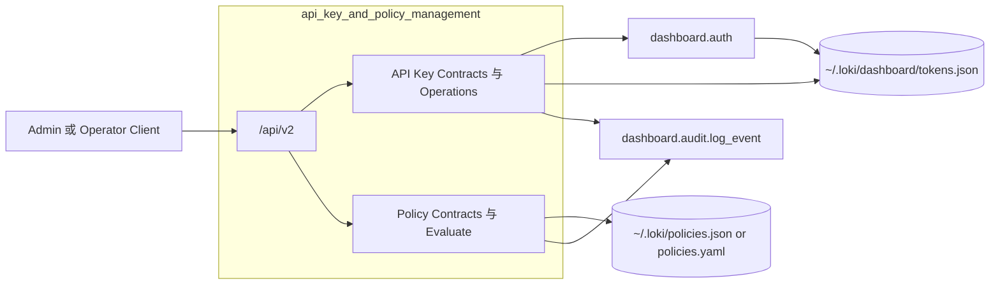
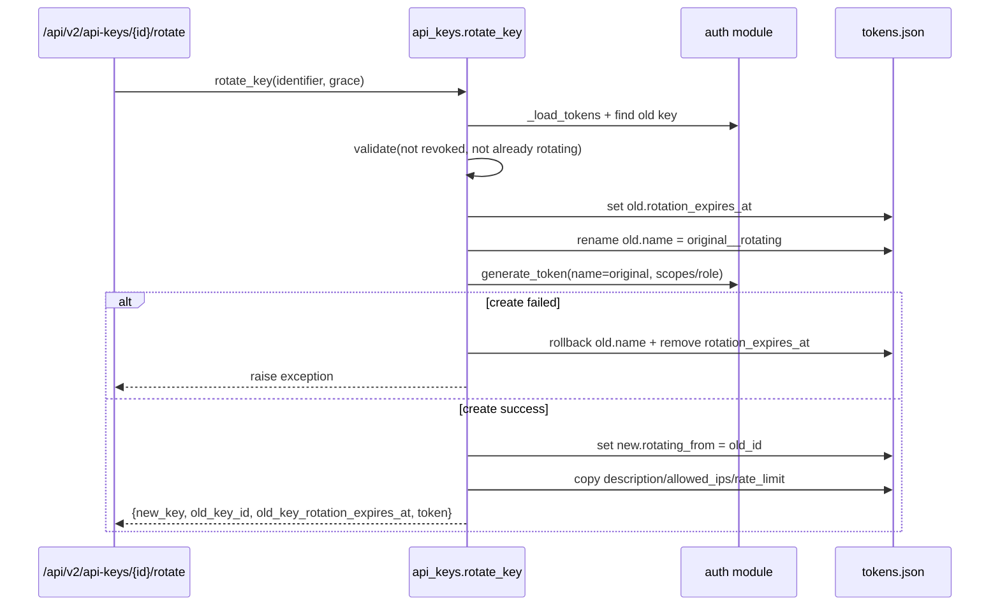
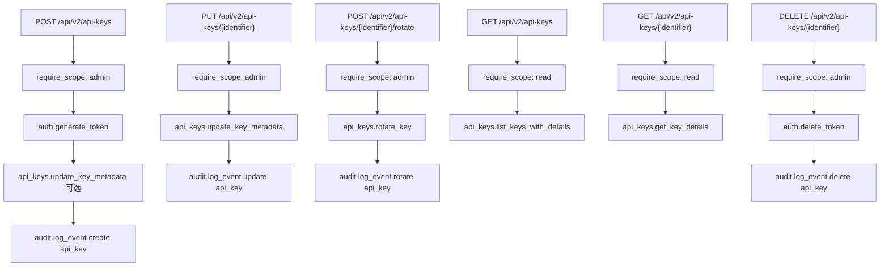
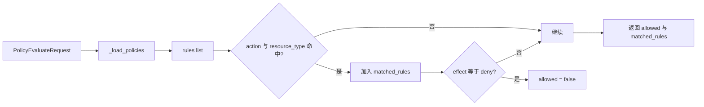

# api_key_and_policy_management 模块文档

## 模块简介与设计动机

`api_key_and_policy_management` 是 Dashboard Backend 中负责“访问凭证治理”和“策略配置治理”的核心子模块。它将两类能力集中到同一组 API 合约与实现中：第一类是 API Key 的生命周期管理（创建、查询、元数据更新、轮换、清理与使用统计）；第二类是策略文件（policies）的读取、更新和即时评估。这个模块存在的根本原因是，系统需要在不牺牲可运维性的前提下，为管理员提供可控、可审计、可渐进演化的安全控制面。

从实现方式看，模块并没有重新发明认证系统，而是建立在 `dashboard.auth` 之上扩展。认证模块负责令牌生成、校验、删除和 scope 鉴权；本模块负责附加的管理语义，例如轮换宽限期、元数据字段（`description`、`allowed_ips`、`rate_limit`）、策略负载大小保护、策略匹配结果回传等。这样的分层让核心认证逻辑保持简洁，同时让管理层能力可以独立迭代。

在系统全景里，它位于 API Surface（`dashboard.api_v2`）和 Auth/Audit/Policy 文件存储之间。若你先阅读 [api_surface_and_transport.md](api_surface_and_transport.md) 与 [API Keys.md](API%20Keys.md)，再回到本文，会更容易理解“路由层契约”和“模块内部行为”的边界。

---

## 模块边界与架构定位



这张图反映了一个关键事实：本模块的“数据后端”并非数据库，而是以文件为主（tokens/policies），并通过 `auth` 与 `audit` 形成闭环。也因此，模块行为具备很强的本地可移植性，但也天然带来文件并发写入和跨实例一致性方面的注意事项（后文会详细说明）。

---

## 核心组件总览

当前模块由两组核心组件组成：

- `dashboard.api_keys` 中的 API Key 数据契约：`ApiKeyCreate`、`ApiKeyResponse`、`ApiKeyRotateRequest`、`ApiKeyRotateResponse`
- `dashboard.api_v2` 中与本模块直接相关的 V2 契约：`ApiKeyUpdateRequest`、`PolicyUpdate`、`PolicyEvaluateRequest`

这些组件的职责不是“存储模型”，而是“外部输入输出契约”。真正的读写和行为发生在 `dashboard.api_keys` 的函数（如 `rotate_key`、`update_key_metadata`）及 `dashboard.api_v2` 的路由处理函数中。

---

## 数据契约详解

## `dashboard.api_keys.ApiKeyCreate`

`ApiKeyCreate` 是创建 API Key 请求体的结构定义。它要求 `name` 必填，其余字段可选：`scopes`、`role`、`expires_days`、`description`、`allowed_ips`、`rate_limit`。在语义上，`scopes` 与 `role` 都表达权限边界，但最终解析规则由 `auth.generate_token` 决定：当 `role` 存在时，系统以角色映射得到 scope；当 `role` 为空时，才使用显式传入的 `scopes`。

`rate_limit` 在模型层只做类型定义（`int | None`），并附带描述“Requests per minute”，但不在此层执行上限/下限校验；后续是否执行限速需由消费方实现。

## `dashboard.api_keys.ApiKeyResponse`

`ApiKeyResponse` 用于向调用方回传密钥元信息。它包含基础身份字段（`id`、`name`、`scopes`、`role`）、生命周期字段（`created_at`、`expires_at`、`last_used`、`revoked`）、扩展控制字段（`description`、`allowed_ips`、`rate_limit`）、轮换关系字段（`rotating_from`、`rotation_expires_at`）以及统计字段（`usage_count`）。

该结构体现了“展示安全信息而非秘密”的设计原则：返回中不包含 `hash`/`salt`，而原始 `token` 只会在创建或轮换时以单独字段一次性返回。

## `dashboard.api_keys.ApiKeyRotateRequest`

`ApiKeyRotateRequest` 只包含一个关键参数 `grace_period_hours`，默认 24，且约束 `ge=0`。它表达的是“旧 key 与新 key 的并行生效窗口”。允许 `0` 的意义是可以做近乎即时切换，但仍沿用统一轮换流程。

## `dashboard.api_keys.ApiKeyRotateResponse`

`ApiKeyRotateResponse` 返回轮换结果，包括 `new_key`（新 key 的完整元数据视图）、`old_key_id`、`old_key_rotation_expires_at` 和 `token`（新 key 明文，仅一次）。其中 `token` 是最敏感字段，客户端必须在收到响应时立即写入安全存储。

## `dashboard.api_v2.ApiKeyUpdateRequest`

`ApiKeyUpdateRequest` 是 `/api/v2/api-keys/{identifier}` 更新接口使用的请求模型。其字段与 `update_key_metadata` 对齐：`description`、`allowed_ips`、`rate_limit`，全部可选。重要语义是“`None` 表示不修改该字段”，而不是“清空字段”。这意味着当前 API 不支持通过显式 `null` 清空元数据。

## `dashboard.api_v2.PolicyUpdate`

`PolicyUpdate` 定义了策略更新请求体，仅包含 `policies: dict`。该模型将策略内容保持为自由结构字典，便于后续策略 schema 演进，不把规则系统过早固化在接口层。

## `dashboard.api_v2.PolicyEvaluateRequest`

`PolicyEvaluateRequest` 用于即时策略评估，字段为 `action`、`resource_type`、可选 `resource_id`、可选 `context`。当前实现只使用 `action` 与 `resource_type` 做匹配；`resource_id/context` 预留给更复杂的策略引擎。

---

## API Key 内部实现机制（`dashboard/api_keys.py`）

## 查询与定位：`_find_token_entry(identifier)`

内部函数 `_find_token_entry` 通过 `auth._load_tokens()` 读取 token 文件后，在 `tokens["tokens"]` 中逐项匹配：若 `identifier` 与 token id 相同，或与 `entry["name"]` 相同，即返回 `(token_id, token_entry)`。未命中返回 `None`。

这个函数使外部 API 支持“ID/名称双标识”访问，提升易用性，但也引出一个运维约束：名称必须保持唯一，否则会出现定位歧义。当前唯一性由 `auth.generate_token` 在创建时保障。

## 核心流程：`rotate_key(identifier, grace_period_hours=24) -> dict`

`rotate_key` 是本模块最关键的状态变更函数。其执行流程可以分解为“验证旧 key → 标记旋转状态 → 创建新 key → 写入关联与元数据复制 → 返回一次性 token”。



该函数的参数含义直接：`identifier` 是旧 key 的 id 或 name，`grace_period_hours` 是宽限期小时数。返回值是字典，不是 Pydantic 实例，但字段与 `ApiKeyRotateResponse` 结构一致。

其错误条件包括三类：找不到 key、旧 key 已 revoked、旧 key 已处于 rotation。此外，函数实现了显式回滚：若新 key 创建失败，会把旧 key 名称和 rotation 标记恢复，避免系统停留在中间状态。

副作用方面，它会多次读写 token 文件，并临时修改旧 key 名称为 `original_name__rotating`。这是一种“借名腾位”技巧，用于绕过 `generate_token` 的重名校验。

## 元数据读取：`get_key_details(identifier) -> Optional[dict]`

该函数返回“安全副本”而非原始存储对象，只暴露业务字段，不包含 `hash/salt/token`。找不到返回 `None`。这使它可直接用于 API 响应层。

## 元数据更新：`update_key_metadata(...) -> dict`

`update_key_metadata` 支持按需更新 `description`、`allowed_ips`、`rate_limit`。参数为 `None` 时表示忽略该字段，因此该函数是“部分更新（patch-like）”语义。

如果 key 不存在会抛 `ValueError`。成功后调用 `get_key_details` 返回更新结果。副作用是读取并覆盖保存 token 文件。

## 列表查询：`list_keys_with_details(include_rotating=True) -> list[dict]`

该函数遍历所有 token，并默认过滤掉 `revoked` key。`include_rotating=False` 时还会过滤正在轮换宽限期内的旧 key（即存在 `rotation_expires_at` 的条目）。

结果数据同样是安全字段集合，适合管理台列表页直接展示。

## 轮换清理：`cleanup_expired_rotating_keys() -> list[str]`

该函数扫描所有 key 的 `rotation_expires_at`，将时间点早于当前 UTC 时间的条目删除并保存。返回被删除的 key id 列表。

它是“后处理清理”机制，而不是自动后台任务。也就是说，不调用它，过期 rotating key 会继续存在于文件中。

## 使用统计：`get_key_usage_stats(identifier)` 与 `increment_usage(identifier)`

`get_key_usage_stats` 读取 `usage_count`、`last_used`、`created_at`，并计算 `age_days`。`increment_usage` 则将 `usage_count` 自增 1。设计注释中明确说明：它被刻意与 `auth.validate_token` 解耦，目的是不侵入 auth 代码。

这带来一个实际影响：如果调用链忘记显式调用 `increment_usage`，统计可能低估真实请求量。

---

## V2 路由中的 API Key 与 Policy 管理行为（`dashboard/api_v2.py`）

本模块对外主要通过 `/api/v2` 下的端点暴露。以下只展开与当前模块直接相关的路由行为。

## API Key 端点族



`create_api_key` 的内部顺序是先创建基础 token，再尝试补写扩展元数据。若 metadata 更新理论上失败（代码中被 `except ValueError: pass` 吞掉），不会影响创建结果返回。这个选择偏向“保证可用性”，但在极端场景下可能导致“key 已创建但元数据未生效”的短暂不一致。

`update_api_key` 和 `rotate_api_key` 都会把 `ValueError` 映射成 HTTP 错误：更新失败为 404（key 未找到），轮换失败为 400（参数或状态不满足）。

## Policy 端点族

### 文件路径解析与加载保存

`_LOKI_DIR` 来自环境变量 `LOKI_DATA_DIR`，默认 `~/.loki`。`_get_policies_path()` 的选择顺序是：优先现有 `policies.json`，其次现有 `policies.yaml`，都不存在则回落到 JSON 路径。

`_load_policies()` 会根据后缀决定加载方式：JSON 直接解析；YAML 尝试 `import yaml` 并 `safe_load`，若依赖缺失则返回空字典。解析失败（JSONDecodeError/IOError）同样返回空字典。

`_save_policies()` 总是写入 `policies.json`，并自动创建父目录。注意这意味着：即使原来是 YAML 文件，执行更新后也会生成/切换到 JSON 版本。

### 更新策略：`PUT /api/v2/policies`

更新时会先把 `body.policies` 序列化为 JSON 字符串并检查 UTF-8 字节数，超过 1MB 返回 `413 Payload Too Large`。通过后持久化并写审计日志。

该限制是一个简单但有效的防御措施，避免策略文件被异常大 payload 挤爆内存或磁盘。

### 评估策略：`POST /api/v2/policies/evaluate`

当前评估逻辑是“轻量规则匹配器”，并非完整策略引擎：

1. 读取策略中的 `rules` 数组（默认空）
2. 初始化结果 `allowed=True`
3. 遍历每条 rule，匹配条件为
   - `rule.action == "*"` 或等于请求 `action`
   - 且 `rule.resource_type == "*"` 或等于请求 `resource_type`
4. 若匹配则追加到 `matched_rules`
5. 只要匹配规则中存在 `effect == "deny"`，最终 `allowed=False`



这个算法的行为非常直接：默认允许，命中 deny 才拒绝。它不处理优先级、条件表达式、主体身份、上下文约束，也不使用 `resource_id/context` 字段。

---

## 与认证、审计、策略引擎模块的关系

从依赖关系看，当前模块是“管理面”而非“决策执行面”。它直接依赖：

- `dashboard.auth`：鉴权依赖（`require_scope`、`get_current_token`）与 token 基础操作（`generate_token`、`delete_token`、token 文件读写）
- `dashboard.audit`：在 create/update/delete/rotate policy update 等操作后写审计事件

同时它与更通用的策略能力（见 [Policy Engine.md](Policy%20Engine.md)）存在功能层级差异：`/api/v2/policies/evaluate` 是 Dashboard 侧的轻量评估入口，不等同于主系统策略引擎的完整执行语义。如果需要复杂策略（多维上下文、成本策略、审批链等），应在文档和实现上明确由策略引擎模块承接。

---

## 关键行为约束、边界条件与常见坑

## 1. 文件存储并发风险

token 与 policy 都是文件读写模型。当前实现未引入显式文件锁。在多线程/多进程/多实例并发写入时，可能出现“最后写入覆盖先写入”的竞态。对于生产部署，建议在单实例控制面下运行，或在存储层引入锁/事务化后端。

## 2. 轮换期间的旧 key 名称变化

旧 key 会被临时改名为 `original__rotating`。如果外部系统通过“名称”硬编码引用旧 key 元数据，可能在轮换期查询不到原名条目。更稳妥做法是使用 key `id` 作为内部关联主键。

## 3. 轮换清理不是自动调度

`cleanup_expired_rotating_keys` 需要被显式调用（例如定时任务）。否则过期的 rotating key 不会自动删除，只是逻辑上已过期。

## 4. 策略加载失败会静默降级为空策略

`_load_policies` 在 JSON 解析失败、YAML 依赖缺失或 I/O 错误时返回 `{}`。这会让评估逻辑回到“默认允许”。运维上应配合告警或完整性检查，避免因文件损坏导致策略形同失效。

## 5. `ApiKeyUpdateRequest` 无法显式清空字段

由于更新函数以 `None` 表示“不改”，调用 `PUT` 时传 `null` 不能实现清空。若需要清空语义，需扩展 API（例如增加显式 `clear_fields` 或使用 sentinel）。

## 6. 速率与 IP 仅作为元数据存储

`allowed_ips` 与 `rate_limit` 在本模块内主要用于记录和回传，是否生效取决于网关或鉴权中间件是否消费这些字段。不要误以为写入后会自动强制执行。

## 7. 审计记录受开关控制

路由中普遍调用 `audit.log_event`，但其内部会受 `ENTERPRISE_AUDIT_ENABLED` 控制，未开启时返回 `None` 并不落盘。这是预期行为，不应误判为代码未执行。

---

## 使用与扩展示例

## 通过 V2 API 创建并轮换 key

```bash
# 创建 key
curl -X POST "$BASE_URL/api/v2/api-keys" \
  -H "Authorization: Bearer $ADMIN_TOKEN" \
  -H "Content-Type: application/json" \
  -d '{
    "name": "ci-bot",
    "role": "operator",
    "expires_days": 30,
    "description": "CI pipeline key",
    "allowed_ips": ["10.0.0.0/8"],
    "rate_limit": 120
  }'

# 轮换 key（旧 key 再保留 12 小时）
curl -X POST "$BASE_URL/api/v2/api-keys/ci-bot/rotate" \
  -H "Authorization: Bearer $ADMIN_TOKEN" \
  -H "Content-Type: application/json" \
  -d '{"grace_period_hours": 12}'
```

## 策略更新与评估

```bash
# 更新策略
curl -X PUT "$BASE_URL/api/v2/policies" \
  -H "Authorization: Bearer $ADMIN_TOKEN" \
  -H "Content-Type: application/json" \
  -d '{
    "policies": {
      "rules": [
        {"action": "delete", "resource_type": "project", "effect": "deny"},
        {"action": "*", "resource_type": "run", "effect": "allow"}
      ]
    }
  }'

# 评估某动作
curl -X POST "$BASE_URL/api/v2/policies/evaluate" \
  -H "Authorization: Bearer $CONTROL_TOKEN" \
  -H "Content-Type: application/json" \
  -d '{"action":"delete", "resource_type":"project"}'
```

---

## 可维护性建议（面向扩展开发）

如果你计划扩展本模块，建议优先沿着以下方向改进：第一，引入文件锁或迁移到事务化存储，解决并发写一致性问题；第二，把 `allowed_ips/rate_limit` 的执行路径前移到统一鉴权中间层，避免“写了但不生效”的认知偏差；第三，给 policy evaluate 增加规则优先级与 context 匹配能力，使其与主策略引擎能力逐步对齐；第四，为 metadata 更新提供“显式清空”语义，提升 API 表达力。

这些改进可以在不破坏现有契约的前提下逐步上线：先新增可选字段/可选逻辑，再在客户端与 SDK 中渐进采用。

---

## 相关文档

- [api_surface_and_transport.md](api_surface_and_transport.md)：Dashboard API 路由与传输层机制
- [API Keys.md](API%20Keys.md)：API Key 模块的通用说明
- [Policy Engine.md](Policy%20Engine.md)：主策略引擎能力边界与设计
- [Audit.md](Audit.md)：审计日志、完整性校验与导出
- [Dashboard Backend.md](Dashboard%20Backend.md)：后端整体结构与分层说明
