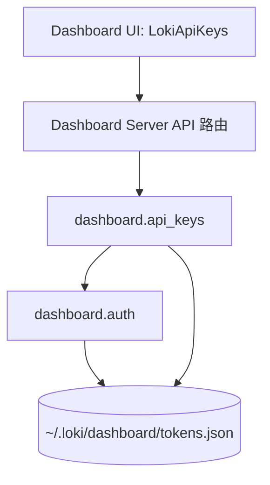
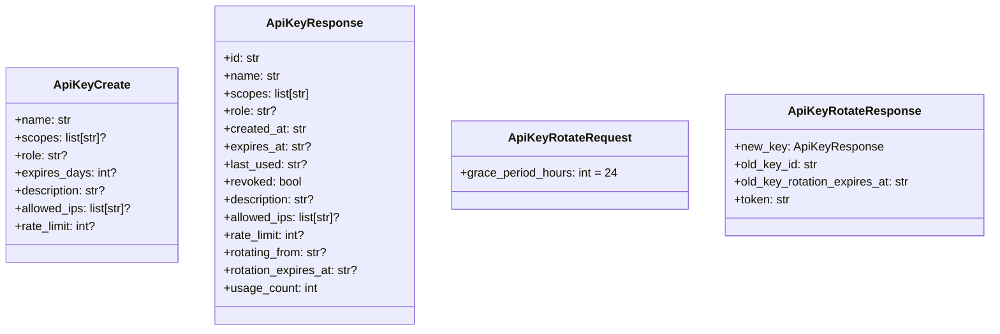
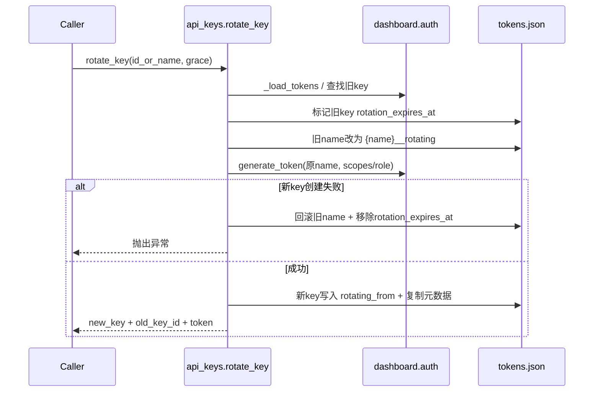
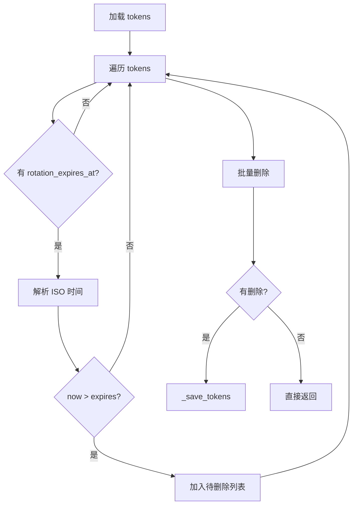
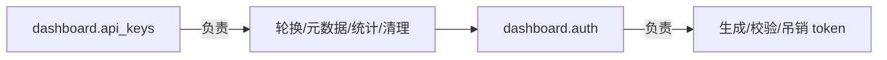

# api_key_management 模块文档

## 模块简介与设计动机

`api_key_management` 模块对应后端文件 `dashboard/api_keys.py`，是 Dashboard Backend 中专门处理 API Key 生命周期增强能力的一层。它并不重新发明底层认证机制，而是在 `dashboard.auth` 已有的 token 生成、校验、吊销基础上，补齐了面向运维和治理场景的能力：**密钥轮换（含宽限期）、扩展元数据管理、使用统计、轮换过期清理**。

从设计上看，这个模块解决的是“认证可用”到“认证可运营”之间的缺口。`dashboard.auth` 关注的是“token 是否有效”；而 `api_key_management` 进一步关注“token 如何安全平滑替换、如何附加管控信息、如何观测使用情况”。这使它成为 Dashboard 管理面（尤其是 `loki-api-keys` 组件和管理 API）背后的关键服务层。

模块注释中明确说明其存储模型是扩展 `~/.loki/dashboard/tokens.json`。也就是说，它与 `dashboard.auth` 共用同一份 token 数据源，但会写入更多字段（如 `description`、`allowed_ips`、`rate_limit`、`rotation_expires_at`、`usage_count`），从而保持兼容并渐进增强。

## 在系统中的位置



这个位置关系说明了一个核心事实：`api_key_management` 是一个“中间能力层”。它向上提供更友好的管理语义，向下复用 `auth` 的安全原语。它并不替代 `auth.validate_token()` 这类认证流程，而是补充治理逻辑。

若要理解 API 暴露层和请求路由，可参考 [api_surface_and_transport.md](api_surface_and_transport.md)。若要理解更广义后端上下文，可参考 [Dashboard Backend.md](Dashboard Backend.md)。

## 核心数据模型（Pydantic Schemas）

本模块包含四个核心 schema，它们定义了 API 输入输出契约。



### `ApiKeyCreate`

用于创建 key 的请求体。除 `name` 外其它字段可选。需要注意 `scopes` 与 `role` 在底层 `auth.generate_token()` 中有互斥语义：当 `role` 给定时，权限集合通常由角色解析得到，而不是直接使用 `scopes`。

`rate_limit` 通过 `Field(..., description="Requests per minute")` 提供了语义提示，但当前模型未施加 `ge` 约束，因此负数等非法值需要在上层 API 或调用方自行约束。

### `ApiKeyResponse`

这是管理面最常见的返回对象。相比 `dashboard.auth.list_tokens()` 的“安全最小字段”，它增加了元数据和轮换关系字段，便于运维可视化。

特别地，`usage_count` 默认值为 0，意味着即使历史记录里不存在该字段，也能平滑读出一个可用值。

### `ApiKeyRotateRequest`

只包含 `grace_period_hours`，默认 24，且 `ge=0`。这意味着**允许 0 小时宽限期**（即近似立即切换）。

### `ApiKeyRotateResponse`

返回新旧 key 的关联信息，并携带一次性明文 `token`。该字段与 `auth.generate_token()` 的安全模型一致：明文只在创建/轮换时返回一次，后续仅存储 hash/salt。

## 内部辅助函数

### `_find_token_entry(identifier: str) -> Optional[tuple[str, dict]]`

该函数接受 key `id` 或 `name`，遍历 `auth._load_tokens()["tokens"]` 并返回 `(token_id, token_entry)`。这是模块内部最核心的检索原语，几乎所有公开操作都先依赖它定位对象。

它的副作用是无（只读），失败返回 `None`。需要注意的是，按 `name` 匹配假设了名称唯一性，这一约束来源于 `auth.generate_token()` 的重复名检查。

## 公开 API 详解

### `rotate_key(identifier: str, grace_period_hours: int = 24) -> dict`

`rotate_key` 是本模块最复杂的流程，目标是在不中断调用方的前提下替换密钥。



内部关键步骤如下：

1. 校验旧 key 必须存在，且不能是 revoked，也不能已处于 rotation 状态。
2. 计算 `rotation_expires_at = now + grace_period_hours`（UTC ISO 格式）。
3. 将旧 key 名称临时改为 `original_name__rotating`，原因是 `auth.generate_token()` 不允许重名；如果不改名则无法生成同名新 key。
4. 调用 `auth.generate_token()` 创建替代 key，继承旧 key 的角色/权限语义。
5. 失败时执行回滚（恢复旧名字并删除轮换标记）。
6. 成功后在新 key 上写入 `rotating_from=old_id`，并复制 `description` / `allowed_ips` / `rate_limit`。

返回值是字典，不是 Pydantic 对象实例，通常由 API 层再包装为 `ApiKeyRotateResponse`。

### 错误条件

- `Key not found: {identifier}`
- `Cannot rotate a revoked key`
- `Key is already in rotation`
- 以及底层 `auth.generate_token()` 可能抛出的校验异常（如名称冲突、角色非法）

### 设计亮点与限制

亮点是显式回滚，减少“旧 key 被改名但新 key 没生成”的脏状态风险。限制在于整个过程依赖多次 `_load_tokens/_save_tokens`，在高并发下理论上存在竞态窗口（例如并发轮换同一个 key）。

## `get_key_details(identifier: str) -> Optional[dict]`

返回单个 key 的完整安全可展示信息，明确排除了 hash/salt。这个函数是管理 UI 查看详情、编辑前回填、审计展示的基础能力。

返回 `None` 表示不存在；无异常抛出，因此调用方通常可将其映射为 `404` 或空结果。

## `update_key_metadata(identifier, description=None, allowed_ips=None, rate_limit=None) -> dict`

用于非轮换场景下的元数据修改。参数采用“`None` 表示不变”的语义，而不是“置空”。这点很重要：当前实现没有提供显式“清空字段”操作（除非调用方传入空字符串或空列表，具体取决于字段类型）。

函数流程是定位 key → 条件更新字段 → 保存 → 返回最新详情。若 key 不存在抛 `ValueError`。

## `list_keys_with_details(include_rotating: bool = True) -> list[dict]`

返回所有未 revoked 的 key，并带增强字段。默认包含处于轮换宽限期中的旧 key；当 `include_rotating=False` 时会过滤掉 `rotation_expires_at` 非空的项。

注意此函数**总是忽略 revoked key**，即便调用方希望看到所有历史，也需要改用别的接口（如 `auth.list_tokens(include_revoked=True)`）或扩展此函数。

## `cleanup_expired_rotating_keys() -> list[str]`

定期清理任务函数：扫描所有带 `rotation_expires_at` 的 key，若当前时间已超过截止时间则删除条目并落盘，返回删除的 key id 列表。



此函数不会检查 `revoked`，也不会做软删除，而是直接物理删除。适合由后台周期任务触发。

## `get_key_usage_stats(identifier: str) -> Optional[dict]`

返回 `usage_count`、`last_used`、`created_at`、`age_days`。其中 `age_days` 来自 `created_at` 与当前 UTC 的日期差。

若 `created_at` 缺失则 `age_days=None`。若 key 不存在返回 `None`。

## `increment_usage(identifier: str) -> None`

用途是增加 `usage_count`。注释已说明它通常在 key 校验成功后由外层调用，以避免直接改动 `auth.validate_token()`。

这个函数的行为是“找不到即静默返回”。因此它适合作为非关键路径统计更新，不阻断主流程。

## 与 `dashboard.auth` 的协作边界



边界可以概括为：

- `auth` 负责安全底座：hash/salt、过期检查、常量时间比较、last_used 更新时间。
- `api_keys` 负责管理语义：rotation 生命周期、运维属性、usage 聚合字段。

实际部署时，调用链通常是 API 层先调用 `auth.validate_token()` 完成鉴权，再按需要调用 `increment_usage()` 做额外计数。

## 典型使用模式

下面是服务层可能的调用示例（伪代码）：

```python
from dashboard import api_keys

# 1) 轮换 key
result = api_keys.rotate_key("ci-bot", grace_period_hours=12)
print("new token (show once):", result["token"])

# 2) 更新元数据
api_keys.update_key_metadata(
    "ci-bot",
    description="Used by CI pipeline",
    allowed_ips=["10.0.0.0/24"],
    rate_limit=300,
)

# 3) 列表查询（过滤掉正在宽限期的旧 key）
active_keys = api_keys.list_keys_with_details(include_rotating=False)

# 4) 周期清理
deleted = api_keys.cleanup_expired_rotating_keys()
```

## 配置与运行注意事项

本模块没有独立配置文件，关键运行前提来自 `dashboard.auth`：

1. token 存储路径可访问（默认 `~/.loki/dashboard/tokens.json`）。
2. 进程对该文件具备读写权限。
3. 时间戳使用 ISO 格式且可被 `datetime.fromisoformat()` 解析。

因为 `_save_tokens()` 会整体写回 JSON，若多个进程同时修改，存在最后写入者覆盖前者变更的风险。生产环境可考虑进程级文件锁或迁移到事务型存储。

## 边界条件、错误与已知限制

### 1) 并发竞态

多次 `load -> mutate -> save` 的模式在并发下可能丢更新，尤其是轮换与统计叠加时。当前代码没有显式锁。

### 2) `cleanup_expired_rotating_keys` 的时间解析脆弱性

若历史数据中 `rotation_expires_at` 不是合法 ISO 字符串，`datetime.fromisoformat()` 会抛异常并中断流程。当前实现未捕获该异常。

### 3) 名称后缀冲突风险

轮换时旧 key 会被改名为 `name__rotating`。如果系统里本就存在同名实体，可能造成语义混淆（尽管 `generate_token` 的唯一名检查可避免直接重复）。

### 4) 元数据校验不足

`allowed_ips`、`rate_limit`、`description` 在本模块几乎不做格式/范围校验，意味着无效值可能进入存储，后续需要在 API 层或消费端兜底。

### 5) `increment_usage` 非强一致

找不到 key 时静默忽略，且无原子自增。它更适合“近似统计”而非审计级计数。

## 可扩展建议

如果你要扩展该模块，建议保持“兼容 `auth` 存储结构”的原则。常见扩展方向包括：

- 增加字段级校验（例如 `rate_limit >= 1`、IP/CIDR 格式检查）。
- 为 rotation 引入状态机字段（如 `rotation_started_at`、`rotation_status`），提升可观测性。
- 将 cleanup 接入调度器并产生日志/审计事件，可联动 [Audit.md](Audit.md)。
- 在 API v2 层增加 `PATCH` 语义以区分“不变”与“显式清空”。

## 关联文档

- 后端总体： [Dashboard Backend.md](Dashboard Backend.md)
- API 暴露层： [api_surface_and_transport.md](api_surface_and_transport.md)
- 密钥与策略更大范围： [api_key_and_policy_management.md](api_key_and_policy_management.md)
- 策略引擎： [Policy Engine.md](Policy Engine.md)
- 审计能力： [Audit.md](Audit.md)
