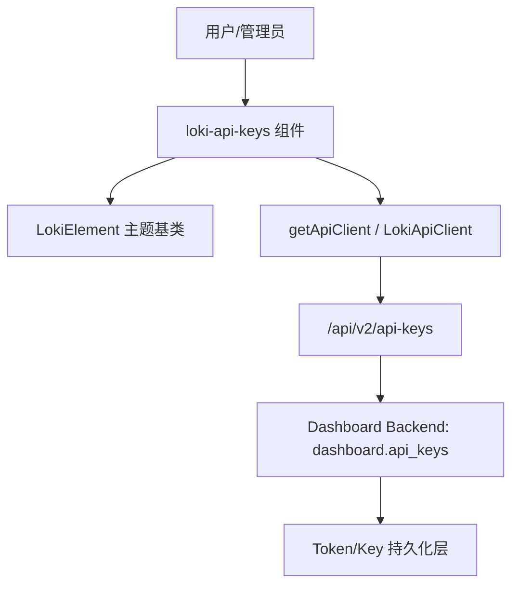
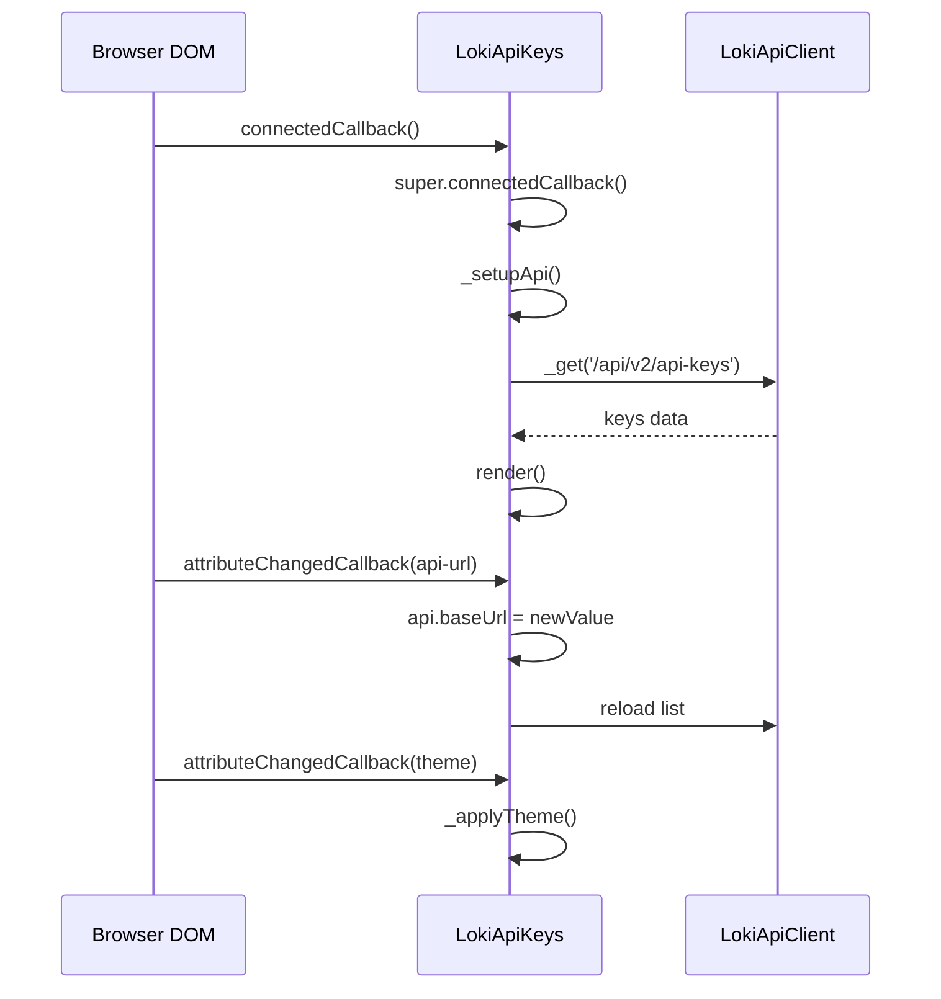
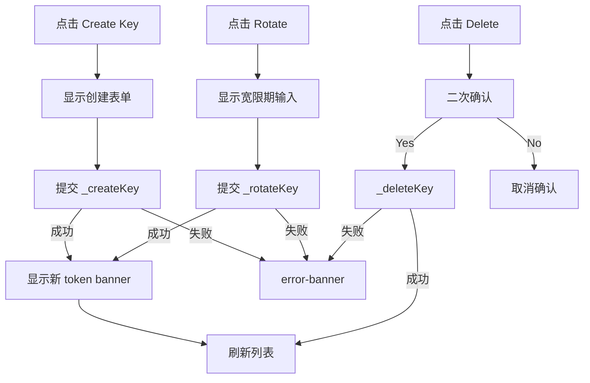

# api_key_management_ui 模块文档

## 模块简介

`api_key_management_ui` 模块对应组件 `dashboard-ui.components.loki-api-keys.LokiApiKeys`（文件：`dashboard-ui/components/loki-api-keys.js`），它是 Dashboard UI 中“Administration and Infrastructure Components”下的 API Key 管理入口。这个组件的目标非常明确：以最小依赖、可嵌入的 Web Component 方式，向运维或管理员提供 API Key 的**查看、创建、轮换、删除**能力，并将“敏感凭证只显示一次”的安全约束前置到 UI 体验层。

该模块存在的价值不是实现认证本身，而是把后端 API Key 生命周期管理能力（来自 Dashboard Backend 的 `dashboard.api_keys.*` 与 `/api/v2/api-keys` 路由）转化为可操作、可视化、低误操作风险的界面。换句话说，它是治理能力的 UI 落地层：用户不需要理解底层 token 存储结构，也不需要手写 API 请求，就可以完成密钥治理动作。

在系统分层上，它上承 `LokiElement` 提供的主题和基础交互机制，下接 `getApiClient()` 返回的 `LokiApiClient` 执行 HTTP 请求，因此它本质是一个“状态驱动 + 渲染重建 + 事件重新绑定”的轻量前端控制器。

---

## 在整体系统中的位置



这个位置关系意味着：`LokiApiKeys` 不持有业务真相，它只负责呈现与操作。真正的数据一致性、轮换窗口、权限合法性、字段校验都在后端完成。前端组件只做必要的输入门禁（例如名称不能为空）与状态反馈（loading/error/banner）。

如果你需要了解后端 API Key 领域模型与轮换语义，请参考 [api_key_management.md](api_key_management.md)。如果你需要理解 UI 基类（主题、键盘、Shadow DOM 样式基线），请参考 [Core Theme.md](Core Theme.md)。

---

## 核心组件详解

## `LokiApiKeys` 类

`LokiApiKeys` 继承 `LokiElement`，通过 `observedAttributes = ['api-url', 'theme']` 支持运行时切换 API 地址和主题。组件内部采用私有状态字段驱动 `render()` 全量重绘，每次重绘后调用 `_attachEventListeners()` 重新注册交互事件。

### 状态模型与设计意图

组件在构造函数中初始化以下关键状态：

- `_loading`：控制初始加载占位。
- `_error`：统一错误横幅文案。
- `_api`：`LokiApiClient` 实例。
- `_keys`：当前 API key 列表。
- `_showCreateForm`：创建表单开关。
- `_newToken`：新 token 一次性展示内容。
- `_confirmDeleteId`：当前进入删除确认的 key。
- `_rotateKeyId`、`_rotateGracePeriod`：当前进入轮换流程的 key 与宽限小时。
- `_createName`、`_createRole`、`_createExpiration`：创建表单缓冲值。

这种状态拆分非常实用：它让“列表状态”“创建流程”“删除确认”“轮换确认”可以并行存在，但也带来一个可见限制：组件一次只支持一个全局 `_rotateGracePeriod`，不同 key 同时展开轮换时会共享该值（虽然 UI 实际上通常一次只操作一个 key）。

### 生命周期与属性响应



`connectedCallback()` 中先执行父类逻辑（主题应用、键盘机制初始化、一次 render），再配置 API 客户端并拉取数据。`attributeChangedCallback()` 对 `api-url` 的处理值得注意：仅在 `_api` 已存在时才更新 `baseUrl` 并触发重载，因此在初次连接前的属性设置由 `_setupApi()` 兜底。

---

## 辅助函数

## `formatKeyTime(timestamp)`

该函数把时间戳转换为本地可读格式（`month/day/year hour:minute`），当输入为空时返回 `Never`。它在表格的 `Created` 和 `Last Used` 列中被直接调用。

一个细节是：`new Date(invalidString)` 不会抛异常，而是 `Invalid Date`，当前实现仍会返回 `toLocaleString()` 的结果（通常是 `Invalid Date` 本地化文本），`catch` 分支只覆盖真正异常场景。这意味着它是“尽量显示”策略，而非严格校验策略。

## `maskToken(token)`

该函数实现 token 脱敏（前 4 + `****` + 后 4），但当前 `LokiApiKeys.render()` 并未使用它来展示列表 token。考虑到列表本身不返回明文 token，这个函数更像保留工具函数或供未来扩展使用。维护时若发现未使用告警，可根据项目规范决定保留或清理。

---

## 内部方法与行为说明

## `_setupApi()`

根据 `api-url` 属性创建 API 客户端：

```js
const apiUrl = this.getAttribute('api-url') || window.location.origin;
this._api = getApiClient({ baseUrl: apiUrl });
```

`getApiClient()` 复用 `LokiApiClient.getInstance(config)` 的单例缓存机制（按 `baseUrl` 缓存）。这可以减少重复连接和资源开销，但也意味着同 baseUrl 下多个组件共享客户端状态。

## `_loadData()`

执行 `GET /api/v2/api-keys`，并兼容两种返回形态：

- 直接数组：`[{...}, {...}]`
- 包装对象：`{ keys: [...] }`

失败时设置 `_error = Failed to load API keys: ...`。该方法会在开始和结束时各 `render()` 一次，用于即时展示 loading 状态。

## `_createKey()`

在前端只做一条硬校验：`name` 不能为空。通过后发送：

```json
POST /api/v2/api-keys
{
  "name": "...",
  "role": "read|write|admin",
  "expiration": "YYYY-MM-DD" // 可选
}
```

随后将返回中的 `token` 或 `key` 提取到 `_newToken`。这说明它兼容不同后端实现（有的返回 `token`，有的返回 `key`）。成功后重置表单并刷新列表。

## `_rotateKey(keyId)`

向 `POST /api/v2/api-keys/{id}/rotate` 发送：

```json
{ "grace_period_hours": <int> }
```

`grace_period_hours` 通过 `parseInt(..., 10) || 24` 计算，因此空值、`NaN`、`0` 都会回退到 `24`。这与后端 `ApiKeyRotateRequest` 允许 `0`（`ge=0`）的语义存在差异：**前端实际上无法提交 0 小时宽限期**。这是一个明确的行为偏差，扩展时可改为显式判断 `Number.isNaN()`。

## `_deleteKey(keyId)`

调用 `DELETE /api/v2/api-keys/{id}`，成功后刷新列表，失败后清理确认态并显示错误。删除确认使用 `_confirmDeleteId` 控制，仅对当前行显示二次确认 UI，避免误删。

## `_escapeHtml(str)`

对 `& < > "` 做 HTML 转义，避免通过 key 名称、角色等字段注入 HTML。该函数在渲染用户可控文本时普遍调用，是组件防 XSS 的关键防线之一。

## `render()`

`render()` 每次全量重建 Shadow DOM 的 `innerHTML`，包括：

1. 顶部标题与“Create Key”按钮。
2. 一次性 token 展示条（若 `_newToken` 存在）。
3. 创建表单（若 `_showCreateForm` 为真）。
4. 列表区域（loading/empty/table 三态）。
5. 错误横幅。

表格渲染时进行了多个后端字段兼容处理：

- `key.id || key.key_id`
- `key.created_at || key.created`
- `key.last_used_at || key.last_used`
- `key.role || key.scopes || '--'`
- `status` 缺失时默认 `active`

这反映出组件针对历史/多版本 API 的容错策略，减少了前后端升级时的硬断裂。

## `_attachEventListeners()`

由于每次 render 都会替换整棵 DOM，旧事件监听器自然随旧节点回收，因此必须在每次渲染后重新绑定按钮事件。该方法覆盖了创建、删除确认、轮换确认、token dismiss 等所有交互。

---

## 组件交互流程



这个流程可以看出设计重点是“渐进确认”：风险操作（删除、轮换）都不是一步到位，而是先进入局部确认态，再执行网络请求。

---

## 与后端契约映射

前端模块主要对接 Dashboard Backend `api_key_management` 相关契约（`dashboard.api_keys`）：

- 列表项可映射 `ApiKeyResponse`（`id/name/role/scopes/created_at/last_used/revoked/...`）。
- 创建请求近似 `ApiKeyCreate`，但当前 UI 仅暴露 `name/role/expiration`，未暴露 `allowed_ips/rate_limit/description` 等高级字段。
- 轮换请求对应 `ApiKeyRotateRequest.grace_period_hours`。
- 轮换返回可包含 `ApiKeyRotateResponse.token` 与 `new_key`，UI 当前只消费 `token|key`。

也就是说，UI 目前是“管理能力子集”。如果后端新增策略字段，前端需要扩展表单与列表列定义后才可配置。

---

## 使用与集成

最小用法：

```html
<loki-api-keys api-url="http://localhost:57374" theme="dark"></loki-api-keys>
```

在 JavaScript 中动态切换 API 地址：

```js
const el = document.querySelector('loki-api-keys');
el.setAttribute('api-url', 'https://prod.example.com');
```

在宿主应用中监听主题事件（由 `LokiElement` 体系管理）：

```js
window.dispatchEvent(new CustomEvent('loki-theme-change', {
  detail: { theme: 'light' }
}));
```

如果你在同页面中挂载多个 Loki 组件，建议统一 `api-url`，以复用 `LokiApiClient` 实例并减少连接管理复杂度。

---

## 可扩展点与二次开发建议

扩展该模块时，建议沿用“状态字段 + render + attach listeners”的现有模式，避免局部手动 DOM patch 与全量重绘混用导致状态错乱。常见扩展方向包括：

- 在创建表单中新增 `description/allowed_ips/rate_limit` 字段，对齐后端 `ApiKeyCreate` 全字段。
- 列表增加 `expires_at/usage_count/rotation_expires_at` 展示，强化运维可观测性。
- 把 `_rotateGracePeriod` 从全局字段改为按 key 存储（如 `Map<keyId, value>`），避免并发编辑冲突。
- 允许 `grace_period_hours = 0` 的合法提交，修复当前前端回退逻辑。
- 为按钮增加禁用态与请求中态，防止重复点击触发并发请求。

---

## 边界条件、错误与限制

## 1) 前后端字段不一致容错

组件已兼容 `id/key_id`、`created_at/created`、`last_used_at/last_used`，但如果后端完全改变字段命名，UI 会降级显示为空或默认值。升级后建议做契约回归测试。

## 2) 轮换 0 小时语义偏差

`parseInt(value) || 24` 会吞掉 0。后端允许 0，这里会变成 24。属于业务语义 bug，而不是输入体验问题。

## 3) 并发请求竞态

如果用户快速连续触发创建/删除/轮换，请求完成顺序可能与触发顺序不同，最终以最后一次 `_loadData()` 结果为准。当前代码没有请求取消或版本戳保护。

## 4) 错误信息暴露粒度

错误直接使用 `err.message` 展示。若后端返回敏感内部信息，可能被前端透出。生产环境建议后端返回更可控的错误文案。

## 5) `maskToken` 未使用

虽然存在脱敏函数，但当前组件并不展示历史 token。该函数暂时不会影响行为，但会影响代码整洁度与维护认知。

## 6) 可访问性与键盘操作

组件继承了 `LokiElement` 的键盘基础设施，但当前 `LokiApiKeys` 未注册具体快捷键，也未显式定义 ARIA 模式。若有无障碍要求，应补充语义属性与焦点管理。

---

## 测试与运维建议

建议至少覆盖以下场景：

- 空列表、加载中、服务异常三态展示是否正确。
- 创建成功后 token 是否仅通过 banner 暂存展示，dismiss 后不再出现。
- 删除确认是否只作用于单行。
- 轮换后是否能展示新 token 并刷新状态。
- `api-url` 动态切换后是否真正请求新地址。
- 非法日期、缺失字段、未知状态字符串是否可安全渲染。

在联调时，优先对齐这三个端点：`GET /api/v2/api-keys`、`POST /api/v2/api-keys`、`POST /api/v2/api-keys/{id}/rotate`、`DELETE /api/v2/api-keys/{id}`。

---

## 总结

`api_key_management_ui` 是一个职责边界清晰的管理类 Web Component：它不做认证决策，只做治理操作的交互承载。它的核心优势在于实现简单、兼容性较强、可以直接嵌入任意支持 Custom Elements 的前端壳层；主要改进空间在于高级字段支持、轮换语义精确性、并发与可访问性增强。对于新接手该模块的开发者，先理解其“全量重绘 + 状态驱动 + 后端契约容错”的实现范式，会比逐行看样式代码更有效。
