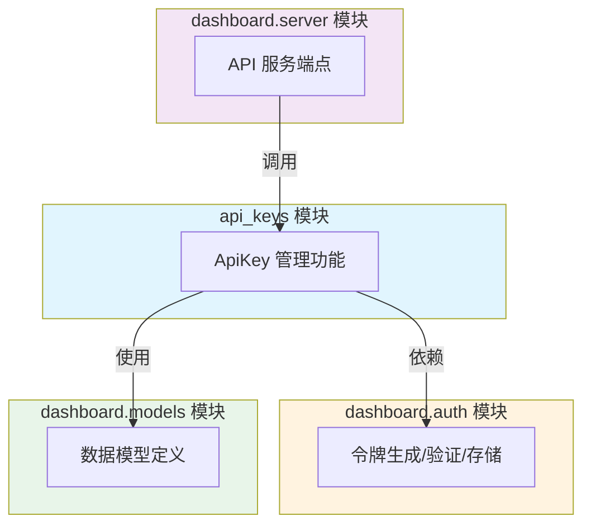
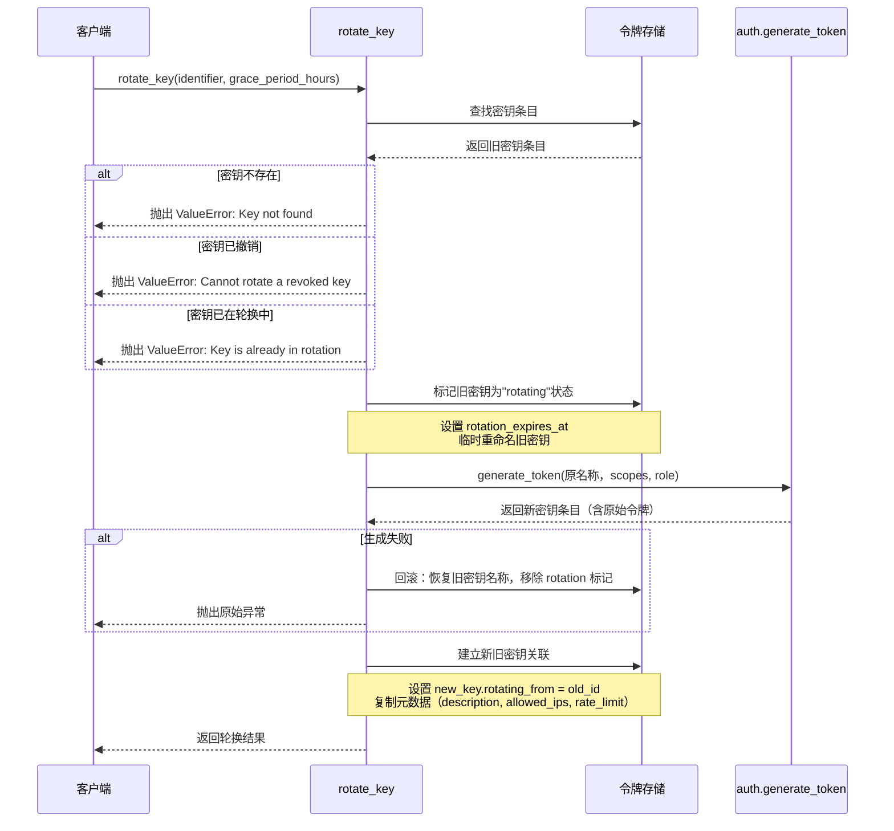
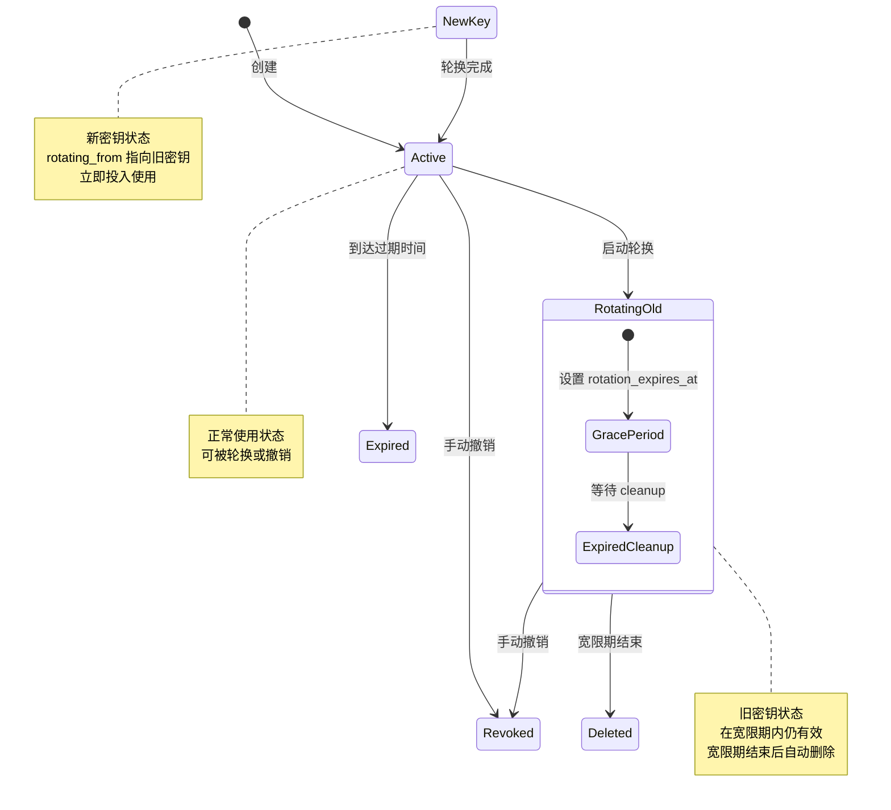

# API Keys 模块文档

## 概述

`api_keys` 模块是 Loki Mode Dashboard 系统中负责 API 密钥全生命周期管理的核心组件。该模块构建在 [`dashboard.auth`](dashboard.auth.md) 模块的基础之上，提供了超越基础令牌生成和验证的高级功能，包括密钥轮换（带宽限期）、元数据管理、使用追踪以及细粒度的访问控制。

在现代分布式系统中，API 密钥是服务间认证和授权的基础设施。`api_keys` 模块的设计哲学是"安全优先，操作友好"——既要确保密钥管理的安全性（如支持无缝轮换、IP 限制、速率限制），又要提供便捷的操作体验（如通过名称或 ID 查找密钥、自动清理过期密钥）。

### 设计目标

1. **无缝密钥轮换**：支持在不停机的情况下轮换密钥，通过宽限期机制确保旧密钥在过渡期间仍然有效，避免服务中断。

2. **细粒度访问控制**：支持基于作用域（scopes）、角色（role）、IP 白名单和速率限制的多层访问控制策略。

3. **可观测性**：追踪每个密钥的使用情况，包括使用次数、最后使用时间、创建时间等，便于安全审计和异常检测。

4. **元数据管理**：允许为密钥添加描述性信息，便于团队协作和密钥分类管理。

5. **自动化维护**：提供自动清理过期轮换密钥的功能，减少手动维护负担。

### 模块依赖关系



`api_keys` 模块直接依赖于 `dashboard.auth` 模块进行底层的令牌存储和验证操作。同时，它被 `dashboard.server` 模块中的 API 端点调用，为 Dashboard 前端和外部客户端提供密钥管理接口。

---

## 核心组件详解

### 数据模型（Pydantic Schemas）

模块使用 Pydantic 定义了一组严格的数据模型，确保 API 请求和响应的数据结构一致性。

#### ApiKeyCreate

`ApiKeyCreate` 是创建新 API 密钥的请求模型，定义了创建密钥时可配置的所有参数。

```python
class ApiKeyCreate(BaseModel):
    name: str
    scopes: Optional[list[str]] = None
    role: Optional[str] = None
    expires_days: Optional[int] = None
    description: Optional[str] = None
    allowed_ips: Optional[list[str]] = None
    rate_limit: Optional[int] = Field(None, description="Requests per minute")
```

**字段说明：**

| 字段 | 类型 | 必填 | 默认值 | 说明 |
|------|------|------|--------|------|
| `name` | `str` | 是 | - | 密钥的人类可读名称，用于标识和查找。长度限制为 1-255 字符。 |
| `scopes` | `list[str]` | 否 | `None` | 权限作用域列表。如果未指定且未提供 `role`，默认为 `["*"]`（完全访问）。 |
| `role` | `str` | 否 | `None` | 预定义角色名称（如 `admin`、`operator`、`viewer`、`auditor`）。如果指定，`scopes` 将从角色解析，两者不能同时使用。 |
| `expires_days` | `int` | 否 | `None` | 密钥有效期（天数）。`None` 表示永不过期。 |
| `description` | `str` | 否 | `None` | 密钥的描述信息，用于说明密钥用途。 |
| `allowed_ips` | `list[str]` | 否 | `None` | IP 白名单列表。如果指定，只有来自这些 IP 的请求才会被接受。 |
| `rate_limit` | `int` | 否 | `None` | 速率限制，单位为每分钟请求数。 |

**使用示例：**

```python
from dashboard.api_keys import ApiKeyCreate

# 创建一个具有特定作用域的密钥
create_request = ApiKeyCreate(
    name="production-read-only",
    scopes=["read:tasks", "read:runs", "read:memory"],
    expires_days=90,
    description="只读密钥，用于生产环境监控",
    allowed_ips=["10.0.0.1", "10.0.0.2"],
    rate_limit=100
)

# 创建一个基于角色的密钥
admin_request = ApiKeyCreate(
    name="admin-key",
    role="admin",
    description="管理员密钥"
)
```

**验证规则：**

- `name` 不能为空且长度不能超过 255 字符（在 `auth.generate_token` 中验证）
- `expires_days` 必须为正数或 `None`
- `role` 必须是预定义角色之一（`admin`、`operator`、`viewer`、`auditor`）
- `scopes` 和 `role` 不能同时指定（角色优先）

#### ApiKeyResponse

`ApiKeyResponse` 是 API 密钥的响应模型，包含密钥的所有元数据信息（不包括原始令牌和哈希值）。

```python
class ApiKeyResponse(BaseModel):
    id: str
    name: str
    scopes: list[str]
    role: Optional[str] = None
    created_at: str
    expires_at: Optional[str] = None
    last_used: Optional[str] = None
    revoked: bool = False
    description: Optional[str] = None
    allowed_ips: Optional[list[str]] = None
    rate_limit: Optional[int] = None
    rotating_from: Optional[str] = None
    rotation_expires_at: Optional[str] = None
    usage_count: int = 0
```

**字段说明：**

| 字段 | 类型 | 说明 |
|------|------|------|
| `id` | `str` | 密钥的唯一标识符（12 字符前缀的令牌哈希） |
| `name` | `str` | 密钥名称 |
| `scopes` | `list[str]` | 权限作用域列表 |
| `role` | `str` | 关联的角色（如果有） |
| `created_at` | `str` | ISO 8601 格式的创建时间 |
| `expires_at` | `str` | ISO 8601 格式的过期时间（如果设置了有效期） |
| `last_used` | `str` | ISO 8601 格式的最后使用时间 |
| `revoked` | `bool` | 是否已撤销 |
| `description` | `str` | 描述信息 |
| `allowed_ips` | `list[str]` | IP 白名单 |
| `rate_limit` | `int` | 速率限制（每分钟请求数） |
| `rotating_from` | `str` | 如果是轮换生成的新密钥，此字段指向旧密钥的 ID |
| `rotation_expires_at` | `str` | 如果是正在轮换的旧密钥，此字段表示宽限期结束时间 |
| `usage_count` | `int` | 使用次数计数器 |

**轮换状态字段说明：**

- `rotating_from`：当密钥是通过轮换操作生成时，此字段存储旧密钥的 ID。这建立了新旧密钥之间的关联关系，便于追踪轮换历史。

- `rotation_expires_at`：当密钥处于轮换宽限期内（即已被替换但尚未过期），此字段存储宽限期的结束时间。超过此时间后，密钥应被自动清理。

#### ApiKeyRotateRequest

`ApiKeyRotateRequest` 是密钥轮换请求模型。

```python
class ApiKeyRotateRequest(BaseModel):
    grace_period_hours: int = Field(24, ge=0, description="Hours the old key remains valid")
```

**字段说明：**

| 字段 | 类型 | 默认值 | 约束 | 说明 |
|------|------|--------|------|------|
| `grace_period_hours` | `int` | 24 | `>= 0` | 旧密钥保持有效的宽限期小时数。设置为 0 表示立即失效。 |

**使用示例：**

```python
from dashboard.api_keys import ApiKeyRotateRequest

# 使用默认 24 小时宽限期
rotate_request = ApiKeyRotateRequest()

# 自定义宽限期为 48 小时
rotate_request = ApiKeyRotateRequest(grace_period_hours=48)

# 立即失效旧密钥
rotate_request = ApiKeyRotateRequest(grace_period_hours=0)
```

#### ApiKeyRotateResponse

`ApiKeyRotateResponse` 是密钥轮换操作完成后的响应模型。

```python
class ApiKeyRotateResponse(BaseModel):
    new_key: ApiKeyResponse
    old_key_id: str
    old_key_rotation_expires_at: str
    token: str  # Raw token, shown only once
```

**字段说明：**

| 字段 | 类型 | 说明 |
|------|------|------|
| `new_key` | `ApiKeyResponse` | 新生成的密钥的完整元数据 |
| `old_key_id` | `str` | 被替换的旧密钥 ID |
| `old_key_rotation_expires_at` | `str` | 旧密钥宽限期结束时间（ISO 8601 格式） |
| `token` | `str` | **新密钥的原始令牌字符串**（仅在轮换响应中返回一次，之后无法获取） |

**安全注意事项：**

`token` 字段包含新密钥的原始令牌字符串，这是客户端唯一一次获取该值的机会。客户端必须在此时安全地存储令牌（如存入密钥管理系统、环境变量或配置文件），因为后续任何 API 调用都无法再获取原始令牌。

---

### 核心函数

#### rotate_key

执行 API 密钥轮换操作，是模块中最复杂和最重要的功能。

```python
def rotate_key(identifier: str, grace_period_hours: int = 24) -> dict
```

**功能描述：**

`rotate_key` 函数创建一个新密钥来替换现有密钥，同时保持旧密钥在指定的宽限期内有效。这种机制确保了在密钥轮换期间服务不会中断，客户端有足够的时间更新配置。

**参数：**

| 参数 | 类型 | 默认值 | 说明 |
|------|------|--------|------|
| `identifier` | `str` | - | 要轮换的密钥的 ID 或名称 |
| `grace_period_hours` | `int` | 24 | 旧密钥保持有效的宽限期小时数 |

**返回值：**

返回一个字典，包含以下键：

```python
{
    "new_key": { ... },  # 新密钥的完整元数据（同 ApiKeyResponse）
    "old_key_id": "abc123",  # 旧密钥 ID
    "old_key_rotation_expires_at": "2024-01-15T10:30:00+00:00",  # 宽限期结束时间
    "token": "loki_..."  # 新密钥的原始令牌（仅此一次可见）
}
```

**工作流程：**



**详细步骤说明：**

1. **查找密钥**：通过 `_find_token_entry` 函数根据 ID 或名称查找目标密钥。

2. **状态验证**：
   - 如果密钥不存在，抛出 `ValueError: Key not found: {identifier}`
   - 如果密钥已撤销（`revoked=True`），抛出 `ValueError: Cannot rotate a revoked key`
   - 如果密钥已在轮换中（`rotation_expires_at` 已设置），抛出 `ValueError: Key is already in rotation`

3. **标记旧密钥**：
   - 计算宽限期结束时间：`rotation_expires = now + grace_period_hours`
   - 设置 `rotation_expires_at` 字段
   - 临时将旧密钥名称改为 `{original_name}__rotating`，避免生成新密钥时出现名称冲突

4. **生成新密钥**：
   - 调用 `auth.generate_token` 使用原始名称、作用域和角色生成新密钥
   - 如果生成失败，执行回滚：恢复旧密钥名称，移除 `rotation_expires_at` 标记

5. **建立关联**：
   - 在新密钥上设置 `rotating_from` 字段指向旧密钥 ID
   - 从旧密钥复制元数据字段（`description`、`allowed_ips`、`rate_limit`）到新密钥

6. **返回结果**：返回包含新密钥元数据、旧密钥 ID、宽限期结束时间和原始令牌的字典

**异常处理：**

| 异常类型 | 触发条件 |
|----------|----------|
| `ValueError` | 密钥不存在 |
| `ValueError` | 密钥已撤销 |
| `ValueError` | 密钥已在轮换中 |
| `ValueError` | （来自 `auth.generate_token`）名称重复、角色无效等 |

**使用示例：**

```python
from dashboard.api_keys import rotate_key

try:
    result = rotate_key("production-key", grace_period_hours=48)
    
    print(f"新密钥 ID: {result['new_key']['id']}")
    print(f"新密钥令牌：{result['token']}")  # 立即保存！
    print(f"旧密钥将在 {result['old_key_rotation_expires_at']} 后失效")
    
    # 重要：在此处将 result['token'] 安全存储到密钥管理系统
    # 一旦错过，无法再次获取
    
except ValueError as e:
    print(f"轮换失败：{e}")
```

**最佳实践：**

1. **立即保存令牌**：轮换响应中的 `token` 字段只出现一次，必须立即安全存储。

2. **选择合适的宽限期**：根据系统复杂度和部署流程选择宽限期。对于需要多环境同步更新的场景，建议使用 48-72 小时。

3. **监控旧密钥使用**：在宽限期内监控旧密钥的使用情况，确保所有客户端都已迁移到新密钥。

4. **自动化清理**：定期调用 `cleanup_expired_rotating_keys` 清理过期的旧密钥。

#### get_key_details

获取指定密钥的完整元数据信息。

```python
def get_key_details(identifier: str) -> Optional[dict]
```

**参数：**

| 参数 | 类型 | 说明 |
|------|------|------|
| `identifier` | `str` | 密钥的 ID 或名称 |

**返回值：**

- 如果找到密钥，返回包含所有元数据字段的字典（同 `ApiKeyResponse` 结构）
- 如果未找到，返回 `None`

**安全说明：**

返回的字典不包含敏感信息（如令牌哈希、盐值或原始令牌），可以安全地用于日志记录或 API 响应。

**使用示例：**

```python
from dashboard.api_keys import get_key_details

details = get_key_details("production-key")
if details:
    print(f"密钥：{details['name']}")
    print(f"作用域：{details['scopes']}")
    print(f"使用次数：{details['usage_count']}")
    print(f"最后使用：{details['last_used']}")
else:
    print("密钥不存在")
```

#### update_key_metadata

更新密钥的元数据，无需轮换密钥。

```python
def update_key_metadata(
    identifier: str,
    description: Optional[str] = None,
    allowed_ips: Optional[list[str]] = None,
    rate_limit: Optional[int] = None,
) -> dict
```

**参数：**

| 参数 | 类型 | 默认值 | 说明 |
|------|------|--------|------|
| `identifier` | `str` | - | 密钥的 ID 或名称 |
| `description` | `str` | `None` | 新描述（`None` 表示不修改） |
| `allowed_ips` | `list[str]` | `None` | 新 IP 白名单（`None` 表示不修改） |
| `rate_limit` | `int` | `None` | 新速率限制（`None` 表示不修改） |

**返回值：**

返回更新后的密钥详情字典（同 `get_key_details` 返回值）。

**异常：**

| 异常类型 | 触发条件 |
|----------|----------|
| `ValueError` | 密钥不存在 |

**使用示例：**

```python
from dashboard.api_keys import update_key_metadata

# 更新描述
updated = update_key_metadata(
    "production-key",
    description="更新后的描述：用于生产环境监控服务"
)

# 更新 IP 白名单
updated = update_key_metadata(
    "production-key",
    allowed_ips=["10.0.0.1", "10.0.0.2", "10.0.0.3"]
)

# 更新速率限制
updated = update_key_metadata(
    "production-key",
    rate_limit=200  # 每分钟 200 请求
)

# 同时更新多个字段
updated = update_key_metadata(
    "production-key",
    description="季度轮换后的新配置",
    allowed_ips=["192.168.1.0/24"],
    rate_limit=150
)
```

**注意事项：**

- 只能更新 `description`、`allowed_ips` 和 `rate_limit` 字段
- 不能通过此函数修改 `scopes`、`role` 或 `expires_at` 等安全相关字段
- 如需修改安全相关字段，应使用 `rotate_key` 进行密钥轮换

#### list_keys_with_details

列出所有非撤销密钥的详细信息。

```python
def list_keys_with_details(include_rotating: bool = True) -> list[dict]
```

**参数：**

| 参数 | 类型 | 默认值 | 说明 |
|------|------|--------|------|
| `include_rotating` | `bool` | `True` | 是否包含处于轮换宽限期内的旧密钥 |

**返回值：**

返回密钥详情字典列表，每个字典结构与 `get_key_details` 返回值相同。

**过滤规则：**

- 自动排除已撤销的密钥（`revoked=True`）
- 根据 `include_rotating` 参数决定是否包含 `rotation_expires_at` 已设置的密钥

**使用示例：**

```python
from dashboard.api_keys import list_keys_with_details

# 列出所有活跃密钥（包括轮换中的旧密钥）
all_keys = list_keys_with_details()
print(f"总密钥数：{len(all_keys)}")

# 只列出"稳定"密钥（不包括轮换中的旧密钥）
stable_keys = list_keys_with_details(include_rotating=False)
print(f"稳定密钥数：{len(stable_keys)}")

# 查找即将过期的轮换密钥
from datetime import datetime
for key in all_keys:
    if key.get('rotation_expires_at'):
        exp = datetime.fromisoformat(key['rotation_expires_at'])
        print(f"密钥 {key['name']} 将在 {exp} 后自动清理")
```

#### cleanup_expired_rotating_keys

清理宽限期已过期的轮换密钥。

```python
def cleanup_expired_rotating_keys() -> list[str]
```

**功能描述：**

扫描所有设置了 `rotation_expires_at` 的密钥，删除那些宽限期已过的密钥。此函数应定期调用（如通过定时任务）以保持令牌存储的整洁。

**返回值：**

返回被删除的密钥 ID 列表。

**使用示例：**

```python
from dashboard.api_keys import cleanup_expired_rotating_keys

# 手动执行清理
deleted_ids = cleanup_expired_rotating_keys()
if deleted_ids:
    print(f"已清理 {len(deleted_ids)} 个过期轮换密钥：{deleted_ids}")
else:
    print("没有需要清理的密钥")

# 建议：在定时任务中定期执行
# 例如，每天凌晨执行一次
```

**集成建议：**

可以将此函数集成到系统的维护任务中：

```python
# 示例：与 dashboard.server 的维护端点集成
from dashboard.api_keys import cleanup_expired_rotating_keys

@app.post("/admin/maintenance/cleanup-keys")
async def cleanup_keys():
    deleted = cleanup_expired_rotating_keys()
    return {"deleted_count": len(deleted), "deleted_ids": deleted}
```

#### get_key_usage_stats

获取密钥的使用统计信息。

```python
def get_key_usage_stats(identifier: str) -> Optional[dict]
```

**参数：**

| 参数 | 类型 | 说明 |
|------|------|------|
| `identifier` | `str` | 密钥的 ID 或名称 |

**返回值：**

如果找到密钥，返回使用统计字典：

```python
{
    "usage_count": 1234,      # 总使用次数
    "last_used": "2024-01-15T10:30:00+00:00",  # 最后使用时间
    "created_at": "2024-01-01T00:00:00+00:00",  # 创建时间
    "age_days": 14            # 密钥年龄（天数）
}
```

如果未找到，返回 `None`。

**使用示例：**

```python
from dashboard.api_keys import get_key_usage_stats

stats = get_key_usage_stats("production-key")
if stats:
    print(f"使用次数：{stats['usage_count']}")
    print(f"最后使用：{stats['last_used']}")
    print(f"密钥年龄：{stats['age_days']} 天")
    
    # 检测异常使用模式
    if stats['age_days'] > 0:
        daily_avg = stats['usage_count'] / stats['age_days']
        print(f"日均使用：{daily_avg:.1f} 次/天")
else:
    print("密钥不存在")
```

**安全监控场景：**

```python
# 检测长时间未使用的密钥
from datetime import datetime, timedelta

stats = get_key_usage_stats("suspicious-key")
if stats and stats['last_used']:
    last_used = datetime.fromisoformat(stats['last_used'])
    if datetime.now(timezone.utc) - last_used > timedelta(days=30):
        print(f"警告：密钥 {stats['id']} 已超过 30 天未使用，考虑撤销")
```

#### increment_usage

增加密钥的使用计数器。

```python
def increment_usage(identifier: str) -> None
```

**功能描述：**

此函数在密钥验证成功后由系统内部调用，用于更新使用统计。它与 `auth.validate_token` 分离，避免修改核心认证逻辑。

**参数：**

| 参数 | 类型 | 说明 |
|------|------|------|
| `identifier` | `str` | 密钥的 ID 或名称 |

**返回值：**

无返回值。如果密钥不存在，函数静默返回（不抛出异常）。

**内部调用示例：**

```python
# 在 API 请求中间件中
from dashboard.api_keys import increment_usage

def authenticate_request(token: str):
    token_info = auth.validate_token(token)
    if token_info:
        # 验证成功后增加使用计数
        increment_usage(token_info['id'])
        return token_info
    return None
```

**设计说明：**

此函数与 `auth.validate_token` 分离的原因是：

1. **关注点分离**：`auth.validate_token` 专注于认证逻辑，不应包含统计逻辑
2. **性能考虑**：使用计数更新可以异步执行或批量处理，不影响认证性能
3. **可测试性**：独立的函数更容易进行单元测试

---

### 内部辅助函数

#### _find_token_entry

根据 ID 或名称查找令牌条目。

```python
def _find_token_entry(identifier: str) -> Optional[tuple[str, dict]]
```

**参数：**

| 参数 | 类型 | 说明 |
|------|------|------|
| `identifier` | `str` | 令牌 ID 或名称 |

**返回值：**

- 如果找到，返回 `(token_id, token_dict)` 元组
- 如果未找到，返回 `None`

**查找逻辑：**

1. 加载所有令牌（调用 `auth._load_tokens`）
2. 遍历令牌字典
3. 如果 `token_id == identifier` 或 `token["name"] == identifier`，返回匹配结果
4. 如果遍历完成未找到，返回 `None`

**使用示例：**

```python
# 内部使用，不直接暴露给外部
result = _find_token_entry("production-key")
if result:
    tid, entry = result
    print(f"找到密钥：{tid} -> {entry['name']}")
```

**注意事项：**

- 如果存在多个同名的令牌（理论上不应该），返回第一个匹配的
- 此函数不检查令牌的撤销或过期状态，仅进行查找

---

## 密钥轮换机制详解

密钥轮换是 `api_keys` 模块的核心功能，其设计考虑了生产环境的实际需求。

### 轮换状态机



### 轮换过程中的数据状态

**轮换前（旧密钥）：**

```json
{
  "id": "abc123def456",
  "name": "production-key",
  "scopes": ["*"],
  "created_at": "2024-01-01T00:00:00+00:00",
  "last_used": "2024-01-14T10:00:00+00:00",
  "revoked": false,
  "description": "生产环境密钥",
  "allowed_ips": ["10.0.0.1"],
  "rate_limit": 100,
  "usage_count": 5000
}
```

**轮换中（旧密钥）：**

```json
{
  "id": "abc123def456",
  "name": "production-key__rotating",
  "scopes": ["*"],
  "created_at": "2024-01-01T00:00:00+00:00",
  "last_used": "2024-01-14T10:00:00+00:00",
  "revoked": false,
  "description": "生产环境密钥",
  "allowed_ips": ["10.0.0.1"],
  "rate_limit": 100,
  "usage_count": 5000,
  "rotation_expires_at": "2024-01-15T10:00:00+00:00"
}
```

**轮换后（新密钥）：**

```json
{
  "id": "xyz789ghi012",
  "name": "production-key",
  "scopes": ["*"],
  "role": null,
  "created_at": "2024-01-14T10:00:00+00:00",
  "last_used": null,
  "revoked": false,
  "description": "生产环境密钥",
  "allowed_ips": ["10.0.0.1"],
  "rate_limit": 100,
  "rotating_from": "abc123def456",
  "rotation_expires_at": null,
  "usage_count": 0
}
```

### 宽限期验证逻辑

在 `auth.validate_token` 中，需要扩展验证逻辑以支持轮换密钥：

```python
# 伪代码示例
def validate_token(raw_token: str) -> Optional[dict]:
    # ... 标准验证逻辑 ...
    
    # 检查轮换状态
    if token.get("rotation_expires_at"):
        rotation_exp = datetime.fromisoformat(token["rotation_expires_at"])
        if datetime.now(timezone.utc) > rotation_exp:
            # 宽限期已过，密钥应已被 cleanup_expired_rotating_keys 删除
            # 如果还存在，视为无效
            return None
    
    # ... 返回令牌信息 ...
```

---

## 存储结构

### 令牌文件位置

令牌存储在用户主目录下的 `~/.loki/dashboard/tokens.json` 文件中。

### 文件结构

```json
{
  "version": "1.0",
  "tokens": {
    "abc123def456": {
      "id": "abc123def456",
      "name": "production-key",
      "hash": "...",
      "salt": "...",
      "scopes": ["*"],
      "role": null,
      "created_at": "2024-01-01T00:00:00+00:00",
      "expires_at": null,
      "last_used": "2024-01-14T10:00:00+00:00",
      "revoked": false,
      "description": "生产环境密钥",
      "allowed_ips": ["10.0.0.1"],
      "rate_limit": 100,
      "rotating_from": null,
      "rotation_expires_at": null,
      "usage_count": 5000
    }
  }
}
```

### 文件权限

令牌文件使用限制性权限（`0o600`）创建，确保只有文件所有者可以读写：

```python
TOKEN_FILE.touch(mode=0o600, exist_ok=True)
```

### 扩展字段说明

`api_keys` 模块在 `dashboard.auth` 的基础令牌结构上扩展了以下字段：

| 字段 | 类型 | 说明 | 添加模块 |
|------|------|------|----------|
| `description` | `str` | 密钥描述 | `api_keys` |
| `allowed_ips` | `list[str]` | IP 白名单 | `api_keys` |
| `rate_limit` | `int` | 速率限制 | `api_keys` |
| `rotating_from` | `str` | 轮换来源密钥 ID | `api_keys` |
| `rotation_expires_at` | `str` | 轮换宽限期结束时间 | `api_keys` |
| `usage_count` | `int` | 使用次数 | `api_keys` |

---

## 与 Dashboard 前端的集成

### UI 组件

[`dashboard-ui.components.loki-api-keys.LokiApiKeys`](dashboard-ui.components.loki-api-keys.md) 组件提供了密钥管理的用户界面，包括：

- 密钥列表展示
- 创建新密钥
- 密钥轮换操作
- 元数据编辑
- 使用统计查看

### API 端点

`dashboard.server` 模块中的 API 端点调用 `api_keys` 模块的函数，为前端提供 HTTP 接口：

```python
# 示例端点（伪代码）
from dashboard.api_keys import (
    rotate_key,
    get_key_details,
    update_key_metadata,
    list_keys_with_details
)

@app.post("/api/keys/{key_id}/rotate")
async def rotate_api_key(key_id: str, request: ApiKeyRotateRequest):
    result = rotate_key(key_id, request.grace_period_hours)
    return ApiKeyRotateResponse(**result)

@app.get("/api/keys/{key_id}")
async def get_key(key_id: str):
    details = get_key_details(key_id)
    if not details:
        raise HTTPException(404, "Key not found")
    return ApiKeyResponse(**details)

@app.put("/api/keys/{key_id}")
async def update_key(key_id: str, request: ApiKeyUpdateRequest):
    details = update_key_metadata(
        key_id,
        description=request.description,
        allowed_ips=request.allowed_ips,
        rate_limit=request.rate_limit
    )
    return ApiKeyResponse(**details)

@app.get("/api/keys")
async def list_keys(include_rotating: bool = True):
    keys = list_keys_with_details(include_rotating)
    return [ApiKeyResponse(**k) for k in keys]
```

---

## 安全考虑

### 令牌存储安全

1. **哈希存储**：原始令牌经过哈希处理后存储，即使文件泄露也无法还原原始令牌
2. **文件权限**：令牌文件使用 `0o600` 权限，限制只有所有者可访问
3. **一次性返回**：原始令牌仅在创建或轮换时返回一次

### 轮换安全

1. **宽限期保护**：防止因密钥更新不及时导致的服务中断
2. **状态验证**：防止对已撤销或已在轮换中的密钥进行重复轮换
3. **回滚机制**：如果新密钥生成失败，自动回滚旧密钥状态

### 访问控制

1. **IP 白名单**：限制密钥只能从指定 IP 使用
2. **速率限制**：防止密钥被滥用进行 DDoS 攻击
3. **作用域限制**：基于最小权限原则分配作用域

### 审计追踪

1. **使用计数**：追踪每个密钥的使用频率
2. **最后使用时间**：识别长期未使用的密钥
3. **轮换历史**：通过 `rotating_from` 字段追踪轮换链

---

## 最佳实践

### 密钥创建

1. **使用角色而非直接指定 scopes**：角色提供了预定义的权限集合，减少配置错误
2. **设置合理的过期时间**：生产环境密钥建议设置 90 天过期，强制定期轮换
3. **添加描述信息**：便于团队协作和密钥识别
4. **配置 IP 白名单**：如果可能，限制密钥的使用来源

### 密钥轮换

1. **定期轮换**：建议每 30-90 天轮换一次生产密钥
2. **选择合适宽限期**：根据部署复杂度选择 24-72 小时宽限期
3. **监控旧密钥使用**：在宽限期内监控旧密钥使用情况，确保迁移完成
4. **自动化清理**：设置定时任务定期调用 `cleanup_expired_rotating_keys`

### 密钥撤销

1. **立即撤销泄露密钥**：发现密钥泄露时立即撤销，而不是等待过期
2. **轮换而非撤销**：正常更新场景使用轮换，保留宽限期
3. **审计撤销操作**：记录所有撤销操作的时间和原因

### 监控和告警

```python
# 示例：监控脚本
from dashboard.api_keys import list_keys_with_details, get_key_usage_stats
from datetime import datetime, timedelta

def check_key_health():
    keys = list_keys_with_details()
    alerts = []
    
    for key in keys:
        # 检查即将过期的密钥
        if key.get('expires_at'):
            exp = datetime.fromisoformat(key['expires_at'])
            if exp - datetime.now(timezone.utc) < timedelta(days=7):
                alerts.append(f"密钥 {key['name']} 将在 7 天内过期")
        
        # 检查长期未使用的密钥
        stats = get_key_usage_stats(key['id'])
        if stats and stats['last_used']:
            last_used = datetime.fromisoformat(stats['last_used'])
            if datetime.now(timezone.utc) - last_used > timedelta(days=30):
                alerts.append(f"密钥 {key['name']} 已超过 30 天未使用")
        
        # 检查轮换宽限期即将结束的密钥
        if key.get('rotation_expires_at'):
            rot_exp = datetime.fromisoformat(key['rotation_expires_at'])
            if rot_exp - datetime.now(timezone.utc) < timedelta(hours=24):
                alerts.append(f"密钥 {key['name']} 的宽限期将在 24 小时内结束")
    
    return alerts
```

---

## 常见问题（FAQ）

### Q: 轮换密钥时，旧密钥何时完全失效？

A: 旧密钥在宽限期结束后失效。宽限期由 `grace_period_hours` 参数指定，默认 24 小时。宽限期结束后，应调用 `cleanup_expired_rotating_keys` 删除旧密钥。

### Q: 如果轮换过程中新密钥生成失败怎么办？

A: `rotate_key` 函数会自动回滚：恢复旧密钥的原始名称，移除 `rotation_expires_at` 标记。旧密钥保持完全可用状态，可以重试轮换操作。

### Q: 可以撤销处于轮换宽限期内的旧密钥吗？

A: 可以。虽然 `api_keys` 模块没有直接提供撤销函数（由 `dashboard.auth` 处理），但可以手动设置 `revoked=True`。撤销后，旧密钥立即失效，不再等待宽限期结束。

### Q: 如何追踪密钥的轮换历史？

A: 通过 `rotating_from` 字段可以追踪单次轮换的来源。要获取完整轮换历史，需要查询历史审计日志或维护额外的轮换记录。

### Q: `usage_count` 的更新是实时的吗？

A: 是的，每次调用 `increment_usage` 都会立即更新计数器。但请注意，如果 `increment_usage` 未被正确调用（如认证中间件未集成），计数器可能不准确。

### Q: 可以修改密钥的作用域（scopes）吗？

A: 不能直接修改。如需修改作用域，应使用 `rotate_key` 进行密钥轮换，新密钥将继承旧密钥的配置，但可以在轮换后通过 `update_key_metadata` 调整部分元数据。

---

## 相关模块

- [`dashboard.auth`](dashboard.auth.md) - 基础令牌生成、验证和存储
- [`dashboard.server`](dashboard.server.md) - API 服务端点和速率限制
- [`dashboard.models`](dashboard.models.md) - 数据模型定义
- [`dashboard-ui.components.loki-api-keys`](dashboard-ui.components.loki-api-keys.md) - 前端 UI 组件
- [`src.audit.log`](src.audit.log.md) - 审计日志记录

---

## 版本历史

| 版本 | 日期 | 变更说明 |
|------|------|----------|
| 1.0 | 2024-01 | 初始版本，包含基本密钥管理功能 |
| 1.1 | 2024-02 | 添加密钥轮换和宽限期支持 |
| 1.2 | 2024-03 | 添加使用统计和元数据管理 |
