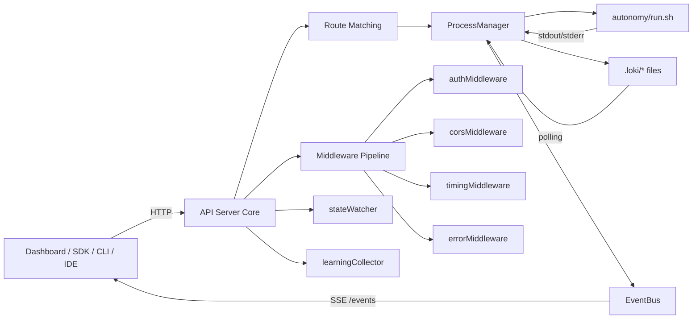
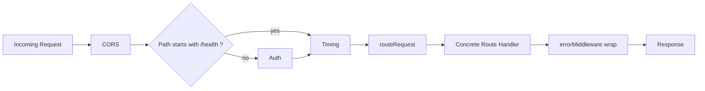
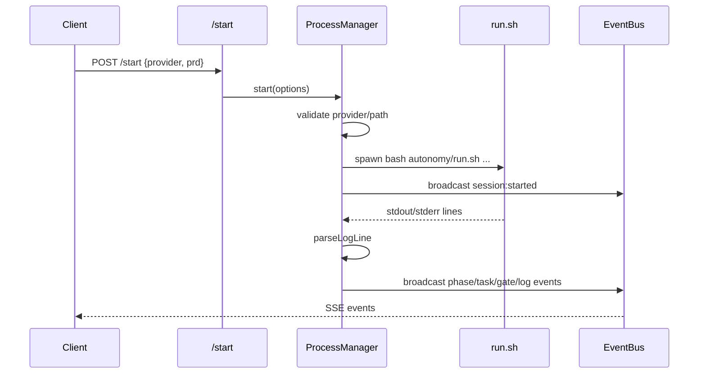
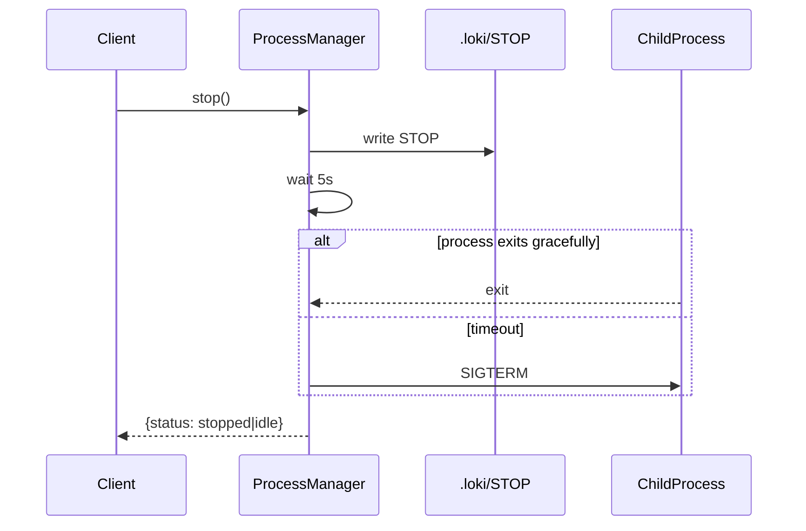
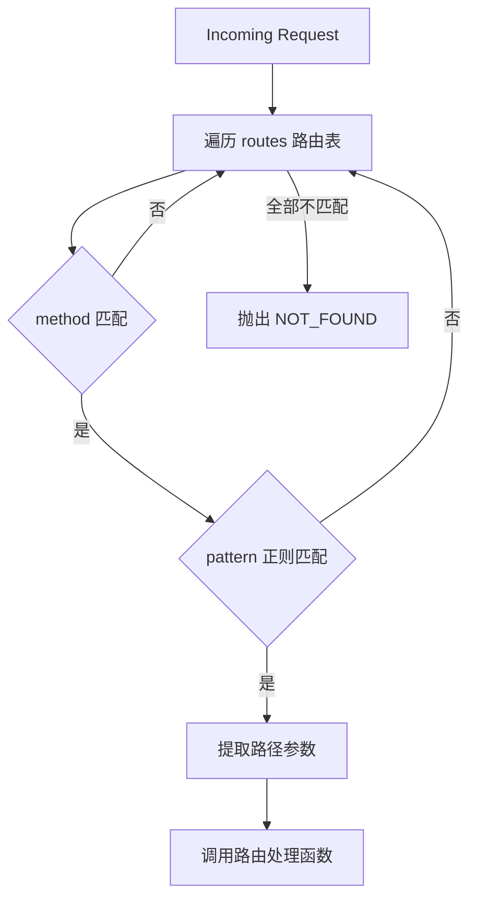
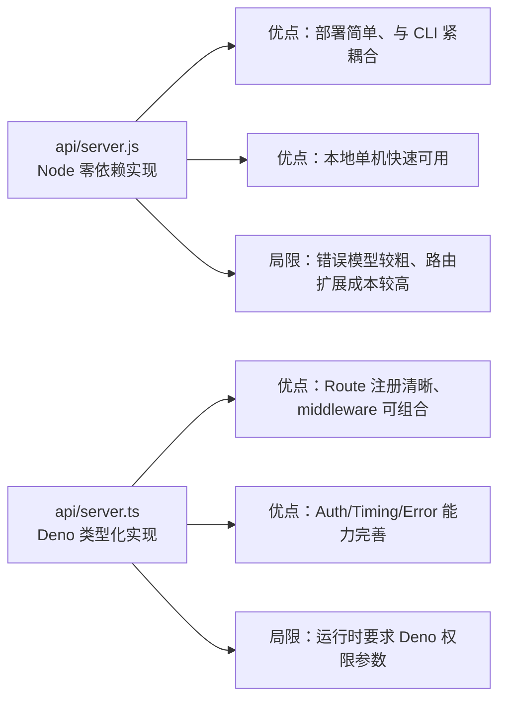

# api_server_core 模块文档

## 1. 模块定位与设计目标

`api_server_core` 是 Loki Mode 在“控制面（Control Plane）”上的核心入口，负责把本地自动化运行时（`autonomy/run.sh`、`.loki` 状态文件、日志文件）暴露为可编程的 HTTP API 与 SSE 实时事件流。它存在的根本原因是：把“命令行驱动的单机执行流程”转化为“可被 Dashboard、SDK、IDE 插件与外部系统统一消费的服务接口”。

从代码上看，这个模块实际上包含两条实现路径：

第一条是 `api/server.js`（Node.js 零依赖版本）。它强调极简部署、无需额外包管理器、可以直接随 CLI 启动，核心能力集中在三个点：
- `EventBus`：SSE 广播与事件缓存；
- `ProcessManager`：会话生命周期管理（启动、暂停、恢复、停止、输入注入）；
- 路由处理函数 `handleRequest`：将 HTTP 请求映射到上述能力。

第二条是 `api/server.ts`（Deno + typed route registry 版本）。它强调可维护性与可扩展性：
- 使用强类型 `Route` 定义路由表；
- 使用 middleware 管线（CORS / Auth / Error / Timing）；
- 将 session/task/event/memory/learning 路由拆分到独立模块。

因此，`api_server_core` 不是“业务逻辑本体”，而是 **API 编排层 + 生命周期控制层**。更高层的学习聚合、状态观察、记忆检索等能力，分别在 `runtime_services` 与 `api_type_contracts` 及对应 route/service 模块中实现。

---

## 2. 架构总览



这张图反映了核心事实：`api_server_core` 一方面接收外部控制请求（启动/停止/注入），另一方面持续把底层运行信息转译成结构化事件。`ProcessManager` 是“命令执行与状态转换中心”，`EventBus` 是“观测分发中心”，`Route` 则是“入口调度中心”。

---

## 3. 核心组件详解

## 3.1 `api.server.EventBus`（`api/server.js`）

`EventBus` 继承自 Node.js 内置 `EventEmitter`，同时维护 SSE 客户端集合与事件环形缓冲，目标是支持“实时订阅 + 晚到补偿”。它既是推送总线，也是轻量事件存储。

### 内部状态

- `clients: Set<ServerResponse>`：当前已连接的 SSE 响应对象。
- `eventBuffer: Array<Event>`：最近事件缓存，默认最多 `100` 条。
- `eventId: number`：自增事件序号，用于生成 `evt_xxx`。
- `heartbeatInterval`：30 秒心跳定时器。

### 关键方法行为

`addClient(res)` 会把新客户端加入集合，并立即回放 `eventBuffer` 中的历史事件，确保订阅方不因重连而完全丢失上下文。该方法返回一个卸载函数，供连接关闭时移除客户端。

`broadcast(type, data)` 会构造标准事件对象（`id/type/timestamp/data`），写入缓冲区，然后向所有客户端执行 `sendToClient`。写失败会自动移除失效连接。方法最后调用 `this.emit('event', event)`，使模块内其他监听者可复用同一事件流。

`sendToClient(res, event)` 采用标准 SSE 格式：
```text
id: evt_1
event: phase:changed
data: {...}
```

`startHeartbeat()` 每 30 秒广播 `heartbeat`，用于让长连接保持活跃，也便于客户端检测链路健康。`cleanup()` 在服务退出时停止心跳并关闭全部客户端，避免 FD 泄漏。

### 参数与副作用

- 输入：事件类型字符串 + 可序列化数据对象。
- 输出：无直接返回值（副作用式）。
- 副作用：网络写入、内存缓冲追加、可能触发本地 `EventEmitter` 监听。

### 设计取舍

该实现非常轻量，但并不保证“至少一次/恰好一次”语义，也没有持久化事件存储。它适合本地 dashboard 与短链路监控，不适合严格审计流。

---

## 3.2 `api.server.ProcessManager`（`api/server.js`）

`ProcessManager` 负责把一个外部 shell 执行流程封装成可控会话状态机。它是整个 Node API 内部最重要的 orchestration 组件。

### 状态模型

组件使用字符串状态：`idle → starting → running → paused → stopping → completed/failed`。`getStatus()` 又引入“有效状态”概念：若进程已结束，则把 `completed/failed` 对外折叠为 `idle`，同时在 `lastSessionResult` 暴露上一次结局，避免前端看到“僵尸失败态”。

### `start(options)`

该方法执行以下流程：
1. 防并发：若当前是 `running/starting/paused`，直接抛 `Session already running`。
2. 安全校验：
   - provider 必须在 `['claude','codex','gemini']`；
   - `prd` 路径必须位于 `PROJECT_DIR` 内，防路径穿越。
3. 组装命令：`bash autonomy/run.sh [--provider ...] [prd]`。
4. `spawn` 子进程，注入环境变量：`LOKI_API_MODE=1`, `LOKI_NO_DASHBOARD=1`, `FORCE_COLOR=0`。
5. 挂载 stdout/stderr 监听：stdout 走 `parseLogLine` 做事件提取，stderr 直接作为 `log:entry(error)` 广播。
6. 挂载 `exit/error` 回调：更新状态、广播会话结束事件、停止文件 watcher。
7. 启动 `.loki/dashboard-state.json` 轮询 watcher。

返回值示例：
```json
{ "pid": 12345, "status": "running" }
```

### `parseLogLine(line)`

这是日志到事件的“语义桥接器”。它先去除 ANSI 颜色，再进行关键词匹配，触发：
- `phase:changed`
- `task:started`
- `task:completed`
- `gate:passed` / `gate:failed`

无论是否匹配到语义事件，都会产出 `log:entry`。这保证客户端至少能拿到原始观测数据。

### `startFileWatcher()` / `stopFileWatcher()`

为了跨平台稳定性，代码没有使用 `fs.watch`，而是每秒轮询 `dashboard-state.json`。读取成功后与 `lastDashboardState` 对比，主要关注 phase 变化并广播。读取失败（文件不存在、写入中）会被吞掉，属于预期路径。

### `stop()`

优先写入 `.loki/STOP` 请求优雅停止，等待最多 5 秒；超时后发送 `SIGTERM`。这使流程同时兼容“文件信号停机协议”和“进程级强制终止”。

### `pause()` / `resume()`

- `pause()`：创建 `.loki/PAUSE` 文件并广播 `session:paused`。
- `resume()`：删除 `.loki/PAUSE` 文件并广播 `session:resumed`。

这两个动作依赖 run.sh 侧遵守同样的文件协定。

### `injectInput(input)`

默认被安全开关禁止：`LOKI_PROMPT_INJECTION=true` 才可使用。启用后会写 `.loki/HUMAN_INPUT.md` 并广播 `input:injected`。限制条件：必须是非空字符串，且大小不超过 `MAX_BODY_SIZE`（1MB）。

### 错误行为

该类大量使用抛异常方式反馈错误；HTTP 层会将“already running”映射为 `409`，其余多为 `500`。因此业务侧若要区分错误类型，建议后续引入结构化错误码（Deno 版本已经在 `LokiApiError/ErrorCodes` 上实现了这一路径）。

---

## 3.3 `api.server.Route`（`api/server.ts`）

在 TypeScript 版本中，`Route` 是一个接口，不是运行期类：

```ts
interface Route {
  method: string;
  pattern: RegExp;
  handler: RouteHandler;
}
```

它定义了路由系统的三元组：HTTP 方法、URL 正则、处理函数。核心价值有两点：

第一，它让路由匹配从“多层 if/else”变成“声明式路由表”，降低新增接口时的心智负担。第二，它通过正则捕获组自动抽取 path 参数（`match.slice(1)`），把参数传入 handler，实现轻量级动态路由。

`routeRequest(req)` 的执行方式是顺序扫描 `routes` 数组并首个匹配即返回，若无匹配则抛 `NOT_FOUND`。这意味着路由定义顺序具有优先级语义，维护者需要避免“宽正则在前、窄正则在后”导致误匹配。

---

## 4. 请求处理与中间件管线（Deno 版本）



`createHandler(config)` 以“函数包裹函数”方式构建处理链。尽管代码中注释写了“reverse order”，实际阅读后可知最外层是 CORS，再到 auth 分支，再到 timing，再到 error 包装的路由调用。`/health*` 显式跳过 auth，这保证探针可用性。

`timingMiddleware` 与 `learningCollector` 的组合使 API 调用耗时可以转化为学习信号；进程收到 SIGINT/SIGTERM 时会先 flush 信号再退出，减少观测数据丢失。

---

## 5. 关键流程

## 5.1 会话启动流程（Node 版本）



流程重点在于：HTTP 请求仅触发一次动作，后续执行反馈完全依赖 SSE 与状态查询接口协同完成。

## 5.2 停止流程与兜底



这种“双通道停机”能兼顾脚本内部收尾逻辑与系统级兜底，但仍可能存在僵尸子进程或信号未级联的问题（详见限制章节）。

---

## 6. API 面与行为说明

Node 版本主要端点（`api/server.js`）包括 `/health`, `/status`, `/events`, `/logs`, `/start`, `/stop`, `/pause`, `/resume`, `/input`, `/chat`。其特点是路径短、语义直接，更偏本地控制台/轻集成场景。

Deno 版本（`api/server.ts`）则采用 `/api/*` 命名空间并细分 session/task/event/memory/learning 子域，更适合作为统一后端 API 层。比如 `/api/sessions/:id/input`、`/api/memory/retrieve`、`/api/learning/metrics` 等接口把资源模型表达得更完整。

如果你在系统中同时看到两套端点，不应视为冲突，而应理解为 **演进中的双栈**：Node 版本偏运行器绑定，Deno 版本偏平台化网关。

---

## 7. 配置与运行

### Node 版本

可通过 CLI 参数：
```bash
node api/server.js --port 57374 --host 127.0.0.1
```

关键环境变量：
- `LOKI_PROJECT_DIR`：项目根目录（默认 `process.cwd()`）
- `LOKI_PROMPT_INJECTION=true`：启用 `/input` 注入（默认关闭）

### Deno 版本

示例：
```bash
deno run --allow-all api/server.ts --port 57374 --host localhost
```

关键参数：`--no-cors`, `--no-auth`。关键环境变量：`LOKI_DASHBOARD_PORT`, `LOKI_DASHBOARD_HOST`, `LOKI_API_TOKEN`, `LOKI_VERSION`。

---

## 8. 安全、边界条件与已知限制

该模块已实现多项基础防护：CORS 限制 localhost、请求体 1MB 上限、provider 白名单、PRD 路径防穿越、prompt injection 默认关闭。但仍有一些需要运维与开发共同关注的边界行为。

首先，Node 版本错误模型较粗，很多业务错误会落到 500。其次，`parseLogLine` 基于关键词匹配，日志格式变动会导致事件漏报或误报。再次，事件缓冲仅 100 条且驻内存，服务重启后丢失；长时间断线客户端无法完整追溯。

此外，`stop()` 仅对直接子进程发送 `SIGTERM`，若 run.sh 内再孵化多级进程而未处理信号转发，可能出现残留进程。`/chat` 的行为也要特别注意：当会话运行时它会直接写 `HUMAN_INPUT.md`，并绕过 `PROMPT_INJECTION_ENABLED` 开关（代码中明确标注这是“有意用户行为”）。在高安全环境应额外加鉴权与审计。

---

## 9. 扩展指南

在 Deno 路线下扩展新 API 的推荐步骤是：新增 route handler（`routes/*.ts`）→ 在 `routes` 数组注册 `Route` → 必要时增加类型契约（见 [API Types](API Types.md)）→ 补充服务层能力（见 [runtime_services 相关文档](State Watcher.md) 与 [Learning Collector](Learning Collector.md)）。

在 Node 路线下，扩展通常发生在 `handleRequest` 与 `ProcessManager`：建议把新能力先封装为 `ProcessManager` 方法，再暴露 HTTP 入口，并统一通过 `eventBus.broadcast` 输出可观测事件，以保持客户端体验一致。

示例（Deno 注册新路由）：
```ts
{ method: "GET", pattern: /^\/api\/foo$/, handler: getFoo }
```

示例（Node 新增控制端点）：
```js
if (method === 'POST' && pathname === '/restart') {
  await processManager.stop();
  const result = await processManager.start({ provider: 'claude' });
  return sendJson(res, 200, result);
}
```

---

## 10. 与其他模块的关系（避免重复说明）

`api_server_core` 只负责入口编排与运行控制，不应承载全部业务语义。阅读本模块后，建议继续参考下列文档以获得完整系统视图：

- 事件服务实现与分发策略：[`Event Bus.md`](Event Bus.md)
- 状态文件监听机制：[`State Watcher.md`](State Watcher.md)
- 学习信号收集与刷盘：[`Learning Collector.md`](Learning Collector.md)
- API 数据契约与类型定义：[`API Types.md`](API Types.md)
- 总体服务拓扑：[`API Server & Services.md`](API Server & Services.md)

这些文档与本篇互补：本篇解释“核心骨架怎么调度”，它们解释“具体业务如何产生与消费”。


---

## 11. 组件级 API 深入说明（参数、返回、副作用）

这一节补充“可直接用于开发”的接口语义，避免维护者必须反复读源码才能确认行为。

### 11.1 `EventBus.addClient(res)`

`addClient` 接收一个 Node `http.ServerResponse`（已经设置为 `text/event-stream`），并把它登记为活动订阅端。方法会立即把 `eventBuffer` 中的历史事件逐条回放给新客户端，这意味着前端在断线重连后通常能拿到最近窗口内的上下文。

它返回一个无参函数（`() => void`），调用后会从 `clients` 集合移除该连接。`handleSSE` 中将该函数绑定到 `req.on('close', ...)`，因此连接关闭时会自动清理。副作用是网络写入与集合变更。

### 11.2 `EventBus.broadcast(type, data)`

`type` 是事件名字符串，`data` 是任意可 JSON 序列化对象。返回值为空（`void`）；核心副作用包括三类：

1. 创建事件对象并自增 `eventId`；
2. 写入环形缓冲（最多 100 条，超过即丢弃最旧事件）；
3. 推送给全部在线 SSE 客户端，并触发内部 `EventEmitter` 的 `'event'` 监听。

因此它既承担“跨连接分发”，也承担“进程内事件挂钩”。如果你要做审计或长期回放，不应依赖这 100 条内存缓存，而应在监听器里落地外部存储（可参考 [Audit.md](Audit.md) 的持久化思路）。

### 11.3 `ProcessManager.start(options)`

`options` 结构在 Node 版本是宽松对象，但实际消费字段是 `{ prd?: string, provider?: 'claude' | 'codex' | 'gemini' }`。方法成功时返回 `{ pid: number, status: 'running' }`；失败会抛 `Error`。

内部副作用较多：启动子进程、更新状态字段、注册 stdout/stderr/exit/error 监听、启动 dashboard-state 轮询、广播 `session:started`。因为它会操作系统资源（进程、文件、计时器），测试时建议使用 fake process 或通过导出的 `processManager` 进行集成测试，而不是纯单元 mock。

### 11.4 `ProcessManager.stop()`

返回 Promise，结果可能是 `{ status: 'stopped' }` 或 `{ status: 'idle' }`。若当前无进程，直接返回 idle；若有进程，则先写 `.loki/STOP` 触发优雅停机，再等待退出，超时 5 秒发送 `SIGTERM`。

该方法不会主动广播 `session:stopped`，最终事件来自子进程 `exit` 回调（`session:completed` 或 `session:failed`）。前端若要表达“用户主动停止”，建议结合操作日志与最终退出事件综合判断。

### 11.5 `ProcessManager.pause()` / `resume()`

- `pause()` 仅允许当前状态为 `running` 或 `starting`，否则抛错；成功后写 `PAUSE` 文件并返回 `{ status: 'paused' }`。
- `resume()` 仅允许当前状态为 `paused`，否则抛错；成功后尝试删除 `PAUSE` 并返回 `{ status: 'running' }`。

这是一种“文件信号协议”，强依赖执行侧遵守约定。因此当你更换运行器（例如不同 shell wrapper）时，必须保证它识别 `PAUSE/STOP/HUMAN_INPUT.md`。

### 11.6 `ProcessManager.injectInput(input)` 与 `handleChat(body)`

二者都能写入 `HUMAN_INPUT.md`，但安全语义不同：

- `injectInput` 受 `LOKI_PROMPT_INJECTION` 开关控制，默认禁用；
- `handleChat` 在 session 运行时会直接写入（源码注释标注为“有意用户聊天输入”）。

也就是说，在默认配置下 `/input` 可能被拒绝而 `/chat` 仍可注入。若你的部署面向不可信网络，请务必在网关层统一鉴权并限制可访问端点。

---

## 12. Route 注册机制与匹配优先级（TypeScript 版）

`api.server.Route` 的核心不是“接口定义本身”，而是它把路由匹配从命令式分支改成“有序数据结构”。由于 `routeRequest` 是线性扫描并命中即返回，优先级完全由数组顺序决定。



一个常见维护陷阱是“通配范围大的正则写在前面”，导致后续更具体规则失效。例如先写 `^/api/sessions/([^/]+)$`，再写 `^/api/sessions/([^/]+)/tasks$` 就会产生冲突。当前源码通过更具体模式放在后续不冲突位置规避了这一问题，但新增路由时要继续遵守这个顺序纪律。

---

## 13. 与子模块协作边界（如何避免职责漂移）

`api_server_core` 的职责边界应保持在“请求接入、生命周期编排、事件转发、基础安全策略”。以下能力建议继续留在对应子模块，而不是回灌到 core：

- 运行时状态聚合与文件监听细节：参考 [runtime_services.md](runtime_services.md) 与 [State Watcher.md](State Watcher.md)。
- 学习信号聚合、趋势计算、周期 flush：参考 [Learning Collector.md](Learning Collector.md)。
- 请求/响应体结构、分页查询参数、Memory 检索契约：参考 [api_type_contracts.md](api_type_contracts.md) 与 [API Types.md](API Types.md)。

实践上，`api_server_core` 最好的扩展方式不是塞入新业务逻辑，而是新增 route + 调用 service + 返回 contract。

---

## 14. 生产化建议与已知改进方向

当前实现足够支持本地控制与中小规模单租户部署，但若要走向更高并发和远程多租户，建议优先考虑以下改进：

1. 为 Node 版本引入结构化错误码与稳定 HTTP 状态映射（对齐 Deno 的 `LokiApiError/ErrorCodes`）。
2. 将 `EventBus` 缓冲从内存扩展为可选持久化后端（如 append-only log），提升重启恢复能力。
3. 给 `/chat` 与 `/input` 增加统一鉴权与审计标签，避免“功能路径安全策略不一致”。
4. 为 `stop()` 增加进程组管理（process group / tree kill）以减少残留子进程。
5. 为 `parseLogLine` 增加可配置规则或结构化日志协议，降低对字符串关键词的脆弱依赖。

这些改进并不会改变模块定位，但会显著提升可运维性与安全一致性。


---

## 15. Node 与 Deno 双实现的能力对照与选型建议

在实际部署中，维护者经常会问“应该使用 `api/server.js` 还是 `api/server.ts`”。从当前代码形态看，可以把它们理解为同一模块的两个运行形态，而不是互相替代的竞品。



如果你是本地开发、演示环境或希望“开箱即用”，Node 版本通常更直接。如果你在做长期维护、平台化 API、需要更细粒度鉴权和可观测中间件，Deno 版本更适合作为主线。工程实践上也可以采用“本地 Node、服务端 Deno”的组合策略。

---

## 16. 错误与状态码语义（调用方集成建议）

虽然两套实现都能返回 JSON 错误，但语义粒度不同。为减少 SDK 与前端的适配成本，建议调用方按“幂等重试 + 人类可读报错 + 事件流兜底”三层策略处理。

| 场景 | 常见返回 | 建议客户端行为 |
|---|---|---|
| 会话已存在（重复启动） | `409`（Node 识别 `already running`） | 切换到 `/status` 拉取现态，不要盲目重试 |
| 请求体超限/JSON 非法 | `400/500`（实现差异） | 显示输入校验错误，阻断重试 |
| 路由不存在 | `404` 或 `NOT_FOUND` | 检查 API 前缀（`/start` vs `/api/sessions`） |
| 会话状态不允许（如未 paused 就 resume） | `500`（Node 抛错透传） | 前端先读状态再发控制指令 |
| 运行期脚本失败 | `session:failed` 事件 + 状态变更 | 以 SSE 事件为主、HTTP 结果为辅 |

对于强一致体验，推荐在 UI/SDK 中采用如下顺序：先调用控制 API（如 `pause`），再监听 SSE 确认事件（如 `session:paused`），最后用 `/status` 进行状态校验闭环。这能有效降低网络抖动、事件延迟、接口实现差异带来的不确定性。


---

## 17. 快速调用示例（面向集成开发）

下面给出一组最小可用的调用序列，便于 SDK、前端或脚本快速接入。

### 17.1 启动会话（Node 风格端点）

```bash
curl -X POST http://127.0.0.1:57374/start \
  -H 'Content-Type: application/json' \
  -d '{"provider":"claude","prd":"docs/PRD.md"}'
```

### 17.2 建立 SSE 监听

```bash
curl -N http://127.0.0.1:57374/events
```

典型事件样例：

```text
event: session:started
data: {"id":"evt_1","type":"session:started","timestamp":"2026-01-01T00:00:00.000Z","data":{"provider":"claude","pid":12345}}
```

### 17.3 查询状态与日志

```bash
curl http://127.0.0.1:57374/status
curl http://127.0.0.1:57374/logs?lines=100
```

### 17.4 暂停 / 恢复 / 停止

```bash
curl -X POST http://127.0.0.1:57374/pause
curl -X POST http://127.0.0.1:57374/resume
curl -X POST http://127.0.0.1:57374/stop
```

### 17.5 Deno 风格端点（带 API 前缀）

```bash
curl -X POST http://localhost:57374/api/sessions \
  -H 'Content-Type: application/json' \
  -H 'Authorization: Bearer <LOKI_API_TOKEN>' \
  -d '{"provider":"claude"}'

curl -N http://localhost:57374/api/events \
  -H 'Authorization: Bearer <LOKI_API_TOKEN>'
```

这些示例体现了一个关键实践：**控制动作走 HTTP，请求结果确认走 SSE + 状态查询**。这种“双确认”方式可以显著降低前后端状态不一致问题。
