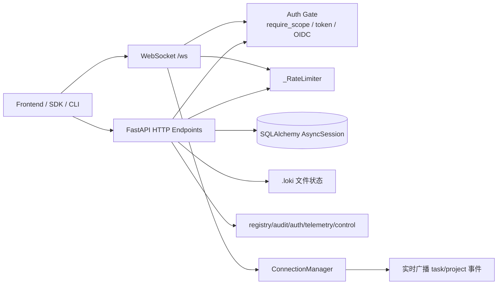
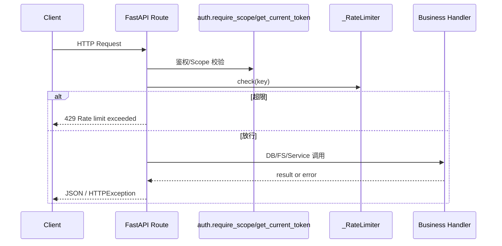
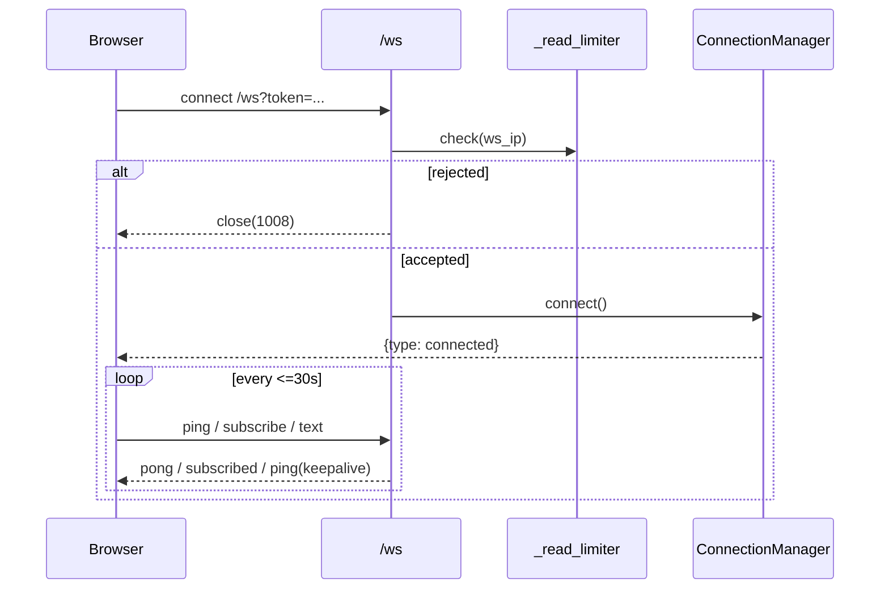
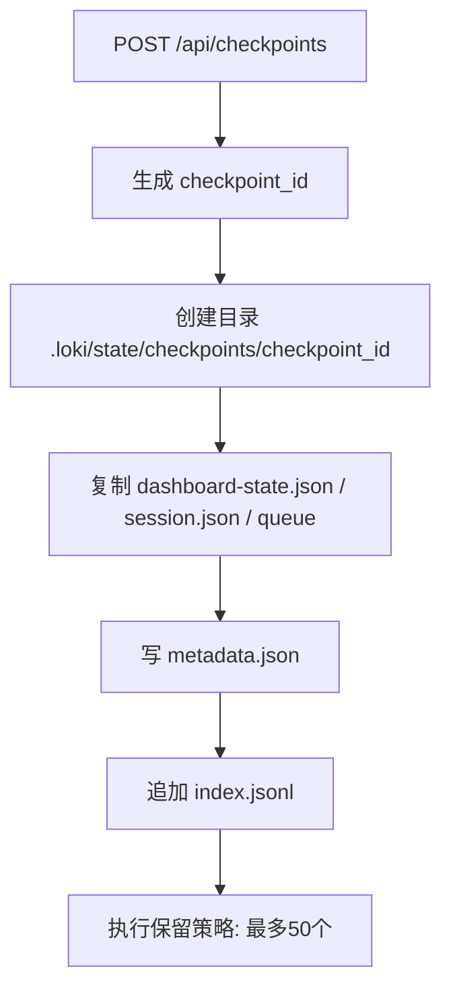

# api_surface_and_transport 模块文档

## 模块定位与存在价值

`api_surface_and_transport` 是 Dashboard Backend 的“对外边界层”，由 `dashboard/server.py` 承担主体实现。它的核心任务不是实现复杂业务规则，而是把项目管理、任务管理、企业认证、审计、跨项目注册、运行态观测等能力，以统一的 HTTP/WebSocket 接口暴露出去，并在边界处统一处理鉴权、限流、输入校验、错误语义与实时消息传输。

这个模块存在的根本原因是“隔离内部复杂性”。系统内部同时存在数据库实体（Project/Task）、文件状态（`.loki/` 下大量 JSON/日志/信号文件）、以及多个可选能力（OIDC、enterprise token、迁移引擎、质量扫描、协作 API）。如果前端或 SDK 直接耦合内部结构，任何实现细节变动都会放大为全链路兼容问题。通过本模块，调用方只需遵循稳定 API 合约，无需感知内部状态来源。

从模块树关系看，本模块是 `Dashboard Backend` 的子模块，向上服务 `Dashboard Frontend`、Python/TypeScript SDK、运维脚本，向下依赖 `domain_models_and_persistence`（数据库模型）、`api_key_management`、`migration_orchestration`、`session_control_runtime` 等能力。相关内部实现请分别参考 [domain_models_and_persistence.md](domain_models_and_persistence.md)、[api_key_management.md](api_key_management.md)、[migration_orchestration.md](migration_orchestration.md)、[session_control_runtime.md](session_control_runtime.md)。

---

## 总体架构与传输分层



这套设计体现了一个关键原则：**把“协议与治理”集中在边界层，把“业务实现细节”留在子系统内部**。因此，你会在这个文件看到大量 schema、路由、鉴权与容错代码，而不是深度领域逻辑。

---

## 核心组件关系图

```mermaid
classDiagram
    class _RateLimiter {
      +check(key: str) bool
      -_max_calls: int
      -_window: int
      -_max_keys: int
      -_calls: dict
    }

    class ConnectionManager {
      +MAX_CONNECTIONS: int
      +connect(websocket)
      +disconnect(websocket)
      +broadcast(message)
      +send_personal(websocket, message)
    }

    class ProjectCreate
    class ProjectUpdate
    class TaskCreate
    class TaskUpdate
    class TaskMove
    class TaskResponse
    class TokenCreateRequest
    class TokenResponse
    class RegisterProjectRequest
    class RegisteredProjectResponse
    class DiscoverResponse
    class SyncResponse
    class HealthResponse
    class AuditQueryParams
    class CheckpointCreate
    class Config

    _RateLimiter --> FastAPIRoutes : 限流
    ConnectionManager --> WebSocketRoute : 连接与广播

    ProjectCreate --> ProjectAPI
    ProjectUpdate --> ProjectAPI
    TaskCreate --> TaskAPI
    TaskUpdate --> TaskAPI
    TaskMove --> TaskAPI
    TaskResponse --> TaskAPI

    RegisterProjectRequest --> RegistryAPI
    RegisteredProjectResponse --> RegistryAPI
    DiscoverResponse --> RegistryAPI
    SyncResponse --> RegistryAPI
    HealthResponse --> RegistryAPI

    TokenCreateRequest --> EnterpriseTokenAPI
    TokenResponse --> EnterpriseTokenAPI
    AuditQueryParams --> AuditAPI
    CheckpointCreate --> CheckpointAPI
```



---

## 关键运行时组件

### `dashboard.server._RateLimiter`

`_RateLimiter` 是一个进程内、滑动时间窗口风格的轻量限流器。`check(key)` 的行为可以概括为：先清理窗口外时间戳，再清理空 key，再按最老时间戳做 key 淘汰（超过 `max_keys` 时），最后判断当前 key 是否超限并决定放行/拒绝。返回值为 `bool`，`False` 代表应在路由层返回 `429`。

模块内存在两个实例：`_control_limiter`（默认 10 次/60 秒）和 `_read_limiter`（默认 60 次/60 秒）。它们分别用于控制类接口和读类高频接口。副作用是维护内存计数状态，因此**重启后计数丢失**，且**多 worker 间不共享**。

### `dashboard.server.ConnectionManager`

`ConnectionManager` 管理 `/ws` 的连接生命周期。`connect()` 在超过 `MAX_CONNECTIONS`（来自 `LOKI_MAX_WS_CONNECTIONS`）时，使用 WebSocket close code `1013` 拒绝新连接。`broadcast()` 遍历所有连接发送消息，并在发送异常时回收失效连接。`send_personal()` 用于单连接响应（例如 `connected`、`pong`）。

该组件的返回值多数为 `None`，重点在副作用：连接池维护与网络发送。由于状态保存在进程内 `list[WebSocket]`，因此部署为多进程时不会自动跨进程广播。

### `dashboard.server.Config`

`Config` 不是独立业务配置中心，而是 Pydantic 模型内部的配置类（例如 `from_attributes = True`），用于让响应模型可直接从 ORM 对象构建。它的意义在于**序列化行为约束**，而不是运行时系统配置。

---

## API 合约模型详解

下列模型都定义在 `dashboard/server.py`，用于明确外部输入输出契约。

### 项目与任务模型

#### `ProjectCreate`

用于 `POST /api/projects`。字段：
- `name: str`（必填，1~255）
- `description: Optional[str]`
- `prd_path: Optional[str]`

该模型约束了项目创建的最小必要信息。创建成功后会触发 WebSocket 广播 `project_created`。

#### `ProjectUpdate`

用于 `PUT /api/projects/{project_id}`。字段全部可选：`name/description/prd_path/status`。语义是部分更新（patch-like），路由中通过 `exclude_unset=True` 只更新传入字段。副作用是广播 `project_updated`。

#### `TaskCreate`

用于 `POST /api/tasks`。关键字段：
- `project_id: int`（必填）
- `title: str`（1~255）
- `status: TaskStatus = PENDING`
- `priority: TaskPriority = MEDIUM`
- `position: int = 0`
- `parent_task_id/estimated_duration` 可选

路由内部会验证 `project_id` 是否存在，并验证父任务是否属于同一项目。校验失败会返回 `404` 或 `400`。

#### `TaskUpdate`

用于 `PUT /api/tasks/{task_id}`，支持部分更新：`title/description/status/priority/position/assigned_agent_id/estimated_duration/actual_duration`。当 `status` 更新为 `DONE` 时，服务端会自动写入 `completed_at`。

#### `TaskMove`

用于看板拖拽接口 `POST /api/tasks/{task_id}/move`。字段只有：
- `status: TaskStatus`
- `position: int`

内部会在状态切换到 `DONE` 时设置 `completed_at`，离开 `DONE` 时清空该值。副作用是广播 `task_moved`。

#### `TaskResponse`

任务返回标准结构，包含身份字段（`id/project_id`）、业务字段（`title/status/priority/...`）和时间字段（`created_at/updated_at/completed_at`）。由于配置了 `from_attributes`，可从 SQLAlchemy 实体直接 `model_validate`。

### 注册中心模型

#### `RegisterProjectRequest`

用于 `POST /api/registry/projects`。字段：`path`（必填）、`name/alias`（可选）。`path` 是跨项目注册入口，最终由 `registry.register_project()` 处理。

#### `RegisteredProjectResponse`

注册项目统一响应：`id/path/name/alias/registered_at/updated_at/last_accessed/has_loki_dir/status`。适用于列表、单项查询、注册结果返回。

#### `DiscoverResponse`

用于 `/api/registry/discover` 的发现结果，字段包括 `path/name/has_state/has_prd`，用于帮助调用方判断是否值得注册。

#### `SyncResponse`

用于 `/api/registry/sync` 返回同步统计：`added/updated/missing/total`，适合 UI 与自动化巡检展示。

#### `HealthResponse`

用于 `/api/registry/projects/{identifier}/health`，字段：
- `status: str`
- `checks: dict`

`checks` 保持开放结构，便于未来扩展健康项而不破坏兼容。

### 企业与审计模型

#### `TokenCreateRequest`

用于 `POST /api/enterprise/tokens`：
- `name: str`（1~255）
- `scopes: Optional[Any]`
- `expires_days: Optional[int]`（>0）

仅在 enterprise auth 启用时可用，否则返回 `403`。

#### `TokenResponse`

返回 token 元数据：`id/name/scopes/created_at/expires_at/last_used/revoked`，以及可选 `token`。**`token` 明文仅创建时返回一次**，这是重要安全约束。

#### `AuditQueryParams`

审计查询参数模型，包含时间范围、动作、资源、用户与分页字段（`limit/offset`）。当前路由主要以 query 参数形式定义，但该模型提供了统一契约基线，便于 SDK 和后续重构复用。

### 检查点模型

#### `CheckpointCreate`

用于 `POST /api/checkpoints`，字段：`message: Optional[str]`（最大 500）。主要作用是给检查点元数据添加人工说明。

---

## 典型处理流程

### 1) HTTP 请求生命周期



### 2) WebSocket 会话与心跳



### 3) 检查点创建流程



---

## 配置与运行行为

模块关键配置主要通过环境变量提供：

- `LOKI_DASHBOARD_HOST` / `LOKI_DASHBOARD_PORT`：监听地址端口，默认 `127.0.0.1:57374`。
- `LOKI_DASHBOARD_CORS`：CORS 白名单，默认只允许本地 Dashboard。
- `LOKI_MAX_WS_CONNECTIONS`：WebSocket 最大连接数。
- `LOKI_DIR`：运行态文件目录（状态、日志、指标、信号）。
- `LOKI_TLS_CERT` + `LOKI_TLS_KEY`：同时提供时启用 HTTPS。
- `LOKI_ENTERPRISE_AUTH` 与 OIDC 相关变量：决定 token/OIDC 模式。

运行时还包含两个重要后台机制：`lifespan()` 在启动/关闭时初始化与关闭数据库；`_orphan_watchdog()` 会在父会话进程消失时主动退出 Dashboard，避免孤儿服务残留。

---

## 使用示例

```bash
# 创建项目（需要 control scope）
curl -X POST http://127.0.0.1:57374/api/projects \
  -H "Authorization: Bearer <token>" \
  -H "Content-Type: application/json" \
  -d '{"name":"Platform Revamp","description":"Q2 rebuild"}'
```

```bash
# 创建任务
curl -X POST http://127.0.0.1:57374/api/tasks \
  -H "Authorization: Bearer <token>" \
  -H "Content-Type: application/json" \
  -d '{"project_id":1,"title":"Design API gateway","priority":"high"}'
```

```bash
# 企业版 token 创建
curl -X POST http://127.0.0.1:57374/api/enterprise/tokens \
  -H "Content-Type: application/json" \
  -d '{"name":"ci-token","scopes":["read","control"],"expires_days":30}'
```

```text
# WebSocket 连接（企业/OIDC模式需要 token query 参数）
ws://127.0.0.1:57374/ws?token=loki_xxx
```

---

## 扩展与二次开发建议

新增 API 时，建议保持与现有模块一致的边界治理策略：先定义 Pydantic 契约模型，再补鉴权与限流，最后实现业务调用和审计记录。控制类接口通常应挂 `Depends(auth.require_scope("control"))` 并使用 `_control_limiter`；高频读取接口应考虑 `_read_limiter`。

如果你要扩展实时能力（例如从全局广播升级为频道订阅），可以在 `ConnectionManager` 增加 channel 索引结构（如 `dict[channel, set[WebSocket]]`），并在 `subscribe` 消息时维护订阅关系。若部署形态是多实例，还应引入外部消息总线做跨进程广播同步。

对于新的文件路径参数，必须延续本文件中 `_sanitize_agent_id` / `_sanitize_checkpoint_id` / migration id 正则校验策略，避免路径穿越风险。

---

## 边界条件、错误语义与已知限制

该模块在健壮性上偏向“不中断服务”，因此大量文件读取逻辑采用“解析失败则回退默认值”。这提高了可用性，但也可能掩盖底层数据损坏，需要借助日志和审计追查。并且由于 DB 与 `.loki` 文件是双轨数据源，不同端点之间可能出现短暂视图不一致。

常见错误码语义如下：
- `400`：输入格式或业务前置条件不满足（如非法 ID、缺少必填字段）。
- `403`：认证模式未启用或 scope 不足。
- `404`：实体不存在（项目/任务/checkpoint/token 等）。
- `409`：状态冲突（例如迁移阶段门禁未通过、重复 waiver）。
- `429`：命中限流。
- `500/503`：内部失败或可选组件不可用（如 migration engine 未安装）。

此外有三个运维层面的现实限制：其一，`_RateLimiter` 与 `ConnectionManager` 都是进程内状态，不具备分布式一致性；其二，WebSocket token 走 query 参数，需在反向代理层做日志脱敏；其三，token 明文只返回一次，丢失后只能重新创建。

---

## 与其他模块文档的衔接

本文件聚焦“API 表面与传输机制”，不重复内部子域细节。建议按需继续阅读：

- [domain_models_and_persistence.md](domain_models_and_persistence.md)：Task/Project 等实体与持久化模型。
- [api_key_management.md](api_key_management.md)：API key 生命周期与管理接口。
- [migration_orchestration.md](migration_orchestration.md)：迁移管线、阶段门控与成本估算。
- [session_control_runtime.md](session_control_runtime.md)：会话启动/暂停/停止控制语义。
- [api_contracts_and_events.md](api_contracts_and_events.md)：更广义的接口契约与事件模型。
