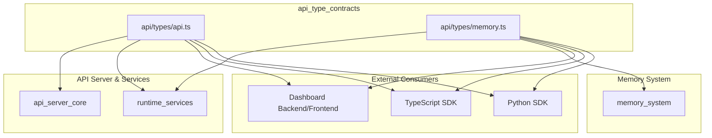
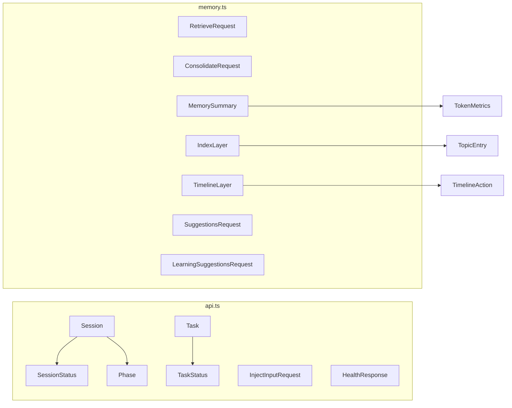
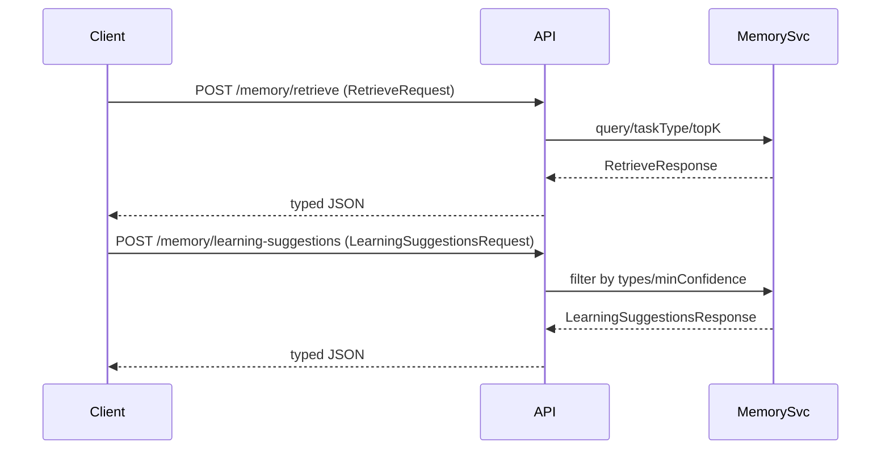
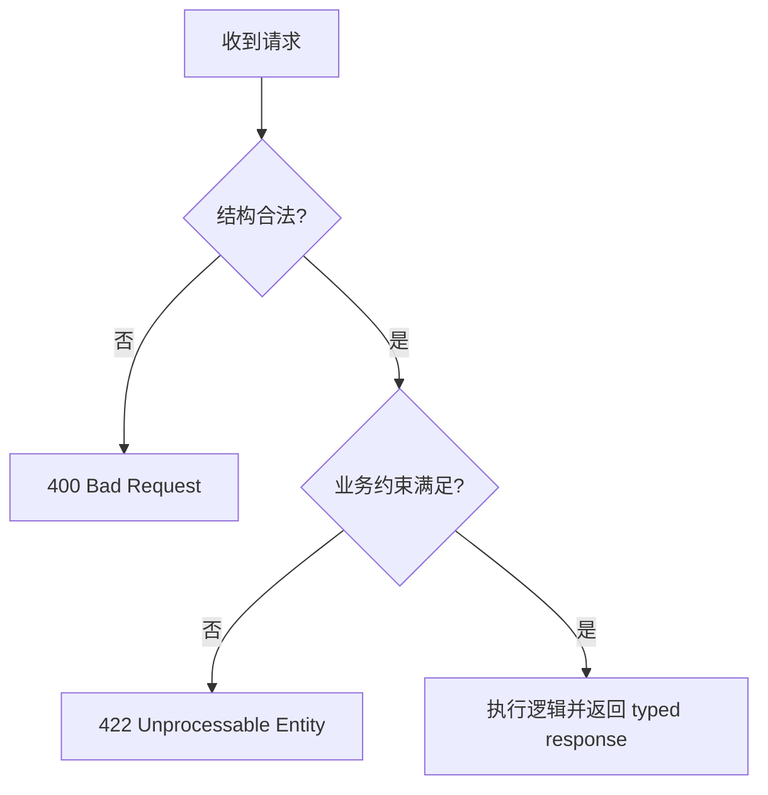

# API Type Contracts 模块文档

## 1. 模块概述

`api_type_contracts` 模块是 Loki Mode API 层的“协议契约中心”。它由 `api/types/api.ts` 与 `api/types/memory.ts` 组成，负责定义 HTTP/SSE API 的请求与响应结构、会话与任务状态模型、以及 Memory 子系统的检索与建议接口类型。该模块不直接执行业务逻辑，但它约束了业务逻辑如何输入、输出与演进。

从工程治理角度，这个模块存在的根本价值在于将“跨模块数据共识”前置到编译期。API Server、运行时服务、Dashboard、TypeScript SDK、Python SDK 通过统一类型契约共享语义，降低了字段漂移、枚举不一致和兼容性回归风险。对于维护者来说，类型文件往往是功能演进最先发生变化的位置，因此它也承担了接口版本治理与迁移策略的锚点角色。

## 2. 架构定位与依赖关系



上图反映了该模块作为“共享边界层”的位置：它位于服务实现与消费端之间，提供稳定的数据结构语义。若要理解这些类型被如何执行与传递，可参考 [`API Server Core.md`](API Server Core.md)、[`runtime_services.md`](runtime_services.md)、[`Memory System.md`](Memory System.md) 与 [`TypeScript SDK.md`](TypeScript SDK.md)。本文聚焦契约，不重复实现细节。

## 3. 内部类型组织与设计意图



`api.ts` 主要承载会话生命周期与任务执行域模型；`memory.ts` 主要承载检索、归纳、索引分层与建议生成模型。两者在表达风格上统一使用字符串时间戳、联合类型枚举、可选字段语义，降低了客户端解析复杂度。

## 4. 核心组件详解（api/types/api.ts）

### 4.1 `InjectInputRequest`

`InjectInputRequest` 用于向正在运行的会话注入外部输入。它由 `sessionId`、`input` 和可选的 `context` 构成。其设计意图是支持人机混合流程：在自动化执行过程中允许人工补充意图或上下文。

```typescript
export interface InjectInputRequest {
  sessionId: string;
  input: string;
  context?: string;
}
```

在实现层面，`sessionId` 通常要求对应活跃会话；`input` 需要非空；`context` 常用于审计、分类或 prompt 增强。虽然这些约束不在类型层硬编码，但建议在路由边界做 runtime 校验。

### 4.2 `Task`

`Task` 是任务执行域最关键的数据结构，整合了任务元信息、状态与执行结果。它以 `sessionId` 建立与会话的关联，并通过 `status` 与时间字段表达状态机进展。

```typescript
export interface Task {
  id: string;
  sessionId: string;
  title: string;
  description: string;
  status: TaskStatus;
  priority: number;
  createdAt: string;
  startedAt: string | null;
  completedAt: string | null;
  agent: string | null;
  output: string | null;
  error: string | null;
}
```

内部行为语义上，`startedAt/completedAt/agent/output/error` 都可能为空，表示“尚未发生”而非错误。`output` 与 `error` 的互斥关系依赖业务约定而非编译器强制，因此实现层需要维护该不变量。

### 4.3 `HealthResponse`

`HealthResponse` 用于健康检查端点，服务于监控、告警与流量治理。其关键点是将整体状态与 provider 可用性拆开表达，从而区分系统级故障与能力降级。

```typescript
export interface HealthResponse {
  status: "healthy" | "degraded" | "unhealthy";
  version: string;
  uptime: number;
  providers: {
    claude: boolean;
    codex: boolean;
    gemini: boolean;
  };
  activeSession: string | null;
}
```

若未来 provider 支持动态扩展，`providers` 的固定键模型可能成为演进点，需要谨慎规划兼容策略。

## 5. 核心组件详解（api/types/memory.ts）

### 5.1 `ConsolidateRequest`

`ConsolidateRequest` 描述 memory consolidation 的触发参数，`sinceHours` 可选，表示只处理最近一段时间的数据。这个设计允许“系统默认窗口”与“显式窗口”共存。

```typescript
export interface ConsolidateRequest {
  sinceHours?: number;
}
```

### 5.2 `EpisodesQueryParams` / `PatternsQueryParams`

这两个类型分别服务于 episodic 与 pattern 列表查询，是典型的“可组合过滤器”接口。它们通过可选字段让客户端按需构建查询参数，不强制一次给全。

```typescript
export interface EpisodesQueryParams {
  since?: string;
  limit?: number;
}

export interface PatternsQueryParams {
  category?: string;
  minConfidence?: number;
}
```

### 5.3 `MemorySummary`

`MemorySummary` 是仪表盘和健康总览常用的聚合类型，跨越 episodic/semantic/procedural 三个子域，并可携带 token 经济指标。

```typescript
export interface MemorySummary {
  episodic: { count: number; latestDate: string | null };
  semantic: { patterns: number; antiPatterns: number };
  procedural: { skills: number };
  tokenEconomics: TokenMetrics | null;
}
```

`tokenEconomics` 为 `null` 并不代表“零开销”，而是“暂不可用/未采集”。展示层应明确区分这两种语义。

### 5.4 `RetrieveRequest`

`RetrieveRequest` 是 memory 检索入口，`query` 为必填，`taskType/topK` 为可选优化参数。

```typescript
export interface RetrieveRequest {
  query: string;
  taskType?: string;
  topK?: number;
}
```

由于类型层未限制 `topK` 边界，服务层应提供上限保护，避免请求滥用导致高延迟或高 token 成本。

### 5.5 `IndexLayer` 与 `TimelineLayer`

`IndexLayer` 提供主题级轻量导航；`TimelineLayer` 提供时间序列的近期动态与上下文焦点。二者常用于分层加载策略：先索引、再时间线、再详情。

```typescript
export interface IndexLayer {
  version: string;
  lastUpdated: string;
  topics: TopicEntry[];
  totalMemories: number;
  totalTokensAvailable: number;
}

export interface TimelineLayer {
  version: string;
  lastUpdated: string;
  recentActions: TimelineAction[];
  keyDecisions: string[];
  activeContext: {
    currentFocus: string | null;
    blockedBy: string[];
    nextUp: string[];
  };
}
```

### 5.6 `SuggestionsRequest` 与 `LearningSuggestionsRequest`

两者都用于建议生成，但定位不同。`SuggestionsRequest` 更通用，偏 memory 检索导向；`LearningSuggestionsRequest` 增加类型、优先级和置信度筛选，偏学习系统导向。

```typescript
export interface SuggestionsRequest {
  context: string;
  taskType?: string;
  limit?: number;
}

export interface LearningSuggestionsRequest {
  context?: string;
  taskType?: string;
  types?: LearningSuggestionType[];
  limit?: number;
  minConfidence?: number;
}
```

## 6. 典型请求流与数据流



契约模块不参与执行路径，但决定了每个 hop 的 payload 结构。它通过统一 schema 使客户端、服务端与中间层可以在弱耦合下保持行为一致。

## 7. 实践用法示例

```typescript
import type { InjectInputRequest, Task, HealthResponse } from "api/types/api";
import type {
  RetrieveRequest,
  ConsolidateRequest,
  LearningSuggestionsRequest,
  IndexLayer,
} from "api/types/memory";

const injectReq: InjectInputRequest = {
  sessionId: "sess_001",
  input: "请优先修复支付回调失败",
  context: "线上阻塞问题",
};

const retrieveReq: RetrieveRequest = {
  query: "payment callback signature mismatch",
  taskType: "bugfix",
  topK: 5,
};

const consolidateReq: ConsolidateRequest = { sinceHours: 24 };

const learningReq: LearningSuggestionsRequest = {
  taskType: "testing",
  types: ["error", "practice"],
  minConfidence: 0.7,
  limit: 10,
};

function isTerminal(task: Task): boolean {
  return ["completed", "failed", "skipped"].includes(task.status);
}

function isServiceAvailable(health: HealthResponse): boolean {
  return health.status !== "unhealthy" && Object.values(health.providers).some(Boolean);
}

function hotTopics(index: IndexLayer): string[] {
  return index.topics.filter(t => t.relevanceScore > 0.6).map(t => t.summary);
}
```

## 8. 扩展与演进策略

契约扩展应优先保证向后兼容。新增字段建议先以可选字段发布，待消费端覆盖完成后再考虑转必填。对于联合类型新增值（如新增 provider、任务状态或建议类型），要同步更新 Dashboard 映射逻辑、SDK 分支处理、监控统计维度和自动化测试覆盖。


## 9. 边界条件、错误条件与限制

1. 类型仅在编译期生效，不能替代运行时校验。所有外部输入都应在 API 边界使用校验库（如 `zod`）进行验证。
2. `string` 时间戳不等于合法 ISO 时间，解析前应做格式校验。
3. 可空字段语义是“尚无值”，不是“请求失败”。消费端应避免将 `null` 误判为错误。
4. `topK/limit/minConfidence/sinceHours` 无内建边界，服务端必须自定义阈值。
5. `HealthResponse.providers` 是固定键结构，动态 provider 扩展时存在重构成本。



## 10. 与其他文档的引用关系

- API 路由、事件总线与进程管理：[`API Server Core.md`](API Server Core.md)
- 运行时服务交互（CLI Bridge、State Watcher、Learning Collector）：[`runtime_services.md`](runtime_services.md)
- Memory 实现机制与检索管线：[`Memory System.md`](Memory System.md)、[`Memory Engine.md`](Memory Engine.md)
- 客户端消费契约方式：[`TypeScript SDK.md`](TypeScript SDK.md)、[`Python SDK.md`](Python SDK.md)

通过将“契约文档”与“实现文档”分层维护，可以在接口稳定性与实现演进速度之间获得更好的平衡。