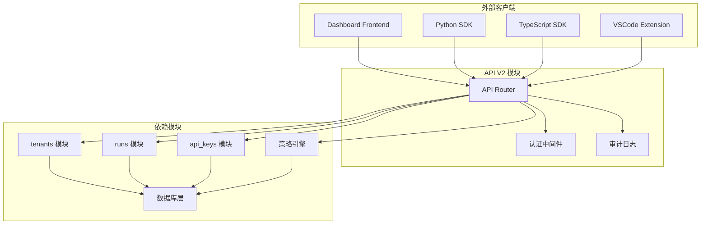
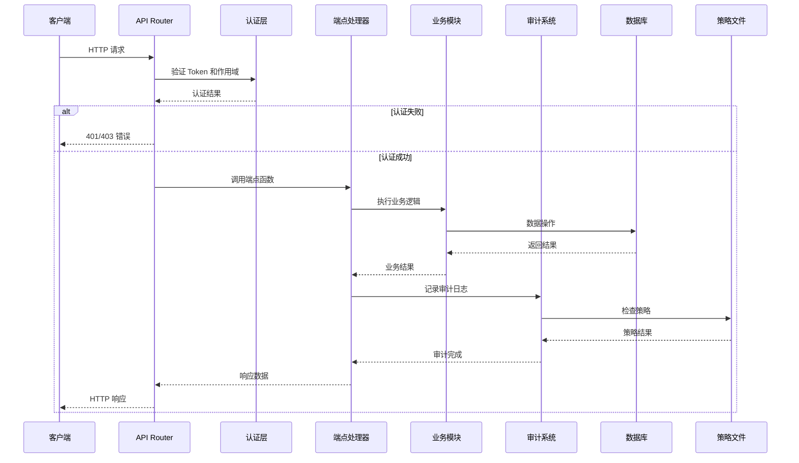
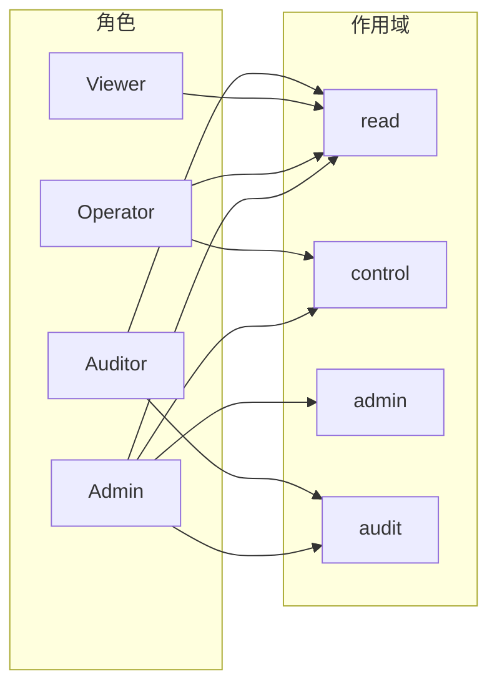

# API V2 模块文档

## 1. 模块概述

### 1.1 模块定位与目的

`api_v2` 模块是 Loki Mode Dashboard 系统的核心 REST API 接口层，提供了版本化的 `/api/v2/` 端点集合。该模块作为 Dashboard 后端与外部客户端（包括前端 UI、Python SDK、TypeScript SDK 以及第三方集成）之间的主要通信桥梁，负责处理所有核心业务实体的 CRUD 操作、策略管理、审计日志查询等关键功能。

该模块存在的核心价值在于：

1. **统一的 API 网关**：为所有 Dashboard 功能提供一致、版本化的 RESTful 接口，确保前后端分离架构下的稳定通信
2. **安全控制层**：集成认证授权机制，通过作用域（scope）控制不同端点的访问权限
3. **审计追踪**：所有关键操作自动记录审计日志，支持合规性要求和操作追溯
4. **策略执行**：提供策略加载、更新和评估接口，支持动态访问控制
5. **多租户支持**：完整的租户管理体系，支持 SaaS 模式的多组织隔离

### 1.2 设计原则

模块设计遵循以下核心原则：

- **RESTful 风格**：使用标准的 HTTP 方法和资源路径，遵循 REST 架构约束
- **版本化演进**：通过 `/api/v2/` 前缀明确 API 版本，支持未来平滑升级
- **依赖注入**：利用 FastAPI 的依赖注入系统管理数据库会话、认证信息等
- **数据验证**：使用 Pydantic 模型进行请求/响应数据的自动验证和序列化
- **错误处理**：统一的 HTTP 异常处理机制，返回标准化的错误响应
- **审计优先**：所有写操作自动记录审计日志，确保操作可追溯

### 1.3 模块关系



`api_v2` 模块与系统中其他核心模块的关系：

- **Dashboard Frontend**：前端 UI 组件通过 WebSocket 和 REST API 与 `api_v2` 通信，详见 [Dashboard Frontend](dashboard_frontend.md)
- **Python/TypeScript SDK**：SDK 封装了 `api_v2` 的所有端点，提供编程式访问接口，详见 [Python SDK](sdk_python.md) 和 [TypeScript SDK](sdk_typescript.md)
- **tenants/runs/api_keys 模块**：`api_v2` 调用这些模块的业务逻辑函数，自身专注于 HTTP 层处理
- **策略引擎**：通过文件存储实现策略配置，支持动态评估，与 [Policy Engine](policy_engine.md) 协同工作
- **审计系统**：所有操作记录到审计日志，与 [Audit](audit.md) 模块深度集成

## 2. 架构设计

### 2.1 整体架构



### 2.2 请求处理流程

每个 API 请求经过以下处理阶段：

1. **路由匹配**：FastAPI Router 根据 HTTP 方法和路径匹配对应的端点函数
2. **依赖解析**：自动注入数据库会话、认证信息等依赖项
3. **认证验证**：通过 `auth.require_scope()` 验证 Token 有效性和作用域权限
4. **数据验证**：Pydantic 自动验证请求体数据结构
5. **业务处理**：调用对应业务模块（tenants/runs/api_keys）的核心函数
6. **审计记录**：写操作自动记录审计日志，包含操作上下文
7. **响应返回**：序列化业务结果为 JSON 响应

### 2.3 核心组件

#### 2.3.1 API Router

```python
router = APIRouter(prefix="/api/v2", tags=["v2"])
```

Router 是 FastAPI 的核心组件，负责：
- 定义所有 `/api/v2/` 前缀的端点
- 组织端点为 `v2` 标签组，便于 API 文档分类
- 挂载到主应用：`app.include_router(api_v2_router)`

#### 2.3.2 Pydantic 数据模型

模块定义了三个核心请求模型：

**PolicyUpdate**
```python
class PolicyUpdate(BaseModel):
    """Schema for updating policies."""
    policies: dict = Field(..., description="Policy configuration dict")
```
用于策略更新请求，接收任意策略配置字典。

**PolicyEvaluateRequest**
```python
class PolicyEvaluateRequest(BaseModel):
    """Schema for evaluating a policy check."""
    action: str
    resource_type: str
    resource_id: Optional[str] = None
    context: Optional[dict] = None
```
用于策略评估请求，指定要检查的动作、资源类型和上下文。

**ApiKeyUpdateRequest**
```python
class ApiKeyUpdateRequest(BaseModel):
    """Schema for updating API key metadata."""
    description: Optional[str] = None
    allowed_ips: Optional[list[str]] = None
    rate_limit: Optional[int] = None
```
用于 API 密钥元数据更新，支持描述、IP 白名单和速率限制配置。

#### 2.3.3 辅助函数

**策略文件路径解析**
```python
def _get_policies_path() -> Path:
    """Return the path to the policies file (.json preferred, then .yaml)."""
    json_path = _LOKI_DIR / "policies.json"
    yaml_path = _LOKI_DIR / "policies.yaml"
    if json_path.exists():
        return json_path
    if yaml_path.exists():
        return yaml_path
    return json_path  # default to .json if neither exists
```
支持 JSON 和 YAML 两种策略文件格式，优先使用 JSON。

**策略加载与保存**
```python
def _load_policies() -> dict:
    """Load policies from disk."""
    # 自动检测文件格式并加载
    
def _save_policies(policies: dict) -> None:
    """Save policies to disk as JSON."""
    # 始终保存为 JSON 格式
```

**审计上下文提取**
```python
def _audit_context(request: Request, token_info: Optional[dict] = None) -> dict:
    """Extract IP address and user agent from a request for audit logging."""
    return {
        "ip_address": request.client.host if request.client else None,
        "user_agent": request.headers.get("user-agent"),
        "user_id": token_info.get("name") if token_info else None,
        "token_id": token_info.get("id") if token_info else None,
    }
```
从请求中提取审计所需的上下文信息。

## 3. API 端点详解

### 3.1 租户管理端点

租户（Tenant）是 Loki Mode 系统中的最高层级组织单元，支持多租户隔离。

#### 3.1.1 创建租户

```http
POST /api/v2/tenants
Content-Type: application/json
Authorization: Bearer <token>
Scope: control
```

**请求体**（参考 [TenantCreate](dashboard_tenants.md)）：
```json
{
  "name": "acme-corp",
  "description": "ACME Corporation",
  "settings": {
    "max_projects": 10,
    "max_runs_per_day": 1000
  }
}
```

**响应**（201 Created）：
```json
{
  "id": 1,
  "name": "acme-corp",
  "description": "ACME Corporation",
  "settings": {...},
  "created_at": "2024-01-15T10:30:00Z",
  "updated_at": "2024-01-15T10:30:00Z"
}
```

**权限要求**：`control` 作用域

**审计日志**：记录 `create` 动作，资源类型为 `tenant`

#### 3.1.2 列出所有租户

```http
GET /api/v2/tenants
Authorization: Bearer <token>
Scope: read
```

**响应**（200 OK）：
```json
[
  {
    "id": 1,
    "name": "acme-corp",
    "description": "ACME Corporation",
    ...
  },
  {
    "id": 2,
    "name": "globex-inc",
    "description": "Globex Inc",
    ...
  }
]
```

**权限要求**：`read` 作用域

#### 3.1.3 获取租户详情

```http
GET /api/v2/tenants/{tenant_id}
Authorization: Bearer <token>
Scope: read
```

**路径参数**：
- `tenant_id` (integer): 租户 ID

**响应**（200 OK）：单个租户对象

**错误响应**：
- 404 Not Found: 租户不存在

#### 3.1.4 更新租户

```http
PUT /api/v2/tenants/{tenant_id}
Content-Type: application/json
Authorization: Bearer <token>
Scope: control
```

**请求体**（参考 [TenantUpdate](dashboard_tenants.md)）：
```json
{
  "name": "acme-corp-updated",
  "description": "Updated description",
  "settings": {...}
}
```

**权限要求**：`control` 作用域

**审计日志**：记录 `update` 动作

#### 3.1.5 删除租户

```http
DELETE /api/v2/tenants/{tenant_id}
Authorization: Bearer <token>
Scope: control
```

**响应**（204 No Content）：成功删除无响应体

**错误响应**：
- 404 Not Found: 租户不存在

**审计日志**：记录 `delete` 动作

**注意事项**：
- 删除租户会级联删除其所有项目和关联数据
- 操作不可逆，需谨慎执行

#### 3.1.6 获取租户项目列表

```http
GET /api/v2/tenants/{tenant_id}/projects
Authorization: Bearer <token>
Scope: read
```

**响应**（200 OK）：
```json
[
  {
    "id": 101,
    "name": "project-alpha",
    "description": "Alpha project",
    "status": "active",
    "tenant_id": 1,
    "created_at": "2024-01-15T10:30:00Z",
    "updated_at": "2024-01-15T10:30:00Z"
  }
]
```

### 3.2 运行管理端点

运行（Run）是 Agent 执行任务的单次实例，包含完整的执行历史和状态。

#### 3.2.1 创建运行

```http
POST /api/v2/runs
Content-Type: application/json
Authorization: Bearer <token>
Scope: control
```

**请求体**（参考 [RunCreate](dashboard_runs.md)）：
```json
{
  "project_id": 101,
  "trigger": "manual",
  "config": {
    "agent_type": "swe-agent",
    "model": "gpt-4",
    "max_iterations": 50
  }
}
```

**响应**（201 Created）：
```json
{
  "id": 1001,
  "project_id": 101,
  "status": "running",
  "trigger": "manual",
  "config": {...},
  "created_at": "2024-01-15T11:00:00Z"
}
```

**权限要求**：`control` 作用域

**审计日志**：记录 `create` 动作，包含 `project_id` 和 `trigger` 详情

#### 3.2.2 列出运行

```http
GET /api/v2/runs?project_id=101&status=running&limit=50&offset=0
Authorization: Bearer <token>
Scope: read
```

**查询参数**：
- `project_id` (integer, optional): 按项目 ID 过滤
- `status` (string, optional): 按状态过滤（running/completed/failed/cancelled）
- `limit` (integer, 1-1000): 返回数量限制，默认 50
- `offset` (integer, >=0): 分页偏移量，默认 0

**响应**（200 OK）：运行列表

#### 3.2.3 获取运行详情

```http
GET /api/v2/runs/{run_id}
Authorization: Bearer <token>
Scope: read
```

**路径参数**：
- `run_id` (integer): 运行 ID

**响应**（200 OK）：单个运行对象，包含完整配置和状态

**错误响应**：
- 404 Not Found: 运行不存在

#### 3.2.4 取消运行

```http
POST /api/v2/runs/{run_id}/cancel
Authorization: Bearer <token>
Scope: control
```

**行为**：
- 将运行状态标记为 `cancelled`
- 通知执行引擎停止当前任务
- 保留已产生的执行历史

**审计日志**：记录 `cancel` 动作

#### 3.2.5 重放运行

```http
POST /api/v2/runs/{run_id}/replay
Authorization: Bearer <token>
Scope: control
```

**行为**：
- 基于原运行的配置创建新运行
- 保留原运行记录，创建新的运行 ID
- 用于调试和复现问题

**审计日志**：记录 `replay` 动作

#### 3.2.6 获取运行时间线

```http
GET /api/v2/runs/{run_id}/timeline
Authorization: Bearer <token>
Scope: read
```

**响应**（200 OK）：
```json
[
  {
    "timestamp": "2024-01-15T11:00:00Z",
    "event_type": "run_started",
    "details": {...}
  },
  {
    "timestamp": "2024-01-15T11:05:00Z",
    "event_type": "task_created",
    "details": {...}
  },
  {
    "timestamp": "2024-01-15T11:30:00Z",
    "event_type": "run_completed",
    "details": {...}
  }
]
```

**用途**：用于前端 [LokiRunManager](dashboard_ui_components.md) 和 [LokiRarvTimeline](dashboard_ui_components.md) 组件展示运行历史

### 3.3 API 密钥管理端点

API 密钥用于客户端认证和授权，支持细粒度的作用域控制和速率限制。

#### 3.3.1 创建 API 密钥

```http
POST /api/v2/api-keys
Content-Type: application/json
Authorization: Bearer <token>
Scope: admin
```

**请求体**（参考 [ApiKeyCreate](dashboard_api_keys.md)）：
```json
{
  "name": "production-key",
  "scopes": ["read", "control"],
  "expires_days": 365,
  "role": "service",
  "description": "Production service key",
  "allowed_ips": ["192.168.1.0/24", "10.0.0.1"],
  "rate_limit": 1000
}
```

**响应**（201 Created）：
```json
{
  "id": "key_abc123",
  "name": "production-key",
  "token": "sk_live_abc123xyz789",
  "scopes": ["read", "control"],
  "expires_at": "2025-01-15T11:00:00Z",
  "created_at": "2024-01-15T11:00:00Z"
}
```

**重要**：`token` 字段仅在创建时返回一次，之后无法再次获取

**权限要求**：`admin` 作用域

**审计日志**：记录 `create` 动作，包含密钥名称

#### 3.3.2 列出 API 密钥

```http
GET /api/v2/api-keys
Authorization: Bearer <token>
Scope: read
```

**响应**（200 OK）：
```json
[
  {
    "id": "key_abc123",
    "name": "production-key",
    "description": "Production service key",
    "scopes": ["read", "control"],
    "allowed_ips": ["192.168.1.0/24"],
    "rate_limit": 1000,
    "created_at": "2024-01-15T11:00:00Z",
    "last_used_at": "2024-01-15T12:00:00Z"
  }
]
```

**注意**：响应中不包含实际的 token 值，仅包含元数据

#### 3.3.3 获取 API 密钥详情

```http
GET /api/v2/api-keys/{identifier}
Authorization: Bearer <token>
Scope: read
```

**路径参数**：
- `identifier` (string): 密钥 ID 或名称

**响应**（200 OK）：单个密钥详情对象

**错误响应**：
- 404 Not Found: 密钥不存在

#### 3.3.4 更新 API 密钥

```http
PUT /api/v2/api-keys/{identifier}
Content-Type: application/json
Authorization: Bearer <token>
Scope: admin
```

**请求体**（ApiKeyUpdateRequest）：
```json
{
  "description": "Updated description",
  "allowed_ips": ["192.168.1.0/24", "10.0.0.2"],
  "rate_limit": 2000
}
```

**权限要求**：`admin` 作用域

**审计日志**：记录 `update` 动作

#### 3.3.5 删除 API 密钥

```http
DELETE /api/v2/api-keys/{identifier}
Authorization: Bearer <token>
Scope: admin
```

**响应**（204 No Content）

**审计日志**：记录 `delete` 动作

**注意事项**：
- 删除后立即失效，正在使用的连接会被终止
- 操作不可逆

#### 3.3.6 轮换 API 密钥

```http
POST /api/v2/api-keys/{identifier}/rotate
Content-Type: application/json
Authorization: Bearer <token>
Scope: admin
```

**请求体**（参考 [ApiKeyRotateRequest](dashboard_api_keys.md)）：
```json
{
  "grace_period_hours": 24
}
```

**响应**（200 OK）：
```json
{
  "old_key": {
    "id": "key_abc123",
    "expires_at": "2024-01-16T11:00:00Z"
  },
  "new_key": {
    "id": "key_def456",
    "token": "sk_live_def456uvw012",
    "expires_at": "2025-01-15T11:00:00Z"
  }
}
```

**行为**：
- 创建新密钥，继承原密钥的所有配置
- 原密钥在宽限期内仍然有效
- 宽限期后原密钥自动失效

**审计日志**：记录 `rotate` 动作，包含新密钥 ID

**最佳实践**：
- 定期轮换密钥（建议 90 天）
- 使用宽限期确保服务不中断
- 轮换后立即更新客户端配置

### 3.4 策略管理端点

策略系统提供基于规则的访问控制，支持动态配置和实时评估。

#### 3.4.1 获取当前策略

```http
GET /api/v2/policies
Authorization: Bearer <token>
Scope: read
```

**响应**（200 OK）：
```json
{
  "version": "1.0",
  "rules": [
    {
      "id": "rule-001",
      "action": "create",
      "resource_type": "run",
      "effect": "allow",
      "conditions": {
        "max_runs_per_day": 100
      }
    },
    {
      "id": "rule-002",
      "action": "delete",
      "resource_type": "tenant",
      "effect": "deny",
      "conditions": {
        "require_approval": true
      }
    }
  ],
  "defaults": {
    "effect": "allow"
  }
}
```

**存储机制**：策略存储在 `$LOKI_DATA_DIR/policies.json` 或 `policies.yaml`

#### 3.4.2 更新策略

```http
PUT /api/v2/policies
Content-Type: application/json
Authorization: Bearer <token>
Scope: admin
```

**请求体**（PolicyUpdate）：
```json
{
  "policies": {
    "version": "1.1",
    "rules": [...],
    "defaults": {...}
  }
}
```

**限制**：
- 策略 payload 最大 1MB（防止 DoS 攻击）
- 超出限制返回 413 Payload Too Large

**响应**（200 OK）：返回保存的策略对象

**审计日志**：记录 `update` 动作

**注意事项**：
- 策略更新立即生效，影响所有后续请求
- 建议先在测试环境验证策略
- 策略文件格式自动转换为 JSON 存储

#### 3.4.3 评估策略

```http
POST /api/v2/policies/evaluate
Content-Type: application/json
Authorization: Bearer <token>
Scope: control
```

**请求体**（PolicyEvaluateRequest）：
```json
{
  "action": "create",
  "resource_type": "run",
  "resource_id": "run-123",
  "context": {
    "user_id": "user-456",
    "project_id": 101
  }
}
```

**响应**（200 OK）：
```json
{
  "allowed": true,
  "matched_rules": [
    {
      "id": "rule-001",
      "action": "create",
      "resource_type": "run",
      "effect": "allow"
    }
  ],
  "action": "create",
  "resource_type": "run"
}
```

**评估逻辑**：
1. 遍历所有规则，匹配动作和资源类型
2. 通配符 `*` 匹配任意值
3. 如果任何匹配规则的 `effect` 为 `deny`，则拒绝
4. 默认允许（除非明确拒绝）

**用途**：
- 前端权限检查
- 策略调试和验证
- 自定义业务逻辑中的策略集成

### 3.5 审计日志端点

审计系统记录所有关键操作，支持查询、验证和导出。

#### 3.5.1 查询审计日志

```http
GET /api/v2/audit?start_date=2024-01-01&end_date=2024-01-31&action=create&resource_type=tenant&limit=100&offset=0
Authorization: Bearer <token>
Scope: audit
```

**查询参数**：
- `start_date` (string, optional): 开始日期（YYYY-MM-DD）
- `end_date` (string, optional): 结束日期（YYYY-MM-DD）
- `action` (string, optional): 动作类型（create/update/delete/cancel/replay/rotate）
- `resource_type` (string, optional): 资源类型（tenant/run/api_key/policy）
- `limit` (integer, 1-10000): 返回数量限制，默认 100
- `offset` (integer, >=0): 分页偏移量，默认 0

**响应**（200 OK）：
```json
[
  {
    "timestamp": "2024-01-15T11:00:00Z",
    "action": "create",
    "resource_type": "tenant",
    "resource_id": "1",
    "user_id": "admin",
    "token_id": "key_abc123",
    "ip_address": "192.168.1.100",
    "user_agent": "Mozilla/5.0...",
    "details": {
      "name": "acme-corp"
    }
  }
]
```

**权限要求**：`audit` 作用域

**存储机制**：审计日志以 JSONL 格式存储在 `$LOKI_DATA_DIR/audit/` 目录，按日期分文件

#### 3.5.2 验证审计完整性

```http
GET /api/v2/audit/verify
Authorization: Bearer <token>
Scope: audit
```

**响应**（200 OK）：
```json
{
  "valid": true,
  "files_checked": 31,
  "results": [
    {
      "file": "audit-2024-01-01.jsonl",
      "valid": true,
      "entries_count": 150,
      "hash_verified": true
    },
    {
      "file": "audit-2024-01-02.jsonl",
      "valid": true,
      "entries_count": 200,
      "hash_verified": true
    }
  ]
}
```

**验证内容**：
- 文件完整性（哈希校验）
- 日志条目格式正确性
- 时间戳连续性

**用途**：合规性审计、安全调查

#### 3.5.3 导出审计日志

```http
GET /api/v2/audit/export?start_date=2024-01-01&end_date=2024-01-31&format=csv
Authorization: Bearer <token>
Scope: audit
```

**查询参数**：
- `start_date` (string, optional): 开始日期
- `end_date` (string, optional): 结束日期
- `format` (string): 导出格式（json 或 csv），默认 json

**JSON 格式响应**：与查询接口相同的 JSON 数组

**CSV 格式响应**：
- Content-Type: `text/csv`
- Content-Disposition: `attachment; filename=audit-export.csv`
- 所有字典/列表值序列化为 JSON 字符串

**限制**：最多导出 10000 条记录

**用途**：
- 外部审计工具导入
- 长期归档
- 数据分析

## 4. 认证与授权

### 4.1 认证机制

`api_v2` 模块使用基于 Token 的认证机制，通过 `auth` 模块实现：

```python
token_info: Optional[dict] = Depends(auth.get_current_token)
```

**Token 来源**：
- HTTP Authorization Header: `Bearer <token>`
- Token 由 `auth.generate_token()` 生成
- Token 包含：id、name、scopes、expires_at、role 等信息

**Token 验证流程**：
1. 从请求头提取 Token
2. 验证 Token 签名和有效期
3. 检查 IP 白名单（如果配置）
4. 检查速率限制
5. 返回 Token 信息供端点使用

### 4.2 作用域（Scope）系统

每个端点要求特定的作用域权限：

| 作用域 | 描述 | 适用端点 |
|--------|------|----------|
| `read` | 只读访问 | 所有 GET 端点 |
| `control` | 控制操作 | 创建/更新/删除租户、运行，策略评估 |
| `admin` | 管理权限 | API 密钥管理、策略更新 |
| `audit` | 审计访问 | 审计日志查询、验证、导出 |

**作用域检查**：
```python
_auth: None = Depends(auth.require_scope("control"))
```

**多作用域 Token**：Token 可以包含多个作用域，如 `["read", "control"]`

### 4.3 权限矩阵



**推荐角色配置**：
- **Admin**：所有作用域，用于系统管理
- **Operator**：read + control，用于日常运营
- **Viewer**：仅 read，用于监控和查看
- **Auditor**：read + audit，用于合规审计

### 4.4 速率限制

API 密钥可配置速率限制：

```json
{
  "rate_limit": 1000
}
```

**限制单位**：请求数/分钟

**超限处理**：返回 429 Too Many Requests

**实现**：通过 `dashboard.server._RateLimiter` 实现（详见 [Dashboard Server](dashboard_server.md)）

## 5. 审计系统

### 5.1 审计日志结构

每条审计记录包含以下字段：

```json
{
  "timestamp": "2024-01-15T11:00:00.123456Z",
  "action": "create",
  "resource_type": "tenant",
  "resource_id": "1",
  "user_id": "admin",
  "token_id": "key_abc123",
  "ip_address": "192.168.1.100",
  "user_agent": "Mozilla/5.0...",
  "details": {
    "name": "acme-corp"
  },
  "signature": "sha256:abc123..."
}
```

**字段说明**：
- `timestamp`: ISO 8601 格式的时间戳
- `action`: 操作类型（create/update/delete/cancel/replay/rotate）
- `resource_type`: 资源类型（tenant/run/api_key/policy）
- `resource_id`: 资源标识符
- `user_id`: 执行操作的用户名
- `token_id`: 使用的 API 密钥 ID
- `ip_address`: 客户端 IP 地址
- `user_agent`: 客户端 User-Agent
- `details`: 操作详情（可选）
- `signature`: 完整性校验哈希

### 5.2 审计日志存储

**存储位置**：`$LOKI_DATA_DIR/audit/`

**文件命名**：`audit-YYYY-MM-DD.jsonl`

**文件格式**：JSONL（每行一个 JSON 对象）

**日志轮转**：每天创建新文件，保留策略可配置

### 5.3 自动审计记录

以下操作自动记录审计日志：

| 端点 | 动作 | 资源类型 | 详情内容 |
|------|------|----------|----------|
| POST /tenants | create | tenant | name |
| PUT /tenants/{id} | update | tenant | - |
| DELETE /tenants/{id} | delete | tenant | - |
| POST /runs | create | run | project_id, trigger |
| POST /runs/{id}/cancel | cancel | run | - |
| POST /runs/{id}/replay | replay | run | - |
| POST /api-keys | create | api_key | name |
| PUT /api-keys/{id} | update | api_key | - |
| DELETE /api-keys/{id} | delete | api_key | - |
| POST /api-keys/{id}/rotate | rotate | api_key | new_key.id |
| PUT /policies | update | policy | - |

### 5.4 审计完整性

**哈希链机制**：每条记录的 `signature` 字段包含：
- 当前记录内容的哈希
- 前一条记录的哈希（形成链式结构）

**验证方法**：
```python
audit.verify_log_integrity(log_file_path)
```

**验证内容**：
- 每条记录的哈希正确性
- 哈希链的连续性
- 文件未被篡改

## 6. 配置与部署

### 6.1 环境变量

| 变量名 | 默认值 | 描述 |
|--------|--------|------|
| `LOKI_DATA_DIR` | `~/.loki` | 数据存储目录 |

**配置示例**：
```bash
export LOKI_DATA_DIR=/var/lib/loki
```

### 6.2 目录结构

```
$LOKI_DATA_DIR/
├── policies.json          # 策略配置文件
├── policies.yaml          # 策略配置（可选，YAML 格式）
├── audit/
│   ├── audit-2024-01-01.jsonl
│   ├── audit-2024-01-02.jsonl
│   └── ...
└── api_keys.json          # API 密钥存储（加密）
```

### 6.3 策略文件格式

**JSON 格式**：
```json
{
  "version": "1.0",
  "rules": [
    {
      "id": "rule-001",
      "action": "*",
      "resource_type": "run",
      "effect": "allow",
      "conditions": {
        "max_concurrent_runs": 10
      }
    }
  ],
  "defaults": {
    "effect": "deny"
  }
}
```

**YAML 格式**：
```yaml
version: "1.0"
rules:
  - id: rule-001
    action: "*"
    resource_type: run
    effect: allow
    conditions:
      max_concurrent_runs: 10
defaults:
  effect: deny
```

### 6.4 挂载 Router

在 `server.py` 中挂载 `api_v2` router：

```python
from fastapi import FastAPI
from dashboard.api_v2 import router as api_v2_router

app = FastAPI()

# 挂载 API V2 Router
app.include_router(api_v2_router)

# 其他 routers...
```

### 6.5 CORS 配置

如果前端需要跨域访问，配置 CORS：

```python
from fastapi.middleware.cors import CORSMiddleware

app.add_middleware(
    CORSMiddleware,
    allow_origins=["https://dashboard.loki-mode.com"],
    allow_credentials=True,
    allow_methods=["*"],
    allow_headers=["*"],
)
```

## 7. 使用示例

### 7.1 Python SDK 使用

```python
from loki_mode_sdk import AutonomiClient

client = AutonomiClient(
    base_url="https://api.loki-mode.com",
    api_key="sk_live_abc123"
)

# 创建租户
tenant = client.tenants.create(
    name="my-tenant",
    description="My organization"
)

# 创建运行
run = client.runs.create(
    project_id=tenant.projects[0].id,
    trigger="manual",
    config={"agent_type": "swe-agent"}
)

# 查询审计日志
logs = client.audit.query(
    start_date="2024-01-01",
    resource_type="run"
)
```

详见 [Python SDK](sdk_python.md)

### 7.2 TypeScript SDK 使用

```typescript
import { AutonomiClient } from '@loki-mode/sdk';

const client = new AutonomiClient({
  baseUrl: 'https://api.loki-mode.com',
  apiKey: 'sk_live_abc123'
});

// 列出运行
const runs = await client.runs.list({
  projectId: 101,
  status: 'running'
});

// 取消运行
await client.runs.cancel(runId);
```

详见 [TypeScript SDK](sdk_typescript.md)

### 7.3 cURL 示例

```bash
# 创建租户
curl -X POST https://api.loki-mode.com/api/v2/tenants \
  -H "Authorization: Bearer sk_live_abc123" \
  -H "Content-Type: application/json" \
  -d '{"name": "test-tenant", "description": "Test"}'

# 列出运行
curl -X GET "https://api.loki-mode.com/api/v2/runs?project_id=101" \
  -H "Authorization: Bearer sk_live_abc123"

# 导出审计日志
curl -X GET "https://api.loki-mode.com/api/v2/audit/export?format=csv" \
  -H "Authorization: Bearer sk_live_abc123" \
  -o audit-export.csv
```

### 7.4 前端集成

Dashboard Frontend 通过 API 客户端与 `api_v2` 通信：

```typescript
// dashboard/frontend/src/api/BackendClient.ts
class BackendClient {
  async createTenant(data: TenantCreate): Promise<Tenant> {
    const response = await fetch('/api/v2/tenants', {
      method: 'POST',
      headers: { 'Content-Type': 'application/json' },
      body: JSON.stringify(data)
    });
    return response.json();
  }
}
```

详见 [Dashboard Frontend](dashboard_frontend.md)

## 8. 错误处理

### 8.1 HTTP 状态码

| 状态码 | 含义 | 常见场景 |
|--------|------|----------|
| 200 | OK | 成功 GET/PUT 请求 |
| 201 | Created | 成功创建资源 |
| 204 | No Content | 成功删除资源 |
| 400 | Bad Request | 请求参数错误 |
| 401 | Unauthorized | Token 缺失或无效 |
| 403 | Forbidden | 作用域权限不足 |
| 404 | Not Found | 资源不存在 |
| 413 | Payload Too Large | 策略数据超过 1MB |
| 429 | Too Many Requests | 超过速率限制 |
| 500 | Internal Server Error | 服务器内部错误 |

### 8.2 错误响应格式

```json
{
  "detail": "Tenant not found"
}
```

**常见错误消息**：
- `Tenant not found`: 租户 ID 不存在
- `Run not found`: 运行 ID 不存在
- `API key not found`: API 密钥 ID 或名称不存在
- `Policy payload exceeds 1MB limit`: 策略数据过大
- `Invalid token`: Token 无效或过期
- `Insufficient scope`: 作用域权限不足

### 8.3 异常处理最佳实践

```python
try:
    result = api_keys.update_key_metadata(...)
except ValueError as e:
    raise HTTPException(status_code=404, detail=str(e))
```

**原则**：
- 业务异常转换为适当的 HTTP 状态码
- 不暴露内部实现细节
- 提供清晰的错误消息

## 9. 边界情况与注意事项

### 9.1 并发控制

**租户删除**：
- 删除租户会级联删除所有关联数据
- 建议在删除前检查是否有活跃运行
- 考虑实现软删除机制

**API 密钥轮换**：
- 宽限期内新旧密钥同时有效
- 确保宽限期足够长以完成客户端更新
- 轮换后立即通知相关服务

### 9.2 数据一致性

**策略更新**：
- 策略更新立即生效，无版本回滚
- 建议实现策略版本控制
- 更新前备份当前策略

**审计日志**：
- 审计写入失败不应阻塞主操作
- 考虑异步写入机制
- 定期验证审计完整性

### 9.3 性能考虑

**查询分页**：
- 所有列表端点支持 `limit` 和 `offset`
- 最大限制 10000（审计）/ 1000（运行）
- 大数据量考虑游标分页

**策略评估**：
- 当前实现为线性遍历规则
- 规则数量多时考虑优化（索引、缓存）
- 避免在热路径上频繁评估

### 9.4 安全注意事项

**Token 保护**：
- Token 仅在创建时返回一次
- 客户端安全存储 Token
- 定期轮换密钥

**IP 白名单**：
- 生产环境建议配置 IP 白名单
- 支持 CIDR 格式（如 `192.168.1.0/24`）
- 白名单变更立即生效

**审计日志保护**：
- 审计目录设置严格权限
- 定期备份审计日志
- 监控审计文件完整性

### 9.5 已知限制

1. **策略格式**：更新时始终保存为 JSON，YAML 仅支持读取
2. **审计导出**：最大 10000 条记录，超大数据需分批导出
3. **时区处理**：所有时间戳使用 UTC，客户端需自行转换
4. **资源删除**：删除操作不可逆，无回收站机制
5. **策略评估**：当前实现较简单，不支持复杂条件组合

## 10. 扩展与定制

### 10.1 添加新端点

```python
@router.post("/custom-endpoint")
async def custom_endpoint(
    body: CustomRequest,
    request: Request,
    db: AsyncSession = Depends(get_db),
    _auth: None = Depends(auth.require_scope("control")),
    token_info: Optional[dict] = Depends(auth.get_current_token),
):
    """Custom endpoint documentation."""
    # 业务逻辑
    result = await custom_business_logic(db, body)
    
    # 审计记录
    ctx = _audit_context(request, token_info)
    audit.log_event(
        action="custom",
        resource_type="custom_resource",
        resource_id=str(result.id),
        **ctx,
    )
    
    return result
```

### 10.2 自定义认证

扩展 `auth` 模块实现自定义认证逻辑：

```python
# dashboard/auth.py
def custom_auth_dependency():
    # 自定义认证逻辑
    pass
```

### 10.3 集成外部策略引擎

替换文件存储策略为外部策略服务：

```python
def _load_policies() -> dict:
    # 调用外部策略服务
    response = requests.get(POLICY_SERVICE_URL)
    return response.json()
```

## 11. 相关模块参考

- **[Dashboard Server](dashboard_server.md)**：主服务器配置、连接管理、速率限制
- **[Dashboard Models](dashboard_models.md)**：数据模型定义（Tenant、Run、Task 等）
- **[Dashboard API Keys](dashboard_api_keys.md)**：API 密钥管理业务逻辑
- **[Dashboard Tenants](dashboard_tenants.md)**：租户管理业务逻辑
- **[Dashboard Runs](dashboard_runs.md)**：运行管理业务逻辑
- **[Audit](audit.md)**：审计系统底层实现
- **[Policy Engine](policy_engine.md)**：策略引擎核心逻辑
- **[Python SDK](sdk_python.md)**：Python 客户端 SDK
- **[TypeScript SDK](sdk_typescript.md)**：TypeScript 客户端 SDK
- **[Dashboard Frontend](dashboard_frontend.md)**：前端 UI 实现
- **[Dashboard UI Components](dashboard_ui_components.md)**：UI 组件库

## 12. 版本历史

| 版本 | 日期 | 变更 |
|------|------|------|
| v2.0 | 2024-01 | 初始版本，完整 REST API |
| v2.1 | 2024-02 | 添加策略评估端点 |
| v2.2 | 2024-03 | 审计日志导出功能 |

---

*最后更新：2024-01-15*
