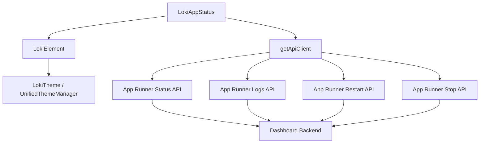
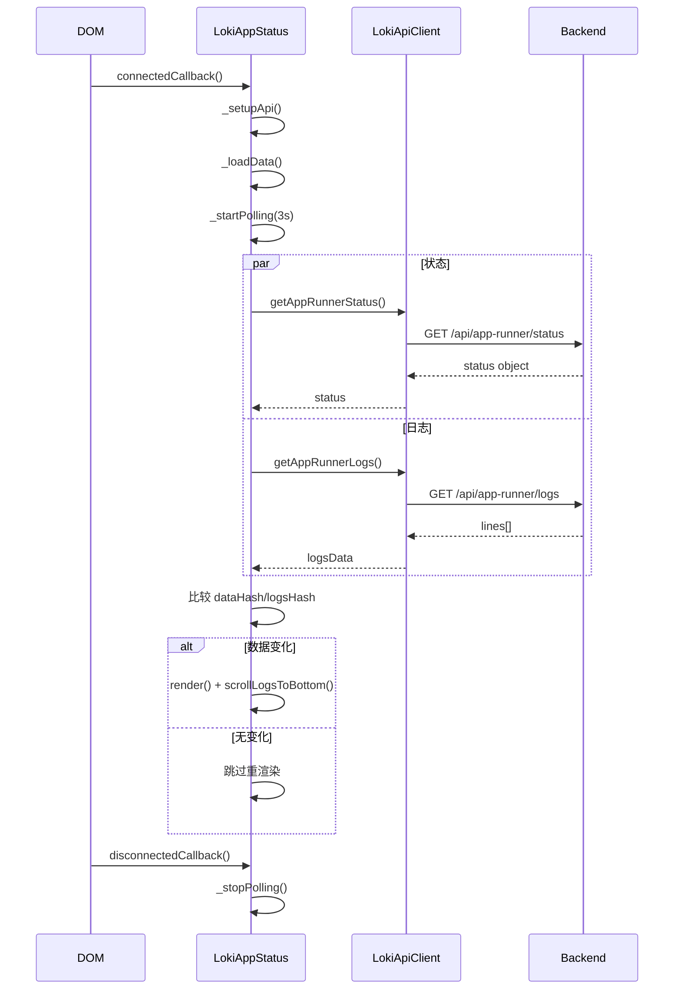
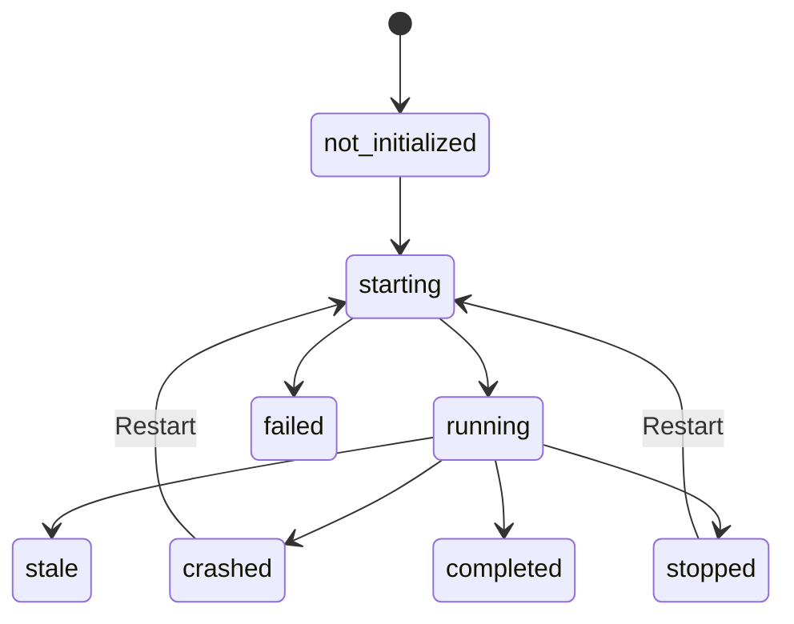
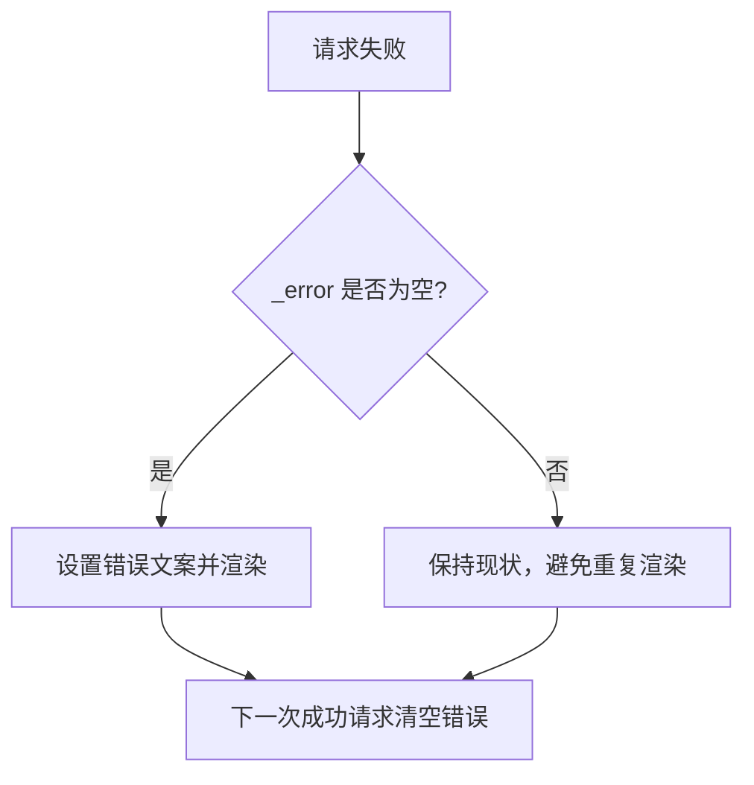
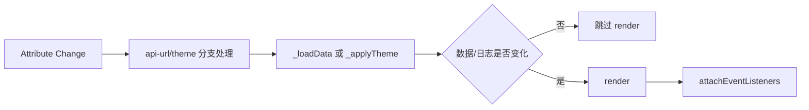
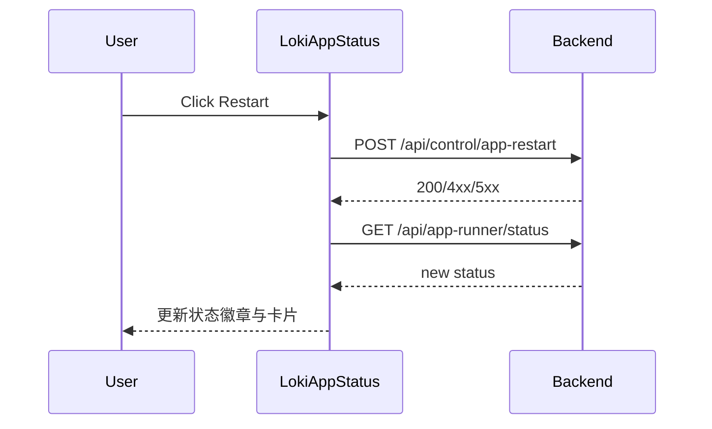

# app_runner_health_and_control

## 模块简介

`app_runner_health_and_control` 是 Dashboard UI 中“Monitoring and Observability Components”下专注 **应用运行器（App Runner）健康状态与控制面** 的子模块，核心实现为 `dashboard-ui.components.loki-app-status.LokiAppStatus`。这个模块存在的根本原因，是把“应用是否在跑、跑在哪、是否异常、能否一键恢复”这些高频运维问题，收敛到一个低门槛、实时可见的 Web Component 中。

从设计上看，它并不是一个纯展示组件，而是“读状态 + 控制动作”的组合体：一方面持续拉取 App Runner 状态与日志，将运行状态可视化；另一方面提供 `Restart` 与 `Stop` 控制入口，通过 `getApiClient` 暴露的 `restartApp()`、`stopApp()` 等方法触发后端动作。这种“观测与干预一体化”能显著缩短故障确认到恢复的路径。

在系统层级中，该模块处于前端观测层，与 [runtime_log_streaming_and_terminal_view.md](./runtime_log_streaming_and_terminal_view.md)、[session_overview_and_gate_signals.md](./session_overview_and_gate_signals.md)（若存在）形成互补：`LokiAppStatus` 关注 App Runner 进程级健康；`LokiLogStream` 更偏全局日志流；`LokiOverview` 则偏摘要指标。主题、基础样式和生命周期能力来自 [Core Theme.md](./Core%20Theme.md) 与 [Unified Styles.md](./Unified%20Styles.md)。

---

## 架构与依赖关系



该架构体现了清晰的职责边界。`LokiAppStatus` 负责状态建模、UI 渲染与交互；`LokiElement` 提供主题注入与基础生命周期；`LokiApiClient` 屏蔽了 fetch、超时、错误转换等通信细节。组件本身不感知后端内部是如何管理进程的，它只依赖稳定的 HTTP contract，因此前后端演进可以相对解耦。

---

## 核心组件详解

### 1) `STATUS_CONFIG`

`STATUS_CONFIG` 是状态到视觉语义的映射表，定义了颜色、标签和是否脉冲动画。它把后端枚举状态（如 `running`、`crashed`）统一翻译成用户可读表达，并避免在渲染逻辑中散落硬编码。

该表支持的关键状态包括 `not_initialized`、`starting`、`running`、`stale`、`completed`、`failed`、`crashed`、`stopped`、`unknown`。若后端出现未登记状态，会回落到 `not_initialized` 配置，保证 UI 不崩溃。

### 2) `LokiAppStatus` 类

`LokiAppStatus` 继承自 `LokiElement`，是一个标准 custom element（`<loki-app-status>`）。它的核心内部状态包括 `_status`（运行状态对象）、`_logs`（日志数组）、`_error`（错误横幅文本）、`_pollInterval`（轮询定时器）、`_lastDataHash/_lastLogsHash`（增量渲染判定用哈希）。

该类通过 `observedAttributes = ['api-url', 'theme']` 支持运行期配置变更。`api-url` 变化会更新 API 基地址并立即刷新；`theme` 变化会走父类主题重应用。

---

## 生命周期与工作流



这里最重要的实现细节是 `_loadData()` 的并发拉取与变更检测：它使用 `Promise.all` 同时请求状态和日志，随后仅比较关键字段（status/port/restart_count/url）与日志末 5 行，若无变化直接返回。这样做能减少 Shadow DOM 重建频率，降低轮询成本。

---

## 关键方法（行为、参数、返回值、副作用）

### `connectedCallback()`

该方法在组件挂载后自动调用。它先执行 `super.connectedCallback()` 以启用主题与基础能力，然后初始化 API 客户端、执行首次加载并启动轮询。它无入参、无返回值，副作用是注册 `setInterval` 与 `visibilitychange` 监听。

### `disconnectedCallback()`

该方法在组件卸载时调用，用于清理轮询与页面可见性监听，避免内存泄漏或幽灵请求。无入参、无返回值，副作用是销毁本组件相关定时器和事件处理函数。

### `attributeChangedCallback(name, oldValue, newValue)`

当 `api-url` 或 `theme` 变化时触发。`api-url` 变化会修改 `this._api.baseUrl` 并调用 `_loadData()`；`theme` 变化会调用 `_applyTheme()`。该方法没有业务返回值，但对连接目标和视觉主题有直接副作用。

### `_loadData(): Promise<void>`

这是模块最核心的方法。它并发请求状态与日志，计算 `dataHash/logsHash` 判定是否需要渲染。成功路径会更新 `_status/_logs/_error` 并触发 `render()`；失败路径仅在当前无错误时写入 `_error` 并渲染错误横幅，避免重复刷屏。

### `_handleRestart(): Promise<void>` 与 `_handleStop(): Promise<void>`

分别封装控制动作：调用 `restartApp()` 或 `stopApp()` 后触发 `_loadData()` 立即刷新。若请求失败，会设置 `_error` 显示“Restart failed”或“Stop failed”。它们不返回业务数据，主要副作用是发起后端控制命令。

### `_formatUptime(startedAt): string`

输入为启动时间字符串，输出为用户可读时长：秒、分秒、小时分钟三级格式。若 `startedAt` 缺失返回 `--`。该函数纯计算，无外部副作用。

### `_isValidUrl(str): boolean`

用于决定 URL 字段以纯文本显示还是可点击链接显示。仅允许 `http:` / `https:`，可避免 `javascript:` 等危险协议被注入为锚点。

### `render(): void`

`render()` 根据 `isActive = status && status !== 'not_initialized'` 决定展示“状态卡 + 日志 + 操作按钮”还是“未启动空态”。它会调用 `_renderStatusBadge/_renderStatusCard/_renderLogs/_renderActions/_renderEmpty` 生成模板，并在末尾调用 `_attachEventListeners()` 重新绑定按钮点击事件。

---

## UI 状态机与按钮策略



按钮启用规则体现了“保守控制”策略：

- `Restart` 仅在 `running | crashed | stopped` 可点击。
- `Stop` 仅在 `running | starting` 可点击。

这避免了在不可恢复或语义不清状态下触发控制命令，降低误操作概率。

---

## API Contract 与数据结构

组件依赖 `LokiApiClient` 中以下方法：

```javascript
getAppRunnerStatus()   // 获取 App Runner 当前状态
getAppRunnerLogs(n=100) // 获取日志（通常支持 lines 参数）
restartApp()           // 触发重启
stopApp()              // 触发停止
```

典型状态对象（示意）：

```json
{
  "status": "running",
  "method": "direct",
  "port": 3000,
  "url": "http://localhost:3000",
  "restart_count": 1,
  "started_at": "2026-01-01T10:00:00Z",
  "error": null
}
```

日志对象来自 `getAppRunnerLogs()`，组件按 `logsData.lines` 读取，并在 UI 中只渲染最后 20 行。

---

## 使用与配置

最小用法如下：

```html
<loki-app-status></loki-app-status>
```

指定后端与主题：

```html
<loki-app-status
  api-url="http://localhost:57374"
  theme="dark">
</loki-app-status>
```

在框架中使用时，本质是原生 custom element。你可以动态修改属性驱动行为：

```javascript
const el = document.querySelector('loki-app-status');
el.setAttribute('api-url', 'https://my-dashboard.example.com');
el.setAttribute('theme', 'light');
```

---

## 扩展与二次开发建议

如果你要扩展该模块，推荐沿以下方向演进。第一，可以将当前固定 3 秒轮询改为可配置属性（如 `poll-interval`），并限制最小值避免过载。第二，可以把错误展示从单条 banner 升级为带时间戳和恢复提示的 transient toast。第三，可以加入更多动作按钮（如 `Open URL`、`View full logs`），并用能力探测避免后端不支持时报错。第四，可以将状态字段渲染改为 schema-driven（键值映射），减少前后端字段新增时的改动成本。

---

## 边界条件、错误处理与限制



这个模块具备基本容错，但仍有几个需要关注的操作性细节。

第一，`_loading` 字段已定义但当前未实际参与渲染，意味着没有加载态 skeleton；在慢网络下用户可能只看到旧数据。第二，`_attachEventListeners()` 每次 `render()` 后都会重新查询新 DOM 并绑定，这在当前实现是安全的（旧节点已被替换），但高频重渲染下仍有额外开销。第三，日志变更比较只看最后 5 行，若日志在前段发生修订（少见）不会触发渲染。第四，`_formatUptime()` 使用客户端时间计算，若浏览器时钟漂移会导致显示不准确。第五，组件自身做了可见性暂停轮询，而 `LokiApiClient` 也有自适应轮询能力；当前因为本组件直接用自己的 `setInterval`，两者不会冲突，但要避免未来重复引入第二层 polling。

此外，安全层面已经对文本输出使用 `_escapeHtml`，并对 URL 进行协议校验，这是正确的基础防护；但若后端返回超长错误字符串或超大日志数组，仍建议在服务端做长度上限与分页。

---

## 与系统其他模块的协同

该模块向上服务于 Dashboard 的运行态可视化，向下依赖 Dashboard Backend 的控制与状态接口。更具体地说，它通常与 `LokiOverview` 的摘要卡配合使用：`LokiOverview` 给“是否健康”的全局判断，`LokiAppStatus` 给“为何不健康、如何恢复”的可操作细节。若需要深入排查日志细节，应跳转至 [runtime_log_streaming_and_terminal_view.md](./runtime_log_streaming_and_terminal_view.md) 对应的 `LokiLogStream` 组件。

在后端侧，App Runner 状态来源通常与 API Server/State Watcher/Process 管理机制关联，建议结合 [API Server & Services.md](./API%20Server%20%26%20Services.md) 与 [Dashboard Backend.md](./Dashboard%20Backend.md) 共同阅读，以理解状态字段更新时机与控制命令的实际执行语义。

---

## 结论

`app_runner_health_and_control` 是一个面向“运行健康与快速控制”的前端模块，强调稳定轮询、低成本渲染、明确状态语义和可执行恢复动作。它的实现保持了较低耦合与较高可维护性，适合作为 App Runner 运维入口。若未来系统规模继续增大，建议优先增强“可配置轮询 + 更强状态机 + 日志分页/虚拟化”，在不破坏现有使用方式的前提下提升可扩展性。


---

## 参考实现拆解：从源码看内部机制

`LokiAppStatus` 的实现风格是“低复杂度可维护优先”，并没有引入状态管理库或复杂虚拟列表，而是用少量私有字段控制完整行为。其关键内部机制可以概括为四层：属性层（`api-url`/`theme`）、轮询层（`setInterval + visibilitychange`）、数据层（并发请求 + hash 去抖）、视图层（一次性 innerHTML 重绘 + 事件重绑）。

在属性层中，`api-url` 允许该组件脱离同源假设，直接接入外部部署的 Dashboard Backend；这对于本地开发（前后端端口不同）或多环境切换非常实用。`theme` 透传给父类 `LokiElement` 的主题能力，确保该组件在统一主题体系中行为一致。

在轮询层中，组件每 3 秒拉取状态和日志，但当标签页进入后台（`document.hidden=true`）时会暂停轮询，恢复可见后立即补拉一次。这一策略对“实时性”和“资源占用”做了平衡：前台尽可能新，后台尽可能省。

在数据层中，`_loadData()` 不直接以“对象深比较”判断变化，而是抽取关键字段和日志末尾进行哈希字符串比较。这样做的价值是简单、直观、性能可接受；代价是可能忽略部分非关键字段变化（见后文限制说明）。

在视图层中，组件每次 `render()` 都重设 `shadowRoot.innerHTML`，再调用 `_attachEventListeners()` 绑定按钮事件。这种模式牺牲了局部更新精细度，但减少了 DOM diff 逻辑复杂度，适合当前中小规模 UI。



上述流程意味着：组件可维护性较高，调试路径清晰，但在超高频刷新或大日志体量场景下，仍有优化空间。

---

## 与后端契约的对齐建议

虽然该组件只直接依赖 `LokiApiClient` 暴露的方法，但从模块树看，它实际处在 Dashboard UI 与 Dashboard Backend 的交汇点。为了避免前后端升级时出现“状态字段偏移”问题，建议在接口层保持以下契约稳定性。

第一，`status` 枚举建议保持向后兼容，新增状态时优先追加而不是替换旧值；前端对未知值回落到 `Unknown`/`not_initialized`。第二，`started_at` 应统一使用 ISO 8601 字符串并明确时区。第三，`logs.lines` 应保证数组元素为字符串，避免混入对象导致渲染异常。第四，`restart_count` 建议为非负整数，空值使用 `null` 而非空字符串。

```json
{
  "status": "crashed",
  "method": "container",
  "port": 4173,
  "url": "http://127.0.0.1:4173",
  "restart_count": 3,
  "started_at": "2026-02-15T09:45:00Z",
  "error": "Address already in use"
}
```

如果你在后端扩展了更多字段（例如 `pid`、`memory_mb`、`cpu_percent`），前端可以按“可选字段渐进展示”的方式引入，不必破坏当前布局。相关 API 面设计可参考 [api_surface_and_transport.md](./api_surface_and_transport.md) 与 [Dashboard Backend.md](./Dashboard%20Backend.md)。

---

## 可扩展点：如何安全地添加新能力

如果需要在不破坏现有行为的前提下增强模块，最稳妥的方式是新增 attribute + 保持默认值兼容。比如新增 `poll-interval`、`max-log-lines`、`show-controls`。

```html
<loki-app-status
  api-url="http://localhost:57374"
  theme="dark"
  poll-interval="5000"
  max-log-lines="50"
  show-controls="true">
</loki-app-status>
```

实现上建议把 `_startPolling()` 中的固定 `3000` 改为一个解析函数（含最小值保护），把 `_renderLogs()` 中固定 `20` 改为配置值并设置上限，避免被异常大值拖垮渲染。

```javascript
_getPollInterval() {
  const raw = Number(this.getAttribute('poll-interval') || 3000);
  return Number.isFinite(raw) ? Math.max(1000, raw) : 3000;
}
```

这类增强应保持“默认行为不变”，否则会影响现有 Dashboard 页面。

---

## 故障排查手册（运维/联调常用）

当页面显示 `Failed to load app status` 时，建议按如下顺序排查。先检查 `api-url` 是否指向正确后端，再确认后端是否实现了 `getAppRunnerStatus/getAppRunnerLogs` 对应路径，然后检查是否存在跨域策略阻断（CORS），最后再看认证/网关层是否拦截了控制接口。

若状态一直是 `not_initialized`，通常不是前端问题，而是后端 App Runner 尚未触发首次构建流程。此时应结合 [session_control_runtime.md](./session_control_runtime.md) 或任务执行链路文档确认是否有成功启动记录。

若点击 `Restart` 或 `Stop` 无效果，先看按钮是否处于允许状态，再查看 Network 面板中控制接口返回码；如果返回 200 但 UI 不更新，重点检查后端状态刷新延迟与日志接口是否返回旧缓存。



---

## 已知限制与未来演进方向

当前实现在简洁性上表现很好，但仍有几个现实限制值得记录。首先，它是轮询而非推送模式，状态变化最快可见延迟约为轮询周期。其次，日志展示只保留尾部片段，不适合进行长时间历史审计。再次，`render()` 全量重绘在数据量较大时会带来额外开销。最后，错误显示是“首错优先”，不会持续累积错误时间线。

未来如果系统向“大规模并发会话 + 多 runner 节点”演进，可以考虑三条路线：其一，引入 SSE/WebSocket 做事件驱动状态更新；其二，日志改为增量游标拉取并支持下载；其三，将状态卡扩展为多实例视图（runner 列表）。在此之前，当前组件已经足以覆盖单实例和小规模团队场景。
