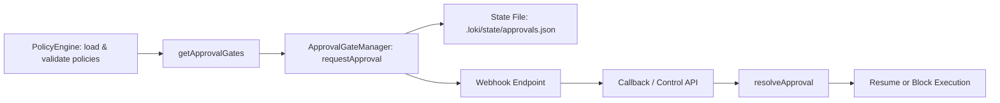
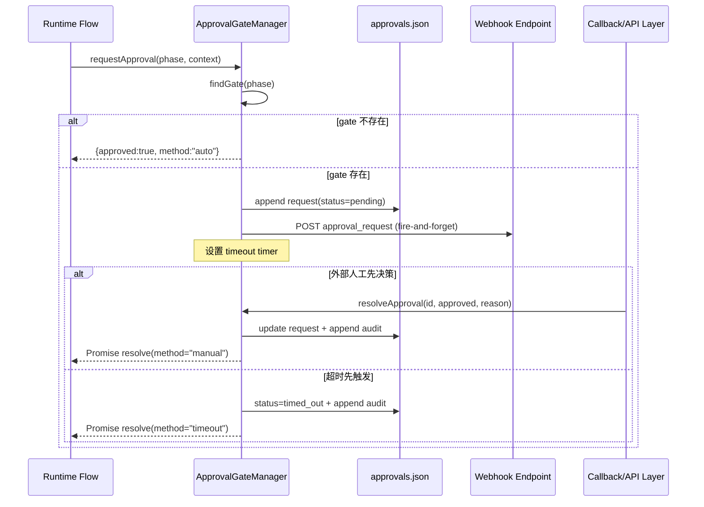

# approval_gate_workflow（审批闸门工作流）模块文档

## 模块简介与设计动机

`approval_gate_workflow` 对应 `Policy Engine` 中的 `src.policies.approval.ApprovalGateManager`，它的核心目标是在自动化执行流程的关键阶段（phase）插入“人工或外部系统决策点”。在没有这个模块时，策略引擎通常只能给出“允许/拒绝”的同步决策；而在真实生产环境里，很多操作并不适合直接拒绝或直接放行，例如高风险部署、敏感数据导出、预算临界操作等，这些场景需要“暂停并等待批准”。

本模块通过“按 phase 配置 gate + 异步 webhook 通知 + 超时决策 + 本地持久化审计”的组合，实现了可落地的审批编排能力。它不是一个完整的工作流引擎，而是一个轻量、嵌入式的审批状态机：在请求发起后进入 `pending`，随后转为 `approved` / `rejected` / `timed_out`。这种设计让系统在保持低复杂度的前提下，仍可满足治理、合规和可追溯性的基本要求。

从模块边界看，`ApprovalGateManager` 通常由上层策略编排组件（如 [policy_evaluation_engine.md](policy_evaluation_engine.md) 对应的 `PolicyEngine`）提供 gate 配置，再由运行时在特定 phase 调用 `requestApproval()`。它与 `cost_governance_controller`（`CostController`）属于并列治理能力：前者处理“人机审批”，后者处理“预算阈值控制”。

---

## 在系统中的定位



上图体现了典型链路：`PolicyEngine` 负责读取策略并产出 `approval_gates` 配置；`ApprovalGateManager` 在执行期判断当前 phase 是否需要 gate，并生成审批请求；请求状态会落盘到 `.loki/state/approvals.json`，同时可选触发 webhook 通知外部系统；当外部系统（或人工操作）完成决策后，通过上层暴露的回调通道调用 `resolveApproval()`，最终让业务流程继续或终止。

---

## 核心组件：ApprovalGateManager

### 类职责

`ApprovalGateManager` 负责四件事：

1. 按 phase 查找并匹配 gate 配置。
2. 创建审批请求并维护 pending 定时器。
3. 在超时或外部决议时完成状态转换并返回 Promise 结果。
4. 将请求与审计信息持久化到本地状态文件。

它不负责提供 HTTP API，也不负责真正“接收 webhook 回调”；这些通常由 API 层或控制面模块承接，然后再调用 `resolveApproval()`。

### 构造函数

```js
new ApprovalGateManager(projectDir, gates)
```

- `projectDir: string`：项目根目录，内部用来定位 `.loki/state/approvals.json`。
- `gates: Array`：审批闸门配置数组（一般来自 `PolicyEngine.getApprovalGates()`）。

初始化时会：

- 设置状态文件路径。
- 执行 `_loadState()` 读取历史请求与审计。
- 初始化 `_pendingTimers`（内存态，仅当前进程有效）。

> 关键副作用：构造阶段可能读磁盘；后续方法会频繁写磁盘。

---

## 配置模型（gate 定义）

虽然 `approval.js` 本身不做 schema 级别强校验（校验通常在 `PolicyEngine` 中由 `validateApprovalGate` 完成），但从运行逻辑可推断支持以下关键字段：

```json
{
  "name": "prod-deploy-approval",
  "phase": "deploy",
  "timeout_minutes": 30,
  "webhook": "https://approval.example.com/hooks/loki",
  "auto_approve_on_timeout": false
}
```

字段行为：

- `phase`：匹配业务执行阶段。
- `name`：在请求与审计中记录 gate 名称。
- `timeout_minutes`：超时分钟数；缺省使用 `DEFAULT_TIMEOUT_MINUTES = 30`。
- `webhook`：可选。存在时发送 fire-and-forget POST。
- `auto_approve_on_timeout`：默认 `false`（fail-closed）；设为 `true` 时超时自动放行。

---

## 关键流程详解

### 1) Gate 查找：`findGate(phase)` / `hasGate(phase)`

`findGate` 采用线性遍历 `_gates`，返回第一个 `gate.phase === phase` 的配置，否则返回 `null`。`hasGate` 只是其布尔包装。

这意味着同一个 phase 若重复配置多个 gate，实际只会使用第一个命中项。维护策略文件时应避免重复 phase，或在上层校验中显式禁止。

### 2) 发起审批：`requestApproval(phase, context)`

```js
const result = await approvalManager.requestApproval('deploy', {
  runId: 'run-123',
  actor: 'release-bot',
  risk: 'high'
});
```

返回值（Promise resolve）结构：

```ts
{ approved: boolean, reason: string, method: 'auto' | 'manual' | 'timeout' }
```

内部行为分两种路径：

- **无 gate**：立即返回 `{approved: true, method: 'auto'}`，不进入 pending。
- **有 gate**：
  1. 生成 `apr-<32bytes hex>` 请求 ID。
  2. 写入 `requests` 状态，初始为 `pending`。
  3. 持久化到磁盘。
  4. 如配置了 webhook，异步发送通知。
  5. 返回一个 Promise，并注册超时定时器。

超时触发时会把状态改成 `timed_out`，并根据 `auto_approve_on_timeout` 决定 `approved` 真值：

- `false`（默认）：超时即拒绝，原因文本为 `Rejected: approval not received...`。
- `true`：超时即自动批准，原因文本为 `Auto-approved after ...`。

### 3) 外部决议：`resolveApproval(requestId, approved, reason)`

```js
const ok = approvalManager.resolveApproval('apr-xxxx', true, 'Change ticket CAB-42 approved');
```

- 找不到 pending 请求返回 `false`。
- 找到后会清理对应 timeout 定时器，更新状态到 `approved`/`rejected`，写审计并落盘。
- 同时 resolve 原先 `requestApproval()` 返回的 Promise，`method` 固定为 `manual`。

这使审批链路天然支持“先发起、后回调”的异步控制模式。

### 4) 状态与审计访问

- `getPendingRequests()`：返回当前状态中 `status === 'pending'` 的请求列表。
- `getAuditTrail()`：返回审计数组副本（浅拷贝）。

审计条目会通过 `_addAudit()` 写入，且受 `MAX_AUDIT_ENTRIES = 10000` 限制，超过后会裁剪最旧数据，防止状态文件无限增长。

### 5) 生命周期结束：`destroy()`

`destroy()` 会清理内存中所有 pending 定时器，避免进程退出前残留计时器句柄。

注意它**不会**把 pending 请求强制改成终态；因此重启后这些请求仍可能在文件中保持 `pending`，但不会自动恢复计时器（见后文限制）。

---

## Webhook 机制与安全约束

### 发送模型

`_sendWebhook(url, request)` 采用 fire-and-forget：

- 方法：`POST`
- 内容类型：`application/json`
- 超时：5 秒
- 忽略响应体、忽略请求错误

发送 payload：

```json
{
  "type": "approval_request",
  "id": "apr-...",
  "phase": "deploy",
  "gate": "prod-deploy-approval",
  "context": {"runId":"run-123"},
  "createdAt": "2026-01-01T00:00:00.000Z"
}
```

这种策略保证主流程不会被 webhook 可用性拖垮，但也意味着如果外部端点失效，系统不会自动重试或显式抛错。

### SSRF 防护

模块包含 `_validateWebhookUrl()` 与 `_isInternalHostname()`：

- 仅允许 `http:` / `https:`。
- 拒绝 `localhost`、`127.0.0.1`、`::1`。
- 拒绝 RFC1918（`10.*`、`192.168.*`、`172.16-31.*`）与 `169.254.*`。
- 拒绝部分 IPv6 私网前缀（`fcxx:`、`fdxx:`）。

这是基于“主机名字符串模式”检查，不做 DNS 解析，因此属于轻量防护，不等同于完整网络层 SSRF 防御。

---

## 数据模型与状态文件

状态文件路径：`.loki/state/approvals.json`

典型结构：

```json
{
  "requests": [
    {
      "id": "apr-abc",
      "phase": "deploy",
      "gate": "prod-deploy-approval",
      "status": "approved",
      "context": {},
      "createdAt": "...",
      "resolvedAt": "...",
      "method": "manual",
      "reason": "Manually approved"
    }
  ],
  "audit": [
    {
      "id": "apr-abc",
      "phase": "deploy",
      "gate": "prod-deploy-approval",
      "status": "approved",
      "method": "manual",
      "reason": "Manually approved",
      "createdAt": "...",
      "resolvedAt": "..."
    }
  ]
}
```

`APPROVAL_STATES` 常量定义了可见状态集合：`pending | approved | rejected | timed_out`。

---

## 交互时序图（从请求到决议）



该时序强调一个重要事实：`requestApproval()` 的 Promise 何时结束，取决于“人工决策先到”还是“超时先到”。系统不会并发返回两个结果，因为 `resolveApproval()` 会清理定时器，定时器回调也会删除 pending 记录。

---

## 与其他模块的关系

`approval_gate_workflow` 通常与以下模块配合：

- [policy_evaluation_engine.md](policy_evaluation_engine.md)：负责策略装载、校验、评价，并提供 `approval_gates` 配置来源。
- `cost_governance_controller`（可参考成本治理文档，如 `cost_dashboard_component.md` 或对应后端文档）：预算超限场景可与审批策略组合使用（例如超限后要求人工审批而非直接 shutdown）。
- 审计与观测链路（可参考 [audit_and_compliance.md](audit_and_compliance.md)、[Observability.md](Observability.md)）：本模块已提供本地审计，但跨系统审计归集应由专门模块完成。

为了避免文档重复，策略规则语义（如 enforcement point、rule evaluator）请优先阅读 [policy_evaluation_engine.md](policy_evaluation_engine.md)。

---

## 使用示例

### 示例 1：初始化并接入执行流程

```js
const { PolicyEngine } = require('./src/policies/engine');
const { ApprovalGateManager } = require('./src/policies/approval');

const engine = new PolicyEngine(process.cwd(), { watch: true });
const approvalManager = new ApprovalGateManager(process.cwd(), engine.getApprovalGates());

async function runPhase(phase, context) {
  const decision = await approvalManager.requestApproval(phase, context);
  if (!decision.approved) {
    throw new Error(`Phase blocked: ${decision.reason}`);
  }
  // continue phase execution
}
```

### 示例 2：外部回调落地

```js
// 假设在你的 API route/controller 中
function onApprovalCallback(req, res) {
  const { requestId, approved, reason } = req.body;
  const ok = approvalManager.resolveApproval(requestId, !!approved, reason);
  res.status(ok ? 200 : 404).json({ ok });
}
```

### 示例 3：查询待审批与审计

```js
const pending = approvalManager.getPendingRequests();
const audit = approvalManager.getAuditTrail();
```

---

## 边界条件、错误与限制

### 1. 进程重启后的 pending 恢复问题

模块会持久化 pending 请求，但 `_pendingTimers` 是纯内存结构，重启后不会自动重建定时器，也不会自动把旧 pending 置为 timeout。因此如果系统需要“跨重启严格超时”，需要在上层增加恢复逻辑（例如启动时扫描 pending 并根据 `createdAt` 补决策）。

### 2. Webhook 失败静默

无论 URL 非法（虽然会被安全校验拦截）还是网络错误，默认都静默忽略。这有利于稳定性，但会降低可见性。建议在调用层补充监控指标或日志埋点，至少记录 webhook 发送尝试与失败计数。

### 3. 同 phase 多 gate 的选择歧义

`findGate()` 返回第一个匹配项；如果配置中 phase 重复，后续项永远不会生效。建议在策略校验阶段将其作为配置错误处理。

### 4. 状态文件并发写风险

当前实现使用同步文件读写（`readFileSync/writeFileSync`），适合单进程顺序写场景。如果多进程/多实例共享同一工作目录，可能出现覆盖写入。生产部署应避免多个实例直接共享同一 `.loki/state/approvals.json`。

### 5. SSRF 防护非 DNS 级

当前防护依赖 hostname 文本匹配，不解析 DNS，不防止“公网域名解析到内网 IP”的高级场景。若部署环境对 SSRF 风险敏感，需在网络出口层、代理层或 DNS 策略层再做防护。

### 6. 审计上限裁剪

超过 10000 条时会裁剪最旧审计记录。该机制控制体积，但不适合长期合规留存；如需长期追溯，建议将审计异步汇聚到外部日志/审计系统。

---

## 扩展建议

如果你准备扩展本模块，优先考虑以下方向：

- 增加“启动恢复器”，自动修复或终结历史 pending。
- 为 webhook 增加可选重试、签名（HMAC）与失败事件上报。
- 增加并发安全（文件锁或外部状态存储如 Redis/DB）。
- 支持按 gate 配置更细粒度的 timeout 行为（如 escalating/notify-only）。
- 将审计写入统一审计总线（参见 `Audit` 模块文档），避免本地文件成为唯一真相。

这些扩展可保持 `ApprovalGateManager` API 基本不变，同时提升生产级可运维性。
