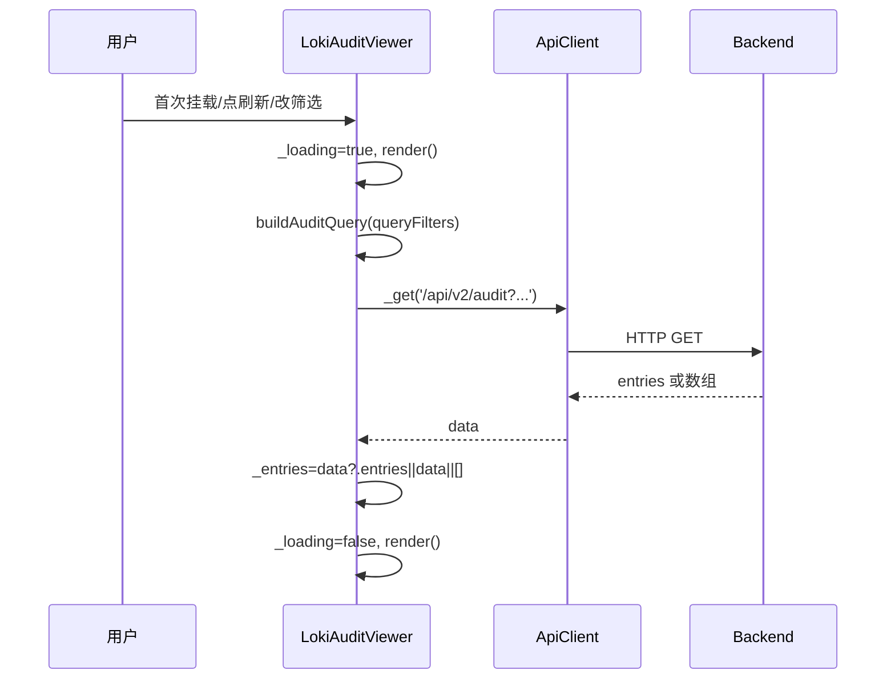

# audit_and_compliance 模块文档

## 模块定位与设计目标

`audit_and_compliance` 是 Dashboard UI 组件体系中“Administration and Infrastructure Components”下的审计可视化子模块，当前核心实现是 `dashboard-ui.components.loki-audit-viewer.LokiAuditViewer`（自定义元素 `<loki-audit-viewer>`）。这个模块存在的核心原因并不是“再做一个表格组件”，而是把后端审计能力（审计记录查询 + 审计链完整性校验）转化为运维与治理场景可直接消费的交互界面：开发者、SRE、合规负责人可以在同一入口完成审计浏览、筛选、刷新和完整性确认。

从设计上看，它遵循 Dashboard UI 统一范式：继承 `LokiElement` 获得主题与基础可访问性能力，通过 `getApiClient` 访问后端 API，通过 Shadow DOM 封装样式并以属性驱动行为（`api-url`、`limit`、`theme`）。因此它既能作为独立 Web Component 嵌入任意页面，也能无缝融入现有 Loki 控制台。

---

## 在系统中的架构位置

```mermaid
graph TD
    UIUser[运维/审计用户] --> A[loki-audit-viewer\nLokiAuditViewer]
    A --> B[LokiElement\n主题/基础生命周期]
    A --> C[getApiClient]
    C --> D[/api/v2/audit]
    C --> E[/api/v2/audit/verify]
    D --> F[Dashboard Backend\nAuditQueryParams等契约]
    E --> F
    F --> G[src.audit.log.AuditLog\n审计链与日志]
```

上图体现了该模块的边界：`LokiAuditViewer` 不负责“生成审计记录”或“执行链验证算法”，而是负责发起查询与验证请求并将结果可视化。真实审计语义和完整性判定在后端与 `Audit` 模块中完成，前端只做状态呈现与最小限度的数据适配。

如果你需要理解后端审计链本体，请直接参考 [Audit.md](Audit.md)；如果你需要理解 API 层参数模型，请参考 [Dashboard Backend.md](Dashboard%20Backend.md) 与 [api_surface_and_transport.md](api_surface_and_transport.md)。

---

## 核心组件详解：`LokiAuditViewer`

### 1）生命周期与状态模型

`LokiAuditViewer` 继承 `LokiElement`，所以在 `connectedCallback()` 中先走基类逻辑（主题监听、键盘处理、初次渲染），再执行本组件的 `_setupApi()` 与 `_loadData()`。这意味着组件首次挂载就会主动拉取审计数据。

组件内部状态主要包括：

- `_loading`：是否正在加载审计列表。
- `_error`：加载失败错误信息（渲染为 error banner）。
- `_entries`：当前审计条目数组。
- `_filters`：筛选条件（`action`、`resource`、`dateFrom`、`dateTo`）。
- `_verifyResult`：完整性验证返回值。
- `_verifying`：完整性验证进行中状态。

它采用“状态驱动重渲染”策略：每次异步动作前后都更新状态并调用 `render()`，因此 UI 行为可预测，但也意味着短时间内会有多次 `innerHTML` 重建。

### 2）属性契约与响应行为

```javascript
LokiAuditViewer.observedAttributes = ['api-url', 'limit', 'theme']
```

组件通过 `attributeChangedCallback` 处理属性变化：

- `api-url` 变化时，如果 API 客户端已存在，会更新 `baseUrl` 并触发 `_loadData()`。
- `limit` 变化时直接重新拉取数据。
- `theme` 变化时调用 `_applyTheme()`（来自 `LokiElement`）。

`limit` 通过 getter 解析为整数，默认 50；setter 会回写 attribute，保持 DOM 属性与内部行为一致。

### 3）数据加载流程 `_loadData()`



加载逻辑有两个兼容点值得注意：

第一，它能兼容两种响应结构：`{ entries: [...] }` 或直接 `[...]`。这降低了前后端演进中的耦合风险。第二，它将查询参数统一通过 `buildAuditQuery` 生成，自动忽略空值，避免发送无意义参数。

### 4）完整性验证流程 `_verifyIntegrity()`

```mermaid
flowchart TD
    A[点击 Verify Integrity] --> B[设置 _verifying=true 并清空旧结果]
    B --> C[GET /api/v2/audit/verify]
    C --> D{请求成功?}
    D -- 是 --> E[_verifyResult=result]
    D -- 否 --> F[_verifyResult={valid:false,error:err.message}]
    E --> G[_verifying=false render()]
    F --> G
```

验证结果展示逻辑是“宽松默认安全提示”：只有当 `valid === false` 才视为失败，否则显示成功。换句话说，后端若不返回 `valid` 字段，前端会按“通过”显示，这在接口未严格约束时是一个潜在风险点（见后文“边界与限制”）。

### 5）渲染与事件绑定

组件每次 `render()` 都会：

1. 用 `shadowRoot.innerHTML = ...` 重建模板（含过滤器、按钮、表格、错误区）。
2. 调用 `_attachEventListeners()` 重新绑定点击与变更事件。

这种方式实现简单直观，但会带来两个工程影响：

- 频繁重渲染时会重复创建/销毁节点；
- 若未来新增复杂子组件，建议改成局部更新或事件委托以控制成本。

目前输入框采用 `change` 事件，不是 `input` 事件，因此用户只有在失焦或确认后才触发筛选请求，避免了每键一次 API 调用。

---

## 工具函数说明

### `formatAuditTimestamp(timestamp)`

该函数把 ISO 时间字符串转为 `toLocaleString` 输出。若传入空值返回 `--`；若日期解析异常则回退到原始字符串。它的目标是“尽量可展示而不抛错”，属于容错型格式化函数。

### `buildAuditQuery(filters)`

该函数遍历 filter 对象，将非空键值写入 `URLSearchParams` 并返回带前缀 `?` 的 query string。空值会被省略，可避免后端出现“空字符串条件”导致的歧义过滤。

---

## 与后端/SDK 契约的对齐说明（非常重要）

从当前代码可见，前端请求参数使用的是：

- `action`
- `resource`
- `date_from`
- `date_to`
- `limit`

而 `Dashboard Backend` 中 `AuditQueryParams` 组件显示字段为：

- `start_date` / `end_date`
- `resource_type`
- `resource_id`
- `user_id`
- `success`
- `limit` / `offset`

这意味着存在“字段命名不完全一致”的现实风险：如果后端没有做别名兼容，前端过滤器会出现“看起来可用、实际不生效”的问题。生产环境建议明确以下策略之一：

1. 在后端兼容 `resource`→`resource_type`、`date_from`→`start_date`、`date_to`→`end_date`；
2. 或在前端统一改用后端官方参数名；
3. 并在 API 文档与 SDK 类型中同步更新。

可交叉参考：
- TS SDK 审计参数：[TypeScript SDK.md](TypeScript%20SDK.md)
- Python SDK 审计条目：[Python SDK.md](Python%20SDK.md)

---

## 使用方式

### 声明式使用

```html
<loki-audit-viewer
  api-url="http://localhost:57374"
  limit="100"
  theme="dark">
</loki-audit-viewer>
```

### 脚本式使用

```javascript
const viewer = document.createElement('loki-audit-viewer');
viewer.setAttribute('api-url', 'https://your-control-plane.example.com');
viewer.limit = 200;
document.body.appendChild(viewer);
```

### 与租户切换联动（扩展示例）

在多租户场景下，通常会与 `loki-tenant-switcher` 协同使用。`LokiAuditViewer` 本身不内建租户参数输入，你可以在外层监听租户切换事件后，更新 `api-url` 或封装网关参数：

```javascript
tenantSwitcher.addEventListener('tenant-changed', (e) => {
  const { tenantId } = e.detail;
  // 示例：将租户上下文编码进网关URL或由代理自动注入Header
  auditViewer.setAttribute('api-url', `/tenant/${tenantId}/proxy`);
});
```

---

## 可扩展性与二次开发建议

如果你需要把该模块升级为“合规工作台”而非仅“审计浏览器”，建议沿以下路径扩展：

- 在不破坏现有 API 的前提下增加更多过滤维度（`user_id`、`success`、`resource_id`、`offset`/分页）。
- 为 `_onFilterChange` 增加 debounce，减少高频网络请求。
- 引入行级详情面板，展示 `metadata`、链哈希、请求来源等信息。
- 将 `_verifyResult` 显示从单次横幅升级为可追溯验证历史。

如果采用继承方式扩展，应优先覆写 `_loadData()` 与 `render()`，并保留 `_escapeHtml()` 的输出防护，避免引入 XSS 风险。

---

## 边界条件、错误处理与已知限制

```mermaid
flowchart LR
    A[网络异常/后端500] --> B[_error banner]
    C[verify接口失败] --> D[显示TAMPERED+error]
    E[返回结构非预期] --> F[data?.entries||data||[] 容错]
    G[参数名不一致] --> H[过滤条件可能静默失效]
```

需要特别关注以下行为：

- 组件仅在 `_loadData()` 失败时设置 `_error`，完整性验证失败不写 `_error`，而是写入 `_verifyResult`。这会造成“列表正常但验证失败”的双通道提示，需要在产品文案上保持一致。
- `_verifyResult.valid !== false` 即判定成功，接口若缺失 `valid` 会被当成成功。
- `formatAuditTimestamp` 使用浏览器本地时区显示，同一条记录在不同地区可能显示不同本地时间。
- `render()` 全量重绘导致滚动位置、输入焦点管理较脆弱（当前过滤器用 `change` 事件，影响较小）。
- `_escapeHtml()` 仅处理 `& < > "`，如果将来插入更多上下文（例如 URL、属性值、富文本）需要更严格编码策略。

---

## 运维与配置建议

在生产环境落地时，建议把该模块当成“审计可视化终端”来治理：

- API 访问层面启用鉴权与最小权限，避免审计数据被未授权读取。
- 对 `/api/v2/audit/verify` 设置合理速率限制，防止高频验证操作冲击后端。
- 明确 CORS 策略与反向代理头，保证 `api-url` 可在浏览器安全上下文中访问。
- 为审计查询接口提供分页与索引，以避免大规模日志下的 UI 首屏阻塞。

---

## 与其他文档的关系

为避免重复，本模块文档不展开以下内容，请按需跳转：

- UI 基类与主题体系：[`Core Theme.md`](Core%20Theme.md)、[`Unified Styles.md`](Unified%20Styles.md)
- 所属父模块：[`Administration and Infrastructure Components.md`](Administration%20and%20Infrastructure%20Components.md)
- 后端接口与契约：[`Dashboard Backend.md`](Dashboard%20Backend.md)、[`api_surface_and_transport.md`](api_surface_and_transport.md)
- 审计后端机制：[`Audit.md`](Audit.md)

以上文档结合阅读，可以形成从“审计链生成”到“审计链可视化验证”的完整闭环认知。
