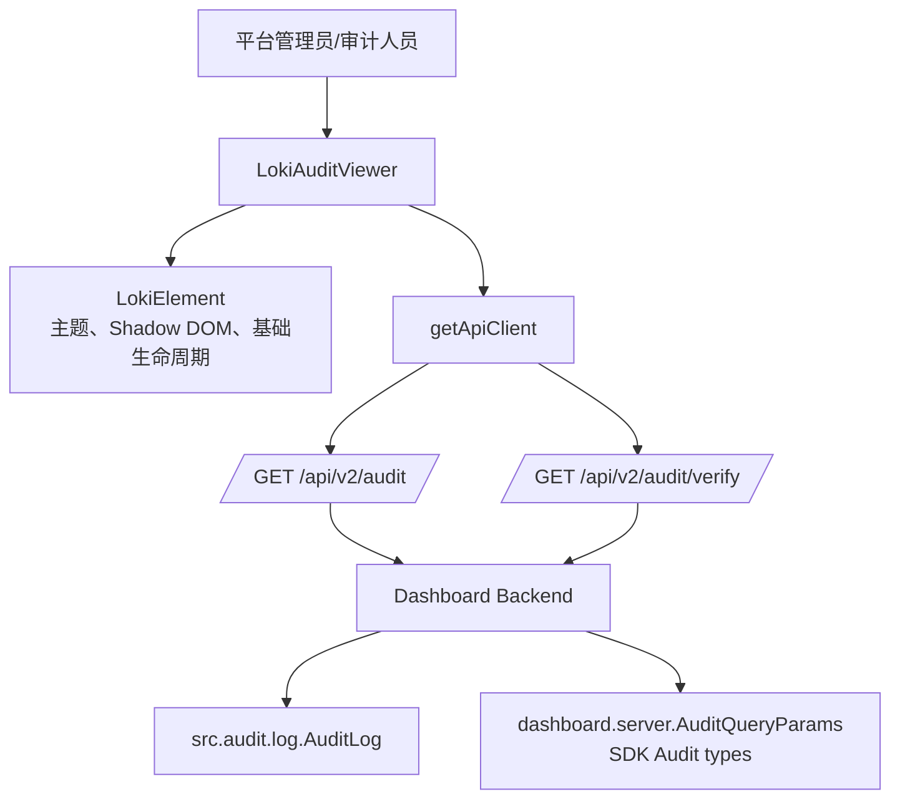
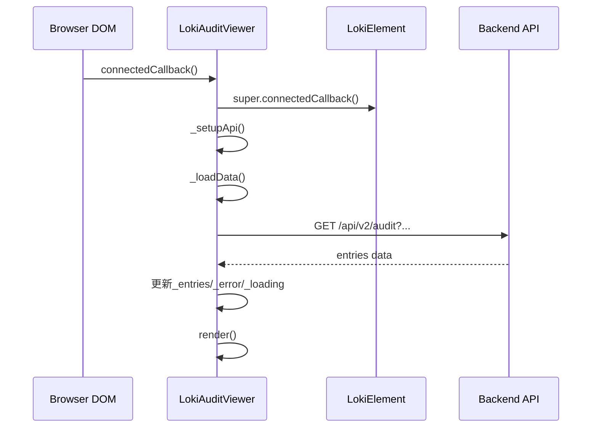
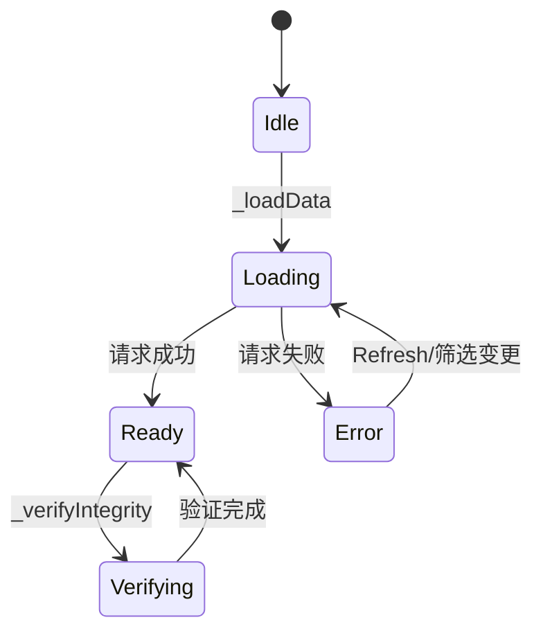
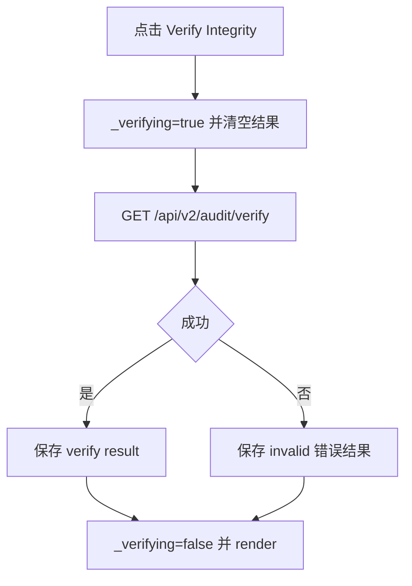
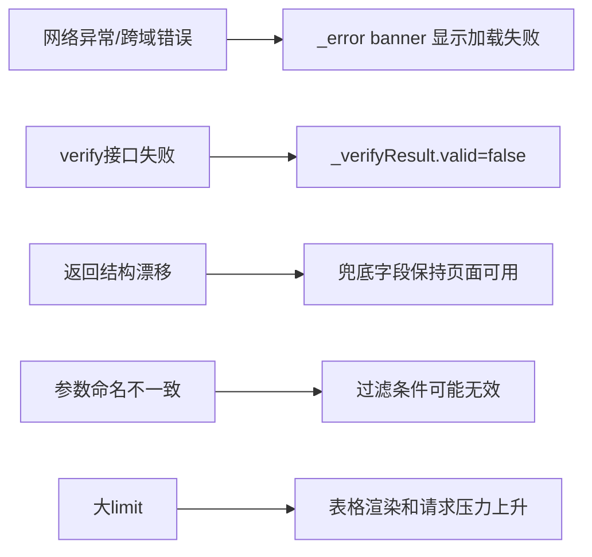

# audit_compliance 模块文档

## 模块简介与设计动机

`audit_compliance` 是 Dashboard UI 在“Administration and Infrastructure Components”中的审计与合规可视化模块，当前核心实现为 `dashboard-ui.components.loki-audit-viewer.LokiAuditViewer`（Web Component 标签：`<loki-audit-viewer>`）。这个模块的价值不在于“产生审计日志”，而在于把后端已经存在的审计数据与完整性校验能力，转换成一个可操作、可筛选、可快速验证的前端治理界面。

在一个有多租户、任务编排、策略控制和运行时变更的系统里，审计能力不仅用于事后排查，更是日常合规运营的基础设施。开发者和运维人员需要快速回答：谁在什么时候做了什么操作、操作是否成功、链路是否被篡改。`LokiAuditViewer` 的设计就是围绕这些问题展开：挂载即加载、过滤即查询、点击即验证，并通过状态化渲染将风险反馈直接暴露到 UI。

从模块边界看，本模块是典型的“控制面展示层（UI control plane）”。它不实现审计链算法，不落盘日志，不做策略裁决；这些职责分别由后端 API 与 `Audit` 子系统承接。这个分层降低了 UI 复杂度，也让审计算法可以独立演进。

---

## 系统定位与依赖关系



这个依赖图说明了一个关键事实：`LokiAuditViewer` 是“审计能力的消费者”，不是“审计能力的拥有者”。它消费两个后端能力：审计列表查询和审计链校验。后端再进一步依赖 `AuditLog` 的链式哈希验证逻辑（`verifyChain()`）来给出“是否篡改”的结论。

如果你需要理解后端审计链结构（如 `previousHash`、`hash`、`GENESIS`、`flush` 行为），请阅读 [Audit.md](Audit.md)。如果你需要理解 Dashboard API 面向外部的参数与响应契约，请参考 [Dashboard Backend.md](Dashboard%20Backend.md) 与 [api_surface_and_transport.md](api_surface_and_transport.md)。

---

## 核心组件：`LokiAuditViewer`

### 类职责概览

`LokiAuditViewer` 负责四件事：初始化 API 客户端、按过滤条件加载审计数据、触发完整性验证、把状态渲染成可操作 UI。它继承自 `LokiElement`，因此默认拥有主题样式基线和 Web Component 生命周期能力。

### 可观察属性与公开行为

组件监听 `api-url`、`limit`、`theme` 三个属性。

- `api-url`：后端基地址。未提供时回退到 `window.location.origin`。
- `limit`：每次查询的最大条目数，默认 50。
- `theme`：主题名，交由基类主题机制处理。

`limit` 同时提供 getter/setter。setter 会回写 attribute，因此 DOM 属性变化与内部状态保持同步。

### 生命周期与执行流程



组件挂载后自动发起查询。属性变更时，`attributeChangedCallback` 会做差异处理：`api-url` 变更后更新 client baseUrl 并重查，`limit` 变更重查，`theme` 变更重新应用主题。这个行为简单直接，但意味着属性抖动会触发额外请求。

### 内部状态模型



状态字段包括 `_loading`、`_error`、`_entries`、`_filters`、`_verifyResult`、`_verifying`。该组件通过“状态变更 -> `render()`”驱动 UI，逻辑可预测，代价是每次都全量重绘 Shadow DOM。

---

## 关键函数详解

### `formatAuditTimestamp(timestamp)`

该函数把 ISO 时间戳转为本地化字符串，显示到秒。它是展示层容错工具：当值为空时返回 `--`，当解析异常时回退原始字符串而非抛错。函数无副作用。

```javascript
formatAuditTimestamp(timestamp: string | null): string
```

### `buildAuditQuery(filters)`

该函数遍历过滤对象并构建 `URLSearchParams`。空值会被自动忽略，最终返回 `?key=value...` 或空串。函数无副作用。

```javascript
buildAuditQuery(filters: Record<string, unknown>): string
```

### `_loadData()`

`_loadData()` 是列表查询核心路径。执行顺序是：置 `_loading=true` 并先渲染 loading -> 组装查询参数 -> 调用 `this._api._get('/api/v2/audit' + query)` -> 兼容解析响应 -> 捕获错误并写入 `_error` -> `_loading=false` 后再次渲染。

它兼容两类返回形态：`{ entries: [...] }` 与直接数组 `[...]`，这在后端版本过渡期非常实用。

### `_verifyIntegrity()`



这个方法独立于 `_loadData()`，因此会出现“列表正常但验证失败”的状态组合。这不是 bug，而是两个不同后端能力的独立反馈。

### `_escapeHtml(str)`

用于渲染前最小化 HTML 转义（`& < > "`），覆盖 action/resource/user/status/error 等字符串输出。它是组件抵御注入的最后一层防线，不应在二次开发中移除。

### `_getStatusClass(status)`

将状态文本映射为视觉语义类：`success|ok|pass` -> `status-success`，`failure|error|fail` -> `status-failure`，其余归入 warning。这个宽松映射可兼容后端枚举差异。

### `render()` 与 `_attachEventListeners()`

`render()` 每次使用 `shadowRoot.innerHTML` 全量输出模板，然后调用 `_attachEventListeners()` 重新绑定按钮和过滤器事件。当前过滤器监听 `change` 事件而非 `input`，意味着用户提交或失焦后才触发查询，可减少请求风暴。

---

## 数据契约对齐与字段映射

### 前后端查询参数差异（高优先级）

前端组件当前发送参数：`action`、`resource`、`date_from`、`date_to`、`limit`。而 `dashboard.server.AuditQueryParams` 显示的官方参数包含 `start_date`、`end_date`、`resource_type`、`resource_id`、`user_id`、`success`、`limit`、`offset`。

这意味着如果后端没有做别名兼容，部分过滤条件可能“静默失效”。建议将字段命名收敛为同一套规范，或者明确在后端做兼容映射。

### 列表字段兼容策略

组件渲染层存在多个兜底：

- 资源字段：`entry.resource || entry.resource_type || '--'`
- 用户字段：`entry.user || entry.actor || '--'`
- 状态字段：`entry.status || 'unknown'`

这使组件能适配不同历史版本返回格式，但也掩盖了契约漂移问题。生产环境仍建议固定 schema，并在 SDK 中同步。

### 与 SDK 类型的关系

TS SDK `AuditEntry` 倾向 `action/resource_type/success` 语义，Python SDK 也类似；`AuditVerifyResult` 通常包含 `valid` 和 `entries_checked`。而 UI 组件目前对 verify 结果只强依赖 `valid`，其余字段不会展示。若要提升可审计性，建议把 `entries_checked`、`brokenAt`、`error` 等信息结构化展示。

参考文档：

- [TypeScript SDK.md](TypeScript%20SDK.md)
- [Python SDK.md](Python%20SDK.md)

---

## 使用方式与配置实践

### 声明式嵌入

```html
<loki-audit-viewer
  api-url="http://localhost:57374"
  limit="100"
  theme="dark">
</loki-audit-viewer>
```

### 脚本式创建

```javascript
const viewer = document.createElement('loki-audit-viewer');
viewer.setAttribute('api-url', 'https://control.example.com');
viewer.limit = 200;
viewer.setAttribute('theme', 'light');
document.body.appendChild(viewer);
```

### 多租户场景联动示例

```javascript
tenantSwitcher.addEventListener('tenant-changed', (e) => {
  const { tenantId } = e.detail;
  // 由网关或反向代理注入 tenant 上下文
  viewer.setAttribute('api-url', `/tenant/${tenantId}/proxy`);
});
```

### 主题与样式

组件样式建立在 `LokiElement.getBaseStyles()` + 局部 CSS 变量之上。若需统一视觉系统，请使用统一主题令牌，而不是直接修改内部 class。

相关文档：

- [Core Theme.md](Core%20Theme.md)
- [Unified Styles.md](Unified%20Styles.md)

---

## 可扩展性设计与二次开发建议

若你要把该模块从“审计浏览器”升级为“合规工作台”，推荐在保持现有 API 兼容的前提下渐进扩展。

首先可以补齐过滤维度，例如 `user_id`、`success`、`resource_id`、`offset`，并配合分页 UI 解决大数据量场景。其次可以增加行详情抽屉，展示 metadata、链哈希、请求来源和关联 Run/Task。再进一步，可以将校验结果持久化并形成“验证历史时间线”，支持审计报告导出。

从工程实现上，建议把 `_loadData` 与 `_verifyIntegrity` 抽象为可替换的数据提供器，便于接入 mock、离线模式或不同 API 网关。若频繁刷新成为性能瓶颈，可将全量重绘改为局部 patch 或事件委托。

---

## 边界条件、错误处理与已知限制



这个模块已做了基础容错，但仍有几个需要特别关注的行为约束。

第一，`verify` 结果判定逻辑是“只有 `valid === false` 才判失败”，也就是缺少 `valid` 字段时默认视为通过。这个策略对弱契约后端更友好，但对安全治理并不严格。建议改为显式布尔校验。

第二，筛选输入使用 `change` 事件，用户输入过程中不会实时查询。这是为了减少请求数，但在“即时过滤”预期下会让用户感知延迟。

第三，组件未内置请求取消机制。连续快速修改属性或过滤条件时，可能发生请求竞态，后返回的旧请求覆盖新结果。若场景中并发较高，建议引入 AbortController 或请求序号防抖。

第四，当前表格只展示有限字段，不包含后端链结构关键值（如 hash、previousHash、seq）。这对普通运营足够，但不足以支撑深度取证。

第五，`limit` 无上限保护。如果外部传入超大值，可能导致后端负载与前端渲染压力异常升高。建议在组件和服务端双侧设置阈值。

---

## 与其他模块的协作关系

`audit_compliance` 通常与以下模块协同出现：

- 与 `security_management`（如 `loki-api-keys`、`loki-tenant-switcher`）共同构成治理与访问控制控制台。
- 与 `notification_operations_center`（告警、迁移、治理面板）形成事件发现 -> 审计追溯的闭环。
- 与 `Dashboard Backend` 的 API 契约共同决定可查询维度和筛选准确性。
- 与 `Audit` 模块共同决定完整性验证可信度。

建议在跨模块文档中避免重复定义审计链算法细节，统一引用 [Audit.md](Audit.md)。

---

## 维护者检查清单（发布前）

- 确认 `/api/v2/audit` 对当前查询参数是否做了别名兼容。
- 确认 `/api/v2/audit/verify` 返回体包含明确 `valid` 布尔值。
- 确认大 `limit` 已被前后端双重限制。
- 确认错误文案可区分“列表加载失败”和“完整性校验失败”。
- 确认二次开发没有移除 `_escapeHtml`。

完成以上检查，`audit_compliance` 模块即可在治理场景中提供稳定、可读、可追溯的审计体验。
