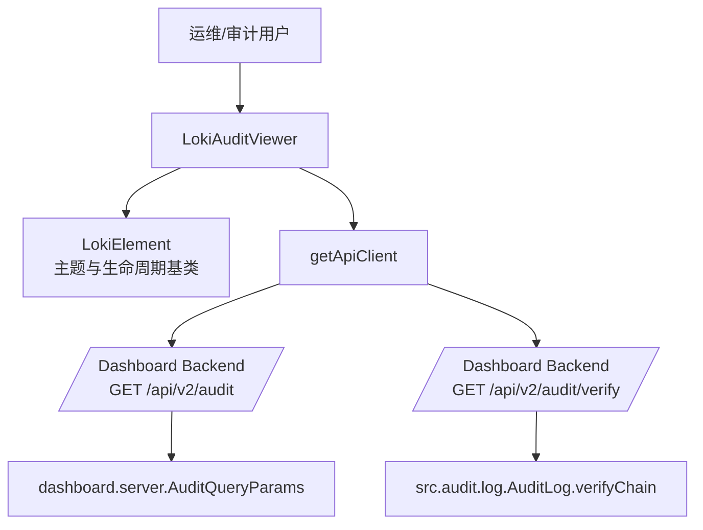
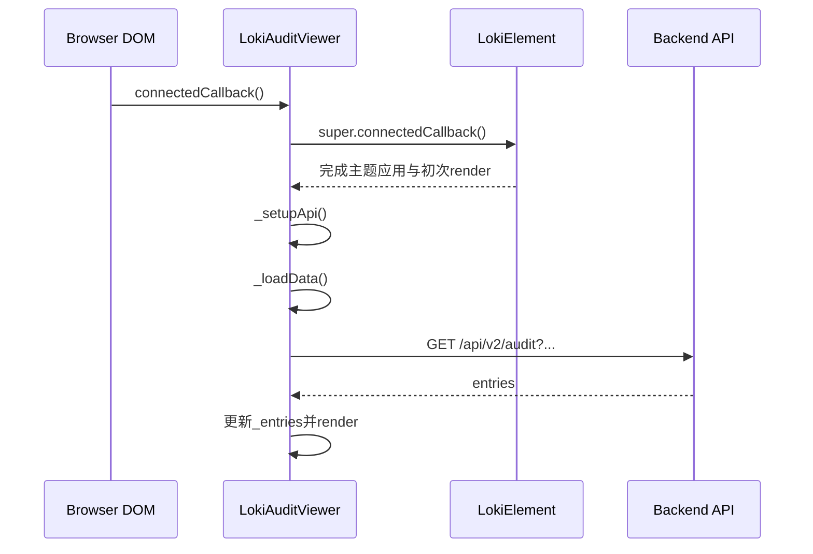
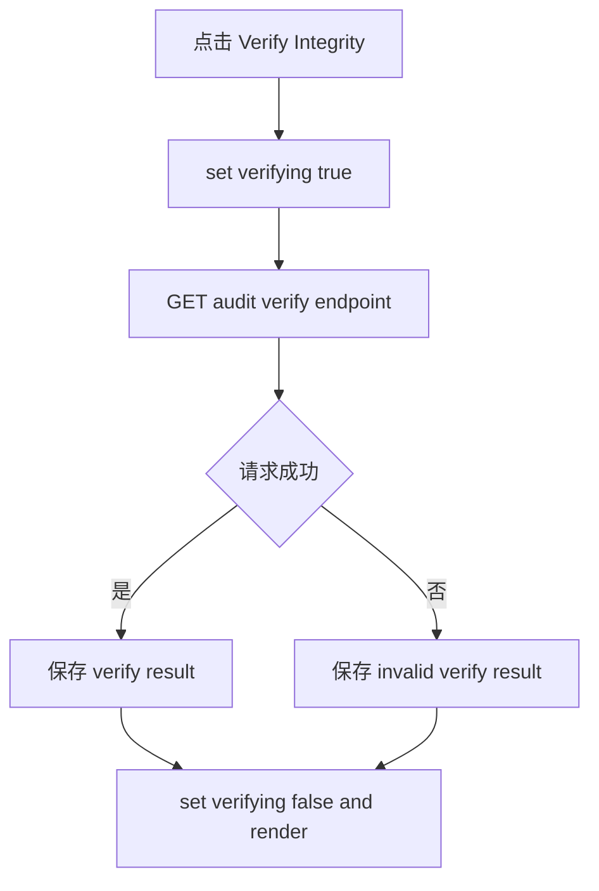
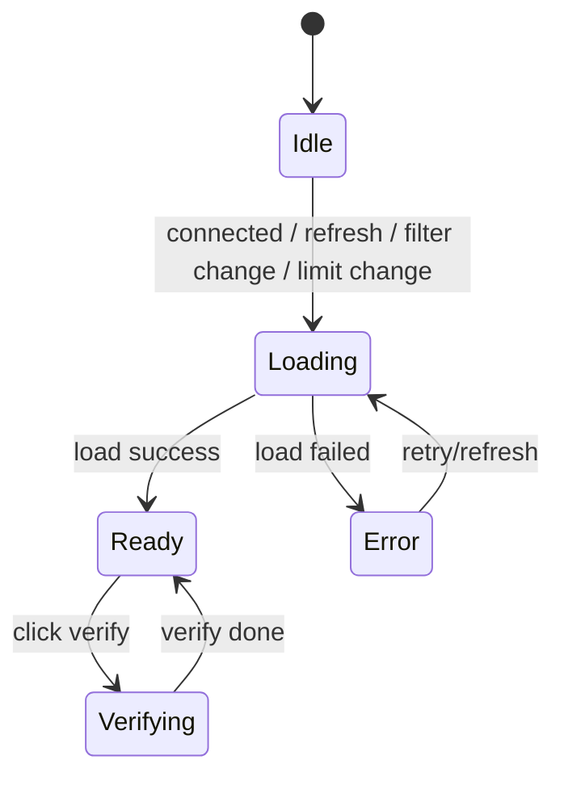
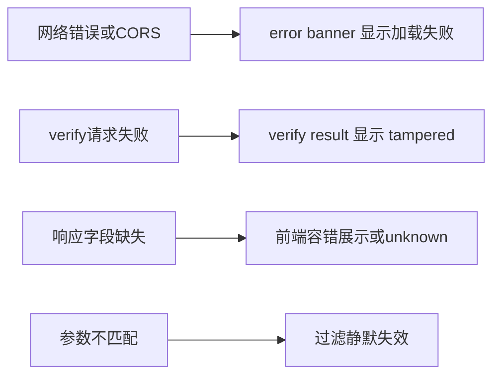

# audit_compliance_viewer 模块文档

## 1. 模块概述：它做什么、为什么存在

`audit_compliance_viewer` 是 Dashboard UI 中“Administration and Infrastructure Components”下的审计与合规可视化子模块，核心实现是 `dashboard-ui.components.loki-audit-viewer.LokiAuditViewer`（自定义元素 `<loki-audit-viewer>`）。它的目标不是实现审计存储或链式签名算法，而是把后端审计能力变成可直接操作的前端控制面：管理员可以筛选审计日志、快速刷新数据、执行审计链完整性验证，并在一个统一组件中完成初步合规核查。

该模块存在的设计动机很明确：在多租户 AI 平台中，“可运行任务”并不等于“可治理系统”。审计能力需要一个低门槛入口，支持安全排障（谁在什么时间做了什么）、合规留痕（操作可追溯）、以及篡改检测（verify endpoint）。`LokiAuditViewer` 通过 Web Component 形态提供了可嵌入、可主题化、低耦合的交付方式，适合嵌入总控台、项目详情页或租户运营页。

---

## 2. 模块在系统中的位置



上图体现了边界分工：前端模块负责查询与展示；后端负责参数解释、审计链校验与结果生成。也就是说，这个模块是“审计控制面（control plane UI）”，不是“审计引擎（data plane logic）”。

从模块树角度，它与 `loki-api-keys`、`loki-tenant-switcher`、`loki-notification-center` 同属于管理基础设施组件族；与 `Dashboard Backend` 的 `AuditQueryParams` 契约、`Audit` 子系统的 `AuditLog` 强关联。

---

## 3. 核心组件与函数详解

### 3.1 `formatAuditTimestamp(timestamp)`

该函数用于把审计条目的时间戳转换为本地化显示字符串。它使用 `Date` + `toLocaleString`，显示到秒级，适合运维排障场景的时间阅读。

**签名**

```javascript
formatAuditTimestamp(timestamp: string | null): string
```

**参数与返回值**

- 参数 `timestamp`：ISO 时间字符串或空值。
- 返回：可展示字符串。空值返回 `"--"`；解析失败时返回原始字符串。

**行为与副作用**

函数无外部副作用，不修改全局状态；它是纯展示层容错函数。

---

### 3.2 `buildAuditQuery(filters)`

该函数把过滤条件对象转换为 query string，并自动忽略空值，避免把无意义参数发送到后端。

**签名**

```javascript
buildAuditQuery(filters: Record<string, unknown>): string
```

**参数与返回值**

- 参数 `filters`：键值对对象（如 `limit`、`action`、`date_from`）。
- 返回：以 `?` 开头的查询字符串；若无有效参数则返回空字符串。

**行为与副作用**

无副作用；使用 `URLSearchParams` 保证编码正确性。

---

### 3.3 `LokiAuditViewer`（核心类）

`LokiAuditViewer` 继承 `LokiElement`，因此天然具备 Shadow DOM、主题注入、主题切换监听和基础键盘处理能力。组件本身负责管理四类状态：数据加载状态、错误状态、过滤状态、完整性验证状态。

#### 3.3.1 可观察属性与公开接口

- `api-url`：后端基础地址，默认 `window.location.origin`。
- `limit`：最多拉取条目数，默认 50。
- `theme`：主题名称（如 `light` / `dark`）。

`limit` 提供 getter/setter：setter 写回 attribute，attribute 变化会触发重新拉取数据。

#### 3.3.2 生命周期流程



这个流程里最关键的点是：组件挂载即发请求，且每次属性变化（`api-url`/`limit`）都可能触发重新查询。

#### 3.3.3 数据加载 `_loadData()`

`_loadData()` 的主要步骤是：设置 `_loading` -> 渲染 loading UI -> 拼接过滤参数 -> 请求 `/api/v2/audit` -> 兼容解析数据结构 -> 处理异常 -> 结束后重渲染。

它兼容两种返回结构：`{ entries: [...] }` 或直接 `[...]`。这降低了前后端版本漂移时的失败概率。

#### 3.3.4 完整性验证 `_verifyIntegrity()`



该流程与列表加载分离，因此“日志加载成功但校验失败”会同时出现，这是合理行为：查询通道和校验通道语义不同。

#### 3.3.5 渲染与事件绑定机制

组件采用全量 `innerHTML` 重绘，每次 `render()` 后调用 `_attachEventListeners()` 重新挂接事件。这种方案简单直接，适合轻量组件，但对高频刷新场景的性能不如虚拟 DOM / 局部更新。

已绑定的交互包括：

- `Verify Integrity` 按钮 -> `_verifyIntegrity()`
- `Refresh` 按钮 -> `_loadData()`
- 四个过滤输入框 `change` 事件 -> `_onFilterChange()`

注意它使用 `change` 而非 `input`，意味着用户提交/失焦后才发起查询，有意减少请求风暴。

#### 3.3.6 安全输出与状态展示

`_escapeHtml()` 对 `& < > "` 做转义，用于渲染 action/resource/user/status/error，降低 XSS 风险。状态标签通过 `_getStatusClass()` 映射为 success/failure/warning，兼容 `ok/pass/error/fail` 等常见后端枚举变体。

---

## 4. 组件内部状态机



这个状态机说明了该组件是典型的“读多写少”面板组件：主要时间在 `Ready`，用户动作触发短暂 `Loading`/`Verifying`。

---

## 5. 与后端契约的关键对齐点

### 5.1 参数命名差异（高优先级关注）

前端当前发送：`action`、`resource`、`date_from`、`date_to`、`limit`。  
而 `dashboard.server.AuditQueryParams` 展示的字段是：`start_date`、`end_date`、`resource_type`、`resource_id`、`user_id`、`success`、`limit`、`offset`。

这意味着如果后端没有做别名兼容，前端某些过滤器可能“看似可用，实际无效”。建议统一策略：

1. 后端做兼容映射（短期稳态）。
2. 前端改为官方字段（长期收敛）。
3. 在 SDK 类型里同步约束（防止生态分叉）。

### 5.2 返回结构兼容

组件允许两种结构：`{ entries }` 或数组本体。建议后端最终收敛为明确 schema，并在 OpenAPI/SDK 中固定，减少“宽松容错”带来的隐性歧义。

---

## 6. 使用与配置

### 6.1 基础使用

```html
<loki-audit-viewer
  api-url="http://localhost:57374"
  limit="100"
  theme="dark">
</loki-audit-viewer>
```

### 6.2 脚本方式

```javascript
const el = document.createElement('loki-audit-viewer');
el.setAttribute('api-url', 'https://control.example.com');
el.limit = 200;
document.body.appendChild(el);
```

### 6.3 与租户上下文联动（推荐模式）

```javascript
tenantSwitcher.addEventListener('tenant-changed', (e) => {
  const { tenantId } = e.detail;
  // 由网关或代理注入租户上下文
  auditViewer.setAttribute('api-url', `/tenant/${tenantId}/proxy`);
});
```

### 6.4 主题配置

该组件复用 `LokiElement.getBaseStyles()` 令牌，可通过 CSS Variables 覆盖视觉风格。主题系统细节请参考 [Core Theme.md](Core%20Theme.md) 与 [Unified Styles.md](Unified%20Styles.md)。

---

## 7. 扩展指南

如果你要扩展为“合规工作台”而非仅浏览器，优先从这三点入手：

- 扩展过滤器：增加 `user_id`、`success`、`resource_id`、分页 `offset`。
- 引入请求防抖：在 `_onFilterChange` 外包一层 debounce。
- 增加行级详情抽屉：展示 `metadata`、hash、previousHash、请求来源等深度审计字段。

扩展示例（覆写加载逻辑）：

```javascript
class ExtendedAuditViewer extends LokiAuditViewer {
  async _loadData() {
    await super._loadData();
    // custom post-process，例如本地聚合统计
  }
}
customElements.define('extended-audit-viewer', ExtendedAuditViewer);
```

---

## 8. 边界条件、错误处理与已知限制



关键注意事项：

- `_verifyResult.valid !== false` 会被当作验证通过；若后端未返回 `valid` 字段，可能出现误判“通过”。
- 渲染为全量重绘，极端高频刷新时性能与焦点体验会下降。
- 时间显示使用浏览器本地时区，不同地区会看到不同本地时间。
- `_escapeHtml()` 是基础防护，不等价于完整内容安全策略；若引入富文本需升级策略。
- 当前无内建分页，超大审计数据量时需要后端分页与索引支持。

---

## 9. 测试与运维建议

建议至少覆盖以下测试场景：

- 初次加载成功/失败。
- 过滤器分别生效与组合生效。
- verify 成功/失败/返回不完整字段。
- `api-url`、`limit` 动态变化触发重载。
- XSS 载荷在 action/resource/user 字段中的渲染安全性。

运维侧建议为 `/api/v2/audit/verify` 加速率限制与权限控制，并对 `/api/v2/audit` 建立索引与分页策略，以免审计面板影响主系统吞吐。

---

## 10. 相关文档（避免重复）

- 父级模块：[`Administration and Infrastructure Components.md`](Administration%20and%20Infrastructure%20Components.md)
- 后端 API 契约：[`Dashboard Backend.md`](Dashboard%20Backend.md)、[`api_surface_and_transport.md`](api_surface_and_transport.md)
- 审计后端机制：[`Audit.md`](Audit.md)
- UI 基类与主题：[`Core Theme.md`](Core%20Theme.md)、[`Unified Styles.md`](Unified%20Styles.md)
- 相邻组件参考：[`loki-audit-viewer.md`](loki-audit-viewer.md)
