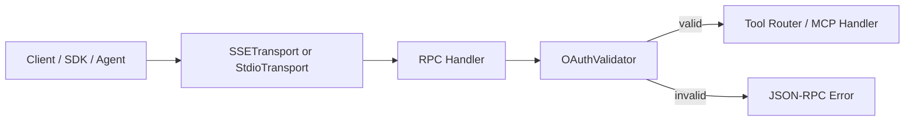
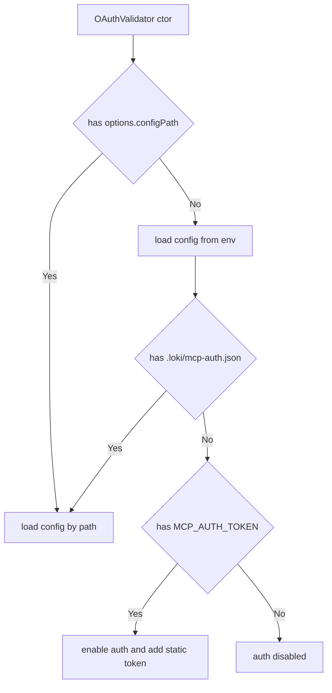
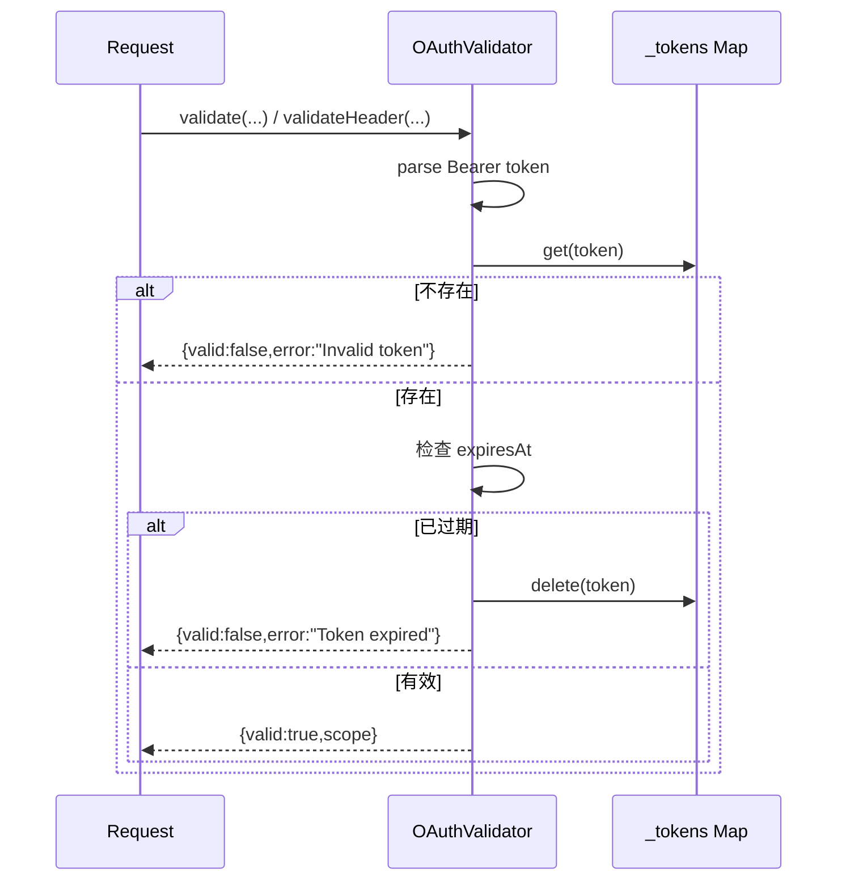
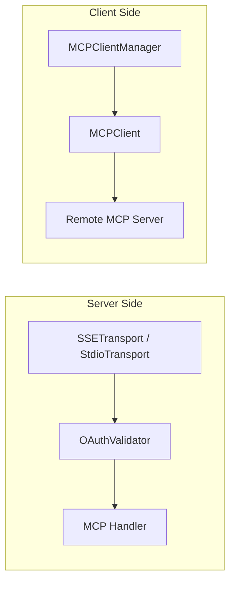

# auth_validation 模块文档

`auth_validation` 模块是 MCP Protocol 安全层中的最小认证实现，核心组件为 `src.protocols.auth.oauth.OAuthValidator`。这个模块存在的主要原因并不是“完整实现 OAuth 服务器”，而是为 MCP 服务提供一个**可插拔、可渐进启用**的访问控制门禁：当系统部署在本地开发或历史兼容场景时，可以零配置运行；当需要安全边界时，又可以通过配置文件或环境变量立即启用 Bearer Token 校验。

从设计上看，它强调三件事：第一，默认兼容旧系统（未配置时不拦截请求）；第二，验证路径要足够简单，能够同时服务 JSON-RPC 请求体元信息（`params._meta.authorization`）和 HTTP Header（SSE 场景）；第三，保留向 OAuth 2.1 + PKCE 规范靠拢的接口能力（例如 `validatePKCE`、client 注册结构），即使当前版本还没有把完整授权码流程接起来。

---

## 1. 模块定位与系统上下文

在 MCP 协议栈中，`OAuthValidator` 位于传输层与请求处理器之间，承担“请求是否可继续进入工具调用链”的判定职责。它不负责用户登录页面、OAuth 授权重定向、外部 IdP 对接，也不承担 token 签发中心角色；它负责的是**本地可验证 token 集合**与请求中的凭证比对。



上图说明了它在请求路径中的“闸门”角色。对于 SSE 入口，通常会优先用 `Authorization` Header 校验；对于 JSON-RPC 内部调用，通常使用 `params._meta.authorization`。认证通过后，后续路由、工具分发、断路器控制等机制才会被触发。

关于传输和调用编排的详细行为，请参考：
- [transport_adapters.md](transport_adapters.md)
- [client_orchestration.md](client_orchestration.md)
- [resilience_control.md](resilience_control.md)
- [MCP Protocol.md](MCP%20Protocol.md)

---

## 2. 核心组件：`OAuthValidator`

### 2.1 内部状态模型

`OAuthValidator` 维护三类核心内存状态：

- `_tokens: Map<string, { scope, expiresAt }>`：token 到权限与过期时间的映射。
- `_clients: Map<string, { secret, redirectUri, scopes }>`：客户端元数据，偏向测试/配置用途。
- `_codeVerifiers: Map<string, {...}>`：为 PKCE 授权码链路预留的数据结构（当前代码未实际写入/读取该 Map）。

此外 `_enabled` 是总开关：一旦为 `false`，所有 `validate*` 方法都短路返回 `valid: true`。这是一种强兼容策略，但也意味着配置失误可能导致“误开放”。

### 2.2 构造与初始化逻辑

构造函数支持两种启动路径：

1. 显式传入 `options.configPath`，则读取指定配置文件。
2. 未传入时走 `_loadConfigFromEnv()`：先查 `./.loki/mcp-auth.json`，再查 `MCP_AUTH_TOKEN` 环境变量。



这个顺序意味着：**项目文件优先于环境变量**。如果项目下存在配置文件但内容非法，最终会落入 `enabled=false`，不会继续回退到环境变量路径。

---

## 3. 认证流程细节

### 3.1 `validate(request)`

该方法面向 JSON-RPC 请求对象，输入通常包含 `request.params._meta.authorization`。它只接受以 `Bearer ` 前缀开头的值，提取 token 后调用 `validateToken(token)`。

返回结构统一为对象：

- 成功：`{ valid: true, scope: '...' }`
- 失败：`{ valid: false, error: '...' }`

方法内部没有抛异常分支，适合在 RPC handler 中直接作为条件判断。

### 3.2 `validateHeader(authorizationHeader)`

该方法专门服务 HTTP Header（典型是 SSE）。逻辑与 `validate` 基本一致，但输入直接是 header 字符串。它是将传输层 HTTP 安全语义与内部 token 校验解耦的关键接口。

### 3.3 `validateToken(token)`

`validateToken` 是最终判定中心，包含三层检查：

1. 类型与空值校验。
2. token 是否在 `_tokens` Map 中。
3. 是否过期（`expiresAt !== null && Date.now() >= expiresAt`）。

过期 token 会被即时删除（惰性清理），这避免了长期堆积失效条目。



---

## 4. 配置模型与启用方式

### 4.1 配置文件位置

默认扫描路径：`<process.cwd()>/.loki/mcp-auth.json`

可通过构造参数指定任意路径：

```js
const { OAuthValidator } = require('./src/protocols/auth/oauth');
const validator = new OAuthValidator({ configPath: '/etc/loki/mcp-auth.json' });
```

### 4.2 配置文件格式（示例）

```json
{
  "enabled": true,
  "clients": [
    {
      "id": "dashboard-web",
      "secret": "replace-me",
      "redirectUri": "http://localhost:3000/callback",
      "scopes": ["tools:read", "tools:call"]
    }
  ],
  "tokens": [
    {
      "value": "dev-token-123",
      "scope": "tools:*",
      "expiresAt": "2027-01-01T00:00:00.000Z"
    }
  ]
}
```

行为说明：
- `enabled` 为 `false` 或缺失时，认证整体关闭。
- `tokens[*].expiresAt` 会被转换为时间戳；若不可解析为有效时间，当前实现不会主动报错（可能导致异常时间值参与比较）。
- `clients` 当前主要用于注册信息存储，尚未直接驱动完整 OAuth 授权流程。

### 4.3 环境变量模式

当配置文件不存在时，可用最小化环境变量启用：

```bash
export MCP_AUTH_TOKEN="my-static-token"
export MCP_AUTH_SCOPE="tools:*"
```

这会注入一个永不过期 token（`expiresAt: null`）。适合本地或简单部署，不适合高安全生产场景。

---

## 5. OAuth / PKCE 能力边界

### 5.1 `validatePKCE(codeVerifier, codeChallenge)`

该方法严格使用 `S256`（SHA-256 + base64url）计算 challenge，对齐 OAuth 2.1 推荐方式。它只做纯计算比对，不管理授权码生命周期。

```js
const ok = validator.validatePKCE(codeVerifier, codeChallenge);
if (!ok) {
  // 拒绝 token 交换
}
```

### 5.2 `registerClient(clientId, clientConfig)`

可在运行期注册客户端配置，并自动打开 `_enabled`。这是一个非常“工程化”的接口：更像用于测试桩、内存模式或临时注入，而非完整 client registry 管理。

### 5.3 当前未闭环点

虽然类中有 `_codeVerifiers`，但当前版本没有公开 API 去创建/消费授权码条目，也没有 token endpoint、authorization endpoint，因此该模块应理解为：**OAuth 验证器外壳 + 静态 token 校验器**，而不是完整 OAuth Server。

---

## 6. 与 MCP 其他组件的协作关系

`OAuthValidator` 通常在 MCP Server 侧和传输适配器一起使用；而 `MCPClient` / `MCPClientManager` 位于调用外部 MCP Server 的客户端侧。两者都可使用 Bearer，但职责不同：

- `OAuthValidator`：入站请求认证（保护本服务）。
- `MCPClient`：出站请求附加 `Authorization`（访问别的服务）。



如果你正在阅读客户端调度行为，应转到 [client_orchestration.md](client_orchestration.md)；如果你关注传输安全边界与 CORS，请看 [transport_adapters.md](transport_adapters.md)。

---

## 7. 关键方法参考

### `get enabled()`
返回认证是否启用。无副作用。

### `validate(request)`
- 参数：JSON-RPC request 对象。
- 返回：`{valid, scope? , error?}`。
- 副作用：无直接副作用（除非间接触发过期 token 删除）。

### `validateHeader(authorizationHeader)`
- 参数：HTTP Authorization header 字符串。
- 返回：同上。
- 副作用：同上。

### `validateToken(token)`
- 参数：字符串 token。
- 返回：同上。
- 副作用：若 token 过期，会从 `_tokens` 删除。

### `issueToken(scope, ttlMs)`
- 参数：
  - `scope`：权限字符串，默认 `*`。
  - `ttlMs`：过期毫秒数，未提供则永不过期。
- 返回：`{ token, expiresAt }`。
- 副作用：向 `_tokens` 写入新条目。

### `revokeToken(token)`
- 参数：token 字符串。
- 返回：布尔值（是否删除成功）。
- 副作用：删除 `_tokens` 条目。

### `validatePKCE(codeVerifier, codeChallenge)`
- 参数：PKCE 双参数。
- 返回：布尔值。
- 副作用：无。

### `registerClient(clientId, clientConfig)`
- 参数：client ID 与配置对象。
- 返回：无。
- 副作用：写入 `_clients`，并可能把 `_enabled` 改为 `true`。

---

## 8. 实践用法

### 8.1 在请求处理器中接入

```js
const { OAuthValidator } = require('./src/protocols/auth/oauth');
const validator = new OAuthValidator();

async function handler(request) {
  const auth = validator.validate(request);
  if (!auth.valid) {
    return {
      jsonrpc: '2.0',
      error: { code: -32001, message: auth.error },
      id: request && request.id != null ? request.id : null
    };
  }

  // auth.scope 可用于后续细粒度授权
  return { jsonrpc: '2.0', result: { ok: true }, id: request.id };
}
```

### 8.2 SSE Header 校验

```js
function checkHeader(req, validator) {
  const authorization = req.headers['authorization'];
  const result = validator.validateHeader(authorization);
  if (!result.valid) {
    return { status: 401, body: result.error };
  }
  return { status: 200, scope: result.scope };
}
```

### 8.3 临时签发测试 token

```js
const { token, expiresAt } = validator.issueToken('tools:call', 60_000);
console.log(token, expiresAt); // 1 分钟后过期
```

---

## 9. 边界条件、错误与限制

该模块最需要被团队明确的点，是“安全默认值”和“能力边界”这两件事。

首先，安全默认值并非 fail-closed，而是 fail-open：无配置即关闭认证。这对老项目很友好，但对生产安全非常敏感。你需要在部署检查中显式验证 `validator.enabled === true`，并在启动日志/健康检查中暴露认证状态。

其次，配置加载失败会打印 stderr 并关闭认证。也就是说，损坏的 JSON 配置可能直接导致服务回退到无认证模式。生产建议加入外层守护：当期望启用认证却检测到 disabled 时，进程应拒绝启动。

再者，token 存储是进程内内存 Map，不支持跨实例共享、重启持久化或集中撤销。多实例部署时，各实例 token 集合可能不一致。若需要统一身份治理，应接入外部 OAuth Provider 或集中 token introspection 服务。

最后，`scope` 当前只被返回，不在本类中执行权限判定。换言之，它提供“认证 + scope 传递”，不提供“授权策略执行”。授权层应由上层 policy 或 handler 实现，可与 [Policy Engine.md](Policy%20Engine.md) 结合。

---

## 10. 扩展建议

如果你计划将此模块演进为更完整 OAuth 体系，推荐按以下方向扩展：

1. 新增授权码与 token 交换接口，真正使用 `_codeVerifiers`。
2. 将 `_tokens` 从内存迁移到可共享存储（Redis / DB）。
3. 引入 `issuer / audience / signature` 验证，支持 JWT。
4. 在 `scope` 基础上增加策略钩子，与 Policy Engine 联动。
5. 将“配置错误导致降级开放”改为可配置策略（strict mode 下 fail-closed）。

这些改造可保持现有 API 兼容，同时逐步提升生产安全等级。

---

## 11. 测试与运维建议

建议测试不仅覆盖 happy path，也覆盖降级与异常路径。例如：

- 启用配置 + 正确 Bearer：应通过。
- 启用配置 + 缺失 Header：应返回 invalid。
- 过期 token：首次失败并触发删除，再次请求仍失败。
- 损坏配置文件：应记录 stderr，且根据部署策略决定是否阻断启动。

运维侧应至少监控：认证启用状态、token 失败率、过期失败占比、配置加载失败日志数。这样可以尽早发现“配置失效导致裸奔”问题。
