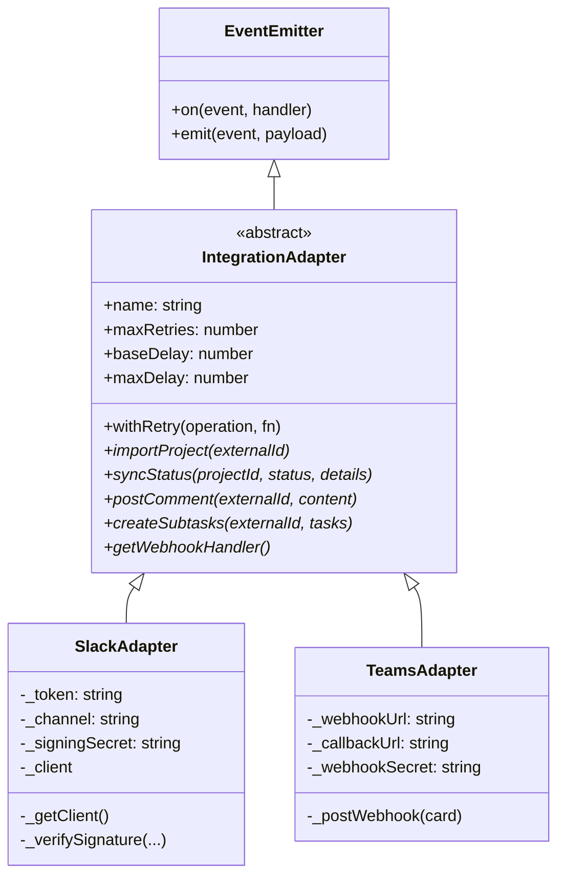
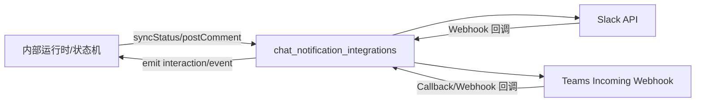
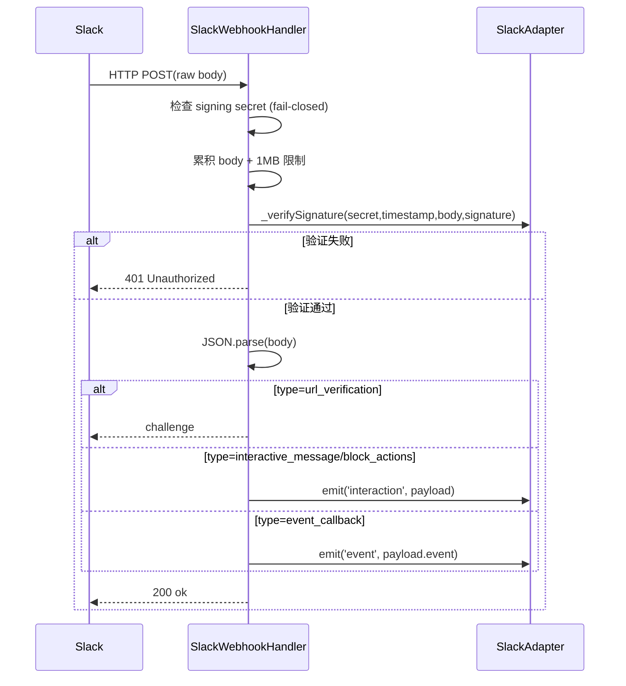
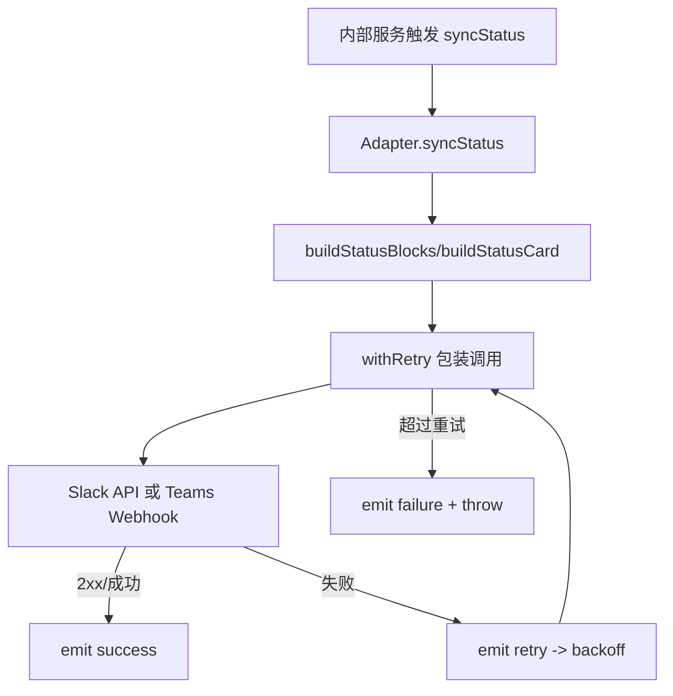
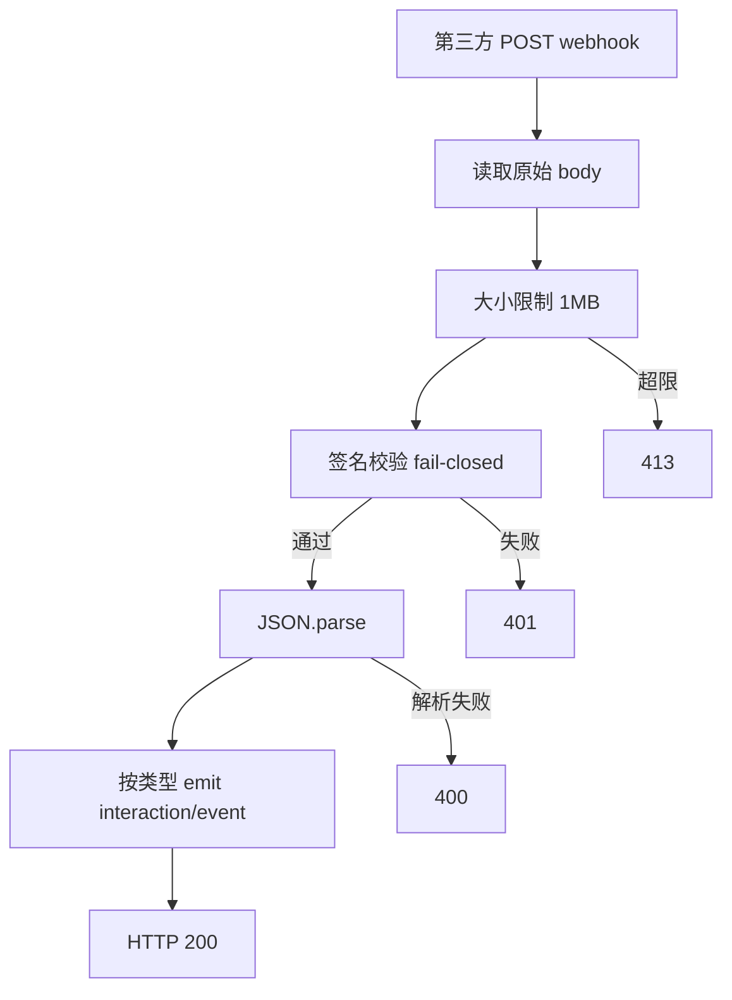

# chat_notification_integrations 模块文档

## 1. 模块概述与设计动机

`chat_notification_integrations` 是 Integrations 体系下专门面向“聊天通知渠道”的子模块，当前实现包含两个核心适配器：`SlackAdapter` 与 `TeamsAdapter`。它的目标不是完整复刻 Jira/Linear 这类项目系统的双向数据模型，而是把系统运行状态、任务拆解结果和人工交互入口，投递到团队日常沟通最频繁的消息平台中。

该模块存在的核心价值在于缩短“系统状态”到“人类决策”的路径：当内部流程推进到 RARV 阶段（如 `REASON`、`ACT`、`VERIFY`、`DONE`），或需要人工审批/确认时，系统可以在 Slack/Teams 直接推送结构化消息，并通过 webhook 接收按钮点击或事件回调，再转化为内部事件。

在架构上，这两个适配器都继承 `IntegrationAdapter`（见 [Integrations.md](Integrations.md)），因此共享统一的重试模型（指数退避）、事件发射能力（`success` / `retry` / `failure`），并保持一致的方法契约：`importProject`、`syncStatus`、`postComment`、`createSubtasks`、`getWebhookHandler`。

---

## 2. 架构与组件关系

### 2.1 继承与职责分层



这个分层的关键设计是：
`IntegrationAdapter` 只定义跨平台一致能力，而 Slack/Teams 子类只处理平台语义差异，例如 Slack 的签名格式和 URL 验证挑战、Teams 的 webhook 卡片投递与 HMAC 校验。

### 2.2 模块在系统中的位置



该模块主要承担“通知出口 + 交互入口”角色。它通常被上层服务调用（例如状态通知、审批流、运行编排服务），并通过事件机制把外部交互反馈回内部。

---

## 3. 核心组件详解

## 3.1 `src.integrations.slack.adapter.SlackAdapter`

### 3.1.1 构造与配置来源

```js
new SlackAdapter(options)
```

构造函数会按“显式 options 优先，其次环境变量，最后空字符串”的顺序初始化：
- `_token`: `options.token` 或 `LOKI_SLACK_BOT_TOKEN`
- `_channel`: `options.channel` 或 `LOKI_SLACK_CHANNEL`
- `_signingSecret`: `options.signingSecret` 或 `LOKI_SLACK_SIGNING_SECRET`

副作用方面，构造时不会建立网络连接，`_client` 保持 `null`，采用懒加载。

### 3.1.2 `_getClient()`：懒加载 Slack SDK 客户端

`_getClient()` 第一次调用时动态 `require('@slack/web-api').WebClient` 并实例化，后续复用缓存对象。若依赖未安装，会抛出明确错误，提示执行 `npm install @slack/web-api`。

这意味着：
- 只有真正调用 Slack API 时才会暴露依赖缺失问题。
- 可在不启用 Slack 的部署环境中避免启动即失败。

### 3.1.3 `importProject(externalId)`

该方法通过 `conversations.history({ channel: externalId, limit: 50 })` 拉取消息，把文本拼接为 PRD 输入。

返回结构：
```js
{ title: 'Slack Import: ' + externalId, content: string, source: 'slack' }
```

行为要点：
- 使用 `withRetry('importProject', ...)` 包裹，失败会自动重试。
- 只取最近 50 条消息，不做分页。
- 仅提取 `message.text`，不会保留附件、块结构、线程上下文元数据。

### 3.1.4 `syncStatus(projectId, status, details)`

方法会调用 `blocks.buildStatusBlocks(projectId, status, details)` 构造 Slack Block Kit 消息，并 `chat.postMessage` 到 `_channel`。同时传入 `text: 'Loki Mode: ' + status` 作为 fallback 文本。

副作用：向默认频道发送消息。若 `_channel` 未配置，Slack API 调用通常会失败并进入重试流程。

### 3.1.5 `postComment(externalId, content)`

直接向 `externalId` 指定的 channel 发送文本消息。

典型用途是把质量结论、人工审阅输出等文本推到指定会话。

### 3.1.6 `createSubtasks(externalId, tasks)`

Slack 无原生 subtasks 概念，此实现退化为发送编号列表：
`*Task Breakdown:*\n1. ...\n2. ...`。

返回：
```js
tasks.map(t => ({ id: t.title, status: 'posted' }))
```

注意这是“通知结果”而非“真实外部任务 ID”。`id` 取 `title` 仅为占位语义。

### 3.1.7 `getWebhookHandler()` 与签名校验

该方法返回 Node HTTP 风格处理器 `(req, res) => void`，核心流程如下：



关键安全细节：
- **Fail-closed**：若未配置 `_signingSecret`，直接拒绝所有请求（401）。
- 使用原始 body 做签名校验，避免 JSON 反序列化导致签名不一致。
- body 超过 1MB 返回 413 并销毁连接。
- 校验函数 `verifySlackSignature` 还包含 **5 分钟时间窗**检查，防重放攻击。

### 3.1.8 `_verifySignature(...)`

该方法只是委托给 `verifySlackSignature`，便于测试时替换或 mock。实际算法为 Slack v0 规范：
- basestring: `v0:{timestamp}:{rawBody}`
- HMAC-SHA256(signingSecret)
- 与 header 签名做 timing-safe 比较。

---

## 3.2 `src.integrations.teams.adapter.TeamsAdapter`

### 3.2.1 构造与配置

```js
new TeamsAdapter(options)
```

初始化字段：
- `_webhookUrl`: `options.webhookUrl` 或 `LOKI_TEAMS_WEBHOOK_URL`
- `_callbackUrl`: `options.callbackUrl` 或 `LOKI_TEAMS_CALLBACK_URL`
- `_webhookSecret`: `options.webhookSecret` 或 `LOKI_TEAMS_WEBHOOK_SECRET`

需要特别说明：在当前代码中 `_callbackUrl` 仅被保存，未参与发送或回调处理逻辑。

### 3.2.2 `importProject(externalId)`

Teams 侧没有与 Jira/Linear 类似的“项目导入”路径，因此返回空内容占位：
```js
{ title: 'Teams Import: ' + externalId, content: '', source: 'teams' }
```

这体现了“契约兼容优先”的设计：即使无同等功能，也保持统一接口可调用。

### 3.2.3 `syncStatus(projectId, status, details)`

流程：`cards.buildStatusCard(...)` -> `_postWebhook(card)`。

消息格式由 `cards` 模块负责，适配器只负责投递与重试。

### 3.2.4 `postComment(externalId, content)`

流程：`cards.buildMessageCard(content)` -> `_postWebhook(card)`。

当前实现中 `externalId` 未使用（因为发送目标由 `_webhookUrl` 全局决定），这是与 Slack 的重要差异。

### 3.2.5 `createSubtasks(externalId, tasks)`

流程：`cards.buildTaskListCard(tasks)` -> `_postWebhook(card)` -> 返回 `{id:title,status:'posted'}` 列表。

与 Slack 相同，这不是创建真正 Teams Planner 任务，只是发送任务列表通知。

### 3.2.6 `getWebhookHandler()`：回调验签与事件分流

处理器逻辑：
1. 流式读取 body，限制 1MB。
2. 若 `_webhookSecret` 未配置，401（fail-closed）。
3. 读取 `x-loki-signature` 请求头。
4. 对 body 做 HMAC-SHA256，hex 与 header 用 `crypto.timingSafeEqual` 比较。
5. 解析 JSON：
   - `payload.type === 'invoke'` 或 `payload.value` 存在：`emit('interaction', payload)`，响应 JSON `{status:200, body:'Action received'}`。
   - 否则：`emit('event', payload)`，响应 `200 ok`。

与 Slack 相比，Teams 这里没有 timestamp 时间窗检查，安全性主要依赖共享密钥 + timing-safe 对比。

### 3.2.7 `_postWebhook(card)`：底层 HTTP 投递

该私有方法直接使用 Node `http/https` 发请求（非第三方 SDK）：
- 自动按 URL 协议选择 `http` 或 `https`
- `Content-Type: application/json`
- 超时时间 30s
- 2xx 视为成功，否则抛错 `Teams webhook failed: <status> <body>`

错误条件包括：
- `_webhookUrl` 为空：立即 reject
- 网络错误/超时：reject（会被 `withRetry` 捕获并重试）

---

## 4. 公共行为：重试与事件

两个适配器都依赖 `IntegrationAdapter.withRetry`。默认策略：
- `maxRetries = 3`
- `baseDelay = 1000ms`
- `maxDelay = 30000ms`
- 指数退避：`baseDelay * 2^attempt`，再受 `maxDelay` 限制

并发出标准事件：
- `success`: 操作成功（包含 attempt）
- `retry`: 某次失败后计划重试（含 delay 和 error）
- `failure`: 超过上限后彻底失败

如果你需要监控或告警，应优先监听这些基础事件，而不是只在调用处 `catch`。

---

## 5. 配置与使用

### 5.1 环境变量矩阵

| 变量名 | 用途 | 适配器 | 必需场景 |
|---|---|---|---|
| `LOKI_SLACK_BOT_TOKEN` | Slack Web API token | Slack | 调用 Slack API 时必需 |
| `LOKI_SLACK_CHANNEL` | 默认状态同步频道 | Slack | 调用 `syncStatus` 时通常必需 |
| `LOKI_SLACK_SIGNING_SECRET` | Slack webhook 验签密钥 | Slack | 启用 inbound webhook 必需 |
| `LOKI_TEAMS_WEBHOOK_URL` | Teams 入站 webhook 地址 | Teams | 出站发送必需 |
| `LOKI_TEAMS_CALLBACK_URL` | 回调地址（当前仅保存） | Teams | 可选 |
| `LOKI_TEAMS_WEBHOOK_SECRET` | Teams 回调验签密钥 | Teams | 启用 inbound webhook 必需 |

### 5.2 最小接入示例

```js
const { SlackAdapter } = require('./src/integrations/slack/adapter');
const { TeamsAdapter } = require('./src/integrations/teams/adapter');

const slack = new SlackAdapter({
  token: process.env.LOKI_SLACK_BOT_TOKEN,
  channel: process.env.LOKI_SLACK_CHANNEL,
  signingSecret: process.env.LOKI_SLACK_SIGNING_SECRET,
  maxRetries: 3,
});

const teams = new TeamsAdapter({
  webhookUrl: process.env.LOKI_TEAMS_WEBHOOK_URL,
  webhookSecret: process.env.LOKI_TEAMS_WEBHOOK_SECRET,
});

for (const adapter of [slack, teams]) {
  adapter.on('retry', e => console.warn('[retry]', e));
  adapter.on('failure', e => console.error('[failure]', e));
}

await slack.syncStatus('proj-123', 'VERIFY', { score: 92 });
await teams.postComment('ignored-in-teams', 'Release window starts in 30 min');
```

### 5.3 Webhook 路由示例（Node 原生/Express 风格）

```js
app.post('/webhooks/slack', slack.getWebhookHandler());
app.post('/webhooks/teams', teams.getWebhookHandler());

slack.on('interaction', payload => {
  // 处理 Slack 按钮点击
});
teams.on('interaction', payload => {
  // 处理 Teams invoke/value 回调
});
```

---

## 6. 数据流与过程说明

### 6.1 出站通知流程（状态同步）



### 6.2 入站交互流程（Webhook）



---

## 7. 扩展与定制建议

如果你要新增聊天平台（例如 Discord、Mattermost），建议遵循现有模式：
先继承 `IntegrationAdapter`，优先实现 `syncStatus` + `postComment` + `getWebhookHandler` 这三个高价值路径，再视平台能力决定 `importProject`/`createSubtasks` 是否提供降级行为。

对于 Slack/Teams 的现有扩展，建议在 `blocks` / `cards` 层做消息格式升级，而不是改动适配器重试与验签主链路。这样可以保持可靠性逻辑稳定。

---

## 8. 边界条件、错误场景与运维注意事项

该模块最常见问题不是代码错误，而是“配置与平台语义不匹配”。例如 Slack 未配置 signing secret 会让 webhook 全部 401；Teams 的 `externalId` 在发送路径中无效，若调用方误以为可动态选频道，会出现“消息发到了固定 webhook 绑定频道”的偏差。

需要重点关注的限制包括：
- Slack 导入固定 `limit:50`，长线程丢失上下文。
- Slack/Teams `createSubtasks` 只是消息化呈现，不会创建真正外部任务实体。
- Teams webhook 回调验签没有时间窗机制，不具备 Slack 那种内建防重放时间校验。
- 请求体统一 1MB 限制，富卡片或异常负载可能触发 413。
- Teams `_callbackUrl` 当前未使用，属于保留字段。

在生产环境中，建议结合审计与监控体系记录：
- 每次 `retry/failure` 的 operation、error、attempt
- webhook 401/413/400 的频次
- 各渠道消息投递成功率

---

## 9. 与其他模块文档的关联阅读

为避免重复，以下主题建议直接参考对应文档：
- 集成体系抽象基类、重试机制全景： [Integrations.md](Integrations.md)
- Slack 专项能力与配置实践： [Integrations-Slack.md](Integrations-Slack.md)
- Teams 专项能力与卡片示例： [Integrations-Teams.md](Integrations-Teams.md)
- 插件化加载与集成注册： [Plugin System.md](Plugin System.md)

如果你正在实现“通知触发源”而不是“通知通道”，建议同时阅读 API/状态相关模块文档（如 `API Server & Services.md`、`State Management.md`），理解事件是如何在系统内部被生产和消费的。
