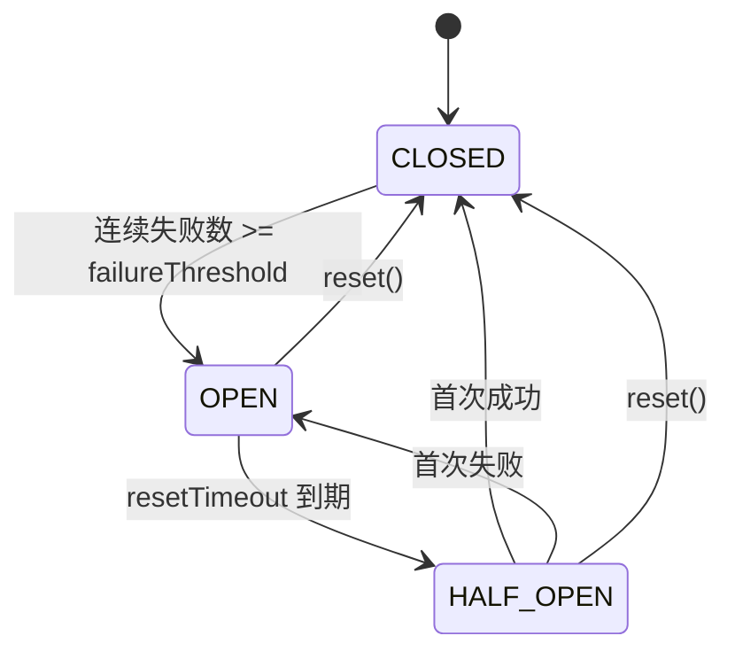
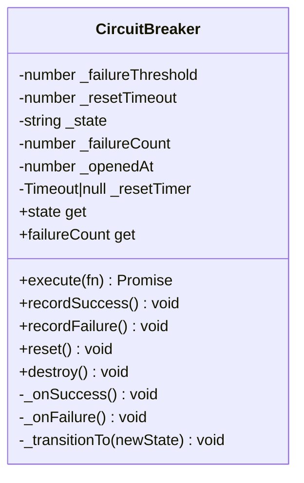
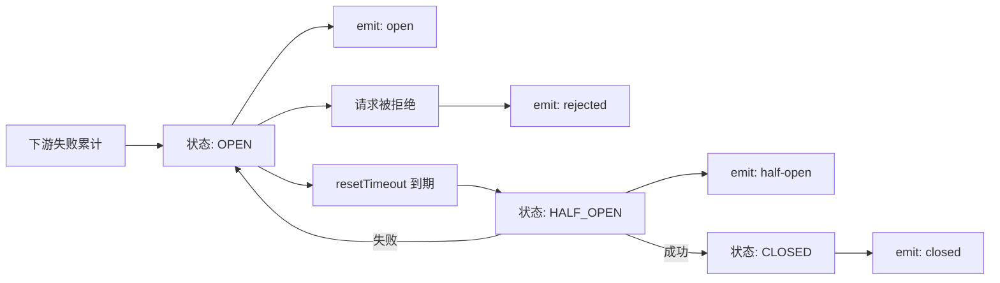
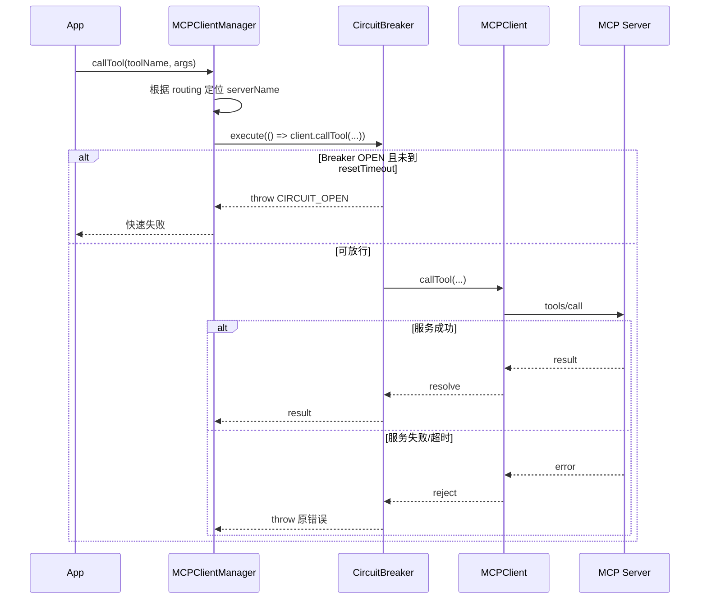
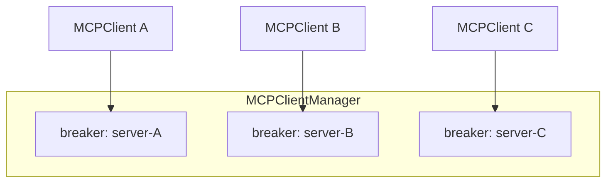

# circuit_breaker_resilience 模块文档

## 模块定位与设计动机

`circuit_breaker_resilience` 模块是 MCP Protocol 体系中的弹性保护核心，代码实体为 `src/protocols/mcp-circuit-breaker.CircuitBreaker`。它实现了经典的 Circuit Breaker（熔断器）模式，用来保护对不稳定 MCP 服务端的调用，避免故障扩散到上层调度与业务流程。

在没有熔断器的情况下，如果某个 MCP server 出现超时、网络抖动或内部异常，上游会持续重试，导致连接、线程、事件循环时间片被快速消耗。`CircuitBreaker` 的价值不在于“让失败消失”，而在于“让失败可控”：在故障窗口内快速拒绝请求、减少无效等待，并通过半开探测机制自动尝试恢复。

从模块树角度看，该模块属于 **MCP Protocol / circuit_breaker_resilience** 子模块，与 `MCPClientManager`（客户端编排）、`MCPClient`（协议调用运行时）、`SSETransport`/`StdioTransport`（传输层）形成上下游协作链路。建议先阅读本文件，再按需阅读 [mcp_client_protocol_runtime.md](mcp_client_protocol_runtime.md) 与 [transport_adapters.md](transport_adapters.md) 了解调用与传输细节。

---

## 核心组件：CircuitBreaker

`CircuitBreaker` 继承 Node.js `EventEmitter`，内部是一个轻量状态机，维护失败计数与恢复定时器。它既支持“包裹执行”（`execute(fn)`），也支持“手动记账”（`recordSuccess()` / `recordFailure()`），方便集成到不同代码结构中。

### 状态模型

模块定义 `STATE` 常量：

- `CLOSED`：闭合状态，正常放行请求。
- `OPEN`：打开状态，快速失败（拒绝执行）。
- `HALF_OPEN`：半开状态，恢复探测期。



这套状态流转强调“保守恢复”：在 `HALF_OPEN` 只要出现一次失败就立即回到 `OPEN`，防止尚未恢复的下游再次拖垮系统。

### 内部数据结构与字段语义



`_failureCount` 记录“连续失败次数”，一旦成功会被清零。`_openedAt` 用于在 `execute()` 被调用时判断是否达到恢复窗口。`_resetTimer` 用于在进入 `OPEN` 后自动安排一次“尝试进入 `HALF_OPEN`”的定时转换。

---

## 方法级深度说明

### constructor(options)

构造器接收可选配置：

- `failureThreshold`（默认 `3`）：进入 `OPEN` 所需的连续失败阈值。
- `resetTimeout`（默认 `30000` 毫秒）：`OPEN` 保持时间，过期后尝试进入 `HALF_OPEN`。

实现细节上使用了 `opts.failureThreshold || 3` 和 `opts.resetTimeout || 30000`。这意味着当你传 `0` 这样的 falsy 值时会被回退为默认值，而不是按 0 生效。

### `get state()` / `get failureCount()`

`state` 返回当前状态字符串；`failureCount` 返回当前连续失败计数。两者只读，便于监控系统、日志聚合、健康接口直接读取。

### `async execute(fn)`

这是最重要的入口。行为分三段：

1. 若当前 `OPEN`：
   - 如果 `Date.now() - _openedAt >= _resetTimeout`，先切到 `HALF_OPEN`，再继续执行。
   - 否则立即发出 `rejected` 事件并抛错：`Error('Circuit breaker is OPEN')`，并附加 `err.code = 'CIRCUIT_OPEN'`。
2. 执行传入的 `fn`（期望为 async function 或返回 Promise 的函数）。
3. 成功时 `_onSuccess()`；失败时 `_onFailure()` 并把原错误继续抛出。

这让上层能区分两类失败：

- 熔断拒绝（`code === 'CIRCUIT_OPEN'`）
- 下游真实异常（原始 error）

### `recordSuccess()` / `recordFailure()`

用于不想直接使用 `execute()` 包裹时的手动记录模式。其内部直接调用 `_onSuccess()` / `_onFailure()`，与 `execute()` 的状态演进逻辑一致。

### `reset()`

强制把失败计数清零，并在当前不是 `CLOSED` 时切回 `CLOSED`。常用于运维手动干预、测试场景或确认下游恢复后的立即放量。

### `destroy()`

释放内部定时器并 `removeAllListeners()`。这是生命周期末端必须调用的方法，尤其在长期运行的 manager/worker 中可避免监听器泄漏与悬挂资源。

### 私有逻辑：`_onSuccess()` / `_onFailure()` / `_transitionTo()`

`_onSuccess()` 会清零失败计数；若当前在 `HALF_OPEN`，立即转 `CLOSED`。`_onFailure()` 会递增失败计数：

- 在 `HALF_OPEN`：任何一次失败都立刻 `OPEN`。
- 在 `CLOSED`：达到阈值后转 `OPEN`。

`_transitionTo(newState)` 是状态切换核心：

- 清理旧 `_resetTimer`。
- 若新状态是 `OPEN`：记录 `_openedAt`，创建 `setTimeout` 定时器到期后尝试转 `HALF_OPEN`。
- 对 timer 调用 `unref()`（若存在），避免仅因该定时器阻止 Node 进程退出。
- 当 `oldState !== newState` 时发出状态事件（事件名会被转为 `open` / `half-open` / `closed`）。

---

## 事件模型与可观测性

`CircuitBreaker` 事件是接入监控与告警的主入口：

- `open`：进入熔断。
- `half-open`：开始恢复探测。
- `closed`：恢复成功或被手动重置。
- `rejected`：在 `OPEN` 且未到恢复窗口时拒绝了一次调用。



实践上建议把 `open` 作为高优先级告警触发点，把 `rejected` 用于容量损失统计，把 `closed` 用于 MTTR（恢复时长）计算。

---

## 与 MCP 协议栈的关系

在实际系统中，`CircuitBreaker` 主要由 `MCPClientManager` 为每个 server 独立创建并持有。`discoverTools()` 的连接过程与 `callTool()` 的调用过程都经过对应 breaker。



这意味着熔断边界位于“管理器到客户端调用”之间，而不是传输层内部。它并不替代 `MCPClient` 的 timeout/协议错误处理，而是在其上层进一步控制故障放大。

相关文档可参考：

- [mcp_client_protocol_runtime.md](mcp_client_protocol_runtime.md)
- [client_manager_and_routing.md](client_manager_and_routing.md)
- [MCP Protocol.md](MCP Protocol.md)

---

## 使用方式与配置建议

### 基础用法

```javascript
const { CircuitBreaker } = require('./src/protocols/mcp-circuit-breaker');

const breaker = new CircuitBreaker({
  failureThreshold: 3,
  resetTimeout: 15_000
});

async function guardedCall() {
  return breaker.execute(async () => {
    return await someRemoteOperation();
  });
}
```

### 结合降级逻辑（fallback）

```javascript
async function callWithFallback() {
  try {
    return await breaker.execute(() => client.callTool('search', { q: 'abc' }));
  } catch (err) {
    if (err.code === 'CIRCUIT_OPEN') {
      return { cached: true, items: [] }; // fallback
    }
    throw err;
  }
}
```

### 监听状态事件接入监控

```javascript
breaker.on('open', () => metrics.inc('mcp_breaker_open_total'));
breaker.on('rejected', () => metrics.inc('mcp_breaker_rejected_total'));
breaker.on('closed', () => metrics.inc('mcp_breaker_recovered_total'));
```

### 参数调优思路

`failureThreshold` 越小，保护越激进，但误伤瞬时抖动的概率更高；`resetTimeout` 越长，恢复探测越保守，但恢复速度更慢。建议基于真实 SLO 与失败分布（而不是经验值）调优，例如对高价值低容错链路使用较低阈值与中等恢复窗口。

---

## 边界条件、错误语义与已知限制

该实现简洁稳定，但也有需要明确的行为边界：

1. **HALF_OPEN 并非严格“只放行一个并发请求”**。代码注释描述“one request allowed through”，但当前实现没有并发闸门。如果多个请求几乎同时在 `HALF_OPEN` 到达，它们都可能执行。对高并发场景如果需要严格单探针，需要在上层再加互斥控制。
2. **只统计连续失败，不统计失败率窗口**。一次成功会把 `_failureCount` 清零，因此它更适合“连续故障”而非“间歇高错误率”场景。
3. **`execute(fn)` 假定 `fn` 可调用**。若传入非函数会触发运行时异常（TypeError），并被当作一次失败计入。
4. **配置参数的 falsy 回退**。`0` 会被替换为默认值，无法表达“禁用阈值/超时为 0”这种语义。
5. **`destroy()` 会移除全部监听器**。如果外部复用同一实例并在销毁后继续使用，会丢失监控事件。
6. **`rejected` 仅在 OPEN 且未过恢复窗口时触发**。当 OPEN 已过窗口并切 HALF_OPEN 后，调用失败属于真实执行失败，不会触发 `rejected`。

---

## 扩展建议

如果你计划增强该模块，可优先考虑以下方向：

- 增加“严格 half-open 单请求探针”机制（例如 `_halfOpenInFlight` 锁）。
- 支持滑动窗口失败率（而非仅连续失败计数）。
- 为 `execute` 增加可选 hooks（如 `onBeforeExecute` / `onAfterExecute`）便于埋点。
- 增加状态快照导出（包含 `openedAt`、剩余 cooldown 等）以支持管理界面。

扩展时建议保持现有错误码 `CIRCUIT_OPEN` 和事件名兼容，避免破坏 `MCPClientManager` 与上层监控逻辑。

---

## 结论
## API 速查：参数、返回值与副作用

为了便于维护者快速定位接口语义，下面给出 `CircuitBreaker` 的方法契约摘要。更完整的行为请结合“方法级深度说明”阅读。

| 方法 | 入参 | 返回值 | 典型副作用 | 失败语义 |
|---|---|---|---|---|
| `constructor(options)` | `options.failureThreshold?: number`、`options.resetTimeout?: number` | `CircuitBreaker` 实例 | 初始化状态为 `CLOSED`，失败计数为 0 | 无 |
| `state` (getter) | 无 | `'CLOSED' \| 'OPEN' \| 'HALF_OPEN'` | 无 | 无 |
| `failureCount` (getter) | 无 | `number` | 无 | 无 |
| `execute(fn)` | `fn: () => Promise<any>` | `Promise<any>` | 可能触发状态迁移；可能发出 `rejected/open/half-open/closed` 事件 | OPEN 冷却期内抛 `code='CIRCUIT_OPEN'`；下游错误原样抛出 |
| `recordSuccess()` | 无 | `void` | 清零连续失败计数；在 `HALF_OPEN` 时转 `CLOSED` | 无 |
| `recordFailure()` | 无 | `void` | 连续失败计数 +1；在阈值或半开失败时转 `OPEN` | 无（不抛错） |
| `reset()` | 无 | `void` | 清零失败计数并转 `CLOSED`；清理已有重置定时器 | 无 |
| `destroy()` | 无 | `void` | 清理定时器并移除全部事件监听器 | 无 |

在运维与集成层面，最容易被忽视的是 `destroy()`：它会移除所有监听器，因此如果你在同一对象上复用 breaker，销毁后需要重新绑定监控事件，否则会出现“状态变化正常但监控无数据”的误判。

---

## 生产环境落地建议

在真实部署中，建议把 `CircuitBreaker` 作为“每个下游 MCP server 一份”的基础设施对象，而不是全局共享单例。这样做可以把故障影响面限定在单个 server，不会因为一个 server 的抖动导致全部工具调用进入熔断。



配套策略上，建议至少落实三件事。第一，在指标系统中同时记录 `open_total`、`rejected_total` 和 `half_open_transitions`，不要只看 `open`，否则无法区分“偶发熔断”与“持续容量损失”。第二，把 `CIRCUIT_OPEN` 与业务异常分开统计与告警，前者反映弹性策略触发，后者反映服务行为错误。第三，在服务下线/热更新时显式调用 `destroy()`，避免旧实例定时器与监听器残留。

如果后续需要与 Dashboard 或 SDK 暴露更细粒度的健康信息，建议在上层（如 `MCPClientManager`）聚合 breaker 状态后再输出对外契约，避免直接把内部字段（例如 `_openedAt`）作为稳定 API 暴露。

---

## 结论

`circuit_breaker_resilience` 模块通过非常小的实现体积，提供了 MCP 协议链路中最关键的一层故障隔离能力。它与 `MCPClientManager` 的“每服务一个 breaker”组合，让故障被局部化，而不是放大为全局不可用。对维护者而言，理解其状态机、错误语义和并发边界，是正确调参与安全扩展该模块的前提。


`circuit_breaker_resilience` 模块通过非常小的实现体积，提供了 MCP 协议链路中最关键的一层故障隔离能力。它与 `MCPClientManager` 的“每服务一个 breaker”组合，让故障被局部化，而不是放大为全局不可用。对维护者而言，理解其状态机、错误语义和并发边界，是正确调参与安全扩展该模块的前提。