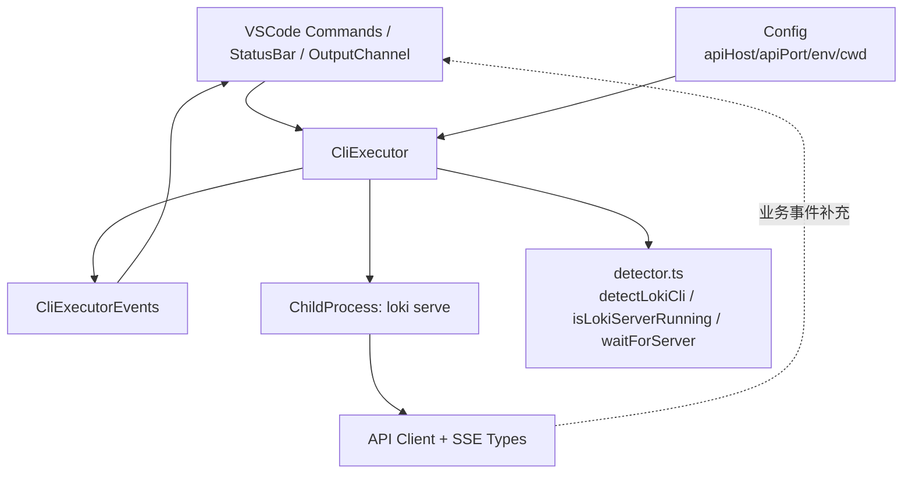
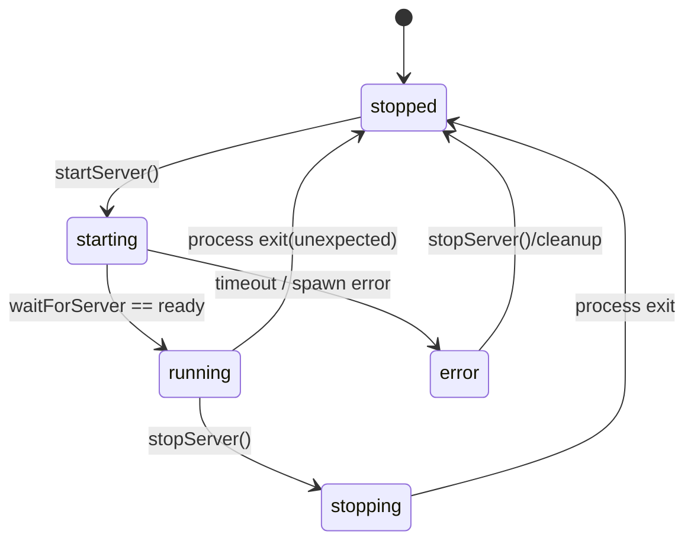
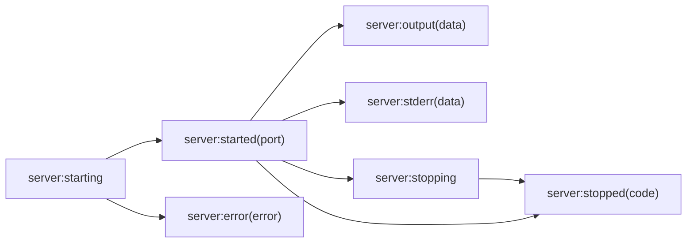
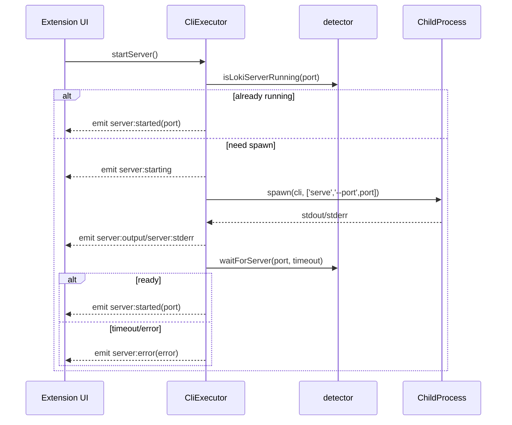
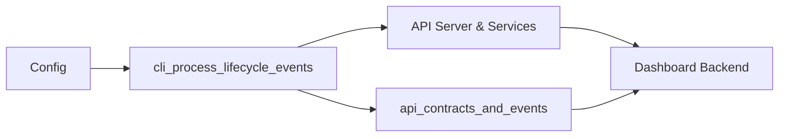

# cli_process_lifecycle_events 模块文档

## 模块简介

`cli_process_lifecycle_events` 模块对应 VSCode 扩展中 `CliExecutorEvents` 这组事件契约，用于描述 Loki CLI 进程（尤其是 `loki serve` 服务进程）在**启动、运行、停止、出错**全过程中的可观察信号。这个模块存在的核心原因，是把“进程生命周期”从实现细节中抽离出来，变成上层 UI、状态栏、日志面板、自动重连逻辑都能统一消费的事件流。

从设计上看，它是一个“本地进程事件平面（local process event plane）”：

- 一端连接 `CliExecutor`（进程管理与命令执行实现）；
- 另一端连接 VSCode Extension 的 UI/控制逻辑；
- 与远端业务事件（如 SSE 中的 `BaseEvent`）形成互补：前者表示“本地 CLI 运行状态”，后者表示“远端会话任务状态”。

因此，当你要回答“扩展现在是否连得上后端服务”时，不能只看 API 事件，也要看 CLI 生命周期事件。这正是该模块的系统价值。

> 关联阅读：
> - 扩展整体架构见 [VSCode Extension](VSCode Extension.md)
> - API/SSE 契约见 [api_contracts_and_events](api_contracts_and_events.md)
> - 配置来源与覆盖策略见 [configuration_and_settings_access](configuration_and_settings_access.md)（若你们仓库采用了该文档命名）或 VSCode 扩展总览文档中的 Config 小节

---

## 核心组件与职责边界

该模块的核心契约是：

```ts
interface CliExecutorEvents {
  'server:starting': () => void;
  'server:started': (port: number) => void;
  'server:stopping': () => void;
  'server:stopped': (code: number | null) => void;
  'server:error': (error: Error) => void;
  'server:output': (data: string) => void;
  'server:stderr': (data: string) => void;
}
```

虽然当前 core component 只包含这组事件定义，但在运行时它由 `vscode-extension/src/cli/executor.ts` 中的 `CliExecutor` 触发。要正确理解事件语义，必须结合 `CliExecutor` 的状态机和 `child_process` 交互逻辑一起看。

### 组件关系图



上图表达了一个关键事实：`CliExecutorEvents` 并不是独立执行模块，而是 `CliExecutor` 对进程状态变化的“发布接口”。UI 层通常同时消费两类事件流：

1. 来自本模块的进程生命周期事件（是否启动成功、是否异常退出、stdout/stderr 输出）；
2. 来自 API/SSE 的业务事件（session/task/phase）。

---

## 设计动机与架构 rationale

如果没有 `CliExecutorEvents` 这种显式事件契约，上层代码会直接轮询 `serverState` 或解析散落日志，导致两个问题：第一，状态变更不及时且易错；第二，多个 UI 子系统会重复实现同样的判定逻辑。通过事件化设计，模块将“状态变化时通知谁”这个问题前置到架构层，实现了更清晰的关注点分离。

`CliExecutorEvents` 的事件粒度也体现了实践取舍：

- 既有阶段型事件（starting/started/stopping/stopped/error），用于驱动 UI 状态机；
- 也有流式事件（output/stderr），用于日志与诊断。

这意味着它既能支撑“控制面”的可靠状态反馈，也能支撑“观测面”的内容流转。

---

## 生命周期状态机与事件语义

`CliExecutor` 内部维护 `ServerState`：`'stopped' | 'starting' | 'running' | 'stopping' | 'error'`。`CliExecutorEvents` 就是这个状态机在外部的可见投影。

### 状态机图



### 事件与状态对应关系



注意这里的语义不是“一对一严格映射”。例如 `server:stopped` 既可能是主动 `stopServer()`，也可能是意外退出。调用方应结合最近上下文（是否刚发出 stop 指令、退出码是否非 0）来判断。

---

## 关键实现机制（结合 executor.ts）

### 1) `startServer()`：启动与就绪判定

`startServer()` 的流程是：

1. 若内部状态已 `running`，直接返回（幂等）；
2. 调用 `isLokiServerRunning(port)`，若端口已可用，则直接设为运行并发出 `server:started`（表示“可用但不一定由当前 executor 管理”）；
3. 若内部状态为 `starting`，抛错防止并发启动；
4. `ensureCliPath()` 自动检测 CLI 路径；
5. 触发 `server:starting`，spawn `loki serve --port <port>`；
6. 绑定 stdout/stderr/exit/error 回调并转发为事件；
7. 用 `waitForServer(port, startupTimeout)` 判定可用性，成功后触发 `server:started`，超时则触发 `server:error` 并尝试 kill。

启动序列图如下：



### 2) `stopServer(force?)`：优雅停止与强制终止

`stopServer()` 默认发送 `SIGTERM`，并在 5 秒后 fallback 到 `SIGKILL`。当 `force=true` 时会立即 `SIGKILL`。停止前先触发 `server:stopping`，进程退出后触发 `server:stopped(code)`。

这个设计对用户体验很重要：普通停止更“温和”，适合保留服务收尾逻辑；强制停止适合扩展卸载、窗口关闭或僵尸进程清理。

### 3) stdout/stderr 事件的双重用途

`server:output` 与 `server:stderr` 不仅用于展示日志，还被内部缓冲到 `outputBuffer`/`stderrBuffer`，可供排错时一次性读取（如诊断“启动失败但 UI 没看到关键日志”）。

### 4) 与命令执行能力的关系

同一个 `CliExecutor` 还提供 `executeCommand()` 和 `executeCommandStreaming()`。虽然它们不直接发 `CliExecutorEvents`，但共享同一套 CLI 路径探测与进程 spawn 参数策略（含 `cwd/env/FORCE_COLOR=0`），这保证了“生命周期管理”和“一次性命令执行”在执行环境上保持一致。

---

## 事件字段详解（参数、返回、副作用）

### `server:starting: () => void`

表示启动流程已进入 spawn 前后阶段，UI 通常可切换为 loading 状态。该事件无参数，强调的是“动作开始”而非“结果可用”。

### `server:started: (port: number) => void`

表示当前 `serverPort` 已经可用。这里的 `port` 是最终就绪端口，不代表一定是新启动的子进程，可能是检测到的外部已有服务。

### `server:stopping: () => void`

表示开始发送终止信号。适合禁用“重复点击停止”的 UI 交互，避免并发 stop 引发状态抖动。

### `server:stopped: (code: number | null) => void`

表示进程退出（或被视为停止）完成。`code` 为退出码，`null` 通常表示信号终止。调用侧可将 `code !== 0` 识别为异常退出提示。

### `server:error: (error: Error) => void`

表示启动/运行过程中遇到关键错误（spawn error、启动超时等）。这是生命周期中的失败主信号，通常应与 `server:stderr` 联合显示，给用户可操作建议。

### `server:output: (data: string) => void`

转发 stdout 片段。注意它是“流式分块”而非按行输出，消费方若需要行语义应自行 buffer + split。

### `server:stderr: (data: string) => void`

转发 stderr 片段。与 stdout 一样是分块数据；很多 CLI 在 stderr 输出 warning，不一定等同 fatal error。

---

## 使用与集成示例

### 基础订阅模式

```ts
const executor = createExecutor({
  serverPort: 8080,
  startupTimeout: 30_000,
  commandTimeout: 60_000,
  cwd: workspaceRoot,
  env: { LOKI_LOG_LEVEL: 'info' }
});

executor.on('server:starting', () => setStatus('Starting Loki...'));
executor.on('server:started', (port) => setStatus(`Loki running on :${port}`));
executor.on('server:stopping', () => setStatus('Stopping Loki...'));
executor.on('server:stopped', (code) => setStatus(`Loki stopped (code=${code})`));
executor.on('server:error', (err) => showErrorMessage(err.message));
executor.on('server:output', (chunk) => outputChannel.append(chunk));
executor.on('server:stderr', (chunk) => errorChannel.append(chunk));

await executor.startServer();
```

### 与配置系统联动

通常你会从 `Config` 读取端口、日志级别和自动连接选项，再注入 `ExecutorConfig`：

```ts
const executor = createExecutor({
  serverPort: Config.apiPort,
  cwd: vscode.workspace.workspaceFolders?.[0]?.uri.fsPath,
  env: { LOKI_PROVIDER: Config.provider }
});
```

这使得 `cli_process_lifecycle_events` 事件语义在不同工作区仍保持一致，而行为策略由配置驱动。

---

## 扩展点与二次开发建议

如果你要扩展该模块，最常见方向有三个。

第一是“增强事件维度”，例如增加 `server:healthcheck`、`server:restart` 事件，以便区分首次启动与自动重启。第二是“结构化日志事件”，把 `server:output` 纯文本升级为 `{ level, ts, message }`，方便 UI 筛选。第三是“Typed EventEmitter 包装”，让 `CliExecutorEvents` 在编译期真正约束 `on/emit` 签名，避免字符串拼写错误在运行时才暴露。

可以采用包装器模式：

```ts
class TypedCliExecutor {
  constructor(private inner: CliExecutor) {}

  on<K extends keyof CliExecutorEvents>(event: K, listener: CliExecutorEvents[K]) {
    this.inner.on(event, listener as (...args: any[]) => void);
  }
}
```

---

## 边界条件、错误场景与已知限制

### 1) “已在外部运行”与“由当前实例管理”是两回事

`startServer()` 检测到端口可用时会直接触发 `server:started`，但此时 `serverProcess` 可能是 `null`。这意味着 UI 看到“已启动”，却不能调用 `sendInput()`（会报 “stdin 不可用”）。调用侧应配合 `isServerManaged()` 判断是否可进行进程级控制。

### 2) `server:stopped` 可能存在重复触发风险

实现里在 `startServer()` 已绑定了 `process.on('exit')`，而 `stopServer()` 又 `once('exit')` 再发一次 `server:stopped`。在某些路径下可能造成重复事件，UI 侧应做幂等处理（例如仅在状态变化时刷新）。

### 3) 启动期间退出的 reject 判定存在时序陷阱

`exit` 回调中先 `setServerState('stopped')`，再判断 `if (this._serverState === 'starting')`，该条件实际永远不成立，可能导致“启动中异常退出”没有按预期 reject。建议维护单独的 `isStarting` 标记或先判断再改状态。

### 4) `output/stderr` 是 chunk，不保证按行或 UTF-8 边界

日志消费者不要假设每次回调都是完整行；如果要做关键字提取，请先拼接缓存并按换行切分。

### 5) `execFile` 缓冲上限

`executeCommand()` 设置 `maxBuffer=10MB`。若命令输出超限，会进入 error 分支并返回 `success:false`。大输出场景应改用 `executeCommandStreaming()`。

### 6) 平台差异

`shell: process.platform === 'win32'` 与信号处理（`SIGTERM`/`SIGKILL`）在 Windows 和 Unix 上行为不完全一致。跨平台扩展需在用户提示中避免过度依赖特定退出码语义。

---

## 运维与调试建议

当用户报告“扩展连不上 Loki”时，建议按以下顺序定位：

1. 先看是否收到 `server:starting`；若没有，重点排查 `detectLokiCli()` 和配置路径；
2. 若有 `server:starting` 但无 `server:started`，检查 `server:stderr` 与 `startupTimeout`；
3. 若 `server:started` 已触发但业务无数据，转入 [api_contracts_and_events](api_contracts_and_events.md) 路径排查 SSE/轮询；
4. 若只能“连接”但无法 `sendInput`，检查 `isServerManaged()`，确认是否连接到了外部已有进程。

---

## 与其他模块的协作关系



`cli_process_lifecycle_events` 与 `api_contracts_and_events` 不是替代关系，而是分层关系：前者保障“本地运行通道可用”，后者表达“远端业务语义可见”。只有两者都健康，VSCode Extension 的交互闭环才完整。

---

## 总结

`cli_process_lifecycle_events` 模块虽然表面上只是一个事件接口，但它实际上是 VSCode 扩展里“进程生命周期可观测性”的核心契约。它让启动、停止、故障、日志输出这些关键状态变成可订阅、可组合、可测试的信号，从而把 CLI 管理从黑盒调用提升为可运营的系统能力。

对于维护者，最重要的实践是：把它当作状态机接口来消费，而不仅是日志通知；同时在实现层补齐幂等、去重和时序一致性，确保 UI 在各种异常路径下仍能提供可信反馈。