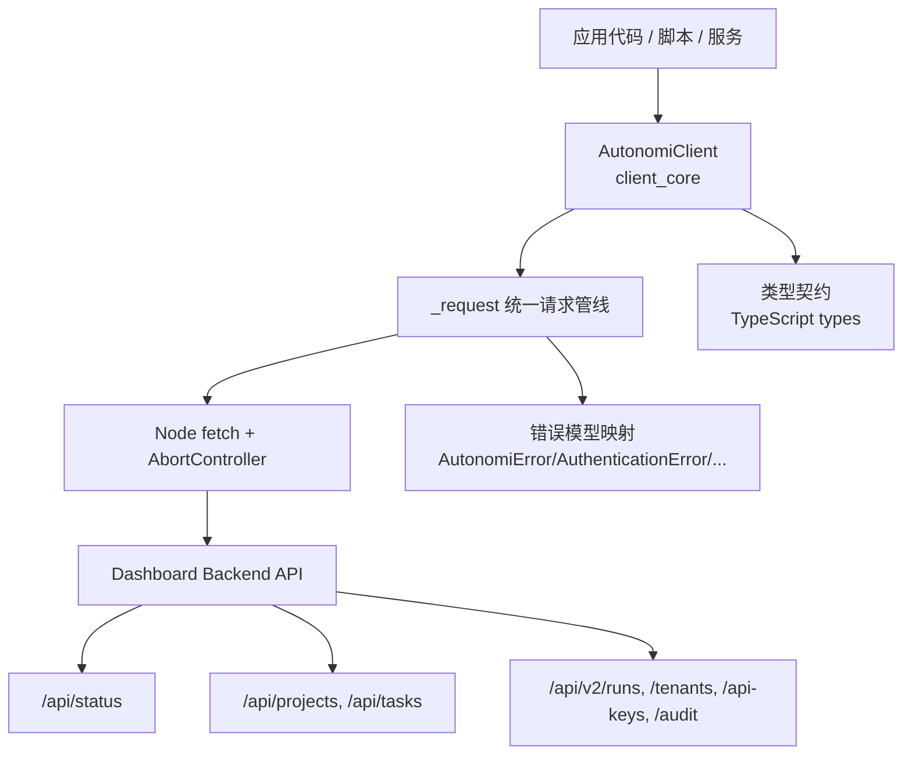
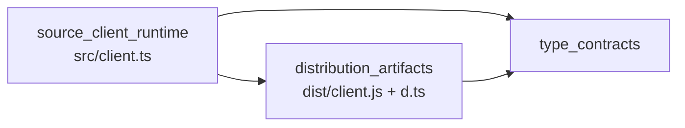
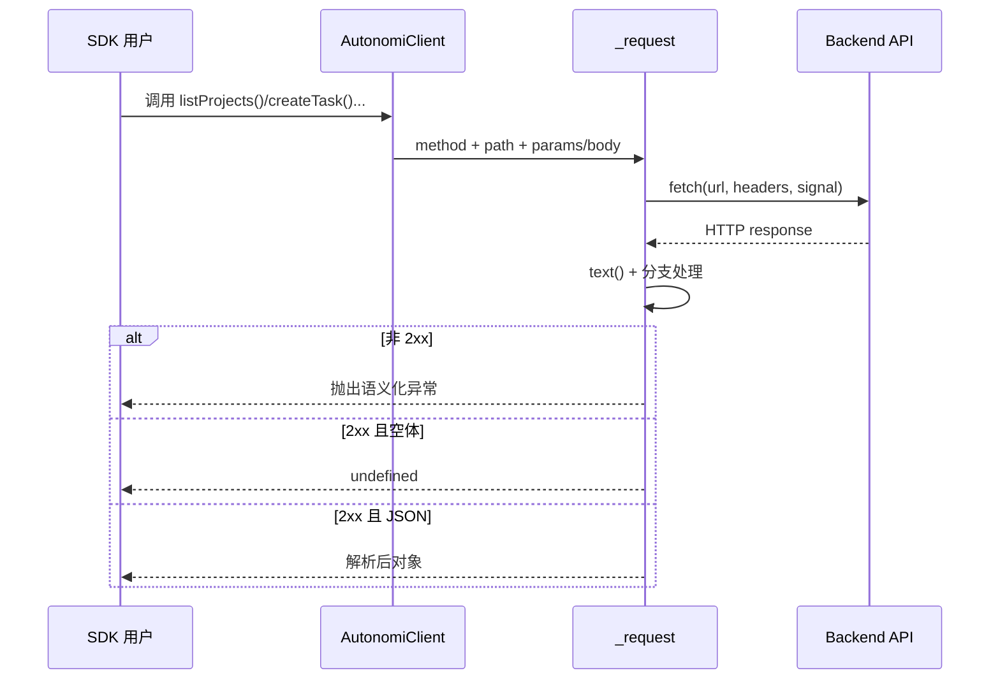
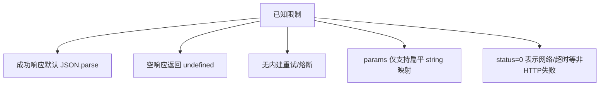

# client_core 模块文档（TypeScript SDK）

## 1. 模块简介：它是什么、为什么存在

`client_core` 是 TypeScript SDK 的核心客户端模块，向外提供统一的 `AutonomiClient` 入口，用于访问 Autonomi 控制平面 API。它的主要目标不是“实现业务逻辑”，而是把网络通信、鉴权头注入、超时控制、错误语义映射和资源方法组织（projects/tasks/runs/tenants/audit/api-keys）收敛到一个稳定、低依赖的调用层。

这个模块存在的核心原因是降低集成复杂度。对于 SDK 使用者而言，如果每次都手写 `fetch`、拼接 URL、解析错误、处理超时，不仅重复劳动多，而且行为不一致，排障困难。`client_core` 通过统一请求管线把这些问题一次性解决，从而让调用者把注意力放在业务编排与自动化流程上。

从系统位置看，`client_core` 处于 **TypeScript SDK → client_core**，向下依赖 Dashboard Backend 的 API 面（尤其是 [api_surface_and_transport.md](api_surface_and_transport.md) 与 [v2_admin_and_governance_api.md](v2_admin_and_governance_api.md)），向上服务脚本、Node.js 服务、CI/CD 自动化和其他集成层。

---

## 2. 架构总览



上图体现了 `client_core` 的分层设计：`AutonomiClient` 提供资源化方法，`_request` 处理公共通信行为，后端 API 提供最终数据源。类型契约保证编译期体验，错误映射保证运行期可诊断性。

### 2.1 子模块关系



- `source_client_runtime`：源码实现，体现真实设计意图与开发维护入口。
- `distribution_artifacts`：发布产物，体现 npm 消费者真正执行到的 JS 与声明文件。
- `type_contracts`：为返回对象和参数提供类型边界（详见 [type_contracts.md](type_contracts.md)）。

---

## 3. 关键组件与职责

`client_core` 当前核心类是 `AutonomiClient`（`src` / `dist` / `d.ts` 三份对应）。其内部有一个关键私有方法 `_request<T>()`，负责 URL 组装、Query 参数编码、JSON body 序列化、鉴权头附加、超时取消、错误消息提取和状态码异常映射。

这类设计把几乎所有公开 API 方法变成“轻量封装器”：每个方法只做路径和参数整理，再把请求委托给 `_request`。这样做的优势是行为一致、可预测，新增接口时也能快速复用已有策略。

完整实现细节请阅读：
- [source_client_runtime.md](source_client_runtime.md)
- [distribution_artifacts.md](distribution_artifacts.md)

---

## 4. 请求与错误处理流程



这个流程的重点在于统一性：无论你调用项目接口还是审计接口，都会经历同一套超时与异常语义。对使用者来说，错误处理策略可以“一次编写，多处复用”。

---

## 5. 子模块功能概览（高层）

### 5.1 source_client_runtime

该子模块是 TypeScript 源码实现层，直接定义 `AutonomiClient` 的构造、请求生命周期与资源方法分组。它最重要的价值是“设计真相”：你可以在这里看到为什么默认超时是 30s、为什么错误优先读取 `error/message/detail` 字段、为什么 `create*` 方法会忽略 `undefined` 字段。详细说明见 [source_client_runtime.md](source_client_runtime.md)。

### 5.2 distribution_artifacts

该子模块是分发给使用者的构建产物层，包含 `dist/client.js`（运行时）与 `dist/client.d.ts`（类型声明）。它反映实际 npm 包行为，是排查“本地源码与线上消费不一致”问题时的关键依据。详细说明见 [distribution_artifacts.md](distribution_artifacts.md)。

---

## 6. 如何使用、配置与扩展

最小示例：

```ts
import { AutonomiClient } from '@autonomi/sdk';

const client = new AutonomiClient({
  baseUrl: 'https://control-plane.example.com',
  token: process.env.AUTONOMI_TOKEN,
  timeout: 30000,
});

const projects = await client.listProjects();
```

配置建议：

- `baseUrl` 使用完整协议地址，避免隐式环境差异。
- `token` 通过环境变量或密钥管理注入，不要硬编码。
- `timeout` 按网络与 SLA 调整（低延迟内网可更短，跨区可更长）。

扩展建议：

- 优先在业务侧做组合封装（如 `MyDomainClient`），叠加重试、日志、指标与幂等策略。
- 若要扩展 SDK 本体，按既有模式新增资源方法并复用 `_request`。
- 变更后确保 `src`、`dist`、`.d.ts` 同步更新，避免契约漂移。

---

## 7. 边界条件、错误场景与限制



需要重点关注：

- 如果后端在 2xx 下返回非 JSON 文本，解析会失败。
- 客户端不内置重试和退避，调用方应自行实现高可用策略。
- 某些接口返回 `void`，本质由“空响应体 -> `undefined`”实现。
- `createApiKey` 返回含 token 的敏感结果，日志与存储要做脱敏与最小暴露。

---

## 8. 与其他模块的协作关系

- 后端接口定义与行为来源：
  - [api_surface_and_transport.md](api_surface_and_transport.md)
  - [v2_admin_and_governance_api.md](v2_admin_and_governance_api.md)
- 错误体系（若需深挖异常层）：[error_model.md](error_model.md)
- TypeScript SDK 全局文档：[TypeScript SDK.md](TypeScript%20SDK.md)
- Python SDK 对照（跨语言一致性可参考）：[Python SDK.md](Python%20SDK.md)

`client_core` 不替代后端契约，也不替代业务策略层；它的职责是“稳定、可复用、可预测”的客户端访问基础设施。

---

## 9. 维护者快速检查清单

- 新增 API 方法时，是否沿用 `_request` 统一行为？
- `src` 与 `dist` 及 `d.ts` 是否同时更新？
- 错误码是否需要映射到新异常类型？
- 是否引入了非 JSON 响应场景，若是，是否更新解析策略？

如果你是第一次接触该模块，建议先读 [source_client_runtime.md](source_client_runtime.md) 理解实现，再读 [distribution_artifacts.md](distribution_artifacts.md) 确认发布行为，最后结合后端 API 文档完成端到端联调。
