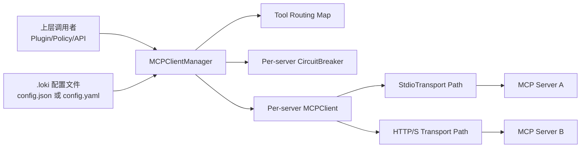
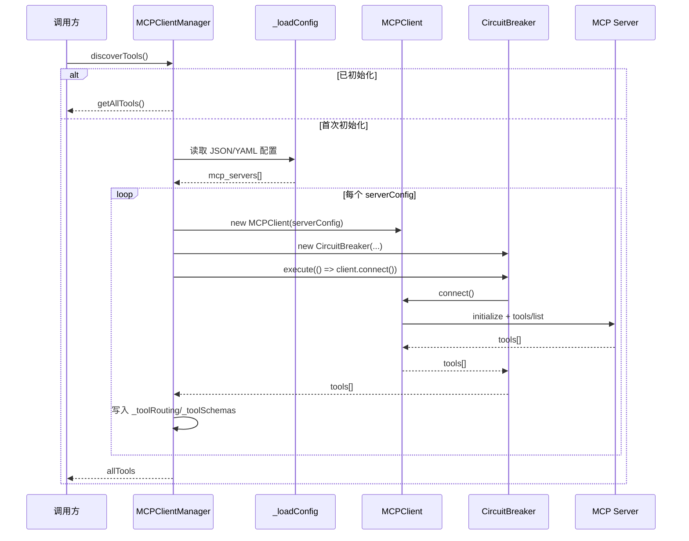
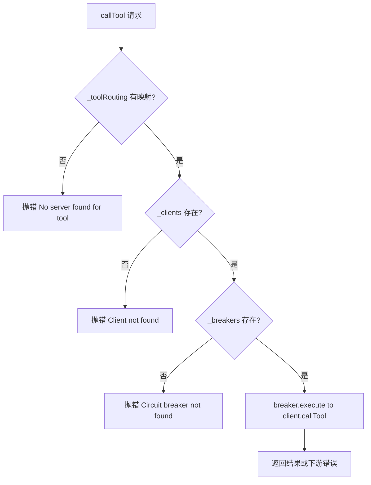
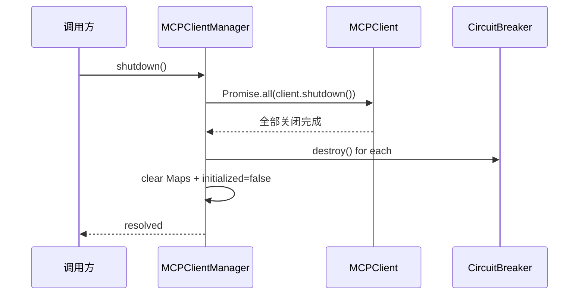

# client_manager_and_routing 模块文档

## 模块简介与设计动机

`client_manager_and_routing` 模块的核心是 `MCPClientManager`，它解决的是 **“一个进程如何稳定地管理多个 MCP Server，并把工具调用自动路由到正确后端”** 这个问题。在真实部署中，MCP 工具往往来自不同来源：有些是本地 `stdio` 子进程，有些是远程 HTTP/S 端点；它们的可用性、响应时间和失败模式也并不一致。如果上层业务直接持有所有连接并自行做路由与容错，复杂度会迅速失控。

`MCPClientManager` 的设计目标是把这种复杂性收敛在一个集中式管理器里：它从 `.loki` 配置读取 MCP Server 列表，逐一创建 `MCPClient`，为每个客户端绑定独立 `CircuitBreaker`，在工具发现阶段建立 `toolName -> serverName` 路由表，并在调用时执行透明路由。这样，上层只需关心“调用哪个工具”，而不需要关心“这个工具在哪台服务器、连接是否健康、何时降级”。

从安全与运维角度看，该模块还承担了两个关键职责：第一，限制配置目录必须位于项目根目录内，避免路径穿越读取任意文件；第二，内置一个“极简 YAML 解析器”并显式丢弃 `__proto__`/`constructor`/`prototype` 这类危险键，降低原型污染风险。整体上，这是一个面向生产环境、偏稳健保守的 MCP 多客户端编排层。

---

## 在系统中的位置

在整个 `MCP Protocol` 子系统中，本模块位于“客户端管理与路由”层，上游服务（例如插件系统、策略引擎或 API 层）通过它触达下游 `MCPClient`，再由 `MCPClient` 通过 `stdio` 或 HTTP/S 与实际 MCP Server 通信。



这张图反映了一个关键边界：`MCPClientManager` 本身不实现具体协议读写，它通过 `MCPClient` 完成协议交互；它也不实现熔断算法细节，而是把健康状态管理委托给 `CircuitBreaker`。因此它更像“编排器 + 注册中心 + 路由层”。关于底层连接协议和熔断细节，请分别参考 [MCPClient.md](MCPClient.md) 与 [CircuitBreaker.md](CircuitBreaker.md)。

---

## 核心组件：`MCPClientManager`

### 构造与内部状态

`MCPClientManager` 构造函数接收如下选项（均可选）：

- `configDir`：配置目录，默认 `.loki`
- `timeout`：默认请求超时（毫秒），默认 `30000`
- `failureThreshold`：熔断失败阈值，默认 `3`
- `resetTimeout`：熔断恢复等待时间（毫秒），默认 `30000`

构造阶段会立即调用 `validateConfigDir`，将 `configDir` 解析为绝对路径并验证其位于 `process.cwd()` 内部；若不满足直接抛错，阻止管理器实例化。

模块内部维护四个关键 Map：

- `_clients: Map<serverName, MCPClient>`
- `_breakers: Map<serverName, CircuitBreaker>`
- `_toolRouting: Map<toolName, serverName>`
- `_toolSchemas: Map<toolName, toolSchema>`

以及 `_initialized` 标志，确保发现流程幂等。

### 对外只读属性

- `initialized`：是否已完成发现流程
- `serverCount`：当前 `_clients.size`

需要注意，`serverCount` 表示“已创建客户端数量”，不严格等同“成功连接服务器数量”。因为客户端是在连接尝试前就插入 Map 的。

---

## 关键流程一：工具发现（`discoverTools`）

`discoverTools()` 是本模块最重要的入口。它的行为可概括为：读取配置、创建客户端与熔断器、尝试连接、收集工具、建立路由。



实现细节中有几个容易被忽略的点。

第一，方法是幂等的：`_initialized === true` 时不会再次连接，也不会重新读取配置，而是直接返回 `getAllTools()`。这避免重复初始化，但也意味着 **配置热更新不会自动生效**。

第二，单个服务器连接失败不会中断整体流程。失败会写入 `stderr`，然后继续处理下一台服务器。这是典型“部分可用优先”策略。

第三，工具冲突时采用“先到先得”：如果后接入服务器提供了同名工具，只记录 warning，不覆盖已有路由。该策略保证确定性，但要求你在多服务场景中主动做工具命名规范（例如前缀化）。

第四，返回值 `allTools` 与 `getAllTools()` 的语义有细微差异：`discoverTools` 会把每台服务器返回的工具都 push 进去，可能包含重名项；而 `getAllTools()` 来自 `_toolSchemas`，同名工具已按“先注册保留”去重。

---

## 关键流程二：工具调用路由（`callTool`）

调用阶段遵循“三段式校验 + 熔断执行”：先根据工具名查路由，再查客户端和熔断器，最后通过 `breaker.execute` 发起调用。



这个流程体现了“路由表驱动”的设计：`MCPClientManager` 不会广播调用，也不会在多服务器间做回退；它只按初始化时确定的映射进行单点转发。也就是说，一旦路由指向某台服务器，即便其他服务器存在同名工具，也不会自动切换。

---

## 关键流程三：生命周期收尾（`shutdown`）

`shutdown()` 会并行关闭所有客户端，再销毁所有熔断器并清空内部状态，最后将 `_initialized` 复位为 `false`。



由于 `discoverTools` 的幂等缓存，若你确实需要重新加载配置并重新发现工具，标准做法就是先 `shutdown()` 再调用 `discoverTools()`。

---

## 配置加载与解析机制

### 文件优先级

`_loadConfig()` 按以下顺序查找：

1. `${configDir}/config.json`
2. `${configDir}/config.yaml`
3. 都不存在则返回 `null`

如果 JSON 存在，将不会再读取 YAML。解析失败时仅写 `stderr` 并返回 `null`，不会抛异常。

### 支持的配置形态

典型 JSON 示例：

```json
{
  "mcp_servers": [
    {
      "name": "local-tools",
      "command": "node",
      "args": ["./servers/local-mcp.js"],
      "timeout": 15000
    },
    {
      "name": "remote-search",
      "url": "https://mcp.example.com/rpc",
      "auth": "bearer",
      "token_env": "MCP_REMOTE_TOKEN"
    }
  ]
}
```

典型 YAML 示例（仅限极简子集）：

```yaml
mcp_servers:
  - name: local-tools
    command: node
    args: ["./servers/local-mcp.js"]
    timeout: 15000
  - name: remote-search
    url: https://mcp.example.com/rpc
    auth: bearer
    token_env: MCP_REMOTE_TOKEN
```

### 极简 YAML 解析器的边界

`_parseMinimalYaml` 不是通用 YAML 解析器，它只支持非常有限的模式：顶层 key、顶层 key-value、以及“列表项对象 + 连续字段”形式。键名匹配 `\w+`，这意味着带 `-`、`.` 等字符的 key 可能无法按预期解析；复杂嵌套、锚点、多行字符串等高级特性也不支持。

如果你的配置需要复杂结构，建议直接使用 JSON，避免因为 YAML 子集限制造成静默解析偏差。

---

## 安全模型与防护点

### 1) 路径约束：`validateConfigDir`

`validateConfigDir(configDir)` 会把路径 resolve 成绝对路径，并校验该路径要么等于 `process.cwd()`，要么是它的子路径。若越界立即抛错。这一机制能防止通过相对路径（如 `../../`）或绝对路径跳出项目目录读取敏感文件。

### 2) 原型污染防护

在 YAML 解析过程中，`FORBIDDEN_KEYS = {"__proto__", "constructor", "prototype"}` 会在所有赋值路径上被过滤掉。策略是“静默跳过危险键”，从而避免对象原型被恶意注入。

### 3) 幂等发现与可预测状态

`discoverTools` 的幂等设计也属于一种安全/稳定性策略：避免重复初始化导致的连接风暴、重复注册、路由不一致。不过代价是缺乏自动重载能力，需要显式重建生命周期。

---

## 与下游组件的协作关系

`MCPClientManager` 自身并不处理协议包细节，它依赖两个关键组件：

- `MCPClient`：负责握手（initialize/initialized）、工具列表拉取（tools/list）和工具调用（tools/call），并封装 stdio/HTTP 传输。
- `CircuitBreaker`：负责对连接与调用执行熔断保护，避免故障服务器持续拖垮调用链。

这意味着同一个服务器的“连接失败”和“工具调用失败”会共同影响该服务器 breaker 状态。运维上应将 `getServerState(serverName)` 纳入健康监控，以便区分“工具本身失败”与“线路已被熔断”。

> 详细实现请参考：[MCPClient.md](MCPClient.md)、[CircuitBreaker.md](CircuitBreaker.md)、[Transport.md](Transport.md)。

---

## API 逐项说明

### `new MCPClientManager(options?)`

创建管理器实例并初始化内部容器。主要副作用是执行配置目录安全校验；如果目录越界会在构造期抛错。

### `initialized: boolean`（getter）

表示是否已经完成 `discoverTools` 首次初始化。该标志用于幂等控制，不表示所有服务器都健康。

### `serverCount: number`（getter）

返回当前已注册客户端数量。它反映“管理器维护了几台服务器条目”，不保证这些服务器都连接成功。

### `async discoverTools(): Promise<Array<ToolSchema>>`

执行发现流程并返回工具数组。若已初始化，直接返回当前去重后的工具集合。该方法会更新 `_clients`、`_breakers`、`_toolRouting`、`_toolSchemas`。

### `getToolsByServer(serverName): Array<ToolSchema>`

返回指定服务器的工具快照（`slice()` 拷贝）。若服务器不存在或尚未拿到工具，返回空数组。

### `getAllTools(): Array<ToolSchema>`

返回当前路由可见的全量工具（按工具名去重后的 schema 集合）。常用于构建“能力清单”。

### `async callTool(toolName, args): Promise<any>`

按 `toolName` 路由并执行调用。常见异常包括：找不到路由、客户端缺失、熔断器缺失、下游 RPC 错误、熔断器 OPEN 拒绝。

### `getServerState(serverName): string | null`

返回对应服务器 breaker 状态字符串；若服务器未知返回 `null`。可用于监控面板或告警指标上报。

### `async shutdown(): Promise<void>`

并发关闭所有客户端连接，销毁熔断器定时器与监听器，清空所有路由与缓存，并将管理器重置为未初始化状态。

### `validateConfigDir(configDir): string`

独立导出的安全工具函数，可在外部配置装载流程中复用。若路径不在项目根目录内则抛异常。

---

## 实战使用模式

### 模式一：标准启动与调用

```javascript
const { MCPClientManager } = require('./src/protocols/mcp-client-manager');

async function bootstrapAndRun() {
  const manager = new MCPClientManager({
    configDir: '.loki',
    timeout: 30000,
    failureThreshold: 3,
    resetTimeout: 30000
  });

  try {
    await manager.discoverTools();
    const result = await manager.callTool('search_docs', { query: 'circuit breaker' });
    return result;
  } finally {
    await manager.shutdown();
  }
}
```

### 模式二：服务健康探测

```javascript
function collectMcpHealth(manager, serverNames) {
  return serverNames.map((name) => ({
    server: name,
    state: manager.getServerState(name) || 'UNKNOWN'
  }));
}
```

### 模式三：强制重载配置

```javascript
async function reload(manager) {
  await manager.shutdown();
  return manager.discoverTools();
}
```

这个模式适用于配置变更后重新发现工具的场景，因为管理器默认不会自动刷新。

---

## 扩展与定制建议

如果你计划扩展 `client_manager_and_routing`，建议沿着“保持路由层简洁”的原则进行：

- 若需要支持更多配置格式（例如 TOML/远程配置中心），优先在 `_loadConfig` 层扩展，不要污染调用链逻辑。
- 若需要路由策略升级（例如同名工具按租户/优先级路由），建议将 `_toolRouting` 从 `toolName -> serverName` 提升为“策略对象”，再在 `callTool` 中引入选择器。
- 若希望更强可观测性，可在 `discoverTools` 和 `callTool` 周围增加结构化日志与指标埋点（成功率、延迟、熔断次数）。

如果你只需要底层协议增强（例如 SSE、多路复用、OAuth 细节），应优先修改 `MCPClient` 或 transport/auth 子模块，而不是在管理器层堆叠协议逻辑。

---

## 边界条件、错误条件与已知限制

### 边界条件

- 当配置文件不存在、不可解析或 `mcp_servers` 为空时，`discoverTools` 会返回空数组并标记为已初始化。
- `serverConfig.name` 缺失的条目会被静默跳过，不会创建客户端。
- `getToolsByServer` 在未连接或无工具缓存时返回空数组而非异常。

### 错误条件

- `callTool` 找不到路由时立即抛错 `No server found for tool: ...`。
- 对应客户端/熔断器不存在时分别抛 `Client not found...` / `Circuit breaker not found...`。
- breaker 为 OPEN 且未到恢复窗口时，下游调用会抛带 `CIRCUIT_OPEN` 的错误。

### 已知限制与运维注意

- 配置目录校验依赖 `process.cwd()`；若宿主进程会动态改变 cwd，路径判定可能与预期不一致。
- YAML 解析器是最小实现，不适合复杂配置。
- 工具同名冲突只警告不覆盖，且缺少命名空间机制。
- 日志输出使用 `process.stderr.write`，缺少统一日志级别与结构化字段。
- `discoverTools` 与 `shutdown` 不是并发安全事务；在高并发场景应由上层保证串行生命周期控制。

---

## 与其他文档的关联

为了避免重复，本页只覆盖“多客户端管理与路由”职责。请结合以下文档阅读：

- [MCP Protocol.md](MCP Protocol.md)：MCP 子系统总览与上下文
- [MCPClient.md](MCPClient.md)：单客户端协议运行时、请求收发与连接模型
- [CircuitBreaker.md](CircuitBreaker.md)：熔断状态机与恢复机制
- [Transport.md](Transport.md)：传输层实现（stdio / SSE / HTTP 相关能力）
- [auth_validation.md](auth_validation.md)：认证校验相关（如 OAuth）
