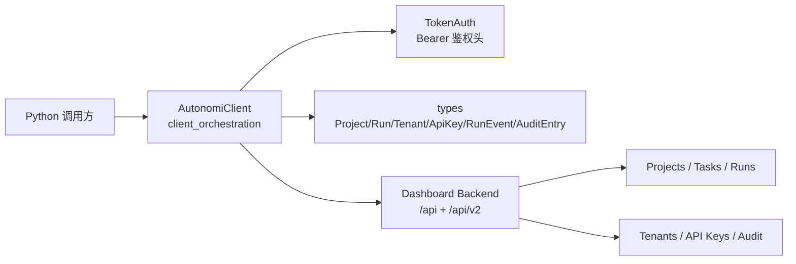
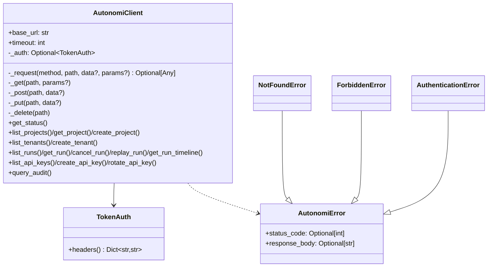
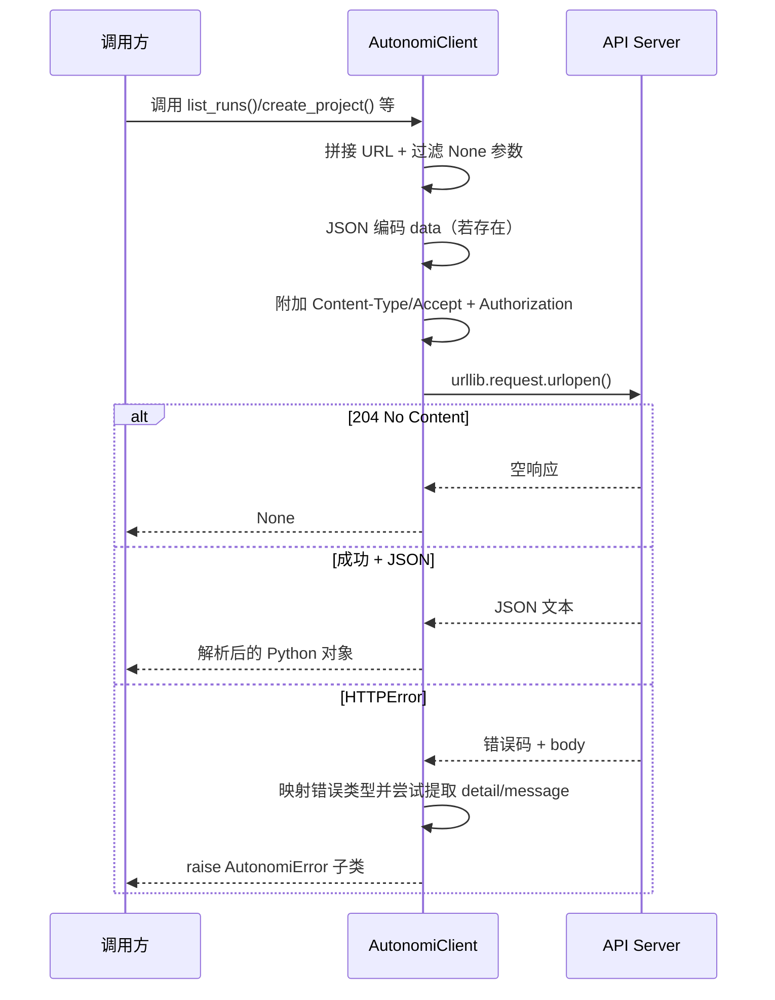
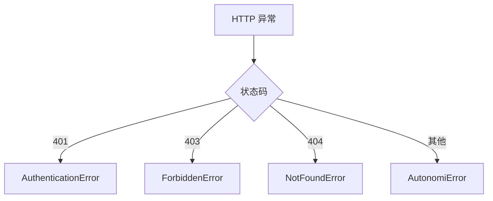
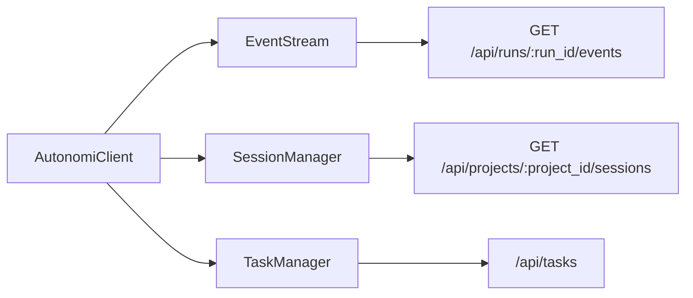

# client_orchestration（Python SDK）模块文档

## 1. 模块简介

`client_orchestration` 是 Python SDK 中的“统一编排入口”，核心组件是 `sdk.python.loki_mode_sdk.client.AutonomiClient`。它的职责不是实现业务规则本身，而是把 Autonomi Control Plane 的 HTTP API 调用流程标准化：统一 URL 构造、统一认证头注入、统一 JSON 编解码、统一错误映射，以及统一资源对象反序列化。

这个模块存在的根本原因，是避免业务调用方在每个脚本、每个服务里重复写 `urllib` 请求模板代码。通过把传输层细节收敛到一个客户端类，SDK 用户可以直接使用语义化方法（如 `list_projects()`、`cancel_run()`、`query_audit()`）操作系统资源，并获得稳定、可预测的行为。对维护者而言，这种设计也显著降低了 API 演进成本：当后端路径、鉴权方式或错误响应格式变化时，通常只需在 `AutonomiClient` 的内部实现集中调整。

从 Python SDK 的分层看，本模块位于：

- 上游：应用脚本、自动化任务、CI/CD 工具、运维控制台适配层
- 平级协作：`event_streaming`（`EventStream`）、`resource_managers`（`SessionManager`、`TaskManager`）
- 下游依赖：`type_contracts`（`Project`、`Run`、`Tenant` 等数据类）和 Dashboard Backend API

如需深入了解类型结构，可参考 [python_sdk_type_contracts.md](python_sdk_type_contracts.md)；如需查看事件与资源管理扩展层，可参考 [event_streaming.md](event_streaming.md) 与 [resource_managers.md](resource_managers.md)。

---

## 2. 在整体系统中的定位



`AutonomiClient` 是 Python SDK 的“控制平面入口适配器”。它将后端 REST 风格接口转换为 Python 方法调用，并把返回体映射为 SDK 类型对象，使调用方不必直接关心 HTTP 细节。与 `EventStream`、`SessionManager`、`TaskManager` 相比，本模块覆盖的是更核心、更通用的控制面操作；后两者属于在客户端之上的按领域拆分扩展。

---

## 3. 设计理念与架构拆解



该模块采用“薄业务方法 + 厚内部请求内核”的模式。资源方法只负责参数语义和路径拼装，真正的通用逻辑集中在 `_request()`。这种结构带来的直接收益是：

1. 一致性更高：所有请求都走同一条鉴权、超时、解析和错误处理路径。
2. 可维护性更强：新增资源接口通常只是新增一个薄封装方法。
3. 风险收敛：网络层行为变更可以在单点修复，不必多处排查。

---

## 4. 核心组件深度解析

### 4.1 `AutonomiClient`

#### 4.1.1 初始化行为

构造函数签名如下：

```python
AutonomiClient(
    base_url: str = "http://localhost:57374",
    token: Optional[str] = None,
    timeout: int = 30,
)
```

初始化时会执行以下关键动作：

- `base_url.rstrip("/")`：消除尾部斜杠，避免路径拼接时出现 `//api/...`。
- `timeout`：作为 `urlopen(..., timeout=self.timeout)` 的秒级超时参数。
- `token`：存在时构造 `TokenAuth(token)`，后续自动附加 `Authorization: Bearer <token>`。

这里的设计目标是“最小配置可运行 + 明确默认值”。本地开发可零配置直连默认地址，生产环境可显式覆盖三项配置。

#### 4.1.2 `_request()`：统一请求执行器



`_request()` 的行为细节非常关键：

- 它会先过滤 query 参数中值为 `None` 的键，避免发送无意义参数。
- `data` 非空时使用 `json.dumps(...).encode("utf-8")` 作为请求体。
- 无论方法类型，都会添加 `Content-Type: application/json` 与 `Accept: application/json`。
- 成功响应里，`204` 或空 body 返回 `None`；有 body 时按 JSON 解析。
- `HTTPError` 会被映射到更具体的异常（401/403/404）。

> 注意：当前实现只显式捕获了 `urllib.error.HTTPError`。像 `URLError`（DNS 失败、连接被拒绝、网络不可达）会直接向上抛出原始异常，而不是转换为 `AutonomiError`。这是一个重要行为边界。

#### 4.1.3 快捷方法 `_get/_post/_put/_delete`

这四个方法是 `_request()` 的轻量包装，目的是减少业务方法中的模板重复：

- `_get(path, params=None)`
- `_post(path, data=None)`
- `_put(path, data=None)`
- `_delete(path)`

其中 `_delete()` 忽略返回值，表示该类删除操作默认关注“是否成功”而非响应体。

---

### 4.2 错误体系：`AutonomiError` 及子类



`AutonomiError` 提供三个信息层级：

- `message`：可读错误消息
- `status_code`：HTTP 状态码（若可获得）
- `response_body`：原始响应体（便于排查）

内部还有一个 `_STATUS_ERROR_MAP`，用于将常见权限类错误映射为专用异常，便于调用侧按类型处理，而不是做字符串匹配。

---

## 5. 对外能力分组与方法说明

### 5.1 Status

`get_status() -> Dict[str, Any]` 调用 `GET /api/status`。如果后端返回空体，会回退为 `{}`，保证调用侧能稳定处理字典结果。

### 5.2 Projects

- `list_projects() -> List[Project]`
- `get_project(project_id: str) -> Project`
- `create_project(name: str, description: Optional[str] = None) -> Project`

这组方法对应 `/api/projects` 资源。`list_projects()` 兼容两种返回形态：

1. 直接数组：`[...]`
2. 包装对象：`{"projects": [...]}`

这种兼容设计反映了 SDK 对后端响应格式差异的容忍度，能降低接口演进时的脆弱性。

### 5.3 Tenants（v2）

- `list_tenants() -> List[Tenant]`
- `create_tenant(name: str, description: Optional[str] = None) -> Tenant`

对应 `/api/v2/tenants`。行为与 Projects 类似，也兼容数组与包装对象（`{"tenants": [...]}`）两种结构。

### 5.4 Runs（v2）

- `list_runs(project_id: Optional[str] = None, status: Optional[str] = None) -> List[Run]`
- `get_run(run_id: str) -> Run`
- `cancel_run(run_id: str) -> Run`
- `replay_run(run_id: str) -> Run`
- `get_run_timeline(run_id: str) -> List[RunEvent]`

这组方法覆盖运行生命周期的主要控制动作。`list_runs()` 会只发送非空过滤参数；`get_run_timeline()` 同样兼容数组与 `{"events": [...]}` 包装结构。

### 5.5 API Keys（v2）

- `list_api_keys() -> List[ApiKey]`
- `create_api_key(name: str, role: str = "viewer") -> Dict[str, Any]`
- `rotate_api_key(identifier: str, grace_period_hours: int = 24) -> Dict[str, Any]`

这里特意返回 `Dict[str, Any]`（而非强类型对象）的原因是：创建/轮换密钥通常会带一次性返回字段（如原始 token），字段形态可能随策略扩展而变化。

### 5.6 Audit（v2）

`query_audit(start_date=None, end_date=None, action=None, limit=100) -> List[AuditEntry]`。

它将筛选条件编码到 query string，并把结果映射为 `AuditEntry` 对象列表。`limit` 默认值是 100，可作为安全上限避免一次查询拉取过多记录。

---

## 6. 与同 SDK 其他模块的协作关系



`EventStream`、`SessionManager`、`TaskManager` 都通过组合 `AutonomiClient` 实例来工作，而不是重复实现网络层。这说明 `client_orchestration` 在 Python SDK 中承担了“基础设施层客户端”的角色。若你要做新的资源管理器（例如 `AgentManager`），建议采用同样的组合方式。

---

## 7. 使用示例

### 7.1 基础初始化与项目查询

```python
from sdk.python.loki_mode_sdk.client import AutonomiClient

client = AutonomiClient(
    base_url="http://localhost:57374",
    token="loki_xxx",
    timeout=30,
)

status = client.get_status()
projects = client.list_projects()
print(status, len(projects))
```

### 7.2 创建项目并触发 Run 操作

```python
project = client.create_project("SDK Demo", description="created by python sdk")
runs = client.list_runs(project_id=project.id, status="running")

for run in runs:
    client.cancel_run(run.id)
```

### 7.3 API Key 轮换

```python
rotate_result = client.rotate_api_key("key_123", grace_period_hours=12)
print("rotation result:", rotate_result)
```

### 7.4 异常分类处理

```python
from sdk.python.loki_mode_sdk.client import (
    AuthenticationError,
    ForbiddenError,
    NotFoundError,
    AutonomiError,
)

try:
    run = client.get_run("non-exist")
except AuthenticationError:
    print("token 无效或过期")
except ForbiddenError:
    print("权限不足")
except NotFoundError:
    print("资源不存在")
except AutonomiError as e:
    print("HTTP 错误", e.status_code, e.response_body)
```

---

## 8. 配置、行为约束与运行注意事项

`AutonomiClient` 的配置面很小，但每项都直接影响稳定性。`base_url` 建议始终显式配置并与环境变量绑定；`timeout` 建议根据网络条件调整，跨地域部署场景下通常需要大于默认值。`token` 未提供时，客户端会以匿名方式访问接口，若后端开启权限控制，多数写操作会返回 401/403。

在请求编码层面，模块默认以 JSON 作为输入输出协议，并且统一设置 `Content-Type: application/json`。这与 Dashboard Backend 的主流接口契合，但如果你接入的是定制代理网关，需要确认它对无 body 请求头的容忍度。

---

## 9. 边界条件、错误场景与已知限制

第一，返回类型注解与真实运行值存在轻微不一致。`_request()` 标注为 `Optional[Dict[str, Any]]`，但实际可能返回 `list`（例如列表接口直接返回数组）。当前业务方法内部已做兼容处理，但如果外部直接调用 `_request()`，需要自行处理这一点。

第二，网络层异常覆盖不完整。代码只捕获 `HTTPError`，未捕获 `URLError` 与 JSON 解析异常。这意味着连接失败、DNS 问题或后端返回非 JSON 成功体时，可能抛出标准库原始异常。上层应用若追求鲁棒性，建议统一包装调用并做异常归一化。

第三，模块是同步阻塞模型。它基于 `urllib.request.urlopen`，不提供异步并发能力，也没有内建连接池、重试、退避、熔断或限流。这是“轻量零依赖”设计的取舍，不适合作为高吞吐批处理的唯一访问层。

第四，安全敏感返回值需要调用方妥善处理。例如 `create_api_key()` 可能返回一次性明文 token，必须避免写入普通日志。

---

## 10. 扩展与二次开发建议

扩展新接口时，推荐延续当前模式：新增一个语义化公共方法，内部只负责 path/payload/params 组装，仍复用 `_get/_post/_put/_delete`。如果要增强全局能力（如 trace-id、重试、幂等 key、统一审计日志），优先改造 `_request()`，避免把横切逻辑散落到每个业务方法。

在更复杂系统中，可以将 `AutonomiClient` 作为基础客户端，再包一层面向业务域的 service facade。例如：`ProjectAutomationService`、`RunOpsService`。这样既保留 SDK 原子能力，也能把组织内部规范（重试策略、告警规则）放在外层实现。

---

## 11. 关联阅读

- [Python SDK.md](Python%20SDK.md)
- [event_streaming.md](event_streaming.md)
- [resource_managers.md](resource_managers.md)
- [python_sdk_type_contracts.md](python_sdk_type_contracts.md)
- [api_surface_and_transport.md](api_surface_and_transport.md)
- [Dashboard Backend.md](Dashboard%20Backend.md)

总体来说，`client_orchestration` 的价值不在“复杂编排算法”，而在“可预测的访问基线”。它把控制平面的调用约定固化为稳定 Python API，是整个 Python SDK 可维护性与可扩展性的基础。