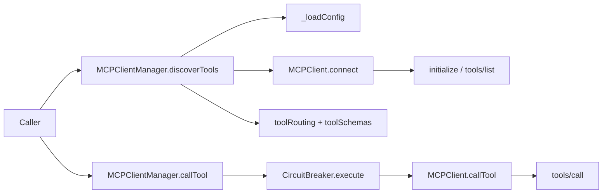

# client_orchestration_and_resilience

`client_orchestration_and_resilience` 模块可以把它想象成「MCP 世界里的总调度台 + 保险丝盒」。系统可能要同时接多个 MCP server（本地子进程、远程 HTTP 端点都可能），而且这些 server 的稳定性、可用工具集、响应时延都不一致。这个模块的存在，就是为了让上层调用方不用关心“该连谁、怎么连、挂了怎么办”，只要按工具名调用即可。相比朴素实现里“每次调用都临时连一个 server、失败就直接向上抛”的做法，它在连接编排、工具路由、失败隔离和恢复策略上做了集中治理。

## 模块要解决的核心问题

在多 MCP server 场景里，真正困难的不是“发一个 JSON-RPC 请求”，而是**持续地、可恢复地管理一组不可靠后端**。朴素方案通常会踩到三类坑：第一，工具和 server 的映射散落在业务代码里，改配置会牵一发而动全身；第二，某个 server 持续失败时会拖垮整个调用链（重试风暴、线程占满、超时堆积）；第三，不同传输方式（stdio/HTTP）和协议细节（initialize、tools/list、tools/call）让调用方被迫理解底层。

这个模块的设计洞察是：把“单 server 协议执行”和“多 server 编排与韧性控制”明确分层。`MCPClient` 专注一个 server 的协议生命周期，`CircuitBreaker` 负责失败状态机，`MCPClientManager` 负责跨 server 的发现、路由和资源收口。这样既能保证职责清晰，也让故障域天然隔离到 server 级别。

## 心智模型（Mental Model）

可以用机场系统来类比：

`MCPClientManager` 像塔台，维护“航班（tool）由哪个跑道（server）起降”的路由表；`MCPClient` 像单跑道地面控制，负责和某个具体航班系统按标准流程通信（握手、查询能力、执行调用）；`CircuitBreaker` 像跑道安全开关，当某跑道连续事故过多就临时封闭，过一段时间再放一架测试航班（HALF_OPEN）验证是否恢复。

这个模型下，上层只需要记住两件事：工具发现阶段建立路由，运行阶段按工具名调用并自动经过断路器保护。

## 架构与数据流



在启动（或首次使用）路径里，调用方先触发 `MCPClientManager.discoverTools()`。它从 `config.json`/`config.yaml` 读取 `mcp_servers`，为每个 server 创建一对对象：`MCPClient`（协议客户端）和 `CircuitBreaker`（故障防护）。随后通过 `breaker.execute(() => client.connect())` 执行连接，这个细节很关键：连通性问题也被计入断路器状态，而不仅仅是业务调用失败。

`MCPClient.connect()` 会执行 MCP 协议最小闭环：如果是 stdio 先拉起子进程，然后发 `initialize`，再发 `tools/list`，拿到工具清单并缓存到 `this._tools`。Manager 收集所有工具后，写入两张核心映射表：`_toolRouting`（toolName -> serverName）和 `_toolSchemas`（toolName -> schema）。

运行时路径中，`MCPClientManager.callTool(toolName, args)` 先查 `_toolRouting` 找 server，再找到对应 client 和 breaker，最终执行 `breaker.execute(() => client.callTool(toolName, args))`。也就是说每次调用都会穿过断路器状态机：OPEN 时快速失败，避免对故障 server 继续施压；reset 窗口后进入 HALF_OPEN 试探恢复。

关闭路径则由 `MCPClientManager.shutdown()` 统一收口：并发调用所有 client 的 `shutdown()`，销毁所有 breaker，清空内部 map 并把 `_initialized` 置回 `false`，避免脏状态跨生命周期泄漏。

## 核心组件深潜

## `validateConfigDir(configDir)`

这个函数是管理器外层的一道安全边界。它把传入目录 `path.resolve` 后，强制要求仍位于 `process.cwd()` 之内，否则抛错。设计意图是阻断路径穿越，让配置读取只能发生在项目根下。这里的取舍很明确：牺牲一点“任意路径配置”的灵活性，换来默认安全。

## `MCPClientManager`

`MCPClientManager` 是模块里的编排中枢，内部状态以多个 `Map` 组织：`_clients`、`_breakers`、`_toolRouting`、`_toolSchemas`。这种并行 map 结构看似朴素，但对热点路径很友好：查路由和拿 client 都是 O(1)，适合高频 `callTool`。

`discoverTools()` 是最关键入口。它是幂等的：若 `_initialized` 已是 `true`，直接返回 `getAllTools()`，不会重复连 server。第一次执行时，它逐个 server 连接并注册工具；若同名工具冲突，采用“先到先得”，后者只打印 warning 不覆盖。这个策略减少了运行时不确定性（不会因为后连上的 server 改写已有路由），但代价是配置顺序变成隐式优先级，新贡献者非常需要注意。

配置读取由 `_loadConfig()` 完成，优先 `config.json`，不存在再尝试 `config.yaml`。YAML 解析不是通用库，而是 `_parseMinimalYaml()` 的最小子集实现，并且在所有赋值路径跳过 `__proto__`/`constructor`/`prototype`，防止原型污染。这是一个典型“受限能力换安全与可控性”的设计：功能不全，但行为可预测、攻击面小。

`callTool()` 不做重试，只做路由校验和断路器执行。这里体现了边界意识：管理器负责“发给谁、能不能发”，不负责“怎么重试才最优”。如果未来要加重试，应该明确放在更高层策略模块，避免与断路器策略耦合成难以推理的组合行为。

## `MCPClient`

`MCPClient` 处理单 server 协议与传输细节，继承 `EventEmitter` 并对外发出 `connected`、`disconnected`、`stderr`、`exit`、`error` 等事件。它支持两种传输：有 `url` 时走 HTTP JSON-RPC POST，否则走 stdio 子进程。

连接阶段的一个关键细节是并发保护：`connect()` 用 `_connectingPromise` 合并并发连接请求，避免同一 client 被重复初始化。这个设计在真实系统里很重要，因为 manager 或上层服务可能在并发启动路径里多次触发 connect。

协议层固定走 `initialize -> initialized(notification) -> tools/list`。只有拿到工具列表后才标记 `_connected=true`，这保证了“connected”语义是可调用状态，而不是仅仅“socket 建立成功”。

安全与鲁棒性方面，`MCPClient` 做了几层保护：

- `validateCommand()` 阻止把 shell 解释器当命令执行，降低命令注入/脚本拼接风险。
- stdio 输入缓冲受 `MAX_BUFFER_BYTES`（10MB）上限保护，异常 server 不会无限占内存。
- HTTP 响应体受 `MAX_RESPONSE_BYTES`（50MB）上限保护，超限直接中止请求。
- 每个 request 都有 timeout，超时会从 `_pendingRequests` 清理，避免悬挂 promise 积压。

`_sendRequest()` 的实现也体现了统一抽象：不管底层是 stdio 还是 HTTP，都先登记 pending（含 timer），再在响应路径统一 resolve/reject。这样调用侧无需关心 transport 分支差异。

## `CircuitBreaker`

`CircuitBreaker` 是经典三态机：`CLOSED`、`OPEN`、`HALF_OPEN`。其 `execute(fn)` 语义非常直接：OPEN 状态下若没到 reset 时间就立刻拒绝并抛 `CIRCUIT_OPEN`；到期后自动转 HALF_OPEN 放行一次试探；成功回 CLOSED，失败回 OPEN。

实现上的一个小但实用的点是 `setTimeout(...).unref()`，它避免仅因断路器计时器导致进程无法退出。`destroy()` 会清理 timer 并移除监听器，和 manager 的 shutdown 配合，防止长生命周期进程里出现资源泄漏。

## 依赖关系与契约

从调用方向看，这个模块内部的关键关系非常清晰：`MCPClientManager` 直接依赖并创建 `MCPClient` 与 `CircuitBreaker`；`MCPClient` 依赖 Node 内建 `child_process/http/https/events`；`CircuitBreaker` 依赖 `events`。也就是说，模块核心能力建立在 Node 标准库之上，没有引入额外运行时框架。

从数据契约看，有三组最重要：

第一组是配置契约。`discoverTools()` 期待配置对象包含 `mcp_servers` 数组，元素里至少要有 `name`，其余如 `command/args/url/auth/token_env/timeout` 为可选。`name` 缺失会被跳过。

第二组是工具契约。Manager 在注册阶段按 `tool.name` 建路由，因此 tool schema 至少要提供稳定的 `name` 字段。若上游 MCP server 改变 tool naming 规则，会直接破坏 `callTool(toolName, ...)` 的可达性。

第三组是 JSON-RPC 契约。`MCPClient` 假定响应可解析为 JSON，并且与请求 id 对应；若 server 返回非 JSON 或不带 id，pending 请求会靠 timeout 回收并报错。

与外部模块连接方面，本模块属于 MCP Protocol 下游基础设施，建议读者结合 [MCP Protocol](MCP Protocol.md)、[MCPClient](MCPClient.md)、[MCPClientManager](MCPClientManager.md)、[CircuitBreaker](CircuitBreaker.md)、[transport_adapters](transport_adapters.md) 一起看，不在此重复其全部背景。

## 设计取舍与原因

这个实现明显偏向“稳定可运行的最小复杂度”。例如 YAML 选择最小子集解析而非完整 YAML 引擎，牺牲了语法兼容性，但规避了复杂 parser 带来的维护和安全成本。再如工具冲突采用先注册优先，避免动态覆盖导致线上行为漂移，但也把优先级规则隐含在配置顺序里。

在韧性策略上，它选择了断路器而非内建重试。断路器可以快速阻断级联故障，保护系统整体吞吐；不做重试则避免“重试 + 断路器”叠加后的时序复杂度。代价是短暂抖动场景下，调用方可能更早看到失败，需要上层按业务语义决定是否补偿。

在状态管理上，Manager 维护可变 map 并提供 `shutdown()` 做显式生命周期重置。相比不可变快照模型，这种做法更轻量、性能更好，但要求调用方遵守时序契约：不要在 shutdown 并发期间继续发起 `callTool`。

## 使用方式与示例

```javascript
const { MCPClientManager } = require('./src/protocols/mcp-client-manager');

async function main() {
  const manager = new MCPClientManager({
    configDir: '.loki',
    timeout: 30000,
    failureThreshold: 3,
    resetTimeout: 30000
  });

  const tools = await manager.discoverTools();
  console.log('discovered tools:', tools.map(t => t.name));

  const result = await manager.callTool('some_tool', { input: 'hello' });
  console.log(result);

  await manager.shutdown();
}
```

常见模式是进程启动时执行一次 `discoverTools()` 做预热，然后请求路径直接 `callTool()`。如果你需要观测某 server 当前熔断状态，可调用 `getServerState(serverName)`。

## 新贡献者最该注意的坑

第一，`discoverTools()` 幂等且一次性缓存路由。配置文件在运行中变化不会自动生效；要重载必须显式 `shutdown()` 后重新 discover。

第二，工具重名冲突不会报错中断，只会 warning，且后者被忽略。这在多团队并行接入 server 时很容易造成“明明连上了但工具始终打到旧 server”的错觉。

第三，`MCPClient.callTool()` 依赖已连接状态；如果你绕过 manager 直接操作 client，必须先 `connect()`。

第四，stdio 模式依赖“每行一条 JSON-RPC 消息”的 framing。若 server 不按换行分隔输出，客户端无法正确解析响应。

第五，HTTP 模式把 `url` 当完整 endpoint 使用，不做路径拼接。传错路径时你会得到看似协议错误的返回，本质是地址错误。

第六，断路器按“连续失败”计数。某些间歇性成功会重置失败计数，导致 OPEN 触发比你预期更晚；调参时要结合真实错误分布，而不是只看平均失败率。

## 参考文档

- [MCP Protocol](MCP Protocol.md)
- [MCPClientManager](MCPClientManager.md)
- [MCPClient](MCPClient.md)
- [CircuitBreaker](CircuitBreaker.md)
- [transport_adapters](transport_adapters.md)
