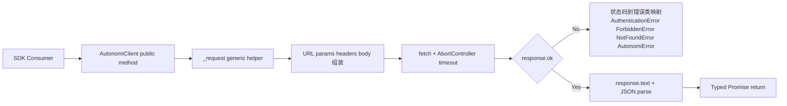

# client_transport_and_error_mapping

`client_transport_and_error_mapping` 模块本质上是 TypeScript SDK 的“边境关口”：它把上层业务代码的函数调用，稳定地翻译成 HTTP 请求，再把后端返回（尤其是失败返回）翻译成可编程处理的错误对象。你可以把它想象成一个机场的国际到达层——外面来的信息格式混杂、状态码粗糙、网络行为不稳定，而模块的职责是把这些不确定性收口成统一、可预期、可捕获的 SDK 语义。

## 这个模块在解决什么问题（先讲问题空间）

如果没有这个模块，SDK 使用方通常会在每个 API 方法里重复做同一批“基础但易错”的工作：拼 URL、加 token、处理超时、序列化 body、解析响应、按状态码抛错。朴素实现看似简单，但很快会出现三个问题。第一是**重复逻辑扩散**：十几个 API 方法每个都写一遍网络流程，维护成本和不一致风险线性增长。第二是**错误语义泄漏**：调用方只能拿到原始 `fetch` 错误或裸状态码，业务层不得不自行做二次判断。第三是**跨构建形态一致性**：SDK 同时有 `src`、`dist` 运行时代码和 `d.ts` 类型声明，如果协议细节散落到多处，很容易出现“类型说 A、运行时做 B”的漂移。

这个模块的设计洞察是：把“传输”和“错误映射”作为一个内聚核心，集中在 `AutonomiClient._request<T>()`。其他公开 API（如 `listProjects()`、`getRun()`）只描述资源语义，不重复传输细节。

## 心智模型：一层薄编排 + 一层厚适配

理解这个模块最有效的方式，是把 `AutonomiClient` 看成两层：

- 薄编排层：公开方法（`listTasks`、`createTenant` 等）只负责“业务意图到 HTTP 形状”的轻量映射（路径、method、少量参数重命名）。
- 厚适配层：`_request<T>()` 负责所有跨接口共享的传输规则和错误规则。

这类似“插座转换器”模型：上层每个方法像不同国家的插头形状，但都必须先经过同一个转换器，才能安全接到电网。转换器统一处理电压（超时）、接地（认证头）、故障保护（错误分类）。

## 架构与数据流



端到端看一次典型调用，例如 `listRuns(projectId, status)`：它先把可选过滤条件转换成 `params`（`project_id`、`status`），然后委托 `_request<Run[]>()`。`_request` 负责将 `baseUrl + path + query` 合并为完整 URL，添加 `Content-Type`，如有 `token` 则自动加 `Authorization: Bearer ...`。随后通过 `AbortController` 实现超时中断，执行 `fetch`。返回后统一读 `response.text()`：若失败则尝试从 JSON 中抽取 `error/message/detail`，按 `401/403/404` 映射为专用错误类；若成功且 body 为空则返回 `undefined as T`，否则 JSON 反序列化为 `T`。

这个流转的关键是：**公开方法永远不直接接触 `fetch`**，所以协议级行为只在一个热点路径里定义。

## 组件深潜

### `sdk.typescript.src.client.AutonomiClient`

这是源码中的真实实现，也是本模块的核心。构造函数接收 `ClientOptions`，做了三个基础配置动作：去掉 `baseUrl` 末尾斜杠、保存可选 `token`、设置默认 `timeout`（30 秒）。这个“去尾斜杠”看似细节，实际上是为了保证路径拼接不出现 `//api/...` 的歧义行为。

`_request<T>(method, path, body?, params?)` 是设计中心。它使用泛型 `T`，让每个公开方法在调用点声明返回类型，既减少重复 cast，又让使用者在 IDE 中得到稳定类型推导。内部机制上，它先构建查询字符串，再统一 headers，再在 `body != null` 时做 JSON 序列化。这里选择 `body != null` 而不是简单 truthy 判断，避免 `0`、`false` 等合法值被误判成“无 body”。

超时通过 `AbortController` + `setTimeout` 实现，且在 `catch` 与 `finally` 都调用 `clearTimeout(timeoutId)`，这是一种偏保守但稳健的资源回收写法。网络异常（包括主动 abort）被包装成 `AutonomiError(msg, 0)`，用 `statusCode = 0` 明确区分“未拿到 HTTP 响应”的失败类型。

错误映射部分先读 `response.text()`，再在失败分支尝试 JSON 解析并提取语义字段。这比直接 `response.json()` 更宽容：即便后端返回纯文本，也不会因 JSON 解析失败丢掉原始信息。随后的 `switch` 把 401/403/404 提升为特化错误类，其余保留为通用 `AutonomiError`。

公开 API 方法按资源域分组（Status、Projects、Tasks、API Keys、Runs、Tenants、Audit），几乎都只是“参数整形 + `_request`”。例如 `createTask` 把 SDK 参数名映射为后端字段 `project_id`，`queryAudit` 则只在参数存在时才拼接 query，避免发送空参数污染请求语义。

### `sdk.typescript.dist.client.AutonomiClient`

这是编译后的分发实现，逻辑与 `src` 对齐，目的是让 npm 消费者直接执行。架构角度上，它不是新设计，而是源码契约的运行时镜像。对维护者来说，出现行为差异时应优先视为构建或发布流程问题，而不是“两个客户端并行演进”。

### `sdk.typescript.dist.client.d.AutonomiClient`

这是类型声明面的公开契约。它把 `AutonomiClient` 的方法签名、泛型返回、参数可选性暴露给 TypeScript 使用者。这个组件的价值在于：即便消费者不看源码，也能靠 `.d.ts` 获得准确编译期约束。它与 `dist/client.js`、`src/client.ts` 三者共同构成“实现—分发—类型”三位一体。

### 错误类型：`AutonomiError`、`AuthenticationError`、`ForbiddenError`、`NotFoundError`

这些类虽然定义在 `errors` 模块，但在本模块中承担关键映射终点。`AutonomiError` 扩展了 `statusCode` 与 `responseBody`，让上层在日志和重试策略里能拿到更多上下文；三个子类分别固化 401/403/404，便于调用方用 `instanceof` 做分支处理，而不是硬编码数字状态码。

## 依赖与契约分析

从代码依赖关系看，本模块向下依赖两类内容：

第一类是类型契约（`ClientOptions`、`Project`、`Task`、`Run`、`Tenant` 等），它们定义了“请求/响应长什么样”；第二类是错误模型（`AutonomiError` 及其子类），它们定义了“失败如何被表达”。这意味着本模块是一个**契约执行器**：把类型层的声明与网络层的现实对齐。

向上看，虽然当前提供的信息没有列出具体 `depended_by` 组件，但从模块树可确定它位于 `TypeScript SDK -> client_transport_and_error_mapping`，因此它是 SDK 消费者进入控制平面的主要入口。调用方隐含依赖两个约定：一是所有公开 API 都返回 `Promise<typed data>`；二是失败会抛出上述错误层级，而不是返回错误对象。

与后端的契约点主要有三个：路径命名（如 `/api/v2/runs`）、字段命名（如 `project_id`、`grace_period_hours`）、错误体字段习惯（`error/message/detail`）。如果后端在这些点发生破坏性变化，这个模块会是首个受影响层。

可参考相关文档了解上下游：

- [TypeScript SDK](TypeScript SDK.md)
- [api_surface_and_transport](api_surface_and_transport.md)
- [error_model](error_model.md)
- [api_type_contracts](api_type_contracts.md)

## 设计决策与权衡

这个模块明显选择了“集中式私有传输函数”而不是“每个 API 方法独立实现”。代价是 `_request` 成为高耦合热点；收益是协议一致性和可维护性显著提升。在 SDK 这种“接口多、行为同构”的场景，这个取舍是合理的。

它还选择了“有限错误分类”：只对 401/403/404 做特化，其余统一为 `AutonomiError`。这降低了错误类型爆炸风险，也让 SDK 不需要紧跟所有业务状态码演进；但代价是上层若想对 409/429 等做精细策略，需要自行根据 `statusCode` 判断。

在响应处理上，代码选择“先 text 再条件 JSON.parse”，牺牲了少量性能（多一步字符串路径）换来更稳健的容错和错误可观测性。这对 SDK 客户端通常是值得的，因为网络延迟远大于这点解析开销。

## 使用方式与常见模式

典型使用方式是实例化一次客户端并复用，然后针对错误类型分层处理：

```ts
import { AutonomiClient } from '@autonomi/sdk';
import { AuthenticationError, ForbiddenError, NotFoundError, AutonomiError } from '@autonomi/sdk/errors';

const client = new AutonomiClient({
  baseUrl: 'https://control-plane.example.com',
  token: process.env.AUTONOMI_TOKEN,
  timeout: 15000,
});

try {
  const runs = await client.listRuns(12, 'running');
  console.log(runs.length);
} catch (err) {
  if (err instanceof AuthenticationError) {
    // token 无效或过期
  } else if (err instanceof ForbiddenError) {
    // 权限不足
  } else if (err instanceof NotFoundError) {
    // 资源不存在
  } else if (err instanceof AutonomiError) {
    // 其他 HTTP 或网络错误（statusCode 可能是 0）
    console.error(err.statusCode, err.responseBody);
  }
}
```

扩展新接口时，建议遵循现有模式：公开方法只做参数组装，不复制传输逻辑；请求体字段名以后端契约为准；可选参数仅在定义时才注入。这样可以保持 `_request` 作为唯一传输事实源。

## 新贡献者最容易踩的坑

第一个坑是忽略 `statusCode = 0` 的含义。它不是后端返回码，而是网络层失败（连接问题、DNS、超时 abort 等）的统一信号，重试策略应与 5xx 区分。

第二个坑是误以为所有成功响应都可 JSON 解析。当前实现对空响应体返回 `undefined as T`，这对 `DELETE` 之类接口是刻意设计；如果你给某方法声明了非可空返回类型，却调用了无 body 接口，类型层可能掩盖运行时 `undefined`。

第三个坑是路径与版本前缀混用。模块内同时存在 `/api/*` 与 `/api/v2/*`，这是当前后端面形的真实反映；新增方法时要以后端实际路由为准，不要“机械统一”。

第四个坑是字段命名风格。SDK 方法参数常用 camelCase，但请求参数/体可能需要 snake_case（如 `project_id`、`grace_period_hours`）。这层映射是客户端职责，不应把内部命名直接透传给 API。

---

总体上，这个模块不是复杂业务编排器，而是一个高价值的协议边界层。它通过一个高度集中的 `_request` 把“传输可靠性 + 错误语义化”固化下来，让上层 API 保持薄、清晰、可扩展。对新加入的高级工程师来说，最重要的实践原则就是：**把变化留在资源方法，把不变留在 `_request`。**