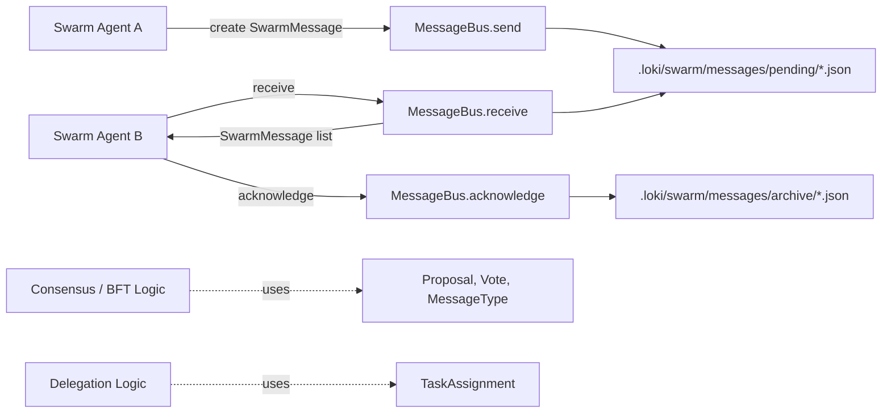
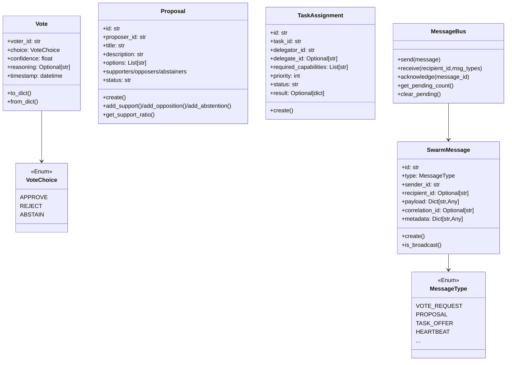
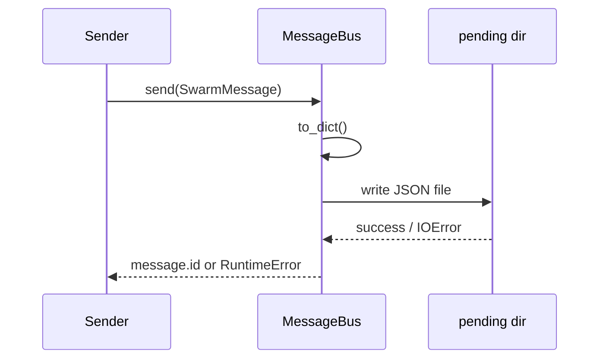
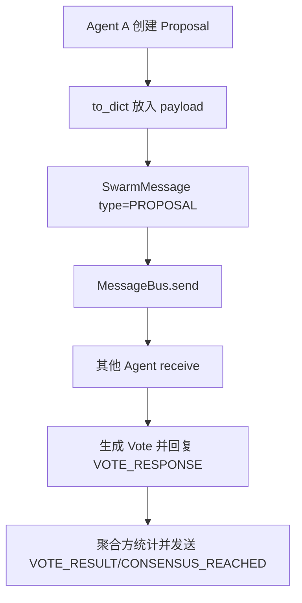
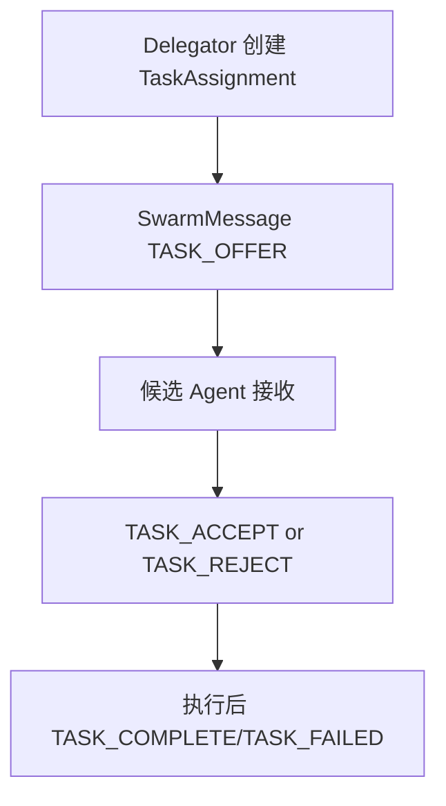

# communication_protocol 模块文档

`communication_protocol`（对应代码文件 `swarm/messages.py`）定义了 Swarm 多智能体系统中的**通信协议对象模型**与一个轻量的**文件型消息总线**。这个模块存在的核心目的，是把“智能体之间如何表达意图、投票、委派任务、同步状态”从具体执行逻辑中抽离出来，形成一套统一、可序列化、可持久化的协议层。

从系统设计角度看，它并不直接做复杂的共识计算（那部分主要由 [consensus_and_fault_tolerance.md](consensus_and_fault_tolerance.md) 覆盖），也不负责智能体编排策略（可参考 [swarm_topology_and_composition.md](swarm_topology_and_composition.md)）。它负责的是更基础但极关键的一层：**消息类型规范 + 载荷容器 + 可靠落盘传递**。这种设计使上层算法（BFT、委派、调度、观测）能够共享同一套消息语义，并在离线、调试、本地开发场景下具备可追溯性。

---

## 1. 模块职责与边界

`communication_protocol` 主要提供三类能力。第一类是协议枚举与数据结构，包括 `MessageType`、`VoteChoice`、`Vote`、`Proposal`、`TaskAssignment`、`SwarmMessage`，用于统一描述 swarm 内部的通信语义。第二类是对象与 JSON 的双向转换，保证消息可以在内存对象与文件/网络载荷之间稳定转换。第三类是 `MessageBus` 文件消息总线，实现消息发送、接收、确认归档与待处理队列管理。

该模块的边界也很明确。它不包含智能体注册、能力匹配策略、信誉评分或 PBFT 阶段控制；这些在 Swarm 的其他模块中实现，例如 `swarm.registry.AgentInfo`、`swarm.bft.ByzantineFaultTolerance`。本模块提供的 `Proposal`、`TaskAssignment`、`Vote` 等是它们会复用的数据契约。

---

## 2. 架构总览



上图体现了本模块最核心的实现思路：通过磁盘目录模拟一个简化消息队列。发送端只负责把 `SwarmMessage` 序列化成 JSON 写入 `pending`；接收端按条件扫描并反序列化；消费完成后通过 `acknowledge` 把文件迁移到 `archive`。这让通信过程天然具备审计痕迹，也降低了对外部消息中间件的依赖。

---

## 3. 组件关系与协议模型



`SwarmMessage` 是“信封”，`payload` 是“正文”。`Vote`、`Proposal`、`TaskAssignment` 通常作为 `payload` 中的结构化内容（或其 `to_dict()` 结果）被携带。`MessageType` 决定了接收方如何解释 `payload`，例如 `PROPOSAL` 对应提案流程，`TASK_OFFER` 对应任务委派流程，`HEARTBEAT` 对应存活探测。

---

## 4. 核心类型详解

## 4.1 `MessageType`

`MessageType` 是跨 agent 的语义枚举，按场景分为投票、共识、委派、涌现洞察、协调控制五组。它的价值在于将“业务动作”与“传输结构”解耦。接收端通常先按 `type` 分发到不同处理器，再解析 `payload`。

在扩展协议时，建议优先新增 `MessageType` 条目，再补齐对应 payload schema 和处理逻辑。不要复用不匹配的类型名，否则会导致下游处理器语义混乱。

## 4.2 `VoteChoice` 与 `Vote`

`VoteChoice` 仅包含 `APPROVE`、`REJECT`、`ABSTAIN` 三种标准选项。`Vote` 除选择本身外，还带有 `confidence`（默认 0.8）和 `reasoning`，因此可用于后续加权投票、解释性追踪。

`Vote.from_dict()` 会尝试解析 `timestamp`。若无时间戳或格式异常前置条件不满足，则回退到当前 UTC 时间。需要注意，`choice` 反序列化时依赖 `VoteChoice(...)` 枚举构造，若输入值非法会抛出 `ValueError`，调用方应提前校验。

## 4.3 `Proposal`

`Proposal` 建模一个可协作决策的提案对象，包含提案基础信息、上下文、可选项、截止时间与三类投票人列表。它内置三种状态变更方法：`add_support`、`add_opposition`、`add_abstention`，每次写入都会保证同一 agent 只出现在一个列表中，从而维持投票状态互斥。

`Proposal.create()` 是推荐的工厂方法，会自动生成形如 `prop-xxxxxxxx` 的短 ID。`get_support_ratio(total_voters)` 提供支持率计算，`total_voters=0` 时返回 `0.0` 以避免除零错误。

## 4.4 `TaskAssignment`

`TaskAssignment` 是委派协议的数据模型。它记录了任务标识、委派方、接收方、任务类型、能力要求、优先级、状态和结果。该对象不强制调度策略，仅提供协议字段；例如 `required_capabilities` 与 `priority` 的解释方式由上层调度器决定（可参考 [swarm_registry_and_types.md](swarm_registry_and_types.md) 了解能力字段通常如何与 agent 匹配）。

`TaskAssignment.create()` 默认 `delegate_id=None`、`status="pending"`，适合“先发布任务再由候选 agent 竞争接单”的模型。

## 4.5 `SwarmMessage`

`SwarmMessage` 是协议层的统一消息容器，字段设计涵盖了点对点、广播与关联链路跟踪三种常见通信需求。`recipient_id=None` 表示广播；`correlation_id` 可用于把请求、响应、最终结论串联成一个事务链路。

`SwarmMessage.create()` 生成 `msg-xxxxxxxx` ID；`is_broadcast()` 提供快速判断，便于接收端过滤。

---

## 5. MessageBus：文件型总线机制

`MessageBus` 是模块中唯一具有 I/O 副作用的组件。初始化时会创建目录：

- `.loki/swarm/messages/pending/`
- `.loki/swarm/messages/archive/`

消息文件命名格式为：

```text
{timestamp_with_colon_replaced}_{message_id}.json
```

例如：

```text
2026-02-27T12-30-10.123456+00-00_msg-a1b2c3d4.json
```

### 5.1 发送流程（`send`）



`send` 会把 `SwarmMessage` 序列化写盘。写盘失败时，函数将 `IOError` 包装为 `RuntimeError` 抛出，便于上层统一处理协议发送失败。

### 5.2 接收流程（`receive`）

`receive(recipient_id, msg_types=None)` 会遍历 `pending` 中所有 JSON 文件，按文件名排序读取，并进行两层过滤：第一层按接收者过滤（点对点或广播），第二层按类型过滤（若提供 `msg_types`）。

读取阶段如果遇到 `JSONDecodeError` 或 `IOError`，实现选择**静默跳过坏消息文件**，不会中断整体拉取流程。这提高了鲁棒性，但也意味着坏文件可能长期残留，需要运维或后台任务清理。

### 5.3 确认与归档（`acknowledge`）

`acknowledge(message_id)` 通过 `glob("*_{message_id}.json")` 查找待确认消息，找到后将文件 `rename` 到 `archive`。成功返回 `True`，失败或未找到返回 `False`。

这种语义是“显式确认消费”，因此默认投递模型更接近 **at-least-once**：如果消费者读取后未确认，下次仍可能再次读到同一消息。

---

## 6. 典型交互流程

## 6.1 提案与投票（协议层视角）



这里的关键点是：`Proposal`/`Vote` 提供数据载体，而真正的投票裁决、容错阈值和信誉加权逻辑通常在 BFT 模块完成，详见 [consensus_and_fault_tolerance.md](consensus_and_fault_tolerance.md)。

## 6.2 任务委派



`TaskAssignment` 在协议层只描述“任务是什么、优先级如何、需要哪些能力”。“谁应该接单”可结合 agent 注册信息（`AgentInfo.capabilities`）与调度策略模块共同决定。

---

## 7. 使用示例

### 7.1 发送提案消息

```python
from swarm.messages import MessageBus, SwarmMessage, MessageType, Proposal

bus = MessageBus()  # 默认使用 ./.loki

proposal = Proposal.create(
    proposer_id="agent-planner-1",
    title="Choose deployment strategy",
    description="Canary vs Blue-Green",
    options=["canary", "blue-green"],
)

msg = SwarmMessage.create(
    msg_type=MessageType.PROPOSAL,
    sender_id="agent-planner-1",
    recipient_id=None,  # broadcast
    payload={"proposal": proposal.to_dict()},
)

bus.send(msg)
```

### 7.2 拉取并确认消息

```python
from swarm.messages import MessageBus, MessageType

bus = MessageBus()

messages = bus.receive(
    recipient_id="agent-backend-1",
    msg_types=[MessageType.PROPOSAL, MessageType.TASK_OFFER],
)

for m in messages:
    # 处理逻辑...
    ok = bus.acknowledge(m.id)
    if not ok:
        print(f"warn: failed to ack {m.id}")
```

### 7.3 创建任务委派

```python
from swarm.messages import TaskAssignment

assignment = TaskAssignment.create(
    task_id="task-42",
    delegator_id="agent-planner-1",
    task_type="api_implementation",
    description="Implement /v1/orders endpoint",
    required_capabilities=["python", "fastapi", "sql"],
)
```

---

## 8. 配置与可运维项

当前模块几乎没有复杂配置项，最主要的是 `MessageBus(loki_dir=...)`。通过传入自定义 `loki_dir`，可以把消息存储隔离到指定工作空间，常用于测试环境并行运行或多租户隔离。

在测试场景中，`clear_pending()` 可以快速清空待处理队列，但该方法是破坏性操作，调用后不会保留恢复点。建议在生产流程中优先用 `acknowledge`，并保留 `archive` 作为审计记录。

---

## 9. 错误处理、边界与已知限制

该模块实现简洁直接，但也带来一些必须明确的行为约束。

- 并发安全：`MessageBus` 未实现文件锁。多进程同时读写同一目录可能发生竞争，例如重复消费、确认失败或短暂读到半写入文件。
- 去重语义：模块不维护全局消费偏移或去重索引，消息可被重复读取。业务处理器应尽量设计为幂等。
- 顺序保证：`receive` 按文件名排序，只是“近似按时间顺序”，不构成严格全局时序。
- 时间戳解析：序列化时使用 `isoformat() + "Z"`，对已带时区偏移的字符串会形成如 `+00:00Z` 的非标准组合；当前实现通过去尾 `Z` 后再 `fromisoformat`，在多数情况下可工作，但跨语言解析器可能不兼容。
- 校验深度：`from_dict` 多数字段采用宽松默认值策略，缺字段时不会立即失败，可能将数据质量问题延后到业务层暴露。
- 坏文件处理：`receive` 遇到非法 JSON 会跳过，不会报警；如无外部监控，异常消息可能长期沉积。

如果需要生产级可靠投递（严格一次、重试队列、死信队列、分区并发等），建议将此模块视为“本地/轻量实现”，并在系统演进时替换为专业消息中间件适配层。

---

## 10. 与其他模块的协作关系

`communication_protocol` 在 Swarm 中处于基础契约层位置：

- 与共识容错模块协作：`ByzantineFaultTolerance` 直接使用 `SwarmMessage`、`Vote`、`Proposal` 进行认证、投票与结果校验，详见 [consensus_and_fault_tolerance.md](consensus_and_fault_tolerance.md)。
- 与编排模块协作：`SwarmComposer` 负责组队，不处理消息落盘；组队结果会在运行期转化成通信行为，详见 [swarm_topology_and_composition.md](swarm_topology_and_composition.md)。
- 与注册能力模型协作：`TaskAssignment.required_capabilities` 往往与 `AgentInfo.capabilities` 进行匹配，详见 [swarm_registry_and_types.md](swarm_registry_and_types.md)。

此外，注意不要与 API 层的 `EventBus`（`api.server.EventBus` / `api.services.event-bus.EventBus`）混淆。两者名字类似，但职责与部署位置不同：前者偏服务端事件分发，后者是 Swarm 内部通信协议落地。

---

## 11. 扩展建议

扩展该模块时，建议遵循“先协议、后处理器”的顺序。先定义清晰 `MessageType` 与 payload schema，再实现消费分发逻辑；并尽量保持 `to_dict/from_dict` 的前后兼容性，避免一次性破坏旧消息可读性。

对于需要跨进程高并发的部署，可保留现有数据类作为协议契约，把 `MessageBus` 替换为 Kafka/NATS/Redis Streams 适配器，实现“相同消息对象，不同传输后端”的平滑演进。
