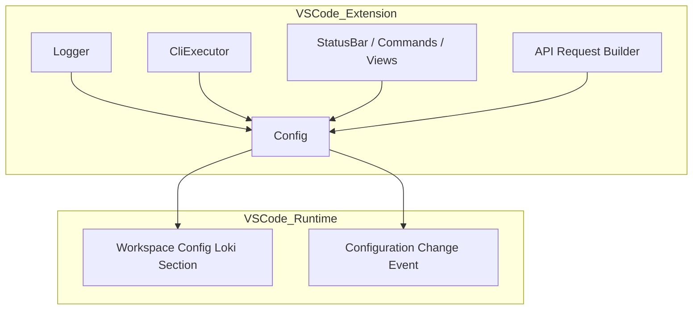
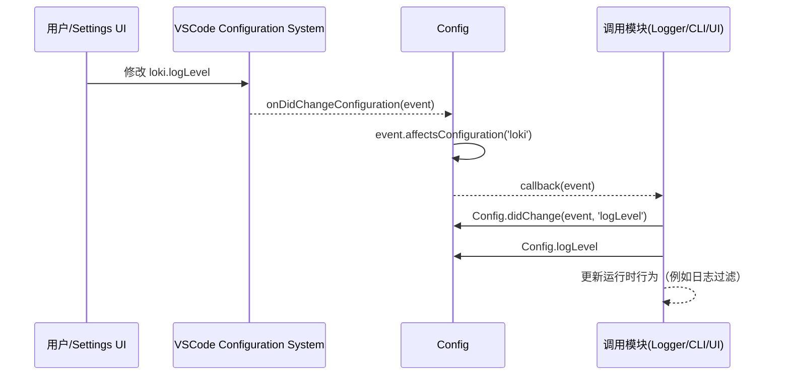
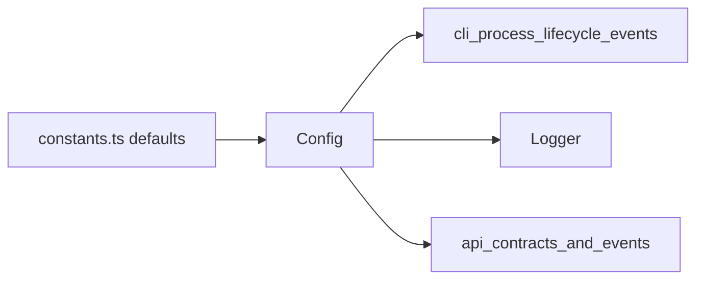

# configuration_and_settings_access 模块文档

## 模块概述

`configuration_and_settings_access` 对应 VSCode 扩展中的 `vscode-extension/src/utils/config.ts`，其核心组件是 `Config`。这个模块的职责并不是“保存配置文件”这么简单，而是将 VS Code 原生的 `workspace.getConfiguration()` 能力封装为一个具备类型约束、默认值策略、变更监听与统一访问入口的配置访问层。它存在的根本原因，是让扩展中的其余模块（例如 CLI 生命周期管理、日志系统、会话启动请求构造与 UI 行为）避免直接依赖零散字符串键名，从而获得更高的一致性和可维护性。

在 Loki Mode 的 VSCode 扩展里，配置既影响“连接面”（`apiHost`、`apiPort`、`autoConnect`），也影响“可观测面”（`logLevel`、`pollingInterval`）与“交互面”（`showStatusBar`、`prdPath`、`provider`）。如果没有一个集中化的配置门面，调用方会重复实现默认值、类型转换和变更检测，最终导致行为分叉。本模块通过 `Config` 静态类将这些逻辑收敛为单一真相来源（Single Source of Truth）。

> 关联阅读：
> - 扩展总体架构：[`VSCode Extension.md`](VSCode Extension.md)
> - 事件契约与进程生命周期：[`cli_process_lifecycle_events.md`](cli_process_lifecycle_events.md)
> - API 请求/响应类型：[`api_contracts_and_events.md`](api_contracts_and_events.md)

---

## 设计目标与设计取舍

本模块的设计重点是“轻量封装 + 强类型边界”。它没有引入复杂配置框架，而是直接基于 VS Code 官方配置 API 构建，原因在于扩展宿主环境已经提供了完善的作用域机制（User/Workspace/WorkspaceFolder）与变更事件。`Config` 的价值在于将这些能力投影到 Loki Mode 的业务语义上。

从设计取舍上看，它优先保证了调用简洁性与一致默认值，而把“高级校验”留在上层业务中处理。例如 `apiPort` 和 `pollingInterval` 都是数值类型，但这里不做范围校验；同理 `apiBaseUrl` 统一拼成 `http://`，不处理 `https` 或路径前缀。这种取舍降低了模块复杂度，但要求上层在安全与部署特殊场景中做进一步处理。

---

## 在系统中的位置



上图表示 `Config` 是扩展内部多个子系统共享的基础设施层。`Logger` 通过它动态更新日志等级；CLI 管理器通过它确定连接地址和轮询行为；UI 用它决定是否展示状态栏以及默认 PRD 路径；API 请求构造流程使用 `provider` 与网络参数。`Config` 不直接管理业务流程，但它通过配置值间接塑造了所有流程的运行方式。

---

## 核心类型与配置模型

### `Provider`

`Provider` 是联合字面量类型：`'claude' | 'codex' | 'gemini'`。它定义了扩展可接受的 AI 提供商集合，并与 `api_contracts_and_events` 中的同名语义保持一致。通过这个类型，调用方在编译阶段就能得到非法值提示，避免字符串拼写错误在运行时才暴露。

### `LogLevel`

`LogLevel` 是 `'debug' | 'info' | 'warn' | 'error'`。它与 `Logger` 模块中的优先级映射共同作用，控制输出通道消息过滤。该模块只负责读取/更新值，不处理日志级别比较逻辑。

### `LokiConfig`

`LokiConfig` 是配置对象的完整结构契约，字段如下：

| 字段 | 类型 | 默认值来源 | 语义 |
|---|---|---|---|
| `provider` | `Provider` | `'claude'` | 默认 AI 提供商 |
| `apiPort` | `number` | `DEFAULT_API_PORT` (`57374`) | 本地 API 端口 |
| `apiHost` | `string` | `DEFAULT_API_HOST` (`localhost`) | 本地 API 主机 |
| `autoConnect` | `boolean` | `true` | 扩展启动后是否自动连接 |
| `showStatusBar` | `boolean` | `true` | 是否显示状态栏入口 |
| `logLevel` | `LogLevel` | `'info'` | 日志输出级别 |
| `pollingInterval` | `number` | `DEFAULT_POLLING_INTERVAL_MS` (`2000`) | 状态轮询间隔（毫秒） |
| `prdPath` | `string` | `''` | 默认 PRD 文件路径 |

---

## `Config` 类详解

`Config` 是纯静态类，不需要实例化。它通过私有常量 `SECTION = 'loki'` 固定配置命名空间，确保所有读取与更新都作用于 `loki.*` 键。

### 1) `getAll(): LokiConfig`

该方法一次性读取全部配置并返回结构化对象。其内部流程是：先取 `vscode.workspace.getConfiguration('loki')`，再对每个键使用 `config.get<T>(key, defaultValue)` 获取值。这个方法适合初始化阶段构建运行上下文，避免多次访问配置 API。

返回值是完整 `LokiConfig`，不会返回 `undefined` 字段，因为所有键都提供了默认值。副作用方面，它是只读操作，不触发任何事件。

### 2) 逐项 getter（`provider/apiPort/apiHost/apiBaseUrl/...`）

这些 getter 提供“按需访问”语义。每次访问都会重新读取当前配置，而不是缓存旧值，因此能够天然反映用户在 Settings 中的最新改动。

其中 `apiBaseUrl` 是派生属性，不直接来自设置项，而是运行时由 `apiHost` 与 `apiPort` 拼接得到：

```ts
static get apiBaseUrl(): string {
  return `http://${this.apiHost}:${this.apiPort}`;
}
```

这使调用方不必重复拼接 URL，但也意味着协议被硬编码为 `http`。

### 3) `update<K extends keyof LokiConfig>(key, value, target)`

该方法封装了配置写入，最重要的设计点是泛型约束：`key` 只能是 `LokiConfig` 的键，`value` 的类型会随 `key` 自动推导。例如写 `provider` 时只能传 `Provider` 联合类型值。

`target` 默认是 `vscode.ConfigurationTarget.Workspace`，即默认写入工作区设置（`.vscode/settings.json`）。调用方若要写入用户全局设置，可显式传 `Global`。

返回 `Promise<void>`，因为 VS Code 配置更新是异步行为，可能受文件系统、权限或宿主状态影响。

### 4) `onDidChange(callback)`

该方法注册配置变更监听器，并在内部先做一次命名空间过滤：只有当事件 `affectsConfiguration('loki')` 时才调用外部回调。这避免了扩展监听到无关设置噪声，降低 UI 与运行时逻辑被误触发的概率。

返回值是 `vscode.Disposable`。调用方应在扩展 `deactivate` 或组件销毁时释放它，以防止监听器泄漏。

### 5) `didChange(event, key)`

这是变更判定辅助函数，专门用于判断某个具体键是否变化。它调用 `event.affectsConfiguration('loki.<key>')`，让调用方可以在一个统一监听回调里做细粒度分支处理。

---

## 配置读取与变更处理流程



这个流程体现了模块的一项关键能力：它不仅是“读取器”，还是配置变化与运行时行为之间的桥梁。以 `Logger` 为例，它在构造时订阅 `Config.onDidChange`，并在 `logLevel` 改变后立即切换内部阈值，实现无需重启扩展的动态生效。

---

## 与其他模块的协作关系

`Config` 的跨模块影响主要体现在三个方向。第一，和 `cli_process_lifecycle_events` 背后的 `CliExecutor` 协作时，`apiPort` 与 `apiHost` 决定扩展连接目标，`pollingInterval` 影响状态刷新节奏。第二，和 `api_contracts_and_events` 协作时，`provider` 会参与会话启动请求（例如 `StartRequest.provider`）的默认值选择。第三，和日志基础设施协作时，`logLevel` 直接影响输出噪声与排障可见性。



---

## 使用示例

### 读取全量配置并初始化客户端

```ts
import { Config } from '../utils/config';

const cfg = Config.getAll();
const baseUrl = `http://${cfg.apiHost}:${cfg.apiPort}`;

client.configure({
  baseUrl,
  pollingInterval: cfg.pollingInterval,
  provider: cfg.provider,
});
```

### 精细化监听特定键

```ts
const disposable = Config.onDidChange((e) => {
  if (Config.didChange(e, 'apiPort') || Config.didChange(e, 'apiHost')) {
    reconnectApiClient(Config.apiBaseUrl);
  }

  if (Config.didChange(e, 'logLevel')) {
    logger.info(`New log level: ${Config.logLevel}`);
  }
});

context.subscriptions.push(disposable);
```

### 在工作区作用域更新配置

```ts
await Config.update('provider', 'gemini', vscode.ConfigurationTarget.Workspace);
await Config.update('pollingInterval', 3000, vscode.ConfigurationTarget.Workspace);
```

---

## 扩展与二次开发建议

如果你需要新增配置项，推荐先在 `LokiConfig` 中声明字段，再为其补充独立 getter，并在 `getAll()` 中加入默认值。这个顺序可以确保类型系统和统一访问入口始终同步，避免调用方出现“能读不能全量获取”或“能写但缺省值不一致”的断层。

对于具备业务约束的字段（例如端口范围、轮询最小值、路径存在性），建议在调用层加入校验与回退，而不是直接把校验逻辑塞进 `Config`。这样可以保持 `Config` 作为基础设施层的稳定职责边界，同时让不同业务场景定义各自的容错策略。

---

## 边界条件、错误场景与已知限制

### 1. 类型安全主要发生在编译期

`update()` 的泛型约束在 TypeScript 编译期很强，但运行时依旧可能被外部设置文件写入非法值（例如用户手动编辑 JSON）。当前模块不做运行时 schema 校验，因此消费方在关键路径应准备兜底逻辑。

### 2. `apiBaseUrl` 固定为 `http`

在需要 TLS、反向代理或非根路径部署的环境下，`apiBaseUrl` 可能不够用。此时建议在上层引入更完整的 URL 组装策略，或扩展配置项（如 `apiProtocol`、`apiBasePath`）。

### 3. 默认 `target` 是 `Workspace`

这对团队协作通常是好事（项目可共享设置），但在多工作区或只希望用户本地生效的场景下可能不符合预期。调用 `update()` 时应显式指定目标作用域。

### 4. 监听器生命周期管理

`onDidChange()` 会返回 `Disposable`，若不释放可能导致重复订阅和内存泄漏，尤其是在可重复创建/销毁的 UI 组件中更要注意。

### 5. 无内建防抖

高频配置变更会高频触发回调。当前模块不做防抖/节流；若回调中包含重连接、重建客户端等昂贵操作，建议调用方自行防抖。

---

## 行为速查（面向维护者）

- 读取单项配置：使用 `Config.<getter>`，始终获取最新值。
- 初始化全量上下文：使用 `Config.getAll()`，减少重复读取。
- 更新配置：使用 `Config.update()`，并明确 `ConfigurationTarget`。
- 响应配置变更：`Config.onDidChange()` + `Config.didChange()` 组合。
- 与日志系统联动：`logLevel` 改变后可即时生效（见 `Logger`）。

---

## 小结

`configuration_and_settings_access` 是 VSCode 扩展的“配置控制平面入口”。它通过 `Config` 在不增加复杂度的前提下提供了稳定、类型友好且可监听的配置访问方式，让扩展中的网络连接、日志行为、UI 展示和默认业务参数都能围绕同一套配置语义运行。对于维护者而言，理解并遵循这个入口，可以显著降低配置漂移、键名散落和动态行为不一致的问题。
