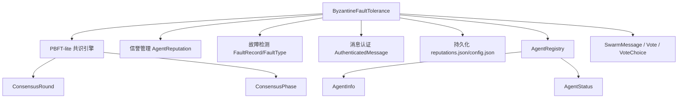
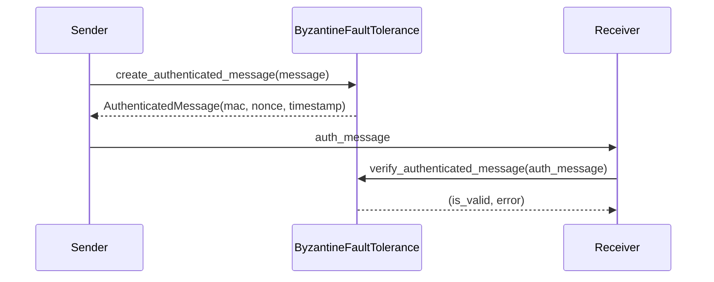
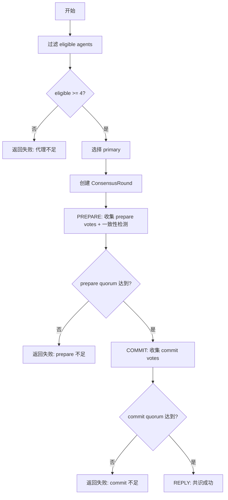
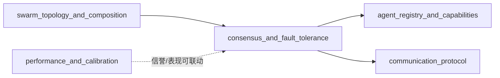

# consensus_and_fault_tolerance 模块文档

## 模块定位与设计目标

`consensus_and_fault_tolerance` 是 Swarm Multi-Agent 子系统中的一致性与容错核心，代码实现位于 `swarm/bft.py`，核心组件是 `ByzantineFaultTolerance` 与 `ConsensusPhase`。它的存在目的不是“提升性能”，而是“在代理可能异常、失效、甚至作恶时，尽量保证集体决策仍可用且可追责”。

这个模块采用了 **PBFT-lite** 思路：保留了 `PRE_PREPARE -> PREPARE -> COMMIT -> REPLY` 四阶段语义，但在实现上做了工程化简化（例如本地模拟广播与投票收集，而非真实网络协议栈）。同时它融合了三条治理线：第一条是消息认证（HMAC + nonce + timestamp）用于抗篡改与基础防重放；第二条是信誉系统（`AgentReputation`）用于长期质量反馈；第三条是故障记录（`FaultRecord`）用于审计、惩罚与自动排除。

从全局架构看，这个模块处于 Swarm 协调层的“可靠性闸门”位置：它消费来自 `swarm.messages` 的投票和消息格式，依赖 `swarm.registry` 的代理状态与能力信息，并向上为调度、委派、评审共识等流程提供带容错保证的决策输出。若你先阅读 [swarm_topology_and_composition.md](swarm_topology_and_composition.md) 与 [swarm_coordination_and_messages.md](swarm_coordination_and_messages.md)，再看本文，会更容易理解其上下文。

---

## 架构总览



该架构可以理解为“一个控制器 + 四个子系统”。`ByzantineFaultTolerance` 是控制器，负责编排共识流程；认证子系统负责信任入口；信誉与故障子系统负责行为后果；持久化子系统保证跨进程记忆。依赖上它并不直接处理网络 I/O，而是站在协议与业务中间层，作为决策质量的守门人。

---

## 关键枚举与数据模型

## `ConsensusPhase`

`ConsensusPhase` 定义 PBFT-lite 的阶段机：`PRE_PREPARE`、`PREPARE`、`COMMIT`、`REPLY`。在当前实现中，`run_consensus()` 会直接推进阶段，主要用于流程标记与结果元数据表达。

## `FaultType`

`FaultType` 表示可识别的故障类型，包括 `INCONSISTENT_VOTE`、`TIMEOUT`、`INVALID_MESSAGE`、`CONFLICTING_RESULT`、`EQUIVOCATION`、`MALFORMED_RESPONSE`、`SYCOPHANTIC_AGREEMENT`。其中并不是每一类都在当前代码自动触发；例如 `INVALID_MESSAGE` 需要上层在认证失败后显式构造并调用 `update_reputation()`。

## `FaultRecord`

`FaultRecord` 是故障证据载体，字段包含：
- `id`：故障记录唯一标识
- `agent_id`：发生故障的代理
- `fault_type`：故障类别
- `severity`：严重度（0.0~1.0）
- `description`：可读描述
- `evidence`：结构化证据
- `timestamp`：UTC 时间戳

它支持 `to_dict()` / `from_dict()`，用于落盘和报告输出。其副作用很小，主要在被 `update_reputation()` 消费时触发惩罚和事件广播。

## `AgentReputation`

`AgentReputation` 管理单个代理信誉。信誉分数更新逻辑是：
1. 以成功率 `successful_interactions / total_interactions` 作为基线；
2. 对最近 10 条故障累计 `severity * 0.1` 惩罚；
3. 将结果夹在 `[0.0, 1.0]`。

这意味着系统对“近期坏行为”更敏感，但不是严格指数衰减模型。`record_success()` 与 `record_fault()` 都会增加 `total_interactions`，并触发 `_update_score()`。

## `ConsensusRound`

`ConsensusRound` 是一次共识会话状态容器，记录提案 ID、主节点、当前阶段、prepare/commit 票集、超时窗口等。`has_prepare_quorum()` 与 `has_commit_quorum()` 都使用 `(2 * n + 1) // 3` 计算法定票数，用于近似 PBFT 的 `2f+1` 条件。

## `BFTConfig`

`BFTConfig` 是模块行为的唯一配置入口，覆盖信誉阈值、超时、故障窗口、惩罚参数等。它支持 JSON 序列化与反序列化，配合 `save_config()` / `load_config()` 使用。

## `BFTResult`

`BFTResult` 是 `run_consensus()` 的统一返回类型，包含 `success`、`consensus_reached`、参与者/排除者、故障列表、耗时与元数据，适合直接供上层 API 返回或写入审计日志。

---

## 核心类 `ByzantineFaultTolerance` 深入说明

## 初始化与状态管理

构造函数签名如下：

```python
ByzantineFaultTolerance(
    registry: AgentRegistry,
    loki_dir: Optional[Path] = None,
    config: Optional[BFTConfig] = None,
    secret_key: Optional[str] = None,
)
```

初始化时会创建 `.loki/swarm/bft` 目录，加载历史信誉，准备内存态：
- `_reputations`: 代理信誉表
- `_vote_history`: 用于投票一致性检测
- `_active_rounds`: 活跃共识轮
- `_used_nonces`: 已消费 nonce（防重放）
- `_fault_handlers`: 故障事件回调

它的关键副作用是“启动即尝试读盘，运行中持续写盘”。因此若你在高频调用场景中使用，建议把 I/O 行为纳入性能评估。

## 消息认证流程



`create_authenticated_message()` 会对 `message + nonce + timestamp` 做 JSON 序列化并签名。`verify_authenticated_message()` 会进行三类检查：
1. nonce 未被使用（防重放）；
2. timestamp 在有效窗口内（默认 60 秒）；
3. HMAC 一致（防篡改）。

注意：nonce 集合只在内存中维护，重启后不会继承历史，意味着跨重启时间窗内的重放防护能力有限。

## 共识执行流程：`run_consensus()`



该方法参数如下：

```python
run_consensus(
    proposal_id: str,
    value: Any,
    participants: List[str],
    primary_id: Optional[str] = None,
    timeout_seconds: Optional[float] = None,
) -> BFTResult
```

内部关键行为包括：
- 先用 `get_eligible_agents()` 按信誉与排除状态过滤参与者；
- 若 `primary_id` 缺省或不合规，则自动选择信誉最高者；
- PREPARE 阶段会调用 `detect_vote_inconsistency()`，检测同提案“改票”；
- 对通过检测者记 success，违规者记 fault；
- PREPARE/COMMIT 分别做法定票数检查，最终返回 `BFTResult`。

需要强调的是：当前实现是“本地流程型 PBFT-lite”，并没有真实网络广播、签名链、视图切换执行。`max_view_changes` 与 `require_prepare_quorum` 等配置项目前未被完整使用。

## 结果一致性校验

`verify_result(proposal_id, agent_results)` 用“哈希分组 + 最大组”确定共识结果，并对非多数结果打 `CONFLICTING_RESULT` 故障。`cross_check_results()` 在此基础上再加最小同意比例（默认 0.67）判断，返回 `(agreement_reached, consensus_value, faults)`。

这里的工程语义是“多数近似”，不是严格 BFT 安全证明。若出现平票，最大组选择受字典插入顺序影响，业务上应结合上下文再做决策。

## BFT 感知投票：`bft_vote()`

`bft_vote(proposal_id, votes, weighted_by_reputation=True)` 会先剔除低信誉或已排除代理，再按 `confidence * reputation`（或仅 `confidence`）累加权重。它返回 `VoteChoice` 和统计元数据，适合治理类提案（如策略启停、执行许可）场景。

方法副作用包括：
- 检测投票不一致并记录故障；
- 对有效投票者记录成功交互，影响后续信誉。

## BFT 感知委派：`bft_delegate()`

该方法把容错治理注入任务分配。它综合代理信誉（60%）和能力匹配（40%）评分，只在 `AgentStatus.IDLE/WAITING` 中挑选候选，返回最优代理及最多两个 fallback。

这使其天然适配“高价值任务优先交给高可靠代理”的调度策略，和纯能力匹配相比更稳健。

---

## 与其他模块的依赖关系



本模块直接依赖 `AgentRegistry`、`AgentInfo`、`AgentStatus` 与 `SwarmMessage/Vote`。在系统集成层，`SwarmComposer` 或调度器通常先确定候选代理，再调用 BFT 做共识、投票或委派决策。若你需要完整背景，可参考：

- [swarm_registry_and_types.md](swarm_registry_and_types.md)
- [swarm_coordination_and_messages.md](swarm_coordination_and_messages.md)
- [swarm_topology_and_composition.md](swarm_topology_and_composition.md)
- [性能跟踪与校准.md](性能跟踪与校准.md)

---

## 配置说明与建议

典型配置示例：

```python
from swarm.bft import BFTConfig, ByzantineFaultTolerance

config = BFTConfig(
    min_reputation_for_consensus=0.35,
    exclusion_threshold=0.2,
    rehabilitation_threshold=0.55,
    consensus_timeout_seconds=45.0,
    vote_consistency_window=20,
    message_validity_window_seconds=90.0,
    max_faults_before_exclusion=4,
)

bft = ByzantineFaultTolerance(registry=registry, config=config, secret_key="${ROTATED_SECRET}")
```

在生产环境中，优先关注三个维度：第一是阈值（决定“严厉程度”）；第二是时间窗（决定“敏感度”）；第三是密钥管理（决定认证可信度）。默认密钥 `DEFAULT_SECRET_KEY` 仅适合本地开发，必须替换为安全来源。

---

## 使用模式与实践示例

## 模式一：任务结果多副本校验

```python
agent_results = {
    "agent-a": {"score": 0.92, "decision": "approve"},
    "agent-b": {"score": 0.91, "decision": "approve"},
    "agent-c": {"score": 0.40, "decision": "reject"},
}

consensus, faults = bft.verify_result("proposal-42", agent_results)
# consensus 为多数值，faults 中包含冲突代理的故障记录
```

## 模式二：带信誉权重的治理投票

```python
from swarm.messages import Vote, VoteChoice

votes = [
    Vote(voter_id="agent-a", choice=VoteChoice.APPROVE, confidence=0.9),
    Vote(voter_id="agent-b", choice=VoteChoice.REJECT, confidence=0.8),
    Vote(voter_id="agent-c", choice=VoteChoice.APPROVE, confidence=0.6),
]

winner, meta = bft.bft_vote("policy-change-7", votes, weighted_by_reputation=True)
```

## 模式三：高可靠委派

```python
delegate, meta = bft.bft_delegate(
    task_id="task-1001",
    required_capabilities=["code_review", "security_analysis"],
    candidates=["agent-a", "agent-b", "agent-c"],
)
```

---

## 故障事件与运维观测

你可以通过 `on_fault()` 注册监听器，把故障上报到审计或监控系统：

```python
def handle_fault(fault):
    print(f"[FAULT] {fault.agent_id} {fault.fault_type.value} severity={fault.severity}")

bft.on_fault(handle_fault)
```

`get_stats()` 提供系统快照，`get_fault_report()` 提供故障明细列表。建议把这两个接口纳入仪表盘周期采集，与 [Observability.md](Observability.md) 或 [Audit.md](Audit.md) 联动。

---

## 边界条件、错误与已知限制

当前实现有一些非常关键的工程边界，建议在接入前明确：

1. **最小规模约束**：`run_consensus()` 要求 `eligible >= 4`，否则直接失败。
2. **协议简化**：当前是 PBFT-lite，本地推进阶段，不包含真实视图切换与网络容错细节。
3. **配置未完全生效**：`max_view_changes`、`require_prepare_quorum` 在当前代码路径中未被完整消费。
4. **重放防护非持久**：nonce 仅内存保存，进程重启后历史 nonce 丢失。
5. **I/O 异常吞掉**：读写 JSON 时异常被静默忽略，可能导致“你以为保存了，实际没落盘”。
6. **恢复机制偏手动**：被排除代理需要主动调用 `rehabilitate_agent()`，且若长期无成功交互，分数难以上升。
7. **多数并非强一致证明**：`verify_result()` 在平票或接近票时是工程折中，不等同严格 BFT 安全性证明。

错误处理建议是：永远检查 `BFTResult.success`、`consensus_reached` 与 `metadata["error"]`，并在失败时触发降级策略（重试、换主、减少任务关键性、人工审批）。

---

## 扩展建议

如果你要扩展本模块，最常见且收益最高的方向有三类。第一类是把真实网络传输和签名链接入共识阶段，使 `ConsensusRound` 成为可回放日志；第二类是将 `AgentPerformanceTracker` 指标融合进信誉更新，让“慢但准”和“快但错”可区分；第三类是把故障类型与惩罚函数插件化，支持不同租户策略。

在扩展时建议保持两个不变量：一是所有惩罚都能追溯到 `FaultRecord.evidence`；二是所有自动排除都可通过明确阈值解释，这样系统治理才具备可审计性与可维护性。

---

## 小结

`consensus_and_fault_tolerance` 不是单纯的投票工具，而是一个把“身份可信、行为可评估、决策可收敛”组合在一起的容错治理层。它通过 PBFT-lite 流程、信誉衰减和故障审计，为多代理系统提供了在不完美环境中仍可运行的基础可靠性。对开发者而言，最重要的是把它当作“系统安全边界”来接入，而不是普通工具函数：配置要谨慎、错误要显式处理、观测要持续化。
