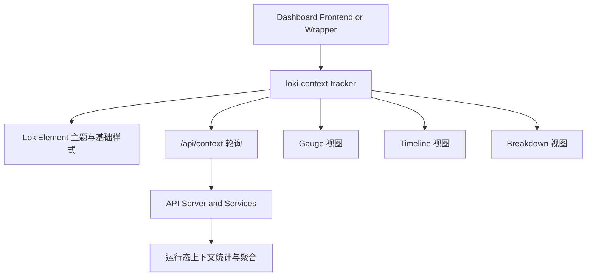
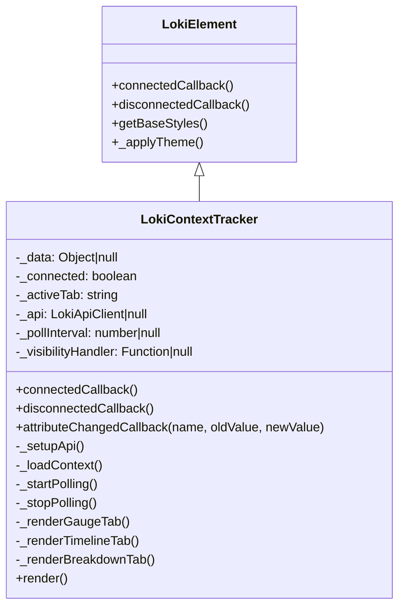
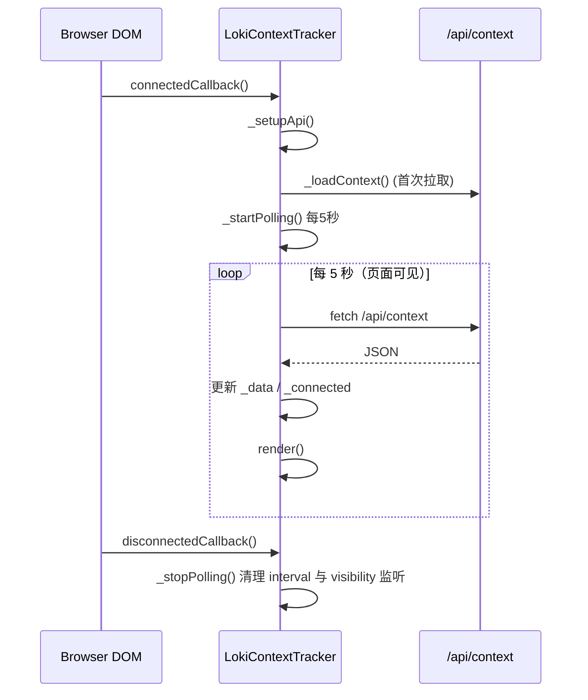
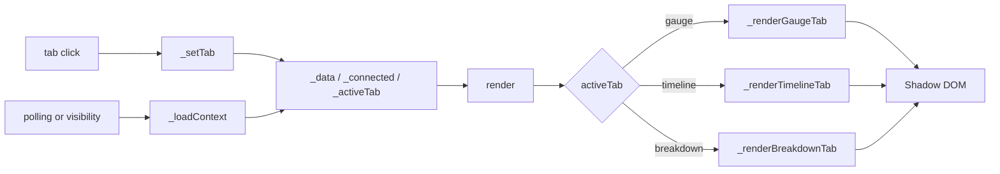
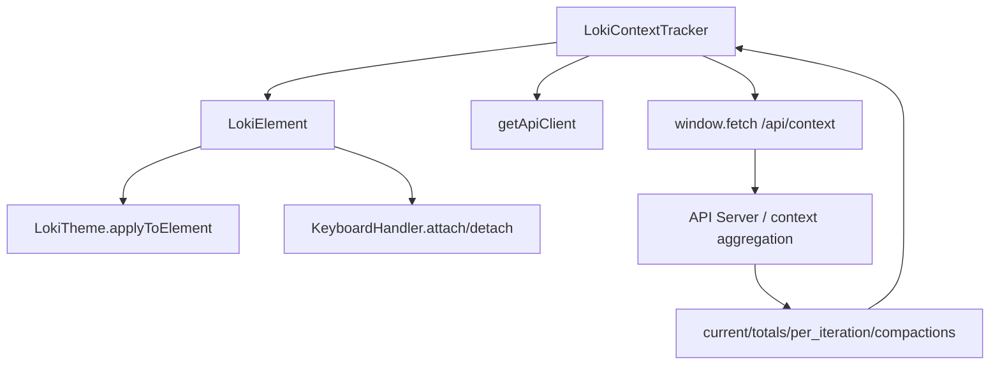

# context_window_and_token_observability 模块文档

## 模块简介与设计动机

`context_window_and_token_observability` 模块在 Dashboard UI 的定位，是把“模型上下文窗口正在被怎样消耗”这件事，从抽象的日志数字转换成可以持续观察、快速判断的可视化界面。它对应的核心组件是 `dashboard-ui.components.loki-context-tracker.LokiContextTracker`，最终以 `<loki-context-tracker>` 自定义元素提供能力。

在 AI Agent 或多轮推理系统里，上下文窗口和 token 成本几乎总是“延迟暴露问题”的风险源：前几轮看起来正常，但随着迭代增长，输入堆积、输出增长、缓存策略变化，会让上下文占比突然越线、成本显著上升、甚至触发压缩（compaction）导致行为突变。这个模块存在的核心价值，就是把这些信号前置到运行中，而不是等故障或成本超预算后再排查。

从设计上看，该组件选择了三个互补视角：`Gauge`（当前态势）、`Timeline`（时间演进）、`Breakdown`（结构归因）。这种组合并不只是 UI 排版，而是一个诊断路径：先看当前是否危险，再看危险是怎么演变来的，最后看主要由哪类 token 构成。对维护者而言，这比单一图表更接近真实排障流程。

---

## 在系统中的位置

`LokiContextTracker` 属于 Dashboard UI Components 下 Monitoring and Observability Components 的子模块。它主要依赖前端主题基类与 HTTP 接口，不直接管理业务状态，也不承担后端计算逻辑。



这张图的重点在于边界：`LokiContextTracker` 负责“获取+展示”，不负责“统计口径生成”。统计口径由后端 `/api/context` 提供，组件本身假设该接口已经完成了 token 分类、迭代聚合和压缩事件标注。若需要了解整个可观测性版块的横向关系，可参考 [Monitoring and Observability Components.md](Monitoring%20and%20Observability%20Components.md)；若需要主题体系细节，可参考 [Core Theme.md](Core%20Theme.md)；API 客户端基建可参考 [API 客户端.md](API%20客户端.md)。

---

## 核心组件：`LokiContextTracker`

### 类职责与状态模型

`LokiContextTracker` 继承自 `LokiElement`，因此天然具备 Shadow DOM、主题变量注入、主题切换监听等基础能力。它自身聚焦于上下文指标拉取、状态缓存与多视图渲染。



组件内部使用几个关键状态字段协作：`_data` 保存接口返回数据，`_connected` 仅用于 UI 层的“连接中提示”，`_activeTab` 决定渲染分支，`_pollInterval` 与 `_visibilityHandler` 管理轮询生命周期。

### 可观察属性

组件声明了 `observedAttributes = ['api-url', 'theme']`。这意味着两个属性变化会触发 `attributeChangedCallback`：

- `api-url` 变化时：更新 `_api.baseUrl` 并重新 `_loadContext()`。
- `theme` 变化时：调用父类机制 `_applyTheme()` 重新应用主题变量。

一个值得注意的实现细节是：组件虽然初始化了 `getApiClient`，但真正的数据请求使用的是原生 `fetch(apiUrl + '/api/context')`。因此 `_api` 当前并未参与请求流程（更像为未来重构预留）。

---

## 生命周期与轮询机制

### 组件生命周期流程



这里的关键设计点在于“可见性驱动轮询”：组件监听 `document.visibilitychange`，当页面隐藏时停止轮询，恢复可见时立即拉取一次并重启 5 秒轮询。这对长期打开 Dashboard 的场景能明显减少不必要请求。

### 轮询行为细节

- 固定周期：`5000ms`，当前不可配置。
- 首次连接：立即请求一次，不等第一个 interval tick。
- 页面隐藏：`clearInterval`，避免后台空转。
- 页面恢复：先 `_loadContext()`，再重启 interval。

这套机制实现简单直接，但也意味着没有 backoff、没有错误级别区分、没有请求取消（AbortController）。如果网络抖动导致请求重叠，后返回的旧响应存在覆盖新状态的可能性。

---

## 数据契约与渲染语义

组件预期 `/api/context` 返回包含 `current`、`totals`、`per_iteration`、`compactions` 的 JSON。示例结构如下（基于组件访问字段推断）：

```json
{
  "current": {
    "context_window_pct": 72.4,
    "total_tokens": 120340,
    "input_tokens": 90210,
    "output_tokens": 24100,
    "cache_read_tokens": 4010,
    "cache_creation_tokens": 2020,
    "estimated_cost_usd": 0.14
  },
  "totals": {
    "compaction_count": 3,
    "iterations_tracked": 18
  },
  "per_iteration": [
    {
      "iteration": 16,
      "input_tokens": 5200,
      "output_tokens": 1300,
      "cache_read_tokens": 400,
      "cache_creation_tokens": 100,
      "cost_usd": 0.006,
      "compacted": false
    }
  ],
  "compactions": [
    { "at_iteration": 12, "timestamp": "2026-02-26T11:02:03Z" }
  ]
}
```

### 视图一：Gauge（当前态势）

`_renderGaugeTab()` 使用 SVG 环形进度条展示 `current.context_window_pct`。颜色阈值规则是明确编码的：大于 80 为红色，60~80 为黄色，其余为绿色。该视图同时展示总 token、输入/输出子量、估算成本、压缩次数、迭代计数与 cache token。

这个视图强调“现在是否危险”，适合值守场景。其优点是决策快，缺点是缺少趋势上下文，因此通常需结合 Timeline 使用。

### 视图二：Timeline（演进过程）

`_renderTimelineTab()` 将每次迭代总 token 映射为横向条形长度，比例基于当前数据窗口中的 `maxTokens`。它还会根据 `compactions[].at_iteration` 在对应迭代前插入“Context Compacted”分隔行，并对 `it.compacted === true` 的迭代行加虚线强调。

这提供了“什么时候发生拐点”的解释能力：例如在压缩事件附近观察 token/cost 的变化，判断压缩是否带来成本回落或行为异常。

### 视图三：Breakdown（结构归因）

`_renderBreakdownTab()` 把 `input/output/cache_read/cache_creation` 四类 token 分段展示。注意它同样按全局 `maxTokens` 缩放，而不是按本行 `total` 归一化，所以同一行四段总长度可能小于 100%。这是一种“跨迭代可比较性优先”的设计：你能直接比较不同迭代绝对规模，而不是只看构成比例。

---

## 关键方法逐项说明

### `connectedCallback()` / `disconnectedCallback()`

`connectedCallback()` 在父类连接逻辑后调用 `_setupApi()`、`_loadContext()`、`_startPolling()`；`disconnectedCallback()` 负责停止轮询并解绑可见性监听。副作用非常明确：进入 DOM 即启动网络活动，离开 DOM 即释放资源。

### `attributeChangedCallback(name, oldValue, newValue)`

该方法做了 `oldValue === newValue` 快速返回。`api-url` 变更时会触发重新请求，`theme` 变更时触发样式重应用。返回值为空，副作用主要是状态更新与重渲染。

### `_loadContext()`

这是数据通路核心：执行 `fetch(apiUrl + '/api/context')`，若 `resp.ok` 则更新 `_data` 与 `_connected = true`，捕获异常时 `_connected = false`，最后统一 `render()`。

一个行为细节是：HTTP 非 2xx 但没有抛异常时，仅不会更新数据，并不会显式把 `_connected` 置为 `false`。这可能导致“接口返回 500 但 UI 仍显示上次成功状态”的感知偏差。

### `_formatTokens(count)` / `_formatUSD(amount)`

`_formatTokens` 会把千、百万级数值格式化为 `K/M`；`_formatUSD` 会对极小金额显示 `<$0.01`。这两者改善了高频监控场景下的可读性，但也引入精度抽象（例如 1499 会显示为 `1.5K`）。

### `render()`

`render()` 根据 `_activeTab` 选择子渲染函数并重建 Shadow DOM。随后通过 `querySelectorAll('.tab')` 重新绑定 tab 点击事件。由于每次都整体替换 `innerHTML`，旧节点监听器会随节点销毁被回收，逻辑上可行；但频繁整树重绘在高复杂度场景可能不如增量更新高效。

---

## 组件交互与状态流



这张图展示了组件是典型的“状态驱动重渲染”模型，状态输入来自两类事件：用户点击（切换视图）与系统轮询（更新数据）。

---

## 使用与集成方式

### 最小用法

```html
<loki-context-tracker></loki-context-tracker>
```

默认会使用 `window.location.origin` 作为 API 基址，并请求 `/api/context`。

### 指定 API 与主题

```html
<loki-context-tracker
  api-url="http://localhost:57374"
  theme="dark">
</loki-context-tracker>
```

### 运行期切换 API

```javascript
const tracker = document.querySelector('loki-context-tracker');
tracker.setAttribute('api-url', 'https://staging.example.com');
```

这会触发 `attributeChangedCallback`，并立即进行一次新地址拉取。

---

## 可扩展点与二次开发建议

当前组件实现偏“即插即用”，扩展策略通常是继承后覆盖局部行为。

```javascript
class CustomContextTracker extends LokiContextTracker {
  _startPolling() {
    // 示例：改成 2 秒轮询
    this._pollInterval = setInterval(() => this._loadContext(), 2000);
  }

  async _loadContext() {
    // 示例：增加错误日志
    try {
      await super._loadContext();
    } catch (e) {
      console.error('context load failed', e);
    }
  }
}

customElements.define('custom-context-tracker', CustomContextTracker);
```

如果要做生产级增强，优先级通常是：

- 引入 AbortController，避免请求竞态覆盖。
- 增加 HTTP 非 2xx 的错误分支处理与可见提示。
- 把轮询间隔参数化（attribute 或 constructor config）。
- 用事件机制暴露数据变化（例如 `contextchange`），便于外部联动。

---

## 边界条件、错误场景与已知限制

### 边界与异常处理

当 `per_iteration` 为空时，Timeline 与 Breakdown 都会展示 `No iteration data yet`。当网络异常抛错时，组件显示 `Connecting to context API...`。这些处理保证了组件不会因空数据或接口失败崩溃。

但要注意，当前异常模型较粗粒度：没有区分“首次加载中”“短暂失败”“长期离线”“鉴权失败”等状态，也没有向上抛出标准化错误事件，外层系统难以做精细降级。

### 已知实现限制

组件包含 `_escapeHTML()`，但当前渲染路径未使用该函数；由于数据主要是数值字段，风险可控，但这意味着如果未来插入字符串字段，需要显式应用转义。另一个限制是 `_api` 客户端对象基本未参与请求通道，与 [API 客户端.md](API%20客户端.md) 提供的重试、上下文感知能力没有形成统一。

此外，轮询周期写死为 5 秒，不适合所有场景：高频调试可能觉得慢，低功耗场景可能觉得仍偏快。由于没有速率控制策略，多个页面同时打开时会线性增加 `/api/context` 压力。

---

## 与其他模块的关系（避免重复说明）

`context_window_and_token_observability` 是 Monitoring and Observability 的“上下文与 token 专项观察器”，不替代日志流、总体概览、应用健康等视图。相关能力请按模块阅读：

- 总体观测分层： [Monitoring and Observability Components.md](Monitoring%20and%20Observability%20Components.md)
- 组件主题与基类： [Core Theme.md](Core%20Theme.md)
- 前端 API 访问基础设施： [API 客户端.md](API%20客户端.md)
- 运行态总览面板： [LokiOverview.md](LokiOverview.md)
- 日志可视化： [LokiLogStream.md](LokiLogStream.md)

---

## 维护者结论

从工程角度看，`LokiContextTracker` 的实现风格是“轻逻辑、强可视化、低耦合”：它把关键指标在前端快速表达，代码结构直观、易读、易接入。对于首次接手此模块的开发者，理解路径可以按“三层”进行：先掌握生命周期与轮询，再理解三视图各自语义，最后评估错误处理与扩展点。

如果你的目标是把该模块提升为更强的生产可观测组件，建议优先在网络可靠性（重试/竞态/错误态）、可配置性（poll interval / endpoint / feature flags）和事件化集成（对外派发状态变化）三方面演进。


---

## 组件依赖关系与运行时协作（补充）

为了让维护者更快定位问题，下面补充一个更偏“依赖链路”的视图，强调 `LokiContextTracker` 与上游基类、下游接口之间的职责分界。



这个依赖图揭示了一个现实：组件当前“初始化了 API client，但请求仍走 fetch”。这不是错误，但会让鉴权头、统一重试、全链路 trace 注入等能力难以复用。如果你的项目在其他组件里已经通过 API client 实现了这些策略，那么这里是值得统一的技术债点。

## 字段语义与兼容性建议

虽然组件没有显式 TypeScript 类型约束，但从访问方式可以归纳出事实契约。对于后端维护者，保持字段稳定能显著降低前端回归风险；对于前端维护者，若必须扩展字段，建议保持向后兼容并提供默认值。

- `current.context_window_pct`：建议保持 `0~100` 数值区间。如果后端可能返回超过 100（某些模型估算口径会出现），前端会直接按百分比绘制，可能导致环形超圈。
- `per_iteration[].iteration`：建议是单调递增整数。若出现重复或乱序，Timeline 可显示但语义会混乱。
- `compactions[].at_iteration`：若指向不存在的迭代编号，分隔行不会出现，不会报错。
- `cost_usd` 与 `estimated_cost_usd`：当前按美元格式化并四舍五入展示，若你希望展示多币种，需扩展格式化函数与文案。

## 常见故障排查清单

当该模块表现异常时，建议按以下顺序排查，这比直接读源码更高效。

1. **先看网络层**：确认 `/api/context` 请求是否发出、状态码是否为 2xx、返回 JSON 是否可解析。
2. **再看可见性状态**：确认页面标签是否 hidden；hidden 时不轮询属于预期。
3. **再看属性注入**：确认 `api-url` 是否包含协议与端口，是否被运行期脚本覆盖。
4. **最后看渲染层**：若数据正确但 UI 异常，检查 CSS 变量是否被主题覆盖（尤其是自定义主题下的 `--loki-*` token）。

## 可演进方向（工程实践）

如果你计划把该模块进一步产品化，建议采用分阶段演进，而不是一次性大改。第一阶段建议补齐可靠性：增加 HTTP 非 2xx 显式错误态、使用 `AbortController` 防止乱序覆盖、增加基础退避（例如连续失败后临时拉长轮询间隔）。第二阶段建议提升可配置性：支持 `poll-ms`、`endpoint-path`、`compact-threshold` 等属性化配置。第三阶段再考虑扩展交互，例如对外派发 `CustomEvent('context-update')` 以便其他组件（如 `LokiOverview`）联动展示。