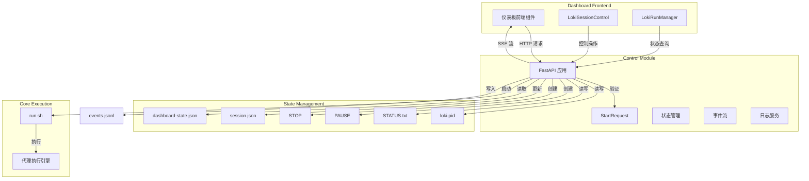
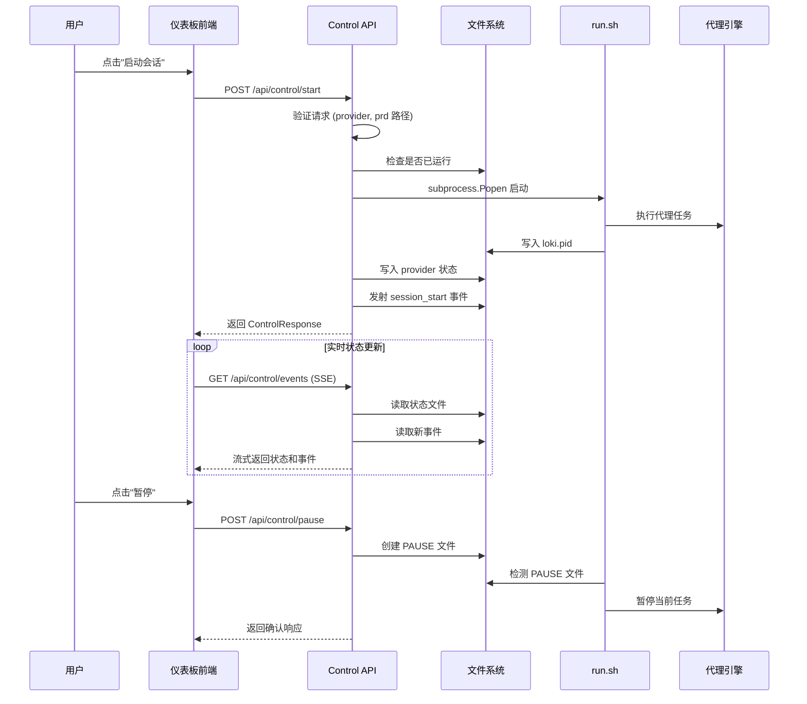

# Control 模块文档

## 概述

Control 模块是 Loki Mode 仪表板后端的核心组件之一，负责提供基于 FastAPI 的会话控制 API 端点。该模块实现了 Loki Mode 会话的完整生命周期管理，包括启动、停止、暂停和恢复功能，同时提供实时状态更新和事件流服务。

### 设计目标

Control 模块的设计源于对自主代理会话进行可视化和可控化管理的需求。在 Loki Mode 系统中，代理会话可能长时间运行并执行复杂任务，用户需要能够：

1. **实时监控**：随时查看会话的当前状态、进度和执行情况
2. **灵活控制**：在必要时干预会话执行流程（暂停、恢复、停止）
3. **安全启动**：以受控方式启动新会话，并进行必要的输入验证
4. **事件追踪**：获取实时事件流以支持仪表板的实时更新

该模块采用文件-based 状态管理机制，通过与 `run.sh` 脚本的协作实现会话控制，确保与核心执行引擎的松耦合集成。

### 核心功能

- **会话生命周期管理**：启动、停止、暂停、恢复会话
- **状态查询**：获取当前会话的详细状态信息
- **事件流服务**：通过 Server-Sent Events (SSE) 提供实时更新
- **日志访问**：检索最近的会话日志
- **健康检查**：提供 API 服务健康状态端点

## 架构设计

### 组件关系图



### 数据流架构



## 核心组件详解

### StartRequest 类

`StartRequest` 是启动会话的请求模型，定义了启动新 Loki Mode 会话所需的所有参数和验证逻辑。

#### 类定义

```python
class StartRequest(BaseModel):
    """Request body for starting a Loki Mode session."""
    prd: Optional[str] = None
    provider: str = "claude"
    parallel: bool = False
    background: bool = True
```

#### 属性说明

| 属性 | 类型 | 默认值 | 说明 |
|------|------|--------|------|
| `prd` | `Optional[str]` | `None` | 产品需求文档 (PRD) 文件的路径。如果提供，代理将基于此文档执行任务 |
| `provider` | `str` | `"claude"` | AI 提供商选择，必须是允许列表中的值 |
| `parallel` | `bool` | `False` | 是否启用并行任务执行模式 |
| `background` | `bool` | `True` | 是否在后台运行会话（不阻塞调用） |

#### 验证方法

##### `validate_provider()`

验证提供的 AI 提供商是否在允许列表中。

**允许提供商列表**：
- `claude` - Anthropic Claude
- `codex` - OpenAI Codex
- `gemini` - Google Gemini

**验证逻辑**：
```python
def validate_provider(self) -> None:
    allowed_providers = ["claude", "codex", "gemini"]
    if self.provider not in allowed_providers:
        raise ValueError(f"Invalid provider: {self.provider}. Must be one of: {', '.join(allowed_providers)}")
```

**异常**：如果提供商不在允许列表中，抛出 `ValueError`

##### `validate_prd_path()`

验证 PRD 文件路径的安全性和存在性，防止路径遍历攻击。

**验证步骤**：

1. **空值检查**：如果 `prd` 为 `None`，跳过验证
2. **路径遍历检测**：检查路径中是否包含 `..` 序列
3. **存在性验证**：解析绝对路径并确认文件存在
4. **文件类型验证**：确保路径指向文件而非目录
5. **目录范围限制**：验证文件位于允许目录内（CWD 或用户主目录）

**安全考虑**：
```python
def validate_prd_path(self) -> None:
    if not self.prd:
        return
    
    # 检查路径遍历序列
    if ".." in self.prd:
        raise ValueError("PRD path contains path traversal sequence (..)")
    
    # 解析并验证存在性
    prd_path = Path(self.prd).resolve()
    if not prd_path.exists():
        raise ValueError(f"PRD file does not exist: {self.prd}")
    
    if not prd_path.is_file():
        raise ValueError(f"PRD path is not a file: {self.prd}")
    
    # 验证在允许目录内
    cwd = Path.cwd().resolve()
    try:
        prd_path.relative_to(cwd)
    except ValueError:
        home = Path.home().resolve()
        try:
            prd_path.relative_to(home)
        except ValueError:
            raise ValueError(f"PRD path is outside allowed directories: {self.prd}")
```

**使用示例**：
```python
# 有效请求
request = StartRequest(
    prd="./docs/requirements.md",
    provider="claude",
    parallel=True
)
request.validate_provider()  # 通过
request.validate_prd_path()  # 通过

# 无效请求 - 路径遍历
request = StartRequest(prd="../../../etc/passwd")
request.validate_prd_path()  # 抛出 ValueError

# 无效请求 - 不允许的提供商
request = StartRequest(provider="gpt-4")
request.validate_provider()  # 抛出 ValueError
```

### 状态响应模型

#### StatusResponse

表示当前会话状态的响应模型，包含丰富的运行时信息。

```python
class StatusResponse(BaseModel):
    """Current session status."""
    state: str                    # 会话状态：running/paused/stopping/stopped
    pid: Optional[int] = None     # 进程 ID
    statusText: str = ""          # 人类可读的状态描述
    currentPhase: str = ""        # 当前执行阶段
    currentTask: str = ""         # 当前正在执行的任务
    pendingTasks: int = 0         # 待处理任务数量
    provider: str = "claude"      # 使用的 AI 提供商
    version: str = "unknown"      # Loki Mode 版本
    lokiDir: str = ""             # Loki 目录路径
    iteration: int = 0            # 当前迭代次数
    complexity: str = "standard"  # 任务复杂度级别
    timestamp: str                # 状态时间戳
```

#### ControlResponse

通用控制操作响应模型。

```python
class ControlResponse(BaseModel):
    """Generic control operation response."""
    success: bool         # 操作是否成功
    message: str          # 响应消息
    pid: Optional[int] = None  # 相关进程 ID
```

### 核心工具函数

#### atomic_write_json

原子性写入 JSON 数据到文件，防止 TOCTOU（Time-of-Check-Time-of-Use）竞态条件。

**实现机制**：
1. 在同一目录创建临时文件
2. 可选地获取文件锁（使用 `fcntl.flock`）
3. 写入数据并刷新到磁盘
4. 使用 `os.rename()` 原子性替换目标文件

```python
def atomic_write_json(file_path: Path, data: dict, use_lock: bool = True):
    """
    Atomically write JSON data to a file to prevent TOCTOU race conditions.
    Uses temporary file + os.rename() for atomicity.
    Optionally uses fcntl.flock for additional safety.
    """
    temp_fd, temp_path = tempfile.mkstemp(
        dir=file_path.parent,
        prefix=f".{file_path.name}.",
        suffix=".tmp"
    )
    
    with os.fdopen(temp_fd, 'w') as f:
        if use_lock:
            fcntl.flock(f.fileno(), fcntl.LOCK_EX)
        json.dump(data, f, indent=2)
        f.flush()
        os.fsync(f.fileno())
    
    os.rename(temp_path, file_path)
```

**使用场景**：
- 更新 `session.json` 文件时防止并发写入冲突
- 确保状态变更的原子性

#### emit_event

向 `events.jsonl` 文件发射事件，用于实时事件流。

**事件格式**：
```json
{
    "timestamp": "2024-01-15T10:30:00+00:00",
    "type": "session_start",
    "data": {
        "pid": 12345,
        "provider": "claude",
        "prd": "./docs/requirements.md",
        "parallel": true
    }
}
```

**支持的事件类型**：
- `session_start` - 会话启动
- `session_stop` - 会话停止
- `session_pause` - 会话暂停
- `session_resume` - 会话恢复

#### get_status

获取当前会话的完整状态，整合多个状态源的信息。

**状态源**：
1. `loki.pid` - 进程 ID 文件
2. `STATUS.txt` - 人类可读状态文本
3. `PAUSE` / `STOP` - 控制标志文件
4. `session.json` - 会话元数据（skill-invoked 会话）
5. `dashboard-state.json` - 仪表板状态（阶段、迭代、任务）
6. `state/provider` - 提供商配置
7. `state/orchestrator.json` - 编排器状态（当前任务）

**状态判定逻辑**：
```python
state = "stopped"
if running:
    if pause_file.exists():
        state = "paused"
    elif stop_file.exists():
        state = "stopping"
    else:
        state = "running"
```

**陈旧性检查**：对于 skill-invoked 会话，如果超过 6 小时未更新，自动标记为 stopped。

## API 端点详解

### 健康检查

#### `GET /api/control/health`

检查 API 服务健康状态。

**响应示例**：
```json
{
    "status": "ok",
    "version": "1.0.0"
}
```

**用途**：
- 仪表板启动时检查后端可用性
- 负载均衡器健康探测
- 监控系统的存活检查

### 会话状态

#### `GET /api/control/status`

获取当前会话的详细状态。

**响应示例**：
```json
{
    "state": "running",
    "pid": 12345,
    "statusText": "执行任务：实现用户认证模块",
    "currentPhase": "implementation",
    "currentTask": "auth_module",
    "pendingTasks": 3,
    "provider": "claude",
    "version": "1.0.0",
    "lokiDir": "/home/user/.loki",
    "iteration": 5,
    "complexity": "standard",
    "timestamp": "2024-01-15T10:30:00+00:00"
}
```

**状态值说明**：

| 状态 | 说明 |
|------|------|
| `running` | 会话正常运行中 |
| `paused` | 会话已暂停（等待用户恢复） |
| `stopping` | 会话正在停止（优雅关闭中） |
| `stopped` | 会话已停止 |

### 启动会话

#### `POST /api/control/start`

启动新的 Loki Mode 会话。

**请求体**：
```json
{
    "prd": "./docs/requirements.md",
    "provider": "claude",
    "parallel": true,
    "background": true
}
```

**成功响应**：
```json
{
    "success": true,
    "message": "Session started with provider claude",
    "pid": 12345
}
```

**错误响应**：

| HTTP 状态码 | 场景 |
|-------------|------|
| 400 | 验证失败（无效提供商、路径遍历、文件不存在） |
| 409 | 会话已在运行 |
| 500 | run.sh 未找到或启动失败 |

**执行流程**：
1. 验证请求参数（提供商、PRD 路径）
2. 检查是否已有会话在运行
3. 验证 `run.sh` 脚本存在
4. 构建命令行参数
5. 使用 `subprocess.Popen` 启动进程
6. 保存提供商配置
7. 发射 `session_start` 事件
8. 返回响应

**命令行参数映射**：
```python
args = [str(RUN_SH), "--provider", request.provider]
if request.parallel:
    args.append("--parallel")
if request.background:
    args.append("--bg")
if request.prd:
    args.append(request.prd)
```

### 停止会话

#### `POST /api/control/stop`

停止当前运行的会话。

**响应示例**：
```json
{
    "success": true,
    "message": "Stop signal sent",
    "pid": 12345
}
```

**停止机制**：

1. **创建 STOP 文件**：信号通知 `run.sh` 优雅关闭
   ```python
   stop_file.write_text(datetime.now(timezone.utc).isoformat())
   ```

2. **直接终止进程**：发送 `SIGTERM` 信号
   ```python
   os.kill(pid, signal.SIGTERM)
   ```

3. **更新 session.json**：标记会话为 stopped
   ```python
   session_data["status"] = "stopped"
   atomic_write_json(session_file, session_data, use_lock=True)
   ```

4. **发射事件**：记录停止事件
   ```python
   emit_event("session_stop", {"pid": pid, "reason": "user_request"})
   ```

**优雅关闭**：`run.sh` 检测到 STOP 文件后，会完成当前任务然后退出，确保状态一致性。

### 暂停会话

#### `POST /api/control/pause`

暂停当前会话（在当前任务完成后）。

**响应示例**：
```json
{
    "success": true,
    "message": "Pause signal sent - session will pause after current task",
    "pid": 12345
}
```

**暂停机制**：
- 创建 `PAUSE` 文件，时间戳标记
- `run.sh` 检测到 PAUSE 文件后，在当前任务完成后暂停
- 会话状态变为 `paused`，等待恢复

**使用场景**：
- 需要临时中断会话进行检查
- 资源限制时需要暂停执行
- 用户需要时间审查当前进度

### 恢复会话

#### `POST /api/control/resume`

恢复已暂停的会话。

**响应示例**：
```json
{
    "success": true,
    "message": "Session resumed",
    "pid": 12345
}
```

**恢复机制**：
- 删除 `PAUSE` 文件
- 删除 `STOP` 文件（如果存在）
- `run.sh` 检测到控制文件移除后继续执行
- 发射 `session_resume` 事件

### 事件流

#### `GET /api/control/events`

通过 Server-Sent Events (SSE) 流式传输实时事件。

**响应类型**：`text/event-stream`

**事件格式**：
```
event: status
data: {"state": "running", "pid": 12345, ...}

event: log
data: {"timestamp": "...", "type": "task_complete", "data": {...}}
```

**实现机制**：

```python
async def event_generator():
    # 发送初始状态
    status = get_status()
    yield f"data: {json.dumps(status.model_dump())}\n\n"
    
    # 跟踪文件位置以增量读取
    last_position = 0
    if EVENTS_FILE.exists():
        last_position = EVENTS_FILE.stat().st_size
    
    # 流式更新
    while True:
        # 每 2 秒发送状态更新
        status = get_status()
        yield f"event: status\ndata: {json.dumps(status.model_dump())}\n\n"
        
        # 检查新事件
        if EVENTS_FILE.exists():
            current_size = EVENTS_FILE.stat().st_size
            if current_size > last_position:
                with open(EVENTS_FILE, "r") as f:
                    f.seek(last_position)
                    for line in f:
                        yield f"event: log\ndata: {line}\n\n"
                last_position = current_size
        
        await asyncio.sleep(2)
```

**前端使用示例**：
```javascript
const eventSource = new EventSource('/api/control/events');

eventSource.addEventListener('status', (event) => {
    const status = JSON.parse(event.data);
    updateDashboard(status);
});

eventSource.addEventListener('log', (event) => {
    const logEntry = JSON.parse(event.data);
    appendLog(logEntry);
});
```

### 日志检索

#### `GET /api/control/logs`

获取最近的会话日志行。

**查询参数**：
- `lines` (可选): 返回的行数，默认 50，最大 10000

**请求示例**：
```
GET /api/control/logs?lines=100
```

**响应示例**：
```json
{
    "logs": [
        "[INFO] Starting task: auth_module",
        "[INFO] Analyzing requirements...",
        "[INFO] Generated 3 test cases"
    ],
    "total": 1523
}
```

**日志文件位置**：`{LOKI_DIR}/logs/session.log`

## 配置选项

### 环境变量

| 变量名 | 默认值 | 说明 |
|--------|--------|------|
| `LOKI_DIR` | `.loki` | Loki 数据目录路径 |
| `LOKI_DASHBOARD_PORT` | `57374` | API 服务监听端口 |
| `LOKI_DASHBOARD_HOST` | `127.0.0.1` | API 服务监听地址 |
| `LOKI_DASHBOARD_CORS` | `http://localhost:57374,http://127.0.0.1:57374` | 允许的 CORS 源（逗号分隔） |

### 目录结构

```
{LOKI_DIR}/
├── state/                  # 状态文件目录
│   ├── provider           # 当前提供商配置
│   └── orchestrator.json  # 编排器状态
├── logs/                   # 日志文件目录
│   └── session.log        # 会话日志
├── loki.pid               # 进程 ID 文件
├── STATUS.txt             # 人类可读状态
├── PAUSE                  # 暂停标志文件
├── STOP                   # 停止标志文件
├── session.json           # 会话元数据
├── dashboard-state.json   # 仪表板状态
└── events.jsonl           # 事件日志（JSONL 格式）
```

### CORS 配置

默认情况下，API 仅允许来自本地仪表板的请求：

```python
_cors_origins = os.environ.get(
    "LOKI_DASHBOARD_CORS",
    "http://localhost:57374,http://127.0.0.1:57374"
).split(",")
```

**生产环境配置**：
```bash
export LOKI_DASHBOARD_CORS="https://dashboard.example.com,https://admin.example.com"
```

## 使用指南

### 启动 Control API 服务

**方法 1：使用 uvicorn 直接运行**
```bash
uvicorn dashboard.control:app --host 0.0.0.0 --port 57374
```

**方法 2：使用 Loki CLI**
```bash
loki dashboard start
```

**方法 3：作为模块运行**
```bash
python -m dashboard.control
```

### 启动会话

**使用 curl**：
```bash
curl -X POST http://localhost:57374/api/control/start \
  -H "Content-Type: application/json" \
  -d '{
    "prd": "./docs/requirements.md",
    "provider": "claude",
    "parallel": true
  }'
```

**使用 Python SDK**：
```python
from sdk.python.loki_mode_sdk.client import AutonomiClient

client = AutonomiClient(base_url="http://localhost:57374")
response = client.control.start(
    prd="./docs/requirements.md",
    provider="claude",
    parallel=True
)
print(f"Session started with PID: {response.pid}")
```

**使用 TypeScript SDK**：
```typescript
import { AutonomiClient } from '@loki-mode/sdk';

const client = new AutonomiClient({ baseUrl: 'http://localhost:57374' });
const response = await client.control.start({
  prd: './docs/requirements.md',
  provider: 'claude',
  parallel: true
});
console.log(`Session started with PID: ${response.pid}`);
```

### 监控会话状态

**轮询方式**：
```python
import requests
import time

while True:
    response = requests.get('http://localhost:57374/api/control/status')
    status = response.json()
    print(f"State: {status['state']}, Task: {status['currentTask']}")
    
    if status['state'] == 'stopped':
        break
    
    time.sleep(5)
```

**SSE 流式方式**：
```python
import requests
import json

response = requests.get(
    'http://localhost:57374/api/control/events',
    stream=True
)

for line in response.iter_lines():
    if line:
        line = line.decode('utf-8')
        if line.startswith('data:'):
            data = json.loads(line[5:])
            print(f"Event: {data}")
```

### 控制会话

**暂停会话**：
```bash
curl -X POST http://localhost:57374/api/control/pause
```

**恢复会话**：
```bash
curl -X POST http://localhost:57374/api/control/resume
```

**停止会话**：
```bash
curl -X POST http://localhost:57374/api/control/stop
```

## 与其他模块的集成

### 与 Dashboard Frontend 的集成

Control 模块为 [Dashboard Frontend](dashboard-frontend.md) 的多个组件提供后端支持：

- **LokiSessionControl**：直接使用控制端点进行会话管理
- **LokiRunManager**：查询会话状态和日志
- **LokiOverview**：显示当前会话概览信息
- **LokiLogStream**：流式显示会话日志

**前端组件调用示例**：
```typescript
// dashboard.frontend/src/components/loki-session-control.tsx
const startSession = async (config: StartConfig) => {
  const response = await fetch('/api/control/start', {
    method: 'POST',
    headers: { 'Content-Type': 'application/json' },
    body: JSON.stringify(config)
  });
  return await response.json();
};

const subscribeToEvents = () => {
  const eventSource = new EventSource('/api/control/events');
  eventSource.addEventListener('status', updateStatus);
  eventSource.addEventListener('log', appendLog);
};
```

### 与 State Management 的集成

Control 模块与 [State Management](state-management.md) 模块协同工作，使用文件-based 状态存储：

- 读取 `ManagedFile` 状态进行状态查询
- 通过文件锁机制确保并发安全
- 与通知通道集成以支持实时状态更新

### 与 API Server 的集成

Control 模块作为 [API Server & Services](api-server.md) 的一部分：

- 使用相同的 FastAPI 应用结构
- 遵循统一的 API 设计规范
- 与 EventBus 集成发射控制事件

### 与 SDK 的集成

[Python SDK](python-sdk.md) 和 [TypeScript SDK](typescript-sdk.md) 封装了 Control API：

```python
# Python SDK 封装
class ControlAPI:
    def start(self, prd: str = None, provider: str = "claude", ...):
        return self._client.post("/api/control/start", json={...})
    
    def stop(self):
        return self._client.post("/api/control/stop")
    
    def get_status(self):
        return self._client.get("/api/control/status")
```

## 边缘情况和注意事项

### 并发控制

**问题**：多个客户端同时尝试启动会话

**解决方案**：
- 启动前检查 `get_status().state == "running"`
- 使用文件锁保护状态文件写入
- 返回 409 Conflict 响应告知客户端

**代码示例**：
```python
status = get_status()
if status.state == "running":
    raise HTTPException(
        status_code=409,
        detail=f"Session already running with PID {status.pid}"
    )
```

### 进程状态同步

**问题**：PID 文件存在但进程已终止

**解决方案**：
- 使用 `os.kill(pid, 0)` 检查进程是否真正运行
- 对于 skill-invoked 会话，检查 `session.json` 的 `startedAt` 时间戳
- 实施 6 小时陈旧性检查，自动标记过期会话为 stopped

**代码示例**：
```python
def is_process_running(pid: int) -> bool:
    try:
        os.kill(pid, 0)
        return True
    except (OSError, ProcessLookupError):
        return False
```

### 路径安全

**问题**：PRD 路径可能包含路径遍历攻击

**解决方案**：
- 拒绝包含 `..` 的路径
- 解析绝对路径并验证文件存在
- 限制文件必须位于 CWD 或用户主目录内

**安全边界**：
```python
if ".." in self.prd:
    raise ValueError("PRD path contains path traversal sequence (..)")

prd_path = Path(self.prd).resolve()
try:
    prd_path.relative_to(cwd)
except ValueError:
    try:
        prd_path.relative_to(home)
    except ValueError:
        raise ValueError(f"PRD path is outside allowed directories: {self.prd}")
```

### 文件锁兼容性

**问题**：`fcntl.flock` 在某些平台（如 Windows）上不可用

**解决方案**：
- 使用 try-except 捕获异常
- 在不可用时优雅降级
- 依赖原子性 `os.rename()` 作为主要保护机制

**代码示例**：
```python
try:
    fcntl.flock(f.fileno(), fcntl.LOCK_EX)
except (OSError, AttributeError):
    # flock not available on this platform - continue without lock
    pass
```

### SSE 连接管理

**问题**：长时间运行的 SSE 连接可能耗尽服务器资源

**注意事项**：
- 前端应实现重连逻辑和退避策略
- 服务器应设置合理的超时（当前实现为无限）
- 考虑实施连接数限制以防止 DoS

**前端重连示例**：
```javascript
function connectWithRetry() {
    const eventSource = new EventSource('/api/control/events');
    
    eventSource.onerror = () => {
        eventSource.close();
        setTimeout(connectWithRetry, 5000); // 5 秒后重试
    };
}
```

### 优雅关闭

**问题**：强制终止可能导致状态不一致

**解决方案**：
- 优先使用 STOP 文件信号优雅关闭
- 给予 `run.sh` 时间完成当前任务
- 仅在必要时发送 SIGTERM
- 更新 `session.json` 标记最终状态

**关闭顺序**：
1. 创建 STOP 文件
2. 等待 `run.sh` 检测并处理
3. 如果超时，发送 SIGTERM
4. 更新 session.json 状态
5. 发射 session_stop 事件

## 已知限制

1. **单会话限制**：当前实现仅支持单个活动会话。尝试启动新会话时，如果已有会话运行，将返回 409 错误。

2. **平台兼容性**：文件锁功能在 Windows 上不可用，依赖原子性重命名作为主要保护机制。

3. **SSE 连接数**：未实施连接数限制，大量并发连接可能影响服务器性能。

4. **日志轮转**：日志文件不会自动轮转，长时间运行的会话可能产生大日志文件。

5. **事件文件增长**：`events.jsonl` 文件会持续增长，需要外部机制进行清理。

6. **PID 文件陈旧**：如果进程异常终止而未清理 PID 文件，可能需要手动清理。

## 扩展指南

### 添加新的控制操作

1. **定义请求/响应模型**：
```python
class NewOperationRequest(BaseModel):
    param1: str
    param2: int = 0

class NewOperationResponse(BaseModel):
    success: bool
    result: str
```

2. **实现端点**：
```python
@app.post("/api/control/new-operation", response_model=NewOperationResponse)
async def new_operation(request: NewOperationRequest):
    # 验证输入
    # 执行操作
    # 更新状态
    # 发射事件
    return NewOperationResponse(success=True, result="...")
```

3. **更新前端组件**：在相应的 Dashboard UI 组件中添加调用逻辑

### 添加新的事件类型

1. **在 emit_event 调用中使用新类型**：
```python
emit_event("custom_event", {
    "custom_field": "value",
    "another_field": 123
})
```

2. **在前端添加事件处理器**：
```javascript
eventSource.addEventListener('custom_event', (event) => {
    const data = JSON.parse(event.data);
    handleCustomEvent(data);
});
```

### 自定义状态源

如需从额外来源获取状态信息，扩展 `get_status()` 函数：

```python
def get_status() -> StatusResponse:
    # ... 现有逻辑 ...
    
    # 添加新状态源
    custom_file = LOKI_DIR / "custom-state.json"
    if custom_file.exists():
        custom_state = json.loads(custom_file.read_text())
        # 整合到响应中
    
    return StatusResponse(...)
```

## 故障排除

### 会话无法启动

**检查清单**：
1. 验证 `run.sh` 存在于预期位置
2. 检查 LOKI_DIR 权限
3. 查看 API 日志获取详细错误
4. 确认没有会话已在运行

**调试命令**：
```bash
# 检查 run.sh 位置
ls -la $(python -c "from dashboard.control import RUN_SH; print(RUN_SH)")

# 检查是否有运行中的会话
cat .loki/loki.pid 2>/dev/null && ps -p $(cat .loki/loki.pid)

# 查看 API 日志
tail -f .loki/logs/api.log
```

### 状态不同步

**症状**：仪表板显示的状态与实际会话状态不一致

**解决方案**：
1. 检查状态文件是否损坏
2. 手动清理陈旧的状态文件
3. 重启 Control API 服务
4. 验证 `run.sh` 正确更新状态文件

**清理命令**：
```bash
rm -f .loki/loki.pid .loki/STATUS.txt .loki/PAUSE .loki/STOP
```

### SSE 连接断开

**症状**：实时事件流停止更新

**解决方案**：
1. 检查网络连接
2. 验证 API 服务仍在运行
3. 检查浏览器控制台错误
4. 实施前端重连逻辑

## 相关文档

- [Dashboard Backend](dashboard-backend.md) - 仪表板后端整体架构
- [Dashboard Frontend](dashboard-frontend.md) - 前端组件和集成
- [State Management](state-management.md) - 状态管理机制
- [API Server & Services](api-server.md) - API 服务器架构
- [Python SDK](python-sdk.md) - Python 客户端库
- [TypeScript SDK](typescript-sdk.md) - TypeScript 客户端库
