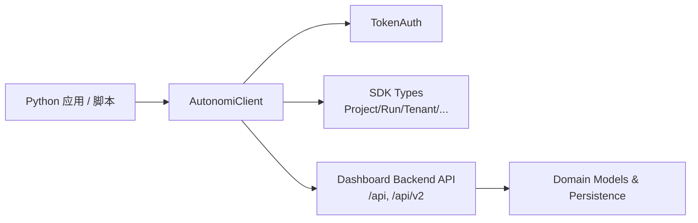
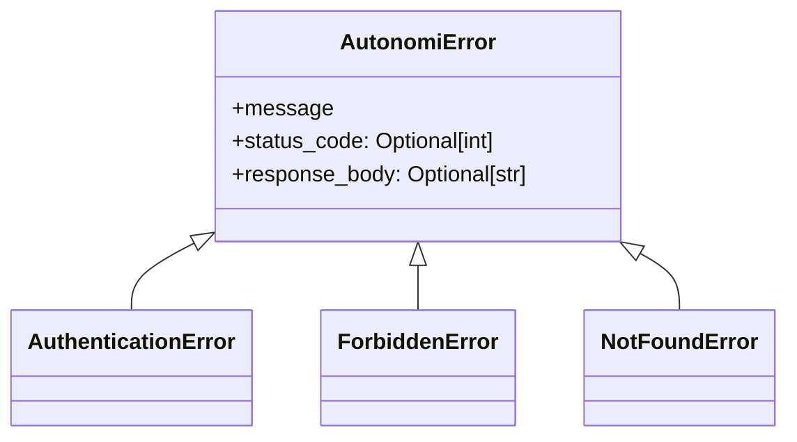
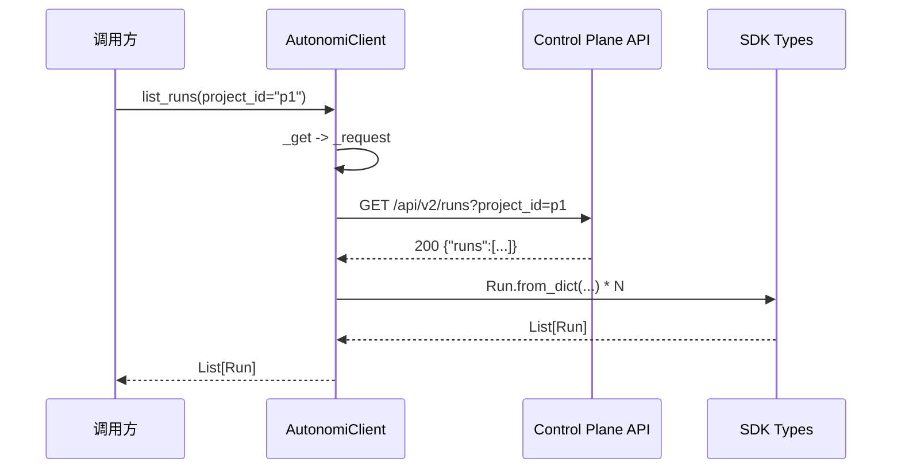

# core_client_transport 模块文档

## 模块简介

`core_client_transport` 是 Python SDK 中最底层、最关键的“传输与入口”模块，对应核心实现 `sdk.python.loki_mode_sdk.client.AutonomiClient`。这个模块的主要目标是把调用方的 Python 方法调用，稳定地映射为对 Autonomi Control Plane HTTP API 的请求，并将响应转换为 SDK 类型对象（如 `Project`、`Run`、`Tenant` 等）。

这个模块存在的意义，不是简单“包一层 HTTP”，而是提供一个统一的通信语义：统一的 URL 拼接规则、统一的认证头注入、统一的 JSON 编码/解码、统一的错误模型、统一的返回风格（列表接口返回类型对象列表，204 返回 `None` 或空集合兜底）。对于上层业务代码而言，这显著降低了样板代码和分散错误处理带来的维护成本。

从系统视角看，它是 Python SDK 与 Dashboard Backend / API Surface 的对接边界。它向上服务于 `resource_managers`（如 `EventStream`、`SessionManager`、`TaskManager`）和业务脚本，向下依赖后端 REST 契约。关于 SDK 全局结构可参考 [Python SDK.md](Python SDK.md)；关于具体数据模型可参考 [Python SDK - 类型定义.md](Python SDK - 类型定义.md)；关于服务端接口域可参考 [Dashboard Backend.md](Dashboard Backend.md) 与 [api_surface_and_transport.md](api_surface_and_transport.md)。

---

## 在整体架构中的位置



`AutonomiClient` 的边界很清晰：它不实现业务编排，不管理本地状态，也不做复杂缓存；它专注于“可靠请求 + 响应映射 + 统一异常”。这种设计使模块具备高可替换性：如果未来需要引入异步客户端或重试层，可以在不破坏上层语义的前提下演进。

---

## 设计与实现要点

### 零外部依赖的传输层

模块仅使用 Python 标准库 `urllib` 与 `json`。优点是部署环境要求低、依赖冲突风险小；代价是功能较原始（例如无内建连接池、无自动重试、无拦截器机制），因此调用方在高吞吐或弱网络场景下需额外考虑稳定性策略。

### 同步优先模型

`AutonomiClient` 全部接口是同步调用。它适合 CLI、运维脚本、管理后台任务等串行场景；如果放入高并发异步服务，建议在应用层做线程池隔离，或实现一个 async 版本适配器。

### 面向资源分组的方法设计

客户端按资源域分组公开方法：`projects`、`tenants`、`runs`、`api-keys`、`audit`、`status`。这种分组与后端路径结构（`/api/*` 与 `/api/v2/*`）一致，降低了排障和接口追踪难度。

---

## 核心组件详解

## 1) `AutonomiClient`

### 构造函数

```python
AutonomiClient(
    base_url: str = "http://localhost:57374",
    token: Optional[str] = None,
    timeout: int = 30,
)
```

构造阶段主要完成三件事：规范化 `base_url`（去掉尾部 `/`）、记录超时配置、按需创建 `TokenAuth`。其中 token 可选，这意味着某些公开或健康检查端点可无鉴权访问，但访问受保护资源时会触发 401。

参数语义：

- `base_url`：控制平面 API 的根地址。
- `token`：Bearer token；若提供则自动注入 `Authorization` 头。
- `timeout`：传给 `urllib.request.urlopen` 的超时秒数。

副作用与约束：

- 如果传入空字符串 token（`""`），`TokenAuth` 会抛 `ValueError`。
- `timeout` 是单次请求超时，不是全链路重试窗口。

### 内部请求核心：`_request`

```python
_request(method, path, data=None, params=None) -> Optional[Dict[str, Any]]
```

`_request` 是整个客户端行为一致性的核心。它依次完成：

1. 拼接 URL：`base_url + path`。
2. 清理查询参数：过滤 `None` 值，避免发送无意义参数。
3. JSON 序列化请求体（若 `data` 非空）。
4. 统一设置请求头：`Content-Type` 与 `Accept` 均为 `application/json`。
5. 注入认证头（若有 `_auth`）。
6. 发起请求并解析响应：
   - 204 返回 `None`
   - 空 body 返回 `None`
   - 其他按 JSON 解析
7. 捕获 `HTTPError` 并映射为 SDK 异常。

这使所有公开 API 方法天然获得一致的行为，不需要在每个方法里重复编码/解码和异常分流逻辑。

### 语法糖包装：`_get/_post/_put/_delete`

这些方法是 `_request` 的轻量封装，减少重复书写。`_delete` 不返回值，强调其语义是“动作型调用”。

---

## 2) 异常体系（虽然非模块树核心项，但对调用方极其关键）



该模块定义了分层异常模型：

- `AutonomiError`：通用 API 异常基类，保留 `status_code` 与原始 `response_body`。
- `AuthenticationError`：401。
- `ForbiddenError`：403。
- `NotFoundError`：404。

`_STATUS_ERROR_MAP` 负责状态码到异常类的映射，其它状态码统一归类为 `AutonomiError`。此外，模块会尝试从错误 JSON 中提取 `detail` 或 `message` 字段构造更友好的异常文案，这对后端返回标准 FastAPI 错误体时尤其有用。

---

## 3) 资源接口族行为说明

## 状态接口

`get_status()` 调用 `/api/status`，返回字典。若返回为空或 204，则兜底 `{}`。这使健康检查调用方可以避免空值分支。

## 项目接口

- `list_projects()`：支持两种响应形态（直接数组，或 `{ "projects": [...] }` 包装）。
- `get_project(project_id)`：返回单个 `Project`。
- `create_project(name, description=None)`：按需携带 `description`。

内部都会用 `Project.from_dict` 做强约束映射，因此当后端缺失必填字段（如 `id`/`name`）时会在反序列化处抛错，这有助于尽早暴露契约破坏。

## 租户接口

- `list_tenants()`、`create_tenant()` 对应 `/api/v2/tenants`。
- 与项目接口同样支持“数组或包装对象”的响应容错。

## 运行接口

- `list_runs(project_id=None, status=None)`：自动过滤空查询参数。
- `get_run(run_id)`：查询单次执行。
- `cancel_run(run_id)` 与 `replay_run(run_id)`：动作型 POST。
- `get_run_timeline(run_id)`：返回 `RunEvent` 列表，兼容 `[]` 或 `{"events":[]}`。

## API Key 接口

- `list_api_keys()` 返回 `ApiKey` 对象列表。
- `create_api_key()` 与 `rotate_api_key()` 返回原始字典（包含敏感 token 的一次性返回语义）。

这里不转成 dataclass 是刻意设计：创建/轮换响应通常包含“只展示一次”的原始 token 字段，保持字典更灵活，减少类型约束导致的信息丢失。

## 审计接口

`query_audit(start_date=None, end_date=None, action=None, limit=100)` 对应 `/api/v2/audit`。`limit` 默认 100，是一个保守防护值，防止一次性拉取过大审计数据。

---

## 请求执行与数据流



这个流程体现了模块的核心价值：调用方拿到的不是裸 JSON，而是具备明确字段语义的类型对象。同时，底层 HTTP 细节对业务代码透明。

---

## 认证与类型依赖关系

`AutonomiClient` 对外只暴露“是否传 token”的配置，但内部通过 `TokenAuth.headers()` 注入 Bearer 头。认证对象可视为可替换点：如果未来支持 API key header、多租户上下文 header，可沿用同样模式扩展。

类型映射依赖如下：

- `Project`, `Tenant`, `Run`, `RunEvent`, `ApiKey`, `AuditEntry` 通过 `from_dict` 反序列化。
- 这些类型定义及字段语义详见 [Python SDK - 类型定义.md](Python SDK - 类型定义.md)。

---

## 使用示例

### 1. 基础初始化与项目查询

```python
from loki_mode_sdk.client import AutonomiClient

client = AutonomiClient(
    base_url="http://localhost:57374",
    token="loki_xxx",
    timeout=30,
)

for p in client.list_projects():
    print(p.id, p.name, p.status)
```

### 2. 精细化错误处理

```python
from loki_mode_sdk.client import (
    AutonomiClient,
    AuthenticationError,
    ForbiddenError,
    NotFoundError,
    AutonomiError,
)

client = AutonomiClient(token="loki_xxx")

try:
    run = client.get_run("run_123")
except AuthenticationError:
    print("Token 无效或过期，请重新登录")
except ForbiddenError:
    print("当前 token 没有读取 run 的权限")
except NotFoundError:
    print("run_123 不存在")
except AutonomiError as e:
    print("通用 API 错误:", e.status_code, e.response_body)
```

### 3. 带过滤条件的审计查询

```python
entries = client.query_audit(
    start_date="2026-01-01T00:00:00Z",
    end_date="2026-01-31T23:59:59Z",
    action="api_key.rotate",
    limit=200,
)

for e in entries:
    print(e.timestamp, e.action, e.success)
```

---

## 配置、扩展与二次封装建议

在生产环境中，建议将 `AutonomiClient` 作为“基础传输对象”再包一层领域服务，以便统一日志、指标、重试和幂等策略。例如可封装一个 `SafeClient`，在捕获 `AutonomiError` 后按状态码和业务上下文做重试或告警。

如果要扩展新接口，推荐遵循现有模式：

1. 在公开方法中只做参数拼装与 `from_dict` 映射。
2. 传输细节全部复用 `_request`。
3. 响应尽量兼容“数组与包装对象”两种结构。
4. 需要保留原始字段时返回 `Dict[str, Any]`，否则优先返回类型对象。

---

## 边界条件、错误场景与限制

### 重要边界行为

- 查询参数中值为 `None` 会被自动剔除，不会进入 URL。
- 204 或空响应体会变为 `None`；部分公开方法再将其兜底为空列表或空字典。
- `list_*` 方法支持两类响应格式（裸数组 / 命名字段包装）。

### 已知限制

- 只显式映射了 401/403/404，其他 4xx/5xx 都是 `AutonomiError`。
- 未捕获 `URLError`、超时等网络层异常为 SDK 自定义异常；调用方需额外处理底层异常。
- 默认总是发送 `Content-Type: application/json`，不适合 multipart 上传场景。
- 无自动重试、断路器、速率限制控制。
- 全同步接口，不适合高并发 async 工作负载。

### 维护与排障建议

当出现“类型解析异常（KeyError）”时，优先怀疑后端返回契约变化；当出现 `AutonomiError` 且 `response_body` 非空时，应直接记录 body 以便快速定位后端错误细节。

---

## 与其他模块的协同关系

本模块是 Python SDK 的 transport 核心，通常不会独立使用，而是作为更高层能力的基础。

- 与 [Python SDK.md](Python SDK.md)：该文档解释 SDK 全景和入口。
- 与 [Python SDK - 管理器类.md](Python SDK - 管理器类.md)：管理器通常复用或组合 `AutonomiClient`。
- 与 [Python SDK - 类型定义.md](Python SDK - 类型定义.md)：`from_dict` 映射的字段语义来源。
- 与 [TypeScript SDK.md](TypeScript SDK.md)：可对照跨语言客户端一致性策略（错误模型、资源分组、鉴权方式）。

通过这种分层，`core_client_transport` 保持“窄接口、强一致、易扩展”的基础设施属性，为 SDK 其余模块提供稳定通信底座。
