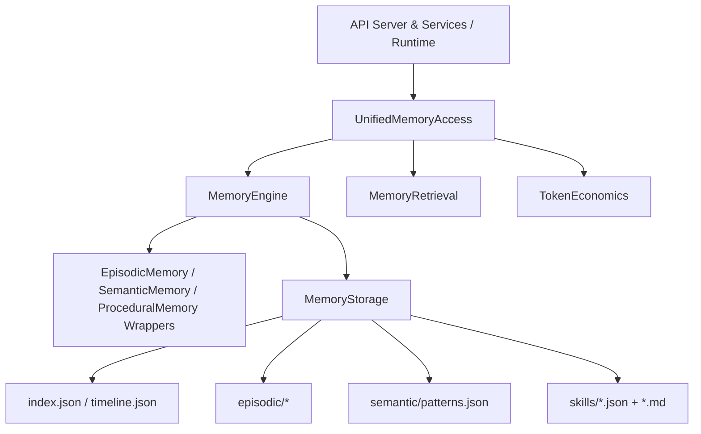
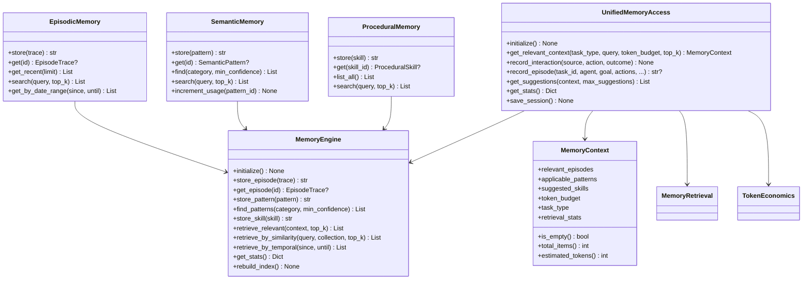
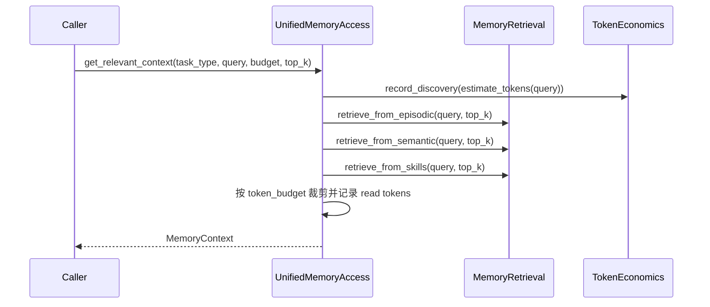
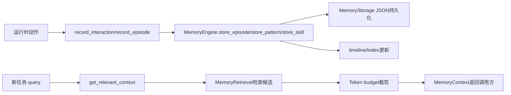

# core_memory_facade_and_domains 模块文档

## 模块介绍与设计动机

`core_memory_facade_and_domains` 是 Memory System 中最靠近“业务调用面”的核心模块，聚焦两件事：第一，把底层三类记忆（episodic / semantic / procedural）的存取能力统一为稳定 API；第二，为上层运行时（CLI、API 服务、Agent、Dashboard 后端）提供一个带预算约束、带任务语义、可追踪 token 开销的访问入口。该模块存在的根本意义，是将“存储细节 + 检索策略 + 生命周期管理”从调用方剥离，让调用方以更低心智负担使用记忆系统。

从代码结构看，这个模块由两层组成。底层是 `memory.engine.MemoryEngine` 与三个域包装器 `EpisodicMemory`、`SemanticMemory`、`ProceduralMemory`；上层是 `memory.unified_access.UnifiedMemoryAccess` 及其数据容器 `MemoryContext`。前者偏“领域能力编排”，后者偏“统一门面 + 会话级治理”。这是一种典型的 Facade + Domain Wrappers 设计：把复杂系统拆成可组合的内部对象，再对外暴露更高阶、更稳定的入口。

---

## 在整体系统中的位置



在系统分层上，这个模块承上启下：向上服务于 API、SDK、Dashboard 等交互层；向下依赖 `MemoryStorage`、`MemoryRetrieval`、`TokenEconomics` 与 schemas。对于存储原子性、锁机制和命名空间隔离，请参考 [memory_foundation_and_schemas.md](memory_foundation_and_schemas.md) 与 [retrieval_and_progressive_loading.md](retrieval_and_progressive_loading.md)；本文重点解释门面与领域层如何协同工作。

---

## 架构与组件关系



这套关系有一个非常关键的维护认知：`EpisodicMemory / SemanticMemory / ProceduralMemory` 基本是“薄包装器”，真正的数据行为语义都在 `MemoryEngine`；而 `UnifiedMemoryAccess` 又是对引擎与检索层的再包装，增加“预算、统计、建议、会话”语义。因此如果你要改“数据如何存取”，主要改 `MemoryEngine`；如果要改“调用体验与策略”，主要改 `UnifiedMemoryAccess`。

---

## 核心数据域（Domain Objects）

虽然本模块不定义 schemas，但它深度依赖以下领域模型并按其字段约定读写：

- `EpisodeTrace`：任务执行轨迹，含 action log、outcome、错误列表、文件读写足迹。
- `SemanticPattern`：由 episode 抽象出的可复用规律，含 confidence、usage_count、source_episodes。
- `ProceduralSkill`：可执行技能模板，含前置条件、步骤、常见错误修复、退出标准。
- `ActionEntry`：episode 内单步动作。

由于 `MemoryEngine` 在 `_dict_to_episode/_dict_to_pattern/_dict_to_skill` 中进行了字典到对象的手工转换，字段命名兼容性（比如 `context.goal` 与 `goal` 双源）被编码在转换逻辑里。扩展 schemas 时要同步检查这些转换函数，否则容易出现“写入成功但读取字段丢失”的隐性问题。

---

## MemoryEngine 详解（领域编排内核）

### 1) 初始化与生命周期

`initialize()` 会确保目录和基础文件存在，包括 `index.json`、`timeline.json`、`semantic/patterns.json`、`semantic/anti-patterns.json`。它是幂等操作，可以安全重复调用。

`cleanup_old(days=30)` 会清理过期 episodic 文件，但有一个保护机制：如果某个 episode ID 被 `semantic/patterns.json` 的 `source_episodes` 引用，该 episode 不会被删。这是知识可追溯性的关键保障。

### 2) Episodic 流程

`store_episode(trace)` 的输入是 `EpisodeTrace`（或兼容对象），输出 `episode_id`。副作用包括：

- 落盘到 `episodic/YYYY-MM-DD/task-{episode_id}.json`
- 更新时间线（recent_actions）
- 如配置 embedding function，则加入 embedding 队列（当前是占位实现）

`get_episode(episode_id)` 优先用 ID 里的日期分段定位目录，否则走全目录扫描。`get_recent_episodes(limit)` 则按日期目录逆序读取近期轨迹。

### 3) Semantic 流程

`store_pattern(pattern)` 实际做的是 upsert：ID 已存在则覆盖，不存在则追加，然后调用 `_update_index_with_pattern` 更新主题索引。

`find_patterns(category, min_confidence)` 按类别和置信度过滤。`increment_pattern_usage(pattern_id)` 只更新 `usage_count` 和 `last_used`，适合在“命中并实际采用模式”后调用。

### 4) Procedural 流程

`store_skill(skill)` 会双写两种格式：

- `skills/{slug}.md`：便于人工阅读
- `skills/{slug}.json`：便于程序化检索

这是典型的“人机双消费”设计。`get_skill` 与 `list_skills` 以 JSON 元数据为准，不解析 markdown。

### 5) 统一检索

`retrieve_relevant(context, top_k)` 支持任务类型感知。若 `context.task_type == "auto"`，会触发 `_detect_task_type` 进行启发式判定，然后按 `TASK_STRATEGIES` 从 episodic/semantic/skills/anti-patterns 拉取候选并加权排序。

`retrieve_by_similarity(query, collection, top_k)` 若没有 embedding 配置会回退关键词检索。当前 `_vector_search` 仍是占位（内部继续回退关键词），这意味着“声明了向量检索入口”但还没有真正向量召回效果。

`retrieve_by_temporal(since, until)` 目前主要覆盖 episodic 基于日期目录的时间窗检索。

### 6) 索引与统计

`get_stats()` 返回多类记忆数量与索引元信息。`rebuild_index()` 全量扫描 memory 文件并重建 topics、total_memories、token 粗估值。

要注意：token 统计是 `len(json.dumps(data)) // 4` 的粗略估算，更适合相对比较，不适合作为精确计费依据。

---

## 三个域包装器（Facade-friendly Domain APIs）

### EpisodicMemory

该类将 episode 操作收敛成小接口：`store/get/get_recent/search/get_by_date_range`。它没有自己的状态和策略，只是代理到 `MemoryEngine`，因此行为可预测、风险低，适合作为外部依赖注入点。

### SemanticMemory

该类聚焦 pattern 生命周期：写入、读取、过滤查找、相似检索、usage 回写。它最有价值的能力是 `increment_usage`，可把“模式命中”反馈到记忆系统，形成长期信号。

### ProceduralMemory

该类负责技能的存、取、列举、检索。由于技能以 JSON 为查询源、markdown 为阅读源，若你扩展字段，要同时考虑两端输出一致性。

---

## UnifiedMemoryAccess 详解（统一门面）

### 1) 初始化策略

`UnifiedMemoryAccess` 构造后并不会立刻初始化存储，而是通过 `_ensure_initialized()` 懒加载。`initialize()` 内部调用 `engine.initialize()`，失败会记录日志并抛出异常。

参数：

- `base_path`：memory 根目录。
- `engine`：可注入自定义 `MemoryEngine`。
- `session_id`：token 经济统计的会话 ID。

### 2) get_relevant_context：预算驱动的统一检索



该方法的关键不只是“找相关内容”，而是“在预算内组装可用上下文”。它按固定顺序把候选装入预算：episodes → patterns → skills。返回对象 `MemoryContext` 会携带剩余预算与检索统计。

主要参数与返回：

- 参数：`task_type`、`query`、`token_budget`、`top_k`。
- 返回：`MemoryContext`。
- 副作用：写入 token 经济指标（discovery/read）。

### 3) record_interaction 与 record_episode

`record_interaction(source, action, outcome)` 记录轻量交互到 timeline，并把 action 的 token 记入 discovery。它失败时只打日志，不抛异常。

`record_episode(...)` 用于完整轨迹写入。它会把 action dict 转 `ActionEntry`，再通过 `EpisodeTrace.create(...)` 生成标准对象并调用 `engine.store_episode`。成功返回 `episode_id`，失败返回 `None`。

### 4) get_suggestions：启发式建议生成

该方法基于 context 先检测任务类型，再取少量 patterns/skills，最后拼接任务类型模板建议。它的目标是低成本“可操作提示”，而不是复杂规划推理。

### 5) get_stats / save_session

`get_stats()` 合并引擎统计与 token 经济摘要；`save_session()` 负责落盘会话 token 数据，是运维侧复盘的重要入口。

---

## 关键流程：写入与读取闭环



这个闭环体现了模块价值：先把行为沉淀为结构化长期记忆，再在新任务中按任务类型和预算回收上下文，形成持续学习回路。

---

## 使用示例

```python
from memory.engine import MemoryEngine, EpisodicMemory, SemanticMemory, ProceduralMemory
from memory.unified_access import UnifiedMemoryAccess
from memory.schemas import EpisodeTrace, SemanticPattern, ProceduralSkill

# 1) 领域层（engine + wrappers）
engine = MemoryEngine(base_path=".loki/memory")
engine.initialize()

episodic = EpisodicMemory(engine)
semantic = SemanticMemory(engine)
procedural = ProceduralMemory(engine)

# 写入 episode
episode = EpisodeTrace.create(task_id="task-101", agent="coder", goal="实现登录接口", phase="ACT")
episode_id = episodic.store(episode)

# 写入 pattern
pattern = SemanticPattern.create(
    pattern="对外 API 先定义错误模型再实现 handler",
    category="implementation",
    correct_approach="先统一 error schema",
)
semantic.store(pattern)

# 写入 skill
skill = ProceduralSkill.create(
    name="Implement REST Endpoint",
    description="实现标准 REST 端点",
    steps=["定义 DTO", "写 handler", "补充测试"],
)
procedural.store(skill)

# 2) 门面层（统一访问）
uma = UnifiedMemoryAccess(base_path=".loki/memory", session_id="sess-demo")
ctx = uma.get_relevant_context(
    task_type="implementation",
    query="新增用户登录与令牌刷新",
    token_budget=2500,
    top_k=5,
)
print(ctx.to_dict())
```

---

## 配置与扩展建议

在不改架构的前提下，最常见配置点有三类：

1. **路径与会话隔离**：通过 `base_path` 与 `session_id` 分离不同运行环境。
2. **检索行为调优**：通过 `task_type`、`top_k`、`token_budget` 调整召回密度与上下文成本。
3. **嵌入能力接入**：为 `MemoryEngine` 配置 `_embedding_func` 与向量索引后，逐步替换当前关键词回退路径。

如果要做高级能力（命名空间继承、跨项目检索、分层 progressive retrieval），建议在门面层下沉到 `memory.retrieval.MemoryRetrieval` 和 cross-project 模块，参考 [unified_access_and_cross_project.md](unified_access_and_cross_project.md)。

---

## 边界条件、错误处理与已知限制

- `MemoryEngine.retrieve_by_similarity` 的向量检索目前是占位实现，实际仍可能回退关键词检索。
- `UnifiedMemoryAccess.get_relevant_context` 失败时返回空 `MemoryContext`（含 `retrieval_stats.error`），不抛异常；调用方应主动检查 `retrieval_stats`。
- `record_interaction`/`save_session` 失败默认吞异常并写日志，提升鲁棒性但降低故障可见性。
- `store_skill` 的文件名由 name slug 化，可能出现同名覆盖风险（尤其跨团队约定不一致时）。
- `get_relevant_context` 的预算装配顺序固定，可能导致后序类别（skills）被预算挤出。
- 时间解析同时兼容 ISO 与 `Z` 后缀，但外部写入非标准时间格式时会出现回退/忽略行为。
- `cleanup_old` 只根据 semantic patterns 的 `source_episodes` 做引用保护，不会检查其它潜在引用源。

---

## 维护者建议

在维护本模块时，优先遵循“职责不漂移”原则：领域数据行为放在 `MemoryEngine`，调用体验与治理语义放在 `UnifiedMemoryAccess`。新增记忆类型或新检索策略时，应先确定属于哪一层，再决定改动点。这样可以保持 API 稳定，避免 facade 层与 domain 层互相侵入。
