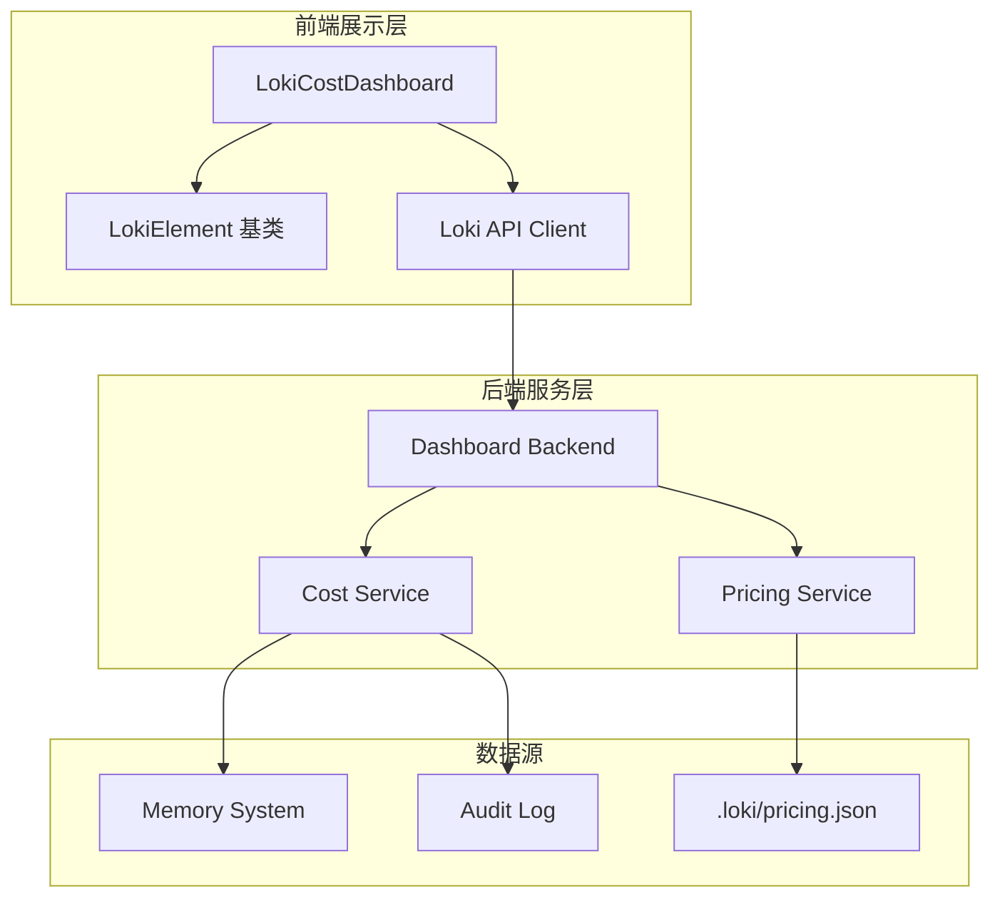
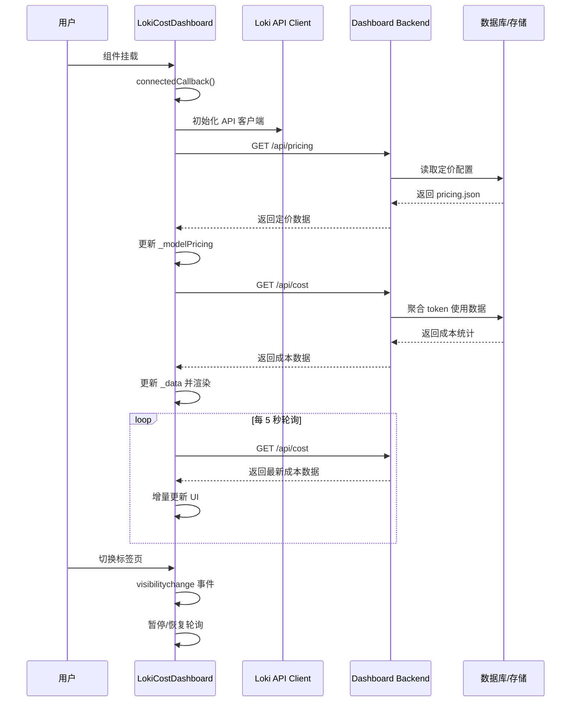

# Cost Dashboard 模块文档

## 概述

Cost Dashboard 模块是 Loki 多智能体系统的核心可观测性组件，专注于提供实时的 token 使用量追踪、成本估算和预算管理功能。该模块以前端 Web Component 形式实现（`LokiCostDashboard`），通过轮询后端 API 获取成本数据，为开发者和运维人员提供直观的成本可视化界面。

在多智能体协作环境中，token 消耗是衡量系统运行效率和经济成本的关键指标。Cost Dashboard 通过聚合来自不同模型提供商（Anthropic Claude、OpenAI Codex、Google Gemini 等）和不同执行阶段（规划、执行、验证等）的 token 使用数据，帮助团队：

- **实时监控**：每 5 秒自动刷新成本数据，确保信息的时效性
- **预算控制**：可视化预算使用进度，提供预警机制防止超支
- **成本分析**：按模型和阶段维度分解成本，识别优化机会
- **定价参考**：内置 API 定价表，支持动态加载最新价格配置

该模块与 [Dashboard Backend](dashboard_backend.md) 的成本计算服务紧密集成，同时依赖 [API Server](api_server.md) 提供的基础设施服务。

---

## 架构设计

### 组件层次结构



### 数据流架构



### 模块依赖关系

| 依赖模块 | 依赖类型 | 说明 |
|---------|---------|------|
| [Dashboard Backend](dashboard_backend.md) | 强依赖 | 提供 `/api/cost` 和 `/api/pricing` 端点 |
| [API Server](api_server.md) | 间接依赖 | 底层 HTTP 通信基础设施 |
| [Memory System](memory_system.md) | 间接依赖 | token 使用数据的原始来源 |
| [Audit](audit.md) | 间接依赖 | 审计日志中的 token 记录 |
| [Dashboard UI Components](dashboard_ui_components.md) | 同级模块 | 共享主题系统和基础样式 |

---

## 核心组件详解

### LokiCostDashboard 类

`LokiCostDashboard` 是模块的唯一核心组件，继承自 `LokiElement` 基类，实现了一个完整的成本监控仪表板。

#### 类定义

```javascript
export class LokiCostDashboard extends LokiElement {
  static get observedAttributes() {
    return ['api-url', 'theme'];
  }
  // ... 实现细节
}
```

#### 属性说明

| 属性名 | 类型 | 默认值 | 说明 |
|-------|------|--------|------|
| `api-url` | string | `window.location.origin` | API 服务器的基础 URL，用于构建请求端点 |
| `theme` | string | 自动检测 | 主题模式，支持 `'light'` 或 `'dark'` |

#### 内部状态结构

组件维护两个核心状态对象：

**`_data` - 成本数据状态**

```javascript
this._data = {
  total_input_tokens: 0,      // 总输入 token 数
  total_output_tokens: 0,     // 总输出 token 数
  estimated_cost_usd: 0,      // 估算总成本（美元）
  by_phase: {},               // 按阶段分组的成本数据
  by_model: {},               // 按模型分组的成本数据
  budget_limit: null,         // 预算上限（美元）
  budget_used: 0,             // 已用预算（美元）
  budget_remaining: null,     // 剩余预算（美元）
  connected: false,           // API 连接状态
};
```

**`_modelPricing` - 模型定价配置**

```javascript
{
  opus:   { input: 5.00,   output: 25.00,  label: 'Opus 4.6',       provider: 'claude' },
  sonnet: { input: 3.00,   output: 15.00,  label: 'Sonnet 4.5',     provider: 'claude' },
  haiku:  { input: 1.00,   output: 5.00,   label: 'Haiku 4.5',      provider: 'claude' },
  'gpt-5.3-codex': { input: 1.50, output: 12.00, label: 'GPT-5.3 Codex', provider: 'codex' },
  'gemini-3-pro':  { input: 1.25, output: 10.00, label: 'Gemini 3 Pro',   provider: 'gemini' },
  'gemini-3-flash': { input: 0.10, output: 0.40, label: 'Gemini 3 Flash', provider: 'gemini' },
}
```

#### 生命周期方法

##### `connectedCallback()`

组件挂载到 DOM 时调用，执行以下初始化流程：

1. 调用父类 `connectedCallback()` 应用主题样式
2. 通过 `_setupApi()` 初始化 API 客户端
3. 通过 `_loadPricing()` 加载定价配置
4. 通过 `_loadCost()` 获取初始成本数据
5. 通过 `_startPolling()` 启动定时轮询

```javascript
connectedCallback() {
  super.connectedCallback();
  this._setupApi();
  this._loadPricing();
  this._loadCost();
  this._startPolling();
}
```

##### `disconnectedCallback()`

组件从 DOM 移除时调用，执行清理操作：

```javascript
disconnectedCallback() {
  super.disconnectedCallback();
  this._stopPolling();
}
```

##### `attributeChangedCallback(name, oldValue, newValue)`

监听属性变化并作出响应：

- **`api-url` 变化**：更新 API 客户端的 `baseUrl` 并重新加载成本数据
- **`theme` 变化**：调用 `_applyTheme()` 重新应用主题样式

```javascript
attributeChangedCallback(name, oldValue, newValue) {
  if (oldValue === newValue) return;

  if (name === 'api-url' && this._api) {
    this._api.baseUrl = newValue;
    this._loadCost();
  }
  if (name === 'theme') {
    this._applyTheme();
  }
}
```

#### 核心方法

##### `_setupApi()`

初始化 API 客户端实例：

```javascript
_setupApi() {
  const apiUrl = this.getAttribute('api-url') || window.location.origin;
  this._api = getApiClient({ baseUrl: apiUrl });
}
```

**参数说明**：
- 从 HTML 属性读取 `api-url`，若未设置则使用当前页面源

**返回值**：无（设置 `this._api` 实例）

**副作用**：创建 API 客户端实例，后续所有 API 调用通过此实例进行

##### `_loadPricing()`

从后端加载模型定价配置：

```javascript
async _loadPricing() {
  try {
    const pricing = await this._api.getPricing();
    if (pricing && pricing.models) {
      const updated = {};
      for (const [key, m] of Object.entries(pricing.models)) {
        updated[key] = {
          input: m.input,
          output: m.output,
          label: m.label || key,
          provider: m.provider || 'unknown',
        };
      }
      this._modelPricing = updated;
      this._pricingSource = pricing.source || 'api';
      this._pricingDate = pricing.updated || '';
      this._activeProvider = pricing.provider || 'claude';
      this.render();
    }
  } catch {
    // 保持实例默认值
  }
  }
```

**API 端点**：`GET /api/pricing`

**响应结构**：
```json
{
  "models": {
    "opus": { "input": 5.00, "output": 25.00, "label": "Opus 4.6", "provider": "claude" }
  },
  "source": "file",
  "updated": "2026-02-07",
  "provider": "claude"
}
```

**错误处理**：若请求失败，组件保持使用内置的 `DEFAULT_PRICING` 静态配置

##### `_loadCost()`

获取当前成本统计数据：

```javascript
async _loadCost() {
  try {
    const cost = await this._api.getCost();
    this._updateFromCost(cost);
  } catch (error) {
    this._data.connected = false;
    this.render();
  }
}
```

**API 端点**：`GET /api/cost`

**响应结构**：
```json
{
  "total_input_tokens": 1500000,
  "total_output_tokens": 750000,
  "estimated_cost_usd": 45.50,
  "by_phase": {
    "planning": { "input_tokens": 500000, "output_tokens": 250000, "cost_usd": 15.00 },
    "execution": { "input_tokens": 800000, "output_tokens": 400000, "cost_usd": 25.00 },
    "validation": { "input_tokens": 200000, "output_tokens": 100000, "cost_usd": 5.50 }
  },
  "by_model": {
    "sonnet": { "input_tokens": 1000000, "output_tokens": 500000, "cost_usd": 30.00 },
    "haiku": { "input_tokens": 500000, "output_tokens": 250000, "cost_usd": 15.50 }
  },
  "budget_limit": 100.00,
  "budget_used": 45.50,
  "budget_remaining": 54.50
}
```

##### `_updateFromCost(cost)`

将 API 返回的成本数据合并到内部状态：

```javascript
_updateFromCost(cost) {
  if (!cost) return;

  this._data = {
    ...this._data,
    connected: true,
    total_input_tokens: cost.total_input_tokens || 0,
    total_output_tokens: cost.total_output_tokens || 0,
    estimated_cost_usd: cost.estimated_cost_usd || 0,
    by_phase: cost.by_phase || {},
    by_model: cost.by_model || {},
    budget_limit: cost.budget_limit,
    budget_used: cost.budget_used || 0,
    budget_remaining: cost.budget_remaining,
  };

  this.render();
}
```

**参数**：
- `cost`：来自 `/api/cost` 端点的响应对象

**副作用**：更新 `this._data` 并触发 UI 重新渲染

##### `_startPolling()`

启动定时轮询机制和可见性监听：

```javascript
_startPolling() {
  this._pollInterval = setInterval(async () => {
    try {
      const cost = await this._api.getCost();
      this._updateFromCost(cost);
    } catch (error) {
      this._data.connected = false;
      this.render();
    }
  }, 5000);
  
  this._visibilityHandler = () => {
    if (document.hidden) {
      if (this._pollInterval) {
        clearInterval(this._pollInterval);
        this._pollInterval = null;
      }
    } else {
      if (!this._pollInterval) {
        this._loadCost();
        this._pollInterval = setInterval(async () => {
          // ... 轮询逻辑
        }, 5000);
      }
    }
  };
  document.addEventListener('visibilitychange', this._visibilityHandler);
}
```

**轮询间隔**：5000 毫秒（5 秒）

**可见性优化**：
- 当用户切换到其他标签页时（`document.hidden === true`），暂停轮询以节省资源
- 当用户返回时，立即加载最新数据并恢复轮询

##### `_stopPolling()`

停止轮询并清理事件监听器：

```javascript
_stopPolling() {
  if (this._pollInterval) {
    clearInterval(this._pollInterval);
    this._pollInterval = null;
  }
  if (this._visibilityHandler) {
    document.removeEventListener('visibilitychange', this._visibilityHandler);
    this._visibilityHandler = null;
  }
}
```

##### 格式化方法

**`_formatTokens(count)`** - 格式化 token 数量显示

```javascript
_formatTokens(count) {
  if (!count || count === 0) return '0';
  if (count >= 1_000_000) return (count / 1_000_000).toFixed(2) + 'M';
  if (count >= 1_000) return (count / 1_000).toFixed(1) + 'K';
  return String(count);
}
```

| 输入值 | 输出值 |
|-------|--------|
| `0` | `'0'` |
| `500` | `'500'` |
| `1500` | `'1.5K'` |
| `2500000` | `'2.50M'` |

**`_formatUSD(amount)`** - 格式化美元金额显示

```javascript
_formatUSD(amount) {
  if (!amount || amount === 0) return '$0.00';
  if (amount < 0.01) return '<$0.01';
  return '$' + amount.toFixed(2);
}
```

| 输入值 | 输出值 |
|-------|--------|
| `0` | `'$0.00'` |
| `0.005` | `'<$0.01'` |
| `45.5` | `'$45.50'` |

##### 预算相关方法

**`_getBudgetPercent()`** - 计算预算使用百分比

```javascript
_getBudgetPercent() {
  if (!this._data.budget_limit || this._data.budget_limit <= 0) return 0;
  return Math.min(100, (this._data.budget_used / this._data.budget_limit) * 100);
}
```

**`_getBudgetStatusClass()`** - 根据使用率返回状态类名

```javascript
_getBudgetStatusClass() {
  const pct = this._getBudgetPercent();
  if (pct >= 90) return 'critical';
  if (pct >= 70) return 'warning';
  return 'ok';
}
```

| 使用率 | 返回类名 | 视觉表现 |
|-------|---------|---------|
| 0-69% | `'ok'` | 绿色进度条 |
| 70-89% | `'warning'` | 黄色进度条 |
| 90-100% | `'critical'` | 红色进度条 |

##### 渲染方法

**`_renderPhaseRows()`** - 生成按阶段分组的表格行

```javascript
_renderPhaseRows() {
  const phases = this._data.by_phase;
  if (!phases || Object.keys(phases).length === 0) {
    return '<tr><td colspan="4" class="empty-cell">No phase data yet</td></tr>';
  }

  return Object.entries(phases).map(([phase, data]) => {
    const input = data.input_tokens || 0;
    const output = data.output_tokens || 0;
    const cost = data.cost_usd || 0;
    return `
      <tr>
        <td class="phase-name">${this._escapeHTML(phase)}</td>
        <td class="mono-cell">${this._formatTokens(input)}</td>
        <td class="mono-cell">${this._formatTokens(output)}</td>
        <td class="mono-cell cost-cell">${this._formatUSD(cost)}</td>
      </tr>
    `;
  }).join('');
}
```

**`_renderModelRows()`** - 生成按模型分组的表格行

逻辑与 `_renderPhaseRows()` 类似，但使用 `this._data.by_model` 数据源。

**`_renderBudgetSection()`** - 渲染预算进度条区域

根据是否配置预算上限，渲染两种不同状态：

1. **未配置预算**：显示 "No budget configured" 提示
2. **已配置预算**：显示进度条、已用金额、剩余金额和总预算

**`_getPricingColorClass(key, model)`** - 为定价卡片分配颜色类

```javascript
_getPricingColorClass(key, model) {
  if (key === 'opus' || key.includes('opus')) return 'opus';
  if (key === 'sonnet' || key.includes('sonnet')) return 'sonnet';
  if (key === 'haiku' || key.includes('haiku')) return 'haiku';
  if (model.provider === 'codex') return 'codex';
  if (model.provider === 'gemini') return 'gemini';
  return '';
}
```

**`_escapeHTML(str)`** - HTML 转义防止 XSS 攻击

```javascript
_escapeHTML(str) {
  if (!str) return '';
  return String(str)
    .replace(/&/g, '&amp;')
    .replace(/</g, '&lt;')
    .replace(/>/g, '&gt;')
    .replace(/"/g, '&quot;');
}
```

##### `render()`

主渲染方法，生成完整的 Shadow DOM 内容：

```javascript
render() {
  const totalTokens = this._data.total_input_tokens + this._data.total_output_tokens;

  this.shadowRoot.innerHTML = `
    <style>${this.getBaseStyles()}/* ... 完整样式定义 ... */</style>
    <div class="cost-container">
      ${!this._data.connected ? '<div class="offline-notice">Connecting...</div>' : ''}
      
      <!-- 摘要卡片 -->
      <div class="summary-grid">...</div>
      
      <!-- 预算部分 -->
      ${this._renderBudgetSection()}
      
      <!-- 按模型成本表 -->
      <div class="data-table-container">...</div>
      
      <!-- 按阶段成本表 -->
      <div class="data-table-container">...</div>
      
      <!-- 定价参考 -->
      <div class="pricing-ref">...</div>
    </div>
  `;
}
```

**UI 结构**：

1. **离线提示**：当 `connected === false` 时显示
2. **摘要卡片网格**：4 张卡片显示总 token、输入 token、输出 token、估算成本
3. **预算部分**：进度条可视化预算使用情况
4. **按模型成本表**：列出各模型的 token 使用和成本
5. **按阶段成本表**：列出各执行阶段的 token 使用和成本
6. **定价参考**：显示各模型的每百万 token 价格

---

## 使用指南

### 基本用法

在 HTML 中直接使用自定义元素：

```html
<!-- 使用默认配置（自动检测 API URL 和主题） -->
<loki-cost-dashboard></loki-cost-dashboard>

<!-- 指定 API 服务器地址 -->
<loki-cost-dashboard api-url="http://localhost:57374"></loki-cost-dashboard>

<!-- 指定主题模式 -->
<loki-cost-dashboard api-url="http://localhost:57374" theme="dark"></loki-cost-dashboard>
```

### 在 JavaScript 中动态创建

```javascript
import { LokiCostDashboard } from './components/loki-cost-dashboard.js';

// 创建实例
const dashboard = document.createElement('loki-cost-dashboard');
dashboard.setAttribute('api-url', 'http://localhost:57374');
dashboard.setAttribute('theme', 'dark');

// 添加到 DOM
document.getElementById('app').appendChild(dashboard);

// 稍后更新配置
dashboard.setAttribute('api-url', 'http://new-server:57374');
```

### 与主题系统集成

`LokiCostDashboard` 继承自 `LokiElement`，自动支持 [Dashboard UI Components](dashboard_ui_components.md) 中定义的主题系统：

```javascript
// 主题变量自动应用
:host {
  --loki-bg-card: #1a1a2e;      /* 卡片背景 */
  --loki-border: #2d2d44;       /* 边框颜色 */
  --loki-accent: #4cc9f0;       /* 强调色 */
  --loki-text-primary: #ffffff; /* 主文本 */
  --loki-green: #2ecc71;        /* 预算正常状态 */
  --loki-yellow: #f1c40f;       /* 预算警告状态 */
  --loki-red: #e74c3c;          /* 预算危急状态 */
}
```

### 配置定价文件

后端通过读取 `.loki/pricing.json` 文件提供动态定价配置：

```json
{
  "models": {
    "opus": {
      "input": 5.00,
      "output": 25.00,
      "label": "Opus 4.6",
      "provider": "claude"
    },
    "sonnet": {
      "input": 3.00,
      "output": 15.00,
      "label": "Sonnet 4.5",
      "provider": "claude"
    }
  },
  "updated": "2026-02-07",
  "provider": "claude"
}
```

**文件位置**：项目根目录的 `.loki/pricing.json`

**更新机制**：修改文件后，组件在下一次轮询时自动加载新价格（无需刷新页面）

---

## 后端集成

### API 端点规范

#### GET /api/cost

获取当前成本统计数据。

**请求参数**：无

**响应示例**：
```json
{
  "total_input_tokens": 1500000,
  "total_output_tokens": 750000,
  "estimated_cost_usd": 45.50,
  "by_phase": {
    "planning": {
      "input_tokens": 500000,
      "output_tokens": 250000,
      "cost_usd": 15.00
    }
  },
  "by_model": {
    "sonnet": {
      "input_tokens": 1000000,
      "output_tokens": 500000,
      "cost_usd": 30.00
    }
  },
  "budget_limit": 100.00,
  "budget_used": 45.50,
  "budget_remaining": 54.50
}
```

**字段说明**：

| 字段 | 类型 | 必填 | 说明 |
|-----|------|-----|------|
| `total_input_tokens` | number | 是 | 累计输入 token 数 |
| `total_output_tokens` | number | 是 | 累计输出 token 数 |
| `estimated_cost_usd` | number | 是 | 估算总成本（美元） |
| `by_phase` | object | 否 | 按阶段分组的统计数据 |
| `by_model` | object | 否 | 按模型分组的统计数据 |
| `budget_limit` | number\|null | 是 | 预算上限，`null` 表示未配置 |
| `budget_used` | number | 是 | 已用预算金额 |
| `budget_remaining` | number\|null | 是 | 剩余预算，`null` 时前端自行计算 |

**实现参考**：[Dashboard Backend - Cost Service](dashboard_backend.md)

#### GET /api/pricing

获取模型定价配置。

**请求参数**：无

**响应示例**：
```json
{
  "models": {
    "opus": {
      "input": 5.00,
      "output": 25.00,
      "label": "Opus 4.6",
      "provider": "claude"
    }
  },
  "source": "file",
  "updated": "2026-02-07",
  "provider": "claude"
}
```

**字段说明**：

| 字段 | 类型 | 必填 | 说明 |
|-----|------|-----|------|
| `models` | object | 是 | 模型定价映射表 |
| `source` | string | 否 | 数据来源（`'file'` 或 `'api'`） |
| `updated` | string | 否 | 最后更新日期（ISO 8601 格式） |
| `provider` | string | 否 | 默认提供商 |

---

## 视觉设计

### 布局结构

```
┌─────────────────────────────────────────────────────────┐
│  Loki Cost Dashboard                                    │
├─────────────────────────────────────────────────────────┤
│  ┌──────────┐ ┌──────────┐ ┌──────────┐ ┌──────────┐  │
│  │ 总 Token  │ │ 输入 Token │ │ 输出 Token │ │ 估算成本 │  │
│  │  3.25M   │ │  2.00M   │ │  1.25M   │ │ $45.50  │  │
│  └──────────┘ └──────────┘ └──────────┘ └──────────┘  │
├─────────────────────────────────────────────────────────┤
│  Budget                                                 │
│  ████████████░░░░░░░░░░░░░░░░░░░░░░░░░░  45.5%        │
│  $45.50 used    $54.50 remaining    of $100.00        │
├─────────────────────────────────────────────────────────┤
│  Cost by Model                                          │
│  ┌──────────────────────────────────────────────────┐  │
│  │ Model      │ Input   │ Output  │ Cost           │  │
│  ├──────────────────────────────────────────────────┤  │
│  │ sonnet     │ 1.00M   │ 500.0K  │ $30.00         │  │
│  │ haiku      │ 500.0K  │ 250.0K  │ $15.50         │  │
│  └──────────────────────────────────────────────────┘  │
├─────────────────────────────────────────────────────────┤
│  Cost by Phase                                          │
│  ┌──────────────────────────────────────────────────┐  │
│  │ Phase      │ Input   │ Output  │ Cost           │  │
│  ├──────────────────────────────────────────────────┤  │
│  │ planning   │ 500.0K  │ 250.0K  │ $15.00         │  │
│  │ execution  │ 800.0K  │ 400.0K  │ $25.00         │  │
│  │ validation │ 200.0K  │ 100.0K  │ $5.50          │  │
│  └──────────────────────────────────────────────────┘  │
├─────────────────────────────────────────────────────────┤
│  API Pricing Reference (per 1M tokens)    Updated: ... │
│  ┌──────────┐ ┌──────────┐ ┌──────────┐ ┌──────────┐  │
│  │ Opus 4.6 │ │Sonnet 4.5│ │Haiku 4.5 │ │Gemini 3  │  │
│  │In:$5/Out:│ │In:$3/Out:│ │In:$1/Out:│ │In:$1.25/ │  │
│  │  $25     │ │  $15     │ │  $5      │ │Out:$10   │  │
│  └──────────┘ └──────────┘ └──────────┘ └──────────┘  │
└─────────────────────────────────────────────────────────┘
```

### 颜色编码系统

| 状态 | 颜色类 | CSS 变量 | 使用场景 |
|-----|-------|---------|---------|
| 正常 | `ok` | `--loki-green` | 预算使用率 < 70% |
| 警告 | `warning` | `--loki-yellow` | 预算使用率 70-89% |
| 危急 | `critical` | `--loki-red` | 预算使用率 ≥ 90% |
| Opus | `opus` | `--loki-opus` | Opus 模型定价卡片 |
| Sonnet | `sonnet` | `--loki-sonnet` | Sonnet 模型定价卡片 |
| Haiku | `haiku` | `--loki-haiku` | Haiku 模型定价卡片 |
| Codex | `codex` | `--loki-blue` | Codex 模型定价卡片 |
| Gemini | `gemini` | `--loki-green` | Gemini 模型定价卡片 |

---

## 边缘情况与注意事项

### 1. API 连接失败处理

**场景**：后端服务不可用或网络中断

**表现**：
- `connected` 状态设为 `false`
- 显示 "Connecting to cost API..." 提示
- 继续按 5 秒间隔重试

**建议**：在运维监控中配置 `/api/cost` 端点的可用性告警

### 2. 标签页可见性优化

**场景**：用户切换到其他浏览器标签页

**行为**：
- 检测到 `document.hidden === true` 时暂停轮询
- 用户返回时立即加载最新数据并恢复轮询

**优势**：减少后台资源消耗，避免不必要的 API 请求

**注意**：若用户离开超过 5 秒，返回时会看到短暂的数据延迟（等待新请求完成）

### 3. 预算未配置状态

**场景**：`budget_limit` 为 `null` 或 `undefined`

**表现**：
- 预算部分显示 "No budget configured"
- 不渲染进度条
- 不影响其他功能

**配置方法**：通过 [Dashboard Backend](dashboard_backend.md) 的预算管理服务设置

### 4. 定价数据加载失败

**场景**：`/api/pricing` 端点返回错误或 `.loki/pricing.json` 文件不存在

**行为**：
- 捕获异常，不抛出错误
- 使用内置的 `DEFAULT_PRICING` 静态配置
- 用户无感知（价格可能不是最新）

**建议**：定期检查定价文件的时效性

### 5. 大数据量显示

**场景**：token 数量超过百万级

**处理**：
- 自动格式化为 `M`（百万）或 `K`（千）单位
- 保留 2 位小数（百万）或 1 位小数（千）

**示例**：
- `2500000` → `"2.50M"`
- `1500` → `"1.5K"`

### 6. XSS 防护

**场景**：阶段名称或模型名称包含特殊字符

**防护**：
- 所有动态内容通过 `_escapeHTML()` 转义
- 使用 Shadow DOM 隔离样式和作用域

### 7. 时区和日期格式

**场景**：定价文件的 `updated` 字段

**当前实现**：直接显示原始字符串，不做时区转换

**建议**：后端应返回 ISO 8601 格式（如 `"2026-02-07T10:30:00Z"`），前端可根据需要格式化

---

## 性能优化建议

### 1. 轮询间隔调整

当前固定为 5 秒，可根据实际场景调整：

```javascript
// 在构造函数中自定义
constructor() {
  super();
  this._pollIntervalMs = 10000; // 改为 10 秒
}

_startPolling() {
  this._pollInterval = setInterval(async () => {
    // ...
  }, this._pollIntervalMs);
}
```

**权衡**：
- 更短间隔 → 数据更实时，但 API 负载更高
- 更长间隔 → 减少服务器压力，但数据延迟增加

### 2. 条件渲染优化

当前每次数据更新都调用 `render()` 重绘整个 Shadow DOM。对于高频更新场景，可考虑：

```javascript
// 仅更新变化的 DOM 节点
_updateSummaryCards() {
  this.shadowRoot.querySelector('.card-value.total').textContent = 
    this._formatTokens(totalTokens);
  // ...
}
```

### 3. 批量 API 请求

若同时使用多个 Dashboard 组件，可考虑合并请求：

```javascript
// 使用请求缓存
const cache = new Map();
async _loadCost() {
  const now = Date.now();
  if (cache.has('cost') && now - cache.get('cost').time < 2000) {
    return cache.get('cost').data;
  }
  // ...
}
```

---

## 扩展开发

### 添加新的成本维度

若需按项目或会话维度展示成本：

1. **后端扩展**：在 `/api/cost` 响应中添加 `by_project` 或 `by_session` 字段
2. **前端扩展**：添加新的渲染方法

```javascript
_renderProjectRows() {
  const projects = this._data.by_project || {};
  if (!Object.keys(projects).length) {
    return '<tr><td colspan="4" class="empty-cell">No project data</td></tr>';
  }
  return Object.entries(projects).map(([project, data]) => {
    // ... 类似 _renderPhaseRows()
  }).join('');
}
```

3. **UI 添加**：在 `render()` 中插入新的表格区域

### 自定义预算阈值

当前阈值硬编码为 70% 和 90%，可通过属性配置：

```javascript
static get observedAttributes() {
  return ['api-url', 'theme', 'warning-threshold', 'critical-threshold'];
}

_getBudgetStatusClass() {
  const pct = this._getBudgetPercent();
  const warning = parseFloat(this.getAttribute('warning-threshold')) || 70;
  const critical = parseFloat(this.getAttribute('critical-threshold')) || 90;
  if (pct >= critical) return 'critical';
  if (pct >= warning) return 'warning';
  return 'ok';
}
```

### 集成告警通知

结合 [Dashboard UI Components - LokiNotificationCenter](dashboard_ui_components.md) 实现预算超支告警：

```javascript
_updateFromCost(cost) {
  const oldPct = this._getBudgetPercent();
  // ... 更新数据
  const newPct = this._getBudgetPercent();
  
  if (oldPct < 90 && newPct >= 90) {
    this._sendNotification('预算使用超过 90%', 'critical');
  }
}

_sendNotification(message, level) {
  const event = new CustomEvent('loki-notification', {
    detail: { message, level },
    bubbles: true,
    composed: true
  });
  this.dispatchEvent(event);
}
```

---

## 故障排查

### 常见问题

| 问题 | 可能原因 | 解决方案 |
|-----|---------|---------|
| 显示 "Connecting..." 持续不消失 | 后端服务未启动或 URL 错误 | 检查 `api-url` 属性，确认后端服务运行 |
| 成本数据为 0 | 无 token 使用记录或数据聚合失败 | 检查 [Memory System](memory_system.md) 和 [Audit](audit.md) 日志 |
| 定价显示默认值 | `/api/pricing` 请求失败 | 检查 `.loki/pricing.json` 文件是否存在且格式正确 |
| 预算进度条不显示 | `budget_limit` 为 `null` | 通过后端 API 配置预算上限 |
| 切换标签页后数据不更新 | 可见性事件未正确触发 | 检查浏览器兼容性，手动刷新页面 |

### 调试技巧

1. **检查 API 响应**：
```javascript
// 在浏览器控制台
const api = getApiClient({ baseUrl: 'http://localhost:57374' });
api.getCost().then(console.log);
api.getPricing().then(console.log);
```

2. **检查组件状态**：
```javascript
const dashboard = document.querySelector('loki-cost-dashboard');
console.log(dashboard._data);
console.log(dashboard._modelPricing);
```

3. **手动触发更新**：
```javascript
dashboard._loadCost();
dashboard._loadPricing();
```

4. **检查网络请求**：
- 打开浏览器开发者工具 → Network 标签
- 筛选 `/api/cost` 和 `/api/pricing` 请求
- 检查状态码和响应内容

---

## 相关模块参考

- [Dashboard Backend](dashboard_backend.md) - 提供成本计算和定价服务的后端实现
- [Dashboard UI Components](dashboard_ui_components.md) - 共享主题系统和基础组件
- [Memory System](memory_system.md) - token 使用数据的原始来源
- [Audit](audit.md) - 审计日志中的 token 记录
- [Policy Engine](policy_engine.md) - 成本控制策略配置

---

## 版本历史

| 版本 | 日期 | 变更说明 |
|-----|------|---------|
| 1.0.0 | 2026-02-07 | 初始版本，支持基础成本展示和预算跟踪 |
| 1.0.1 | 2026-02-07 | 添加标签页可见性优化，减少后台资源消耗 |

---

## 附录：默认定价配置

```javascript
const DEFAULT_PRICING = {
  // Claude (Anthropic)
  opus:   { input: 5.00,   output: 25.00,  label: 'Opus 4.6',       provider: 'claude' },
  sonnet: { input: 3.00,   output: 15.00,  label: 'Sonnet 4.5',     provider: 'claude' },
  haiku:  { input: 1.00,   output: 5.00,   label: 'Haiku 4.5',      provider: 'claude' },
  // OpenAI Codex
  'gpt-5.3-codex': { input: 1.50, output: 12.00, label: 'GPT-5.3 Codex', provider: 'codex' },
  // Google Gemini
  'gemini-3-pro':  { input: 1.25, output: 10.00, label: 'Gemini 3 Pro',   provider: 'gemini' },
  'gemini-3-flash': { input: 0.10, output: 0.40, label: 'Gemini 3 Flash', provider: 'gemini' },
};
```

**注意**：以上价格为 2026-02-07 的参考值，实际价格请以各提供商官方定价为准，并通过 `.loki/pricing.json` 文件配置。
