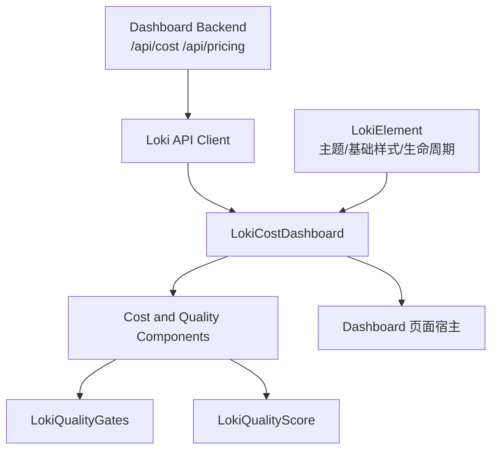
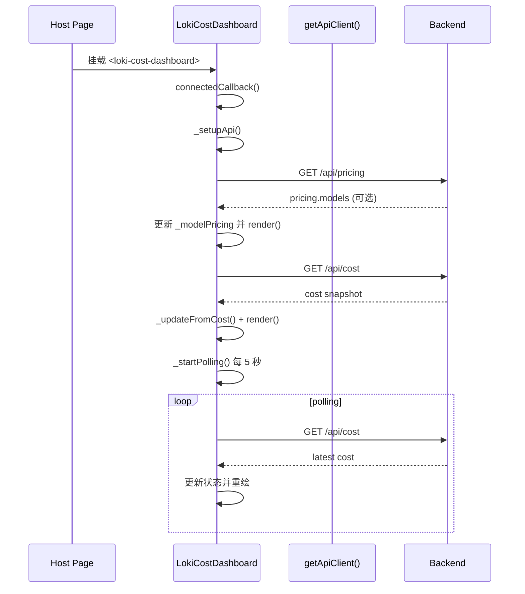
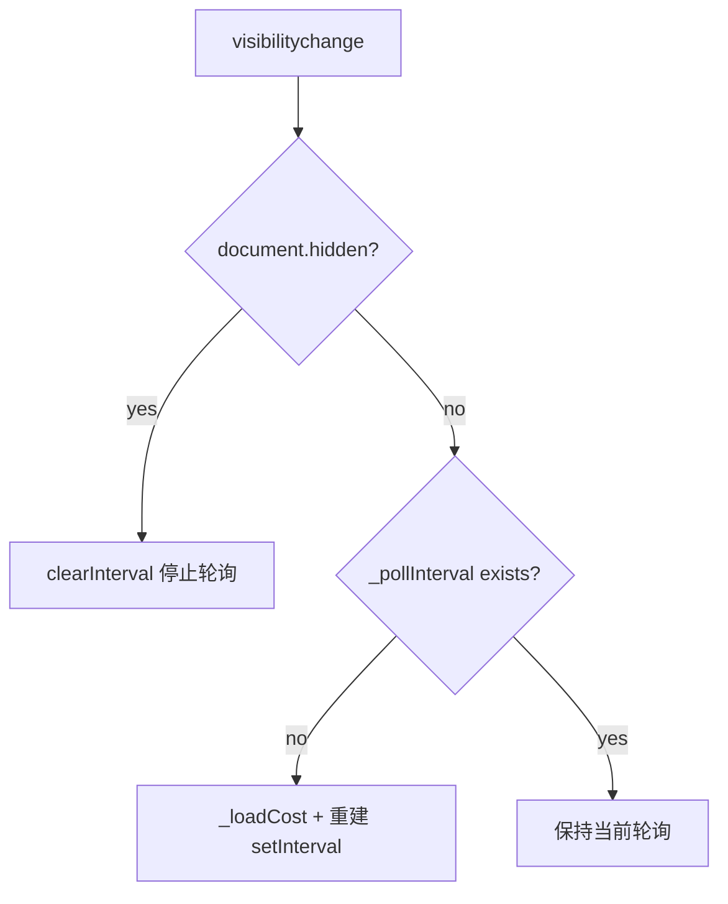
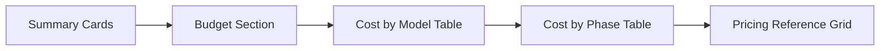
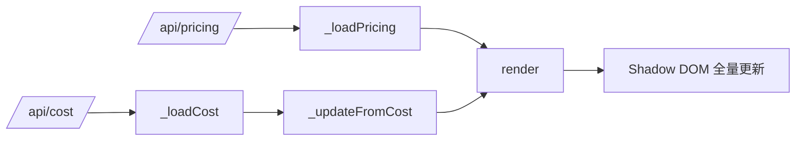

# cost_dashboard_component 模块文档

## 模块简介

`cost_dashboard_component` 是 `Dashboard UI Components -> Cost and Quality Components` 下的成本观测子模块，核心实现为自定义元素 `<loki-cost-dashboard>`（类 `LokiCostDashboard`）。该组件的存在目的，不是单纯展示一个“花费数字”，而是把运行期的 token 消耗、模型/阶段分摊、预算占用、以及价格基线放在同一屏内，形成**可持续监控的成本控制面板**。

在真实运行场景里，团队常见的问题并不是“总花了多少钱”，而是“花费是由哪个 phase / model 推高的、预算离阈值还有多远、当前价格配置是否最新”。`LokiCostDashboard` 针对这三个问题分别提供：

- 汇总卡片（总 token、输入输出、估算美元）
- 分解表（按 model、按 phase）
- 预算进度条（阈值着色）
- 定价参考网格（优先用 `/api/pricing`，失败回退内置默认价格）

因此它在系统中的定位是：**成本可观测性的前端终端视图**，上游依赖 Dashboard/API 的成本与定价接口，下游可被总览页、运营页、质量/策略面板复用。

---

## 在系统中的位置与关系



该关系图体现了模块分层：`LokiCostDashboard` 自身不做成本计算，只负责拉取与展示；成本统计逻辑来自后端接口，主题能力来自 `LokiElement`。在同一父模块内，它与 `LokiQualityGates`、`LokiQualityScore` 形成互补：后两者偏质量信号，当前组件偏资源/预算信号。相关基础能力可参考 [`Core Theme.md`](Core Theme.md)、[`Unified Styles.md`](Unified Styles.md)、[`Cost and Quality Components.md`](Cost and Quality Components.md)。

---

## 核心类：`LokiCostDashboard`

### 类职责

`LokiCostDashboard` 继承 `LokiElement`，负责四类工作：初始化 API 客户端、拉取价格与成本数据、轮询刷新、渲染 Shadow DOM 界面。它是一个**状态驱动渲染**组件：所有可见内容都由内部 `_data` 与 `_modelPricing` 派生。

### 可观察属性

组件监听两个 attribute：

- `api-url`：切换后端地址；变化时会更新 `this._api.baseUrl` 并立即刷新成本数据。
- `theme`：主题切换；变化时调用 `_applyTheme()`。

这使它既能在纯 HTML 里声明式使用，也能被上层容器动态改写属性。

### 内部状态结构

主要状态如下（简化）：

```js
this._data = {
  total_input_tokens: 0,
  total_output_tokens: 0,
  estimated_cost_usd: 0,
  by_phase: {},
  by_model: {},
  budget_limit: null,
  budget_used: 0,
  budget_remaining: null,
  connected: false,
};

this._modelPricing = { ...DEFAULT_PRICING };
```

其中 `_data` 存储运行时成本快照，`_modelPricing` 存储展示层使用的“每百万 token 价格表”。`_modelPricing` 的设计是**先有可用默认值，再尝试远程覆盖**，保证 API 故障时界面仍可工作。

---

## 生命周期与运行流程



这里有两个关键设计点。第一，`_loadPricing()` 与 `_loadCost()` 分离，价格与成本不互相阻塞。第二，组件启动后马上执行一次加载，再进入轮询，不会等待第一个 5 秒周期。

---

## 页面可见性与资源控制



组件监听 `document.visibilitychange`，当页面进入后台标签时停止轮询，回到前台后立即补拉一次再恢复定时器。这个机制可以显著减少后台页面的无效请求，特别是监控类页面同时打开很多标签时。

---

## 关键方法详解

### 1) `_setupApi()`

该方法根据 `api-url`（默认 `window.location.origin`）调用 `getApiClient({ baseUrl })`。返回对象被保存在 `this._api`，后续 `_loadPricing()`、`_loadCost()` 都经由它发起请求。

**副作用**：覆盖 `this._api` 引用。

### 2) `_loadPricing(): Promise<void>`

调用 `this._api.getPricing()`，如果返回含 `pricing.models`，会把每个 model 映射为统一结构：`input/output/label/provider`，并更新 `_pricingSource`、`_pricingDate`、`_activeProvider` 后重绘。

如果请求失败，`catch` 分支故意保持静默，继续使用 `DEFAULT_PRICING`。

**优点**：容错好，不会因价格接口故障导致整页失败。  
**限制**：失败时无显式错误提示，用户无法直接知道当前价格是否过期。

### 3) `_loadCost(): Promise<void>`

调用 `this._api.getCost()` 并把响应交给 `_updateFromCost()`。失败时将 `_data.connected = false` 并 render，界面顶部出现 “Connecting to cost API...”。

**返回值**：无显式返回，主要通过状态变更驱动 UI。

### 4) `_updateFromCost(cost)`

把后端 cost 快照合并进 `_data`，并对关键字段设置兜底值：

- token/cost 缺失时回退 0
- `by_phase/by_model` 缺失回退空对象
- budget 字段保留后端原值（如 `null` 表示未配置）

然后调用 `render()`。

### 5) `_startPolling()` 与 `_stopPolling()`

`_startPolling()` 创建 5 秒定时拉取并注册 `visibilitychange`；`_stopPolling()` 负责清理 interval 和事件监听。组件在 `disconnectedCallback()` 中调用 `_stopPolling()`，避免内存泄漏和幽灵请求。

### 6) 格式化与辅助方法

- `_formatTokens(count)`：`K/M` 紧凑展示（>=1000 转 `K`，>=1,000,000 转 `M`）。
- `_formatUSD(amount)`：金额格式，极小值显示 `<$0.01`。
- `_getBudgetPercent()`：`budget_used / budget_limit`，并 clamp 到 100。
- `_getBudgetStatusClass()`：>=90% `critical`，>=70% `warning`，其余 `ok`。
- `_escapeHTML(str)`：对动态字符串做 HTML 转义，降低 XSS 风险。

---

## UI 分区与渲染语义



渲染由单个 `render()` 完成，采用 `shadowRoot.innerHTML` 全量替换。页面结构稳定且语义清晰：先总览、再预算、再分解、最后参考价。每个分区的空状态都有明确回退文本，例如 `No model data yet`、`No phase data yet`、`No budget configured`。

值得注意的是，`Cost by Model` / `Cost by Phase` 的名称字段经过 `_escapeHTML`，避免后端异常数据注入 HTML。

---

## 默认定价与远程覆盖策略

组件内置 `DEFAULT_PRICING`（Claude/Codex/Gemini 等模型，每百万 token 的 input/output 单价）。其行为遵循以下优先级：

1. 初始渲染使用内置默认值。
2. 若 `/api/pricing` 成功且结构有效，覆盖默认值并显示 `Updated` 时间。
3. 若失败，静默保留默认值。

这是一种典型的“**离线可运行 + 在线可校准**”策略，适合监控面板在后端部分降级时继续提供近似可用信息。

---

## 使用方式

### 基础用法

```html
<loki-cost-dashboard></loki-cost-dashboard>
```

### 指定 API 地址

```html
<loki-cost-dashboard api-url="http://localhost:57374"></loki-cost-dashboard>
```

### 强制主题

```html
<loki-cost-dashboard theme="dark"></loki-cost-dashboard>
```

### 运行时动态切换

```js
const el = document.querySelector('loki-cost-dashboard');
el.setAttribute('api-url', 'https://your-dashboard-api.example.com');
el.setAttribute('theme', 'light');
```

---

## 与其它模块的协作说明

该组件主要依赖 API 客户端能力（`getApiClient`）与主题基类能力（`LokiElement`）。如果你在同一个页面组合多个监控组件（例如 `LokiOverview`、`LokiQualityGates`、`LokiQualityScore`），会发现它们采用了相似的模式：

- 都支持 `api-url` 和 `theme` attribute。
- 都在 `connectedCallback` 启动拉取。
- 都在 `disconnectedCallback` 清理轮询/监听。

这意味着你可以统一写一个“容器级配置器”来批量设置 API 地址和主题，而不需要为每个组件单独适配。相关模式可参考 [`LokiOverview.md`](LokiOverview.md)、[`LokiQualityGates.md`](LokiQualityGates.md)、[`LokiQualityScore.md`](LokiQualityScore.md)。

---

## 边界条件、错误处理与已知限制

### 错误与降级行为

- `/api/cost` 失败：`connected=false`，显示连接提示，但仍保留上一次状态值结构。
- `/api/pricing` 失败：无错误提示，继续使用默认价格。
- 后端返回缺字段：大量使用 `||` 与空对象回退，通常不会抛错。

### 预算显示相关注意点

- `budget_limit` 为 `null/undefined` 时展示 “No budget configured”。
- 百分比上限强制 100%，即使 `budget_used > budget_limit` 也不会超宽渲染。
- `remaining` 优先使用后端 `budget_remaining`，否则前端计算 `budget_limit - budget_used`，可能出现负值并被格式化展示。

### 渲染与性能注意点

- 当前实现每次更新都全量重写 `shadowRoot.innerHTML`，在极高刷新频率或大量实例并存时会有额外重排成本。
- 轮询周期固定 5 秒，未暴露外部配置项。

### 可访问性与国际化限制

- 文案固定英文（如 “Cost by Model”），未内建 i18n。
- 主要依赖视觉信息（颜色/表格），未提供更细粒度 ARIA 状态描述。

---

## 扩展建议

如果要扩展 `cost_dashboard_component`，推荐保持现有“低耦合展示”边界，不把业务计算塞进组件。可行方向包括：

- 增加可配置 polling 间隔（如 `poll-interval` attribute）。
- 为 `/api/pricing` 失败增加非阻塞提示（如小型 warning badge）。
- 提供 provider 过滤器或 phase/model 排序切换。
- 增加导出能力（CSV/JSON）。
- 使用增量 DOM 更新替代全量 `innerHTML`，优化高频刷新性能。

---

## 最小集成检查清单

- 后端可访问 `/api/cost` 与 `/api/pricing`。
- 页面已加载并注册 `loki-cost-dashboard`（组件末尾已自动 `customElements.define`）。
- 宿主环境支持 Web Components + Shadow DOM。
- 主题 token 可由 `LokiElement` 提供（通常随 `dashboard-ui` 一起加载）。

满足以上条件后，组件即可在仪表盘中稳定提供成本监控能力。

---

## 依赖组件内部机制（跨模块）

`LokiCostDashboard` 的行为有一部分来自它的依赖，而不仅仅是本文件代码。理解这些依赖可以避免二次开发时出现“看起来没问题但行为异常”的情况。

### 1) 继承自 `LokiElement` 的隐式行为

`LokiCostDashboard` 继承了 `LokiElement`，因此自动获得以下能力：

- `connectedCallback()` 中会注册 `loki-theme-change` 事件监听，并自动调用 `_applyTheme()`。
- `getBaseStyles()` 会注入主题 token、light/dark/high-contrast/vscode 主题 CSS，以及 reduced-motion 适配。
- `disconnectedCallback()` 会自动移除主题监听和键盘处理器绑定。

这解释了为什么 `LokiCostDashboard` 自己只需专注成本数据渲染，而不需要显式实现完整主题系统。详细主题能力见 [`Core Theme.md`](Core Theme.md) 与 [`Unified Styles.md`](Unified Styles.md)。

### 2) API 客户端是按 `baseUrl` 单例缓存的

`getApiClient({ baseUrl })` 实际返回 `LokiApiClient.getInstance(config)`，客户端通过 `Map<baseUrl, instance>` 缓存实例。该设计的影响是：同一页面内如果多个组件传入相同 `api-url`，它们会共享同一个客户端实例。

这通常是好事（减少重复连接与对象创建），但也有一个容易忽略的行为：`LokiCostDashboard` 在属性变化时会直接写 `this._api.baseUrl = newValue`。如果这个 `this._api` 与其他组件共享，那么你实际上可能同时改掉了其他组件正在使用的 `baseUrl`。实践上建议在页面容器层统一设置 `api-url`，避免单个组件运行时随意改写。

API 客户端细节可参考 [`API 客户端.md`](API 客户端.md) 与 [`api_client_and_realtime.md`](api_client_and_realtime.md)。

---

## 后端数据契约（组件实际消费形态）

虽然组件未引入显式 TypeScript 类型，但它依赖稳定的 JSON 结构。以下是根据消费代码反推的最小契约。

### `/api/cost` 响应最小结构

```json
{
  "total_input_tokens": 123456,
  "total_output_tokens": 45678,
  "estimated_cost_usd": 12.34,
  "by_phase": {
    "plan": { "input_tokens": 1000, "output_tokens": 500, "cost_usd": 0.08 }
  },
  "by_model": {
    "sonnet": { "input_tokens": 120000, "output_tokens": 40000, "cost_usd": 10.21 }
  },
  "budget_limit": 50,
  "budget_used": 12.34,
  "budget_remaining": 37.66
}
```

### `/api/pricing` 响应最小结构

```json
{
  "provider": "claude",
  "source": "api",
  "updated": "2026-02-07",
  "models": {
    "sonnet": {
      "input": 3.0,
      "output": 15.0,
      "label": "Sonnet 4.5",
      "provider": "claude"
    }
  }
}
```

组件对缺失字段做了较多容错，但这不等于“任何格式都能工作”。例如 `models` 若不是对象，价格网格就无法正确覆盖默认值。

---

## 关键方法速查（参数 / 返回 / 副作用）

| 方法 | 参数 | 返回值 | 副作用 |
|---|---|---|---|
| `connectedCallback()` | 无 | `void` | 初始化 API、加载价格与成本、启动轮询 |
| `disconnectedCallback()` | 无 | `void` | 停止轮询并移除 `visibilitychange` 监听 |
| `attributeChangedCallback(name, oldValue, newValue)` | 字符串属性变更信息 | `void` | `api-url` 变更时改写客户端地址并刷新；`theme` 变更时应用主题 |
| `_setupApi()` | 无 | `void` | 创建/获取 API 客户端实例并赋值 `_api` |
| `_loadPricing()` | 无 | `Promise<void>` | 请求 `/api/pricing`，成功则覆盖 `_modelPricing` 并重绘 |
| `_loadCost()` | 无 | `Promise<void>` | 请求 `/api/cost`，成功更新状态，失败进入未连接态 |
| `_updateFromCost(cost)` | 成本对象 | `void` | 合并状态、置 `connected=true`、触发渲染 |
| `_startPolling()` | 无 | `void` | 启动 5 秒轮询并注册页面可见性处理 |
| `_stopPolling()` | 无 | `void` | 清理 interval 与可见性监听 |
| `_formatTokens(count)` | 数值 | `string` | 纯函数，无状态副作用 |
| `_formatUSD(amount)` | 数值 | `string` | 纯函数，无状态副作用 |
| `_getBudgetPercent()` | 无 | `number` | 纯计算，使用 `_data` |
| `_getBudgetStatusClass()` | 无 | `'ok'/'warning'/'critical'` | 纯计算，使用 `_data` |
| `_renderPhaseRows()` | 无 | `string`(HTML) | 使用 `_data.by_phase` 生成表格行 |
| `_renderModelRows()` | 无 | `string`(HTML) | 使用 `_data.by_model` 生成表格行 |
| `_renderBudgetSection()` | 无 | `string`(HTML) | 根据预算状态返回不同 UI |
| `_getPricingColorClass(key, model)` | model key 与模型配置 | `string` | 决定价格标签颜色 class |
| `_escapeHTML(str)` | 字符串 | `string` | 对动态文本做 HTML 转义 |
| `render()` | 无 | `void` | 重写 `shadowRoot.innerHTML`，刷新整块 UI |

---

## 数据流与渲染流分离



该图强调一个工程上很关键的点：价格与成本是两条独立输入流，最终汇合到同一个 `render()`。这让组件在“价格接口临时失败”时，仍可展示最新成本；反之在“成本暂不可达”时，价格参考仍可显示。

---

## 扩展与二次开发建议（保持兼容）

如果你要扩展此模块，建议优先采用“不破坏现有 attribute 与 API 契约”的方式：

```js
class ExtendedCostDashboard extends LokiCostDashboard {
  static get observedAttributes() {
    return [...super.observedAttributes, 'poll-interval'];
  }

  _startPolling() {
    const interval = Number(this.getAttribute('poll-interval') || 5000);
    this._pollInterval = setInterval(() => this._loadCost(), interval);
  }
}
```

这类扩展方式可以在不修改后端、也不影响现有宿主页面的前提下，逐步增强能力。若需更大改动（例如虚拟滚动、增量 DOM patch、国际化），建议单独拆分 `render` 子函数并引入模板化渲染层。

---

## 故障排查建议

当页面始终显示 “Connecting to cost API...” 时，建议按以下顺序排查：

1. 检查 `api-url` 是否正确，是否存在跨域或代理问题。
2. 直接访问 `${api-url}/api/cost` 验证返回 JSON 与字段结构。
3. 确认是否有网络超时或鉴权中间件拦截。
4. 检查是否在页面中动态改写过某个共享 `LokiApiClient` 实例的 `baseUrl`。

如果价格显示明显过期，优先检查 `${api-url}/api/pricing` 和后端读取 `.loki/pricing.json` 的链路。因为组件在该接口失败时是静默回退，不会主动弹错误。
