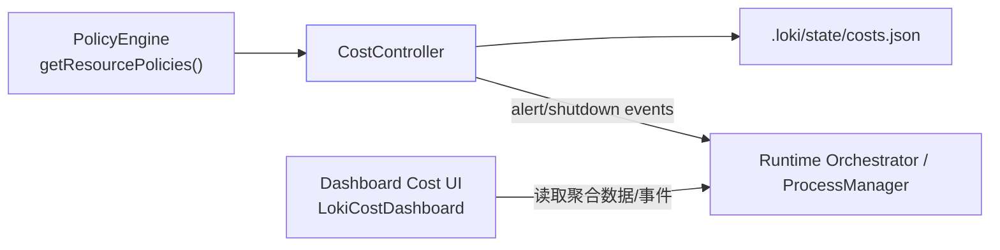
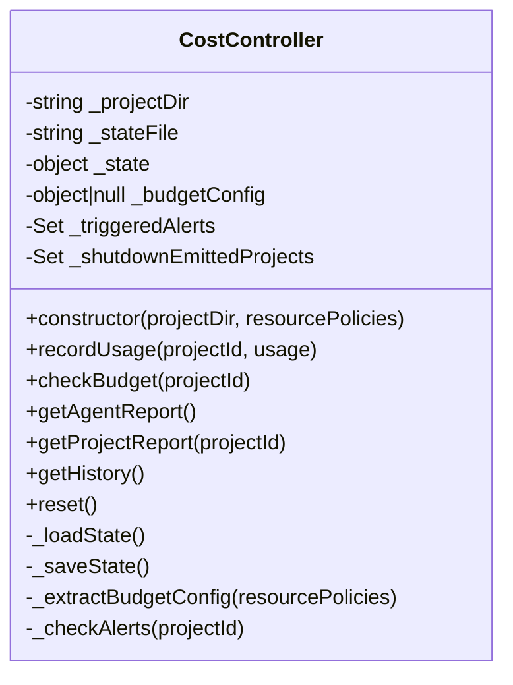
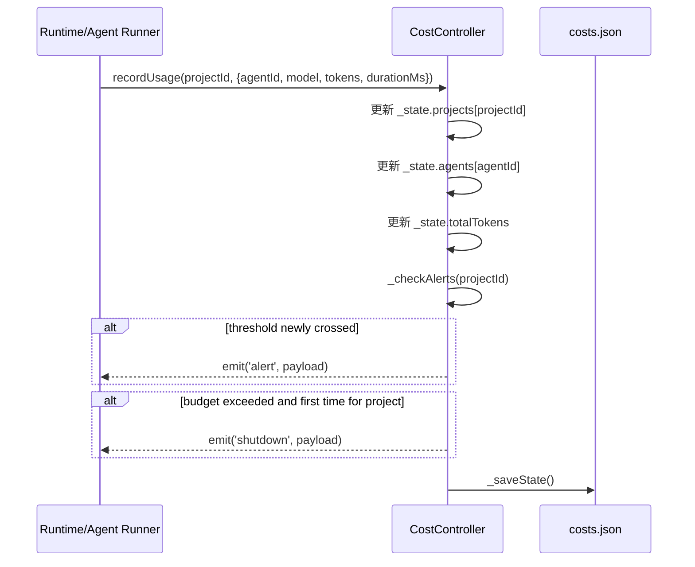

# cost_governance_controller（`src.policies.cost.CostController`）

## 模块概述

`cost_governance_controller` 是 Policy Engine 中负责“运行期成本治理”的核心模块，具体实现为 `src/policies/cost.js` 里的 `CostController`。它的职责不是做策略语义判断（那是 `PolicyEngine` 的工作），而是把策略里关于 `max_tokens` 的预算约束落到真实运行数据上：持续记录 token 消耗、按阈值触发告警、在预算超限时触发 kill switch（`shutdown` 事件），并把治理状态持久化到 `.loki/state/costs.json`。

从系统定位看，这个模块是策略配置与执行运行时之间的桥梁。`PolicyEngine` 提供资源策略定义（如 `max_tokens`、`alerts`、`on_exceed`），`CostController` 负责在每次 agent 调用后做累计、比较、发事件、落盘。它让“预算约束”从静态配置变成了动态治理闭环。

你可以把它理解为一个轻量的本地成本账本 + 事件触发器：账本负责审计与报表，触发器负责运行时治理动作。

---

## 为什么这个模块存在

在多 agent、长会话、跨模型的系统中，token 成本天然会失控，尤其是在以下场景：自动重试、并发 agent 协作、链式工具调用。单纯在策略层做一次性校验（例如 pre-execution）无法覆盖整个运行周期的动态消耗，所以需要一个增量记账、阈值通知和超限熔断的运行时控制器。

`CostController` 解决的是三个关键问题：第一，谁花了多少（per-agent）；第二，项目花了多少（per-project + global）；第三，何时该提醒或中止（alerts + shutdown）。

---

## 与其他模块的关系

`CostController` 在 Policy 子系统中的关系如下。



`PolicyEngine` 负责加载并校验策略（详见 [policy_evaluation_engine.md](policy_evaluation_engine.md)），然后把 `resource` 段交给 `CostController`。`CostController` 并不重新解析整个策略语义，它只提取预算相关字段。触发的 `alert` / `shutdown` 事件会被上层运行时消费，用于提示、限流或终止流程。前端成本看板（参考 [cost_dashboard_component.md](cost_dashboard_component.md)）通常通过后端聚合层间接消费这些结果。

---

## 核心架构与内部状态

### 1) 对象结构



`CostController` 继承自 Node.js `EventEmitter`，因此它天然是事件驱动组件：调用方只需监听事件，不需要侵入其内部逻辑。状态分为内存态（运行时 Set 和 `_state`）与磁盘态（`costs.json`），通过 `_saveState()` 同步。

### 2) 状态文件模型（`costs.json`）

典型结构如下：

```json
{
  "projects": {
    "project-a": {
      "totalTokens": 15320,
      "entries": [
        {
          "agentId": "agent-1",
          "model": "gpt-4o",
          "tokens": 120,
          "durationMs": 530,
          "timestamp": "2026-01-01T12:00:00.000Z"
        }
      ]
    }
  },
  "agents": {
    "agent-1": {
      "totalTokens": 9800,
      "model": "gpt-4o",
      "entries": 42
    }
  },
  "totalTokens": 15320,
  "triggeredAlerts": ["project-a:50", "project-a:80"],
  "history": [
    {
      "type": "alert",
      "threshold": 50,
      "percentage": 54,
      "projectId": "project-a",
      "timestamp": "2026-01-01T12:05:00.000Z"
    }
  ]
}
```

这个模型同时服务于三种需求：实时治理（比较预算）、审计追踪（history）和运维可视化（project/agent report）。

---

## 预算配置提取逻辑

`_extractBudgetConfig(resourcePolicies)` 会遍历 `resourcePolicies`，取**第一个包含 `max_tokens` 的策略项**作为预算配置。

提取字段包括：

- `maxTokens` ← `max_tokens`
- `alerts` ← `alerts`（默认 `[50, 80, 100]`）
- `onExceed` ← `on_exceed`（默认 `'shutdown'`）
- `name` ← `name`

这意味着如果你在 `resource` 中定义了多个预算项，后面的预算配置会被忽略（见“限制与注意事项”）。

策略示例（`policies.json`）：

```json
{
  "policies": {
    "resource": [
      {
        "name": "project-token-budget",
        "max_tokens": 100000,
        "alerts": [60, 85, 100],
        "on_exceed": "shutdown"
      }
    ]
  }
}
```

---

## 核心执行流程

### `recordUsage(projectId, usage)` 的运行路径



该方法是模块最核心入口。它做了三层累计（项目、agent、全局），然后立即进行阈值检查和超限检查，最后持久化状态。调用方通常应在每次模型调用完成后都调用一次，保持成本账本与真实消耗同步。

`usage` 参数字段语义：

- `agentId`: 产生成本的 agent 标识；缺省时写入 `unknown`
- `model`: 模型名；缺省时写入 `unknown`
- `tokens`: 本次消耗 token；缺省视为 `0`
- `durationMs`: 本次耗时；缺省 `0`

副作用包括：修改内存状态、写文件、可能发事件。

---

## 预算判断与事件机制

### `checkBudget(projectId)`

该方法返回预算快照：

- `remaining`: 剩余额度（最小为 0）
- `percentage`: 使用百分比（四舍五入整数）
- `alerts`: 当前已达到的阈值列表
- `exceeded`: 是否已超限（`consumed >= maxTokens`）

若 `projectId` 存在且项目有记录，按项目统计；否则按全局 `totalTokens` 统计。若没有预算配置（未提供 `max_tokens`），返回“无限预算”语义（`remaining: Infinity`）。

### `_checkAlerts(projectId)`

内部会用 `(projectId || 'global') + ':' + threshold` 生成去重键，确保同一项目同一阈值只触发一次 `alert`。超限时会按项目维度触发一次 `shutdown`（通过 `_shutdownEmittedProjects` Set 去重）。

告警事件负载：

```js
{
  threshold,
  percentage,
  projectId,
  remaining
}
```

停机事件负载：

```js
{
  reason: 'Token budget exceeded',
  projectId,
  percentage,
  consumed, // 当前实现为全局 totalTokens
  max
}
```

---

## 对外 API 详解

### `constructor(projectDir, resourcePolicies)`

构造函数会初始化路径、加载状态文件、提取预算配置、恢复历史告警去重集合。`projectDir` 默认当前工作目录，状态文件固定在 `.loki/state/costs.json`。

如果状态文件损坏（JSON parse 失败），会静默回退到空状态启动，不抛错中断流程。

### `recordUsage(projectId, usage)`

写入一次成本样本并触发预算检查。适合在每次 agent/LLM 调用后调用。

### `checkBudget(projectId)`

只读查询方法，用于在 UI、日志或控制平面展示预算进度。

### `getAgentReport()`

返回 agent 维度汇总快照。当前是浅拷贝：顶层对象是新对象，但内部嵌套对象仍是引用。

### `getProjectReport(projectId)`

- 传 `projectId`：返回单项目对象，不存在返回 `null`
- 不传：返回全部项目字典（同样是浅拷贝）

### `getHistory()`

返回 `history` 的数组副本，元素包含 `alert` 和 `shutdown` 事件。

### `reset()`

清空全部累计状态、历史、去重集合并立即写盘。通常只建议在测试或管理员明确操作时使用。

---

## 使用方式与集成示例

### 1) 与 `PolicyEngine` 一起初始化

```js
const { PolicyEngine } = require('./src/policies/engine');
const { CostController } = require('./src/policies/cost');

const engine = new PolicyEngine(process.cwd(), { watch: true });
const cost = new CostController(process.cwd(), engine.getResourcePolicies());

cost.on('alert', (evt) => {
  console.warn('[COST ALERT]', evt);
});

cost.on('shutdown', (evt) => {
  console.error('[COST SHUTDOWN]', evt);
  // 这里触发进程级熔断、停止新任务、通知 UI 等
});
```

### 2) 在运行循环中持续上报 usage

```js
async function runAgentTask(projectId, agentId, model, invokeLLM) {
  const start = Date.now();
  const result = await invokeLLM();
  const durationMs = Date.now() - start;

  cost.recordUsage(projectId, {
    agentId,
    model,
    tokens: result.tokensUsed,
    durationMs,
  });
}
```

### 3) 查询预算和报表

```js
const budget = cost.checkBudget('project-a');
const byAgent = cost.getAgentReport();
const byProject = cost.getProjectReport();
const history = cost.getHistory();
```

---

## 行为边界、错误条件与限制

### 状态与持久化相关

该模块使用同步文件 I/O（`readFileSync` / `writeFileSync`），实现简单直接，但在高频 `recordUsage` 场景下可能带来事件循环阻塞。若你计划在高吞吐环境使用，建议在上层做批量上报或节流。

当状态文件损坏时，模块会自动“重置为空状态”继续运行。这能保证可用性，但代价是历史数据丢失；生产环境建议结合外部备份或审计管道。

### 预算语义相关

预算配置只取第一个含 `max_tokens` 的 resource policy。多个预算策略并存时不会合并，也不会做优先级解析。

若没有 `max_tokens`，`checkBudget()` 永远视为不超限（`remaining: Infinity`），因此不会产生治理事件。

### 输入数据相关

`recordUsage()` 不校验负数 token。如果调用方传入负值，会直接减少累计消耗，导致预算计算失真。建议在调用方或未来扩展中增加输入校验。

`projectId` 若为空，数据会落入 `projects[undefined]` 这类键值风险（取决于调用方式）；同时预算检查会按 global 逻辑与项目逻辑混合，建议强制传入稳定 projectId。

### 事件去重与重启语义

阈值告警去重键会持久化（`triggeredAlerts`），重启后仍能避免重复告警。

但“shutdown 已触发”状态不持久化（仅在内存 Set）。进程重启后，若预算仍超限并再次 `recordUsage`，可能再次发出 `shutdown`。

### 数据增长相关

代码声明了 `MAX_STATE_ENTRIES`，但实际上只用于裁剪 `history`，并未限制每个项目 `entries` 的增长；长周期运行会导致 `projects[*].entries` 持续膨胀。

另外，`history` 的裁剪条件是 `>` 而非 `>=`，会出现短暂超过阈值 1 条的情况。

---

## 扩展建议

如果你要扩展 `CostController`，建议优先考虑以下方向：

- 增加输入校验：确保 `tokens >= 0`、`projectId` 必填、`durationMs` 合法。
- 增加异步或批量持久化：降低同步写盘开销。
- 增加多预算策略支持：例如按 provider/model/project 分类预算。
- 增加可插拔 `onExceed` 动作：除 `shutdown` 外支持 `require_approval`、`throttle` 等。
- 增加深拷贝或只读对象返回：避免外部误改内部状态。

如果预算超限后的流程需要人工审批，可结合 [approval_gate_workflow.md](approval_gate_workflow.md) 设计“超限转审批”链路。

---

## 测试与运维建议

在测试中，建议覆盖以下用例：首次阈值触发、重启后阈值不重复触发、超限 shutdown 仅一次、`reset()` 后状态归零、损坏 `costs.json` 的恢复行为。

在运维中，建议把 `alert` / `shutdown` 事件桥接到统一通知中心，并定期归档 `costs.json`，避免本地状态文件无限增长。前端可通过成本看板组件进行可视化联动（见 [LokiCostDashboard.md](LokiCostDashboard.md) 与 [cost_dashboard_component.md](cost_dashboard_component.md)）。

---

## 相关文档

- 策略评估引擎：[`policy_evaluation_engine.md`](policy_evaluation_engine.md)
- 审批门控流程：[`approval_gate_workflow.md`](approval_gate_workflow.md)
- 成本看板组件：[`cost_dashboard_component.md`](cost_dashboard_component.md)
- Policy Engine 总览：[`Policy Engine.md`](Policy Engine.md)
