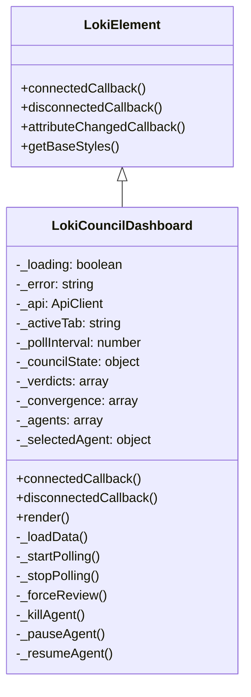
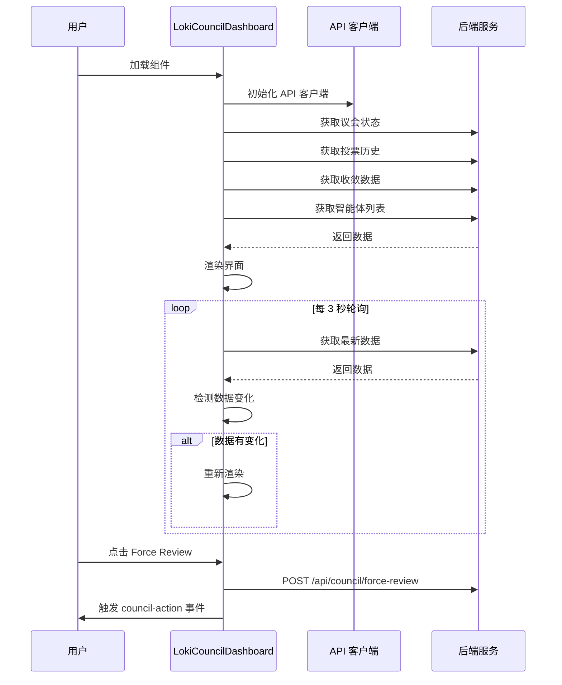
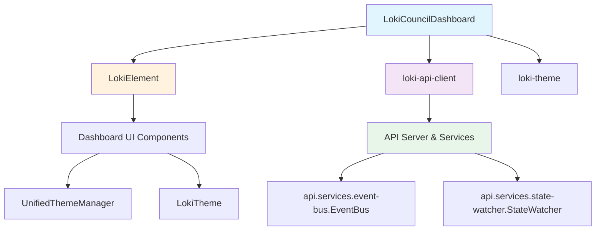
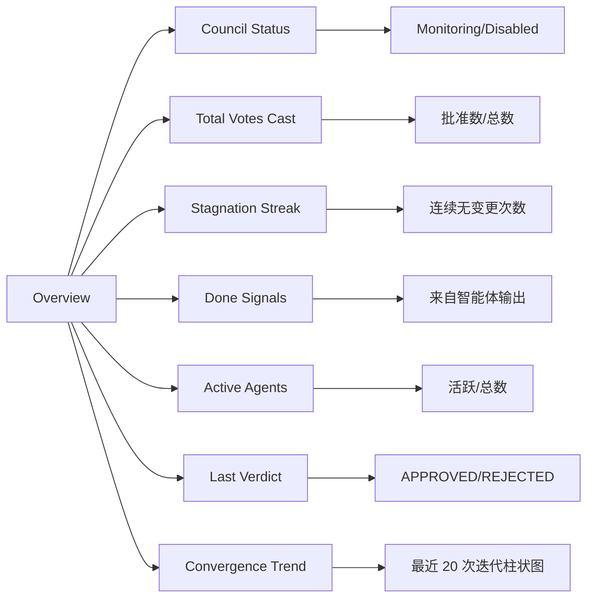
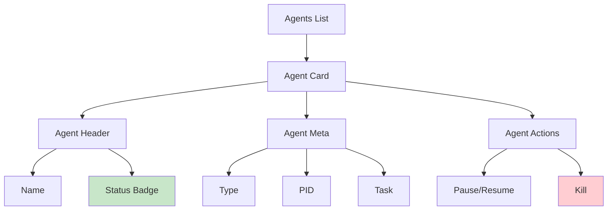
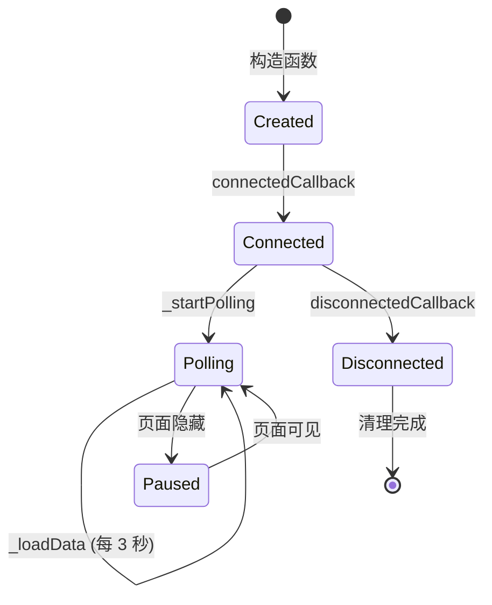

# Council Governance Dashboard (议会治理仪表板)

## 概述

`LokiCouncilDashboard` 组件是 Loki 多智能体系统中的核心治理可视化界面，用于监控和管理 Completion Council（完成议会）的运行状态。该组件为系统管理员和开发者提供了一个集中化的控制面板，可以实时查看议会的决策过程、收敛趋势、投票历史以及参与议会的各个智能体的状态。

Completion Council 是 Loki 多智能体架构中的关键治理机制，它通过多个智能体的集体投票来决定任务是否完成、是否需要继续迭代或是否需要人工干预。议会治理仪表板使操作人员能够透明地观察这一去中心化决策过程，并在必要时进行手动干预。

该组件采用 Web Components 标准构建，基于 `LokiElement` 基类，具有完整的主题支持、影子 DOM 封装和响应式设计。它通过轮询机制每 3 秒自动刷新数据，同时具备页面可见性感知能力，在标签页隐藏时自动暂停轮询以节省资源。

## 架构设计

### 组件层次结构



### 数据流架构



### 模块依赖关系



## 核心功能

### 1. 四标签页导航系统

组件提供四个功能标签页，每个标签页专注于议会治理的不同方面：

| 标签页 | 标识符 | 功能描述 |
|--------|--------|----------|
| Overview | `overview` | 议会整体状态概览，包括关键指标和收敛趋势迷你图 |
| Decision Log | `decisions` | 历史投票决策记录，显示每次议会会议的投票结果 |
| Convergence | `convergence` | 详细的收敛数据分析，包括文件变更趋势和停滞检测 |
| Agents | `agents` | 参与议会的智能体列表及控制界面 |

### 2. 实时数据轮询机制

组件实现了智能轮询系统，确保数据实时性的同时优化资源使用：

```javascript
_startPolling() {
  this._pollInterval = setInterval(() => this._loadData(), 3000);
  this._visibilityHandler = () => {
    if (document.hidden) {
      // 页面隐藏时停止轮询
      if (this._pollInterval) {
        clearInterval(this._pollInterval);
        this._pollInterval = null;
      }
    } else {
      // 页面可见时恢复轮询
      if (!this._pollInterval) {
        this._loadData();
        this._pollInterval = setInterval(() => this._loadData(), 3000);
      }
    }
  };
  document.addEventListener('visibilitychange', this._visibilityHandler);
}
```

**轮询特性：**
- **默认间隔**：3000 毫秒（3 秒）
- **可见性感知**：使用 `visibilitychange` 事件监听器，在标签页隐藏时自动暂停
- **恢复机制**：页面重新可见时立即加载最新数据并恢复轮询
- **资源清理**：组件销毁时自动清除所有定时器和事件监听器

### 3. 智能变更检测

为避免不必要的重新渲染干扰用户交互，组件实现了数据哈希比对机制：

```javascript
const dataHash = JSON.stringify({
  s: this._councilState,
  v: this._verdicts,
  c: this._convergence,
  a: this._agents,
  e: this._error,
});
if (dataHash === this._lastDataHash) return;
this._lastDataHash = dataHash;
this.render();
```

这一机制确保只有在实际数据发生变化时才触发 DOM 更新，提升了用户体验和性能。

### 4. 智能体管理控制

在 Agents 标签页中，用户可以对参与议会的智能体执行以下操作：

| 操作 | 方法 | API 端点 | 说明 |
|------|------|----------|------|
| 暂停 | `_pauseAgent(agentId)` | `POST /api/agents/{id}/pause` | 暂停智能体执行 |
| 恢复 | `_resumeAgent(agentId)` | `POST /api/agents/{id}/resume` | 恢复已暂停的智能体 |
| 终止 | `_killAgent(agentId)` | `POST /api/agents/{id}/kill` | 强制终止智能体（需确认） |

**安全机制：**
- 终止操作需要用户二次确认（`confirm` 对话框）
- 操作成功后自动刷新数据
- 错误处理并显示错误横幅

### 5. 强制审查触发

提供"Force Review"按钮，允许管理员手动触发议会审查流程：

```javascript
async _forceReview() {
  try {
    await this._api._post('/api/council/force-review');
    this.dispatchEvent(new CustomEvent('council-action', {
      detail: { action: 'force-review' },
      bubbles: true,
    }));
  } catch (err) {
    this._error = `Failed to force review: ${err.message}`;
    this.render();
  }
}
```

此操作会：
1. 向后端发送强制审查请求
2. 触发 `council-action` 自定义事件，供父组件监听
3. 在失败时显示错误信息

## API 接口

### 属性（Attributes）

| 属性名 | 类型 | 默认值 | 说明 |
|--------|------|--------|------|
| `api-url` | string | `window.location.origin` | API 基础 URL |
| `theme` | string | 自动检测 | 主题模式：`'light'` 或 `'dark'` |

### 自定义事件（Custom Events）

| 事件名 | 触发时机 | 事件详情 |
|--------|----------|----------|
| `council-action` | 执行议会操作时 | `{ action: 'force-review' \| 'kill-agent' \| 'pause-agent' \| 'resume-agent', agentId?: string }` |

### 后端 API 端点

组件依赖以下后端 API 端点：

```javascript
async _loadData() {
  const [councilState, verdicts, convergence, agents] = await Promise.allSettled([
    this._api._get('/api/council/state'),      // 议会状态
    this._api._get('/api/council/verdicts'),   // 投票历史
    this._api._get('/api/council/convergence'), // 收敛数据
    this._api._get('/api/agents'),             // 智能体列表
  ]);
  // ...
}
```

| 端点 | 方法 | 返回数据结构 | 说明 |
|------|------|--------------|------|
| `/api/council/state` | GET | `{ enabled: boolean, consecutive_no_change: number, done_signals: number, total_votes: number, approve_votes: number, check_interval: number }` | 议会当前状态 |
| `/api/council/verdicts` | GET | `{ verdicts: [{ result: string, iteration: number, approve: number, reject: number, timestamp: string }] }` | 历史投票记录 |
| `/api/council/convergence` | GET | `{ dataPoints: [{ iteration: number, files_changed: number, no_change_streak: number, done_signals: number }] }` | 收敛趋势数据 |
| `/api/agents` | GET | `[{ id: string, name: string, alive: boolean, type: string, pid: number, task: string }]` | 智能体列表 |
| `/api/council/force-review` | POST | - | 触发强制审查 |
| `/api/agents/{id}/kill` | POST | - | 终止智能体 |
| `/api/agents/{id}/pause` | POST | - | 暂停智能体 |
| `/api/agents/{id}/resume` | POST | - | 恢复智能体 |

## 使用指南

### 基本用法

```html
<!-- 基本使用 -->
<loki-council-dashboard></loki-council-dashboard>

<!-- 指定 API 地址 -->
<loki-council-dashboard api-url="http://localhost:57374"></loki-council-dashboard>

<!-- 指定主题 -->
<loki-council-dashboard api-url="http://localhost:57374" theme="dark"></loki-council-dashboard>
```

### 监听议会操作事件

```javascript
const dashboard = document.querySelector('loki-council-dashboard');

dashboard.addEventListener('council-action', (event) => {
  const { action, agentId } = event.detail;
  
  switch (action) {
    case 'force-review':
      console.log('议会强制审查已触发');
      break;
    case 'kill-agent':
      console.log(`智能体 ${agentId} 已被终止`);
      break;
    case 'pause-agent':
      console.log(`智能体 ${agentId} 已暂停`);
      break;
    case 'resume-agent':
      console.log(`智能体 ${agentId} 已恢复`);
      break;
  }
});
```

### 动态配置

```javascript
const dashboard = document.querySelector('loki-council-dashboard');

// 动态更改 API 地址
dashboard.setAttribute('api-url', 'http://new-api-server:8080');

// 动态切换主题
dashboard.setAttribute('theme', 'light');
```

## 界面详解

### Overview 标签页

Overview 标签页提供议会运行的关键指标概览：



**关键指标说明：**

1. **Council Status**：显示议会是否处于监控状态
   - 绿色 "Monitoring"：议会正常运行
   - 灰色 "Disabled"：议会已禁用

2. **Total Votes Cast**：累计投票统计
   - 显示总投票数和批准票数
   - 反映议会活跃程度

3. **Stagnation Streak**：停滞检测
   - 连续无变更迭代次数
   - ≥3 次时显示警告色（橙色）

4. **Done Signals**：完成信号
   - 从智能体输出中检测到的完成信号数
   - ≥2 个时显示成功色（绿色）

5. **Active Agents**：活跃智能体
   - 当前运行的智能体数量
   - 显示活跃数/总数

6. **Last Verdict**：最近裁决
   - 显示最近一次投票结果
   - 包含迭代次数信息

7. **Convergence Trend**：收敛趋势迷你图
   - 最近 20 次迭代的文件变更柱状图
   - 停滞迭代用橙色标识

### Decision Log 标签页

显示议会历史决策记录，按时间倒序排列：

```javascript
_renderDecisions() {
  return this._verdicts.slice().reverse().map(v => `
    <div class="decision-card ${v.result === 'APPROVED' ? 'decision-approved' : 'decision-rejected'}">
      <div class="decision-header">
        <span class="decision-result">${v.result}</span>
        <span class="decision-iter">Iteration ${v.iteration}</span>
        <span class="decision-time">${this._formatTime(v.timestamp)}</span>
      </div>
      <div class="decision-votes">
        <span class="vote-approve">${v.approve} Approve</span>
        <span class="vote-reject">${v.reject} Reject</span>
      </div>
    </div>
  `).join('');
}
```

**决策卡片信息：**
- **结果**：APPROVED（绿色）或 REJECTED（红色）
- **迭代次数**：触发投票的迭代编号
- **时间戳**：决策时间（格式化为本地区域时间）
- **投票分布**：批准票数和拒绝票数

### Convergence 标签页

提供详细的收敛数据分析：

1. **文件变更柱状图**：可视化展示每次迭代的文件变更数量
2. **收敛数据表格**：详细记录每次迭代的指标

| 列名 | 说明 | 警告条件 |
|------|------|----------|
| Iteration | 迭代编号 | - |
| Files Changed | 变更文件数 | - |
| No-Change Streak | 无变更连续次数 | ≥3 时整行橙色高亮 |
| Done Signals | 完成信号数 | - |

### Agents 标签页

显示所有注册智能体并提供控制界面：



**智能体状态指示：**
- **Running**（绿色）：智能体正常运行
- **Stopped**（灰色）：智能体已停止

**操作按钮：**
- 运行中智能体：Pause（暂停）、Kill（终止）
- 已停止智能体：Resume（恢复）

## 样式系统

### CSS 变量依赖

组件依赖以下 Loki 主题 CSS 变量：

```css
/* 颜色变量 */
--loki-text-primary      /* 主文本颜色 */
--loki-text-secondary    /* 次要文本颜色 */
--loki-text-muted        /* 淡化文本颜色 */
--loki-accent            /* 强调色 */
--loki-accent-hover      /* 强调色悬停 */
--loki-accent-muted      /* 淡化强调色 */
--loki-success           /* 成功色（绿色） */
--loki-success-muted     /* 淡化成功色 */
--loki-warning           /* 警告色（橙色） */
--loki-warning-muted     /* 淡化警告色 */
--loki-error             /* 错误色（红色） */
--loki-error-muted       /* 淡化错误色 */
--loki-bg-card           /* 卡片背景 */
--loki-bg-secondary      /* 次要背景 */
--loki-bg-tertiary       /* 第三级背景 */
--loki-bg-hover          /* 悬停背景 */
--loki-border            /* 边框颜色 */
--loki-border-light      /* 淡边框颜色 */

/* 字体 */
'Inter', -apple-system, BlinkMacSystemFont, sans-serif  /* 主字体 */
'JetBrains Mono', monospace                              /* 数字字体 */
```

### 响应式设计

组件使用 CSS Grid 实现响应式布局：

```css
.overview-grid {
  display: grid;
  grid-template-columns: repeat(auto-fit, minmax(160px, 1fr));
  gap: 12px;
}
```

统计卡片会根据容器宽度自动调整列数，最小宽度为 160px。

## 生命周期管理

### 组件生命周期



### 详细生命周期方法

#### 构造函数

```javascript
constructor() {
  super();
  this._loading = false;
  this._error = null;
  this._api = null;
  this._activeTab = 'overview';
  this._pollInterval = null;
  
  // 数据初始化
  this._councilState = null;
  this._verdicts = [];
  this._convergence = [];
  this._agents = [];
  this._selectedAgent = null;
  this._lastDataHash = null;
}
```

#### connectedCallback

```javascript
connectedCallback() {
  super.connectedCallback();
  this._setupApi();      // 初始化 API 客户端
  this._loadData();      // 首次加载数据
  this._startPolling();  // 启动轮询
}
```

#### disconnectedCallback

```javascript
disconnectedCallback() {
  super.disconnectedCallback();
  this._stopPolling();   // 停止轮询，清理事件监听器
}
```

#### attributeChangedCallback

```javascript
attributeChangedCallback(name, oldValue, newValue) {
  if (oldValue === newValue) return;
  
  if (name === 'api-url' && this._api) {
    this._api.baseUrl = newValue;
    this._loadData();
  }
  if (name === 'theme') {
    this._applyTheme();
  }
}
```

## 错误处理

### 错误场景及处理

| 错误场景 | 处理方式 | 用户提示 |
|----------|----------|----------|
| API 请求失败 | 捕获异常，设置 `_error` | 红色错误横幅 |
| 强制审查失败 | 捕获异常，设置 `_error` | "Failed to force review: {message}" |
| 智能体操作失败 | 捕获异常，设置 `_error` | "Failed to {action} agent: {message}" |
| 数据解析失败 | Promise.allSettled 隔离失败 | 部分数据缺失，其他数据正常显示 |

### 错误横幅样式

```css
.error-banner {
  margin-top: 12px;
  padding: 10px 14px;
  background: var(--loki-error-muted);
  border: 1px solid var(--loki-error-muted);
  border-radius: 4px;
  color: var(--loki-error);
  font-size: 12px;
}
```

## 性能优化

### 1. 变更检测优化

使用 JSON 字符串哈希比对避免不必要的渲染：

```javascript
const dataHash = JSON.stringify({
  s: this._councilState,
  v: this._verdicts,
  c: this._convergence,
  a: this._agents,
  e: this._error,
});
if (dataHash === this._lastDataHash) return;
```

### 2. 可见性感知轮询

```javascript
document.addEventListener('visibilitychange', this._visibilityHandler);
```

页面隐藏时停止轮询，减少不必要的网络请求和 CPU 使用。

### 3. 延迟事件绑定

智能体卡片的事件绑定使用 `requestAnimationFrame` 延迟执行：

```javascript
this._pendingRaf = requestAnimationFrame(() => {
  this._pendingRaf = null;
  // 绑定事件监听器
});
```

这确保 DOM 插入完成后再绑定事件，同时允许 `render()` 方法取消过期的回调。

### 4. Promise.allSettled 并行请求

```javascript
const [councilState, verdicts, convergence, agents] = await Promise.allSettled([
  this._api._get('/api/council/state'),
  this._api._get('/api/council/verdicts'),
  this._api._get('/api/council/convergence'),
  this._api._get('/api/agents'),
]);
```

并行发起所有 API 请求，单个请求失败不影响其他数据的获取。

## 扩展与定制

### 添加新标签页

1. 在 `COUNCIL_TABS` 数组中添加新标签定义：

```javascript
const COUNCIL_TABS = [
  { id: 'overview', label: 'Overview' },
  { id: 'decisions', label: 'Decision Log' },
  { id: 'convergence', label: 'Convergence' },
  { id: 'agents', label: 'Agents' },
  { id: 'analytics', label: 'Analytics' },  // 新增
];
```

2. 在 `_renderTabContent` 中添加渲染逻辑：

```javascript
_renderTabContent() {
  switch (this._activeTab) {
    case 'overview': return this._renderOverview();
    case 'decisions': return this._renderDecisions();
    case 'convergence': return this._renderConvergence();
    case 'agents': return this._renderAgents();
    case 'analytics': return this._renderAnalytics();  // 新增
    default: return '';
  }
}
```

3. 实现新的渲染方法：

```javascript
_renderAnalytics() {
  // 自定义渲染逻辑
  return `<div>Analytics content</div>`;
}
```

### 自定义轮询间隔

修改 `_startPolling` 方法中的间隔时间：

```javascript
_startPolling() {
  const POLL_INTERVAL = 5000;  // 改为 5 秒
  this._pollInterval = setInterval(() => this._loadData(), POLL_INTERVAL);
  // ...
}
```

### 添加新的智能体操作

1. 添加操作方法：

```javascript
async _restartAgent(agentId) {
  try {
    await this._api._post(`/api/agents/${agentId}/restart`);
    this.dispatchEvent(new CustomEvent('council-action', {
      detail: { action: 'restart-agent', agentId },
      bubbles: true,
    }));
    await this._loadData();
  } catch (err) {
    this._error = `Failed to restart agent: ${err.message}`;
    this.render();
  }
}
```

2. 在 `_renderAgents` 中添加按钮：

```javascript
<button class="btn btn-sm btn-primary" 
        data-action="restart" 
        data-agent-id="${agent.id || agent.name}">
  Restart
</button>
```

3. 在事件处理器中添加分支：

```javascript
if (action === 'restart') this._restartAgent(agentId);
```

## 相关模块

- [LokiTheme](dashboard_ui_components.md) - 主题系统基础
- [LokiElement](dashboard_ui_components.md) - Web Component 基类
- [API Server & Services](api_server_services.md) - 后端 API 服务
- [Swarm Multi-Agent](swarm_multi_agent.md) - 多智能体系统
- [Policy Engine](policy_engine.md) - 策略引擎（议会决策逻辑）

## 注意事项与限制

### 已知限制

1. **轮询延迟**：3 秒轮询间隔意味着数据最多有 3 秒延迟，不适合需要亚秒级实时性的场景

2. **大数据量性能**：当投票历史或收敛数据点数量极大时（>1000 条），渲染性能可能下降

3. **浏览器兼容性**：依赖现代浏览器特性（Shadow DOM、Custom Elements、`requestAnimationFrame`）

4. **API 错误恢复**：当前实现不会自动重试失败的 API 请求，需要手动刷新或等待下次轮询

### 最佳实践

1. **事件监听清理**：父组件监听 `council-action` 事件时，确保在适当时机移除监听器

2. **API 速率限制**：后端应实施适当的速率限制，防止频繁轮询导致服务器过载

3. **数据分页**：对于大量历史数据，建议后端实现分页，前端相应修改数据加载逻辑

4. **主题一致性**：确保父容器正确设置 Loki 主题 CSS 变量，否则样式可能显示异常

### 调试技巧

```javascript
// 在浏览器控制台检查组件状态
const dashboard = document.querySelector('loki-council-dashboard');
console.log(dashboard._councilState);
console.log(dashboard._verdicts);
console.log(dashboard._agents);

// 手动触发数据加载
dashboard._loadData();

// 检查轮询状态
console.log(dashboard._pollInterval);
```

## 版本历史

| 版本 | 变更说明 |
|------|----------|
| 1.0.0 | 初始版本，包含四个核心标签页和智能体管理功能 |
| 1.1.0 | 添加可见性感知轮询优化 |
| 1.2.0 | 实现数据变更检测，减少不必要的渲染 |
