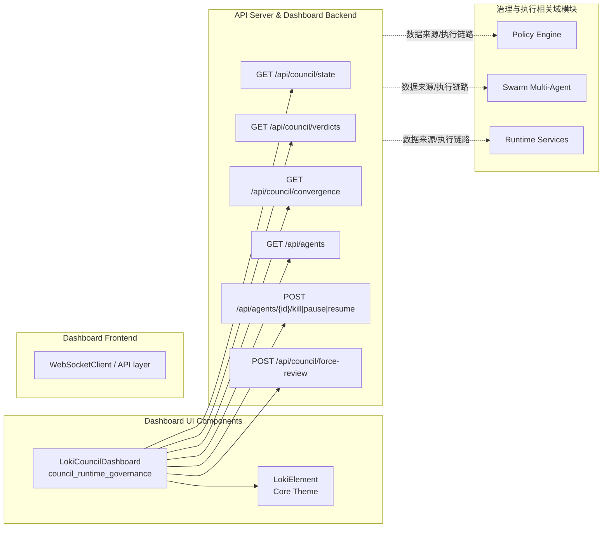
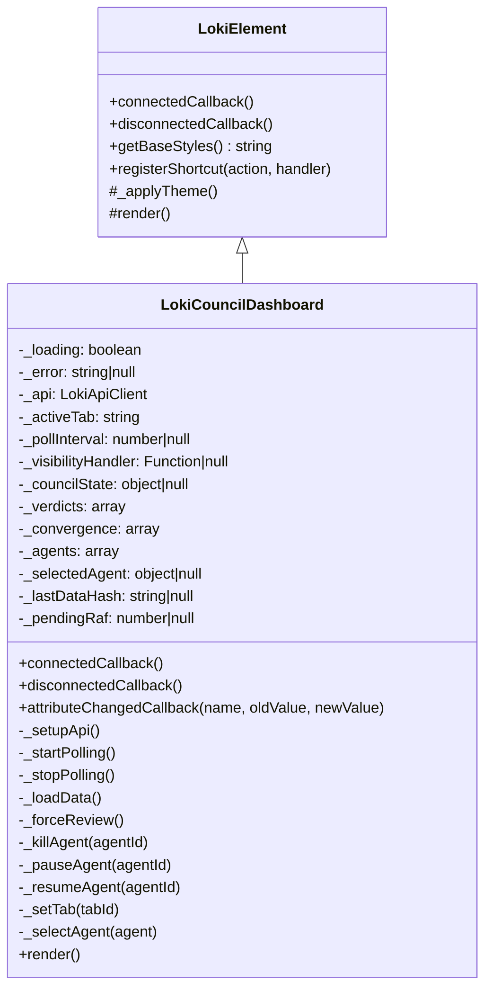
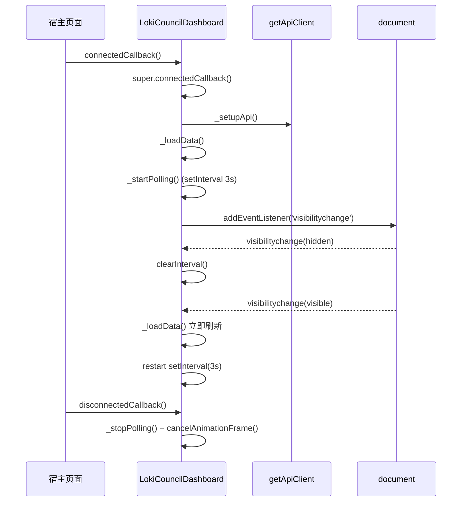
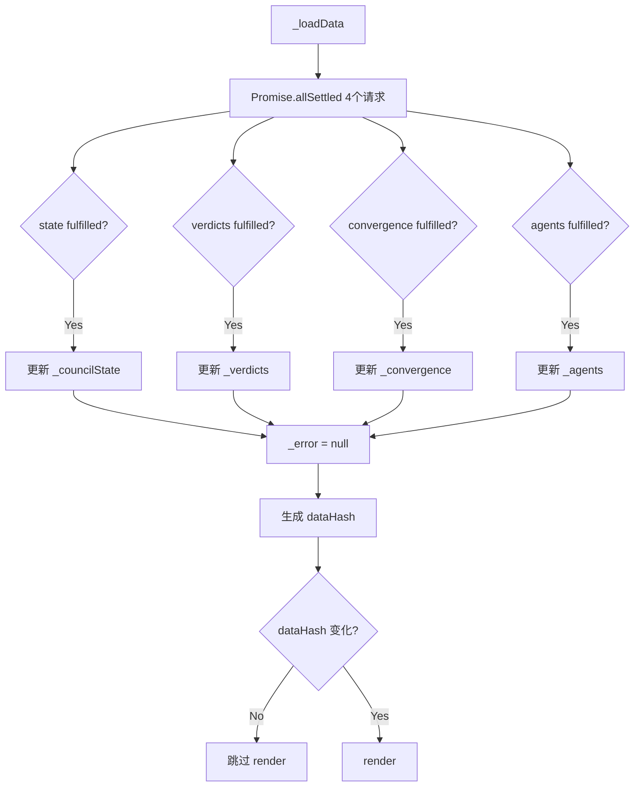
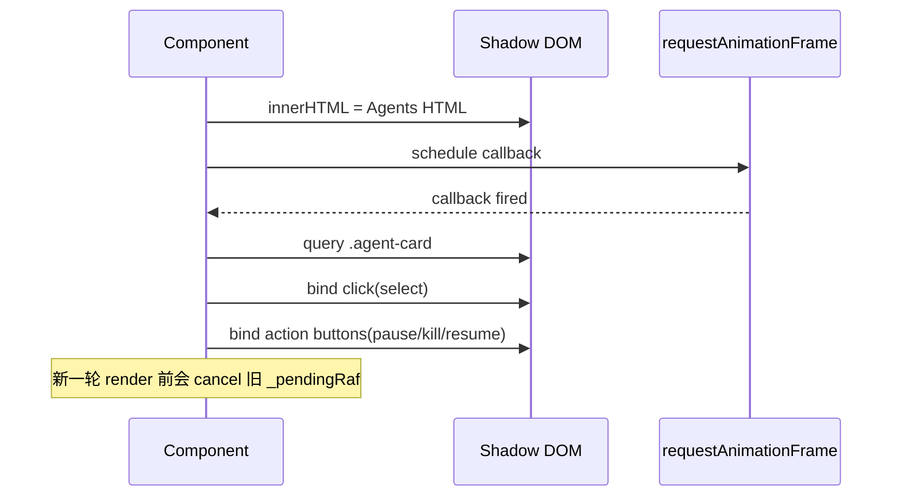

# council_runtime_governance 模块文档

## 模块简介

`council_runtime_governance` 是 Dashboard UI 中“Administration and Infrastructure Components”下的治理可视化子模块，核心实现为 `dashboard-ui.components.loki-council-dashboard.LokiCouncilDashboard`。这个模块的主要职责，不是执行治理策略本身，而是把运行时治理（council 状态、投票结果、收敛趋势、agent 生命周期控制）以可交互的方式呈现在前端，并提供少量人工干预入口（例如 `Force Review`、`Pause/Kill/Resume Agent`）。

从系统设计角度看，它承担的是“控制面观测与操作入口”角色：后端治理逻辑通常由策略引擎、多 agent 协作模块、运行时服务等组件驱动；而本模块将这些结果聚合成四个可理解的视图（Overview / Decision Log / Convergence / Agents），帮助操作者快速判断“当前是否收敛、为什么未收敛、哪个 agent 需要干预”。因此，它存在的根本原因是降低治理系统的人机协同成本，而不是替代自动治理。

需要强调的是：该模块与后端是松耦合的 REST 轮询关系，采用每 3 秒主动拉取数据并在页面不可见时暂停轮询。这使其在实现复杂度与可部署性之间达成了平衡：无需 WebSocket 即可稳定工作，同时避免后台标签页持续打点造成资源浪费。

---

## 在整体系统中的位置

`council_runtime_governance` 处于 Dashboard UI 的展示层，向下依赖 API Server / Dashboard Backend 暴露的治理与 agent 管理端点，向上被宿主页面作为自定义元素 `<loki-council-dashboard>` 使用。



上图表达的核心是：`LokiCouncilDashboard` 不直接依赖 `Policy Engine` 或 `Swarm` 的代码实现，它只依赖后端 API 合同。这样设计使 UI 可以独立演进；只要 API 合同稳定，治理底座可替换。

可参考文档（避免重复）：[Dashboard UI Components.md](./Dashboard%20UI%20Components.md)、[Administration and Infrastructure Components.md](./Administration%20and%20Infrastructure%20Components.md)、[API Server & Services.md](./API%20Server%20%26%20Services.md)、[Policy Engine.md](./Policy%20Engine.md)、[Swarm Multi-Agent.md](./Swarm%20Multi-Agent.md)。

---

## 核心组件：LokiCouncilDashboard

### 设计意图与继承关系

`LokiCouncilDashboard` 继承 `LokiElement`。这意味着它自动获得统一主题系统、基础样式 token、主题变化监听与键盘处理挂载能力。组件在自身 `render()` 中调用 `getBaseStyles()`，再叠加本地样式 `_getStyles()`，实现统一设计语言下的领域化 UI。



### 外部属性（HTML Attributes）

组件声明了 `observedAttributes = ['api-url', 'theme']`。`api-url` 用于指定 API 基地址，默认回退到 `window.location.origin`；`theme` 由基类主题机制应用。`attributeChangedCallback` 中，当 `api-url` 改变且 API 客户端已初始化时，会更新 `baseUrl` 并立即触发一次 `_loadData()`。

这使组件能够在运行时切换环境（例如从 staging 切换到 prod API）而不需要销毁重建。

### 事件

组件在关键操作后通过 DOM 事件对外广播：

- `council-action`：当前仅在 `force-review` 与 `kill-agent` 成功后触发，`bubbles: true`。

注意：`pause/resume` 成功后**不会**派发 `council-action`，这是一个行为不一致点（详见“限制与坑点”）。

### 内部状态与职责划分

组件通过几个内存状态字段驱动 UI：

- `_councilState`：委员会启用状态、票数、streak 等概览指标。
- `_verdicts`：历史 verdict 列表，Decision Log 反向展示。
- `_convergence`：按迭代记录的收敛数据点，用于图表+表格。
- `_agents`：agent 列表，Agents 标签页展示与操作。
- `_selectedAgent`：当前展开操作区的 agent。
- `_lastDataHash`：数据快照哈希，用于跳过无变化重渲染。
- `_pollInterval` / `_visibilityHandler` / `_pendingRaf`：调度与清理相关句柄。

---

## 关键流程与内部工作机制

### 1) 生命周期与轮询调度

组件挂载后依次执行：初始化 API、首轮数据加载、启动轮询。卸载时进行完整清理，避免计时器与事件监听泄漏。



这种策略的好处是实现简单、鲁棒性强；代价是时间分辨率固定（3 秒），不适用于“毫秒级治理信号”场景。

### 2) 并行取数与部分成功容忍

`_loadData()` 使用 `Promise.allSettled` 并行请求四个端点。其核心设计点是“尽可能显示”：即使某些请求失败，成功的请求仍会更新到界面。



这里的关键优化是 `_lastDataHash` 对比：如果四类数据和错误信息序列化后与上次一致，则直接 return，避免全量重绘打断用户操作（例如 Agents 页已展开条目）。

### 3) Tabs 渲染分发

`_renderTabContent()` 是内容分发器：

- `overview` → `_renderOverview()`
- `decisions` → `_renderDecisions()`
- `convergence` → `_renderConvergence()`
- `agents` → `_renderAgents()`

这是一种清晰的“主框架 + 子视图”分层，便于后续扩展新标签页。

### 4) Agents 交互与延迟事件绑定

Agents 页采用 `requestAnimationFrame` 延迟绑定卡片与按钮事件。原因是 `render()` 每次都重写 `shadowRoot.innerHTML`，必须等待 DOM 插入完成后再绑定。组件通过 `_pendingRaf` 保存句柄，下一次 render 前先 cancel，避免“陈旧回调”绑定到过时节点。



---

## API 合同与数据字段语义

### 读操作端点

- `GET /api/council/state`
- `GET /api/council/verdicts`
- `GET /api/council/convergence`
- `GET /api/agents`

### 写操作端点

- `POST /api/council/force-review`
- `POST /api/agents/{agentId}/kill`
- `POST /api/agents/{agentId}/pause`
- `POST /api/agents/{agentId}/resume`

组件中的字段语义可从渲染逻辑反推：

- `consecutive_no_change` 与 `no_change_streak` 用于判断停滞风险；当 streak ≥ 3 时 UI 给出 warning 样式。
- `done_signals` 是来自 agent 输出的完成信号计数，Overview 中高亮阈值是 `>= 2`。
- `lastVerdict.result === 'APPROVED'` 会使用正向状态色。
- `/api/council/verdicts` 期望结构为 `{ verdicts: [...] }`；`/api/council/convergence` 期望为 `{ dataPoints: [...] }`；`/api/agents` 期望直接返回数组。

如果后端合同变更（例如字段改名），该组件不会自动适配。

---

## 方法级参考（行为、参数、返回、副作用）

### `connectedCallback()` / `disconnectedCallback()`

两者是资源生命周期的核心。前者不仅执行初次渲染前的数据装配，还开启周期任务；后者负责撤销 interval、document listener、以及待执行 rAF。副作用是会与全局 `document` 产生监听关系，因此必须确保组件销毁路径可达。

### `attributeChangedCallback(name, oldValue, newValue)`

当 `api-url` 更新时修改 `this._api.baseUrl` 并重新取数；当 `theme` 更新时调用 `_applyTheme()`。它不会重置已有状态（例如当前 tab、已选 agent），因此热切换配置时用户上下文大体可保留。

### `_loadData()`

无参数，异步方法，无显式返回值。它会并行取数、局部更新状态、清理错误、计算哈希、按需重绘。副作用是网络请求 + UI 更新。它是整个模块最关键的“同步点”。

### `_forceReview()`

触发后端强制审查，并在成功时 `dispatchEvent('council-action', {action:'force-review'})`。失败时只更新 `_error` 并 `render()`。

### `_killAgent(agentId)` / `_pauseAgent(agentId)` / `_resumeAgent(agentId)`

三者都调用对应 POST 端点。`_killAgent` 有 `confirm()` 保护，另外成功后会派发 `council-action`；`pause/resume` 则不会派发。三者成功后都会刷新数据（kill 显式 await `_loadData()`；pause/resume 同样 await `_loadData()`）。

### `render()`

每次执行会整体替换 `shadowRoot.innerHTML`，然后调用 `_attachEventListeners()`。这简化了状态驱动渲染，但意味着节点级增量更新不存在，复杂交互控件需要自行保存状态。

### `_renderOverview()` / `_renderDecisions()` / `_renderConvergence()` / `_renderAgents()`

它们分别负责四个视图生成字符串模板。`_renderConvergenceBar()` 被 Overview 与 Convergence 复用，是一个“轻量图表生成器”。`_formatTime()` 用于本地化时间展示，失败回退原值。

---

## 使用与集成

### 基本嵌入

```html
<loki-council-dashboard
  api-url="http://localhost:57374"
  theme="dark">
</loki-council-dashboard>
```

### 监听治理动作

```javascript
const el = document.querySelector('loki-council-dashboard');
el.addEventListener('council-action', (e) => {
  // e.detail: { action: 'force-review' } or { action: 'kill-agent', agentId }
  console.log('[council-action]', e.detail);
});
```

### 与管理类页面协同的实践建议

在运维后台中，通常将该组件与 `loki-notification-center`、`loki-audit-viewer`、`loki-api-keys` 一并使用：前者用于告警聚合，后两者用于审计追踪与权限治理。对应文档见 [loki-notification-center.md](./loki-notification-center.md)、[loki-audit-viewer.md](./loki-audit-viewer.md)、[loki-api-keys.md](./loki-api-keys.md)。

---

## 可扩展性与二次开发建议

如果你要扩展 `council_runtime_governance`，推荐沿着“视图扩展”和“交互语义增强”两个方向。

在视图扩展上，可以新增 tab（例如 `Policies` 或 `Incidents`），做法是扩展 `COUNCIL_TABS` 并在 `_renderTabContent()` 增加分支。由于当前渲染是字符串模板，新增页面成本低，但应注意将事件绑定逻辑放入统一入口，避免遗漏销毁。

在交互语义上，建议统一 action 事件：让 `pause/resume` 也发出 `council-action`，并携带 `statusBefore/statusAfter`，便于宿主应用做审计与埋点。

若希望更实时，可将轮询替换为事件流（如 WebSocket/SSE），但这需要后端配套推送 API，并处理断线重连与消息顺序。当前模块可作为“低耦合基线实现”。

---

## 边界条件、错误条件与已知限制

### 1. 部分失败“静默”风险

`Promise.allSettled` 保证不会因单点失败整体抛错，但当前实现在处理完后直接 `_error = null`。这意味着某一个端点失败时，UI 可能继续显示旧数据且不提示错误。建议改进为：只要存在 rejected，就显示降级告警并标记数据时间戳。

### 2. `_loading` 字段未实际使用

构造器定义了 `_loading`，但渲染逻辑没有 loading 态。首次加载慢时用户可能看到空状态而非 skeleton。建议补齐首屏加载态。

### 3. `agentId` 回退策略可能不稳定

按钮中 `data-agent-id="${agent.id || agent.name}"`，当 `id` 缺失时回退 `name`。如果后端路由严格要求真实 `id`，此回退会导致操作失败。建议前后端统一：无 `id` 则禁用控制按钮。

### 4. 事件语义不一致

`force-review` 与 `kill-agent` 会广播事件，`pause/resume` 不会。这对宿主埋点与审计不友好，属于 API 语义不完整。

### 5. 全量重绘带来的交互重置

每次 `render()` 都重建 DOM。虽然有哈希短路，但一旦数据变化，焦点状态、文本选区等可能丢失。对重交互页面可考虑局部更新或虚拟 DOM。

### 6. 时间展示受本地时区影响

`_formatTime()` 使用 `toLocaleTimeString`，只显示时分，跨时区协同时容易误解。建议在 tooltip 或明细里保留 ISO 时间。

### 7. 依赖浏览器能力

该模块依赖 Custom Elements、Shadow DOM、CSS 变量、`requestAnimationFrame`、Page Visibility API；若目标环境较旧，需要 polyfill 策略。

---

## 测试与运维关注点

建议至少覆盖以下测试场景：

- 页面可见/隐藏切换时，轮询是否正确暂停恢复，且无重复 interval。
- 单端点失败时是否仍能部分渲染；失败提示是否清晰。
- 快速切 tab + 高频数据刷新时，是否出现错绑事件或内存泄漏。
- agent 操作后状态回流是否及时，按钮可用性是否与 `alive` 一致。
- `api-url` 运行时切换后，请求是否真正切到新地址。

运维上应重点观察：前端请求频率（实例数 × 3 秒轮询）、治理端点错误率、用户触发 `force-review` / `kill` 的操作审计链路。

---

## 总结

`council_runtime_governance` 通过一个聚合式 Web Component，把“治理状态可见性”与“人工干预入口”落到同一界面，是 Runtime Governance 场景中的关键操作台。其实现风格偏工程务实：轮询 + 全量模板渲染 + 可见性优化 + 局部性能补丁（哈希短路、rAF 绑定）。

如果你的目标是快速落地并保持低耦合，这个实现已经足够可靠；如果你的目标是高实时性和高审计一致性，建议在事件语义、错误可观测性、以及推送式数据通道上继续演进。
