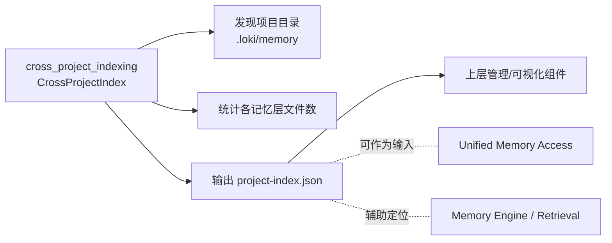
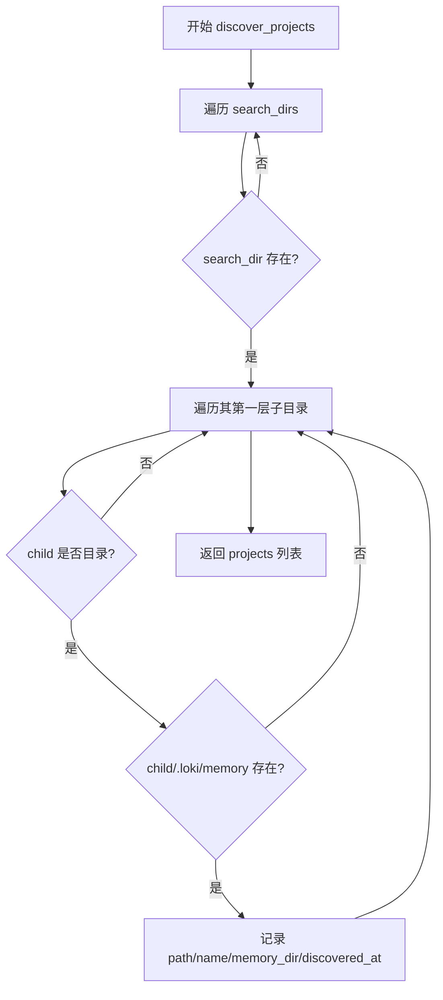
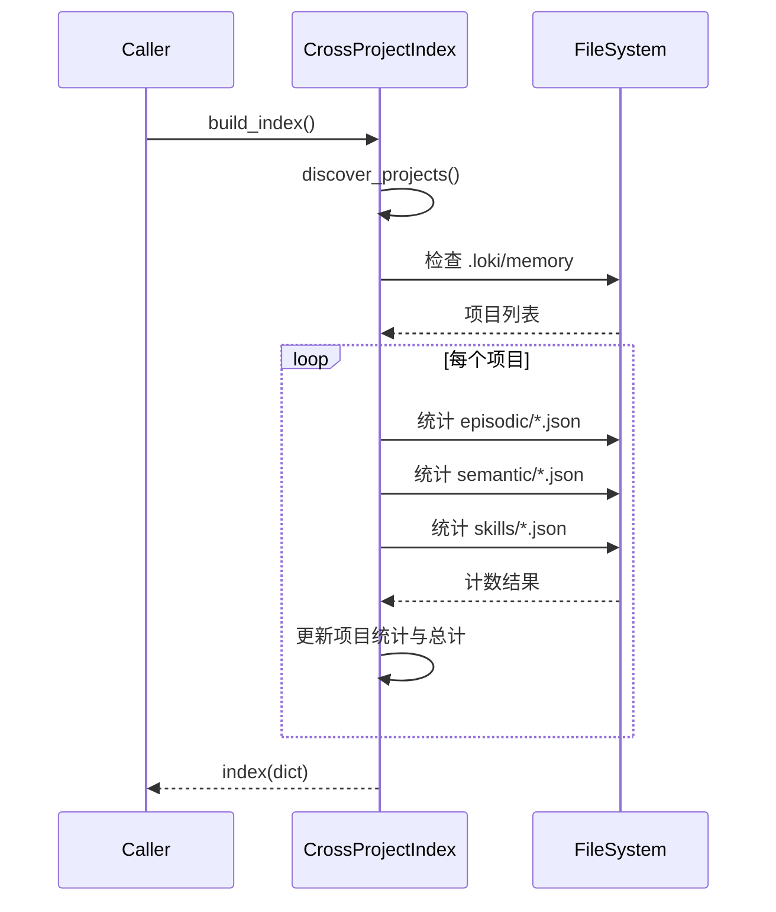

# cross_project_indexing 模块文档

## 模块概述与设计动机

`cross_project_indexing` 模块的核心职责是：在一组预定义的根目录中自动发现“具有 Loki Memory 结构的项目”，并构建一个跨项目的轻量级索引文件。这个索引文件并不存储具体记忆内容，而是存储“项目级元信息与统计量”，例如每个项目的路径、记忆目录位置、发现时间，以及各层记忆（`episodic` / `semantic` / `skills`）中的 JSON 文件数量。

从系统设计角度看，这个模块解决的是“跨项目可见性”问题，而不是“跨项目检索”问题。Memory Engine（参见 [Memory Engine.md](Memory%20Engine.md)）与 Unified Access（参见 [Unified Access.md](Unified%20Access.md)）通常面向单项目工作目录；而 `CrossProjectIndex` 提供一个低成本、弱依赖、可快速扫描的“目录级索引入口”，用于让上层能力知道“有哪些项目可被纳入知识版图”。

这类设计在多仓库工作流中非常实用：当开发者同时维护多个仓库时，系统可以先通过本模块快速建立全局视图，再决定是否在某些项目上做更深层的检索、迁移或分析。

---

## 模块在整体系统中的位置

在模块树中，`cross_project_indexing` 位于 `Memory System` 下，与 `embedding_pipeline`、`core_memory_engine`、`task_aware_retrieval`、`unified_memory_access` 等并列。它的定位更接近“索引编排/发现层”，而非“向量语义层”或“记忆写入层”。



上图体现了一个关键原则：`CrossProjectIndex` 输出的是“导航信息（navigation metadata）”，不是“检索索引（semantic index）”。它可以帮助其他模块定位目标项目，但不会直接参与向量搜索，也不会对记忆条目做打分。

---

## 核心组件：`memory.cross_project.CrossProjectIndex`

### 类职责

`CrossProjectIndex` 是该模块唯一核心类，负责四类操作：

1. 发现候选项目（`discover_projects`）
2. 构建内存索引（`build_index`）
3. 索引持久化与加载（`save_index` / `load_index`）
4. 对外提供项目目录列表（`get_project_dirs`）

它的实现完全基于本地文件系统，无外部服务依赖，也不依赖向量库或数据库，因此部署成本低、可移植性高。

### 初始化参数与状态

```python
CrossProjectIndex(search_dirs=None, index_file=None)
```

- `search_dirs`：可选，扫描根目录列表。若为空，默认扫描：
  - `~/git`
  - `~/projects`
  - `~/src`
- `index_file`：可选，索引保存路径。默认是：
  - `~/.loki/knowledge/project-index.json`
- `_index`：内存缓存（初始为 `None`），用于保存最近一次构建或加载的索引。

这里的设计体现了“约定优于配置”：默认目录覆盖常见开发者仓库布局，开箱可用；但在 CI、容器或企业环境中可以显式传参覆盖。

---

## 关键流程详解

### 1）项目发现流程：`discover_projects()`

该方法会遍历每个 `search_dir` 的**第一层子目录**（深度=1），并检查子目录下是否存在 `.loki/memory`。若存在，即视为“可纳入索引的项目”。



返回值是 `List[dict]`，每个元素包含：

- `path`：项目目录绝对路径字符串
- `name`：项目目录名
- `memory_dir`：`<project>/.loki/memory` 路径
- `discovered_at`：发现时间（UTC ISO 字符串）

### 2）索引构建流程：`build_index()`

该方法先调用 `discover_projects()`，然后为每个项目统计以下目录中的 `*.json` 文件数量：

- `episodic` → `episodic_count`
- `semantic` → `semantic_count`
- `skills` → `skills_count`

同时维护聚合统计：

- `total_episodes`
- `total_patterns`（对应 semantic 数量）
- `total_skills`

最后写入 `self._index` 并返回索引对象。



### 3）持久化与恢复：`save_index()` / `load_index()`

`save_index()` 在 `_index` 不为 `None` 时执行保存。它会先确保父目录存在（`mkdir(parents=True, exist_ok=True)`），再使用 `json.dump(..., indent=2)` 写文件。

`load_index()` 则在索引文件存在时读取 JSON 并回填 `_index`，否则返回 `None`。

### 4）目录接口：`get_project_dirs()`

该方法用于向调用方提供 `Path` 对象列表：

- 若 `_index` 为空，会先触发 `build_index()`
- 返回 `[Path(p['path']) for p in _index['projects']]`

这使得上层模块可以无缝接入后续文件系统操作。

---

## 数据结构说明

`build_index()` 生成的索引结构可概括为：

```json
{
  "projects": [
    {
      "path": "/Users/alice/git/repo-a",
      "name": "repo-a",
      "memory_dir": "/Users/alice/git/repo-a/.loki/memory",
      "discovered_at": "2026-01-01T10:00:00+00:00Z",
      "episodic_count": 12,
      "semantic_count": 8,
      "skills_count": 3
    }
  ],
  "built_at": "2026-01-01T10:00:01+00:00Z",
  "total_episodes": 12,
  "total_patterns": 8,
  "total_skills": 3
}
```

需要注意的是时间字段由 `datetime.now(timezone.utc).isoformat() + 'Z'` 生成，因此可能出现 `+00:00Z` 这种双重 UTC 标记格式。它通常不影响可读性，但对严格时间解析器可能需要兼容处理。

---

## 与相关模块的关系（避免重复）

本模块只负责“跨项目发现与计数”，不负责以下能力：

- 记忆对象定义与校验：见 [schemas_and_task_context.md](schemas_and_task_context.md)
- 单项目记忆读写与检索编排：见 [Memory Engine.md](Memory%20Engine.md)、[Retrieval.md](Retrieval.md)
- 统一入口与会话级记忆调用：见 [Unified Access.md](Unified%20Access.md)
- 渐进式加载策略：见 [Progressive Loader.md](Progressive%20Loader.md)

可以把 `CrossProjectIndex` 看作这些模块前面的“项目导航层”。

---

## 使用方式与示例

### 基础用法

```python
from memory.cross_project import CrossProjectIndex

idx = CrossProjectIndex()
index_data = idx.build_index()
idx.save_index()

print(index_data["total_episodes"])
print(idx.get_project_dirs())
```

### 自定义扫描目录与索引文件

```python
from memory.cross_project import CrossProjectIndex

idx = CrossProjectIndex(
    search_dirs=[
        "/workspace",
        "/mnt/team-repos",
    ],
    index_file="/var/tmp/loki/project-index.json",
)

idx.build_index()
idx.save_index()
```

### 冷启动优先读取已有索引

```python
from memory.cross_project import CrossProjectIndex

idx = CrossProjectIndex()
cached = idx.load_index()

if cached is None:
    cached = idx.build_index()
    idx.save_index()

for p in cached.get("projects", []):
    print(p["name"], p["memory_dir"])
```

---

## 可扩展点与演进建议

当前实现刻意保持简单，但在生产场景可沿以下方向扩展：

1. 深度扫描与过滤策略
   现有逻辑仅扫描深度 1。可增加可配置深度、忽略名单（如 `node_modules` 父目录）、命名规则过滤等。

2. 增量更新
   当前每次 `build_index()` 都全量扫描。可通过目录 mtime、索引快照哈希或文件监听实现增量刷新。

3. 更强的统计维度
   目前只统计文件数，可扩展为总字节数、最近更新时间、错误文件计数、schema 版本分布等。

4. 并发扫描
   当 `search_dirs` 与项目数量很大时，可引入线程池/进程池以降低构建延迟。

5. 索引一致性策略
   可增加 `version` 字段与 schema migration，保证旧索引文件向前兼容。

---

## 边界条件、错误场景与已知限制

### 目录不存在

`discover_projects()` 会直接跳过不存在的 `search_dir`，不会抛异常。这保证了默认目录在不同机器上的兼容性。

### 权限问题

如果扫描目录或写入 `index_file` 无权限，当前实现没有显式 try/except 包装，会向上抛出 `PermissionError` 等系统异常。调用方应在外层做异常处理。

### 只识别 `.loki/memory` 目录存在性

模块并不验证 `episodic/semantic/skills` 子目录是否齐全，也不验证 JSON 内容是否合法，只做“存在 + 文件计数”。因此它不能替代数据健康检查。

### 时间戳格式兼容性

如前所述，`isoformat() + 'Z'` 可能形成 `+00:00Z`。若下游严格要求 RFC3339 标准形式，建议在扩展版本中统一格式化函数。

### 命名语义差异

聚合字段 `total_patterns` 对应 `semantic_count`，这是领域映射（semantic memory = patterns）。新接入方需理解这层语义映射，避免误解为独立目录。

### 性能限制

文件计数采用 `len(list(glob('*.json')))`，在单目录超大文件数时会有额外内存与 IO 开销。可改为流式计数优化。

---

## 维护建议

建议将本模块视为“稳定基础设施层”，保持接口简洁；将复杂策略（过滤、并发、健康校验）放到可选扩展参数或上层 orchestration 模块中，避免破坏当前低耦合特性。

对于长期维护，建议至少补充以下测试：

- 默认目录回退与不存在目录跳过
- 深度=1 扫描边界（子孙目录不应被误收录）
- 三类记忆目录缺失时计数归零
- `save_index` 在 `_index is None` 时不写盘
- `load_index` 文件缺失返回 `None`
- 路径和时间字段序列化稳定性

---

## 总结

`cross_project_indexing` 模块通过一个非常小而清晰的类 `CrossProjectIndex`，实现了跨项目记忆目录的发现、统计与持久化。它不是检索引擎，而是跨项目记忆系统的“入口索引器”。在整个 Memory System 里，它提供了全局导航能力，帮助其他更复杂的模块（检索、统一访问、渐进加载）基于项目边界进行后续处理。
