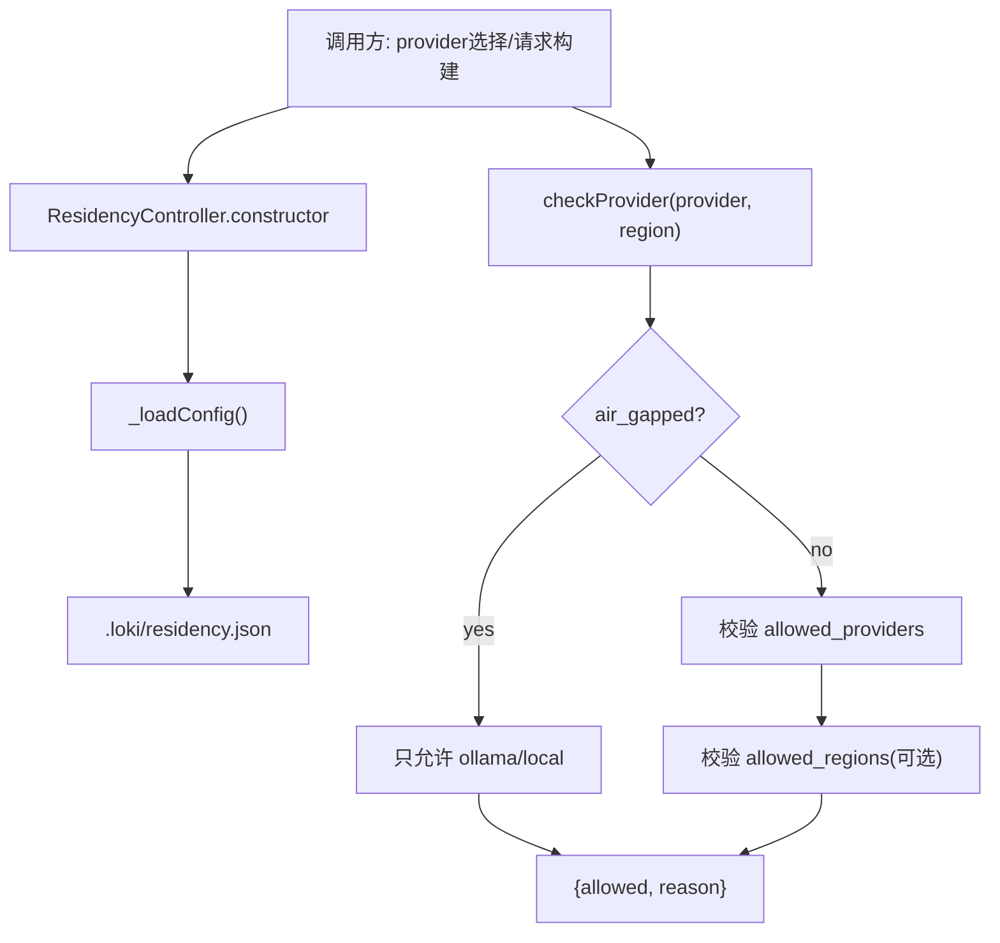

# data_residency_policy_control

`data_residency_policy_control` 模块的核心是 `src.audit.residency.ResidencyController`。它解决的不是“能不能调模型”这种功能问题，而是“在合规边界内调模型”这个治理问题：当系统能接入多个 LLM provider 时，必须确保调用只发生在允许的供应商和地域里，且在 air-gapped（隔离网络）场景下只能走本地模型。这个控制器就是一层“合规闸门”，在请求真正发出前先做准入判断，避免把合规决策散落到各个业务调用点。

## 模块为什么存在：问题空间先于实现

如果没有统一控制层，最朴素的做法通常是：每个调用 provider 的地方各自写一段 `if provider === ...` 或 `if region in ...`。这种方案短期快，但很快会出现三类问题。第一，规则复制导致漂移，不同路径行为不一致。第二，策略变更（比如新增禁止区域）需要全仓库搜改，容易漏。第三，air-gapped 这类“全局优先级规则”很难保证被每个调用点都正确覆盖。

`ResidencyController` 的设计意图是把这些决策收敛为单点：配置集中加载、判断逻辑集中执行、返回统一的 `{ allowed, reason }` 结构。它不是执行器（不负责发请求），而是策略裁决器（负责回答“能不能做”以及“为什么不行”）。

## 心智模型：它是“出境安检口”，不是“航班系统”

可以把这个模块想象成机场出境安检：

- provider 相当于“航空公司”；
- region 相当于“目的地”；
- `allowed_providers` / `allowed_regions` 是政策白名单；
- `air_gapped` 是紧急管制开关，一旦开启就只允许“本地出行”。

安检口不负责买票（不调用外部 API），只负责“放行/拦截 + 拦截原因”。这种职责边界让调用方可以自由决定后续动作：直接拒绝、回退到本地 provider、或触发审计记录。

## 架构与数据流



从运行时看，关键路径非常短：实例化时加载一次配置，请求时调用 `checkProvider` 做纯内存判断。`reload()` 是显式刷新入口，用于策略文件变更后的热更新。该模块只依赖 Node 内置 `fs` 与 `path`，没有外部服务依赖，因此故障面小、可预测性高。

需要明确的一点：基于当前提供的组件信息，无法确认仓库中哪些具体上游组件“直接调用”了 `ResidencyController`（未提供 `depended_by` 明细）。因此这里的数据流描述聚焦于模块内部与配置文件契约，不对具体调用链做未经证实的断言。

## 组件深潜

## `class ResidencyController`

构造函数签名：`constructor(opts)`，支持两个输入来源：

- `opts.projectDir`：决定配置文件路径，最终拼成 `path.join(projectDir, '.loki', 'residency.json')`；
- `opts.config`：直接注入配置对象（主要用于测试或内存场景）。

设计上它优先使用 `opts.config`，否则走磁盘加载。这是典型的“依赖注入优先，文件系统兜底”模式：方便测试、也方便离线运行。

### `checkProvider(provider, region)`

返回值固定为 `{ allowed: boolean, reason: string | null }`。这是一个很实用的契约：既能做程序分支（看 `allowed`），又能给 UI/日志提供可解释反馈（看 `reason`）。

内部顺序是有意设计的：

1. 先判空 provider；
2. provider 统一小写化；
3. **优先处理 `air_gapped`**（短路）；
4. 校验 provider 白名单；
5. 在传入了 `region` 的前提下校验区域白名单。

这个顺序体现了规则优先级：air-gapped 是全局最高约束，后续白名单在其之后才有意义。

### `getConfig()` / `getAllowedProviders()` / `getAllowedRegions()`

这些读取方法都返回 `.slice()` 副本，而不是内部数组引用。目的很直接：避免外部意外改写控制器内部状态。这是一种轻量防御性复制。

### `isAirGapped()`

语义非常窄：只回答当前配置是否开启 air-gapped。保持方法单一职责，避免把“是否允许某 provider”这种上下文相关判断塞进布尔 getter。

### `reload()`

显式触发 `_loadConfig()`，覆盖当前内存配置。这个接口意味着模块默认不是“文件监听器”，而是“按需刷新器”：简单、可控，但调用方要承担“何时刷新”的责任。

### `_loadConfig()`（私有）

它体现了“容错优先于中断”：读取/解析失败时不会抛错，而是回落到默认策略。

加载成功时会做部分规范化：

- `allowed_providers` 被强制转小写；
- `allowed_regions` 仅做数组判定，不做大小写规范化；
- `air_gapped` 只有严格 `=== true` 才生效。

加载失败或文件不存在时的默认值：

- `allowed_providers: DEFAULT_ALLOWED_PROVIDERS`（默认空数组）；
- `allowed_regions: []`；
- `air_gapped: false`。

其中“空数组表示不限制”是该模块最关键的语义之一。

## 常量与隐含契约

`PROVIDER_REGIONS` 定义了 provider 到已知区域的映射（如 `anthropic -> ['us','eu']`），但当前 `checkProvider` **并未使用**这份映射做强校验。它更像一个“知识常量/对外导出参考”，而不是执行中的硬规则。

这意味着当前模块的实际策略来源是配置文件，而不是内置 provider 能力表。好处是灵活，代价是你可以配置出“逻辑上不合理但代码不拦截”的组合。

## 依赖关系分析

从代码可验证的依赖非常清晰：

- 本模块调用：Node `fs`（`existsSync`, `readFileSync`）与 `path.join`；
- 本模块不调用：网络、数据库、消息总线等外部系统；
- 本模块导出：`ResidencyController`, `PROVIDER_REGIONS`, `DEFAULT_ALLOWED_PROVIDERS`。

从模块树语义上，它位于 [Audit](Audit.md) 下，与 [tamper_evident_audit_log](tamper_evident_audit_log.md) 同层。职责上，`ResidencyController` 偏“前置准入控制”，而 `AuditLog` 偏“事后可验证留痕”，两者可以形成治理闭环，但当前提供代码中未显示它们的直接调用关系。

## 设计取舍与权衡

这个实现选择了“最小可用治理内核”，有几个很典型的 tradeoff。

首先是同步 I/O（`readFileSync`）而非异步。优点是实现短、行为确定，且配置加载只发生在构造与 `reload()`，不是高频路径；缺点是如果调用方在请求热路径中频繁 `reload()`，会阻塞事件循环。

其次是失败回退默认策略，而不是失败即拒绝（fail-closed）。当前行为更偏“可用性优先”：配置损坏时系统还能跑；但对合规场景来说，这可能带来“意外放行”风险，尤其默认 `allowed_providers` 为空数组代表全放开。

再次是“策略执行逻辑”与“provider-region 能力知识”分离。当前执行只看配置，不看 `PROVIDER_REGIONS`。这降低了耦合，提高配置自由度，但把正确性压力转移给配置维护者。

## 使用方式与示例

### 1) 文件配置驱动

`.loki/residency.json`：

```json
{
  "allowed_providers": ["anthropic", "ollama"],
  "allowed_regions": ["us", "eu"],
  "air_gapped": false
}
```

调用示例：

```javascript
const { ResidencyController } = require('./src/audit/residency');

const residency = new ResidencyController({ projectDir: process.cwd() });

const decision = residency.checkProvider('Anthropic', 'us');
if (!decision.allowed) {
  throw new Error(`Residency blocked: ${decision.reason}`);
}
```

### 2) 测试注入配置

```javascript
const residency = new ResidencyController({
  config: {
    allowed_providers: ['ollama'],
    allowed_regions: ['local'],
    air_gapped: true,
  },
});
```

这种方式适合单元测试，不依赖磁盘文件。

### 3) 运行时刷新

```javascript
residency.reload();
```

适用于外部配置已变更、需要重新生效的场景。

## 新贡献者最该注意的坑

第一，`allowed_regions` 只在调用 `checkProvider` 时传入 `region` 才生效。如果上游忘传 region，会绕过区域限制。

第二，`_loadConfig()` 会将输入 region 小写比较，但不会把配置中的 `allowed_regions` 统一小写。也就是说配置写成 `"US"`，调用传 `"us"` 会被拒绝。

第三，`air_gapped` 开启后直接短路，仅允许 `ollama` 或 `local`，不会再看 provider/region 白名单。调试时不要误以为白名单“失效”，这是设计优先级。

第四，构造时传 `opts.config` 虽然可覆盖初始配置，但后续调用 `reload()` 会从磁盘重新加载并覆盖注入值。这在测试里很容易造成“配置突然变化”的误判。

第五，配置读取异常被吞掉并回退默认值，没有内建告警。若你在高合规环境使用，建议在调用层增加配置有效性检查或配合审计事件上报。

## 可演进方向（基于当前实现推导）

如果后续要增强合规强度，可以优先考虑三件事：

- 将解析失败策略改为可配置的 fail-open / fail-closed；
- 对 `allowed_regions` 在加载时做小写规范化；
- 把 `PROVIDER_REGIONS` 变成可选强校验（例如“配置中声明的 region 必须是该 provider 支持集的子集”）。

这些改动都能在不破坏 `checkProvider` 返回契约的前提下逐步引入。

## 参考

- [Audit](Audit.md)
- [tamper_evident_audit_log](tamper_evident_audit_log.md)
- [policy_evaluation_engine](policy_evaluation_engine.md)
