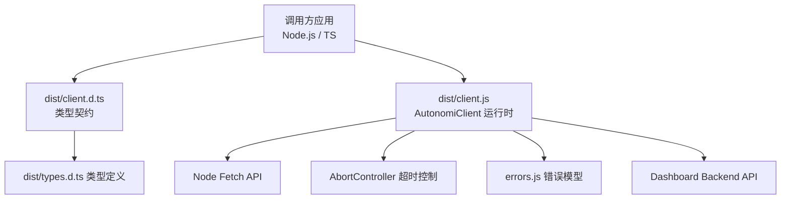
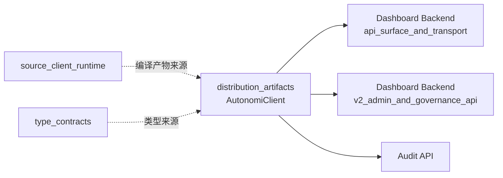
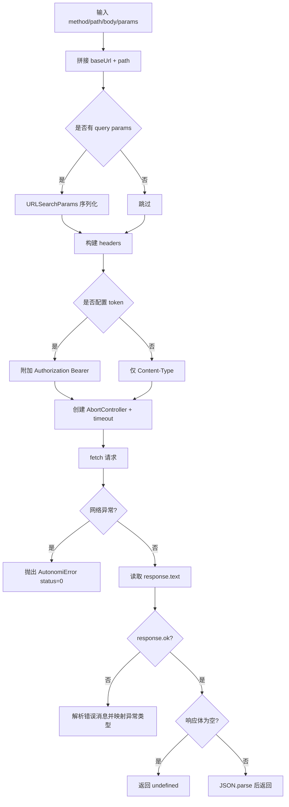
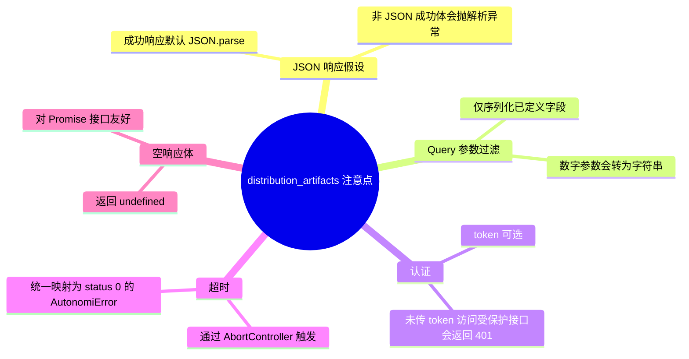

# distribution_artifacts 模块文档

## 模块概述

`distribution_artifacts` 是 TypeScript SDK 在发布（`dist/`）阶段暴露给最终使用者的运行时代码与类型声明集合，核心由 `sdk/typescript/dist/client.js` 与 `sdk/typescript/dist/client.d.ts` 构成。它的存在意义并不只是“复制源码产物”，而是提供一个稳定、可直接安装并运行的 API 客户端入口：开发者无需关心 SDK 源码编译流程，只需要依赖发行包中的 `AutonomiClient` 即可访问控制平面（Control Plane）接口。

从设计上看，这个模块承担了“发布契约（distribution contract）”角色。`client.js` 负责真正执行 HTTP 请求、鉴权、超时控制和错误映射；`client.d.ts` 负责向 TypeScript 消费方暴露精确的类型签名，使调用侧在编译阶段即可获得参数与返回值约束。两者组合后，实现了“运行时可用 + 编译时可验证”的双层保障。

在整个系统中，该模块位于 **TypeScript SDK / client_core / distribution_artifacts** 节点，它面向的上游是 Dashboard Backend 的 REST API（尤其是 `api_surface_and_transport` 与 `api_v2` 相关接口），下游是 Node.js 应用、CLI 工具、Web 服务中需要通过 SDK 进行项目、任务、运行、租户和审计操作的调用方。

---

## 组件与职责

### 1) `sdk.typescript.dist.client.AutonomiClient`（运行时实现）

`AutonomiClient` 是模块唯一的核心运行时类。它对外提供资源分组明确的方法（Projects/Tasks/API Keys/Runs/Tenants/Audit），对内通过统一的 `_request` 方法处理所有 HTTP 交互细节。这种结构带来的主要收益是行为一致性：所有 API 调用都共享同一套 URL 组装、请求头策略、错误转换与超时机制。

### 2) `sdk.typescript.dist.client.d.AutonomiClient`（类型声明）

`.d.ts` 文件中声明了与运行时同名同方法签名的 `AutonomiClient`。这部分并不执行业务逻辑，但定义了调用合同，包括：

- 构造参数 `ClientOptions`
- 各资源方法的参数类型（如 `projectId: number`）
- 各返回结果类型（如 `Promise<Project[]>`、`Promise<RunEvent[]>`）

该声明文件确保发行包消费者在 IDE 与编译阶段获得自动补全、参数检查和返回类型推断。

---

## 模块架构



该架构体现了发布包的双轨职责：`client.js` 执行网络请求，`client.d.ts` 提供静态类型能力。`errors.js`（见 [error_model.md](error_model.md)）用于把后端状态码转译为语义化异常，避免调用方只能处理模糊的网络错误字符串。

---

## 与其他模块的关系

`distribution_artifacts` 本身不实现业务规则，它是“业务 API 的客户端入口层”。因此它强依赖后端接口稳定性与类型约定一致性：



`source_client_runtime`（即 `sdk.typescript.src.client.AutonomiClient`）是发行代码的源码来源，建议配合阅读 [source_client_runtime.md](source_client_runtime.md) 了解“源码实现意图”；类型细节建议参考 [type_contracts.md](type_contracts.md)。本文聚焦“dist 产物的行为契约”，避免重复类型字段定义细节。

---

## 核心流程：统一请求管线 `_request`

`_request` 是整个客户端最关键的方法，所有公开 API 都经由它转发。它的内部流程如下：



这个流程展示了一个关键设计选择：SDK 不让每个业务方法各自处理网络细节，而是通过统一通道实现标准化行为，从而降低维护成本并保持跨接口一致的异常语义。

---

## 公共 API 详解

以下按资源域说明每个方法的行为、参数与返回值。

### 构造函数

`constructor(options: ClientOptions)` 接收以下配置：

- `baseUrl: string`：后端基地址。内部会去掉末尾 `/`，防止路径拼接出现双斜杠。
- `token?: string`：可选 Bearer Token。存在时会自动写入 `Authorization` 请求头。
- `timeout?: number`：可选超时毫秒数，默认 `30000`。

该构造不做网络探测；如果配置错误（例如 URL 指向错误服务），会在首次请求时暴露。

### 状态接口

`getStatus(): Promise<Record<string, unknown>>` 调用 `GET /api/status`。通常用于服务健康检查、联通性验证、启动探活。

### Projects

`listProjects()` 拉取项目集合；`getProject(projectId)` 拉取单个项目；`createProject(name, description?)` 创建项目。`description` 仅在显式传入时写入请求体，不会发送空字段。

### Tasks

`listTasks(projectId?, status?)` 支持可选筛选。注意内部会把 `projectId` 转为字符串并序列化到 query 中（键名 `project_id`）。

`getTask(taskId)` 读取任务详情，`createTask(projectId, title, description?)` 创建任务。创建请求体始终包含 `project_id` 与 `title`，可选带 `description`。

### API Keys

`listApiKeys()` 查询密钥列表；`createApiKey(name, role?)` 创建并返回密钥对象（包含一次性 token）；`rotateApiKey(identifier, gracePeriodHours?)` 触发轮换；`deleteApiKey(identifier)` 删除密钥。

`rotateApiKey` 中 `grace_period_hours` 只在传入时发送，这是为了兼容后端默认策略。

### Runs

`listRuns(projectId?, status?)` 查询运行记录；`getRun(runId)` 拉取运行详情；`cancelRun(runId)` 取消运行；`replayRun(runId)` 重放运行；`getRunTimeline(runId)` 获取事件时间线。

这些方法集中面向 Dashboard Backend 的 v2 运行管理接口，适用于自动化编排与运行态审计。

### Tenants

`listTenants()`、`getTenant(tenantId)`、`createTenant(name, description?)`、`deleteTenant(tenantId)` 对应租户生命周期管理。

### Audit

`queryAudit(params?)` 支持 `start_date`、`end_date`、`action`、`limit` 等筛选参数，内部按有值字段构造 query。`verifyAudit()` 调用 `GET /api/audit/verify`，返回完整性校验结果（如 `valid`、`entries_checked`）。

---

## 错误处理与异常语义

`_request` 会将错误分为三类：

1. **网络层异常/请求中断**：例如 DNS 失败、连接断开、超时触发 `AbortController`。此时抛出 `AutonomiError(msg, 0)`，状态码固定为 `0`。
2. **HTTP 非 2xx**：根据状态码映射为语义化错误：
   - `401 -> AuthenticationError`
   - `403 -> ForbiddenError`
   - `404 -> NotFoundError`
   - 其他 -> `AutonomiError(message, statusCode, rawText)`
3. **响应解析问题**：成功状态下默认执行 `JSON.parse(responseText)`；若后端返回非 JSON 文本会抛出原生解析异常（当前实现未二次包装）。

错误消息提取策略为：优先尝试读取 JSON 中 `error` / `message` / `detail` 字段，若解析失败则使用原始文本。这保证了后端错误格式轻微变化时，调用方仍可获得可读信息。

---

## 典型使用方式

```ts
import { AutonomiClient } from 'sdk/typescript/dist/client.js';

const client = new AutonomiClient({
  baseUrl: 'https://control-plane.example.com',
  token: process.env.AUTONOMI_TOKEN,
  timeout: 15000,
});

async function demo() {
  const status = await client.getStatus();
  console.log('status:', status);

  const project = await client.createProject('SDK Demo', 'created from dist client');
  const task = await client.createTask(project.id, 'First task');

  const runs = await client.listRuns(project.id, 'running');
  console.log({ project, task, runsCount: runs.length });
}

demo().catch((err) => {
  // 可结合 error_model.md 中的异常类型进行精细化处理
  console.error(err);
});
```

审计查询示例：

```ts
const entries = await client.queryAudit({
  start_date: '2026-01-01T00:00:00Z',
  end_date: '2026-01-31T23:59:59Z',
  action: 'task.create',
  limit: 200,
});

const verify = await client.verifyAudit();
console.log('audit valid:', verify.valid, 'checked:', verify.entries_checked);
```

---

## 配置建议与运维注意事项

在生产环境中，建议将 `baseUrl` 与 `token` 通过配置中心或环境变量注入，避免硬编码。`timeout` 应根据网络环境与后端 SLA 调整：过短会导致大量误判超时，过长会拖慢故障恢复与重试节奏。

由于当前客户端未内建重试机制、退避策略或熔断能力，调用方在高可用场景中应在外层补充重试封装（尤其是幂等读取接口），并结合请求 ID、日志与监控打通诊断链路。需要更强韧性的协议控制可参考系统中的 MCP 可靠性模块文档（例如 [circuit_breaker_resilience.md](circuit_breaker_resilience.md)），但两者职责不同，不应直接混用。

---

## 边界条件、限制与已知行为



需要特别关注以下行为约束：

- 客户端默认发送 `Content-Type: application/json`，即使 `GET` 请求也会附带该头；通常无害，但极少数网关策略可能对此敏感。
- `params` 仅接受 `Record<string, string>`，如果扩展新接口需要复杂数组或嵌套参数，必须先定义序列化策略。
- 返回类型依赖 `.d.ts` 合同；若后端字段演进而未同步发布 SDK，会出现“运行时字段变化但类型未更新”的漂移风险。
- `createApiKey` 返回中包含 `token`，通常只在首次创建可见，调用方应立即安全存储，不要写入普通日志。

---

## 扩展指南

当你要在 `distribution_artifacts` 中新增 API 方法时，推荐遵循现有模式：

1. 在 `client.js` 中新增语义化方法，内部只做参数整理并调用 `_request`。
2. 在 `client.d.ts` 中同步新增签名与返回类型。
3. 在 `types.d.ts` 中补齐对应实体类型。
4. 确保路径版本一致（`/api/...` vs `/api/v2/...`）。
5. 为错误码语义特殊的接口评估是否需要补充新的错误类型（参考 [error_model.md](error_model.md)）。

示例（伪代码）：

```ts
// client.js
async pauseRun(runId) {
  return this._request('POST', `/api/v2/runs/${runId}/pause`);
}

// client.d.ts
pauseRun(runId: number): Promise<Run>;
```

---

## 测试与验证建议

建议至少覆盖三层测试：

- **契约测试**：校验每个方法是否命中正确路径、方法与查询参数键名。
- **错误映射测试**：模拟 401/403/404/500，验证抛出异常类型是否符合预期。
- **超时与空响应测试**：验证 `AbortController` 行为与 `204 No Content -> undefined` 返回逻辑。

如果你的团队同时维护源码与发布物，建议在 CI 中增加“源码 API 与 dist 声明一致性检查”，防止 `src` 与 `dist` 漏同步。

---

## 参考文档

- [source_client_runtime.md](source_client_runtime.md)（源码客户端实现，便于理解开发期逻辑）
- [type_contracts.md](type_contracts.md)（SDK 类型定义总览）
- [error_model.md](error_model.md)（异常体系与错误处理约定）
- [api_surface_and_transport.md](api_surface_and_transport.md)（Dashboard Backend API 入口层）
- [v2_admin_and_governance_api.md](v2_admin_and_governance_api.md)（v2 管理面 API 范围）
